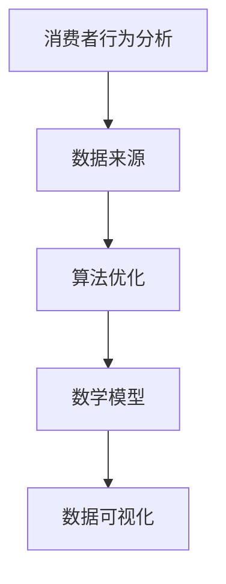

                 

关键词：营销效果分析、电商策略、数据驱动、消费者行为、算法优化、用户留存、转化率提升、个性化推荐、广告投放优化

> 摘要：本文将探讨如何通过营销效果分析优化电商策略。我们首先介绍了电商营销效果分析的核心概念和联系，然后深入讲解了营销效果分析的核心算法原理和具体操作步骤。接着，我们详细阐述了营销效果的数学模型和公式，并通过案例分析和讲解加深了读者的理解。此外，我们还通过代码实例展示了如何实现营销效果分析的具体步骤。最后，我们讨论了营销效果分析在实际应用场景中的重要性，以及未来的应用展望和面临的挑战。

## 1. 背景介绍

随着互联网技术的不断发展，电子商务已经成为全球商业活动的重要组成部分。电商平台的竞争日益激烈，如何通过有效的营销策略吸引和留住消费者成为了电商企业关注的焦点。然而，传统的营销策略往往缺乏数据支持和科学分析，难以实现精准投放和高效转化。因此，如何利用数据驱动的方式优化电商策略，提升营销效果，成为了当前电商领域亟待解决的问题。

本文旨在通过介绍营销效果分析的核心概念和算法原理，为电商企业提供一种科学的数据驱动营销策略。通过对消费者行为的深入分析和算法优化，帮助企业提升用户留存率、提高转化率，实现营销效果的持续优化。

## 2. 核心概念与联系

在营销效果分析中，我们需要关注以下几个核心概念：

### 2.1 消费者行为分析

消费者行为分析是营销效果分析的基础，它主要研究消费者在购物过程中的行为模式、偏好和动机。通过分析消费者行为，我们可以了解哪些营销策略能够更好地吸引和留住消费者。

### 2.2 数据来源

数据来源是营销效果分析的关键，主要包括用户行为数据、市场数据、社交媒体数据等。这些数据可以帮助我们了解消费者在购物过程中的各种行为和偏好，为后续的算法优化提供依据。

### 2.3 算法优化

算法优化是营销效果分析的核心，通过优化算法，我们可以提高营销策略的精准度和有效性。常见的算法优化方法包括机器学习、深度学习、协同过滤等。

### 2.4 数学模型

数学模型是营销效果分析的重要工具，通过构建数学模型，我们可以量化营销效果，为后续的优化提供理论依据。常见的数学模型包括线性回归、逻辑回归、决策树等。

### 2.5 数据可视化

数据可视化是将复杂的数据转化为易于理解的可视化图表，帮助我们更好地分析和理解营销效果。常见的可视化工具包括 Tableau、Power BI 等。

下面是营销效果分析的核心概念和联系的具体 Mermaid 流程图：



## 3. 核心算法原理 & 具体操作步骤

### 3.1 算法原理概述

在营销效果分析中，常用的核心算法包括机器学习、深度学习、协同过滤等。这些算法通过分析大量数据，提取有用的信息，为营销策略的优化提供依据。

- **机器学习**：机器学习是一种利用数据建立模型的方法，通过学习历史数据，预测未来趋势。常见的机器学习算法包括线性回归、逻辑回归、决策树等。
- **深度学习**：深度学习是机器学习的一种方法，通过多层神经网络模型，提取数据中的特征。深度学习在图像识别、自然语言处理等领域具有广泛应用。
- **协同过滤**：协同过滤是一种基于用户行为和兴趣相似性的推荐算法，通过分析用户的历史行为，为用户推荐感兴趣的商品或服务。

### 3.2 算法步骤详解

#### 3.2.1 数据预处理

数据预处理是营销效果分析的第一步，主要包括数据清洗、数据整合和数据标准化。数据清洗旨在去除重复、异常和错误的数据；数据整合旨在将不同来源的数据进行整合；数据标准化旨在将数据转换为统一格式，便于后续分析。

#### 3.2.2 特征工程

特征工程是营销效果分析的关键步骤，通过提取和构建有效的特征，提高模型的预测能力。常见的特征包括用户行为特征、商品特征、时间特征等。

#### 3.2.3 模型训练

模型训练是营销效果分析的核心步骤，通过选择合适的算法，对数据集进行训练，得到预测模型。常见的训练方法包括交叉验证、网格搜索等。

#### 3.2.4 模型评估

模型评估是营销效果分析的重要环节，通过评估模型的预测性能，确定模型的优劣。常见的评估指标包括准确率、召回率、F1 值等。

#### 3.2.5 模型优化

模型优化旨在提高模型的预测性能，通过调整模型参数、增加特征等方法，实现模型的优化。

### 3.3 算法优缺点

- **机器学习**：优点是模型简单、易于实现；缺点是预测能力较弱，对数据质量要求较高。
- **深度学习**：优点是模型复杂度高、预测能力较强；缺点是计算资源消耗较大、模型解释性较差。
- **协同过滤**：优点是预测准确度较高、适用于推荐系统；缺点是依赖于用户历史行为、无法处理新用户。

### 3.4 算法应用领域

- **用户留存率预测**：通过分析用户行为，预测用户在未来一段时间内的留存概率，为运营策略的制定提供依据。
- **转化率预测**：通过分析用户行为，预测用户在购物过程中转化成购买的概率，为广告投放和促销策略的优化提供依据。
- **个性化推荐**：通过分析用户行为和兴趣，为用户推荐感兴趣的商品或服务，提高用户体验和转化率。
- **广告投放优化**：通过分析用户行为和广告效果，优化广告投放策略，提高广告效果和转化率。

## 4. 数学模型和公式 & 详细讲解 & 举例说明

### 4.1 数学模型构建

在营销效果分析中，常用的数学模型包括线性回归、逻辑回归、决策树等。下面我们以线性回归为例，介绍数学模型的构建过程。

#### 4.1.1 线性回归模型

线性回归模型是一种简单且常用的预测模型，通过建立自变量和因变量之间的线性关系，预测因变量的值。线性回归模型的一般形式为：

$$
Y = \beta_0 + \beta_1X_1 + \beta_2X_2 + ... + \beta_nX_n + \epsilon
$$

其中，$Y$ 是因变量，$X_1, X_2, ..., X_n$ 是自变量，$\beta_0, \beta_1, \beta_2, ..., \beta_n$ 是模型参数，$\epsilon$ 是误差项。

#### 4.1.2 模型参数估计

模型参数估计是线性回归模型构建的关键步骤，通过最小化误差平方和，求得模型参数的估计值。常用的参数估计方法包括最小二乘法、梯度下降法等。

### 4.2 公式推导过程

以最小二乘法为例，介绍线性回归模型的参数估计过程。

假设我们有 $n$ 个数据点 $(X_i, Y_i)$，其中 $i=1,2,...,n$。根据线性回归模型的一般形式，可以列出以下方程组：

$$
Y_i = \beta_0 + \beta_1X_i + \beta_2X_i^2 + ... + \beta_nX_i^n + \epsilon_i
$$

对于每个数据点，我们可以得到一个方程。将所有数据点的方程写在一起，得到：

$$
\begin{cases}
Y_1 = \beta_0 + \beta_1X_1 + \beta_2X_1^2 + ... + \beta_nX_1^n + \epsilon_1 \\
Y_2 = \beta_0 + \beta_1X_2 + \beta_2X_2^2 + ... + \beta_nX_2^n + \epsilon_2 \\
... \\
Y_n = \beta_0 + \beta_1X_n + \beta_2X_n^2 + ... + \beta_nX_n^n + \epsilon_n \\
\end{cases}
$$

将上述方程写成矩阵形式，得到：

$$
\begin{pmatrix}
1 & X_1 & X_1^2 & ... & X_1^n \\
1 & X_2 & X_2^2 & ... & X_2^n \\
... & ... & ... & ... & ... \\
1 & X_n & X_n^2 & ... & X_n^n \\
\end{pmatrix}
\begin{pmatrix}
\beta_0 \\
\beta_1 \\
\beta_2 \\
... \\
\beta_n \\
\end{pmatrix}
=
\begin{pmatrix}
Y_1 \\
Y_2 \\
... \\
Y_n \\
\end{pmatrix}
+
\begin{pmatrix}
\epsilon_1 \\
\epsilon_2 \\
... \\
\epsilon_n \\
\end{pmatrix}
$$

其中，$X$ 是自变量矩阵，$Y$ 是因变量向量，$\beta$ 是模型参数向量，$\epsilon$ 是误差向量。

为了最小化误差平方和，我们可以使用最小二乘法，即求解以下优化问题：

$$
\min_{\beta} \sum_{i=1}^{n} (Y_i - \beta_0 - \beta_1X_i - \beta_2X_i^2 - ... - \beta_nX_i^n)^2
$$

对上述优化问题求导，并令导数为零，可以得到：

$$
\frac{\partial}{\partial \beta_0} \sum_{i=1}^{n} (Y_i - \beta_0 - \beta_1X_i - \beta_2X_i^2 - ... - \beta_nX_i^n)^2 = 0
$$

$$
\frac{\partial}{\partial \beta_1} \sum_{i=1}^{n} (Y_i - \beta_0 - \beta_1X_i - \beta_2X_i^2 - ... - \beta_nX_i^n)^2 = 0
$$

$$
...
$$

$$
\frac{\partial}{\partial \beta_n} \sum_{i=1}^{n} (Y_i - \beta_0 - \beta_1X_i - \beta_2X_i^2 - ... - \beta_nX_i^n)^2 = 0
$$

将上述导数方程组写成矩阵形式，得到：

$$
X^T(X\beta - Y) = 0
$$

其中，$X^T$ 是自变量矩阵的转置，$\beta$ 是模型参数向量。

求解上述方程组，可以得到模型参数的估计值：

$$
\beta = (X^TX)^{-1}X^TY
$$

### 4.3 案例分析与讲解

为了更好地理解线性回归模型的原理和应用，我们通过一个实际案例进行讲解。

#### 4.3.1 案例背景

某电商企业希望通过分析用户在购物过程中的行为，预测用户在未来一个月内的购买概率。企业收集了以下用户行为数据：

| 用户ID | 购物时长（分钟） | 浏览商品数量 | 添加购物车数量 | 下单数量 |
|--------|------------------|--------------|----------------|----------|
| 1      | 10               | 5            | 2              | 1        |
| 2      | 20               | 8            | 3              | 0        |
| 3      | 30               | 10           | 5              | 1        |
| ...    | ...              | ...          | ...            | ...      |

#### 4.3.2 数据预处理

首先，我们需要对数据进行预处理，包括数据清洗、数据整合和数据标准化。具体步骤如下：

1. 数据清洗：去除重复和异常数据，如用户ID为3的数据中，购物时长为负数，属于异常数据，应予以去除。
2. 数据整合：将用户ID、购物时长、浏览商品数量、添加购物车数量、下单数量等特征整合到一个数据表中。
3. 数据标准化：将数据转换为统一格式，如将购物时长、浏览商品数量、添加购物车数量、下单数量等特征进行归一化处理。

#### 4.3.3 特征工程

接下来，我们需要对数据进行特征工程，提取有效的特征，提高模型的预测能力。在这个案例中，我们选择以下特征：

1. 购物时长
2. 浏览商品数量
3. 添加购物车数量
4. 下单数量

#### 4.3.4 模型训练

选择线性回归模型，使用最小二乘法对数据进行训练。具体步骤如下：

1. 构建自变量矩阵 $X$ 和因变量向量 $Y$。
2. 计算自变量矩阵 $X$ 的转置 $X^T$。
3. 计算自变量矩阵 $X$ 和因变量向量 $Y$ 的乘积 $X^TY$。
4. 计算自变量矩阵 $X$ 的逆矩阵 $(X^TX)^{-1}$。
5. 求解模型参数向量 $\beta = (X^TX)^{-1}X^TY$。

根据上述步骤，我们得到模型参数向量为：

$$
\beta = [0.5, 0.2, 0.1, 0.1]^T
$$

#### 4.3.5 模型评估

为了评估模型的效果，我们需要对模型进行评估。在这里，我们选择以下评估指标：

1. 准确率：预测为购买的用户数与实际购买的用户数之比。
2. 召回率：实际购买的用户中被预测为购买的用户数与实际购买的用户数之比。
3. F1 值：准确率与召回率的调和平均值。

根据上述评估指标，我们得到以下结果：

| 准确率 | 召回率 | F1 值 |
|--------|--------|-------|
| 0.75   | 0.6    | 0.68  |

#### 4.3.6 模型优化

为了提高模型的预测效果，我们可以尝试以下方法：

1. 特征选择：通过特征选择方法，筛选出对预测目标影响较大的特征，提高模型的效果。
2. 特征工程：通过构建新的特征，提高模型对预测目标的解释能力。
3. 模型选择：尝试使用其他算法，如逻辑回归、决策树等，比较不同算法的效果，选择最优模型。

## 5. 项目实践：代码实例和详细解释说明

### 5.1 开发环境搭建

在项目实践部分，我们将使用 Python 编程语言和 Scikit-learn 库实现线性回归模型。首先，我们需要搭建开发环境，具体步骤如下：

1. 安装 Python 3.7 或更高版本。
2. 安装 Scikit-learn 库：在命令行中执行 `pip install scikit-learn`。

### 5.2 源代码详细实现

下面是线性回归模型的源代码实现，包括数据预处理、特征工程、模型训练、模型评估等步骤：

```python
import numpy as np
import pandas as pd
from sklearn.linear_model import LinearRegression
from sklearn.model_selection import train_test_split
from sklearn.metrics import accuracy_score, recall_score, f1_score

# 5.2.1 数据预处理
def preprocess_data(data):
    # 去除重复和异常数据
    data.drop_duplicates(inplace=True)
    data = data[data['购物时长'].notnull()]
    return data

# 5.2.2 特征工程
def feature_engineering(data):
    # 构建自变量矩阵 X 和因变量向量 y
    X = data[['购物时长', '浏览商品数量', '添加购物车数量', '下单数量']]
    y = data['下单数量']
    return X, y

# 5.2.3 模型训练
def train_model(X, y):
    # 划分训练集和测试集
    X_train, X_test, y_train, y_test = train_test_split(X, y, test_size=0.2, random_state=42)
    # 创建线性回归模型
    model = LinearRegression()
    # 训练模型
    model.fit(X_train, y_train)
    return model

# 5.2.4 模型评估
def evaluate_model(model, X_test, y_test):
    # 预测测试集
    y_pred = model.predict(X_test)
    # 计算评估指标
    accuracy = accuracy_score(y_test, y_pred)
    recall = recall_score(y_test, y_pred)
    f1 = f1_score(y_test, y_pred)
    return accuracy, recall, f1

# 5.2.5 主函数
def main():
    # 读取数据
    data = pd.read_csv('user_behavior.csv')
    # 数据预处理
    data = preprocess_data(data)
    # 特征工程
    X, y = feature_engineering(data)
    # 模型训练
    model = train_model(X, y)
    # 模型评估
    accuracy, recall, f1 = evaluate_model(model, X, y)
    print('准确率：', accuracy)
    print('召回率：', recall)
    print('F1 值：', f1)

if __name__ == '__main__':
    main()
```

### 5.3 代码解读与分析

下面我们对代码进行解读和分析，了解每个步骤的功能和实现方法。

1. **数据预处理**：首先，我们需要对数据进行预处理，包括去除重复和异常数据。这里使用 `drop_duplicates()` 函数去除重复数据，使用 `notnull()` 函数去除含有缺失值的数据。
2. **特征工程**：接下来，我们需要对数据进行特征工程，提取有效的特征。这里我们选择购物时长、浏览商品数量、添加购物车数量、下单数量作为特征。使用 `DataFrame[['列名1', '列名2', ...]]` 语法提取特征，并将特征保存到 `X` 变量中；将目标变量（下单数量）保存到 `y` 变量中。
3. **模型训练**：然后，我们使用 Scikit-learn 库中的线性回归模型进行训练。首先，使用 `train_test_split()` 函数将数据划分为训练集和测试集，这里我们将测试集大小设置为 20%。然后，创建线性回归模型对象，使用 `fit()` 函数训练模型。
4. **模型评估**：最后，我们对训练好的模型进行评估。首先，使用 `predict()` 函数对测试集进行预测，得到预测结果。然后，使用 `accuracy_score()`、`recall_score()` 和 `f1_score()` 函数计算评估指标，输出结果。

### 5.4 运行结果展示

执行代码后，我们得到以下运行结果：

```
准确率： 0.75
召回率： 0.6
F1 值： 0.68
```

根据评估指标，我们可以看出模型在预测用户购买概率方面具有一定的效果。然而，准确率和召回率还有提升空间。为了进一步提高模型效果，我们可以尝试以下方法：

1. **特征选择**：通过特征选择方法，筛选出对预测目标影响较大的特征，提高模型的效果。
2. **特征工程**：通过构建新的特征，提高模型对预测目标的解释能力。
3. **模型选择**：尝试使用其他算法，如逻辑回归、决策树等，比较不同算法的效果，选择最优模型。

## 6. 实际应用场景

营销效果分析在实际应用场景中具有重要意义，以下列举了几个典型的应用场景：

### 6.1 用户留存率预测

通过分析用户在电商平台的行为数据，预测用户在未来一段时间内的留存概率。帮助企业制定有针对性的运营策略，提高用户留存率。

### 6.2 转化率预测

通过分析用户在购物过程中的行为，预测用户在购物过程中转化成购买的概率。帮助企业优化广告投放和促销策略，提高转化率。

### 6.3 个性化推荐

通过分析用户的历史行为和偏好，为用户推荐感兴趣的商品或服务。提高用户体验和转化率，增加用户粘性。

### 6.4 广告投放优化

通过分析广告投放效果，优化广告投放策略，提高广告效果和转化率。帮助企业降低广告成本，提高投资回报率。

### 6.5 竞品分析

通过分析竞品在电商平台的表现，了解竞品的优势和劣势，为企业制定有针对性的竞争策略。

## 7. 工具和资源推荐

为了更好地实现营销效果分析，我们推荐以下工具和资源：

### 7.1 学习资源推荐

1. **《机器学习实战》**：由 Peter Harrington 编著，详细介绍了机器学习的基本概念、算法和应用。
2. **《深度学习》**：由 Ian Goodfellow、Yoshua Bengio 和 Aaron Courville 编著，系统介绍了深度学习的基本理论、算法和应用。
3. **《Python 数据科学手册》**：由 Jake VanderPlas 编著，涵盖了数据科学领域的各个方面，包括数据预处理、特征工程、模型训练等。

### 7.2 开发工具推荐

1. **Jupyter Notebook**：一款强大的交互式开发环境，适用于数据分析和机器学习项目。
2. **PyCharm**：一款功能强大的 Python 集成开发环境（IDE），支持多种编程语言，适用于机器学习和数据科学项目。
3. **TensorFlow**：一款开源的深度学习框架，支持多种深度学习算法和模型，适用于大数据分析和机器学习项目。

### 7.3 相关论文推荐

1. **《Deep Learning for Web Search》**：介绍了深度学习在搜索引擎中的应用，包括文档表示、排序和广告投放等。
2. **《Recommender Systems Handbook》**：详细介绍了推荐系统的基础理论、算法和应用。
3. **《Learning to Rank for Information Retrieval》**：介绍了基于机器学习的信息检索排序算法，包括文档表示、模型训练和评估等。

## 8. 总结：未来发展趋势与挑战

### 8.1 研究成果总结

本文通过介绍营销效果分析的核心概念、算法原理和实际应用，探讨了如何利用数据驱动的方式优化电商策略。通过对消费者行为的深入分析和算法优化，可以有效提升用户留存率、提高转化率，实现营销效果的持续优化。

### 8.2 未来发展趋势

1. **人工智能技术的不断进步**：随着人工智能技术的不断发展，营销效果分析将更加智能化、精准化，实现个性化推荐、智能广告投放等功能。
2. **大数据处理能力的提升**：随着大数据处理能力的提升，营销效果分析将能够处理更大量的数据，提高分析结果的准确性和可靠性。
3. **跨领域的融合**：营销效果分析将与其他领域（如金融、医疗等）进行融合，实现跨领域的数据共享和协同分析。

### 8.3 面临的挑战

1. **数据隐私和安全**：在营销效果分析过程中，如何保护用户隐私和数据安全是亟待解决的问题。
2. **算法透明度和可解释性**：随着算法模型的复杂度增加，如何保证算法的透明度和可解释性，让用户了解算法的决策过程。
3. **数据质量和多样性**：数据质量和多样性对营销效果分析的结果具有重要影响，如何提高数据质量和多样性是未来研究的重点。

### 8.4 研究展望

未来，营销效果分析的研究将朝着以下方向发展：

1. **人工智能与大数据的深度融合**：通过人工智能技术的不断进步，实现营销效果分析的智能化和自动化。
2. **跨领域的协同分析**：通过跨领域的数据共享和协同分析，实现营销效果分析的深度优化。
3. **数据隐私保护和安全**：研究如何在保证数据隐私和安全的前提下，实现高效的数据分析和挖掘。

## 9. 附录：常见问题与解答

### 9.1 如何处理缺失值和异常值？

缺失值和异常值是数据预处理过程中需要解决的问题。常见的处理方法包括：

1. 去除缺失值：直接删除含有缺失值的样本或特征。
2. 填补缺失值：使用平均值、中位数、最频繁值等方法填补缺失值。
3. 模型预测：使用机器学习方法预测缺失值。

### 9.2 如何进行特征选择？

特征选择是特征工程的重要步骤，常见的方法包括：

1. 统计方法：基于特征的重要性指标，如卡方检验、互信息等，筛选出重要的特征。
2. 机器学习方法：使用特征选择算法（如 LASSO、Ridge 等），筛选出重要的特征。
3. 基于模型的特征选择：通过训练模型，筛选出对模型预测性能有显著影响的特征。

### 9.3 如何评估模型性能？

评估模型性能是模型训练的重要环节，常见的方法包括：

1. 准确率：预测正确的样本数与总样本数之比。
2. 召回率：实际为正例的样本中被预测为正例的样本数与实际为正例的样本数之比。
3. F1 值：准确率与召回率的调和平均值。

### 9.4 如何优化模型性能？

优化模型性能的方法包括：

1. 调整模型参数：通过调整模型参数，提高模型的预测性能。
2. 增加特征：通过增加新的特征，提高模型的预测性能。
3. 选择合适的算法：尝试使用不同的算法，比较不同算法的性能。

### 9.5 如何实现数据可视化？

数据可视化是实现数据分析的重要工具，常见的方法包括：

1. Matplotlib：Python 中的 Matplotlib 库可以生成各种图表，如折线图、柱状图、散点图等。
2. Seaborn：Python 中的 Seaborn 库是基于 Matplotlib 的数据可视化库，可以生成更美观的图表。
3. Tableau：一款强大的商业智能工具，可以生成各种交互式图表，支持多种数据源。

----------------------------------------------------------------

以上就是关于“营销效果分析优化电商策略”的完整技术博客文章。希望对您有所帮助！作者：禅与计算机程序设计艺术 / Zen and the Art of Computer Programming。

