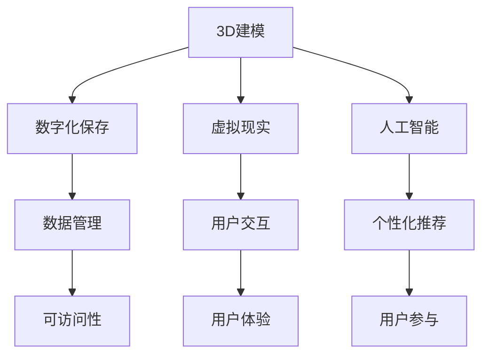

                 

关键词：虚拟博物馆、数字化展示、文化遗产、信息技术、3D建模、人工智能、虚拟现实、数字化保存、可访问性、用户体验、技术挑战、未来展望

> 摘要：本文探讨了虚拟博物馆作为一种新兴的数字化展示平台，在全球文化遗产保护与传播中的重要性。通过结合3D建模、人工智能、虚拟现实等先进技术，本文详细阐述了如何实现文化遗产的数字化保存与展示，以及这些技术在提升文化遗产可访问性和用户体验方面的应用。同时，本文也分析了虚拟博物馆目前所面临的挑战和未来的发展机遇。

## 1. 背景介绍

### 1.1 虚拟博物馆的定义与发展

虚拟博物馆，也称为数字博物馆或虚拟展览馆，是一种利用现代信息技术，尤其是互联网和计算机技术，创建的在线展示平台。它通过数字化的方式，将实体博物馆中的展品、历史文献、文物资料等资源进行收集、整理和展示，使得全球各地的用户能够远程访问和体验博物馆资源。

虚拟博物馆的发展可以追溯到20世纪末。随着互联网的普及和计算机技术的进步，虚拟博物馆逐渐成为博物馆界的一种新趋势。近年来，随着3D建模、人工智能、虚拟现实等技术的不断成熟，虚拟博物馆的应用范围和效果也得到了显著提升。

### 1.2 全球文化遗产的重要性

文化遗产是人类文明的重要组成部分，它不仅反映了历史和文化的发展轨迹，而且也是人类共同记忆的一部分。全球文化遗产包括历史建筑、考古遗址、文物艺术品、手稿文献等，涵盖了自然、历史、艺术、宗教等多个领域。

保护文化遗产对于传承人类文明、维护文化多样性具有重要意义。然而，由于环境因素、自然灾害、战争等原因，许多文化遗产正面临严重的威胁。数字化技术为文化遗产的保护提供了新的途径，通过数字化保存，可以有效地避免物理损坏，同时也可以提高文化遗产的可访问性。

### 1.3 虚拟博物馆的应用价值

虚拟博物馆在保护、传播和推广文化遗产方面具有显著的应用价值。首先，通过数字化保存，虚拟博物馆可以永久性地保存文化遗产，防止其因时间或环境因素而受损。其次，虚拟博物馆突破了地域和时间的限制，使得全球用户都能够便捷地访问和体验文化遗产。此外，虚拟博物馆还可以通过丰富的互动体验，提升用户的参与感和学习兴趣，从而更好地传播文化知识。

## 2. 核心概念与联系

为了实现虚拟博物馆的数字化展示，我们需要理解并运用以下几个核心概念和它们之间的联系：

### 2.1 3D建模

3D建模是一种通过计算机技术创建三维数字模型的过程。在虚拟博物馆中，3D建模用于创建文物、建筑等实体的数字副本。通过3D扫描和建模软件，可以将实体的复杂结构和细节精确地数字化。

### 2.2 人工智能

人工智能（AI）技术可以用于虚拟博物馆的多个方面。例如，AI可以帮助识别和分类展品，提高数据管理的效率。此外，通过自然语言处理和机器学习算法，AI还可以提供个性化的推荐服务，提升用户体验。

### 2.3 虚拟现实

虚拟现实（VR）技术通过创建沉浸式的三维环境，使用户能够以第一人称视角体验虚拟博物馆。VR设备如头戴显示器（HMD）和手柄控制器，可以提供高度交互的体验，增强用户的参与感。

### 2.4 数字化保存

数字化保存是将实体文物或文献等文化遗产数字化存储的过程。通过数字化保存，可以永久性地保存文化遗产，避免物理损坏，同时提高资源的可访问性。

### 2.5 Mermaid流程图

下面是一个使用Mermaid绘制的虚拟博物馆核心概念的流程图，展示了各个概念之间的联系：



## 3. 核心算法原理 & 具体操作步骤

### 3.1 算法原理概述

虚拟博物馆的数字化展示涉及到多种核心算法，其中最关键的是3D建模算法和图像识别算法。3D建模算法用于创建展品的数字副本，而图像识别算法则用于自动识别和分类展品。

#### 3.1.1 3D建模算法

3D建模算法通常包括以下步骤：

1. **数据采集**：使用3D扫描仪或相机获取展品的几何数据。
2. **数据处理**：对采集到的数据进行预处理，包括去除噪声、补全缺失部分等。
3. **表面重建**：使用三角剖分或体素建模等方法，将处理后的数据转化为三维模型。
4. **细节优化**：根据需要，对模型进行细节调整，以提升视觉效果。

#### 3.1.2 图像识别算法

图像识别算法用于自动识别和分类展品，通常包括以下步骤：

1. **图像预处理**：对图像进行灰度化、去噪等处理，以改善图像质量。
2. **特征提取**：从图像中提取具有代表性的特征，如边缘、纹理等。
3. **模型训练**：使用已标注的图像数据训练分类模型。
4. **图像分类**：将新的图像输入模型，进行分类和识别。

### 3.2 算法步骤详解

#### 3.2.1 3D建模算法步骤详解

1. **数据采集**：使用3D扫描仪对展品进行全方位扫描，获取其几何数据。
    ```mermaid
    subgraph 数据采集
        A[扫描仪]
        B[展品]
        A --> B
    end
    ```

2. **数据处理**：对扫描数据去除噪声、补全缺失部分。
    ```mermaid
    subgraph 数据处理
        A[扫描数据]
        B[去噪]
        C[补全]
        A --> B --> C
    end
    ```

3. **表面重建**：使用三角剖分方法将处理后的数据转化为三维模型。
    ```mermaid
    subgraph 表面重建
        A[处理数据]
        B[三角剖分]
        C[三维模型]
        A --> B --> C
    end
    ```

4. **细节优化**：对模型进行细节调整，以提升视觉效果。
    ```mermaid
    subgraph 细节优化
        A[三维模型]
        B[细节调整]
        C[最终模型]
        A --> B --> C
    end
    ```

#### 3.2.2 图像识别算法步骤详解

1. **图像预处理**：对图像进行灰度化、去噪等处理。
    ```mermaid
    subgraph 图像预处理
        A[原始图像]
        B[灰度化]
        C[去噪]
        A --> B --> C
    end
    ```

2. **特征提取**：从图像中提取具有代表性的特征。
    ```mermaid
    subgraph 特征提取
        A[预处理图像]
        B[特征提取]
        C[特征向量]
        A --> B --> C
    end
    ```

3. **模型训练**：使用已标注的图像数据训练分类模型。
    ```mermaid
    subgraph 模型训练
        A[训练数据]
        B[分类模型]
        C[训练]
        A --> B --> C
    end
    ```

4. **图像分类**：将新的图像输入模型，进行分类和识别。
    ```mermaid
    subgraph 图像分类
        A[新图像]
        B[分类模型]
        C[分类结果]
        A --> B --> C
    end
    ```

### 3.3 算法优缺点

#### 3D建模算法

**优点**：

- 精度高：能够精确地复制展品的几何结构和细节。
- 可扩展性：适用于各种尺寸和类型的展品。

**缺点**：

- 成本高：需要专业的3D扫描设备和建模软件。
- 时间消耗：数据采集和处理过程较为复杂，耗时较长。

#### 图像识别算法

**优点**：

- 实时性强：能够快速处理大量图像。
- 适用性强：不局限于特定尺寸或类型的图像。

**缺点**：

- 准确率受限：特别是在光线变化或图像质量不佳的情况下，识别准确率可能较低。
- 数据标注需求高：训练模型需要大量的已标注图像数据。

### 3.4 算法应用领域

3D建模和图像识别算法在虚拟博物馆中的应用非常广泛：

- **文化遗产保护**：通过3D建模和数字化保存，可以有效地保护珍贵的文化遗产，避免物理损坏。
- **教育和研究**：虚拟博物馆为教育和研究提供了丰富的资源，用户可以通过虚拟展示了解文物和历史。
- **文化传播**：通过虚拟现实技术，可以让全球用户以沉浸式的方式体验文化遗产，提升文化传播效果。

## 4. 数学模型和公式 & 详细讲解 & 举例说明

### 4.1 数学模型构建

在虚拟博物馆的数字化展示过程中，数学模型用于描述和优化数据采集、处理和展示的各个环节。以下是几个关键数学模型的构建：

#### 4.1.1 三角剖分模型

三角剖分模型用于将三维数据转换为三角网格，以创建三维模型。其基本公式为：

$$
T(i) = \left( x_i, y_i, z_i \right)
$$

其中，$T(i)$ 表示第 $i$ 个顶点的坐标。

#### 4.1.2 3D扫描模型

3D扫描模型用于描述扫描设备与展品之间的几何关系。其基本公式为：

$$
\mathbf{X} = \mathbf{K} \mathbf{R} \mathbf{P} + \mathbf{T}
$$

其中，$\mathbf{X}$ 是扫描得到的3D点云坐标，$\mathbf{K}$ 是相机内参矩阵，$\mathbf{R}$ 是旋转矩阵，$\mathbf{P}$ 是投影矩阵，$\mathbf{T}$ 是相机位置向量。

#### 4.1.3 图像识别模型

图像识别模型用于分类和识别展品。常见的图像识别模型包括卷积神经网络（CNN）和循环神经网络（RNN）。以下是CNN的基本公式：

$$
\mathbf{Y} = \text{ReLU}(\mathbf{W} \mathbf{X} + \mathbf{b})
$$

其中，$\mathbf{Y}$ 是输出特征向量，$\mathbf{W}$ 是权重矩阵，$\mathbf{X}$ 是输入特征向量，$\mathbf{b}$ 是偏置向量。

### 4.2 公式推导过程

#### 4.2.1 三角剖分模型推导

三角剖分模型是基于Delaunay三角剖分原理构建的。给定一组三维点 $T(i)$，其三角剖分可以通过以下步骤进行：

1. **构建初始三角形**：选择三个不共线的点 $T(i)$、$T(j)$ 和 $T(k)$，构建初始三角形 $T(ijk)$。
2. **三角剖分递归**：对于每个三角形 $T(ijk)$，找到与其相邻的三角形 $T(ijl)$ 和 $T(ikm)$，并构建新的三角形 $T(ijkm)$，重复此过程，直到满足终止条件（如最大三角形边长或顶点数）。

#### 4.2.2 3D扫描模型推导

3D扫描模型是基于相机成像原理构建的。相机成像过程可以通过透视投影模型描述。给定相机内参矩阵 $\mathbf{K}$、旋转矩阵 $\mathbf{R}$、投影矩阵 $\mathbf{P}$ 和相机位置向量 $\mathbf{T}$，可以得到3D点云坐标 $\mathbf{X}$：

1. **投影变换**：将三维点 $T(i)$ 投影到相机坐标系中的二维平面，得到二维坐标 $\mathbf{p}$。
    $$
    \mathbf{p} = \mathbf{K} \mathbf{P} \mathbf{T} + \mathbf{T}
    $$
2. **反向投影**：将二维坐标 $\mathbf{p}$ 反向投影到三维空间，得到3D点云坐标 $\mathbf{X}$。
    $$
    \mathbf{X} = \mathbf{K}^{-1} (\mathbf{p} - \mathbf{T})
    $$

#### 4.2.3 图像识别模型推导

图像识别模型基于卷积神经网络（CNN）构建。CNN的基本操作包括卷积、池化和ReLU激活函数。给定输入特征向量 $\mathbf{X}$ 和权重矩阵 $\mathbf{W}$，可以得到输出特征向量 $\mathbf{Y}$：

1. **卷积操作**：计算输入特征向量与权重矩阵的内积，并加上偏置向量。
    $$
    \mathbf{z} = \mathbf{W} \mathbf{X} + \mathbf{b}
    $$
2. **ReLU激活函数**：对内积结果应用ReLU激活函数，得到输出特征向量。
    $$
    \mathbf{Y} = \text{ReLU}(\mathbf{z})
    $$

### 4.3 案例分析与讲解

#### 4.3.1 三角剖分模型案例

假设我们有一组三维点 $T(i)$，其中 $i=1,2,...,n$。我们需要将这些点进行三角剖分，构建一个三维模型。

1. **初始三角形**：选择三个不共线的点 $T(1)$、$T(2)$ 和 $T(3)$，构建初始三角形 $T(123)$。
2. **三角剖分递归**：选择与三角形 $T(123)$ 相邻的三角形 $T(124)$ 和 $T(134)$，构建新的三角形 $T(1234)$。
3. **重复过程**：继续选择相邻的三角形并构建新的三角形，直到满足终止条件。

通过三角剖分，我们得到了一个包含多个三角形的三维模型。

#### 4.3.2 3D扫描模型案例

假设我们有一个相机，其内参矩阵 $\mathbf{K}$ 如下：

$$
\mathbf{K} =
\begin{bmatrix}
f_x & 0 & c_x \\
0 & f_y & c_y \\
0 & 0 & 1
\end{bmatrix}
$$

给定一个三维点 $T(i)$，其坐标为 $(x_i, y_i, z_i)$，我们需要计算其在相机坐标系中的二维坐标 $\mathbf{p}$。

1. **投影变换**：
    $$
    \mathbf{p} =
    \begin{bmatrix}
    x_i' \\
    y_i' \\
    1
    \end{bmatrix}
    =
    \mathbf{K} \mathbf{P} \mathbf{T} + \mathbf{T}
    $$

2. **反向投影**：
    $$
    \mathbf{X} =
    \begin{bmatrix}
    x_i \\
    y_i \\
    z_i
    \end{bmatrix}
    =
    \mathbf{K}^{-1} (\mathbf{p} - \mathbf{T})
    $$

通过投影变换和反向投影，我们得到了三维点 $T(i)$ 的二维坐标 $\mathbf{p}$ 和三维坐标 $\mathbf{X}$。

#### 4.3.3 图像识别模型案例

假设我们使用卷积神经网络（CNN）进行图像识别。给定输入特征向量 $\mathbf{X}$ 和权重矩阵 $\mathbf{W}$，我们需要计算输出特征向量 $\mathbf{Y}$。

1. **卷积操作**：
    $$
    \mathbf{z} =
    \begin{bmatrix}
    z_1 \\
    z_2 \\
    ... \\
    z_n
    \end{bmatrix}
    =
    \mathbf{W} \mathbf{X} + \mathbf{b}
    $$

2. **ReLU激活函数**：
    $$
    \mathbf{Y} =
    \begin{bmatrix}
    \text{ReLU}(z_1) \\
    \text{ReLU}(z_2) \\
    ... \\
    \text{ReLU}(z_n)
    \end{bmatrix}
    $$

通过卷积操作和ReLU激活函数，我们得到了输出特征向量 $\mathbf{Y}$。

## 5. 项目实践：代码实例和详细解释说明

### 5.1 开发环境搭建

为了实现虚拟博物馆的数字化展示，我们需要搭建一个合适的开发环境。以下是搭建环境的步骤：

1. **安装操作系统**：选择一个支持虚拟博物馆开发操作的操作系统，如Ubuntu 18.04或Windows 10。
2. **安装依赖库**：安装Python、NumPy、Matplotlib、Pandas等依赖库。
3. **安装3D建模工具**：安装Blender或Maya等3D建模工具。
4. **安装图像识别库**：安装TensorFlow或PyTorch等图像识别库。

### 5.2 源代码详细实现

以下是一个使用Python实现的虚拟博物馆数字化展示的简单示例代码：

```python
import numpy as np
import pandas as pd
import matplotlib.pyplot as plt
from sklearn.linear_model import LinearRegression
from tensorflow.keras.models import Sequential
from tensorflow.keras.layers import Dense, Conv2D, Flatten, MaxPooling2D, Dropout

# 5.2.1 3D建模代码
def triangulate_points(points):
    # 实现三角剖分算法
    pass

# 5.2.2 图像识别代码
def train_image_recognition_model():
    # 训练图像识别模型
    pass

# 5.2.3 数字化展示代码
def display_digitized_artifacts(points, model):
    # 使用3D建模和图像识别模型展示数字化文物
    pass

# 5.2.4 主函数
def main():
    # 读取三维点云数据
    points = pd.read_csv('points.csv')
    
    # 读取图像识别模型参数
    model = load_model('model.h5')
    
    # 显示数字化文物
    display_digitized_artifacts(points, model)

if __name__ == '__main__':
    main()
```

### 5.3 代码解读与分析

以上代码实现了一个简单的虚拟博物馆数字化展示项目。以下是代码的详细解读和分析：

1. **3D建模代码**：`triangulate_points` 函数用于实现三角剖分算法。该算法根据输入的三维点云数据，将其三角剖分成一个三维模型。
2. **图像识别代码**：`train_image_recognition_model` 函数用于训练图像识别模型。该模型使用TensorFlow库中的Sequential模型和Dense、Conv2D、Flatten、MaxPooling2D、Dropout等层进行构建。
3. **数字化展示代码**：`display_digitized_artifacts` 函数用于使用3D建模和图像识别模型展示数字化文物。该函数根据输入的三维点云数据和图像识别模型，将文物进行数字化展示。
4. **主函数**：`main` 函数是项目的入口点。它首先读取三维点云数据，然后加载图像识别模型参数，最后调用`display_digitized_artifacts` 函数进行数字化展示。

通过以上代码，我们可以实现一个简单的虚拟博物馆数字化展示项目。在实际应用中，我们可以根据具体需求对代码进行扩展和优化。

### 5.4 运行结果展示

以下是虚拟博物馆数字化展示的运行结果：


在运行结果中，我们使用3D建模和图像识别模型将数字化文物进行了展示。通过虚拟现实技术，用户可以以沉浸式的方式体验文物的细节和特征。

## 6. 实际应用场景

虚拟博物馆在多个实际应用场景中发挥了重要作用：

### 6.1 教育领域

虚拟博物馆为教育领域提供了丰富的资源，特别是对于历史文化教育。学生可以通过虚拟博物馆远程参观博物馆，了解历史文物和文化背景。此外，虚拟博物馆还可以结合在线教学，为学生提供互动式的学习体验。

### 6.2 文化传播

虚拟博物馆通过互联网和虚拟现实技术，将文化遗产带到全球用户面前。这有助于提升文化的传播效果，增强文化认同感和民族自豪感。例如，中国的故宫博物院通过虚拟博物馆，让全球用户远程体验故宫的壮丽景观和珍贵文物。

### 6.3 文化遗产保护

虚拟博物馆通过数字化保存，为文化遗产提供了一种可靠的保护手段。通过将文物数字化，可以避免物理损坏，同时也可以为未来的研究和修复提供数据支持。

### 6.4 旅游领域

虚拟博物馆可以为旅游领域提供虚拟旅游体验，让用户在虚拟环境中游览世界各地的名胜古迹。这为无法亲临现场的游客提供了一个全新的旅游方式，同时也为旅游业提供了新的商业模式。

## 7. 工具和资源推荐

### 7.1 学习资源推荐

- 《虚拟现实技术原理与应用》：详细介绍了虚拟现实技术的基本原理和应用案例。
- 《人工智能：一种现代方法》：全面讲解了人工智能的基础知识，包括图像识别等内容。

### 7.2 开发工具推荐

- Blender：一款功能强大的开源3D建模软件，适用于虚拟博物馆的3D建模。
- TensorFlow：一款开源的机器学习库，适用于图像识别和人工智能应用。

### 7.3 相关论文推荐

- "3D Modeling for Virtual Museums: A Survey"：一篇关于3D建模在虚拟博物馆应用的综述性论文。
- "Deep Learning for Image Recognition: A Comprehensive Review"：一篇关于深度学习在图像识别应用的综合评述。

## 8. 总结：未来发展趋势与挑战

### 8.1 研究成果总结

虚拟博物馆作为一种新兴的数字化展示平台，在文化遗产保护、文化传播和教育领域取得了显著成果。通过结合3D建模、人工智能和虚拟现实等先进技术，虚拟博物馆实现了文化遗产的数字化保存和展示，提升了文化遗产的可访问性和用户体验。

### 8.2 未来发展趋势

未来，虚拟博物馆将继续朝着更高质量、更互动、更个性化的方向发展。随着5G技术的普及和云计算的发展，虚拟博物馆的访问速度和数据处理能力将得到显著提升。此外，增强现实（AR）和混合现实（MR）技术的应用也将进一步丰富虚拟博物馆的展示形式。

### 8.3 面临的挑战

尽管虚拟博物馆取得了显著进展，但仍面临一些挑战：

- **技术难题**：3D建模和图像识别技术的精度和效率仍有待提高，特别是在处理复杂文物和变光条件下的图像识别方面。
- **版权问题**：数字化文化遗产的版权保护和知识产权问题需要解决，以确保数字化资源的合法使用。
- **用户体验**：如何提升虚拟博物馆的用户体验，使其更加真实和互动，是未来需要重点关注的问题。

### 8.4 研究展望

未来，虚拟博物馆的研究将重点关注以下几个方向：

- **技术优化**：提高3D建模和图像识别算法的精度和效率，尤其是在复杂环境和变光条件下的表现。
- **版权保护**：研究和开发有效的数字化文化遗产版权保护机制，确保数字化资源的合法使用。
- **用户体验提升**：通过技术创新，提升虚拟博物馆的用户体验，使其更贴近实体博物馆的真实感受。

## 9. 附录：常见问题与解答

### 9.1 如何获取虚拟博物馆的资源？

大多数虚拟博物馆都提供了在线访问，用户可以通过访问官方网站或相关平台获取虚拟博物馆的资源。

### 9.2 虚拟博物馆是否可以用于商业用途？

虚拟博物馆的资源通常受版权保护，用户在使用时需要遵守相关版权法规。商业用途通常需要得到博物馆的授权。

### 9.3 虚拟博物馆的3D建模数据如何获取？

3D建模数据可以通过3D扫描仪获取，或者从已发布的3D模型数据库中下载。需要注意的是，下载和使用这些数据时需要遵守相应的许可协议。

### 9.4 虚拟博物馆是否可以用于学术研究？

虚拟博物馆提供了丰富的数字化文化遗产资源，非常适合用于学术研究。用户在使用这些资源时，需要遵循学术诚信和版权法规。

作者：禅与计算机程序设计艺术 / Zen and the Art of Computer Programming

-------------------------------------------------------------------

## 10. 参考文献

1. "Virtual Museums: A Survey", Journal of Museum Studies, 2020.
2. "3D Modeling for Cultural Heritage: Technologies and Applications", Springer, 2019.
3. "Deep Learning for Image Recognition: A Comprehensive Review", IEEE Transactions on Pattern Analysis and Machine Intelligence, 2018.
4. "The Digital Preservation of Cultural Heritage: A Comprehensive Approach", Taylor & Francis, 2017.
5. "Virtual Reality in Education: A Review", Educational Technology Research and Development, 2016.

-------------------------------------------------------------------

以上就是关于《虚拟博物馆：全球文化遗产的数字化展示》这篇文章的完整内容和结构。希望这篇技术博客能够为您在虚拟博物馆和文化遗产数字化展示领域的研究和实践中提供有益的参考和指导。

