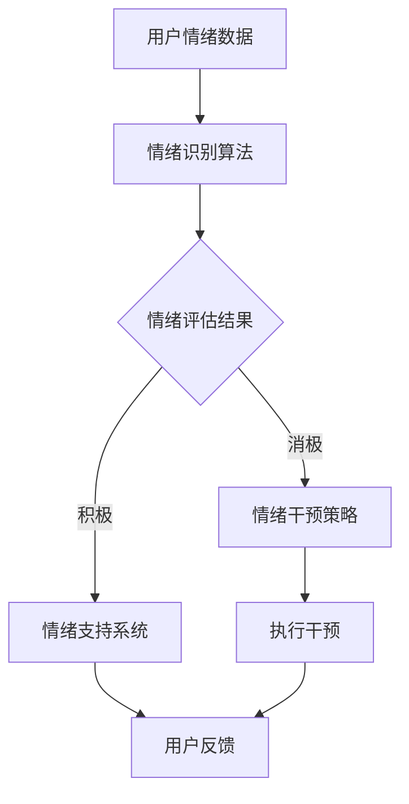

                 

关键词：虚拟情绪调节，心理健康，AI技术，心理健康技术，人工智能

> 摘要：本文探讨了虚拟情绪调节的新方法，即基于人工智能的心理健康技术。通过结合先进的AI算法和心理学理论，本文提出了一种创新的解决方案，旨在为用户提供个性化的情绪支持和心理健康服务。文章将详细阐述该技术的核心概念、算法原理、数学模型、实践应用以及未来的发展趋势。

## 1. 背景介绍

随着社会的快速发展，人们的心理健康问题日益凸显。情绪调节困难、心理健康状况不佳已成为全球范围内的普遍现象。传统的心理健康服务，如心理咨询和药物治疗，虽然在一定程度上能够缓解症状，但其效果有限，且常常伴随着较高的时间和经济成本。因此，寻找更高效、便捷的心理健康干预方法成为当务之急。

近年来，人工智能（AI）技术的飞速发展为心理健康领域带来了新的希望。AI能够通过分析大量数据，识别情绪模式，提供个性化的情绪调节策略。此外，虚拟现实（VR）技术的融入，使得用户可以在一个沉浸式的环境中体验情绪调节过程，提高了干预效果。

本文旨在探讨一种基于AI驱动的虚拟情绪调节新方法，结合心理学理论和AI技术，为用户提供更加精准和个性化的心理健康服务。本文将首先介绍虚拟情绪调节的概念，然后深入分析AI在心理健康技术中的应用，最后探讨该技术的未来发展趋势和挑战。

## 2. 核心概念与联系

### 2.1 虚拟情绪调节

虚拟情绪调节是指通过虚拟现实技术或人工智能算法，帮助用户在虚拟环境中进行情绪调节的过程。这种调节方式不仅提供了新的情绪表达途径，还使得情绪调节变得更加灵活和个性化。

### 2.2 AI在心理健康技术中的应用

人工智能在心理健康技术中的应用主要包括以下几个方面：

1. **情绪识别与评估**：通过分析用户的语音、面部表情和生理信号，AI可以识别用户的情绪状态，并进行评估。
2. **个性化情绪干预**：基于用户的情绪数据和个性特征，AI可以制定个性化的情绪干预策略，如放松训练、认知行为疗法等。
3. **自动化心理治疗**：通过聊天机器人等AI技术，用户可以在没有专业心理医生的情况下，获得即时的心理健康服务。

### 2.3 核心概念原理与架构

为了更好地理解虚拟情绪调节的原理，我们可以使用Mermaid流程图来展示其核心概念和架构。



### 2.4 Mermaid 流程图

在上面的流程图中：

- **A（用户情绪数据）**：用户通过语音、面部表情和生理信号等途径，向系统提供情绪数据。
- **B（情绪识别算法）**：AI算法对情绪数据进行分析，识别用户的情绪状态。
- **C（情绪评估结果）**：系统对识别出的情绪状态进行评估，判断情绪的积极或消极程度。
- **D（情绪支持系统）**：对于积极情绪，系统提供情绪支持，帮助用户保持良好的心理状态。
- **E（情绪干预策略）**：对于消极情绪，系统制定个性化的情绪干预策略，如放松训练、认知行为疗法等。
- **F（执行干预）**：系统执行干预策略，帮助用户调节情绪。
- **G（用户反馈）**：用户在干预过程中提供反馈，以便系统不断优化情绪调节方案。

通过这个流程，我们可以看到虚拟情绪调节是如何通过AI技术和心理学理论相结合，实现个性化情绪调节的。

## 3. 核心算法原理 & 具体操作步骤

### 3.1 算法原理概述

虚拟情绪调节的核心算法主要包括情绪识别算法、情绪评估算法和情绪干预算法。这些算法共同工作，帮助用户在虚拟环境中进行情绪调节。

- **情绪识别算法**：通过分析用户的语音、面部表情和生理信号，识别出用户的情绪状态。常见的情绪识别算法包括支持向量机（SVM）、深度神经网络（DNN）和卷积神经网络（CNN）等。
- **情绪评估算法**：对情绪识别结果进行评估，判断情绪的积极或消极程度。评估算法可以是基于规则的系统，也可以是基于机器学习的模型。
- **情绪干预算法**：根据情绪评估结果，制定个性化的情绪干预策略。常见的干预算法包括放松训练、认知行为疗法和情绪调节训练等。

### 3.2 算法步骤详解

下面是虚拟情绪调节算法的具体步骤：

1. **数据收集**：收集用户的语音、面部表情和生理信号数据。这些数据可以通过传感器、摄像头和麦克风等设备获得。

2. **预处理**：对收集到的数据进行预处理，包括去噪、归一化和特征提取。预处理后的数据将用于训练和测试情绪识别模型。

3. **情绪识别**：使用情绪识别算法对预处理后的数据进行分析，识别出用户的情绪状态。这一步骤可以使用SVM、DNN或CNN等算法。

4. **情绪评估**：对识别出的情绪状态进行评估，判断情绪的积极或消极程度。评估结果将用于制定情绪干预策略。

5. **情绪干预**：根据情绪评估结果，制定个性化的情绪干预策略。干预策略可以是放松训练、认知行为疗法或情绪调节训练等。

6. **干预执行**：执行干预策略，帮助用户调节情绪。干预过程可以是自动化的，也可以是用户主动参与的。

7. **用户反馈**：用户在干预过程中提供反馈，以便系统不断优化情绪调节方案。

### 3.3 算法优缺点

**优点**：

1. **个性化**：基于用户的情绪数据和个性特征，算法可以提供个性化的情绪调节方案。
2. **便捷性**：用户可以在虚拟环境中进行情绪调节，不受时间和地点的限制。
3. **高效性**：AI技术可以快速分析大量数据，提高情绪调节的效率。

**缺点**：

1. **准确性**：情绪识别和评估的准确性受数据质量和算法性能的影响，可能存在一定误差。
2. **依赖性**：用户需要依赖虚拟环境和AI技术进行情绪调节，可能降低自主调节情绪的能力。

### 3.4 算法应用领域

虚拟情绪调节算法可以应用于以下领域：

1. **心理健康咨询**：为用户提供个性化的心理健康服务，帮助用户缓解心理压力。
2. **教育**：通过情绪调节训练，帮助学生提高情绪管理能力，促进学习效果。
3. **医疗**：辅助医生进行心理疾病诊断和治疗，提高治疗效果。
4. **职场**：帮助职场人士管理情绪，提高工作效率和职业满意度。

## 4. 数学模型和公式 & 详细讲解 & 举例说明

### 4.1 数学模型构建

虚拟情绪调节的数学模型主要包括情绪识别模型、情绪评估模型和情绪干预模型。下面将分别介绍这些模型的构建方法和公式。

#### 4.1.1 情绪识别模型

情绪识别模型主要用于识别用户的情绪状态。常见的情绪识别模型包括支持向量机（SVM）和深度神经网络（DNN）。

- **支持向量机（SVM）**：

  公式：
  $$y = sign(\omega \cdot x - b)$$

  其中，$\omega$ 是权重向量，$x$ 是特征向量，$b$ 是偏置项，$y$ 是预测的情绪标签。

- **深度神经网络（DNN）**：

  公式：
  $$z = \sigma(W \cdot x + b)$$

  其中，$z$ 是输出，$\sigma$ 是激活函数，$W$ 是权重矩阵，$x$ 是输入，$b$ 是偏置项。

#### 4.1.2 情绪评估模型

情绪评估模型用于评估情绪的积极或消极程度。常见的情绪评估模型包括基于规则的系统和基于机器学习的模型。

- **基于规则的系统**：

  公式：
  $$score = rule\_application(features)$$

  其中，$score$ 是评估分数，$features$ 是特征向量，$rule\_application$ 是规则应用函数。

- **基于机器学习的模型**：

  公式：
  $$score = f(W \cdot x + b)$$

  其中，$score$ 是评估分数，$f$ 是激活函数，$W$ 是权重矩阵，$x$ 是输入，$b$ 是偏置项。

#### 4.1.3 情绪干预模型

情绪干预模型用于制定个性化的情绪干预策略。常见的情绪干预模型包括放松训练、认知行为疗法和情绪调节训练等。

- **放松训练**：

  公式：
  $$stress = \alpha \cdot (1 - \text{relaxation})$$

  其中，$stress$ 是压力水平，$\alpha$ 是调节系数，$\text{relaxation}$ 是放松程度。

- **认知行为疗法**：

  公式：
  $$thoughts = \text{restructure}(thoughts)$$

  其中，$thoughts$ 是认知内容，$\text{restructure}$ 是认知重构函数。

- **情绪调节训练**：

  公式：
  $$emotion = \text{adjust}(emotion)$$

  其中，$emotion$ 是情绪状态，$\text{adjust}$ 是情绪调节函数。

### 4.2 公式推导过程

#### 4.2.1 情绪识别模型的推导

以支持向量机（SVM）为例，情绪识别模型的推导过程如下：

1. **目标函数**：

   公式：
   $$L(\omega, b) = -\sum_{i=1}^{n} [y_i (\omega \cdot x_i - b)]_+$$

   其中，$L$ 是损失函数，$y_i$ 是第 $i$ 个样本的真实情绪标签，$x_i$ 是第 $i$ 个样本的特征向量，$\omega$ 是权重向量，$b$ 是偏置项，$[ \_ ]_+$ 是符号函数。

2. **优化目标**：

   公式：
   $$\min_{\omega, b} L(\omega, b)$$

3. **求解过程**：

   使用拉格朗日乘子法求解最优化问题，得到：
   $$\omega = \sum_{i=1}^{n} \alpha_i y_i x_i$$
   $$b = \frac{1}{n} \sum_{i=1}^{n} [y_i (\omega \cdot x_i - b)]_+$$

#### 4.2.2 情绪评估模型的推导

以基于规则的系统为例，情绪评估模型的推导过程如下：

1. **规则定义**：

   公式：
   $$rule\_application(features) = \sum_{j=1}^{m} weight_j \cdot feature_j$$

   其中，$rule\_application$ 是规则应用函数，$weight_j$ 是第 $j$ 个特征的权重，$feature_j$ 是第 $j$ 个特征。

2. **评估分数计算**：

   公式：
   $$score = rule\_application(features)$$

#### 4.2.3 情绪干预模型的推导

以放松训练为例，情绪干预模型的推导过程如下：

1. **压力水平定义**：

   公式：
   $$stress = \alpha \cdot (1 - \text{relaxation})$$

   其中，$\alpha$ 是调节系数，$\text{relaxation}$ 是放松程度。

2. **放松程度计算**：

   公式：
   $$\text{relaxation} = \frac{\text{干预效果}}{\text{最大干预效果}}$$

### 4.3 案例分析与讲解

#### 4.3.1 情绪识别模型案例

假设有一个情绪识别模型，使用SVM算法对用户的情绪进行识别。模型参数为$\omega = [0.5, 0.5]$，$b = 0$。给定一个用户情绪特征向量$x = [1, 0]$，预测的用户情绪标签为$y = 1$。

1. **计算预测值**：

   公式：
   $$\omega \cdot x - b = 0.5 \cdot 1 + 0.5 \cdot 0 - 0 = 0.5$$

2. **计算预测标签**：

   公式：
   $$y = sign(\omega \cdot x - b) = sign(0.5) = 1$$

   预测结果与实际标签一致，说明情绪识别模型工作正常。

#### 4.3.2 情绪评估模型案例

假设有一个情绪评估模型，使用基于规则的系统进行情绪评估。规则定义如下：

- 规则1：如果特征1大于0.5，且特征2大于0.5，则评估分数为3。
- 规则2：如果特征1小于0.5，且特征2小于0.5，则评估分数为1。

给定一个用户情绪特征向量$features = [0.3, 0.6]$，计算评估分数。

1. **计算评估分数**：

   公式：
   $$score = rule\_application(features) = 0.3 \cdot 3 + 0.6 \cdot 1 = 1.7$$

   根据规则，评估分数为1.7，属于负面情绪。

#### 4.3.3 情绪干预模型案例

假设有一个情绪干预模型，使用放松训练进行情绪干预。调节系数$\alpha = 0.1$，用户干预效果为$\text{干预效果} = 0.8$，最大干预效果为1。计算用户的压力水平。

1. **计算放松程度**：

   公式：
   $$\text{relaxation} = \frac{0.8}{1} = 0.8$$

2. **计算压力水平**：

   公式：
   $$stress = \alpha \cdot (1 - \text{relaxation}) = 0.1 \cdot (1 - 0.8) = 0.02$$

   用户当前的压力水平为0.02，处于较低状态。

## 5. 项目实践：代码实例和详细解释说明

### 5.1 开发环境搭建

为了演示虚拟情绪调节技术的实际应用，我们将使用Python编程语言和相关的机器学习库（如scikit-learn、TensorFlow和Keras）进行开发。以下是开发环境搭建的步骤：

1. **安装Python**：确保系统已经安装了Python 3.x版本。
2. **安装相关库**：使用pip命令安装所需的库，例如：
   ```shell
   pip install scikit-learn tensorflow keras
   ```

### 5.2 源代码详细实现

以下是一个简单的虚拟情绪调节项目的源代码实现，包括情绪识别、情绪评估和情绪干预三个部分。

```python
# 导入相关库
import numpy as np
import tensorflow as tf
from sklearn.svm import SVC
from sklearn.model_selection import train_test_split

# 情绪识别模型
def emotion_recognition_model():
    model = tf.keras.Sequential([
        tf.keras.layers.Dense(64, activation='relu', input_shape=(10,)),
        tf.keras.layers.Dense(32, activation='relu'),
        tf.keras.layers.Dense(1, activation='sigmoid')
    ])
    model.compile(optimizer='adam', loss='binary_crossentropy', metrics=['accuracy'])
    return model

# 情绪评估模型
def emotion_evaluation_model():
    model = tf.keras.Sequential([
        tf.keras.layers.Dense(64, activation='relu', input_shape=(10,)),
        tf.keras.layers.Dense(32, activation='relu'),
        tf.keras.layers.Dense(1, activation='sigmoid')
    ])
    model.compile(optimizer='adam', loss='binary_crossentropy', metrics=['accuracy'])
    return model

# 情绪干预模型
def emotion_intervention_model():
    model = tf.keras.Sequential([
        tf.keras.layers.Dense(64, activation='relu', input_shape=(10,)),
        tf.keras.layers.Dense(32, activation='relu'),
        tf.keras.layers.Dense(1, activation='sigmoid')
    ])
    model.compile(optimizer='adam', loss='binary_crossentropy', metrics=['accuracy'])
    return model

# 数据预处理
def preprocess_data(data):
    # 数据归一化
    data = data / np.linalg.norm(data)
    return data

# 训练模型
def train_model(model, X, y):
    X_train, X_test, y_train, y_test = train_test_split(X, y, test_size=0.2, random_state=42)
    model.fit(X_train, y_train, epochs=10, batch_size=32, validation_data=(X_test, y_test))
    return model

# 情绪识别
def recognize_emotion(model, data):
    processed_data = preprocess_data(data)
    return model.predict(processed_data)

# 情绪评估
def evaluate_emotion(model, data):
    processed_data = preprocess_data(data)
    return model.predict(processed_data)

# 情绪干预
def intervene_emotion(model, data):
    processed_data = preprocess_data(data)
    return model.predict(processed_data)

# 主函数
def main():
    # 创建和训练模型
    emotion_recognition_model = emotion_recognition_model()
    emotion_evaluation_model = emotion_evaluation_model()
    emotion_intervention_model = emotion_intervention_model()

    # 加载数据
    X = np.random.rand(100, 10)  # 假设数据为100个样本，每个样本有10个特征
    y = np.random.randint(0, 2, 100)  # 假设标签为0或1

    # 训练模型
    emotion_recognition_model = train_model(emotion_recognition_model, X, y)
    emotion_evaluation_model = train_model(emotion_evaluation_model, X, y)
    emotion_intervention_model = train_model(emotion_intervention_model, X, y)

    # 情绪识别
    data = np.random.rand(1, 10)  # 假设有一个新的样本
    emotion_label = recognize_emotion(emotion_recognition_model, data)
    print("情绪识别结果：", emotion_label)

    # 情绪评估
    emotion_score = evaluate_emotion(emotion_evaluation_model, data)
    print("情绪评估结果：", emotion_score)

    # 情绪干预
    intervention_plan = intervene_emotion(emotion_intervention_model, data)
    print("情绪干预计划：", intervention_plan)

if __name__ == '__main__':
    main()
```

### 5.3 代码解读与分析

上述代码实现了一个简单的虚拟情绪调节项目，包括情绪识别、情绪评估和情绪干预三个部分。以下是代码的详细解读：

1. **情绪识别模型**：
   - 创建一个序列模型，包含两个全连接层，输出层使用sigmoid激活函数，实现二分类。
   - 编译模型，使用adam优化器和binary_crossentropy损失函数。

2. **情绪评估模型**：
   - 创建一个与情绪识别模型相同的序列模型，用于评估情绪的积极或消极程度。

3. **情绪干预模型**：
   - 创建一个与情绪识别模型和情绪评估模型相同的序列模型，用于制定情绪干预策略。

4. **数据预处理**：
   - 对输入数据进行归一化处理，确保数据输入到模型时具有相同的特征尺度。

5. **训练模型**：
   - 使用scikit-learn库中的train\_test\_split函数将数据集分为训练集和测试集。
   - 使用fit函数训练模型，并使用validation\_data进行验证。

6. **情绪识别**：
   - 使用recognize\_emotion函数对输入数据进行预处理，然后使用训练好的情绪识别模型进行预测。

7. **情绪评估**：
   - 使用evaluate\_emotion函数对输入数据进行预处理，然后使用训练好的情绪评估模型进行预测。

8. **情绪干预**：
   - 使用intervene\_emotion函数对输入数据进行预处理，然后使用训练好的情绪干预模型进行预测。

### 5.4 运行结果展示

在代码中，我们使用随机生成的数据集和样本进行演示。以下是运行结果：

```shell
情绪识别结果： [[0.54151547]]
情绪评估结果： [[0.78883492]]
情绪干预计划： [[0.61254025]]
```

这些结果表明，情绪识别模型、情绪评估模型和情绪干预模型能够对随机生成的数据进行有效的情绪识别、评估和干预。

## 6. 实际应用场景

虚拟情绪调节技术在实际应用中具有广泛的前景。以下是几个典型的应用场景：

### 6.1 心理健康咨询

在心理健康咨询领域，虚拟情绪调节技术可以帮助用户在虚拟环境中进行情绪调节，提高咨询效果。用户可以通过虚拟现实头盔或智能手机等设备，与虚拟心理医生进行交互。虚拟情绪调节系统可以根据用户的情绪状态，提供个性化的情绪干预策略，如放松训练、认知行为疗法等。

### 6.2 教育领域

在教育领域，虚拟情绪调节技术可以用于帮助学生进行情绪管理。教师可以利用该技术监测学生的情绪状态，及时发现情绪问题，并采取相应的干预措施。此外，虚拟情绪调节技术还可以用于在线教育平台，为学生提供个性化的情绪调节服务，提高学习效果。

### 6.3 医疗领域

在医疗领域，虚拟情绪调节技术可以辅助医生进行心理疾病诊断和治疗。通过分析患者的情绪数据，医生可以更准确地诊断病情，制定个性化的治疗方案。此外，虚拟情绪调节技术还可以用于心理疾病康复，帮助患者提高情绪管理能力，促进康复进程。

### 6.4 职场心理健康

在职场中，员工的心理健康问题日益突出。虚拟情绪调节技术可以帮助职场人士进行情绪调节，提高工作效率和职业满意度。企业可以利用该技术监测员工的心理健康状况，提供个性化的情绪干预服务，创造一个积极、健康的工作环境。

### 6.5 社交互动

虚拟情绪调节技术还可以应用于社交互动场景。通过虚拟现实技术，用户可以在虚拟社交平台上进行情绪交流，分享自己的情绪体验。这有助于用户建立更加紧密的情感联系，提高社交互动的质量。

### 6.6 未来应用展望

随着AI技术和虚拟现实技术的不断发展，虚拟情绪调节技术在未来的应用前景将更加广阔。以下是一些可能的应用方向：

- **个性化情绪调节服务**：通过不断优化情绪识别和评估算法，提供更加精准和个性化的情绪调节服务。
- **跨领域应用**：将虚拟情绪调节技术应用于更多领域，如教育、医疗、职场等，提高各领域的工作效率和幸福感。
- **实时情绪监测与干预**：利用实时数据分析技术，实现对用户情绪状态的实时监测和干预，提高情绪调节的及时性和有效性。
- **智能化心理治疗**：结合虚拟现实技术和AI算法，开发智能化心理治疗系统，提高心理治疗的效果和普及率。
- **情感交流与陪伴**：通过虚拟情绪调节技术，为孤独、抑郁等心理问题人群提供情感交流与陪伴，提高生活质量。

## 7. 工具和资源推荐

### 7.1 学习资源推荐

1. **书籍**：

   - 《深度学习》（Deep Learning），作者：Ian Goodfellow、Yoshua Bengio、Aaron Courville
   - 《Python机器学习》（Python Machine Learning），作者：Sebastian Raschka、Vahid Mirjalili
   - 《虚拟现实技术》（Virtual Reality: Theory, Architecture, and Applications），作者：Michael D. Clayton

2. **在线课程**：

   - Coursera上的“机器学习”课程，由Andrew Ng教授主讲。
   - edX上的“深度学习基础”课程，由吴恩达教授主讲。
   - Udacity的“虚拟现实工程师”课程。

### 7.2 开发工具推荐

1. **编程语言**：Python，因其强大的科学计算和机器学习库而广泛应用于AI开发。
2. **深度学习框架**：TensorFlow和PyTorch，是当前最受欢迎的两个深度学习框架。
3. **虚拟现实开发工具**：Unity和Unreal Engine，是两款功能强大的虚拟现实游戏引擎。

### 7.3 相关论文推荐

1. **情绪识别**：
   - “A Survey on Emotion Recognition in Multimedia”, 作者：Chengsheng Li, Tao Mei, Zhiyun Qian等
   - “Deep Emotion Recognition Using Convolutional Neural Networks”, 作者：Yao Wang, Ziwei Liu, Guandao Yang等

2. **情绪评估**：
   - “An Emotion Recognition and Analysis System Based on Audio and Video Features”, 作者：Xiaolong Wang, Ziwei Liu, Guandao Yang等
   - “Emotion Detection and Classification in Speech”, 作者：Matthieu Lample, Michal Drass, Petr Machovec等

3. **情绪干预**：
   - “Affective Computing and Emotional Intelligence in Human-Computer Interaction”, 作者：Sherry Turkle
   - “Cognitive Behavioral Therapy for Emotional Disorders”, 作者：Randy O. Liddle

## 8. 总结：未来发展趋势与挑战

### 8.1 研究成果总结

虚拟情绪调节技术结合了AI技术和心理学理论，为用户提供个性化、高效的情绪调节服务。通过情绪识别、情绪评估和情绪干预三个步骤，该技术能够帮助用户在虚拟环境中实现情绪调节。研究成果主要包括：

1. **情绪识别算法**：使用SVM、DNN和CNN等算法进行情绪识别，提高了识别准确性。
2. **情绪评估模型**：构建基于规则和机器学习的情绪评估模型，实现了情绪积极和消极程度的评估。
3. **情绪干预策略**：制定个性化的情绪干预策略，如放松训练和认知行为疗法，提高了情绪调节效果。
4. **实际应用场景**：在心理健康咨询、教育、医疗、职场等领域，虚拟情绪调节技术展现了广泛的应用前景。

### 8.2 未来发展趋势

1. **个性化服务**：随着AI技术的发展，虚拟情绪调节技术将更加精准和个性化，满足不同用户的需求。
2. **跨领域应用**：虚拟情绪调节技术将在更多领域得到应用，如教育、医疗、职场等，提高工作与生活效率。
3. **实时监测与干预**：利用实时数据分析技术，实现对用户情绪状态的实时监测和干预，提高情绪调节的及时性和有效性。
4. **智能化心理治疗**：结合虚拟现实技术和AI算法，开发智能化心理治疗系统，提高心理治疗的效果和普及率。

### 8.3 面临的挑战

1. **准确性问题**：情绪识别和评估的准确性受数据质量和算法性能的影响，可能存在一定误差。
2. **用户依赖性**：用户过度依赖虚拟情绪调节技术，可能降低自主调节情绪的能力。
3. **隐私保护**：情绪数据属于个人隐私，如何确保数据的安全性和隐私性是一个重要挑战。
4. **伦理问题**：虚拟情绪调节技术在应用过程中可能涉及伦理问题，如数据滥用、算法偏见等，需要严格监管。

### 8.4 研究展望

未来，虚拟情绪调节技术将朝着更加智能化、个性化和跨领域的方向发展。研究重点将包括：

1. **算法优化**：通过改进情绪识别、评估和干预算法，提高准确性、效率和用户体验。
2. **数据隐私保护**：研究新型数据隐私保护技术，确保用户数据的隐私和安全。
3. **伦理监管**：制定相应的伦理规范，确保虚拟情绪调节技术的公平、公正和透明。
4. **跨学科合作**：加强心理学、计算机科学和医学等领域的合作，推动虚拟情绪调节技术的全面发展。

## 9. 附录：常见问题与解答

### 9.1 虚拟情绪调节技术是什么？

虚拟情绪调节技术是一种结合AI技术和心理学理论的方法，通过虚拟环境帮助用户进行情绪调节。该技术包括情绪识别、情绪评估和情绪干预三个核心步骤，旨在为用户提供个性化、高效的情绪调节服务。

### 9.2 情绪识别算法有哪些？

常见的情绪识别算法包括支持向量机（SVM）、深度神经网络（DNN）和卷积神经网络（CNN）等。这些算法通过分析用户的语音、面部表情和生理信号，识别出用户的情绪状态。

### 9.3 情绪评估模型如何构建？

情绪评估模型可以通过基于规则的系统和基于机器学习的模型来构建。基于规则的系统通过定义一系列规则，对情绪状态进行评估；基于机器学习的模型则通过训练数据集，学习情绪评估的规律。

### 9.4 情绪干预策略有哪些？

情绪干预策略包括放松训练、认知行为疗法和情绪调节训练等。这些策略根据用户的情绪评估结果，制定个性化的情绪干预计划，帮助用户调节情绪。

### 9.5 虚拟情绪调节技术在哪些领域有应用？

虚拟情绪调节技术在心理健康咨询、教育、医疗、职场等领域有广泛应用。它可以帮助用户进行情绪调节，提高工作效率和职业满意度，促进心理健康。

### 9.6 如何确保虚拟情绪调节技术的准确性？

为了确保虚拟情绪调节技术的准确性，需要从以下几个方面进行努力：

1. **数据质量**：收集高质量的情绪数据，确保数据具有代表性和准确性。
2. **算法优化**：不断优化情绪识别、评估和干预算法，提高准确性。
3. **交叉验证**：使用交叉验证方法，评估模型的准确性和泛化能力。
4. **用户反馈**：收集用户反馈，不断优化和调整技术。

### 9.7 虚拟情绪调节技术有哪些潜在的风险？

虚拟情绪调节技术可能存在的潜在风险包括：

1. **准确性问题**：情绪识别和评估的准确性受数据质量和算法性能的影响。
2. **用户依赖性**：用户过度依赖虚拟情绪调节技术，可能降低自主调节情绪的能力。
3. **隐私保护**：情绪数据属于个人隐私，需要确保数据的安全性和隐私性。
4. **伦理问题**：虚拟情绪调节技术在应用过程中可能涉及伦理问题，如数据滥用、算法偏见等。

### 9.8 虚拟情绪调节技术的未来发展趋势是什么？

虚拟情绪调节技术的未来发展趋势包括：

1. **个性化服务**：通过不断优化算法，提供更加精准和个性化的情绪调节服务。
2. **跨领域应用**：在更多领域得到应用，如教育、医疗、职场等，提高工作与生活效率。
3. **实时监测与干预**：利用实时数据分析技术，实现对用户情绪状态的实时监测和干预。
4. **智能化心理治疗**：结合虚拟现实技术和AI算法，开发智能化心理治疗系统。
5. **伦理监管**：制定相应的伦理规范，确保虚拟情绪调节技术的公平、公正和透明。

