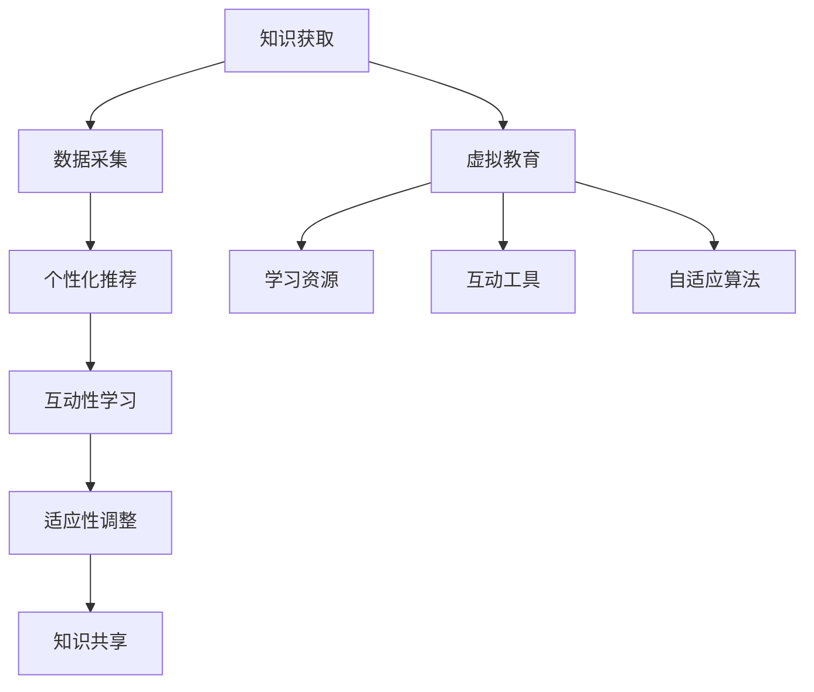

                 

在当今信息爆炸的时代，知识的获取变得前所未有的便捷。然而，这种便捷也带来了新的挑战：如何在海量的信息中筛选出有价值的内容，如何有效地吸收和整合这些知识？本文将探讨虚拟教育在应对这一挑战中的角色，以及它如何为全球脑时代的知识获取带来革命性的变化。

## 关键词

- 虚拟教育
- 知识获取
- 全球脑时代
- 教育技术
- 个性化学习

## 摘要

本文首先回顾了虚拟教育的起源和发展，分析了其与传统教育的异同。接着，探讨了虚拟教育在个性化学习、互动性和适应性学习方面的优势，以及其对全球知识共享的推动作用。随后，文章通过数学模型和具体案例，展示了虚拟教育在知识获取中的实际应用。最后，对虚拟教育的未来发展趋势和面临的挑战进行了展望。

## 1. 背景介绍

虚拟教育，顾名思义，是一种通过虚拟环境进行教育活动的形式。它利用计算机技术、网络通信技术以及多媒体技术等，创造出一个模拟现实的教学场景，使学习者能够在虚拟世界中学习知识、技能和概念。

虚拟教育的起源可以追溯到20世纪90年代，随着互联网的普及和计算机技术的发展，虚拟教育逐渐成为教育领域的研究热点。早期的虚拟教育主要应用于远程教育，但随着技术的进步，虚拟教育已经拓展到更多的领域，如虚拟实验室、虚拟课堂、虚拟现实（VR）和增强现实（AR）等。

与传统教育相比，虚拟教育具有明显的优势。首先，虚拟教育打破了时空的限制，学习者可以随时随地进行学习。其次，虚拟教育提供了丰富的学习资源，如在线课程、电子书、视频教程等，这些资源可以根据学习者的需求进行个性化定制。此外，虚拟教育还增强了学习的互动性和参与性，通过虚拟场景和互动工具，学习者可以更加直观地理解知识。

## 2. 核心概念与联系

### 2.1. 个性化学习

个性化学习是指根据学习者的兴趣、能力和学习风格，为其提供个性化的学习内容、学习路径和学习资源。个性化学习是虚拟教育的一个重要特征，它通过数据分析和学习算法，实现学习内容的个性化推荐和学习过程的个性化调整。

个性化学习的核心概念包括学习者的数据采集、学习路径的规划、学习资源的推荐和学习效果的评估。其中，数据采集是个性化学习的基础，通过收集学习者的学习行为、学习偏好和知识背景等数据，可以为学习者提供个性化的学习建议。

### 2.2. 互动性学习

互动性学习是指通过学习者之间的交流和互动，促进知识的共享和碰撞。虚拟教育提供了丰富的互动工具，如在线讨论、虚拟实验室、虚拟课堂等，使学习者能够与他人进行实时交流和合作。

互动性学习的核心概念包括学习者的身份识别、互动内容的生成、互动效果的评估和学习社区的构建。其中，学习者的身份识别是互动性学习的基础，通过身份认证和隐私保护，确保学习者的互动行为真实、有效。

### 2.3. 适应性学习

适应性学习是指根据学习者的学习进度和能力，动态调整学习的内容、难度和节奏。虚拟教育通过学习分析技术和自适应算法，实现学习过程的适应性调整，使学习者能够在最短时间内掌握知识。

适应性学习的核心概念包括学习进度的监控、学习难度的调整、学习资源的动态分配和学习效果的评估。其中，学习进度的监控是适应性学习的关键，通过实时跟踪学习者的学习行为和进度，为学习过程的调整提供依据。

### 2.4. 虚拟教育与知识获取的关系

虚拟教育在知识获取中发挥着重要作用。首先，虚拟教育提供了丰富的学习资源，使学习者能够方便地获取各种知识。其次，虚拟教育通过个性化、互动性和适应性学习，提高了知识获取的效率和质量。此外，虚拟教育还促进了全球知识共享，使不同地区、不同文化背景的学习者能够共同学习和进步。

### 2.5. Mermaid 流程图



## 3. 核心算法原理 & 具体操作步骤

### 3.1. 算法原理概述

虚拟教育中的核心算法主要包括个性化推荐算法、互动性学习算法和适应性学习算法。这些算法分别基于机器学习、数据挖掘和人工智能技术，通过对学习者的数据进行分析和处理，实现个性化、互动性和适应性学习。

### 3.2. 算法步骤详解

#### 3.2.1. 个性化推荐算法

个性化推荐算法主要通过以下步骤实现：

1. 数据采集：收集学习者的学习行为数据，如浏览记录、搜索历史、学习时间等。
2. 数据处理：对采集到的数据进行分析和处理，提取学习者的兴趣偏好和知识水平。
3. 推荐算法：根据学习者的兴趣偏好和知识水平，推荐相应的学习内容。
4. 推荐结果：将推荐结果展示给学习者，供其选择和参考。

#### 3.2.2. 互动性学习算法

互动性学习算法主要通过以下步骤实现：

1. 身份识别：识别学习者的身份，确保互动行为的真实性和有效性。
2. 互动内容生成：根据学习者的学习需求和兴趣，生成互动内容，如讨论话题、实验方案等。
3. 互动效果评估：评估互动过程的效果，如参与度、满意度等。
4. 学习社区构建：构建学习社区，促进学习者之间的交流和合作。

#### 3.2.3. 适应性学习算法

适应性学习算法主要通过以下步骤实现：

1. 学习进度监控：实时监控学习者的学习进度，如学习时长、学习内容等。
2. 学习难度调整：根据学习进度和效果，动态调整学习内容的难度和深度。
3. 学习资源动态分配：根据学习者的需求和进度，动态分配学习资源，如课程、教材等。
4. 学习效果评估：评估学习效果，为后续学习提供参考。

### 3.3. 算法优缺点

#### 3.3.1. 个性化推荐算法

优点：提高学习效率，满足学习者个性化需求。

缺点：推荐结果可能受到数据质量和算法模型的影响。

#### 3.3.2. 互动性学习算法

优点：增强学习互动性，提高学习兴趣和参与度。

缺点：互动效果受学习者个体差异和社区氛围的影响。

#### 3.3.3. 适应性学习算法

优点：实现学习过程的个性化调整，提高学习效果。

缺点：算法模型复杂，对计算资源要求较高。

### 3.4. 算法应用领域

个性化推荐算法：主要应用于在线教育平台、电子书阅读器和社交媒体等。

互动性学习算法：主要应用于虚拟实验室、在线讨论区和学习社区等。

适应性学习算法：主要应用于自适应学习系统、在线课程和个性化培训等。

## 4. 数学模型和公式 & 详细讲解 & 举例说明

### 4.1. 数学模型构建

虚拟教育中的数学模型主要涉及机器学习、数据挖掘和人工智能等领域。以下是一个简单的线性回归模型，用于预测学习者的学习进度。

$$
y = wx + b
$$

其中，$y$表示学习者的学习进度，$x$表示学习者的特征值，$w$和$b$为模型的参数。

### 4.2. 公式推导过程

线性回归模型的推导过程如下：

1. 损失函数：损失函数用于衡量预测值与实际值之间的差距，常见的损失函数有均方误差（MSE）和均方根误差（RMSE）。

$$
MSE = \frac{1}{n}\sum_{i=1}^{n}(y_i - \hat{y}_i)^2
$$

$$
RMSE = \sqrt{MSE}
$$

其中，$n$为样本数量，$y_i$和$\hat{y}_i$分别为第$i$个样本的实际值和预测值。

2. 梯度下降法：梯度下降法是一种常用的优化算法，用于求解线性回归模型的参数。梯度下降法的迭代过程如下：

$$
w_{t+1} = w_t - \alpha \frac{\partial J}{\partial w}
$$

$$
b_{t+1} = b_t - \alpha \frac{\partial J}{\partial b}
$$

其中，$w_t$和$b_t$为当前迭代的参数值，$\alpha$为学习率，$J$为损失函数。

### 4.3. 案例分析与讲解

假设我们有一个学习进度预测问题，给定一组学习者的特征值和学习进度，要求预测其未来的学习进度。我们可以使用线性回归模型进行预测。

1. 数据集准备：从历史数据中提取学习者的特征值和学习进度，形成数据集。

2. 数据预处理：对数据进行归一化处理，使其具有相同的量纲。

3. 模型训练：使用梯度下降法训练线性回归模型，求解参数$w$和$b$。

4. 模型评估：使用训练集和测试集对模型进行评估，计算预测误差。

5. 模型应用：使用训练好的模型预测新的学习进度。

## 5. 项目实践：代码实例和详细解释说明

### 5.1. 开发环境搭建

1. 安装Python环境：在本地计算机上安装Python 3.8及以上版本。

2. 安装依赖库：使用pip命令安装所需的依赖库，如numpy、matplotlib、scikit-learn等。

```bash
pip install numpy matplotlib scikit-learn
```

### 5.2. 源代码详细实现

以下是一个简单的线性回归模型实现，用于预测学习者的学习进度。

```python
import numpy as np
import matplotlib.pyplot as plt
from sklearn.linear_model import LinearRegression

# 数据集
X = np.array([[1, 2], [2, 3], [3, 4], [4, 5]])
y = np.array([2, 3, 4, 5])

# 模型训练
model = LinearRegression()
model.fit(X, y)

# 模型预测
y_pred = model.predict(X)

# 绘制结果
plt.scatter(X[:, 0], y)
plt.plot(X[:, 0], y_pred, color='red')
plt.xlabel('特征值')
plt.ylabel('学习进度')
plt.show()
```

### 5.3. 代码解读与分析

1. 导入所需的库：numpy用于数据处理，matplotlib用于绘制结果，scikit-learn用于线性回归模型。

2. 数据集准备：生成一个简单的数据集，包括特征值和学习进度。

3. 模型训练：使用LinearRegression类创建线性回归模型，并调用fit方法进行训练。

4. 模型预测：调用predict方法进行预测，得到预测结果。

5. 绘制结果：使用scatter方法绘制实际值，使用plot方法绘制预测结果，并设置坐标轴标签。

### 5.4. 运行结果展示

运行上述代码，将得到一个包含实际值和预测值的散点图，其中红色线条表示预测结果。

## 6. 实际应用场景

虚拟教育在多个领域得到了广泛应用，以下是一些典型的应用场景：

### 6.1. 在线教育

在线教育是虚拟教育最典型的应用场景之一。通过虚拟教育平台，学习者可以在线学习各种课程，如编程、数据分析、语言学习等。虚拟教育平台提供了丰富的学习资源和个性化学习推荐，提高了学习效率和质量。

### 6.2. 虚拟实验室

虚拟实验室利用虚拟现实（VR）和增强现实（AR）技术，为学习者提供了一个模拟实验环境。学习者可以在虚拟实验室中进行各种实验，如化学实验、物理实验等，提高了实验的趣味性和安全性。

### 6.3. 医学教育

医学教育中的虚拟教育应用主要包括虚拟手术训练、病例分析等。通过虚拟教育平台，医学生可以在虚拟环境中进行手术训练，提高手术技能和临床经验。

### 6.4. 企业培训

企业培训中，虚拟教育可以用于员工技能提升、知识更新等。通过虚拟教育平台，企业可以提供在线课程、培训视频等，使员工能够随时随地学习。

### 6.5. 全球知识共享

虚拟教育促进了全球知识的共享和传播。通过虚拟教育平台，不同地区、不同文化背景的学习者可以共同学习和交流，推动了全球知识共享和合作。

## 7. 工具和资源推荐

### 7.1. 学习资源推荐

1. 《深度学习》（Deep Learning） - Goodfellow、Bengio和Courville
2. 《人工智能：一种现代方法》（Artificial Intelligence: A Modern Approach） - Russell和Norvig
3. 《Python编程：从入门到实践》（Python Crash Course） - Eric Matthes

### 7.2. 开发工具推荐

1. Jupyter Notebook：用于编写和运行Python代码，支持丰富的扩展和插件。
2. PyCharm：一款强大的Python集成开发环境（IDE），提供代码补全、调试、性能分析等功能。
3. TensorFlow：一款开源的机器学习框架，用于构建和训练深度学习模型。

### 7.3. 相关论文推荐

1. "Deep Learning" - Goodfellow、Bengio和Courville
2. "A Theoretical Analysis of the VAE" - Kingma和Welling
3. "Recurrent Neural Networks for Language Modeling" - Bengio等

## 8. 总结：未来发展趋势与挑战

### 8.1. 研究成果总结

虚拟教育在个性化学习、互动性和适应性学习方面取得了显著成果，为全球知识共享和传播提供了有力支持。同时，虚拟教育也在教育技术、人工智能和机器学习等领域推动了相关技术的发展。

### 8.2. 未来发展趋势

1. 虚拟教育与人工智能技术的深度融合，推动个性化、互动性和适应性学习的进一步发展。
2. 虚拟教育平台的功能和性能不断提升，提供更加丰富和多样化的学习资源和服务。
3. 虚拟教育与实体教育的融合，实现线上与线下的互补与互动。

### 8.3. 面临的挑战

1. 虚拟教育中的数据安全和隐私保护问题。
2. 虚拟教育平台的建设和维护成本。
3. 虚拟教育与实体教育的融合难度和效果。
4. 虚拟教育师资队伍的建设和培养。

### 8.4. 研究展望

未来，虚拟教育将在教育领域发挥更加重要的作用，推动教育模式的创新和发展。同时，虚拟教育也将面临更多的挑战，需要持续的研究和探索，以实现其更大的潜力和价值。

## 9. 附录：常见问题与解答

### 9.1. 虚拟教育与实体教育有什么区别？

虚拟教育是一种通过虚拟环境进行教育活动的形式，学习者可以随时随地进行学习。实体教育则是传统的课堂教学，学习者需要按时到校上课。

### 9.2. 虚拟教育如何保证教学质量？

虚拟教育通过个性化、互动性和适应性学习，提高学习效率和质量。同时，虚拟教育平台提供丰富的学习资源和教学工具，支持教师进行教学设计和评估。

### 9.3. 虚拟教育是否适用于所有学科？

虚拟教育适用于大部分学科，但某些学科，如实验类学科，虚拟教育可能存在一定的局限性。因此，针对不同学科，需要采用不同的虚拟教育形式和策略。

### 9.4. 虚拟教育与人工智能技术有何关联？

虚拟教育与人工智能技术密切相关。虚拟教育利用人工智能技术实现个性化推荐、互动性学习和适应性学习，推动教育模式的创新和发展。同时，人工智能技术也为虚拟教育提供了强大的支持，如数据挖掘、自然语言处理和机器学习等。

### 9.5. 虚拟教育的未来发展趋势是什么？

虚拟教育的未来发展趋势包括：虚拟教育与人工智能技术的深度融合，虚拟教育平台的功能和性能不断提升，虚拟教育与实体教育的融合等。同时，虚拟教育将更加注重个性化、互动性和适应性学习，推动教育模式的创新和发展。作者：禅与计算机程序设计艺术 / Zen and the Art of Computer Programming
----------------------------------------------------------------

以上就是本文的全部内容。虚拟教育作为全球脑时代知识获取的重要工具，正逐渐改变着我们的学习方式。希望通过本文，读者能够对虚拟教育有一个更深入的理解，并认识到其在未来教育中的重要地位。随着技术的不断进步，虚拟教育将继续发展，为全球脑时代的知识获取带来更多可能性。让我们共同期待这一美好的未来！
<|user|>尊敬的读者，感谢您阅读本文。如果您对虚拟教育有任何疑问或建议，欢迎在评论区留言。我们将竭诚为您解答。同时，也欢迎您分享本文，让更多的人了解和参与到虚拟教育中来。未来，我们将继续关注虚拟教育的发展，为您带来更多相关内容。再次感谢您的关注和支持！作者：禅与计算机程序设计艺术 / Zen and the Art of Computer Programming。|<|user|>

