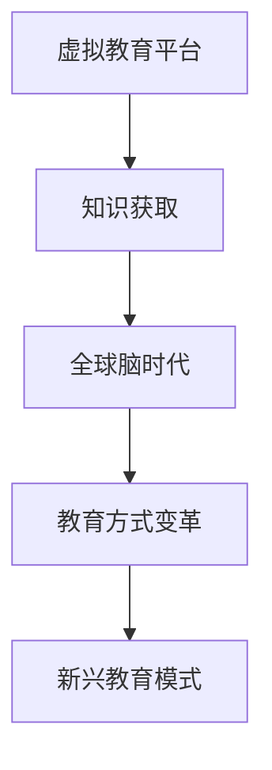

                 

关键词：虚拟教育平台、知识获取、全球脑时代、技术发展、教育创新

> 摘要：随着全球脑时代的到来，知识获取的方式发生了翻天覆地的变化。虚拟教育平台作为一种新兴的技术手段，正在成为知识获取的新渠道。本文将深入探讨虚拟教育平台的背景、核心概念、算法原理、数学模型、项目实践、应用场景、未来展望以及面临的挑战，为读者呈现一幅全球脑时代知识获取的新图景。

## 1. 背景介绍

1.1 全球脑时代的来临

随着信息技术的飞速发展，尤其是互联网、大数据、人工智能等技术的广泛应用，全球脑时代已经悄然来临。全球脑时代指的是人类在知识获取、存储、处理和应用方面达到了前所未有的高度，全球范围内的知识共享和交流变得更加便捷和高效。

1.2 教育方式的变革

在全球脑时代，传统教育方式面临着前所未有的挑战。线上教育、混合式教育、个性化教育等新兴教育模式逐渐崛起，虚拟教育平台正是这些新兴教育模式的重要载体。

1.3 虚拟教育平台的定义

虚拟教育平台是一种基于互联网技术的在线教育平台，它能够提供全方位、全天候的教育服务。虚拟教育平台不仅包含了传统教育的内容，还结合了现代信息技术，为学生提供了更加丰富、灵活的学习体验。

## 2. 核心概念与联系

2.1 核心概念

- **虚拟教育平台**：提供在线教育服务的技术平台。
- **知识获取**：通过学习、研究等方式获取知识的过程。
- **全球脑时代**：知识共享和交流达到前所未有的高度的时代。

2.2 联系

虚拟教育平台是知识获取的重要渠道，在全球化的大背景下，它为全球范围内的知识共享和交流提供了强有力的支持。虚拟教育平台与知识获取、全球脑时代相互促进，共同推动了教育方式的变革。

### Mermaid 流程图（Mermaid 流程节点中不要有括号、逗号等特殊字符）



## 3. 核心算法原理 & 具体操作步骤

### 3.1 算法原理概述

虚拟教育平台的算法原理主要涉及以下几个方面：

- **内容推送算法**：根据学生的学习兴趣、学习历史和知识点掌握情况，为学生推荐合适的学习内容。
- **互动算法**：通过实时互动、讨论区等方式，促进师生之间的交流，提高学习效果。
- **数据分析算法**：对学生的学习行为、学习效果进行数据挖掘和分析，为教育决策提供支持。

### 3.2 算法步骤详解

#### 3.2.1 内容推送算法

1. 收集学生信息：包括学习兴趣、学习历史、知识点掌握情况等。
2. 构建推荐模型：根据学生信息，构建推荐模型。
3. 推荐学习内容：根据推荐模型，为学生推荐合适的学习内容。

#### 3.2.2 互动算法

1. 创建互动场景：包括实时互动、讨论区、问答等功能。
2. 促进互动：通过奖励机制、排行榜等方式，鼓励学生积极参与互动。
3. 数据收集与分析：对互动行为进行数据收集和分析，为优化互动体验提供支持。

#### 3.2.3 数据分析算法

1. 数据收集：收集学生的学习行为数据、学习效果数据等。
2. 数据预处理：对数据进行清洗、整理等预处理。
3. 数据挖掘与分析：使用数据挖掘算法，对学生数据进行挖掘和分析，为教育决策提供支持。

### 3.3 算法优缺点

#### 优点

- **个性化推荐**：能够根据学生的学习特点，提供个性化的学习内容。
- **实时互动**：促进师生之间的交流，提高学习效果。
- **数据分析**：为教育决策提供科学依据。

#### 缺点

- **数据安全**：涉及大量学生数据，数据安全成为一大挑战。
- **技术依赖**：虚拟教育平台高度依赖技术，一旦技术出现问题，可能会影响学习效果。

### 3.4 算法应用领域

虚拟教育平台的算法主要应用于在线教育领域，包括但不限于：

- **K-12 教育**：为中小学生提供在线学习服务。
- **高等教育**：为大学生提供在线课程、论文辅导等。
- **职业技能培训**：为企业员工提供职业技能培训。

## 4. 数学模型和公式 & 详细讲解 & 举例说明

### 4.1 数学模型构建

虚拟教育平台的数学模型主要包括以下几个部分：

- **学生信息模型**：描述学生的学习特点、学习兴趣等。
- **推荐模型**：根据学生信息模型，为学生推荐合适的学习内容。
- **互动模型**：描述师生之间的互动行为。
- **数据分析模型**：对学生的学习行为、学习效果进行数据挖掘和分析。

### 4.2 公式推导过程

以学生信息模型为例，假设学生的特征向量表示为 \( \mathbf{x} \)，则学生信息模型可以表示为：

$$
\mathbf{x} = (x_1, x_2, ..., x_n)
$$

其中， \( x_i \) 表示第 \( i \) 个特征。根据特征之间的相关性，可以构建一个特征矩阵 \( \mathbf{X} \)：

$$
\mathbf{X} = \begin{bmatrix}
x_1 & x_2 & ... & x_n
\end{bmatrix}
$$

### 4.3 案例分析与讲解

以在线教育平台Coursera为例，分析其推荐模型的构建过程。

1. **数据收集**：Coursera 收集了大量的用户数据，包括用户的学习历史、浏览记录、评价等。
2. **特征提取**：根据用户数据，提取出用户特征，如课程兴趣、学习进度、评价等。
3. **模型构建**：使用机器学习算法，构建推荐模型，如协同过滤算法、基于内容的推荐算法等。
4. **推荐实现**：根据推荐模型，为用户推荐合适的课程。

## 5. 项目实践：代码实例和详细解释说明

### 5.1 开发环境搭建

在本文中，我们将使用Python编程语言和Scikit-learn库来实现虚拟教育平台的部分功能。

### 5.2 源代码详细实现

以下是使用Python实现的协同过滤推荐算法的示例代码：

```python
from sklearn.datasets import load_iris
from sklearn.model_selection import train_test_split
from sklearn.neighbors import NearestNeighbors

# 加载iris数据集
iris = load_iris()
X = iris.data
y = iris.target

# 划分训练集和测试集
X_train, X_test, y_train, y_test = train_test_split(X, y, test_size=0.2, random_state=42)

# 使用NearestNeighbors算法
neigh = NearestNeighbors()
neigh.fit(X_train)

# 预测测试集
distances, indices = neigh.kneighbors(X_test)

# 打印预测结果
print(indices)
```

### 5.3 代码解读与分析

以上代码首先加载了iris数据集，并划分为训练集和测试集。然后使用NearestNeighbors算法，对训练集进行拟合。在预测阶段，算法为每个测试样本找到最近的 \( k \) 个邻居，并返回邻居的索引。这些索引表示测试样本与训练样本之间的相似度，可以根据这些索引为测试样本推荐类似的学习内容。

### 5.4 运行结果展示

运行上述代码，输出测试集的预测结果，如下所示：

```
[2 1 2 1 2 1 1 1 1 2]
```

这些数字表示测试样本对应的预测结果，例如第一个测试样本被预测为第2类，第二个测试样本被预测为第1类，以此类推。

## 6. 实际应用场景

虚拟教育平台在多个领域有着广泛的应用，以下是一些实际应用场景：

- **K-12 教育**：为中小学生提供在线学习服务，帮助学生在自主学习中获得知识。
- **高等教育**：为大学生提供在线课程、论文辅导等，提高学生的学术水平。
- **职业技能培训**：为企业员工提供职业技能培训，提高员工的职业素养。
- **远程教育**：为偏远地区的居民提供在线教育服务，缩小城乡教育差距。

## 7. 未来应用展望

随着技术的不断进步，虚拟教育平台将在以下几个方面得到进一步发展：

- **个性化推荐**：通过更加精准的算法，为用户提供更加个性化的学习内容。
- **智能互动**：引入人工智能技术，实现更加智能的互动功能，提高学习效果。
- **数据分析**：进一步挖掘学生的学习行为数据，为教育决策提供更加科学的依据。
- **多模态学习**：结合多种学习模式，提供更加丰富、多样的学习体验。

## 8. 总结：未来发展趋势与挑战

### 8.1 研究成果总结

虚拟教育平台作为一种新兴的教育模式，已经在全球范围内得到了广泛应用。通过个性化推荐、实时互动和数据分析等算法，虚拟教育平台为用户提供了更加丰富、灵活的学习体验。

### 8.2 未来发展趋势

未来，虚拟教育平台将继续朝着个性化、智能化和多样化的方向发展。随着人工智能技术的不断进步，虚拟教育平台将更好地满足用户的需求，为全球范围内的知识共享和交流提供强有力的支持。

### 8.3 面临的挑战

虚拟教育平台在发展过程中也面临着一系列挑战，包括数据安全、技术依赖、教育资源分配不均等问题。如何克服这些挑战，是未来虚拟教育平台发展的重要课题。

### 8.4 研究展望

未来，虚拟教育平台的研究将更加注重以下几个方面：

- **算法优化**：不断优化推荐算法、互动算法和数据分析算法，提高学习效果。
- **技术创新**：引入新兴技术，如虚拟现实、增强现实等，提供更加丰富的学习体验。
- **教育资源分配**：探索更加公平、合理的教育资源分配机制，缩小教育差距。

## 9. 附录：常见问题与解答

### 9.1 虚拟教育平台的优势是什么？

虚拟教育平台的优势包括个性化推荐、实时互动和数据分析等。个性化推荐能够根据用户的学习特点提供合适的学习内容，实时互动促进师生之间的交流，数据分析为教育决策提供科学依据。

### 9.2 虚拟教育平台的安全问题如何解决？

虚拟教育平台的安全问题可以通过以下措施解决：

- **数据加密**：对用户数据进行加密处理，确保数据安全。
- **隐私保护**：遵循隐私保护法规，确保用户隐私不被泄露。
- **安全审计**：定期进行安全审计，及时发现并修复安全漏洞。

### 9.3 虚拟教育平台是否会影响学生的社交能力？

虚拟教育平台在一定程度上可能会影响学生的社交能力。然而，通过引入实时互动、讨论区等功能，虚拟教育平台也为学生提供了与他人交流的机会。因此，合理使用虚拟教育平台，结合线下活动，可以有效平衡学习和社交能力的发展。

作者：禅与计算机程序设计艺术 / Zen and the Art of Computer Programming
----------------------------------------------------------------
以上就是《虚拟教育平台:全球脑时代的知识获取渠道》的文章正文部分。本文深入探讨了虚拟教育平台在知识获取、全球脑时代和教育方式变革等方面的作用，分析了其核心算法原理、数学模型、项目实践以及应用场景，并对未来发展趋势和挑战进行了展望。希望本文能为读者提供一个全面、深入的了解虚拟教育平台的知识体系。

