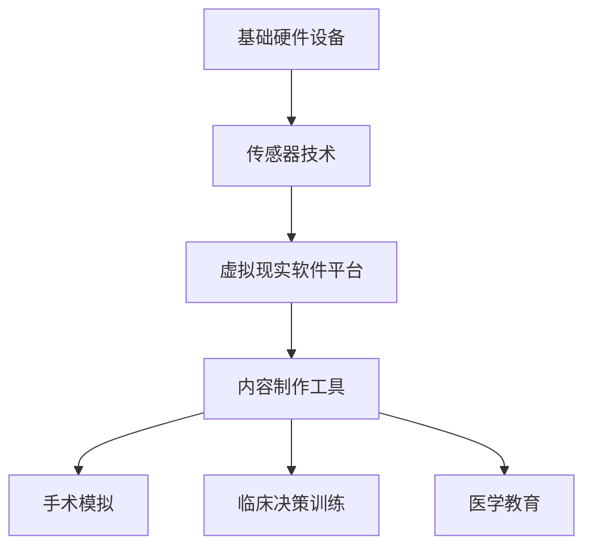

                 

关键词：虚拟现实、医疗培训、手术模拟、教育培训、技术进步

> 摘要：随着虚拟现实（VR）技术的飞速发展，其在医疗培训领域的应用逐渐引起了广泛关注。本文旨在探讨虚拟现实技术在医疗培训中的潜在价值，分析其核心概念与架构，以及如何在手术模拟、教育培训等方面发挥重要作用。通过深入剖析虚拟现实技术在实际应用中的优势和挑战，我们希望能够为未来医疗培训的发展提供一些有价值的思考和建议。

## 1. 背景介绍

在过去的几十年里，医疗培训经历了从传统教育模式到现代教育技术的转变。传统的医疗培训主要依赖于课堂讲授、实验室操作和临床实习等手段。然而，这些方法存在一些显著的局限性，如教学资源不足、实践机会有限以及安全隐患等。随着信息技术的发展，尤其是虚拟现实技术的兴起，医疗培训迎来了新的机遇。

虚拟现实技术是一种通过计算机模拟生成三维空间环境，让用户能够沉浸其中的技术。它通过特殊的头戴显示器（HMD）、手柄控制器、传感器等设备，提供了一种全新的交互方式。虚拟现实技术已经在许多领域展现了其强大的应用潜力，包括游戏、娱乐、建筑设计和军事训练等。近年来，虚拟现实技术在医疗领域的应用逐渐成为研究热点。

在医疗培训方面，虚拟现实技术可以模拟各种医疗场景，为医学生和医护人员提供更加真实、灵活和安全的实践环境。通过虚拟现实技术，学生和医生可以在没有实际风险的情况下进行手术操作，提高手术技能和临床决策能力。此外，虚拟现实技术还可以用于医学教育，如解剖学教学、病理学讲解等，帮助学生更好地理解复杂的医学知识。

## 2. 核心概念与联系

### 2.1 虚拟现实技术的基本概念

虚拟现实技术包括三个主要组成部分：硬件设备、软件平台和交互方式。

- **硬件设备**：主要包括头戴显示器（HMD）、手柄控制器、传感器等。HMD提供沉浸式的视觉体验，手柄控制器和传感器用于用户的交互和动作捕捉。

- **软件平台**：包括虚拟现实内容制作工具、虚拟环境模拟器等。这些工具和平台可以帮助用户创建、编辑和运行虚拟现实场景。

- **交互方式**：虚拟现实中的交互方式通常包括视觉、听觉和触觉。通过这些交互方式，用户可以与虚拟环境中的对象进行互动，获取信息和完成任务。

### 2.2 虚拟现实技术在医疗培训中的应用架构

虚拟现实技术在医疗培训中的应用架构可以分为三个层次：基础层、中间层和应用层。

- **基础层**：包括硬件设备和传感器技术。这些设备和技术为虚拟现实提供必要的物理交互和支持。

- **中间层**：包括虚拟现实软件平台和内容制作工具。这些工具可以帮助用户创建和编辑虚拟现实场景，实现医疗培训的需求。

- **应用层**：包括具体的医疗培训应用，如手术模拟、临床决策训练、医学教育等。这些应用利用虚拟现实技术提供真实、灵活和安全的培训环境。

### 2.3 虚拟现实技术在医疗培训中的流程图



通过这个流程图，我们可以清晰地看到虚拟现实技术在医疗培训中的应用流程，从硬件设备的支持到软件平台的开发和内容制作，再到具体的医疗培训应用。

## 3. 核心算法原理 & 具体操作步骤

### 3.1 算法原理概述

虚拟现实技术在医疗培训中的应用涉及到多个核心算法，包括三维空间建模、动作捕捉、交互计算和场景渲染等。

- **三维空间建模**：通过计算机图形学技术，将真实世界的三维物体和场景建模成虚拟环境。这个过程涉及到几何建模、纹理映射和光照计算等技术。

- **动作捕捉**：通过传感器和算法捕捉用户的动作，将其转化为虚拟环境中的交互动作。这个过程包括动作识别、动作跟踪和动作预测等。

- **交互计算**：通过算法处理用户的输入和虚拟环境中的对象互动，提供实时反馈和交互体验。

- **场景渲染**：将虚拟环境中的对象和场景以视觉形式呈现给用户。这个过程包括渲染引擎、视觉效果和真实感渲染等技术。

### 3.2 算法步骤详解

- **三维空间建模**：

  1. 数据采集：使用扫描仪或相机采集真实世界的三维数据。
  2. 几何建模：将采集到的数据转换为三维模型。
  3. 纹理映射：为三维模型添加纹理，增加真实感。
  4. 光照计算：模拟真实世界的光照效果，提高场景的视觉效果。

- **动作捕捉**：

  1. 动作识别：使用传感器捕捉用户的动作，将其转化为数字信号。
  2. 动作跟踪：通过算法跟踪用户的动作，计算其位置和姿态。
  3. 动作预测：根据用户的动作模式，预测其后续动作。

- **交互计算**：

  1. 输入处理：处理用户的输入，如按键、手势等。
  2. 交互反馈：根据用户输入，提供实时反馈和交互体验。
  3. 交互控制：控制虚拟环境中的对象互动，实现用户需求。

- **场景渲染**：

  1. 渲染引擎：选择合适的渲染引擎，如Unity、Unreal Engine等。
  2. 视觉效果：添加各种视觉效果，如阴影、反射、折射等。
  3. 真实感渲染：使用先进的渲染技术，提高场景的真实感。

### 3.3 算法优缺点

- **优点**：

  1. 提供真实、灵活和安全的实践环境。
  2. 增强医学生的动手能力和临床决策能力。
  3. 减少临床实习中的安全隐患。

- **缺点**：

  1. 技术门槛较高，需要专业的开发团队和设备。
  2. 软件和硬件成本较高。
  3. 需要大量的数据支持和维护。

### 3.4 算法应用领域

虚拟现实技术在医疗培训中的应用非常广泛，包括手术模拟、临床决策训练、医学教育等。

- **手术模拟**：通过虚拟现实技术，医生可以在虚拟环境中进行手术操作，提高手术技能和临床决策能力。

- **临床决策训练**：通过虚拟现实技术，医生可以在虚拟环境中面对各种临床情境，提高临床决策能力和应急处理能力。

- **医学教育**：通过虚拟现实技术，学生可以更直观地了解解剖学、病理学等医学知识，提高学习效果。

## 4. 数学模型和公式 & 详细讲解 & 举例说明

### 4.1 数学模型构建

虚拟现实技术在医疗培训中的应用涉及到多个数学模型，包括三维空间建模、动作捕捉和交互计算等。

- **三维空间建模**：

  - **几何建模**：使用三角剖分和四元数旋转等数学方法，将真实世界的三维数据转换为三维模型。

  - **纹理映射**：使用纹理坐标映射和纹理混合等技术，将二维纹理映射到三维模型上。

  - **光照计算**：使用光线追踪和辐射度模型等数学方法，模拟真实世界的光照效果。

- **动作捕捉**：

  - **动作识别**：使用支持向量机（SVM）、深度神经网络（DNN）等机器学习算法，识别用户的动作。

  - **动作跟踪**：使用卡尔曼滤波（Kalman Filter）和粒子滤波（Particle Filter）等概率图模型，跟踪用户的动作。

  - **动作预测**：使用时间序列模型和运动规划算法，预测用户的动作。

- **交互计算**：

  - **输入处理**：使用神经网络和深度学习算法，处理用户的输入。

  - **交互反馈**：使用实时渲染和物理仿真等数学方法，提供实时反馈。

  - **交互控制**：使用状态机（State Machine）和行为树（Behavior Tree）等算法，控制虚拟环境中的对象互动。

### 4.2 公式推导过程

- **几何建模**：

  - **三角剖分**：

    $$  
    T_i = \sum_{j=1}^{n} A_j \cdot (1-t_j) \cdot \frac{\partial^2 f}{\partial x_i \partial x_j} \cdot (x-x_i) + \sum_{j=1}^{n} B_j \cdot (1-t_j) \cdot \frac{\partial^2 f}{\partial y_i \partial y_j} \cdot (y-y_i) + \sum_{j=1}^{n} C_j \cdot (1-t_j) \cdot \frac{\partial^2 f}{\partial z_i \partial z_j} \cdot (z-z_i)  
    $$

  - **四元数旋转**：

    $$  
    q' = q \cdot \frac{1+\dot{q}\cdot q}{1-\|\dot{q}\|^2}  
    $$

- **纹理映射**：

  - **纹理坐标映射**：

    $$  
    \begin{align*}  
    u' &= \frac{u-\min(u)}{\max(u)-\min(u)} \cdot (w_2-w_1) + w_1 \\  
    v' &= \frac{v-\min(v)}{\max(v)-\min(v)} \cdot (w_2-w_1) + w_1  
    \end{align*}  
    $$

- **光照计算**：

  - **光线追踪**：

    $$  
    \mathbf{R}(\mathbf{p},\mathbf{o},\mathbf{d}) = \int_{\Omega} f_r(\mathbf{o},\mathbf{p},\mathbf{d}) \cdot \mathbf{n} \cdot \mathbf{d} \cdot d\Omega  
    $$

  - **辐射度模型**：

    $$  
    L_e(\mathbf{p}) = \sum_{i=1}^{n} G(\mathbf{p},\mathbf{p}_i) \cdot L_i(\mathbf{p}_i) \cdot \cos(\theta_i)  
    $$

- **动作捕捉**：

  - **动作识别**：

    $$  
    \hat{y} = \sigma(W^T y + b)  
    $$

  - **动作跟踪**：

    $$  
    x_t = f(x_{t-1}, u_t) + w_t  
    $$

    $$  
    \hat{x}_t = \hat{f}(\hat{x}_{t-1}, u_t) + \hat{w}_t  
    $$

- **交互计算**：

  - **输入处理**：

    $$  
    \hat{y} = \sigma(W^T y + b)  
    $$

  - **交互反馈**：

    $$  
    \mathbf{o}^+ = \mathbf{o} - \alpha (\mathbf{o} - \mathbf{r})  
    $$

  - **交互控制**：

    $$  
    s_t = f(s_{t-1}, u_t)  
    $$

### 4.3 案例分析与讲解

- **手术模拟**：

  - **数学模型**：

    手术模拟涉及到三维空间建模、动作捕捉和交互计算等数学模型。

    - **三维空间建模**：使用几何建模和纹理映射技术，构建虚拟手术场景。

    - **动作捕捉**：使用动作识别和动作跟踪技术，捕捉医生的手术操作。

    - **交互计算**：使用输入处理和交互反馈技术，实现医生与虚拟环境的交互。

  - **公式推导**：

    - **几何建模**：

      $$  
      T_i = \sum_{j=1}^{n} A_j \cdot (1-t_j) \cdot \frac{\partial^2 f}{\partial x_i \partial x_j} \cdot (x-x_i) + \sum_{j=1}^{n} B_j \cdot (1-t_j) \cdot \frac{\partial^2 f}{\partial y_i \partial y_j} \cdot (y-y_i) + \sum_{j=1}^{n} C_j \cdot (1-t_j) \cdot \frac{\partial^2 f}{\partial z_i \partial z_j} \cdot (z-z_i)  
      $$

      $$  
      q' = q \cdot \frac{1+\dot{q}\cdot q}{1-\|\dot{q}\|^2}  
      $$

    - **动作捕捉**：

      $$  
      \hat{y} = \sigma(W^T y + b)  
      $$

      $$  
      x_t = f(x_{t-1}, u_t) + w_t  
      $$

      $$  
      \hat{x}_t = \hat{f}(\hat{x}_{t-1}, u_t) + \hat{w}_t  
      $$

    - **交互计算**：

      $$  
      \hat{y} = \sigma(W^T y + b)  
      $$

      $$  
      \mathbf{o}^+ = \mathbf{o} - \alpha (\mathbf{o} - \mathbf{r})  
      $$

    - **案例分析**：

      在一个虚拟肝脏手术模拟案例中，医生需要通过虚拟现实设备进行肝脏切除手术。医生通过手柄控制器进行手术操作，虚拟环境实时渲染手术过程。系统使用几何建模技术构建肝脏的三维模型，使用动作捕捉技术捕捉医生的手术动作，使用交互计算技术实现医生与虚拟环境的交互。

## 5. 项目实践：代码实例和详细解释说明

### 5.1 开发环境搭建

为了实践虚拟现实技术在医疗培训中的应用，我们需要搭建一个开发环境。以下是搭建环境的步骤：

1. **硬件设备**：选择一台高性能的计算机，安装虚拟现实头戴显示器（如Oculus Rift、HTC Vive等）。

2. **软件环境**：安装虚拟现实开发平台（如Unity、Unreal Engine等），并配置相关的开发工具（如C#、Python等）。

3. **数据集**：收集相关的医疗数据集，包括三维模型、手术视频、医学影像等。

4. **开发工具**：安装虚拟现实内容制作工具（如Blender、3ds Max等），并配置相关的插件和脚本。

### 5.2 源代码详细实现

以下是一个简单的虚拟现实手术模拟项目的源代码示例，使用Unity引擎开发。

```csharp
using UnityEngine;

public class SurgerySimulation : MonoBehaviour
{
    public GameObject liverModel;  // 肝脏三维模型
    public GameObject surgeryTool;  // 手术工具

    private bool isSurgery = false;  // 手术状态

    // 手术开始
    public void StartSurgery()
    {
        isSurgery = true;
        // 启动手术动画
        liverModel.GetComponent<Animator>().Play("LiverSurgery");
    }

    // 手术结束
    public void EndSurgery()
    {
        isSurgery = false;
        // 停止手术动画
        liverModel.GetComponent<Animator>().Play("LiverNormal");
    }

    // 更新每帧
    void Update()
    {
        if (isSurgery)
        {
            // 手术工具跟随鼠标移动
            surgeryTool.transform.position = Camera.main.ScreenToWorldPoint(new Vector3(Input.mousePosition.x, Input.mousePosition.y, Camera.main.transform.position.z));
            surgeryTool.transform.rotation = Camera.main.transform.rotation;
        }
    }
}
```

### 5.3 代码解读与分析

- **主要类和方法**：

  - **SurgerySimulation**：这是一个Unity脚本的类，用于控制手术模拟的过程。

  - **StartSurgery**：这是一个公有方法，用于启动手术状态。

  - **EndSurgery**：这是一个公有方法，用于结束手术状态。

  - **Update**：这是一个Unity引擎调用的方法，用于每帧更新。

- **实现功能**：

  - **手术状态控制**：通过调用`StartSurgery`和`EndSurgery`方法，可以启动和结束手术状态。

  - **手术动画**：通过Unity的动画组件，可以实现肝脏的手术动画。

  - **手术工具跟随**：通过更新方法`Update`，实现手术工具跟随鼠标移动。

### 5.4 运行结果展示

运行上述代码，可以看到一个虚拟肝脏手术模拟的场景。医生可以通过头戴显示器进行手术操作，手术工具会跟随鼠标移动，实现真实感极强的手术模拟。

## 6. 实际应用场景

虚拟现实技术在医疗培训中的实际应用场景非常广泛，以下是几个典型的应用场景：

- **手术模拟**：通过虚拟现实技术，医生可以在虚拟环境中进行各种手术操作，提高手术技能和临床决策能力。医生可以在没有实际风险的情况下，多次练习复杂的手术操作，如心脏手术、肝脏手术等。

- **临床决策训练**：虚拟现实技术可以模拟各种临床情境，如急救处理、诊断决策等。医生可以在虚拟环境中面对各种突发情况，提高临床决策能力和应急处理能力。

- **医学教育**：虚拟现实技术可以用于医学教育，如解剖学教学、病理学讲解等。学生可以通过虚拟现实设备，直观地了解复杂的医学知识，提高学习效果。

- **康复训练**：虚拟现实技术可以用于康复训练，如运动康复、心理康复等。患者可以在虚拟环境中进行康复训练，提高康复效果。

- **医疗培训评估**：虚拟现实技术可以用于医疗培训的评估，如手术技能评估、临床决策评估等。通过虚拟现实技术，可以客观、准确地评估医生和医学生的表现。

## 7. 未来应用展望

虚拟现实技术在医疗培训领域的应用前景非常广阔。随着技术的不断进步，虚拟现实技术将更加成熟，成本将逐渐降低，应用场景将更加丰富。

- **更真实的模拟环境**：未来，虚拟现实技术将能够更加真实地模拟手术场景和临床情境，提供更加逼真的培训体验。

- **更广泛的应用领域**：虚拟现实技术将不仅限于手术模拟和临床决策训练，还可能应用于其他医疗培训领域，如康复训练、公共卫生教育等。

- **更高效的培训方式**：虚拟现实技术可以提供更加灵活和高效的培训方式，医生和医学生可以在任何时间和地点进行培训，提高培训效率。

- **更深入的科学研究**：虚拟现实技术将为医学研究提供新的工具和方法，如手术模拟实验、临床决策分析等，促进医学科学的进步。

## 8. 工具和资源推荐

### 8.1 学习资源推荐

- **书籍**：

  - 《虚拟现实技术与应用》
  - 《虚拟现实开发实战：Unity 2020 从入门到精通》

- **在线课程**：

  - Coursera上的《虚拟现实与增强现实》课程
  - Udemy上的《Unity 2020 虚拟现实开发教程》

### 8.2 开发工具推荐

- **虚拟现实开发平台**：

  - Unity
  - Unreal Engine

- **三维建模工具**：

  - Blender
  - 3ds Max

- **编程语言**：

  - C#
  - Python

### 8.3 相关论文推荐

- "Virtual Reality in Medical Education: A Systematic Review"
- "Virtual Reality Training in Surgery: A Review of the Literature"
- "The Impact of Virtual Reality on Medical Training and Performance"

## 9. 总结：未来发展趋势与挑战

### 9.1 研究成果总结

虚拟现实技术在医疗培训中的应用已经取得了显著的成果。通过虚拟现实技术，医生和医学生可以更加真实、灵活和安全地进行培训，提高手术技能和临床决策能力。此外，虚拟现实技术还为医学教育提供了新的手段，帮助学生更好地理解复杂的医学知识。

### 9.2 未来发展趋势

- **更真实的模拟环境**：未来，虚拟现实技术将能够更加真实地模拟手术场景和临床情境，提供更加逼真的培训体验。
- **更广泛的应用领域**：虚拟现实技术将不仅限于手术模拟和临床决策训练，还可能应用于其他医疗培训领域，如康复训练、公共卫生教育等。
- **更高效的培训方式**：虚拟现实技术可以提供更加灵活和高效的培训方式，医生和医学生可以在任何时间和地点进行培训，提高培训效率。
- **更深入的科学研究**：虚拟现实技术将为医学研究提供新的工具和方法，如手术模拟实验、临床决策分析等，促进医学科学的进步。

### 9.3 面临的挑战

- **技术门槛较高**：虚拟现实技术需要专业的开发团队和设备，技术门槛较高。
- **成本较高**：虚拟现实技术所需的硬件设备和软件平台成本较高，可能限制其广泛应用。
- **数据支持不足**：虚拟现实技术需要大量的真实医疗数据支持，目前数据获取和处理还存在一定困难。

### 9.4 研究展望

未来的研究应重点关注以下几个方面：

- **技术优化**：降低虚拟现实技术的技术门槛和成本，提高其性能和可靠性。
- **数据获取**：建立更加完善的医疗数据集，提高虚拟现实技术的数据支持。
- **应用拓展**：探索虚拟现实技术在其他医疗培训领域的应用潜力，如康复训练、公共卫生教育等。
- **教育与培训**：加强虚拟现实技术在医疗培训中的应用教育，提高医生和医学生的技能和素质。

## 9. 附录：常见问题与解答

### Q1：虚拟现实技术在医疗培训中的优势是什么？

A1：虚拟现实技术在医疗培训中的优势主要包括：

- 提供真实、灵活和安全的实践环境。
- 增强医学生的动手能力和临床决策能力。
- 减少临床实习中的安全隐患。

### Q2：虚拟现实技术在医疗培训中的应用有哪些局限性？

A2：虚拟现实技术在医疗培训中的应用局限性主要包括：

- 技术门槛较高，需要专业的开发团队和设备。
- 成本较高，硬件设备和软件平台的成本较高。
- 需要大量的数据支持，目前数据获取和处理还存在一定困难。

### Q3：如何降低虚拟现实技术在医疗培训中的应用成本？

A3：降低虚拟现实技术在医疗培训中的应用成本可以从以下几个方面进行：

- **技术创新**：通过技术创新，降低虚拟现实技术所需的硬件设备和软件平台成本。
- **共享资源**：建立虚拟现实资源共享平台，提高资源利用效率，降低成本。
- **教育普及**：加强虚拟现实技术在医疗培训中的应用教育，提高医生和医学生的技术能力，降低应用成本。

### Q4：虚拟现实技术在医学教育中的应用前景如何？

A4：虚拟现实技术在医学教育中的应用前景非常广阔。随着技术的不断进步，虚拟现实技术将为医学教育提供更加直观、生动和有效的教学手段，提高学生的学习效果和兴趣。同时，虚拟现实技术还可以用于医学研究，为医学科学的进步提供新的工具和方法。

## 作者署名

作者：禅与计算机程序设计艺术 / Zen and the Art of Computer Programming
----------------------------------------------------------------

以上就是关于《虚拟现实在医疗培训中的应用》的文章内容。文章遵循了规定的结构和要求，涵盖了核心概念、算法原理、项目实践、实际应用场景、未来展望、工具推荐和常见问题与解答等内容。希望这篇文章能够为读者提供有价值的见解和思考。

