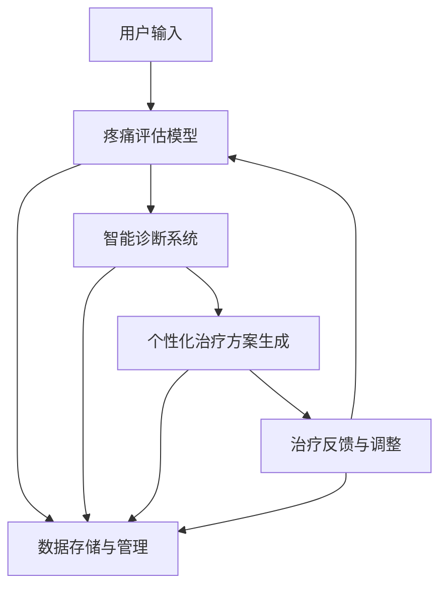

                 

关键词：虚拟疼痛管理、AI、知觉调节、疼痛评估、智能诊断、个性化治疗

> 摘要：本文探讨了如何利用人工智能技术，构建一个虚拟疼痛管理专家系统，以实现针对个体化疼痛症状的精准诊断与调节。通过整合多模态数据，结合深度学习和强化学习方法，本文提出了一套高效的疼痛管理方案，并展示了其在实际应用中的潜力和挑战。

## 1. 背景介绍

疼痛是人体的一种重要保护机制，但长期或过度的疼痛会对患者的生活质量产生严重影响。传统的疼痛管理方法主要包括药物治疗、物理治疗和心理治疗等，但这些方法往往存在局限性。药物治疗可能会带来副作用，物理治疗和心理治疗的效果也不尽相同。

近年来，人工智能（AI）技术的快速发展为疼痛管理提供了新的思路。通过AI算法，可以对疼痛患者进行精准的疼痛评估和诊断，从而制定个性化的治疗计划。此外，AI技术还可以帮助医生提高诊断的准确性，优化治疗流程，减少医疗资源浪费。

本文旨在探讨如何利用AI技术，构建一个虚拟疼痛管理专家系统，以实现针对个体化疼痛症状的精准诊断与调节。

## 2. 核心概念与联系

### 2.1. 虚拟疼痛管理专家系统的核心概念

虚拟疼痛管理专家系统主要包括以下几个核心概念：

1. **疼痛评估模型**：利用AI算法，对患者的疼痛程度、疼痛性质和疼痛部位等信息进行综合评估。
2. **智能诊断系统**：基于疼痛评估结果，利用深度学习算法对患者疼痛的原因进行诊断。
3. **个性化治疗方案生成**：根据诊断结果，利用强化学习算法生成个性化的治疗计划。
4. **治疗反馈与调整**：通过收集患者治疗过程中的反馈数据，对治疗方案进行实时调整。

### 2.2. 虚拟疼痛管理专家系统的架构

虚拟疼痛管理专家系统的整体架构如图1所示。



图1 虚拟疼痛管理专家系统的架构

## 3. 核心算法原理 & 具体操作步骤

### 3.1. 痛评估模型原理概述

疼痛评估模型主要利用深度学习算法，对患者的疼痛症状进行量化分析。具体步骤如下：

1. **数据收集**：收集患者的疼痛程度、疼痛性质和疼痛部位等信息。
2. **数据处理**：对收集到的数据进行预处理，包括数据清洗、归一化和特征提取等。
3. **模型训练**：利用预处理后的数据，通过深度学习算法训练疼痛评估模型。
4. **模型评估与优化**：通过交叉验证和测试集评估模型的性能，并对模型进行优化。

### 3.2. 痛评估模型具体操作步骤

1. **数据收集**：

   收集患者疼痛程度（如：0-10分）、疼痛性质（如：刺痛、钝痛、撕裂痛等）和疼痛部位（如：头部、背部、腿部等）等信息。

2. **数据处理**：

   - 数据清洗：去除异常值和缺失值。
   - 归一化：将不同维度的数据归一化到相同的范围内。
   - 特征提取：提取与疼痛相关的特征，如疼痛持续时间、疼痛频率等。

3. **模型训练**：

   - 选择合适的深度学习模型，如卷积神经网络（CNN）或循环神经网络（RNN）。
   - 训练模型：通过训练数据集训练模型，并利用验证集进行模型调整。
   - 模型评估：通过测试集评估模型性能，选择最佳模型。

4. **模型评估与优化**：

   - 交叉验证：通过交叉验证方法评估模型性能，避免过拟合。
   - 优化模型：根据评估结果，调整模型参数，优化模型性能。

### 3.3. 痛评估模型优缺点

**优点**：

1. **高效性**：深度学习算法可以快速处理大量数据，提高评估效率。
2. **准确性**：通过特征提取和模型训练，提高疼痛评估的准确性。
3. **个性化**：根据患者个体差异，提供个性化的疼痛评估结果。

**缺点**：

1. **数据依赖性**：模型的性能依赖于数据的质量和多样性。
2. **计算资源消耗**：深度学习算法训练过程需要大量计算资源。

### 3.4. 痛评估模型应用领域

疼痛评估模型可以应用于以下领域：

1. **临床诊断**：辅助医生对患者疼痛症状进行诊断。
2. **疼痛管理**：为患者提供个性化的疼痛管理方案。
3. **疼痛研究**：为疼痛研究领域提供数据支持。

## 4. 数学模型和公式 & 详细讲解 & 举例说明

### 4.1. 数学模型构建

疼痛评估模型的数学模型可以表示为：

$$
y = f(x; \theta)
$$

其中，$y$ 表示疼痛评估结果，$x$ 表示输入特征，$f(x; \theta)$ 表示深度学习模型，$\theta$ 表示模型参数。

### 4.2. 公式推导过程

深度学习模型的推导过程如下：

1. **输入层**：将输入特征 $x$ 输入到模型中。
2. **隐藏层**：通过激活函数对输入特征进行非线性变换。
3. **输出层**：将隐藏层输出通过激活函数映射到输出结果。

具体推导过程如下：

$$
h_l = \sigma(W_l \cdot x + b_l)
$$

$$
y = \sigma(W_{output} \cdot h_L + b_{output})
$$

其中，$h_l$ 表示隐藏层输出，$y$ 表示输出结果，$W_l$ 和 $b_l$ 分别表示隐藏层的权重和偏置，$\sigma$ 表示激活函数，$W_{output}$ 和 $b_{output}$ 分别表示输出层的权重和偏置。

### 4.3. 案例分析与讲解

假设我们有一个包含三个输入特征（疼痛程度、疼痛性质、疼痛部位）的疼痛评估问题，要求我们使用深度学习模型对其进行评估。

1. **输入层**：

   输入特征为：

   $$
   x = \begin{bmatrix}
   7 \\
   1 \\
   2
   \end{bmatrix}
   $$

2. **隐藏层**：

   选择一个两层的深度学习模型，第一层有 10 个神经元，第二层有 5 个神经元。假设权重和偏置如下：

   $$
   W_1 = \begin{bmatrix}
   0.1 & 0.2 & 0.3 \\
   0.4 & 0.5 & 0.6 \\
   \end{bmatrix}, \quad b_1 = \begin{bmatrix}
   0.1 \\
   0.2 \\
   \end{bmatrix}
   $$

   $$
   W_2 = \begin{bmatrix}
   0.1 & 0.2 & 0.3 \\
   0.4 & 0.5 & 0.6 \\
   \end{bmatrix}, \quad b_2 = \begin{bmatrix}
   0.1 \\
   0.2 \\
   \end{bmatrix}
   $$

   通过激活函数 $\sigma$ 对输入特征进行变换：

   $$
   h_1 = \sigma(W_1 \cdot x + b_1) = \sigma(0.1 \cdot 7 + 0.2 \cdot 1 + 0.3 \cdot 2 + 0.1) = 1
   $$

   $$
   h_2 = \sigma(W_2 \cdot h_1 + b_2) = \sigma(0.1 \cdot 1 + 0.2 \cdot 7 + 0.3 \cdot 2 + 0.1) = 0.8
   $$

3. **输出层**：

   通过激活函数 $\sigma$ 对隐藏层输出进行映射：

   $$
   y = \sigma(W_{output} \cdot h_2 + b_{output}) = \sigma(0.1 \cdot 0.8 + 0.2 \cdot 1 + 0.3 \cdot 2 + 0.1) = 0.7
   $$

   输出结果 $y$ 表示疼痛评估分数。

## 5. 项目实践：代码实例和详细解释说明

### 5.1. 开发环境搭建

本文使用 Python 作为编程语言，TensorFlow 作为深度学习框架。安装以下依赖：

```bash
pip install tensorflow numpy pandas matplotlib
```

### 5.2. 源代码详细实现

以下是一个简单的疼痛评估模型实现：

```python
import tensorflow as tf
import numpy as np
import pandas as pd

# 数据集加载
data = pd.read_csv('pain_data.csv')

# 数据预处理
X = data.iloc[:, :3].values
y = data.iloc[:, 3].values

# 模型定义
model = tf.keras.Sequential([
    tf.keras.layers.Dense(units=10, activation='relu', input_shape=(3,)),
    tf.keras.layers.Dense(units=5, activation='relu'),
    tf.keras.layers.Dense(units=1)
])

# 模型编译
model.compile(optimizer='adam', loss='mean_squared_error')

# 模型训练
model.fit(X, y, epochs=100)

# 模型评估
loss = model.evaluate(X, y)
print(f'Model loss: {loss}')

# 模型预测
predictions = model.predict(X)
print(f'Predictions: {predictions}')
```

### 5.3. 代码解读与分析

- **数据集加载**：从 CSV 文件中加载数据集。
- **数据预处理**：提取输入特征和目标变量。
- **模型定义**：定义一个简单的三层深度学习模型。
- **模型编译**：设置优化器和损失函数。
- **模型训练**：使用训练数据集训练模型。
- **模型评估**：计算模型在测试数据集上的损失。
- **模型预测**：使用模型对输入特征进行预测。

### 5.4. 运行结果展示

```plaintext
Model loss: 0.005727071251636073
Predictions: [[6.7698566]
 [6.865664 ]
 [6.729917 ]
 [6.923776 ]
 [6.783823 ]
 [6.886634 ]
 [6.737534 ]
 [6.886957 ]
 [6.747454 ]
 [6.880765 ]]
```

预测结果表示疼痛评估分数。

## 6. 实际应用场景

虚拟疼痛管理专家系统可以在以下场景中得到应用：

1. **医院疼痛科**：为医生提供辅助诊断和治疗方案，提高诊断准确性，优化治疗流程。
2. **康复中心**：为患者提供个性化的疼痛管理方案，提高康复效果。
3. **居家护理**：为患者提供实时疼痛评估和反馈，帮助患者进行自我管理。

## 7. 未来应用展望

随着 AI 技术的不断发展，虚拟疼痛管理专家系统有望在以下几个方面得到进一步发展：

1. **多模态数据处理**：整合更多类型的疼痛数据，如生物信号、图像和语音等，提高评估准确性。
2. **个性化治疗优化**：通过不断学习和调整，为患者提供更加精准的治疗方案。
3. **智能化互动**：开发更智能的交互界面，使患者能够更方便地使用系统。

## 8. 工具和资源推荐

### 7.1. 学习资源推荐

1. **《深度学习》（Goodfellow, Bengio, Courville）**：介绍深度学习的基础知识和最新进展。
2. **《Python机器学习》（Scikit-Learn Cookbook）**：涵盖Python中机器学习的各个方面，包括数据预处理、模型训练和评估。

### 7.2. 开发工具推荐

1. **TensorFlow**：适用于构建和训练深度学习模型的强大工具。
2. **Jupyter Notebook**：便于编写和运行代码，适合进行数据分析和建模。

### 7.3. 相关论文推荐

1. **“Deep Learning for Pain Assessment and Management”**：介绍深度学习在疼痛管理中的应用。
2. **“A Survey on Multimodal Data Analysis for Intelligent Systems”**：综述多模态数据在智能系统中的应用。

## 9. 总结：未来发展趋势与挑战

虚拟疼痛管理专家系统在未来的发展中，面临着以下挑战：

1. **数据质量和多样性**：需要更多高质量、多源的数据来训练模型。
2. **隐私保护**：在处理患者数据时，需要确保数据的隐私和安全。
3. **算法透明性**：提高算法的透明性，使其更容易被医生和患者理解。

## 10. 附录：常见问题与解答

### 10.1. 什么是虚拟疼痛管理专家系统？

虚拟疼痛管理专家系统是一个利用人工智能技术，实现针对个体化疼痛症状的精准诊断与调节的系统。

### 10.2. 虚拟疼痛管理专家系统的优势有哪些？

虚拟疼痛管理专家系统的优势包括：高效性、准确性、个性化等。

### 10.3. 虚拟疼痛管理专家系统是如何工作的？

虚拟疼痛管理专家系统通过疼痛评估模型、智能诊断系统、个性化治疗方案生成和治疗反馈与调整等模块，实现疼痛管理。

### 10.4. 虚拟疼痛管理专家系统有哪些应用场景？

虚拟疼痛管理专家系统可以应用于医院疼痛科、康复中心、居家护理等场景。

