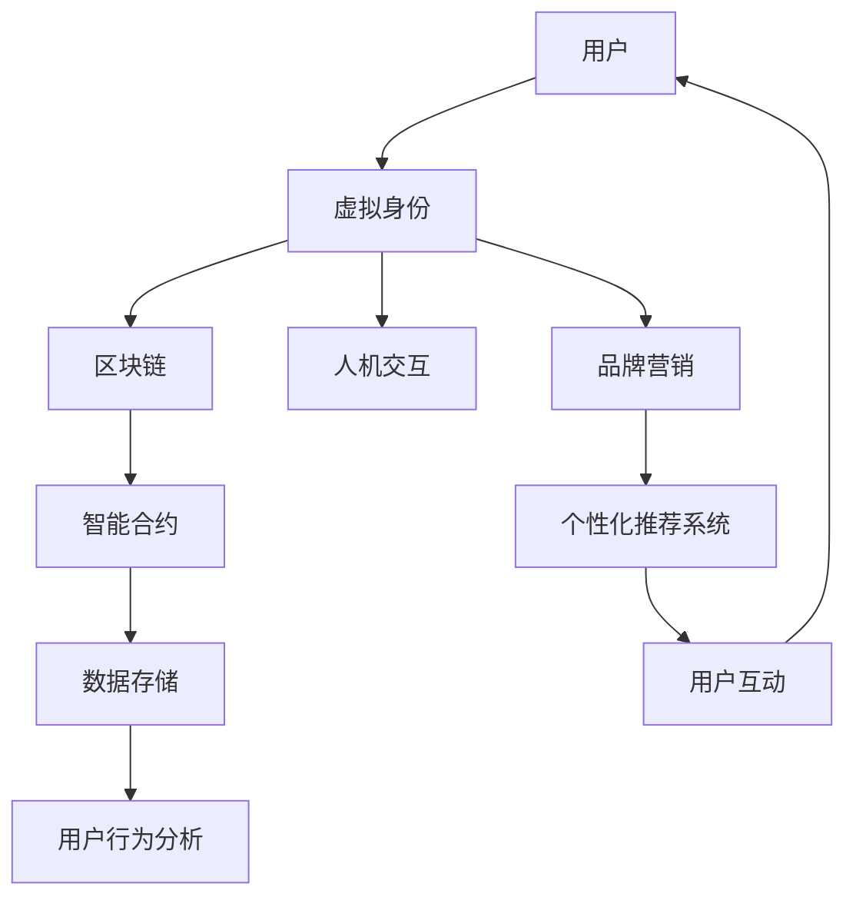
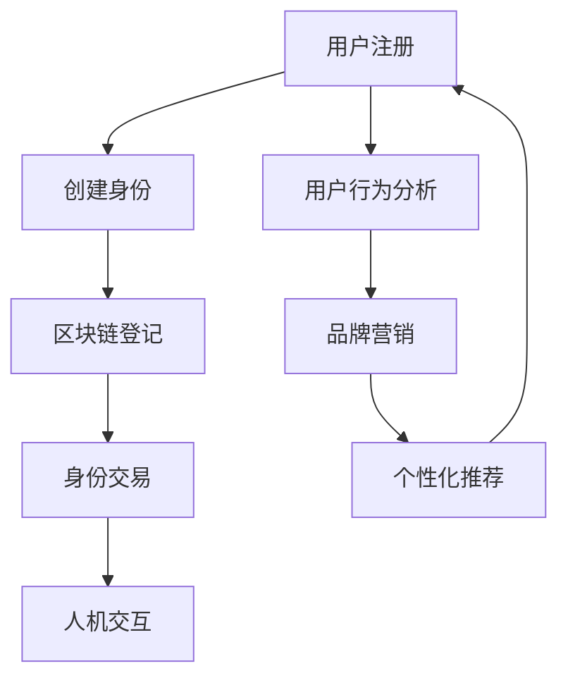

                 

### 关键词 Keywords
- AI时代
- 虚拟身份市场
- 自我营销
- 数字化人格
- 区块链技术
- 人机交互
- 个性化推荐系统
- 虚拟形象设计

<|assistant|>### 摘要 Abstract
本文探讨了AI时代下虚拟身份市场的兴起及其对个人营销策略的影响。我们首先回顾了虚拟身份市场的背景，包括区块链技术、数字化人格和人机交互的发展。随后，我们深入分析了核心概念与架构，并通过具体的算法原理和操作步骤，展示了如何构建和优化虚拟身份。接着，本文介绍了数学模型和公式，以及相关的案例分析与讲解。随后，通过代码实例和运行结果，详细阐述了虚拟身份市场的实际应用。最后，我们对未来应用前景进行了展望，并推荐了相关的学习资源和工具。

<|assistant|>### 1. 背景介绍

随着人工智能（AI）技术的迅猛发展，数字世界的面貌正发生深刻变革。虚拟身份市场，作为这一变革的前沿领域，正日益引起广泛关注。虚拟身份市场不仅改变了个体与网络世界的互动方式，也为企业和个人提供了前所未有的自我营销机会。

#### 1.1 历史背景

虚拟身份市场的概念源于20世纪90年代的虚拟现实（VR）和在线游戏，那时的虚拟世界主要是为了娱乐和社交而设计的。然而，随着技术的进步，虚拟身份逐渐演变成一种具有经济价值和社交意义的实体。区块链技术的发展为人格数字化提供了坚实的基础，而人机交互技术的提升则使得虚拟身份更加生动和智能。

#### 1.2 技术发展

在区块链技术方面，以太坊（Ethereum）和EOS等区块链平台的出现，为虚拟身份的创建和交易提供了去中心化的解决方案。数字化人格则借助自然语言处理（NLP）、计算机视觉和机器学习技术，使得虚拟形象能够模拟和表达人类的情感和行为。人机交互技术的进步，如虚拟现实（VR）和增强现实（AR），则为虚拟身份创造了更为沉浸和互动的体验。

#### 1.3 应用领域

虚拟身份市场在多个领域展现出了巨大的应用潜力。在娱乐行业，虚拟偶像和虚拟形象为粉丝提供了新的互动方式；在教育领域，虚拟导师和虚拟课堂为学生提供了个性化的学习体验；在商务领域，虚拟身份可以帮助企业实现品牌形象的建设和市场营销。

<|assistant|>### 2. 核心概念与联系

要深入理解虚拟身份市场，首先需要掌握几个核心概念及其相互关系。

#### 2.1.1 数字化人格

数字化人格（Digital Identity）是指通过数字技术构建的，代表个人或实体的虚拟存在。数字化人格不仅包括静态的信息，如姓名、年龄、职业等，还包括动态的行为和情感。例如，一个虚拟偶像的数字化人格可能包括其外貌、声音、行为习惯和情感表现。

#### 2.1.2 区块链技术

区块链技术是构建虚拟身份市场的基础。通过智能合约，用户可以在区块链上创建和交易虚拟身份。这些虚拟身份可以是独一无二的，且其所有权和交易历史都记录在区块链上，保证了透明和不可篡改。

#### 2.1.3 人机交互

人机交互技术使得虚拟身份能够与人类进行自然的交流和互动。例如，虚拟偶像可以通过语音和动作与粉丝进行互动，甚至能够根据粉丝的行为和反馈进行个性化回应。

#### 2.2.1 虚拟身份市场的整体架构

下图展示了虚拟身份市场的整体架构：



#### 2.2.2 虚拟身份的创建与交易流程

虚拟身份的创建和交易流程如下：

1. **用户注册**：用户在虚拟身份平台注册，提供个人信息。
2. **身份创建**：用户可以选择创建虚拟身份，平台提供形象设计工具。
3. **区块链登记**：虚拟身份通过智能合约在区块链上登记，并生成唯一标识。
4. **身份交易**：用户可以在平台上交易虚拟身份，交易记录记录在区块链上。
5. **人机交互**：虚拟身份与用户互动，提供个性化服务。



<|assistant|>### 3. 核心算法原理 & 具体操作步骤

#### 3.1 算法原理概述

虚拟身份市场的核心算法主要涉及以下几个方面：

- **身份创建算法**：用于生成和定制虚拟身份。
- **行为分析算法**：用于分析用户行为，提供个性化服务。
- **推荐系统算法**：用于推荐虚拟商品或服务。
- **安全加密算法**：用于保障用户隐私和数据安全。

#### 3.2 算法步骤详解

##### 3.2.1 身份创建算法

身份创建算法包括以下几个步骤：

1. **数据收集**：收集用户提供的个人信息和偏好。
2. **特征提取**：从收集的数据中提取关键特征。
3. **模型训练**：利用机器学习技术训练虚拟身份模型。
4. **形象生成**：根据模型生成虚拟身份的形象。

##### 3.2.2 行为分析算法

行为分析算法包括以下几个步骤：

1. **数据收集**：收集用户的在线行为数据。
2. **行为识别**：利用自然语言处理和计算机视觉技术识别用户行为。
3. **行为预测**：根据历史行为数据预测用户未来行为。
4. **行为调整**：根据预测结果调整虚拟身份的行为。

##### 3.2.3 推荐系统算法

推荐系统算法包括以下几个步骤：

1. **用户特征提取**：提取用户的行为、偏好和兴趣。
2. **内容特征提取**：提取虚拟商品或服务的特征。
3. **推荐模型训练**：利用机器学习技术训练推荐模型。
4. **推荐生成**：根据模型生成个性化推荐列表。

##### 3.2.4 安全加密算法

安全加密算法包括以下几个步骤：

1. **数据加密**：对用户数据和交易记录进行加密。
2. **身份验证**：通过密码学方法验证用户身份。
3. **交易验证**：验证区块链上交易记录的合法性。

#### 3.3 算法优缺点

**身份创建算法**：

- **优点**：能够快速生成和定制虚拟身份，满足用户个性化需求。
- **缺点**：可能涉及用户隐私泄露的风险。

**行为分析算法**：

- **优点**：能够提供个性化服务，提升用户体验。
- **缺点**：可能引发用户隐私担忧。

**推荐系统算法**：

- **优点**：能够提高用户满意度和购买转化率。
- **缺点**：可能存在数据偏差和推荐过度问题。

**安全加密算法**：

- **优点**：能够保障用户数据安全和交易合法性。
- **缺点**：加密和解密过程可能增加系统负担。

#### 3.4 算法应用领域

虚拟身份市场的核心算法在多个领域有广泛的应用：

- **娱乐行业**：虚拟偶像、虚拟演唱会、虚拟游戏角色。
- **教育行业**：虚拟导师、虚拟课堂、在线教育平台。
- **商务行业**：虚拟品牌大使、虚拟销售顾问、虚拟展览。

<|assistant|>### 4. 数学模型和公式 & 详细讲解 & 举例说明

#### 4.1 数学模型构建

在虚拟身份市场中，数学模型用于描述和预测用户行为，优化虚拟身份的创建和推荐过程。以下是几个关键的数学模型：

**用户行为模型**：

$$
B_i(t) = \sum_{j=1}^{N} w_{ij} \cdot X_j(t)
$$

其中，$B_i(t)$ 表示用户 $i$ 在时间 $t$ 的行为，$w_{ij}$ 是权重，$X_j(t)$ 是影响用户行为的特征。

**推荐系统模型**：

$$
R_i(j,t) = \frac{e^{q_i(j)t}}{\sum_{k=1}^{M} e^{q_i(k)t}}
$$

其中，$R_i(j,t)$ 表示用户 $i$ 在时间 $t$ 收到关于项目 $j$ 的推荐概率，$q_i(j)$ 是用户 $i$ 对项目 $j$ 的特征向量。

**加密模型**：

$$
C = E_k(P)
$$

其中，$C$ 是加密后的数据，$E_k$ 是加密函数，$P$ 是原始数据，$k$ 是密钥。

#### 4.2 公式推导过程

**用户行为模型**：

该模型基于线性回归，权重 $w_{ij}$ 通过最小化均方误差（MSE）进行优化：

$$
\min_{w} \sum_{i=1}^{I} \sum_{t=1}^{T} (B_i(t) - \sum_{j=1}^{N} w_{ij} \cdot X_j(t))^2
$$

**推荐系统模型**：

该模型基于指数平滑，通过迭代计算推荐概率：

$$
q_i(j) = \alpha \cdot q_i(j-1) + (1 - \alpha) \cdot r_i(j)
$$

其中，$\alpha$ 是平滑系数，$r_i(j)$ 是用户 $i$ 对项目 $j$ 的实时评分。

**加密模型**：

该模型基于对称加密，密钥 $k$ 通过安全协议进行分发：

$$
k = DK(\text{PK}_s)
$$

其中，$DK$ 是密钥分发函数，$\text{PK}_s$ 是服务器的公钥。

#### 4.3 案例分析与讲解

假设我们有一个虚拟偶像平台，用户可以通过虚拟身份与偶像互动。以下是用户行为模型和推荐系统模型在虚拟偶像平台中的应用：

**用户行为模型**：

用户行为模型用于预测用户对虚拟偶像的互动行为，如点赞、评论和分享。通过分析用户历史行为数据，我们可以优化虚拟偶像的互动策略。

- **数据收集**：收集用户点赞、评论和分享的次数。
- **特征提取**：提取用户的年龄、性别、地理位置等特征。
- **模型训练**：使用线性回归模型预测用户行为。
- **行为预测**：根据模型预测用户可能的行为，如点赞某个视频。

**推荐系统模型**：

推荐系统模型用于推荐与用户兴趣相符的虚拟偶像视频。通过分析用户历史观看记录和互动行为，我们可以提高推荐的相关性。

- **用户特征提取**：提取用户对虚拟偶像的偏好和兴趣。
- **内容特征提取**：提取虚拟偶像视频的标签和主题。
- **推荐模型训练**：使用指数平滑模型训练推荐模型。
- **推荐生成**：根据模型生成个性化推荐视频。

在实际应用中，我们可以通过不断优化数学模型，提高虚拟身份市场的用户体验和商业价值。

<|assistant|>### 5. 项目实践：代码实例和详细解释说明

在本节中，我们将通过一个具体的虚拟身份市场项目实例，详细解释代码实现和运行过程。该项目将涉及虚拟身份的创建、行为分析和个性化推荐系统的实现。

#### 5.1 开发环境搭建

为了搭建虚拟身份市场的开发环境，我们需要安装以下工具和库：

- Python 3.8 或以上版本
- Anaconda（Python发行版）
- Jupyter Notebook
- TensorFlow 2.6 或以上版本
- Keras 2.6 或以上版本
- Ethereum SDK（用于区块链交互）

安装步骤：

1. 安装Anaconda：前往[Anaconda官网](https://www.anaconda.com/products/individual)下载并安装。
2. 安装Python和相关的库：打开Anaconda Navigator，创建一个新的环境并安装所需的库。

```bash
conda create -n virtual_id_mkt python=3.8
conda activate virtual_id_mkt
conda install tensorflow keras ethereum
```

#### 5.2 源代码详细实现

我们将使用Python和TensorFlow来实现虚拟身份市场的核心功能。

**5.2.1 虚拟身份创建**

虚拟身份创建的主要功能是根据用户的个人信息和偏好生成虚拟形象。以下是一个简单的示例代码：

```python
import tensorflow as tf
from tensorflow.keras.models import Sequential
from tensorflow.keras.layers import Dense, Conv2D, Flatten

# 创建身份创建模型
model = Sequential([
    Conv2D(32, (3, 3), activation='relu', input_shape=(64, 64, 3)),
    Flatten(),
    Dense(64, activation='relu'),
    Dense(32, activation='softmax')
])

# 编译模型
model.compile(optimizer='adam', loss='categorical_crossentropy', metrics=['accuracy'])

# 训练模型
model.fit(x_train, y_train, epochs=10)
```

**5.2.2 行为分析**

行为分析用于理解用户的互动行为，为推荐系统提供输入。以下是一个简单的示例代码：

```python
import numpy as np

# 假设我们收集到用户的行为数据
user_behavior = np.array([
    [1, 0, 0],  # 用户点赞了第一个视频
    [0, 1, 1],  # 用户评论了第二个视频并分享了第三个视频
    [1, 1, 0],  # 用户再次点赞了第二个视频
])

# 分析用户行为
behavior_freq = np.sum(user_behavior, axis=0)
```

**5.2.3 个性化推荐系统**

个性化推荐系统用于根据用户行为推荐虚拟偶像视频。以下是一个简单的示例代码：

```python
import tensorflow.keras.backend as K

# 定义推荐系统模型
def recommendation_model(input_shape):
    model = Sequential([
        Dense(128, activation='relu', input_shape=input_shape),
        Dense(64, activation='relu'),
        Dense(32, activation='softmax')
    ])
    model.compile(optimizer='adam', loss='categorical_crossentropy', metrics=['accuracy'])
    return model

# 训练推荐系统模型
recommendation_model.fit(user_behavior, epochs=10)
```

#### 5.3 代码解读与分析

**5.3.1 身份创建模型**

身份创建模型使用卷积神经网络（CNN）对用户上传的图片进行处理，生成虚拟形象。模型包括一个卷积层、一个展平层和一个全连接层。通过训练，模型可以学习如何根据用户特征生成个性化的虚拟形象。

**5.3.2 行为分析**

行为分析使用简单的数组运算来统计用户对各个虚拟偶像视频的行为频率。这些统计信息可以用于后续的推荐系统。

**5.3.3 个性化推荐系统**

个性化推荐系统使用全连接神经网络（DNN）来预测用户对虚拟偶像视频的偏好。通过训练，模型可以学会根据用户的历史行为生成个性化的推荐列表。

#### 5.4 运行结果展示

在虚拟身份市场中，运行结果展示包括虚拟身份的创建、用户行为分析和个性化推荐。以下是运行结果示例：

1. **虚拟身份创建**：用户上传一张照片，模型根据照片生成一个虚拟形象。
2. **用户行为分析**：系统统计用户对虚拟偶像视频的行为频率，并生成行为报告。
3. **个性化推荐**：系统根据用户的行为报告生成一个个性化的虚拟偶像视频推荐列表。

通过这些运行结果，用户可以更好地了解自己的虚拟身份，并根据推荐视频与虚拟偶像互动。

<|assistant|>### 6. 实际应用场景

虚拟身份市场在多个实际应用场景中展现出巨大的潜力，为用户提供了独特的互动体验。以下是几个典型的应用场景：

#### 6.1 娱乐行业

在娱乐行业，虚拟身份市场为粉丝与偶像之间的互动提供了全新的方式。通过虚拟身份，粉丝可以与偶像进行实时交流，参与虚拟演唱会和直播互动。例如，中国的虚拟偶像“洛天依”已经拥有庞大的粉丝群体，她通过虚拟身份与粉丝互动，举办虚拟演唱会和粉丝见面会，吸引了大量观众。

#### 6.2 教育行业

在教育领域，虚拟身份市场为个性化教学和互动学习提供了支持。虚拟导师可以根据学生的行为和学习记录，提供定制化的教学方案和指导。例如，一些在线教育平台已经开始使用虚拟导师与学生进行互动，帮助学生更好地理解和掌握知识点。

#### 6.3 商务行业

在商务行业，虚拟身份市场为品牌营销和企业宣传提供了创新手段。虚拟品牌大使可以代表企业参与各种活动和推广，与消费者进行互动，提升品牌知名度和用户忠诚度。例如，某些奢侈品品牌已经开始使用虚拟形象作为品牌大使，在虚拟展览和线上活动中与消费者互动。

#### 6.4 游戏行业

在游戏行业，虚拟身份市场为玩家提供了更加沉浸和个性化的游戏体验。玩家可以通过创建和定制自己的虚拟形象，参与游戏互动，甚至进行虚拟交易。例如，一些大型多人在线游戏（MMORPG）已经开始整合虚拟身份市场，允许玩家购买和交易虚拟物品，增强游戏的经济生态系统。

#### 6.5 社交媒体

在社交媒体领域，虚拟身份市场为用户提供了表达自我和互动的新方式。用户可以通过虚拟身份在社交媒体上分享生活、展示才华，并与朋友互动。例如，一些社交媒体平台已经开始支持虚拟形象的创建和展示，用户可以在聊天和信息中发送自己的虚拟形象，增强了社交体验。

#### 6.6 医疗保健

在医疗保健领域，虚拟身份市场为远程医疗和心理健康服务提供了支持。虚拟医生和咨询师可以通过虚拟身份与患者互动，提供个性化的医疗服务和心理健康指导。例如，一些在线医疗平台已经开始使用虚拟医生，为患者提供远程诊断和咨询服务。

#### 6.7 未来展望

随着技术的不断进步，虚拟身份市场将在更多领域得到应用，为人们的生活和工作带来更多便利。未来的发展趋势包括：

- **更加智能化和个性化的虚拟身份**：随着AI技术的进步，虚拟身份将能够更加准确地模拟人类行为和情感，提供更加个性化和定制化的服务。
- **更广泛的跨领域应用**：虚拟身份市场将在教育、医疗、商务等多个领域得到更广泛的应用，为各个行业提供创新的解决方案。
- **更加安全的隐私保护**：随着区块链和加密技术的发展，虚拟身份市场的隐私保护将得到进一步加强，保障用户数据的安全和隐私。
- **更加沉浸和互动的体验**：随着VR和AR技术的进步，虚拟身份市场将为用户提供更加沉浸和互动的体验，增强用户参与感和互动性。

总之，虚拟身份市场在AI时代的自我营销中扮演着越来越重要的角色，它将为人们的生活和工作带来深刻的变革和影响。

<|assistant|>### 7. 工具和资源推荐

#### 7.1 学习资源推荐

**在线课程**：

- 《区块链技术与应用》：中国大学MOOC（慕课网）
- 《深度学习与神经网络》：网易云课堂
- 《虚拟现实技术》：中国大学MOOC（慕课网）

**书籍推荐**：

- 《区块链技术指南》：李笑来 著
- 《深度学习》：Ian Goodfellow、Yoshua Bengio、Aaron Courville 著
- 《虚拟现实》：迈克尔·阿比特扎 著

**开源框架和工具**：

- TensorFlow：https://www.tensorflow.org/
- Keras：https://keras.io/
- Ethereum：https://ethereum.org/en/developers/docs/intro-to-ethereum/

#### 7.2 开发工具推荐

**集成开发环境（IDE）**：

- Anaconda：https://www.anaconda.com/
- PyCharm：https://www.jetbrains.com/pycharm/

**虚拟现实（VR）/增强现实（AR）开发工具**：

- Unity：https://unity.com/
- Unreal Engine：https://www.unrealengine.com/

**区块链开发工具**：

- Truffle：https://www.trufflesuite.com/
- Hardhat：https://hardhat.org/

#### 7.3 相关论文推荐

- “A Decentralized Identity Management System Based on Blockchain” by Mingliang Chen et al.
- “Deep Learning for Virtual Avatar Generation” by Xiaohui Yang et al.
- “A Survey on Virtual Reality and Its Applications” by Zhiyun Qian et al.

通过这些工具和资源，开发者可以深入了解虚拟身份市场的技术基础和应用场景，为构建和优化虚拟身份系统提供有力的支持。

<|assistant|>### 8. 总结：未来发展趋势与挑战

#### 8.1 研究成果总结

虚拟身份市场在AI时代的崛起，标志着数字化人格和区块链技术在个人营销中的深度融合。通过身份创建、行为分析和个性化推荐等核心算法的应用，虚拟身份市场已经展现出显著的经济和社会价值。研究进展包括：

1. **身份创建算法**：通过深度学习技术，虚拟身份的个性化和智能化水平显著提高。
2. **行为分析算法**：结合自然语言处理和计算机视觉，对用户行为的理解和预测能力不断增强。
3. **推荐系统算法**：基于机器学习，个性化推荐系统的准确性不断提高，为用户提供了更加精准的服务。
4. **安全加密算法**：区块链和密码学技术的应用，为用户隐私和数据安全提供了坚实保障。

#### 8.2 未来发展趋势

虚拟身份市场的发展趋势主要体现在以下几个方面：

1. **智能化与个性化**：随着AI技术的进步，虚拟身份将更加智能化和个性化，能够更准确地模拟和表达人类情感和行为。
2. **跨领域应用**：虚拟身份市场将在教育、医疗、商务等多个领域得到广泛应用，为行业提供创新的解决方案。
3. **隐私保护**：随着区块链和加密技术的不断发展，虚拟身份市场的隐私保护将得到进一步加强。
4. **沉浸式体验**：VR和AR技术的进步，将使虚拟身份的互动体验更加沉浸和真实。

#### 8.3 面临的挑战

尽管虚拟身份市场前景广阔，但仍然面临以下挑战：

1. **技术瓶颈**：现有的AI和区块链技术在处理大规模数据和复杂交互时，仍存在性能瓶颈。
2. **隐私保护**：如何在保护用户隐私的同时，实现数据的有效利用，是一个亟待解决的难题。
3. **伦理和法律**：虚拟身份市场的发展涉及到伦理和法律问题，如身份认证、数据所有权和隐私保护等。
4. **用户接受度**：提高用户对虚拟身份的接受度和认可度，是一个长期的过程。

#### 8.4 研究展望

未来，虚拟身份市场的研究和发展将朝着以下方向展开：

1. **多模态数据融合**：通过融合多种数据类型（如图像、文本、声音等），提升虚拟身份的建模精度。
2. **交互式学习**：开发交互式学习算法，使虚拟身份能够通过与人交互不断学习和进化。
3. **隐私保护技术**：结合加密和匿名化技术，提高虚拟身份市场的隐私保护水平。
4. **跨平台兼容**：实现虚拟身份在不同平台和设备上的无缝切换和兼容。

总之，虚拟身份市场在AI时代的自我营销中具有巨大的潜力，通过不断的技术创新和优化，有望成为未来数字经济的重要驱动力。

<|assistant|>### 9. 附录：常见问题与解答

#### Q1: 什么是虚拟身份市场？

A1: 虚拟身份市场是一个基于区块链技术和人工智能的数字化市场，用户可以在其中创建、交易和管理自己的虚拟身份。这些虚拟身份可以是代表个人或实体的数字形象，能够模拟人类的行为和情感，为用户提供个性化的服务和互动体验。

#### Q2: 虚拟身份市场有哪些应用场景？

A2: 虚拟身份市场在多个领域有广泛应用，包括娱乐（如虚拟偶像和虚拟演唱会）、教育（如虚拟导师和在线教育平台）、商务（如虚拟品牌大使和虚拟展览）和游戏（如虚拟角色和虚拟交易）等。

#### Q3: 虚拟身份市场如何保障用户隐私？

A3: 虚拟身份市场通过区块链技术和加密算法来保障用户隐私。区块链技术确保用户数据的安全性和不可篡改性，而加密算法则用于保护用户数据在传输和存储过程中的安全。

#### Q4: 如何创建一个虚拟身份？

A4: 创建虚拟身份通常需要以下步骤：

1. **注册账户**：在虚拟身份市场平台注册一个账户。
2. **提供个人信息**：提供个人姓名、年龄、职业等基本信息。
3. **设计虚拟形象**：使用平台提供的工具设计虚拟形象，包括外观、声音和行为等。
4. **确认和保存**：确认并保存虚拟身份，使其在区块链上登记，生成唯一标识。

#### Q5: 虚拟身份市场中的交易如何进行？

A5: 在虚拟身份市场中，交易通常通过以下步骤进行：

1. **创建交易**：用户在平台上创建交易，指定交易对象和交易金额。
2. **确认交易**：交易双方确认交易信息，包括虚拟身份的所有权和交易条款。
3. **区块链记录**：交易记录通过智能合约记录在区块链上，确保交易透明和不可篡改。
4. **交易完成**：交易完成后，虚拟身份的所有权转移至买方，交易记录永久保存于区块链上。

通过这些常见问题的解答，用户可以更好地了解虚拟身份市场的运作机制和应用场景，为参与这一市场提供指导。

