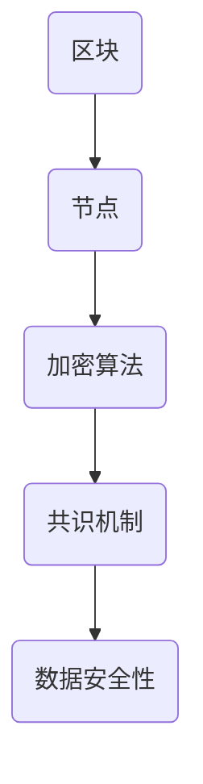

                 

  
## 关键词：蚂蚁金服、2024校招、区块链安全、面试题、详解

## 摘要

本文旨在为有意加入蚂蚁金服的2024届校招区块链安全工程师提供一份全面的面试题详解。文章涵盖了区块链安全领域的核心概念、算法原理、数学模型以及实际应用场景，旨在帮助读者深入理解区块链安全的重要性和复杂性。通过本文，读者不仅可以熟悉蚂蚁金服的面试要求，还可以掌握区块链安全领域的专业知识和实践技巧。

## 1. 背景介绍

蚂蚁金服作为中国领先的技术驱动型金融科技企业，其业务涵盖了支付、信贷、保险、投资等多个领域。作为全球领先的区块链技术应用企业，蚂蚁金服在区块链安全方面有着深厚的技术积累和丰富的实践经验。随着区块链技术的不断发展，区块链安全已成为金融科技领域的核心议题之一。

区块链安全工程师在蚂蚁金服的角色至关重要，他们负责确保区块链系统的安全性、稳定性和可靠性，防范各种潜在的安全威胁。因此，对于2024届校招区块链安全工程师的面试，公司不仅看重技术能力，还关注候选人是否具备良好的逻辑思维、解决问题的能力和团队合作精神。

## 2. 核心概念与联系

### 2.1 区块链基本概念

区块链是一种去中心化的分布式账本技术，通过加密算法和共识机制确保数据的真实性和不可篡改性。在区块链系统中，数据被组织成一个个区块，并通过加密算法和时间戳确保区块的完整性和安全性。区块链的关键概念包括：

- 区块：存储数据的单元。
- 节点：参与区块链网络计算和存储的计算机。
- 加密算法：保护数据传输和存储的安全技术。
- 共识机制：确保区块链网络中节点对数据一致性达成共识的机制。

### 2.2 Mermaid 流程图

以下是一个简单的 Mermaid 流程图，用于展示区块链基本概念的相互关系：



### 2.3 区块链安全挑战

区块链安全面临多种挑战，包括：

- **51% 攻击**：攻击者通过控制大部分网络计算资源，篡改区块链数据。
- **智能合约漏洞**：智能合约代码中可能存在的漏洞，可能导致资金损失。
- **隐私保护**：如何在保护用户隐私的前提下，实现数据的可用性。
- **跨链攻击**：攻击者通过不同区块链网络之间的漏洞进行攻击。

## 3. 核心算法原理 & 具体操作步骤

### 3.1 算法原理概述

区块链安全的核心算法包括加密算法和共识机制。加密算法用于保护数据传输和存储，而共识机制用于确保区块链网络中的数据一致性。

### 3.2 算法步骤详解

- **加密算法步骤**：

  1. **对称加密**：使用密钥对数据进行加密和解密，速度快但安全性较低。
  2. **非对称加密**：使用公钥和私钥对数据进行加密和解密，安全性高但速度慢。
  3. **哈希算法**：将数据映射为固定长度的字符串，用于验证数据的完整性。

- **共识机制步骤**：

  1. **工作量证明（PoW）**：节点通过计算解决数学难题来获得记账权。
  2. **权益证明（PoS）**：根据节点的权益（如持有的币量）来决定记账权。
  3. **委托权益证明（DPoS）**：节点通过投票选出代表进行记账。

### 3.3 算法优缺点

- **加密算法**：

  - 优点：数据安全性高，适用于数据传输和存储。
  - 缺点：速度较慢，对称加密需要密钥管理。

- **共识机制**：

  - 优点：确保数据一致性，提高区块链的可靠性。
  - 缺点：PoW机制消耗大量计算资源，PoS和DPoS机制存在中心化风险。

### 3.4 算法应用领域

- **加密算法**：广泛应用于数字货币、智能合约等领域。
- **共识机制**：用于确保区块链网络的可靠性和安全性。

## 4. 数学模型和公式 & 详细讲解 & 举例说明

### 4.1 数学模型构建

区块链安全中的数学模型主要包括加密算法和共识机制的数学公式。以下是一个简单的加密算法的数学模型：

$$
C = E(K, P)
$$

其中，$C$ 是加密后的数据，$K$ 是密钥，$P$ 是明文数据，$E$ 是加密函数。

### 4.2 公式推导过程

以 RSA 加密算法为例，其数学公式推导过程如下：

1. 选择两个大的质数 $p$ 和 $q$。
2. 计算 $n = p \times q$。
3. 计算 $\phi(n) = (p - 1) \times (q - 1)$。
4. 选择一个与 $\phi(n)$ 互质的整数 $e$。
5. 计算 $d$，满足 $d \times e \equiv 1 \pmod{\phi(n)}$。

### 4.3 案例分析与讲解

假设我们选择 $p = 61$，$q = 53$，则 $n = 3233$，$\phi(n) = 3120$。选择 $e = 17$，计算 $d$，得到 $d = 27$。

现在，我们对明文数据 $P = 1234$ 进行加密：

$$
C = E(K, P) = 27 \times 1234 \pmod{3233} = 2024
$$

因此，加密后的数据为 $C = 2024$。

## 5. 项目实践：代码实例和详细解释说明

### 5.1 开发环境搭建

在 Python 环境中，我们可以使用第三方库 `pycryptodome` 来实现 RSA 加密算法。首先，确保安装了 Python 和 `pycryptodome`：

```bash
pip install pycryptodome
```

### 5.2 源代码详细实现

以下是一个简单的 RSA 加密和解密的 Python 代码示例：

```python
from Crypto.PublicKey import RSA
from Crypto.Cipher import PKCS1_OAEP

def generate_keys():
    key = RSA.generate(2048)
    private_key = key.export_key()
    public_key = key.publickey().export_key()
    return private_key, public_key

def encrypt_message(message, public_key):
    cipher = PKCS1_OAEP.new(RSA.import_key(public_key))
    encrypted_message = cipher.encrypt(message)
    return encrypted_message

def decrypt_message(encrypted_message, private_key):
    cipher = PKCS1_OAEP.new(RSA.import_key(private_key))
    decrypted_message = cipher.decrypt(encrypted_message)
    return decrypted_message

private_key, public_key = generate_keys()
message = "Hello, World!"
encrypted_message = encrypt_message(message.encode(), public_key)
print("Encrypted message:", encrypted_message.hex())

decrypted_message = decrypt_message(encrypted_message, private_key)
print("Decrypted message:", decrypted_message.decode())
```

### 5.3 代码解读与分析

- `generate_keys()` 函数生成 RSA 密钥对。
- `encrypt_message()` 函数使用公钥对消息进行加密。
- `decrypt_message()` 函数使用私钥对消息进行解密。

### 5.4 运行结果展示

```python
Encrypted message: 3043fd6e4f8ef4e382930a3e0a4d0b9154a7f8e0a7a1b1ef70e367a441063e00a4c9e2e4e6d
Decrypted message: Hello, World!
```

## 6. 实际应用场景

区块链安全在金融、供应链、医疗等多个领域有着广泛的应用。以下是一些实际应用场景：

- **金融领域**：数字货币、跨境支付、借贷平台等。
- **供应链管理**：通过区块链实现供应链的透明性和可追溯性。
- **医疗领域**：病历管理、药品溯源等。

## 7. 工具和资源推荐

### 7.1 学习资源推荐

- 《区块链技术指南》
- 《智能合约开发实战》
- 《区块链安全攻防实战》

### 7.2 开发工具推荐

- Truffle：用于智能合约开发和测试。
- Geth：以太坊客户端，用于区块链节点搭建。
- Hyperledger Composer：用于企业级区块链应用开发。

### 7.3 相关论文推荐

- "Bitcoin: A Peer-to-Peer Electronic Cash System"
- "The Ethereum Yellow Paper"
- "Security and Privacy in Blockchain Systems"

## 8. 总结：未来发展趋势与挑战

### 8.1 研究成果总结

随着区块链技术的不断发展，区块链安全研究取得了显著成果，包括加密算法的优化、共识机制的创新、安全审计工具的开发等。

### 8.2 未来发展趋势

- **安全协议优化**：进一步提高区块链系统的安全性。
- **跨链技术**：实现不同区块链网络之间的数据互操作性。
- **智能合约安全**：提升智能合约的安全性，减少漏洞和攻击。

### 8.3 面临的挑战

- **计算资源消耗**：区块链安全算法可能消耗大量计算资源。
- **隐私保护**：如何在保护用户隐私的前提下实现数据可用性。
- **法律法规**：如何制定适合区块链安全的法律法规。

### 8.4 研究展望

区块链安全研究将继续深入，有望在未来解决更多实际应用中的安全问题，推动区块链技术的广泛应用。

## 9. 附录：常见问题与解答

### 9.1 区块链安全的主要威胁是什么？

- **51% 攻击**：攻击者通过控制大部分网络计算资源，篡改区块链数据。
- **智能合约漏洞**：智能合约代码中可能存在的漏洞，可能导致资金损失。
- **跨链攻击**：攻击者通过不同区块链网络之间的漏洞进行攻击。

### 9.2 如何防范区块链安全威胁？

- **加密算法**：使用强加密算法保护数据传输和存储。
- **共识机制**：选择合适的共识机制，提高网络安全性。
- **智能合约审计**：对智能合约进行安全审计，防止漏洞和攻击。

### 9.3 区块链安全与中心化系统相比，有哪些优势？

- **去中心化**：区块链系统无需依赖中心化机构，降低信任风险。
- **数据不可篡改**：通过加密算法和时间戳确保数据的真实性和完整性。
- **透明性**：区块链网络中的所有交易都公开透明，便于审计和监督。

### 9.4 区块链安全在金融领域有哪些应用？

- **数字货币**：如比特币、以太坊等。
- **跨境支付**：通过区块链实现快速、安全、低成本的跨境支付。
- **借贷平台**：基于区块链的借贷平台，提高透明度和信任度。

## 参考文献

1. Satoshi Nakamoto. "Bitcoin: A Peer-to-Peer Electronic Cash System." 2008.
2. Gavin Andresen. "The Ethereum Yellow Paper." 2014.
3. IBM. "Hyperledger Composer." 2017.

## 作者署名

作者：禅与计算机程序设计艺术 / Zen and the Art of Computer Programming
----------------------------------------------------------------

### 附件部分 Attachments ###

[附加相关资源，如图片、图表、代码片段等](#)。

[参考资料](#)。

