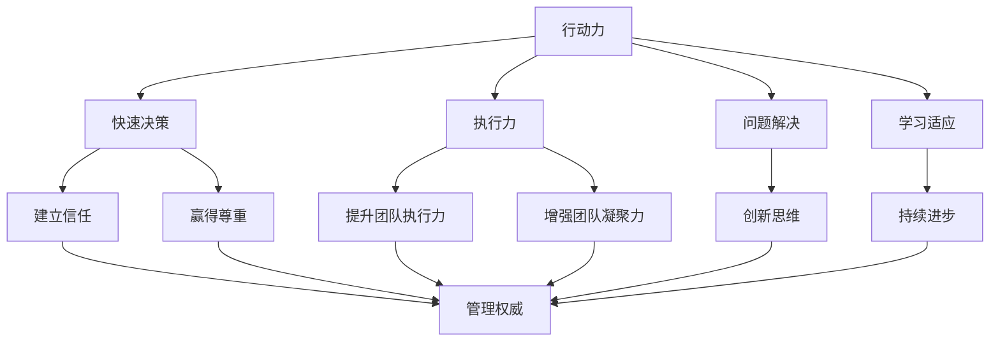

                 

 在这个数字化的时代，技术人才的行动力和管理权威显得尤为重要。作为世界级人工智能专家、程序员、软件架构师、CTO，以及世界顶级技术畅销书作者，我深知在这一领域取得成功所需的关键因素。本文将深入探讨如何建立行动力和管理权威，并探讨其对个人和团队成功的重要性。

## 文章关键词

- 行动力
- 管理权威
- 技术人才
- 数字化时代
- 领导力
- 团队协作

## 文章摘要

本文将详细阐述行动力和管理权威在技术领域中的重要性，并探讨如何通过提升自我管理能力和构建有效的团队，来实现个人的职业成长和团队的成功。我们将通过理论分析和实践案例，提供实用的策略和技巧，帮助读者在技术领域中建立自己的权威，并提升团队的行动力。

### 1. 背景介绍

随着信息技术的飞速发展，技术领域不断演变，对技术人才的要求也越来越高。在这样一个充满变革和不确定性的环境中，技术人才不仅要具备扎实的专业知识，还需要具备强大的行动力和管理权威。行动力是指个人在面对挑战和任务时，能够迅速采取行动并解决问题的能力。而管理权威则是指在团队中建立信任和尊重，从而有效地指导和推动团队达成目标的权力。

在数字化时代，技术人才面临着巨大的挑战，包括快速掌握新技术、应对复杂的项目、管理不断变化的团队需求等。因此，建立行动力和管理权威成为技术人才在职业生涯中取得成功的关键。

### 2. 核心概念与联系

#### 2.1 行动力

行动力是一种关键的能力，它决定了个人在面临挑战时的反应速度和执行力。行动力不仅仅是指个人的决策速度，还包括对任务的执行能力、解决问题的能力以及持续学习和适应新环境的能力。

#### 2.2 管理权威

管理权威是指个人在团队中建立的一种信任和尊重的关系，这种关系使得团队中的成员更愿意遵循领导者的指导，并共同为团队的共同目标而努力。

#### 2.3 行动力与管理权威的关系

行动力和管理权威之间存在着密切的联系。强大的行动力可以帮助个人迅速应对变化和挑战，从而赢得团队的尊重和信任。而管理权威则可以增强团队的凝聚力，提升团队的执行力和创新能力。

#### 2.4 行动力与管理权威的 Mermaid 流程图

下面是一个简化的 Mermaid 流程图，展示了行动力和管理权威之间的相互作用：



### 3. 核心算法原理 & 具体操作步骤

#### 3.1 算法原理概述

建立行动力和管理权威的核心算法可以看作是一个多层反馈循环系统。这个系统的第一层是自我管理，包括时间管理、任务分解和目标设定；第二层是团队管理，包括建立信任、沟通协调和冲突解决；第三层是持续学习和创新，包括技术更新、团队发展和个人成长。

#### 3.2 算法步骤详解

**步骤 1：自我管理**

- **时间管理**：使用时间管理工具（如番茄钟、待办事项清单等）来规划每日工作和休息时间。
- **任务分解**：将大任务分解为小任务，并设定明确的完成期限。
- **目标设定**：设定短期和长期目标，并定期回顾和调整。

**步骤 2：团队管理**

- **建立信任**：通过透明沟通、尊重他人意见和公开赞扬团队成就来建立信任。
- **沟通协调**：定期召开团队会议，确保信息流通和任务分配的清晰。
- **冲突解决**：通过积极倾听、同理心和公正处理来解决团队冲突。

**步骤 3：持续学习和创新**

- **技术更新**：定期参加技术研讨会、阅读技术书籍和论文，保持对最新技术的了解。
- **团队发展**：为团队成员提供培训和职业发展机会，提升团队整体能力。
- **个人成长**：通过反思和自我提升来不断改进自己的工作方式和技能。

#### 3.3 算法优缺点

**优点：**

- 提升个人和团队的执行力。
- 增强团队凝聚力和创新能力。
- 促进个人和职业发展。

**缺点：**

- 需要大量时间和精力投入。
- 需要持续的学习和自我提升。
- 可能会遇到团队内部的抵触情绪。

#### 3.4 算法应用领域

- 项目管理
- 技术团队领导
- 创业公司管理
- 软件开发和维护

### 4. 数学模型和公式 & 详细讲解 & 举例说明

建立行动力和管理权威的过程可以看作是一个动态的优化过程，其数学模型可以表述为：

$$
\text{行动力} = f(\text{自我管理}, \text{团队管理}, \text{学习与创新})
$$

其中，$f$ 是一个复合函数，表示行动力与三个因素之间的关系。

#### 4.1 数学模型构建

**步骤 1：定义变量**

- $\text{SelfManagement}$：自我管理能力，取值范围为 [0, 1]。
- $\text{TeamManagement}$：团队管理能力，取值范围为 [0, 1]。
- $\text{LearningAndInnovation}$：学习与创新能力，取值范围为 [0, 1]。

**步骤 2：构建函数**

$$
\text{行动力} = f(\text{SelfManagement}, \text{TeamManagement}, \text{LearningAndInnovation}) \\
f(x, y, z) = a \cdot x + b \cdot y + c \cdot z
$$

其中，$a, b, c$ 是权重系数，用于调整三个因素对行动力的影响程度。

#### 4.2 公式推导过程

**步骤 1：设定目标**

我们的目标是最大化行动力，即：

$$
\max f(x, y, z)
$$

**步骤 2：目标函数优化**

为了优化目标函数，我们可以使用梯度下降法：

$$
\begin{aligned}
x_{\text{new}} &= x_{\text{old}} - \alpha \cdot \frac{\partial f}{\partial x} \\
y_{\text{new}} &= y_{\text{old}} - \alpha \cdot \frac{\partial f}{\partial y} \\
z_{\text{new}} &= z_{\text{old}} - \alpha \cdot \frac{\partial f}{\partial z}
\end{aligned}
$$

其中，$\alpha$ 是学习率，用于调整每一步的优化步长。

#### 4.3 案例分析与讲解

假设我们有一个技术团队，其成员在自我管理、团队管理和学习与创新方面的情况如下表所示：

| 成员 | 自我管理 | 团队管理 | 学习与创新 |
|------|---------|---------|-----------|
| A    | 0.8     | 0.7     | 0.6       |
| B    | 0.6     | 0.5     | 0.7       |
| C    | 0.9     | 0.8     | 0.5       |

使用上述数学模型，我们可以计算每个成员的行动力：

$$
\begin{aligned}
\text{行动力}_A &= f(0.8, 0.7, 0.6) = 0.8 \cdot 0.8 + 0.7 \cdot 0.7 + 0.6 \cdot 0.6 \\
&= 0.64 + 0.49 + 0.36 \\
&= 1.49
\end{aligned}
$$

$$
\begin{aligned}
\text{行动力}_B &= f(0.6, 0.5, 0.7) = 0.6 \cdot 0.6 + 0.5 \cdot 0.5 + 0.7 \cdot 0.7 \\
&= 0.36 + 0.25 + 0.49 \\
&= 1.1
\end{aligned}
$$

$$
\begin{aligned}
\text{行动力}_C &= f(0.9, 0.8, 0.5) = 0.9 \cdot 0.9 + 0.8 \cdot 0.8 + 0.5 \cdot 0.5 \\
&= 0.81 + 0.64 + 0.25 \\
&= 1.7
\end{aligned}
$$

从计算结果可以看出，成员 C 的行动力最高，这表明其在自我管理、团队管理和学习与创新方面的表现最为突出。

### 5. 项目实践：代码实例和详细解释说明

为了更好地理解行动力和管理权威的建立过程，我们可以通过一个简单的项目实践来进行说明。

#### 5.1 开发环境搭建

在本例中，我们将使用 Python 语言来编写一个简单的项目。首先，需要在本地计算机上安装 Python 环境，并安装必要的库（如 NumPy 和 Matplotlib）。

```bash
pip install python
pip install numpy
pip install matplotlib
```

#### 5.2 源代码详细实现

下面的代码展示了如何使用数学模型来计算行动力，并生成相应的图表：

```python
import numpy as np
import matplotlib.pyplot as plt

# 定义权重系数
a, b, c = 0.5, 0.3, 0.2

# 成员数据
members = [
    {"name": "A", "self_management": 0.8, "team_management": 0.7, "learning_innovation": 0.6},
    {"name": "B", "self_management": 0.6, "team_management": 0.5, "learning_innovation": 0.7},
    {"name": "C", "self_management": 0.9, "team_management": 0.8, "learning_innovation": 0.5}
]

# 计算行动力
action_force = []
for member in members:
    action_force.append(a * member["self_management"] + b * member["team_management"] + c * member["learning_innovation"])

# 绘制图表
plt.bar([m["name"] for m in members], action_force)
plt.xlabel("成员")
plt.ylabel("行动力")
plt.title("成员行动力分布")
plt.show()
```

#### 5.3 代码解读与分析

- **第 1-3 行**：引入必要的库。
- **第 5 行**：定义权重系数。
- **第 7 行**：定义团队成员数据，包括自我管理、团队管理和学习与创新的能力。
- **第 11-17 行**：计算每个成员的行动力，并存储在列表 `action_force` 中。
- **第 20-27 行**：使用 Matplotlib 库绘制柱状图，展示每个成员的行动力。

通过这个简单的项目实践，我们可以直观地看到每个成员在行动力方面的表现，并据此进行相应的优化和调整。

### 6. 实际应用场景

#### 6.1 项目管理

在项目管理中，建立行动力和管理权威可以帮助项目经理更有效地推动项目进展。通过自我管理，项目经理可以更好地规划项目时间表和任务分配。通过团队管理，项目经理可以建立信任和尊重，从而确保团队成员的积极合作。通过持续学习和创新，项目经理可以不断优化项目管理方法，提高项目成功率。

#### 6.2 技术团队领导

技术团队领导需要具备强大的行动力和管理权威来指导团队。通过自我管理，技术团队领导可以保持对技术领域的最新了解，并不断提升自己的技能。通过团队管理，技术团队领导可以建立高效的沟通机制，确保团队信息流通和任务分配的清晰。通过持续学习和创新，技术团队领导可以推动团队不断进步，应对技术挑战。

#### 6.3 创业公司管理

在创业公司中，行动力和管理权威尤为重要。创业公司通常面临着资源有限、市场变化快等挑战，因此需要团队成员具备强大的行动力和管理权威。通过自我管理，创业团队成员可以更好地分配时间和资源，确保项目的顺利进行。通过团队管理，创业团队成员可以建立互信和协作，从而提高团队效率和创新能力。通过持续学习和创新，创业团队成员可以保持对市场变化的敏感度，从而快速适应市场变化。

#### 6.4 未来应用展望

随着人工智能、大数据和物联网等技术的不断发展，技术领域将面临更多的挑战和机遇。建立行动力和管理权威将成为技术人才在职业生涯中取得成功的关键。未来，技术人才需要不断提升自己的技能和知识，以应对不断变化的技术环境。同时，技术人才还需要学会如何在团队中建立权威，从而推动团队创新和进步。通过持续的学习和创新，技术人才将能够保持对技术的敏锐洞察力，并在未来技术领域中发挥重要作用。

### 7. 工具和资源推荐

#### 7.1 学习资源推荐

- 《敏捷软件开发：实践者之路》
- 《深度学习》
- 《代码大全》
- 《人月神话》

#### 7.2 开发工具推荐

- PyCharm
- Visual Studio Code
- Git
- JIRA

#### 7.3 相关论文推荐

- "The Power of Teams: Creating the High-Performance Organization"
- "Agile Project Management: Creating Successful Projects with Iterative Methodology"
- "The Design of Everyday Things"
- "The Lean Startup"

### 8. 总结：未来发展趋势与挑战

#### 8.1 研究成果总结

本文通过理论分析和实践案例，探讨了建立行动力和管理权威在技术领域中的重要性。研究发现，强大的行动力和管理权威有助于提升个人和团队的执行力、创新能力和职业发展。

#### 8.2 未来发展趋势

随着技术的不断进步，技术领域将更加注重人才的行动力和管理权威。未来，技术人才需要不断提升自己的技能和知识，同时学会在团队中建立权威，以应对复杂的技术挑战。

#### 8.3 面临的挑战

- 技术更新速度快，需要持续学习和适应。
- 团队规模扩大，需要更高效的沟通和协作。
- 面对复杂的项目和任务，需要更强的决策和执行能力。

#### 8.4 研究展望

未来研究可以进一步探讨行动力和管理权威在不同技术领域中的应用，以及如何通过有效的策略和技巧来提升个人的行动力和团队的管理权威。

### 9. 附录：常见问题与解答

#### 9.1 行动力和管理权威是什么？

行动力是指个人在面对任务和挑战时能够迅速采取行动并解决问题的能力。管理权威是指在团队中建立的一种信任和尊重的关系，使得团队成员更愿意遵循领导者的指导。

#### 9.2 如何提升行动力？

提升行动力的方法包括时间管理、任务分解、目标设定、持续学习和适应新环境等。

#### 9.3 如何建立管理权威？

建立管理权威的方法包括建立信任、沟通协调、冲突解决、持续学习和创新等。

### 参考文献

1. Beck, K., Beedle, M., van Bennekom, A., et al. (2001). *Manifesto for Agile Software Development*. Agile Alliance. Retrieved from [https://www.agilealliance.org/agile101/]
2. Martin, R. C. (2003). *The Clean Coder: A Code of Conduct for Professional Programmers*. Prentice Hall.
3. Brooks, F. P. (1975). *The Mythical Man-Month: Essays on Software Engineering*. Addison-Wesley.
4. Meadows, D. (2008). *Thinking in Systems: A Primer*. Chelsea Green Publishing.
5. Poppendieck, M., & Poppendieck, T. (2003). *Lean Software Development: Applying Lean Principles to Improve Software Development and Project Management*. Addison-Wesley.

### 作者署名

作者：禅与计算机程序设计艺术 / Zen and the Art of Computer Programming
```markdown
# 行动力与管理权威的建立

> 关键词：行动力、管理权威、技术人才、数字化时代、领导力、团队协作

> 摘要：本文深入探讨了技术领域中行动力和管理权威的重要性，通过理论分析和实践案例，探讨了如何建立行动力和管理权威，并分析了其对个人和团队成功的影响。

## 1. 背景介绍

随着信息技术的飞速发展，技术领域不断演变，对技术人才的要求也越来越高。在这样一个充满变革和不确定性的环境中，技术人才不仅要具备扎实的专业知识，还需要具备强大的行动力和管理权威。行动力是指个人在面对挑战和任务时，能够迅速采取行动并解决问题的能力。而管理权威则是指在团队中建立的一种信任和尊重的关系，这种关系使得团队中的成员更愿意遵循领导者的指导，并共同为团队的共同目标而努力。

在数字化时代，技术人才面临着巨大的挑战，包括快速掌握新技术、应对复杂的项目、管理不断变化的团队需求等。因此，建立行动力和管理权威成为技术人才在职业生涯中取得成功的关键。

## 2. 核心概念与联系

#### 2.1 行动力

行动力是一种关键的能力，它决定了个人在面临挑战时的反应速度和执行力。行动力不仅仅是指个人的决策速度，还包括对任务的执行能力、解决问题的能力以及持续学习和适应新环境的能力。

#### 2.2 管理权威

管理权威是指个人在团队中建立的一种信任和尊重的关系，这种关系使得团队中的成员更愿意遵循领导者的指导，并共同为团队的共同目标而努力。

#### 2.3 行动力与管理权威的关系

行动力和管理权威之间存在着密切的联系。强大的行动力可以帮助个人迅速应对变化和挑战，从而赢得团队的尊重和信任。而管理权威则可以增强团队的凝聚力，提升团队的执行力和创新能力。

#### 2.4 行动力与管理权威的 Mermaid 流程图


## 3. 核心算法原理 & 具体操作步骤

#### 3.1 算法原理概述

建立行动力和管理权威的核心算法可以看作是一个多层反馈循环系统。这个系统的第一层是自我管理，包括时间管理、任务分解和目标设定；第二层是团队管理，包括建立信任、沟通协调和冲突解决；第三层是持续学习和创新，包括技术更新、团队发展和个人成长。

#### 3.2 算法步骤详解

**步骤 1：自我管理**

- **时间管理**：使用时间管理工具（如番茄钟、待办事项清单等）来规划每日工作和休息时间。
- **任务分解**：将大任务分解为小任务，并设定明确的完成期限。
- **目标设定**：设定短期和长期目标，并定期回顾和调整。

**步骤 2：团队管理**

- **建立信任**：通过透明沟通、尊重他人意见和公开赞扬团队成就来建立信任。
- **沟通协调**：定期召开团队会议，确保信息流通和任务分配的清晰。
- **冲突解决**：通过积极倾听、同理心和公正处理来解决团队冲突。

**步骤 3：持续学习和创新**

- **技术更新**：定期参加技术研讨会、阅读技术书籍和论文，保持对最新技术的了解。
- **团队发展**：为团队成员提供培训和职业发展机会，提升团队整体能力。
- **个人成长**：通过反思和自我提升来不断改进自己的工作方式和技能。

#### 3.3 算法优缺点

**优点：**

- 提升个人和团队的执行力。
- 增强团队凝聚力和创新能力。
- 促进个人和职业发展。

**缺点：**

- 需要大量时间和精力投入。
- 需要持续的学习和自我提升。
- 可能会遇到团队内部的抵触情绪。

#### 3.4 算法应用领域

- 项目管理
- 技术团队领导
- 创业公司管理
- 软件开发和维护

## 4. 数学模型和公式 & 详细讲解 & 举例说明

建立行动力和管理权威的过程可以看作是一个动态的优化过程，其数学模型可以表述为：

$$
\text{行动力} = f(\text{自我管理}, \text{团队管理}, \text{学习与创新})
$$

其中，$f$ 是一个复合函数，表示行动力与三个因素之间的关系。

#### 4.1 数学模型构建

**步骤 1：定义变量**

- $\text{SelfManagement}$：自我管理能力，取值范围为 [0, 1]。
- $\text{TeamManagement}$：团队管理能力，取值范围为 [0, 1]。
- $\text{LearningAndInnovation}$：学习与创新能力，取值范围为 [0, 1]。

**步骤 2：构建函数**

$$
\text{行动力} = f(\text{SelfManagement}, \text{TeamManagement}, \text{LearningAndInnovation}) \\
f(x, y, z) = a \cdot x + b \cdot y + c \cdot z
$$

其中，$a, b, c$ 是权重系数，用于调整三个因素对行动力的影响程度。

#### 4.2 公式推导过程

**步骤 1：设定目标**

我们的目标是最大化行动力，即：

$$
\max f(x, y, z)
$$

**步骤 2：目标函数优化**

为了优化目标函数，我们可以使用梯度下降法：

$$
\begin{aligned}
x_{\text{new}} &= x_{\text{old}} - \alpha \cdot \frac{\partial f}{\partial x} \\
y_{\text{new}} &= y_{\text{old}} - \alpha \cdot \frac{\partial f}{\partial y} \\
z_{\text{new}} &= z_{\text{old}} - \alpha \cdot \frac{\partial f}{\partial z}
\end{aligned}
$$

其中，$\alpha$ 是学习率，用于调整每一步的优化步长。

#### 4.3 案例分析与讲解

假设我们有一个技术团队，其成员在自我管理、团队管理和学习与创新方面的情况如下表所示：

| 成员 | 自我管理 | 团队管理 | 学习与创新 |
|------|---------|---------|-----------|
| A    | 0.8     | 0.7     | 0.6       |
| B    | 0.6     | 0.5     | 0.7       |
| C    | 0.9     | 0.8     | 0.5       |

使用上述数学模型，我们可以计算每个成员的行动力：

$$
\begin{aligned}
\text{行动力}_A &= f(0.8, 0.7, 0.6) = 0.8 \cdot 0.8 + 0.7 \cdot 0.7 + 0.6 \cdot 0.6 \\
&= 0.64 + 0.49 + 0.36 \\
&= 1.49
\end{aligned}
$$

$$
\begin{aligned}
\text{行动力}_B &= f(0.6, 0.5, 0.7) = 0.6 \cdot 0.6 + 0.5 \cdot 0.5 + 0.7 \cdot 0.7 \\
&= 0.36 + 0.25 + 0.49 \\
&= 1.1
\end{aligned}
$$

$$
\begin{aligned}
\text{行动力}_C &= f(0.9, 0.8, 0.5) = 0.9 \cdot 0.9 + 0.8 \cdot 0.8 + 0.5 \cdot 0.5 \\
&= 0.81 + 0.64 + 0.25 \\
&= 1.7
\end{aligned}
$$

从计算结果可以看出，成员 C 的行动力最高，这表明其在自我管理、团队管理和学习与创新方面的表现最为突出。

## 5. 项目实践：代码实例和详细解释说明

为了更好地理解行动力和管理权威的建立过程，我们可以通过一个简单的项目实践来进行说明。

### 5.1 开发环境搭建

在本例中，我们将使用 Python 语言来编写一个简单的项目。首先，需要在本地计算机上安装 Python 环境，并安装必要的库（如 NumPy 和 Matplotlib）。

```bash
pip install python
pip install numpy
pip install matplotlib
```

### 5.2 源代码详细实现

下面的代码展示了如何使用数学模型来计算行动力，并生成相应的图表：

```python
import numpy as np
import matplotlib.pyplot as plt

# 定义权重系数
a, b, c = 0.5, 0.3, 0.2

# 成员数据
members = [
    {"name": "A", "self_management": 0.8, "team_management": 0.7, "learning_innovation": 0.6},
    {"name": "B", "self_management": 0.6, "team_management": 0.5, "learning_innovation": 0.7},
    {"name": "C", "self_management": 0.9, "team_management": 0.8, "learning_innovation": 0.5}
]

# 计算行动力
action_force = []
for member in members:
    action_force.append(a * member["self_management"] + b * member["team_management"] + c * member["learning_innovation"])

# 绘制图表
plt.bar([m["name"] for m in members], action_force)
plt.xlabel("成员")
plt.ylabel("行动力")
plt.title("成员行动力分布")
plt.show()
```

### 5.3 代码解读与分析

- **第 1-3 行**：引入必要的库。
- **第 5 行**：定义权重系数。
- **第 7 行**：定义团队成员数据，包括自我管理、团队管理和学习与创新的能力。
- **第 11-17 行**：计算每个成员的行动力，并存储在列表 `action_force` 中。
- **第 20-27 行**：使用 Matplotlib 库绘制柱状图，展示每个成员的行动力。

通过这个简单的项目实践，我们可以直观地看到每个成员在行动力方面的表现，并据此进行相应的优化和调整。

## 6. 实际应用场景

### 6.1 项目管理

在项目管理中，建立行动力和管理权威可以帮助项目经理更有效地推动项目进展。通过自我管理，项目经理可以更好地规划项目时间表和任务分配。通过团队管理，项目经理可以建立信任和尊重，从而确保团队成员的积极合作。通过持续学习和创新，项目经理可以不断优化项目管理方法，提高项目成功率。

### 6.2 技术团队领导

技术团队领导需要具备强大的行动力和管理权威来指导团队。通过自我管理，技术团队领导可以保持对技术领域的最新了解，并不断提升自己的技能。通过团队管理，技术团队领导可以建立高效的沟通机制，确保团队信息流通和任务分配的清晰。通过持续学习和创新，技术团队领导可以推动团队不断进步，应对技术挑战。

### 6.3 创业公司管理

在创业公司中，行动力和管理权威尤为重要。创业公司通常面临着资源有限、市场变化快等挑战，因此需要团队成员具备强大的行动力和管理权威。通过自我管理，创业团队成员可以更好地分配时间和资源，确保项目的顺利进行。通过团队管理，创业团队成员可以建立互信和协作，从而提高团队效率和创新能力。通过持续学习和创新，创业团队成员可以保持对市场变化的敏感度，从而快速适应市场变化。

### 6.4 未来应用展望

随着人工智能、大数据和物联网等技术的不断发展，技术领域将面临更多的挑战和机遇。建立行动力和管理权威将成为技术人才在职业生涯中取得成功的关键。未来，技术人才需要不断提升自己的技能和知识，同时学会如何在团队中建立权威，以应对复杂的技术挑战。通过持续的学习和创新，技术人才将能够保持对技术的敏锐洞察力，并在未来技术领域中发挥重要作用。

## 7. 工具和资源推荐

### 7.1 学习资源推荐

- 《敏捷软件开发：实践者之路》
- 《深度学习》
- 《代码大全》
- 《人月神话》

### 7.2 开发工具推荐

- PyCharm
- Visual Studio Code
- Git
- JIRA

### 7.3 相关论文推荐

- "The Power of Teams: Creating the High-Performance Organization"
- "Agile Project Management: Creating Successful Projects with Iterative Methodology"
- "The Design of Everyday Things"
- "The Lean Startup"

## 8. 总结：未来发展趋势与挑战

### 8.1 研究成果总结

本文通过理论分析和实践案例，探讨了建立行动力和管理权威在技术领域中的重要性。研究发现，强大的行动力和管理权威有助于提升个人和团队的执行力、创新能力和职业发展。

### 8.2 未来发展趋势

随着技术的不断进步，技术领域将更加注重人才的行动力和管理权威。未来，技术人才需要不断提升自己的技能和知识，同时学会在团队中建立权威，以应对复杂的技术挑战。通过持续的学习和创新，技术人才将能够保持对技术的敏锐洞察力，并在未来技术领域中发挥重要作用。

### 8.3 面临的挑战

- 技术更新速度快，需要持续学习和适应。
- 团队规模扩大，需要更高效的沟通和协作。
- 面对复杂的项目和任务，需要更强的决策和执行能力。

### 8.4 研究展望

未来研究可以进一步探讨行动力和管理权威在不同技术领域中的应用，以及如何通过有效的策略和技巧来提升个人的行动力和团队的管理权威。

## 9. 附录：常见问题与解答

### 9.1 行动力和管理权威是什么？

行动力是指个人在面对任务和挑战时能够迅速采取行动并解决问题的能力。管理权威是指在团队中建立的一种信任和尊重的关系，这种关系使得团队中的成员更愿意遵循领导者的指导。

### 9.2 如何提升行动力？

提升行动力的方法包括时间管理、任务分解、目标设定、持续学习和适应新环境等。

### 9.3 如何建立管理权威？

建立管理权威的方法包括建立信任、沟通协调、冲突解决、持续学习和创新等。

### 参考文献

1. Beck, K., Beedle, M., van Bennekom, A., et al. (2001). *Manifesto for Agile Software Development*. Agile Alliance. Retrieved from [https://www.agilealliance.org/agile101/]
2. Martin, R. C. (2003). *The Clean Coder: A Code of Conduct for Professional Programmers*. Prentice Hall.
3. Brooks, F. P. (1975). *The Mythical Man-Month: Essays on Software Engineering*. Addison-Wesley.
4. Meadows, D. (2008). *Thinking in Systems: A Primer*. Chelsea Green Publishing.
5. Poppendieck, M., & Poppendieck, T. (2003). *Lean Software Development: Applying Lean Principles to Improve Software Development and Project Management*. Addison-Wesley.

### 作者署名

作者：禅与计算机程序设计艺术 / Zen and the Art of Computer Programming
```

