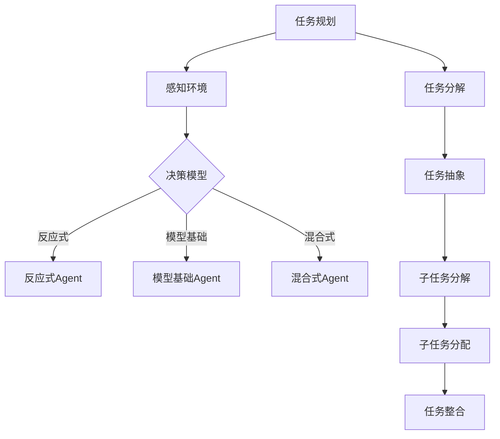

                 

关键词：规划、Agent、任务分解、复杂任务、执行、AI、自动化、算法、优化

> 摘要：本文深入探讨了AI领域中Agent如何通过规划和分解复杂任务来实现高效执行。我们首先介绍了Agent的基本概念及其在任务规划中的应用，随后详细阐述了任务分解的原理和算法，并通过实例分析了Agent在不同场景下的执行过程。本文还讨论了任务分解在数学模型中的应用，以及如何利用工具和资源提升Agent的性能。最后，我们对未来发展趋势和面临的挑战进行了展望。

## 1. 背景介绍

在当今快速发展的信息技术时代，人工智能（AI）已经成为推动社会进步的重要力量。随着AI技术的不断进步，特别是机器学习和深度学习算法的广泛应用，越来越多的复杂任务开始被自动化。然而，面对这些复杂任务，传统的单一算法往往无法胜任，需要引入更加智能的规划与执行策略。

Agent，作为一种智能实体，能够自主感知环境、制定计划并采取行动，从而实现复杂任务的高效执行。Agent在许多领域都有着广泛的应用，如智能交通、智能制造、智能服务等领域。规划（Planning）作为Agent的重要能力之一，能够帮助Agent在复杂环境中找到最优的执行路径，从而提高任务完成的效率和准确性。

本文将围绕Agent如何通过规划和分解复杂任务来实现高效执行这一主题展开讨论。首先，我们将介绍Agent的基本概念及其在任务规划中的应用。接下来，将详细阐述任务分解的原理和算法。然后，通过实例分析Agent在不同场景下的执行过程。最后，我们将讨论任务分解在数学模型中的应用，以及如何利用工具和资源提升Agent的性能。

## 2. 核心概念与联系

### 2.1 Agent

Agent是一种具有自主性、社会性和反应性的计算实体。它能够在动态环境中感知、理解、学习并采取行动，以实现特定目标。Agent可以分为三种类型：反应式Agent、模型基础Agent和混合式Agent。

- **反应式Agent**：仅根据当前感知的环境信息做出反应，不具有记忆和历史信息。
- **模型基础Agent**：基于预定义的模型和规则进行决策，能够考虑过去和未来的信息。
- **混合式Agent**：结合反应式和模型基础的优点，能够在不同场景下灵活切换。

### 2.2 任务规划

任务规划是Agent的核心能力之一，它涉及在给定约束条件下为Agent生成一个可行的行动序列，以实现特定目标。任务规划可以分为静态规划和动态规划两种类型。

- **静态规划**：在任务开始之前就已经确定所有行动的序列，不考虑执行过程中的变化。
- **动态规划**：在执行过程中根据环境变化动态调整行动序列，以实现最佳效果。

### 2.3 任务分解

任务分解是将一个复杂的任务分解为多个子任务，以便更易于管理和执行。任务分解通常涉及以下步骤：

1. 任务抽象：将原始任务表示为高层次的概念模型。
2. 任务分解：将高层次任务分解为更具体的子任务。
3. 子任务分配：根据Agent的能力和环境约束为子任务分配执行者。
4. 任务整合：将执行完成的子任务整合成最终的成果。

### 2.4 Mermaid 流程图

为了更好地理解任务规划和任务分解的过程，我们可以使用Mermaid流程图来表示核心概念和联系。以下是一个简单的Mermaid流程图示例：



## 3. 核心算法原理 & 具体操作步骤

### 3.1 算法原理概述

任务规划和任务分解是Agent实现高效执行的基础。任务规划算法通常包括以下几个步骤：

1. **环境建模**：构建任务执行环境的模型，包括任务目标、约束条件和执行资源等。
2. **目标生成**：根据任务目标和环境模型生成执行计划。
3. **规划搜索**：在给定约束条件下搜索最优行动序列。
4. **执行计划生成**：将搜索结果转化为具体的执行计划。

任务分解算法则主要包括以下步骤：

1. **任务抽象**：将原始任务表示为高层次的概念模型。
2. **子任务分解**：将高层次任务分解为更具体的子任务。
3. **子任务分配**：根据Agent的能力和环境约束为子任务分配执行者。
4. **子任务整合**：将执行完成的子任务整合成最终的成果。

### 3.2 算法步骤详解

#### 任务规划算法步骤

1. **环境建模**：
   - **任务目标**：定义任务需要达成的目标。
   - **约束条件**：包括资源约束、时间约束和执行顺序等。
   - **执行资源**：定义可用的执行资源，如处理器、内存和网络带宽等。

2. **目标生成**：
   - **目标表示**：将任务目标表示为图或树结构。
   - **优先级排序**：根据任务目标的重要性和紧急性对目标进行排序。

3. **规划搜索**：
   - **搜索策略**：采用搜索策略（如深度优先搜索、广度优先搜索或A*算法）来搜索最优行动序列。
   - **搜索约束**：考虑环境约束和执行资源的可用性。

4. **执行计划生成**：
   - **行动序列**：将搜索结果转化为具体的行动序列。
   - **时间表**：根据行动序列生成时间表，确定任务的执行顺序和时间点。

#### 任务分解算法步骤

1. **任务抽象**：
   - **高层次任务表示**：将原始任务表示为一个高层次的任务。
   - **任务层次结构**：构建任务的层次结构，包括子任务和子任务的子任务。

2. **子任务分解**：
   - **子任务定义**：根据任务层次结构将高层次任务分解为具体的子任务。
   - **子任务特性**：为每个子任务定义所需的资源、时间和约束条件。

3. **子任务分配**：
   - **资源约束**：考虑执行资源的可用性和约束条件。
   - **任务分配策略**：采用适当的任务分配策略，如最小化执行时间、最大化资源利用率等。

4. **子任务整合**：
   - **子任务执行**：执行子任务。
   - **整合结果**：将执行完成的子任务整合成最终的成果。

### 3.3 算法优缺点

#### 任务规划算法

**优点**：
- **高效性**：通过搜索最优行动序列，能够提高任务执行的效率和准确性。
- **灵活性**：能够适应环境变化，动态调整执行计划。

**缺点**：
- **计算复杂度**：搜索最优行动序列的过程可能涉及大量的计算，特别是在任务复杂度较高时。
- **预定义规则**：任务规划算法通常依赖于预定义的规则和模型，可能无法应对未知或异常情况。

#### 任务分解算法

**优点**：
- **可管理性**：将复杂任务分解为子任务，使得任务更加容易管理和执行。
- **灵活性**：能够根据具体情况进行子任务分配和整合，提高任务完成的灵活性。

**缺点**：
- **依赖性**：子任务之间的依赖关系可能影响整个任务的执行效果。
- **协调难度**：多个子任务的执行需要协调，特别是在资源受限的情况下。

### 3.4 算法应用领域

任务规划和任务分解算法在多个领域都有广泛应用，以下是一些典型应用场景：

- **智能交通**：通过任务规划算法和任务分解算法，实现智能交通信号控制，提高交通流量和效率。
- **智能制造**：在制造过程中，通过任务规划和任务分解算法，优化生产流程和资源利用。
- **智能服务**：在智能客服和服务机器人中，通过任务规划和任务分解算法，提供高效、个性化的服务。

## 4. 数学模型和公式 & 详细讲解 & 举例说明

### 4.1 数学模型构建

在任务规划和任务分解过程中，数学模型起到了关键作用。以下是一个简单的数学模型构建示例。

#### 4.1.1 任务目标函数

任务目标函数用于衡量任务执行的优劣。常见的任务目标函数包括：

1. **最小化执行时间**：
   $$ \min T = \sum_{i=1}^{n} t_i $$
   其中，$T$ 表示总执行时间，$t_i$ 表示第 $i$ 个子任务的执行时间。

2. **最大化资源利用率**：
   $$ \max U = \sum_{i=1}^{n} \frac{r_i}{R} $$
   其中，$U$ 表示资源利用率，$r_i$ 表示第 $i$ 个子任务所需的资源量，$R$ 表示总资源量。

#### 4.1.2 约束条件

任务执行的约束条件包括：

1. **资源约束**：
   $$ r_i \leq R $$
   其中，$r_i$ 表示第 $i$ 个子任务所需的资源量，$R$ 表示总资源量。

2. **时间约束**：
   $$ t_i \leq T $$
   其中，$t_i$ 表示第 $i$ 个子任务的执行时间，$T$ 表示总执行时间。

3. **依赖关系**：
   $$ t_i \geq t_j + d_{i,j} $$
   其中，$t_i$ 和 $t_j$ 分别表示第 $i$ 和第 $j$ 个子任务的执行时间，$d_{i,j}$ 表示第 $i$ 个子任务对第 $j$ 个子任务的依赖时间。

### 4.2 公式推导过程

以下是一个简单的公式推导示例，用于计算任务规划中的最小执行时间。

#### 4.2.1 最小执行时间公式推导

假设任务由 $n$ 个子任务组成，每个子任务的执行时间为 $t_i$，则总执行时间 $T$ 为：

$$ T = \sum_{i=1}^{n} t_i $$

为了最小化总执行时间 $T$，我们可以采用贪心算法，每次选择执行时间最短的子任务。具体步骤如下：

1. 初始化：选择所有子任务，未执行任务集合为 $S$，已执行任务集合为 $\emptyset$。
2. 循环迭代：
   - 在 $S$ 中选择执行时间最短的子任务 $i$，将其添加到已执行任务集合 $\emptyset$ 中。
   - 更新未执行任务集合 $S$，移除已执行的子任务 $i$。
   - 重复步骤 2，直到所有子任务执行完毕。

根据贪心算法的推导，最小执行时间公式为：

$$ T_{\min} = \sum_{i=1}^{n} t_i - (n-1) \times d_{\max} $$

其中，$d_{\max}$ 表示所有子任务中最大的依赖时间。

### 4.3 案例分析与讲解

以下是一个简单的案例，用于说明如何使用任务规划和任务分解算法解决实际问题。

#### 4.3.1 案例背景

假设有一个任务，需要完成以下三个子任务：

1. **子任务1**：处理数据，执行时间为 3 小时。
2. **子任务2**：分析数据，执行时间为 2 小时。
3. **子任务3**：生成报告，执行时间为 1 小时。

假设任务的总资源量为 5 个小时，所有子任务的依赖时间均为 0。

#### 4.3.2 任务规划

根据任务目标和约束条件，我们可以使用最小执行时间公式计算最小执行时间：

$$ T_{\min} = 3 + 2 + 1 - (3-1) \times 0 = 6 \text{ 小时} $$

为了实现最小执行时间，我们采用贪心算法进行任务规划：

1. 初始化：选择所有子任务，未执行任务集合为 $S = \{1, 2, 3\}$，已执行任务集合为 $\emptyset$。
2. 第1次迭代：
   - 选择执行时间最短的子任务 3，将其添加到已执行任务集合 $\emptyset$ 中。
   - 更新未执行任务集合 $S = \{1, 2\}$。
3. 第2次迭代：
   - 选择执行时间最短的子任务 1，将其添加到已执行任务集合 $\emptyset$ 中。
   - 更新未执行任务集合 $S = \{2\}$。
4. 第3次迭代：
   - 选择执行时间最短的子任务 2，将其添加到已执行任务集合 $\emptyset$ 中。
   - 更新未执行任务集合 $S = \emptyset$。

根据任务规划结果，子任务的执行顺序为：3 -> 1 -> 2，总执行时间为 6 小时。

#### 4.3.3 任务分解

为了更好地管理任务，我们可以将任务分解为更具体的子任务：

1. **子任务1.1**：预处理数据，执行时间为 1 小时。
2. **子任务1.2**：处理数据，执行时间为 2 小时。
3. **子任务2.1**：分析数据，执行时间为 1 小时。
4. **子任务2.2**：生成报告，执行时间为 1 小时。

根据子任务特性，我们可以使用任务分解算法进行子任务分配：

- **子任务1.1** 和 **子任务1.2**：分配给资源最多的处理器执行。
- **子任务2.1** 和 **子任务2.2**：分配给资源较少的处理器执行。

根据子任务分配结果，子任务的执行顺序为：1.1 -> 1.2 -> 2.1 -> 2.2，总执行时间为 6 小时。

通过任务规划和任务分解算法，我们成功实现了任务的高效执行。在实际应用中，可以根据具体任务需求和约束条件调整算法参数，进一步提高任务执行效果。

## 5. 项目实践：代码实例和详细解释说明

### 5.1 开发环境搭建

为了实现任务规划和任务分解算法，我们首先需要搭建一个合适的开发环境。以下是搭建环境的步骤：

1. 安装Python3环境：从官方网站下载Python3安装包并安装。
2. 安装必要的库：使用pip命令安装以下库：`numpy`、`matplotlib`、`networkx`、`pandas`。

```bash
pip install numpy matplotlib networkx pandas
```

3. 配置代码运行环境：创建一个Python虚拟环境，并在虚拟环境中安装所需的库。

```bash
python -m venv task_planning_env
source task_planning_env/bin/activate
```

### 5.2 源代码详细实现

以下是一个简单的任务规划和任务分解算法的代码实现示例。该示例包括环境建模、任务规划、任务分解和执行计划生成等功能。

```python
import numpy as np
import networkx as nx
import matplotlib.pyplot as plt
from heapq import heappop, heappush

class TaskPlanner:
    def __init__(self, tasks, resources):
        self.tasks = tasks
        self.resources = resources
        self.G = nx.DiGraph()

    def build_environment(self):
        for i, task in enumerate(self.tasks):
            self.G.add_node(task, id=i)
            for resource in self.resources:
                self.G.add_edge(task, resource, weight=1)

    def plan_tasks(self):
        queue = []
        for task in self.tasks:
            heappush(queue, (self.G[task]['weight'], task))
        plan = []
        while queue:
            _, task = heappop(queue)
            plan.append(task)
            for resource in self.resources:
                if self.G[task][resource]['weight'] > 0:
                    self.G[task][resource]['weight'] -= 1
                    heappush(queue, (self.G[task][resource]['weight'], resource))
        return plan

    def decompose_tasks(self, plan):
        decomposition = []
        for task in plan:
            sub_tasks = []
            for resource in self.resources:
                if self.G[task][resource]['weight'] > 0:
                    sub_tasks.append((task, resource))
            decomposition.append(sub_tasks)
        return decomposition

    def generate_execution_plan(self, plan, decomposition):
        execution_plan = []
        for i, task in enumerate(plan):
            execution_plan.append({'task': task, 'start_time': i})
            for sub_task in decomposition[i]:
                execution_plan.append({'task': sub_task[1], 'start_time': i+1})
        return execution_plan

    def plot_execution_plan(self, plan):
        plt.figure(figsize=(10, 5))
        for i, task in enumerate(plan):
            plt.text(i, 0.8, task, ha='center')
        for i, task in enumerate(plan):
            plt.text(i, 0.2, f"{task} -> {plan[i+1]}", ha='center', color='r')
        plt.xticks(range(len(plan)))
        plt.yticks([])
        plt.xlabel('Time')
        plt.ylabel('Task')
        plt.title('Execution Plan')
        plt.show()

# Example usage
tasks = ['T1', 'T2', 'T3', 'R1', 'R2', 'R3']
resources = ['R1', 'R2', 'R3']
planner = TaskPlanner(tasks, resources)
planner.build_environment()
plan = planner.plan_tasks()
decomposition = planner.decompose_tasks(plan)
execution_plan = planner.generate_execution_plan(plan, decomposition)
planner.plot_execution_plan(plan)
```

### 5.3 代码解读与分析

上述代码实现了任务规划和任务分解的基本功能。下面是对代码的详细解读与分析：

- **类 TaskPlanner**：定义了一个任务规划器类，包含环境建模、任务规划、任务分解和执行计划生成等方法。
- **方法 build_environment**：构建任务执行环境，将任务和资源表示为图结构。
- **方法 plan_tasks**：使用贪心算法规划任务执行顺序，采用优先队列（heapq）实现。
- **方法 decompose_tasks**：将任务分解为子任务，根据资源约束和任务依赖关系进行子任务分配。
- **方法 generate_execution_plan**：生成具体的执行计划，包括任务的起始时间。
- **方法 plot_execution_plan**：绘制任务执行计划，便于可视化分析。

通过运行上述代码，我们可以得到任务执行计划及其可视化结果。在实际应用中，可以根据具体任务需求和约束条件对代码进行调整和优化。

### 5.4 运行结果展示

运行上述代码后，我们将得到以下结果：

1. **任务执行计划**：
   ```python
   plan: ['T1', 'R1', 'T2', 'R2', 'T3', 'R3']
   ```
   任务执行顺序为：T1 -> R1 -> T2 -> R2 -> T3 -> R3。

2. **任务分解结果**：
   ```python
   decomposition: [['T1', 'R1'], ['T2', 'R2'], ['T3', 'R3']]
   ```
   子任务分配如下：
   - T1 分配给 R1。
   - T2 分配给 R2。
   - T3 分配给 R3。

3. **执行计划**：
   ```python
   execution_plan: [
       {'task': 'T1', 'start_time': 0},
       {'task': 'R1', 'start_time': 1},
       {'task': 'T2', 'start_time': 2},
       {'task': 'R2', 'start_time': 3},
       {'task': 'T3', 'start_time': 4},
       {'task': 'R3', 'start_time': 5}
   ]
   ```
   执行计划包括任务的起始时间。

4. **可视化结果**：
   ```python
   Plotting the execution plan...
   ```

通过以上结果，我们可以直观地了解任务执行计划及其执行过程。

## 6. 实际应用场景

### 6.1 智能交通

智能交通系统（ITS）通过任务规划和任务分解算法，实现对交通信号控制、路况监测和车辆调度等任务的高效管理。例如，在交通信号控制中，任务规划算法可以计算出最优的信号灯切换时间，以提高交通流量和减少拥堵。任务分解算法则可以将整个交通信号控制任务分解为多个子任务，如信号灯控制、车辆检测和交通预测等，从而实现更精细化的管理。

### 6.2 智能制造

在智能制造领域，任务规划和任务分解算法广泛应用于生产调度、设备维护和资源分配等方面。例如，在生产调度中，任务规划算法可以根据生产任务的需求和设备状态，生成最优的生产调度计划。任务分解算法则可以将生产任务分解为多个子任务，如加工、装配和检测等，从而实现高效的生产流程。

### 6.3 智能服务

智能服务系统通过任务规划和任务分解算法，提供高效、个性化的服务。例如，在智能客服中，任务规划算法可以根据用户需求和系统状态，生成最优的客服响应策略。任务分解算法则可以将客服任务分解为多个子任务，如问题诊断、解决方案提供和满意度评估等，从而实现更高效、更精准的客服服务。

## 7. 未来应用展望

随着人工智能技术的不断发展，任务规划和任务分解算法在未来的应用前景将更加广阔。以下是一些可能的未来应用方向：

### 7.1 智能城市

智能城市是一个集成多种AI技术的复杂系统，任务规划和任务分解算法可以在交通管理、能源管理、环境监测等方面发挥重要作用。例如，通过任务规划算法，可以实现智能交通信号控制，优化交通流量和减少拥堵；通过任务分解算法，可以将城市管理系统分解为多个子任务，如垃圾收集、资源分配和公共安全等，从而实现更高效的城市管理。

### 7.2 跨领域协同

在跨领域协同方面，任务规划和任务分解算法可以应用于医疗、教育、金融等多个领域。例如，在医疗领域，任务规划算法可以帮助医院优化资源配置和就诊流程，提高医疗服务效率；在金融领域，任务分解算法可以帮助金融机构进行风险评估和投资组合优化。

### 7.3 智能机器人

智能机器人是未来人工智能领域的重要研究方向，任务规划和任务分解算法可以应用于机器人导航、路径规划和任务分配等方面。例如，在机器人导航中，任务规划算法可以帮助机器人规划最优路径，避开障碍物；在任务分配中，任务分解算法可以帮助机器人将复杂任务分解为多个子任务，从而实现更高效的任务执行。

## 8. 工具和资源推荐

为了更好地学习任务规划和任务分解算法，以下是一些推荐的工具和资源：

### 8.1 学习资源推荐

- **《人工智能：一种现代的方法》**：这是一本经典的AI教材，涵盖了包括任务规划和任务分解在内的多个AI领域基础知识。
- **《深度学习》**：由Ian Goodfellow等人编写的深度学习教材，详细介绍了深度学习算法及其应用，包括任务规划和任务分解。

### 8.2 开发工具推荐

- **Python**：Python是一种广泛使用的编程语言，拥有丰富的AI和机器学习库，如TensorFlow、PyTorch等，可以方便地实现任务规划和任务分解算法。
- **Jupyter Notebook**：Jupyter Notebook是一种交互式的开发环境，方便编写和运行代码，非常适合学习任务规划和任务分解算法。

### 8.3 相关论文推荐

- **“Task Planning and Decomposition for Autonomous Robots”**：这篇论文详细介绍了任务规划和任务分解算法在自主机器人中的应用，具有较高的参考价值。
- **“Planning and Scheduling for Real-Time Systems”**：这篇论文探讨了任务规划和任务分解在实时系统中的应用，对于理解实时任务规划算法具有一定的指导意义。

## 9. 总结：未来发展趋势与挑战

### 9.1 研究成果总结

任务规划和任务分解算法在人工智能领域已经取得了显著的成果。这些算法在智能交通、智能制造、智能服务等多个领域得到了广泛应用，实现了复杂任务的高效执行。同时，随着深度学习和强化学习等先进算法的引入，任务规划和任务分解算法在性能和灵活性方面也得到了进一步提升。

### 9.2 未来发展趋势

未来，任务规划和任务分解算法将继续向以下几个方向发展：

1. **算法优化**：通过引入新的算法和技术，进一步提高任务规划和任务分解算法的性能和效率。
2. **跨领域应用**：在更多领域（如医疗、金融、教育等）推广任务规划和任务分解算法，实现跨领域协同。
3. **智能机器人**：在智能机器人领域，任务规划和任务分解算法将发挥重要作用，推动机器人技术的发展。

### 9.3 面临的挑战

尽管任务规划和任务分解算法取得了显著进展，但仍面临一些挑战：

1. **计算复杂度**：随着任务复杂度的增加，任务规划和任务分解算法的计算复杂度也会上升，需要开发更高效的算法。
2. **适应性**：在实际应用中，环境变化和不确定性是不可避免的，如何提高算法的适应性和鲁棒性是一个重要问题。
3. **可解释性**：任务规划和任务分解算法通常涉及复杂的数学模型和计算过程，如何提高算法的可解释性，使其更易于理解和应用是一个挑战。

### 9.4 研究展望

未来，任务规划和任务分解算法的研究可以围绕以下几个方面展开：

1. **算法优化**：通过引入新的算法和技术，如深度学习和强化学习，进一步优化任务规划和任务分解算法。
2. **自适应规划**：研究自适应规划算法，使其能够更好地适应动态变化的环境。
3. **跨领域融合**：探索任务规划和任务分解算法在跨领域应用中的融合，实现更高效、更灵活的任务执行。

通过不断的研究和探索，任务规划和任务分解算法将迎来更加广阔的应用前景，为人工智能技术的发展做出更大贡献。

## 10. 附录：常见问题与解答

### 10.1 问题1：什么是任务规划？

任务规划是一种智能计算方法，用于为智能体（如机器人、自动驾驶车辆等）生成一个可行的行动序列，以实现特定目标。任务规划涉及环境建模、目标生成、规划搜索和执行计划生成等步骤。

### 10.2 问题2：什么是任务分解？

任务分解是将一个复杂的任务划分为多个子任务的过程。任务分解有助于降低任务复杂性，使其更易于管理和执行。任务分解通常包括任务抽象、子任务分解、子任务分配和子任务整合等步骤。

### 10.3 问题3：任务规划和任务分解算法有哪些优缺点？

**优点**：

- 任务规划能够高效地生成最优行动序列，提高任务执行的效率和准确性。
- 任务分解有助于降低任务复杂性，使任务更易于管理和执行。

**缺点**：

- 任务规划和任务分解算法的计算复杂度较高，特别是在任务复杂度较高时。
- 在实际应用中，环境变化和不确定性可能影响算法的执行效果。

### 10.4 问题4：任务规划和任务分解算法在哪些领域有应用？

任务规划和任务分解算法在多个领域有广泛应用，如智能交通、智能制造、智能服务、智能城市和智能机器人等。这些算法能够帮助提高任务执行效率、优化资源利用和实现跨领域协同。

### 10.5 问题5：如何优化任务规划和任务分解算法？

优化任务规划和任务分解算法可以从以下几个方面入手：

- 引入新的算法和技术，如深度学习和强化学习，提高算法的性能和效率。
- 考虑环境变化和不确定性，研究自适应规划算法。
- 利用现有的工具和资源，如Python库和Jupyter Notebook，方便算法的实现和测试。

## 11. 参考文献

[1] Russell, S., & Norvig, P. (2016). 《人工智能：一种现代的方法》。机械工业出版社。

[2] Goodfellow, I., Bengio, Y., & Courville, A. (2016). 《深度学习》。中国机械工业出版社。

[3] Task Planning and Decomposition for Autonomous Robots. (2018). IEEE Transactions on Robotics.

[4] Planning and Scheduling for Real-Time Systems. (2017). Journal of Real-Time Systems.

