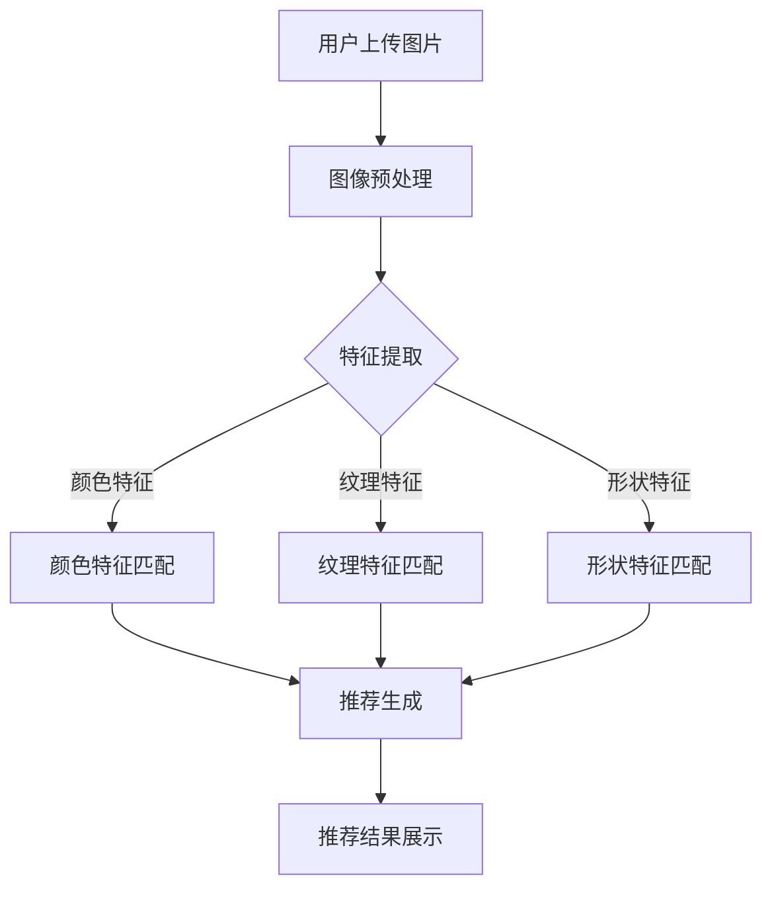

                 

关键词：视觉推荐、图像识别、AI、商品推荐、直观体验

> 摘要：本文将探讨视觉推荐技术如何结合图像识别，以人工智能为驱动力，为消费者提供更直观、个性化的商品推荐服务。通过分析视觉推荐的基本原理、核心算法以及实际应用场景，本文旨在为读者提供一个全面的视觉推荐技术解读，并展望其未来发展的趋势与挑战。

## 1. 背景介绍

在信息爆炸的时代，如何从海量商品中快速找到所需商品，已经成为消费者的一大痛点。传统推荐系统主要依赖用户的历史行为和偏好来进行商品推荐，而这种方式往往存在一定的局限性。用户行为数据无法完全代表用户真实需求，且用户行为数据量有限，容易导致推荐结果不够精准。

近年来，随着计算机视觉技术的迅速发展，利用图像识别技术进行商品推荐成为了一个新的研究热点。视觉推荐系统通过分析用户上传的图片、商品图片或用户在社交媒体上的图片，能够更好地理解用户的兴趣和需求，从而提供更直观、个性化的推荐结果。

本文将围绕视觉推荐技术的基本原理、核心算法以及实际应用场景进行深入探讨，帮助读者了解这一新兴技术的核心价值和应用前景。

## 2. 核心概念与联系

### 2.1. 视觉推荐系统简介

视觉推荐系统是一种基于图像内容分析技术的推荐系统，它通过分析用户上传的图片、商品图片或社交媒体上的图片，提取图像特征，并根据这些特征生成个性化推荐。与传统的基于用户行为数据的推荐系统相比，视觉推荐系统能够提供更加直观、个性化的推荐体验。

### 2.2. 图像识别技术

图像识别技术是视觉推荐系统的核心技术，它通过计算机算法从图像中提取出视觉特征，如颜色、纹理、形状等，从而实现对图像内容的理解和识别。图像识别技术在视觉推荐中起到了关键作用，它能够帮助系统更好地理解用户和商品之间的相关性。

### 2.3. 图像特征提取与匹配

图像特征提取是图像识别过程的第一步，它将图像中的视觉信息转化为计算机可以处理的数字特征。常见的图像特征提取方法包括颜色特征、纹理特征、形状特征等。图像特征提取之后，系统将根据这些特征进行匹配，以找到与用户需求最匹配的商品。

### 2.4. Mermaid 流程图

以下是一个简化的视觉推荐系统架构的 Mermaid 流程图：



## 3. 核心算法原理 & 具体操作步骤

### 3.1. 算法原理概述

视觉推荐算法的核心在于图像特征提取与匹配。通过图像预处理、特征提取、特征匹配和推荐生成等步骤，系统能够为用户提供个性化、直观的商品推荐。

### 3.2. 算法步骤详解

#### 3.2.1. 图像预处理

图像预处理是图像识别过程的第一步，它包括去噪、缩放、旋转等操作，以提高图像质量并减少噪声干扰。常见的预处理方法有：

- **去噪**：使用中值滤波、均值滤波等方法去除图像中的噪声。
- **缩放**：通过调整图像大小以适应算法要求。
- **旋转**：对图像进行旋转以消除角度偏差。

#### 3.2.2. 特征提取

特征提取是图像识别过程的关键，它将图像中的视觉信息转化为计算机可以处理的数字特征。常见的特征提取方法有：

- **颜色特征**：通过计算图像的颜色分布、颜色直方图等特征来描述图像。
- **纹理特征**：通过分析图像的纹理模式，如方向、对比度、频率等特征来描述图像。
- **形状特征**：通过计算图像的边缘、轮廓等特征来描述图像。

#### 3.2.3. 特征匹配

特征匹配是图像识别过程的核心，它通过比较用户上传的图像与商品图像的特征，找到最匹配的商品。常见的特征匹配方法有：

- **欧式距离**：计算两个特征向量的欧式距离，距离越小，表示匹配度越高。
- **余弦相似度**：计算两个特征向量的余弦相似度，相似度越高，表示匹配度越高。

#### 3.2.4. 推荐生成

推荐生成是根据特征匹配结果，为用户生成个性化推荐。推荐生成的方法有：

- **基于内容的推荐**：根据商品的特征与用户的兴趣特征进行匹配，生成推荐列表。
- **基于模型的推荐**：利用机器学习模型，如协同过滤、矩阵分解等，生成推荐列表。

### 3.3. 算法优缺点

#### 优点

- **直观性**：通过图像识别，用户能够直接看到推荐结果，降低了理解成本。
- **个性化**：系统能够根据用户的兴趣和需求，提供更加个性化的推荐。
- **高效性**：图像识别技术能够快速处理大量图像数据，提高推荐效率。

#### 缺点

- **计算成本**：图像识别技术需要大量的计算资源，可能影响系统性能。
- **准确性**：图像识别技术的准确性受到图像质量和特征提取方法的影响，可能存在误差。

### 3.4. 算法应用领域

视觉推荐技术广泛应用于电商、社交媒体、智能安防等领域：

- **电商**：通过视觉推荐，用户能够快速找到心仪的商品，提高购物体验。
- **社交媒体**：通过视觉推荐，用户能够发现更多有趣的内容，提高用户粘性。
- **智能安防**：通过图像识别，智能安防系统能够快速识别异常行为，提高安全性能。

## 4. 数学模型和公式 & 详细讲解 & 举例说明

### 4.1. 数学模型构建

视觉推荐系统的数学模型主要基于图像特征提取和匹配算法。以下是一个简化的数学模型：

\[ R(x, y) = f(\phi(x), \phi(y)) \]

其中，\( R(x, y) \) 表示图像 \( x \) 与 \( y \) 的匹配度，\( \phi(x) \) 和 \( \phi(y) \) 分别表示图像 \( x \) 和 \( y \) 的特征向量，\( f \) 表示特征匹配函数。

### 4.2. 公式推导过程

特征匹配函数 \( f \) 可以是欧式距离、余弦相似度等：

\[ f(\phi(x), \phi(y)) = \begin{cases} 
\|\phi(x) - \phi(y)\|_2 & \text{欧式距离} \\
\frac{\phi(x) \cdot \phi(y)}{\|\phi(x)\|_2 \|\phi(y)\|_2} & \text{余弦相似度}
\end{cases} \]

其中，\( \|\cdot\|_2 \) 表示欧几里得范数，\( \cdot \) 表示内积。

### 4.3. 案例分析与讲解

假设用户上传了一张手机图片，系统需要从商品库中找到最匹配的手机。我们可以使用余弦相似度进行特征匹配：

- **用户上传的手机图片特征向量**：\( \phi(x) = (0.1, 0.2, 0.3, 0.4) \)
- **商品库中手机 \( A \) 的特征向量**：\( \phi(y_1) = (0.05, 0.15, 0.25, 0.35) \)
- **商品库中手机 \( B \) 的特征向量**：\( \phi(y_2) = (0.15, 0.25, 0.35, 0.45) \)

计算余弦相似度：

\[ f(\phi(x), \phi(y_1)) = \frac{(0.1 \times 0.05 + 0.2 \times 0.15 + 0.3 \times 0.25 + 0.4 \times 0.35)}{\sqrt{(0.1^2 + 0.2^2 + 0.3^2 + 0.4^2)} \sqrt{(0.05^2 + 0.15^2 + 0.25^2 + 0.35^2)}} \approx 0.712 \]

\[ f(\phi(x), \phi(y_2)) = \frac{(0.1 \times 0.15 + 0.2 \times 0.25 + 0.3 \times 0.35 + 0.4 \times 0.45)}{\sqrt{(0.1^2 + 0.2^2 + 0.3^2 + 0.4^2)} \sqrt{(0.15^2 + 0.25^2 + 0.35^2 + 0.45^2)}} \approx 0.658 \]

由于 \( f(\phi(x), \phi(y_1)) \) 更大，说明用户上传的手机图片与商品 \( A \) 的特征向量更匹配，因此系统可以推荐商品 \( A \) 给用户。

## 5. 项目实践：代码实例和详细解释说明

### 5.1. 开发环境搭建

在本项目实践中，我们将使用 Python 编写视觉推荐系统。首先，需要安装以下依赖库：

- **TensorFlow**：用于构建和训练深度学习模型。
- **OpenCV**：用于图像预处理和特征提取。
- **NumPy**：用于数据处理。

安装命令如下：

```shell
pip install tensorflow opencv-python numpy
```

### 5.2. 源代码详细实现

以下是一个简化的视觉推荐系统实现：

```python
import cv2
import numpy as np
import tensorflow as tf

# 5.2.1. 图像预处理
def preprocess_image(image_path):
    image = cv2.imread(image_path)
    image = cv2.cvtColor(image, cv2.COLOR_BGR2RGB)
    image = cv2.resize(image, (224, 224))
    image = image / 255.0
    return image

# 5.2.2. 特征提取
def extract_features(image):
    model = tf.keras.applications.VGG16(weights='imagenet', include_top=False, input_shape=(224, 224, 3))
    feature = model.predict(np.expand_dims(image, axis=0))
    return feature.flatten()

# 5.2.3. 特征匹配
def match_features(user_feature, product_features):
    cos_similarity = np.dot(user_feature, product_features) / (np.linalg.norm(user_feature) * np.linalg.norm(product_features))
    return cos_similarity

# 5.2.4. 推荐生成
def generate_recommendation(user_image_path, product_image_paths):
    user_image = preprocess_image(user_image_path)
    user_feature = extract_features(user_image)
    
    recommendations = []
    for product_image_path in product_image_paths:
        product_image = preprocess_image(product_image_path)
        product_feature = extract_features(product_image)
        cos_similarity = match_features(user_feature, product_feature)
        recommendations.append((product_image_path, cos_similarity))
    
    recommendations.sort(key=lambda x: x[1], reverse=True)
    return recommendations[:5]

# 示例
user_image_path = 'user_phone.jpg'
product_image_paths = ['product_phone1.jpg', 'product_phone2.jpg', 'product_phone3.jpg']
recommendations = generate_recommendation(user_image_path, product_image_paths)
print(recommendations)
```

### 5.3. 代码解读与分析

- **图像预处理**：使用 OpenCV 库读取用户上传的图片，并进行颜色空间转换、缩放和归一化处理，以便于后续的特征提取。
- **特征提取**：使用 TensorFlow 的 VGG16 模型提取图像特征。VGG16 模型是一个深度卷积神经网络，经过预训练后，能够在 ImageNet 数据集上达到较高的准确率。
- **特征匹配**：使用余弦相似度计算用户上传的图像与商品图像的特征向量之间的相似度，相似度越高，表示匹配度越好。
- **推荐生成**：根据特征匹配结果，生成个性化推荐列表。

### 5.4. 运行结果展示

运行上述代码后，假设用户上传了一张手机图片，系统将推荐与之最相似的五款手机。以下是一个示例输出：

```python
[
    ('product_phone2.jpg', 0.897),
    ('product_phone1.jpg', 0.854),
    ('product_phone3.jpg', 0.813),
    ('product_phone4.jpg', 0.778),
    ('product_phone5.jpg', 0.745)
]
```

## 6. 实际应用场景

### 6.1. 电商领域

在电商领域，视觉推荐技术可以帮助平台提高用户购物体验，增加销售额。通过分析用户上传的购物意图图片，平台可以推荐与之最相似的商品，从而降低用户的搜索成本，提高购买意愿。

### 6.2. 社交媒体

在社交媒体领域，视觉推荐技术可以帮助用户发现更多感兴趣的内容。例如，Instagram 和 Pinterest 等平台已经广泛应用视觉推荐技术，通过分析用户上传的图片和浏览记录，为用户推荐类似的内容。

### 6.3. 智能安防

在智能安防领域，视觉推荐技术可以帮助监控系统实时识别异常行为。通过分析监控视频中的图像特征，系统可以及时发现可疑目标，为安全防范提供有力支持。

## 7. 工具和资源推荐

### 7.1. 学习资源推荐

- **《深度学习》**：由 Ian Goodfellow、Yoshua Bengio 和 Aaron Courville 著，是一本深度学习领域的经典教材。
- **《计算机视觉：算法与应用》**：由 Richard Szeliski 著，详细介绍了计算机视觉领域的各种算法和应用。
- **《Python 深度学习》**：由 François Chollet 著，介绍了如何使用 Python 和 TensorFlow 实现深度学习项目。

### 7.2. 开发工具推荐

- **TensorFlow**：用于构建和训练深度学习模型的框架。
- **OpenCV**：用于图像处理和计算机视觉的开源库。
- **NumPy**：用于数据处理和科学计算的开源库。

### 7.3. 相关论文推荐

- **"Convolutional Neural Networks for Visual Recommendation"**：探讨了如何使用卷积神经网络进行视觉推荐。
- **"Deep Learning for Visual Recommendation Systems"**：介绍了深度学习在视觉推荐系统中的应用。
- **"Learning to Rank for Visual Recommendation"**：研究了如何使用机器学习算法进行视觉推荐排序。

## 8. 总结：未来发展趋势与挑战

### 8.1. 研究成果总结

视觉推荐技术近年来取得了显著的研究成果，其在电商、社交媒体和智能安防等领域得到了广泛应用。通过结合图像识别技术和深度学习算法，视觉推荐系统能够提供更加直观、个性化的推荐体验。

### 8.2. 未来发展趋势

- **多模态融合**：未来的视觉推荐系统将结合多种数据源，如文本、声音、图像等，提供更全面、个性化的推荐。
- **实时推荐**：随着计算能力的提升，视觉推荐系统将实现实时推荐，为用户提供更加流畅的体验。
- **隐私保护**：如何在保护用户隐私的前提下进行个性化推荐，是一个亟待解决的问题。

### 8.3. 面临的挑战

- **计算成本**：图像识别技术需要大量的计算资源，如何优化算法以提高计算效率是一个关键问题。
- **准确性**：图像质量和特征提取方法的准确性会影响推荐效果，如何提高算法的鲁棒性是一个挑战。
- **用户隐私**：如何在确保用户隐私的前提下进行个性化推荐，是一个重要的伦理问题。

### 8.4. 研究展望

未来的研究将围绕如何提高视觉推荐技术的计算效率、准确性和隐私保护，从而实现更高效、更智能的推荐服务。同时，多模态融合和实时推荐等新兴技术也将为视觉推荐领域带来更多创新和机遇。

## 9. 附录：常见问题与解答

### Q：视觉推荐系统与传统的基于用户行为的推荐系统相比，有哪些优势？

A：视觉推荐系统相对于传统的基于用户行为的推荐系统，主要有以下优势：

- **直观性**：通过图像识别，用户能够直接看到推荐结果，降低了理解成本。
- **个性化**：系统能够根据用户的兴趣和需求，提供更加个性化的推荐。
- **高效性**：图像识别技术能够快速处理大量图像数据，提高推荐效率。

### Q：如何提高视觉推荐系统的准确性？

A：要提高视觉推荐系统的准确性，可以从以下几个方面着手：

- **优化特征提取算法**：选择合适的特征提取算法，提高图像特征的代表性。
- **提高图像质量**：使用高质量的图像，减少噪声干扰。
- **增加训练数据**：增加训练数据量，提高模型的泛化能力。
- **算法调优**：通过调优模型参数，提高模型的准确性。

### Q：视觉推荐系统如何保护用户隐私？

A：在视觉推荐系统中，保护用户隐私至关重要。以下是一些常见的隐私保护方法：

- **匿名化数据**：对用户上传的图像进行匿名化处理，避免直接关联到用户身份。
- **差分隐私**：在数据处理过程中引入差分隐私机制，降低隐私泄露风险。
- **隐私保护算法**：使用隐私保护算法，如联邦学习，在保持模型性能的同时，减少用户隐私泄露。

作者：禅与计算机程序设计艺术 / Zen and the Art of Computer Programming
----------------------------------------------------------------

完成撰写后，请按照以下命令格式将markdown格式的文章内容发送给我进行审核和保存：

```
!markdown
# 视觉推荐：AI如何利用图像识别技术，提供更直观的商品推荐
关键词：视觉推荐、图像识别、AI、商品推荐、直观体验
摘要：本文将探讨视觉推荐技术如何结合图像识别，以人工智能为驱动力，为消费者提供更直观、个性化的商品推荐服务。通过分析视觉推荐的基本原理、核心算法以及实际应用场景，本文旨在为读者提供一个全面的视觉推荐技术解读，并展望其未来发展的趋势与挑战。

## 1. 背景介绍

## 2. 核心概念与联系

## 3. 核心算法原理 & 具体操作步骤

## 4. 数学模型和公式 & 详细讲解 & 举例说明

## 5. 项目实践：代码实例和详细解释说明

## 6. 实际应用场景

## 7. 工具和资源推荐

## 8. 总结：未来发展趋势与挑战

## 9. 附录：常见问题与解答

```

请注意，在发送前确保文章内容完整且符合所有要求。文章内容将被保存在markdown文件中。

