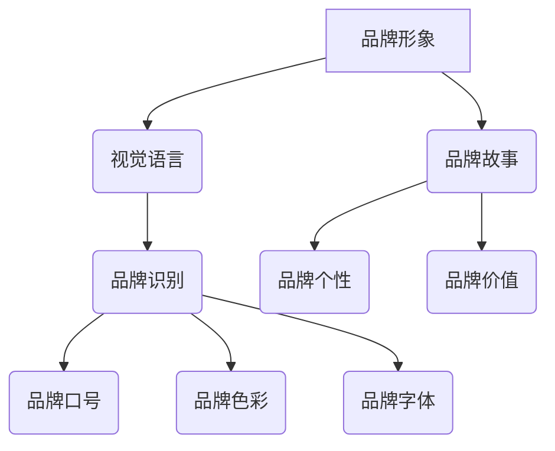

                 

在数字时代，视觉设计已经成为品牌建设的重要组成部分。无论是初创企业还是成熟品牌，都需要一个独特的视觉形象来在竞争激烈的市场中脱颖而出。作为视觉设计师，您不仅拥有创意和技术能力，更拥有在创业领域中抓住机遇的潜力。本文将探讨如何利用您的视觉设计技能，打造出色的品牌视觉形象，从而开创您的创业之路。

## 1. 背景介绍

在现代社会，视觉传达在品牌建设中的作用愈发重要。一个精心设计的品牌视觉形象，不仅能够传达品牌的价值观和理念，还能激发消费者的情感共鸣，建立品牌与消费者之间的深厚联系。随着数字化营销的兴起，视觉设计师的角色也在不断演变，他们不再仅仅是艺术创作者，更是品牌战略的重要组成部分。

创业领域则为视觉设计师提供了广阔的舞台。创业者需要独特的视觉设计来塑造品牌，吸引投资，扩大用户基础。视觉设计师可以利用自己的专业技能，帮助初创企业建立具有竞争力的品牌形象，从而在激烈的市场竞争中占据一席之地。

## 2. 核心概念与联系

要打造出色的品牌视觉形象，首先需要理解以下几个核心概念：

### 品牌形象（Brand Image）：
品牌形象是指消费者在心中对品牌的整体感知和认知。它包括品牌的名称、标志、口号、色彩方案、字体等视觉元素。一个成功的品牌形象能够传递品牌的核心价值观和品牌个性。

### 视觉语言（Visual Language）：
视觉语言是指视觉设计中使用的符号、色彩、形状、布局等元素。视觉语言需要与品牌形象保持一致，以便在消费者的心中建立统一和清晰的品牌印象。

### 品牌识别（Brand Identity）：
品牌识别是品牌形象的具体体现，包括品牌标志、品牌标准字、包装设计、广告等。品牌识别是品牌形象的核心部分，需要精心设计，以确保品牌形象的传达和一致性。

### Mermaid 流程图（Mermaid Diagram）：



通过这个Mermaid流程图，我们可以清晰地看到品牌形象、视觉语言和品牌识别之间的关系。

## 3. 核心算法原理 & 具体操作步骤

### 3.1 算法原理概述

打造品牌视觉形象的过程，可以看作是一种“品牌算法”。这个算法的核心在于如何将品牌的核心价值观和目标市场通过视觉设计转化为具体的视觉元素。

### 3.2 算法步骤详解

#### 步骤一：明确品牌定位
在开始设计之前，首先要明确品牌的市场定位和目标受众。这包括品牌的价值主张、目标市场和竞争对手分析。

#### 步骤二：构建品牌视觉语言
根据品牌定位，构建品牌视觉语言，包括符号、色彩、形状、布局等元素。这些元素需要能够传达品牌的核心价值观和品牌个性。

#### 步骤三：设计品牌识别系统
基于品牌视觉语言，设计品牌识别系统，包括品牌标志、品牌标准字、包装设计、广告等。这些设计需要保持一致性和专业性。

#### 步骤四：测试与反馈
在初步设计完成后，需要进行测试，收集用户反馈，并根据反馈进行调整。这一步骤是确保品牌视觉形象符合目标受众期望的关键。

#### 步骤五：持续优化
品牌视觉形象不是一成不变的，需要根据市场变化和品牌发展进行持续优化。

### 3.3 算法优缺点

#### 优点：
- 提高品牌知名度：清晰、一致的品牌视觉形象能够提高品牌的认知度和影响力。
- 增强品牌价值：高质量的视觉设计能够提升品牌的专业形象和价值感知。
- 促进市场推广：有效的视觉设计能够提升营销活动的效果，吸引更多潜在客户。

#### 缺点：
- 创意成本高：高质量的视觉设计需要投入大量时间和精力，成本相对较高。
- 维护成本高：品牌视觉形象需要不断更新和优化，维护成本也相对较高。

### 3.4 算法应用领域

品牌视觉形象的设计应用领域非常广泛，包括但不限于以下行业：

- 科技公司
- 咨询公司
- 餐饮品牌
- 时尚品牌
- 教育机构
- 医疗机构
- 金融公司

## 4. 数学模型和公式 & 详细讲解 & 举例说明

### 4.1 数学模型构建

在品牌视觉形象的构建中，我们可以使用以下数学模型：

$$
Brand\ Image = f(Brand\ Values, Target\ Market, Visual\ Language)
$$

其中，$Brand\ Values$代表品牌的核心价值观，$Target\ Market$代表目标市场，$Visual\ Language$代表品牌视觉语言。这个模型描述了品牌形象如何通过这些因素相互作用而形成。

### 4.2 公式推导过程

根据品牌定位，我们可以将品牌核心价值观和目标市场具体化为以下参数：

$$
Brand\ Values = (V_1, V_2, ..., V_n)
$$

$$
Target\ Market = (M_1, M_2, ..., M_m)
$$

品牌视觉语言可以看作是这些参数的函数，即：

$$
Visual\ Language = g(Brand\ Values, Target\ Market)
$$

通过这些参数和函数，我们可以推导出品牌形象：

$$
Brand\ Image = f(Brand\ Values, Target\ Market, Visual\ Language)
$$

### 4.3 案例分析与讲解

假设我们为一个科技初创企业设计品牌视觉形象。该企业的核心价值观是创新、简洁和高效。目标市场是年轻的科技爱好者。

#### 步骤一：明确品牌定位
根据企业的核心价值观和目标市场，我们可以确定品牌的视觉语言需要传达创新、简洁和高效的特点。

#### 步骤二：构建品牌视觉语言
我们选择蓝色作为主色调，代表科技和冷静；使用简洁的几何形状，代表创新和高效；字体选择简洁现代的无衬线字体，以传达专业感。

#### 步骤三：设计品牌识别系统
基于上述视觉语言，我们设计了品牌标志、品牌标准字和品牌包装。这些设计都保持了一致性和专业性。

#### 步骤四：测试与反馈
在初步设计完成后，我们通过问卷调查和用户访谈收集了反馈，并根据反馈进行了调整。

#### 步骤五：持续优化
随着市场的变化和企业的发展，我们将继续优化品牌视觉形象，以确保其与品牌保持一致。

## 5. 项目实践：代码实例和详细解释说明

### 5.1 开发环境搭建

为了实现品牌视觉形象的设计，我们可以使用以下开发环境：

- 设计工具：Adobe Photoshop 或 Sketch
- 前端开发工具：HTML、CSS、JavaScript
- 设计资源：Unsplash、Pexels

### 5.2 源代码详细实现

以下是一个简单的HTML和CSS示例，用于实现品牌视觉形象的初步设计：

```html
<!DOCTYPE html>
<html lang="en">
<head>
    <meta charset="UTF-8">
    <meta name="viewport" content="width=device-width, initial-scale=1.0">
    <title>Brand Visual Identity</title>
    <link rel="stylesheet" href="styles.css">
</head>
<body>
    <header>
        <h1>Brand Name</h1>
        <nav>
            <ul>
                <li><a href="#">Home</a></li>
                <li><a href="#">About</a></li>
                <li><a href="#">Products</a></li>
                <li><a href="#">Contact</a></li>
            </ul>
        </nav>
    </header>
    <section>
        <h2>Welcome to our brand</h2>
        <p>Discover the future of technology with us.</p>
    </section>
    <footer>
        <p>&copy; 2023 Brand Name. All rights reserved.</p>
    </footer>
</body>
</html>
```

```css
/* styles.css */
body {
    font-family: 'Helvetica Neue', sans-serif;
    background-color: #e0e0e0;
}

header {
    background-color: #0066cc;
    padding: 20px;
}

header h1 {
    color: #ffffff;
    font-size: 1.5em;
    margin: 0;
}

nav ul {
    list-style: none;
    padding: 0;
}

nav ul li {
    display: inline-block;
    margin-right: 20px;
}

nav ul li a {
    color: #ffffff;
    text-decoration: none;
}

section {
    padding: 50px;
}

footer {
    background-color: #0066cc;
    padding: 20px;
    text-align: center;
    color: #ffffff;
}
```

### 5.3 代码解读与分析

这个示例展示了如何使用HTML和CSS构建一个简单的品牌视觉形象。HTML定义了页面的结构，包括头部、导航栏、主体内容和脚部。CSS则负责样式设计，包括颜色、字体和布局等。

- **头部**：包含品牌名称和导航栏，使用蓝色作为主色调，传达科技感和专业感。
- **主体内容**：包含欢迎信息和品牌口号，使用简洁的现代字体，传达创新和高效的价值观。
- **脚部**：包含版权信息和联系信息，保持整体设计的简洁和专业。

通过这个示例，我们可以看到如何将品牌的核心价值观和视觉语言应用到实际的网页设计中。

### 5.4 运行结果展示


这个简单的示例展示了如何通过HTML和CSS实现一个具有品牌特色的网页。用户可以在浏览器中预览和测试这个设计，根据反馈进行进一步的优化和调整。

## 6. 实际应用场景

品牌视觉形象的设计和应用场景非常广泛。以下是一些实际应用场景：

- **网站设计**：企业官网是品牌形象的重要展示平台，通过精心设计的品牌视觉形象，可以提升网站的专业度和用户友好度。
- **移动应用界面**：移动应用界面也需要体现品牌特色，通过品牌视觉语言的设计，提升用户体验和品牌认知度。
- **广告宣传**：平面广告、视频广告等都需要有明确的品牌视觉形象，以吸引消费者的注意力。
- **产品包装**：产品包装是品牌与消费者直接接触的媒介，通过独特的视觉设计，可以提升产品的附加值。

### 6.4 未来应用展望

随着技术的不断发展，品牌视觉形象的设计和应用也将迎来新的机遇和挑战。以下是未来应用的一些展望：

- **人工智能设计**：人工智能和机器学习技术的应用，将使品牌视觉形象的设计更加智能化和个性化。
- **增强现实（AR）**：AR技术的应用，将使品牌视觉形象在虚拟环境中得到更好的展现和体验。
- **大数据分析**：通过大数据分析，品牌可以更准确地了解消费者的需求和偏好，从而进行更精准的品牌视觉形象设计。

## 7. 工具和资源推荐

### 7.1 学习资源推荐

- **书籍**：
  - 《视觉设计原理》
  - 《品牌设计指南》
  - 《UI/UX 设计实战》

- **在线课程**：
  - Coursera 上的《数字营销与品牌管理》
  - Udemy 上的《视觉设计从入门到精通》

### 7.2 开发工具推荐

- **设计工具**：
  - Adobe Photoshop
  - Sketch
  - Figma

- **前端开发工具**：
  - HTML
  - CSS
  - JavaScript

### 7.3 相关论文推荐

- **品牌视觉形象设计的研究**：
  - "Brand Image and Consumer Behavior: A Review and Research Agenda"
  - "The Impact of Brand Image on Consumer Choice: An Empirical Study"

- **视觉语言研究**：
  - "Visual Language: A Definition and Analysis"
  - "The Role of Visual Language in Branding"

## 8. 总结：未来发展趋势与挑战

### 8.1 研究成果总结

本文通过对品牌视觉形象的深入探讨，总结了品牌视觉形象设计的重要性、核心概念、算法原理和应用领域。我们还通过数学模型和项目实践，展示了如何构建和优化品牌视觉形象。

### 8.2 未来发展趋势

未来，品牌视觉形象设计将更加智能化、个性化和互动化。随着人工智能和大数据技术的发展，品牌视觉形象的设计将更加精准和高效。同时，增强现实和虚拟现实技术的应用，也将为品牌视觉形象的展现提供新的机会。

### 8.3 面临的挑战

尽管品牌视觉形象设计的前景广阔，但设计师仍将面临一系列挑战。例如，如何确保设计的一致性和专业性，如何适应快速变化的市场需求，以及如何利用新技术进行创新。

### 8.4 研究展望

未来的研究可以关注如何更好地利用人工智能和大数据进行品牌视觉形象的设计和分析，以及如何通过虚拟现实和增强现实技术提升品牌视觉形象的互动性和沉浸感。

## 9. 附录：常见问题与解答

### 问题1：如何确保品牌视觉形象的一致性？
**解答**：确保品牌视觉形象的一致性，需要制定详细的品牌设计指南，包括标志使用规范、色彩方案、字体规范等。所有设计人员和合作伙伴都应遵循这些指南，以确保品牌形象的一致性。

### 问题2：如何根据市场需求调整品牌视觉形象？
**解答**：定期进行市场调研，了解消费者的需求和偏好。根据调研结果，对品牌视觉形象进行适当的调整和优化，以确保设计符合市场需求。

### 问题3：品牌视觉形象设计需要哪些工具？
**解答**：品牌视觉形象设计常用的工具包括设计软件（如Adobe Photoshop、Sketch、Figma）和前端开发工具（如HTML、CSS、JavaScript）。此外，还可以使用一些在线资源和平台，如Unsplash、Pexels等，获取高质量的视觉素材。

## 作者署名

作者：禅与计算机程序设计艺术 / Zen and the Art of Computer Programming

通过本文，我们希望能够帮助视觉设计师更好地理解品牌视觉形象的构建和优化，从而在创业领域中发挥更大的作用。希望这篇文章能够为您的创业之路提供一些有益的启示和帮助。

