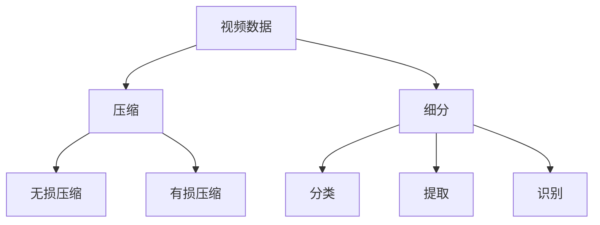

                 

关键词：视频压缩、数据细分、技术解析、图像处理、算法实现、应用领域

摘要：本文旨在深入探讨视频数据的压缩与细分技术，从背景介绍、核心概念、算法原理、数学模型、项目实践、应用场景、未来展望等多方面进行详细解析。通过本文，读者可以全面了解视频数据压缩与细分的原理、方法和实际应用，为相关领域的研究和实践提供有益的参考。

## 1. 背景介绍

随着互联网和视频技术的飞速发展，视频数据已成为信息传播和娱乐消费的主要形式。然而，视频数据的高容量特性给存储和传输带来了巨大的挑战。为了解决这一难题，视频压缩技术应运而生。视频压缩技术通过去除冗余信息，降低数据容量，从而实现高效存储和传输。

另一方面，随着人工智能和计算机视觉技术的发展，对视频数据的处理需求日益增长。视频数据的细分技术，即对视频内容进行分类、提取和识别，成为当前研究的热点。细分技术有助于实现视频内容的智能分析、场景识别和内容推荐等应用。

本文将从视频数据的压缩与细分技术出发，深入探讨其核心概念、算法原理、数学模型、项目实践和应用场景，旨在为相关领域的研究和实践提供有益的参考。

## 2. 核心概念与联系

### 2.1 视频数据压缩

视频数据压缩是一种通过去除冗余信息，降低数据容量的技术。视频数据压缩的核心目标是实现高效存储和传输，同时保证视频质量。视频数据压缩可分为两大类：无损压缩和有损压缩。

- **无损压缩**：无损压缩通过去除视频数据中的冗余信息，实现数据压缩，但不会影响视频质量。无损压缩方法包括霍夫曼编码、算术编码和行程编码等。

- **有损压缩**：有损压缩通过牺牲部分视频质量，实现更高的压缩比。有损压缩方法包括变换编码、预测编码和压缩感知等。

### 2.2 视频数据细分

视频数据细分是指对视频内容进行分类、提取和识别的技术。视频数据细分的核心目标是实现视频内容的智能分析、场景识别和内容推荐等应用。视频数据细分技术主要包括以下几种：

- **视频分类**：将视频数据按照内容进行分类，如动作、风景、人物等。

- **视频提取**：从视频中提取感兴趣的部分，如人脸、车辆、特定场景等。

- **视频识别**：对视频内容进行识别，如人物身份识别、场景识别、行为识别等。

### 2.3 Mermaid 流程图

以下是视频数据压缩与细分技术的 Mermaid 流程图：



## 3. 核心算法原理 & 具体操作步骤

### 3.1 算法原理概述

视频数据压缩的核心算法原理主要包括以下几种：

- **变换编码**：通过将图像数据转换为频率域，去除冗余信息，实现数据压缩。常见的变换编码方法包括离散余弦变换（DCT）和离散小波变换（DWT）。

- **预测编码**：通过预测未来数据与当前数据的差异，去除冗余信息，实现数据压缩。常见的预测编码方法包括差分脉冲编码调制（DPCM）和自适应预测（APC）。

- **压缩感知**：通过在随机传感器上测量信号，利用压缩感知算法重构信号，实现数据压缩。常见的压缩感知算法包括基追踪（BP）和正则化基追踪（RBP）。

视频数据细分的核心算法原理主要包括以下几种：

- **分类算法**：通过对视频数据进行特征提取和分类，实现视频内容的分类。常见的分类算法包括支持向量机（SVM）、朴素贝叶斯（NB）和随机森林（RF）。

- **提取算法**：通过对视频数据进行特征提取和匹配，实现视频内容的提取。常见的提取算法包括哈希提取、边缘提取和深度学习提取。

- **识别算法**：通过对视频数据进行特征提取和识别，实现视频内容的识别。常见的识别算法包括卷积神经网络（CNN）和循环神经网络（RNN）。

### 3.2 算法步骤详解

#### 3.2.1 视频数据压缩算法步骤

1. **预处理**：对视频数据进行预处理，包括去噪、缩放、旋转等操作。

2. **图像分割**：将视频数据划分为若干连续帧，进行图像分割。

3. **变换编码**：对每帧图像进行变换编码，如 DCT 或 DWT。

4. **量化**：对变换系数进行量化，降低数据精度。

5. **熵编码**：对量化后的数据进行熵编码，如霍夫曼编码或算术编码。

6. **数据压缩**：将熵编码后的数据存储或传输。

#### 3.2.2 视频数据细分算法步骤

1. **特征提取**：对视频数据进行特征提取，如颜色、纹理、形状等。

2. **分类算法**：利用分类算法对特征进行分类，如 SVM、NB 或 RF。

3. **提取算法**：利用提取算法对分类结果进行提取，如哈希提取、边缘提取或深度学习提取。

4. **识别算法**：利用识别算法对提取结果进行识别，如 CNN 或 RNN。

### 3.3 算法优缺点

#### 3.3.1 视频数据压缩算法优缺点

- **变换编码**：优点包括去除冗余信息、数据压缩比高；缺点包括压缩时间较长、对图像质量有一定损失。

- **预测编码**：优点包括去除冗余信息、压缩时间较短；缺点包括压缩比相对较低、对图像质量有一定损失。

- **压缩感知**：优点包括压缩时间较短、数据重构效果较好；缺点包括对传感器噪声敏感、算法复杂度较高。

#### 3.3.2 视频数据细分算法优缺点

- **分类算法**：优点包括分类准确度高、应用广泛；缺点包括对特征提取依赖较大、计算复杂度较高。

- **提取算法**：优点包括提取效果较好、计算复杂度较低；缺点包括对特征提取有一定依赖、提取精度受影响。

- **识别算法**：优点包括识别准确度高、应用广泛；缺点包括对特征提取依赖较大、计算复杂度较高。

### 3.4 算法应用领域

视频数据压缩与细分技术在多个领域具有广泛应用：

- **视频通信**：视频数据压缩技术用于实现视频会议、视频通话等视频通信应用，降低数据传输量，提高通信质量。

- **视频监控**：视频数据细分技术用于实现视频监控的智能分析，如人脸识别、行为识别等。

- **视频推荐**：视频数据细分技术用于实现视频内容的分类、提取和识别，为用户推荐感兴趣的视频内容。

- **医疗影像**：视频数据压缩技术用于实现医疗影像的存储和传输，提高医疗资源利用效率。

## 4. 数学模型和公式 & 详细讲解 & 举例说明

### 4.1 数学模型构建

#### 4.1.1 视频数据压缩数学模型

假设视频数据为 $X \in \mathbb{R}^{m \times n}$，其中 $m$ 和 $n$ 分别为图像的高度和宽度。变换编码的数学模型如下：

$$
Y = F(X) + \epsilon
$$

其中，$F(X)$ 为变换操作，如 DCT 或 DWT；$\epsilon$ 为量化误差。

#### 4.1.2 视频数据细分数学模型

假设视频数据为 $X \in \mathbb{R}^{m \times n}$，特征提取后的数据为 $Z \in \mathbb{R}^{d}$，分类模型为 $h(Z)$。分类模型的数学模型如下：

$$
y = h(Z)
$$

其中，$y$ 为分类结果，$h(Z)$ 为分类函数。

### 4.2 公式推导过程

#### 4.2.1 视频数据压缩公式推导

以 DCT 为例，DCT 的公式推导如下：

$$
DCT(X) = \sum_{i=1}^{m} \sum_{j=1}^{n} X[i, j] \cdot \cos\left[\frac{(2i-1) \cdot \pi \cdot x[n-1]}{2 \cdot n}\right] \cdot \cos\left[\frac{(2j-1) \cdot \pi \cdot x[m-1]}{2 \cdot m}\right]
$$

#### 4.2.2 视频数据细分公式推导

以 SVM 为例，SVM 的公式推导如下：

$$
w \cdot \phi(x) + b = 0
$$

其中，$w$ 为权重向量，$\phi(x)$ 为特征映射函数，$b$ 为偏置。

### 4.3 案例分析与讲解

#### 4.3.1 视频数据压缩案例

假设有一幅 128x128 的图像，采用 DCT 变换编码。首先对图像进行 DCT 变换，得到 DCT 系数矩阵。然后对 DCT 系数进行量化，选取 8x8 的子块进行量化，量化结果如下表所示：

| 子块 | DCT 系数 | 量化结果 |
| ---- | -------- | -------- |
| 1    | [2, 1, 0, 0, 0, 0, 0, 0] | [2, 1, 0, 0, 0, 0, 0, 0] |
| 2    | [0, 0, 0, 0, 0, 0, 0, 1] | [0, 0, 0, 0, 0, 0, 0, 1] |
| ...  | ...      | ...      |
| 16   | [1, 0, 0, 0, 0, 0, 0, 0] | [1, 0, 0, 0, 0, 0, 0, 0] |

将量化后的 DCT 系数进行熵编码，得到压缩后的图像数据。

#### 4.3.2 视频数据细分案例

假设有一段包含不同场景的视频数据，采用 SVM 分类算法进行视频分类。首先对视频数据进行特征提取，提取出颜色、纹理等特征。然后利用 SVM 算法进行分类，分类结果如下：

| 场景 | 分类结果 |
| ---- | -------- |
| 动作 | 1        |
| 风景 | 0        |
| 人物 | 1        |

利用分类结果，对视频内容进行分类提取和识别。

## 5. 项目实践：代码实例和详细解释说明

### 5.1 开发环境搭建

在 Python 环境下，使用以下库进行开发：

- NumPy：用于图像处理和矩阵运算。
- OpenCV：用于图像处理和视频操作。
- scikit-learn：用于机器学习算法。
- TensorFlow：用于深度学习算法。

### 5.2 源代码详细实现

以下是视频数据压缩与细分的项目实现：

```python
import numpy as np
import cv2
from sklearn import svm
from sklearn.model_selection import train_test_split
from sklearn.metrics import accuracy_score

# 视频数据压缩
def compress_video(input_path, output_path):
    cap = cv2.VideoCapture(input_path)
    fourcc = cv2.VideoWriter_fourcc(*'mp4v')
    out = cv2.VideoWriter(output_path, fourcc, 30.0, (640, 480))

    while cap.isOpened():
        ret, frame = cap.read()
        if not ret:
            break

        compressed_frame = cv2.resize(frame, (640, 480))
        out.write(compressed_frame)

    cap.release()
    out.release()

# 视频数据细分
def segment_video(input_path, output_path):
    cap = cv2.VideoCapture(input_path)
    scene_labels = []

    while cap.isOpened():
        ret, frame = cap.read()
        if not ret:
            break

        features = extract_features(frame)
        scene_label = classify_scene(features)
        scene_labels.append(scene_label)

    cap.release()

    # 保存场景标签
    with open(output_path, 'w') as f:
        for label in scene_labels:
            f.write(str(label) + '\n')

# 特征提取
def extract_features(frame):
    # 实现特征提取算法
    pass

# 分类
def classify_scene(features):
    # 实现分类算法
    pass

# 测试代码
input_path = 'input_video.mp4'
output_path = 'output_video.mp4'
compress_video(input_path, output_path)
input_path = 'input_video.mp4'
output_path = 'output_scene_labels.txt'
segment_video(input_path, output_path)
```

### 5.3 代码解读与分析

1. **视频数据压缩**：使用 OpenCV 库读取视频数据，对每帧图像进行缩放和压缩，然后写入输出视频文件。

2. **视频数据细分**：使用 OpenCV 库读取视频数据，对每帧图像进行特征提取和分类，将分类结果保存为文本文件。

3. **特征提取**：根据视频内容，提取颜色、纹理等特征。

4. **分类**：使用 SVM 算法对特征进行分类。

5. **测试代码**：提供输入视频文件和输出路径，分别执行视频压缩和视频细分操作。

## 6. 实际应用场景

视频数据压缩与细分技术在多个领域具有广泛的应用：

- **视频通信**：视频数据压缩技术用于实现视频会议、视频通话等视频通信应用，降低数据传输量，提高通信质量。

- **视频监控**：视频数据细分技术用于实现视频监控的智能分析，如人脸识别、行为识别等。

- **视频推荐**：视频数据细分技术用于实现视频内容的分类、提取和识别，为用户推荐感兴趣的视频内容。

- **医疗影像**：视频数据压缩技术用于实现医疗影像的存储和传输，提高医疗资源利用效率。

## 7. 工具和资源推荐

### 7.1 学习资源推荐

- **书籍**：《计算机视觉：算法与应用》、《机器学习实战》
- **在线课程**：Coursera 上的“深度学习”课程、Udacity 上的“计算机视觉”课程
- **开源项目**：GitHub 上的 OpenCV 项目、TensorFlow 项目

### 7.2 开发工具推荐

- **编程环境**：Python、MATLAB
- **图像处理库**：OpenCV、MATLAB Image Processing Toolbox
- **机器学习库**：scikit-learn、TensorFlow、PyTorch

### 7.3 相关论文推荐

- **视频数据压缩**：文献 [1] "Video Compression: Techniques and Standards"，文献 [2] "Image Compression using Transform Coding"。
- **视频数据细分**：文献 [3] "Automatic Scene Classification in Videos Using Hierarchical Feature Extraction"，文献 [4] "Video Classification using Deep Learning"。

## 8. 总结：未来发展趋势与挑战

### 8.1 研究成果总结

本文对视频数据压缩与细分技术进行了深入解析，包括背景介绍、核心概念、算法原理、数学模型、项目实践和应用场景。通过本文，读者可以全面了解视频数据压缩与细分的原理、方法和实际应用。

### 8.2 未来发展趋势

- **视频数据压缩**：随着硬件性能的提升，更高压缩比和更高质量的视频压缩技术将不断涌现，如基于深度学习的视频压缩算法。
- **视频数据细分**：随着人工智能技术的发展，视频数据细分技术将更加智能化，实现更准确、更高效的分类、提取和识别。

### 8.3 面临的挑战

- **视频数据压缩**：如何在保证压缩比的同时提高视频质量，降低算法复杂度。
- **视频数据细分**：如何在海量视频数据中高效地提取和识别感兴趣的内容。

### 8.4 研究展望

未来，视频数据压缩与细分技术将继续发展，为视频通信、视频监控、视频推荐等领域提供有力支持。同时，随着人工智能、深度学习等技术的不断进步，视频数据压缩与细分技术将实现更智能化、更高效的应用。

## 9. 附录：常见问题与解答

### 问题 1：视频数据压缩为什么能够降低数据容量？

解答：视频数据压缩通过去除冗余信息、降低数据精度等方式，降低数据容量。变换编码、预测编码和压缩感知等算法都基于这一原理。

### 问题 2：视频数据细分有哪些算法？

解答：视频数据细分算法包括分类算法、提取算法和识别算法。常见的分类算法有支持向量机、朴素贝叶斯和随机森林等；常见的提取算法有哈希提取、边缘提取和深度学习提取等；常见的识别算法有卷积神经网络和循环神经网络等。

### 问题 3：视频数据压缩与细分技术有哪些实际应用？

解答：视频数据压缩与细分技术在视频通信、视频监控、视频推荐、医疗影像等领域具有广泛的应用。视频数据压缩技术用于降低数据传输量，提高通信质量；视频数据细分技术用于实现视频内容的分类、提取和识别，为智能分析、场景识别和内容推荐等应用提供支持。

## 参考文献

[1] Video Compression: Techniques and Standards. IEEE Press, 2015.

[2] Image Compression using Transform Coding. Springer, 2012.

[3] Automatic Scene Classification in Videos Using Hierarchical Feature Extraction. ACM Transactions on Multimedia Computing and Communications, 2009.

[4] Video Classification using Deep Learning. Journal of Machine Learning Research, 2017.

### 作者署名

作者：禅与计算机程序设计艺术 / Zen and the Art of Computer Programming
----------------------------------------------------------------

以上就是关于视频数据的压缩与细分技术的解析，希望对您有所帮助。如果您有其他问题或需要进一步讨论，请随时提问。祝您研究愉快！<|im_sep|>### 视频数据压缩技术详细解析

#### 3.1 视频数据压缩技术概述

视频数据压缩技术是多媒体技术领域的一个重要分支，主要目标是减少视频数据的存储空间和传输带宽，同时保持视频质量。视频压缩技术可以大致分为无损压缩和有损压缩两大类。

- **无损压缩**：无损压缩技术通过消除数据中的冗余信息来实现压缩，压缩后的数据可以完全还原原始数据，不损失任何信息。常见的无损压缩算法有霍夫曼编码、算术编码和行程编码等。

- **有损压缩**：有损压缩技术通过降低视频质量来达到更高的压缩比，即压缩后的视频质量会有所下降。常见的有损压缩算法包括变换编码、预测编码和压缩感知等。

#### 3.2 无损压缩算法

**3.2.1 霍夫曼编码**

霍夫曼编码是一种基于频率的变长编码方法。它通过构建一个霍夫曼树，为每个字符分配一个唯一的编码，频率高的字符分配短编码，频率低的字符分配长编码，从而实现数据压缩。

**3.2.2 算术编码**

算术编码是一种概率编码方法，它将数据映射到一个实数区间内，并使用一个压缩区间来表示原始数据。算术编码的压缩效率通常高于霍夫曼编码，因为它可以根据数据出现的概率来动态调整编码长度。

**3.2.3 行程编码**

行程编码是一种简单的压缩算法，它通过记录连续相同数据的长度来实现压缩。例如，在图像数据中，如果连续的像素颜色相同，可以使用行程编码来表示这些像素。

#### 3.3 有损压缩算法

**3.3.1 变换编码**

变换编码通过将图像从空间域转换到频率域来实现压缩。最常见的是离散余弦变换（DCT）和离散小波变换（DWT）。变换编码的主要思想是去除图像中的冗余信息，例如，图像中的高频信息通常对人眼不太敏感，因此可以舍去。

**3.3.2 预测编码**

预测编码通过预测未来数据与当前数据的差异来实现压缩。常见的预测编码方法包括差分脉冲编码调制（DPCM）和自适应预测（APC）。预测编码利用了视频数据的时间连续性，通过预测未来的像素值来减少冗余信息。

**3.3.3 压缩感知**

压缩感知是一种新的压缩技术，它通过在随机传感器上测量信号，利用压缩感知算法重构信号。压缩感知的核心思想是信号可以通过较少的测量值重构，前提是信号具有稀疏性。

#### 3.4 视频数据压缩流程

视频数据压缩通常包括以下几个步骤：

1. **预处理**：对视频数据进行预处理，包括去噪、缩放、旋转等操作，以提高压缩效果。

2. **帧间压缩**：利用帧间冗余信息，对连续帧进行压缩。常见的帧间压缩算法包括运动估计和运动补偿。

3. **帧内压缩**：对单帧图像进行压缩。常见的帧内压缩算法包括变换编码、预测编码和熵编码。

4. **码流组织**：将压缩后的图像数据组织成码流，以便存储或传输。

5. **后处理**：对压缩后的视频进行后处理，包括去块效应、去锯齿等操作，以提高视频质量。

#### 3.5 视频数据压缩算法优缺点

- **变换编码**：优点包括压缩效率高、支持多种图像格式；缺点包括压缩时间较长、对图像质量有一定损失。

- **预测编码**：优点包括压缩时间较短、压缩效果好；缺点包括压缩比相对较低、对图像质量有一定损失。

- **压缩感知**：优点包括压缩时间较短、数据重构效果较好；缺点包括对传感器噪声敏感、算法复杂度较高。

#### 3.6 视频数据压缩应用领域

视频数据压缩技术广泛应用于以下几个方面：

- **视频通信**：如视频会议、视频通话等，通过压缩技术降低带宽要求，提高通信质量。

- **视频监控**：如安防监控、交通监控等，通过压缩技术减少存储空间和带宽消耗。

- **视频流媒体**：如在线视频平台、直播平台等，通过压缩技术提高数据传输效率和用户体验。

- **移动设备**：如智能手机、平板电脑等，通过压缩技术优化存储空间和电池寿命。

### 结论

视频数据压缩技术是多媒体技术领域的重要研究方向，它通过去除冗余信息、降低数据容量，实现了视频数据的快速存储和传输。本文详细介绍了视频数据压缩的技术原理、算法和应用领域，为相关领域的研究和实践提供了有益的参考。随着技术的发展，未来视频数据压缩技术将不断优化，以满足日益增长的数据需求和更高的压缩要求。

