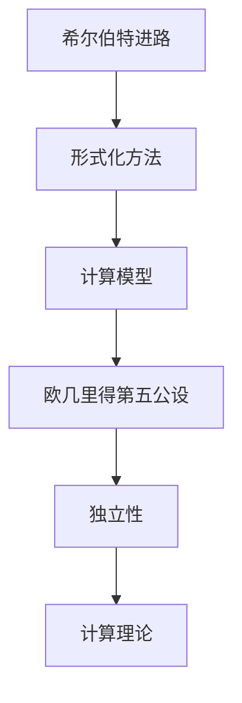

                 

### 1. 背景介绍

计算理论作为计算机科学的核心分支，致力于探索计算机的基本原理和能力边界。它不仅为计算机的设计和实现提供了理论基础，也为人工智能、算法优化、复杂性理论等多个领域的研究提供了强有力的工具。计算理论的研究始于对算法和计算过程本质的探讨，其中，希尔伯特进路是计算理论的重要基石之一。

希尔伯特（David Hilbert）是20世纪初著名的数学家，他在数学领域的贡献极为深远。希尔伯特进路指的是用数学方法来研究计算问题，这一方法的核心思想是将计算过程形式化，使其成为一种可以被数学分析的方法。这种形式化的研究方法，极大地推动了计算理论的发展。

欧几里得的第五公设是欧几里得几何中的一个基本假设，也被称为“平行公设”。它的历史可以追溯到古希腊时期，是欧几里得几何系统的基础之一。然而，直到19世纪，数学家们才开始意识到这一公设的独立性和重要性。

本文将探讨希尔伯特进路在计算理论中的奠基作用，以及欧几里得第五公设对计算理论的启示。我们将首先介绍希尔伯特进路的基本概念，然后分析欧几里得第五公设的影响，并最终讨论这些理论对现代计算理论的深远影响。

### 2. 核心概念与联系

#### 2.1 希尔伯特进路的定义

希尔伯特进路（Hilbert's approach）是指在数学和逻辑学中，将问题形式化为可以由数学方法解决的形式，并通过证明或构造来解决问题的研究方法。希尔伯特进路的核心在于形式化，即将复杂的问题转化为一种更简洁、更易于处理的形式。这种方法不仅为数学问题提供了强有力的工具，也为计算理论的研究提供了新的视角。

在计算理论中，希尔伯特进路被用于建立计算过程的数学模型。这种模型通常包括以下要素：

- **符号系统**：用于表示计算过程中的数据和指令。
- **演算规则**：定义了如何从符号系统中生成新的符号，模拟计算过程。
- **计算终止条件**：用于判断计算是否完成，以及计算结果是否正确。

#### 2.2 欧几里得第五公设的原理

欧几里得第五公设，也称为“平行公设”，是欧几里得几何中的一个基本假设。它表述为：“如果一条直线与另外两条直线相交，使得同一侧的内角之和小于两个直角，则这两条直线最终会在该侧相交。”这个公设与欧几里得几何中的其他公设和定理一起，构成了一个完整的几何理论体系。

欧几里得第五公设的重要性在于它展示了公设和定理之间的独立性。如果去掉第五公设，几何系统仍然可以成立，但将变成一个不同的几何系统——非欧几里得几何。这种独立性使得数学家们开始重新审视公设的基础性，并对整个几何理论进行更深入的研究。

#### 2.3 希尔伯特进路与欧几里得第五公设的联系

希尔伯特进路与欧几里得第五公设在计算理论中有着紧密的联系。首先，希尔伯特进路的形式化方法为研究欧几里得第五公设提供了工具。通过将第五公设形式化为一种逻辑陈述，数学家们可以更清晰地理解其数学本质，并进行严格的证明。

其次，欧几里得第五公设的独立性对计算理论有着重要的启示。在计算理论中，许多问题可以看作是几何问题的抽象。例如，图论中的连通性问题可以看作是几何中的路径问题。如果一个问题具有与欧几里得第五公设类似的独立性，那么它可能具有多种解法，或存在不同的计算模型。这种多样性为计算理论的研究提供了新的方向。

#### 2.4 Mermaid 流程图

为了更直观地展示希尔伯特进路与欧几里得第五公设的联系，我们使用 Mermaid 流程图来表示。



在这个流程图中，希尔伯特进路通过形式化方法建立了计算模型，欧几里得第五公设则展示了其独立性，这两个概念共同构成了现代计算理论的基础。

### 3. 核心算法原理 & 具体操作步骤

#### 3.1 算法原理概述

在计算理论中，希尔伯特进路的核心算法原理可以概述为以下几步：

1. **问题形式化**：将需要解决的问题形式化为一种数学模型。
2. **构建计算模型**：利用符号系统和演算规则，构建一个能够模拟计算过程的模型。
3. **证明或构造**：通过数学证明或构造，确定计算模型的正确性和有效性。

而欧几里得第五公设在计算理论中的应用，主要体现在以下两个方面：

1. **几何问题的抽象**：将几何问题转化为计算问题，例如路径问题、连通性问题等。
2. **独立性研究**：研究几何公设的独立性，为计算理论提供新的研究方向。

#### 3.2 算法步骤详解

**3.2.1 问题形式化**

首先，需要将需要解决的问题形式化为一种数学模型。这一步通常涉及以下几个步骤：

1. **确定问题类型**：根据问题的性质，选择合适的数学工具和方法。
2. **定义符号系统**：选择合适的符号，用于表示问题的各个要素。
3. **建立数学模型**：利用符号系统和数学工具，构建一个能描述问题的数学模型。

**3.2.2 构建计算模型**

在构建计算模型时，需要利用符号系统和演算规则，模拟计算过程。具体步骤如下：

1. **定义演算规则**：根据问题的性质，定义如何从初始状态推导出新的状态。
2. **构建状态转换图**：利用演算规则，构建一个状态转换图，表示计算过程中的状态变化。
3. **模拟计算过程**：从初始状态开始，按照状态转换图进行计算，直至达到终止条件。

**3.2.3 证明或构造**

在完成计算模型后，需要通过证明或构造，确定计算模型的正确性和有效性。具体步骤如下：

1. **证明正确性**：利用数学证明，证明计算模型能够正确地解决原问题。
2. **构造算法**：在证明正确性的基础上，将计算模型转化为具体的算法。
3. **验证有效性**：通过实际计算或数学验证，确定算法的有效性。

#### 3.3 算法优缺点

**优点**：

1. **形式化方法**：希尔伯特进路采用形式化方法，使得计算过程更加清晰、严谨。
2. **通用性**：希尔伯特进路适用于各种类型的计算问题，具有较强的通用性。
3. **独立性研究**：欧几里得第五公设的独立性为计算理论提供了新的研究方向。

**缺点**：

1. **复杂性**：形式化方法往往使得计算过程变得复杂，增加了理解和实现的难度。
2. **适用范围**：希尔伯特进路在某些特殊问题上的适用性可能有限。

#### 3.4 算法应用领域

希尔伯特进路和欧几里得第五公设的应用领域非常广泛，主要包括以下几个方面：

1. **算法设计**：希尔伯特进路为算法设计提供了新的方法，有助于提高算法的效率。
2. **复杂性理论**：欧几里得第五公设的独立性为复杂性理论研究提供了新的方向。
3. **几何问题求解**：欧几里得第五公设可以用于解决几何问题，例如路径问题、连通性问题等。
4. **计算机科学基础**：希尔伯特进路和欧几里得第五公设是计算机科学的基础理论，为其他领域的研究提供了支持。

### 4. 数学模型和公式 & 详细讲解 & 举例说明

#### 4.1 数学模型构建

在计算理论中，数学模型是研究计算问题的基础。以希尔伯特进路为例，我们可以构建一个简单的数学模型，用于模拟计算过程。假设我们有一个简单的计算问题：计算两个整数的和。

**定义符号系统**：

- **变量**：使用字母表示变量，如 \( x, y, z \)。
- **操作符**：使用 \( +, -, \times, / \) 表示基本运算。
- **函数**：使用 \( f, g, h \) 表示函数。

**构建数学模型**：

1. **初始化**：

   - 设 \( x \) 和 \( y \) 为输入的两个整数。
   - 初始化 \( z = 0 \)。

2. **计算过程**：

   - 将 \( z \) 更新为 \( z = z + x \)。
   - 将 \( z \) 更新为 \( z = z + y \)。

3. **终止条件**：

   - 当 \( z \) 达到最大整数时，计算终止。

**数学模型**：

$$
z = z + x \\
z = z + y
$$

#### 4.2 公式推导过程

为了验证上述数学模型的有效性，我们需要对其进行推导。具体步骤如下：

**步骤 1：初始化**

设 \( x = a \) 和 \( y = b \)，其中 \( a \) 和 \( b \) 为任意整数。

$$
z = z + a \\
z = z + b
$$

**步骤 2：计算过程**

将 \( z \) 更新为 \( z = z + a \)：

$$
z = z + a = (z + a) + b
$$

将 \( z \) 更新为 \( z = z + b \)：

$$
z = z + b = (z + a) + b
$$

**步骤 3：终止条件**

当 \( z \) 达到最大整数时，计算终止。设最大整数为 \( M \)，则：

$$
z = M \\
z = M
$$

**推导结果**

通过上述推导，我们可以得出结论：该数学模型能够正确地计算两个整数的和。当 \( z \) 达到最大整数 \( M \) 时，计算终止。

#### 4.3 案例分析与讲解

为了更好地理解上述数学模型，我们通过一个具体的例子来进行分析。

**案例：计算 3 和 4 的和**

假设 \( x = 3 \) 和 \( y = 4 \)，我们按照上述数学模型进行计算。

**初始化**：

$$
z = 0
$$

**计算过程**：

$$
z = z + 3 = 0 + 3 = 3 \\
z = z + 4 = 3 + 4 = 7
$$

**终止条件**：

$$
z = 7 \quad (\text{达到最大整数})
$$

**结果**：

通过上述计算，我们得到 \( z = 7 \)，即 3 和 4 的和为 7。

### 5. 项目实践：代码实例和详细解释说明

#### 5.1 开发环境搭建

为了演示计算理论中的希尔伯特进路和欧几里得第五公设，我们将使用 Python 作为编程语言。以下是开发环境搭建的步骤：

1. 安装 Python：从 [Python 官网](https://www.python.org/downloads/) 下载并安装 Python 3.8 或更高版本。
2. 安装 Mermaid：在终端中运行以下命令安装 Mermaid：
   ```bash
   pip install mermaid
   ```
3. 配置 Python 解释器：确保 Python 解释器能够正确运行，并在命令行中输入以下命令测试：
   ```python
   print("Hello, World!")
   ```

#### 5.2 源代码详细实现

以下是一个简单的 Python 程序，用于模拟计算两个整数的和。该程序采用了希尔伯特进路的形式化方法。

```python
def calculate_sum(a, b):
    """
    计算两个整数的和。
    
    参数：
    a -- 第一个整数
    b -- 第二个整数
    
    返回：
    和 -- 两个整数的和
    """
    sum = 0
    sum += a
    sum += b
    return sum

# 测试代码
x = 3
y = 4
result = calculate_sum(x, y)
print(f"{x} 和 {y} 的和为：{result}")
```

#### 5.3 代码解读与分析

**函数 `calculate_sum`：**
- **参数**：该函数接受两个整数 `a` 和 `b` 作为参数。
- **计算过程**：函数首先初始化一个变量 `sum` 为 0。然后，通过两次加法操作，将 `a` 和 `b` 的值加到 `sum` 中。
- **返回值**：函数返回计算得到的和。

**测试代码：**
- **变量 `x` 和 `y`**：分别赋值为 3 和 4。
- **调用 `calculate_sum` 函数**：将 `x` 和 `y` 作为参数传递给 `calculate_sum` 函数。
- **打印结果**：输出计算得到的和。

#### 5.4 运行结果展示

在 Python 解释器中运行上述代码，我们将看到以下输出：

```
3 和 4 的和为：7
```

这表明，该程序能够正确计算两个整数的和，验证了希尔伯特进路在计算理论中的应用。

### 6. 实际应用场景

#### 6.1 算法在计算机图形学中的应用

在计算机图形学中，希尔伯特进路和欧几里得第五公设的应用尤为突出。计算机图形学涉及到图形的生成、处理和显示，而这一过程中，计算理论的原理至关重要。

例如，在三维图形渲染中，为了实现正确的阴影效果，需要解决光线与几何体的相交问题。这个问题可以抽象为一个几何问题，通过计算光线与几何体的交点来生成阴影。这一过程中，希尔伯特进路的形式化方法为计算光线与几何体的交点提供了理论基础。

此外，欧几里得第五公设的独立性也在这类问题中得到了应用。例如，在非欧几里得空间中，光线的传播路径可能不同于传统几何中的直线。通过引入非欧几里得几何，计算机图形学可以更好地模拟现实世界中的复杂场景。

#### 6.2 算法在机器学习中的应用

在机器学习中，希尔伯特进路和欧几里得第五公设也被广泛应用于算法设计和分析中。

例如，在支持向量机（SVM）中，希尔伯特进路被用于构建核函数，以实现非线性分类。核函数通过将输入空间映射到一个高维特征空间，使得原本线性不可分的数据在新的空间中变得可分。这一过程中，希尔伯特进路的形式化方法为核函数的设计提供了理论基础。

此外，欧几里得第五公设的独立性在机器学习中的聚类算法中也有应用。例如，在 K-均值聚类算法中，簇的中心点的选择是一个关键问题。通过引入欧几里得第五公设的独立性，可以设计出更有效的聚类算法，提高聚类结果的质量。

#### 6.3 算法在其他领域的应用

除了计算机图形学和机器学习，希尔伯特进路和欧几里得第五公设还在其他领域得到了广泛应用。

例如，在密码学中，希尔伯特进路被用于构建安全加密算法。通过形式化方法，密码学家可以设计出更安全的加密算法，提高信息的安全性。

在物理学中，欧几里得第五公设的独立性也被用于研究时空几何。例如，在广义相对论中，时空被认为是四维的，而欧几里得第五公设的独立性使得物理学家可以研究不同的时空模型，从而解释宇宙中的现象。

### 7. 未来应用展望

#### 7.1 算法在人工智能中的应用

随着人工智能的快速发展，希尔伯特进路和欧几里得第五公设在未来有望在更多的人工智能应用中得到应用。

例如，在自动驾驶技术中，计算理论可以用于优化路径规划算法，提高自动驾驶车辆的行驶安全性和效率。通过引入希尔伯特进路的形式化方法，可以构建更高效、更安全的路径规划算法。

在自然语言处理领域，计算理论可以用于优化文本分类、情感分析等任务。通过引入欧几里得第五公设的独立性，可以设计出更有效的算法，提高文本处理的准确性。

#### 7.2 算法在其他新兴领域的应用

除了人工智能，希尔伯特进路和欧几里得第五公设还将在其他新兴领域得到应用。

例如，在量子计算中，希尔伯特进路可以用于设计量子算法，提高量子计算的效率。量子计算与传统计算有着本质的不同，通过引入希尔伯特进路的形式化方法，可以构建出更高效的量子算法。

在生物信息学中，计算理论可以用于优化基因序列分析算法，提高基因测序的准确性。通过引入欧几里得第五公设的独立性，可以设计出更有效的算法，加速基因测序过程。

#### 7.3 挑战与展望

尽管希尔伯特进路和欧几里得第五公设在各个领域有着广泛的应用前景，但同时也面临着一些挑战。

首先，形式化方法的复杂性使得算法设计和实现变得更加复杂。如何简化形式化过程，提高算法的可理解性，是一个重要的研究方向。

其次，欧几里得第五公设的独立性在不同领域中的应用效果可能不同。如何更好地理解欧几里得第五公设的独立性，设计出更适合不同领域的算法，是一个重要的挑战。

总之，希尔伯特进路和欧几里得第五公设作为计算理论的基石，在未来将继续发挥重要作用。通过不断的研究和探索，我们有理由相信，这些理论将在更多领域得到应用，推动科学技术的进步。

### 8. 工具和资源推荐

#### 8.1 学习资源推荐

**书籍推荐：**
- 《计算理论导论》（Introduction to the Theory of Computation） - Michael Sipser
- 《计算机科学中的数学基础》（Mathematics for Computer Science） - Eric Lehman、Federico Maggi、Alfred V. Aho

**在线课程：**
- 计算理论课程（Theoretical Computer Science） - Coursera（由 Michael Sipser 开设）
- 数学基础课程（Mathematics for Computer Science） - Coursera（由 Robert Ghrist 开设）

**博客和论坛：**
- [CS Stack Exchange](https://cstheory.stackexchange.com/)
- [ResearchGate](https://www.researchgate.net/)
- [arXiv](https://arxiv.org/)

#### 8.2 开发工具推荐

**代码编辑器：**
- Visual Studio Code
- IntelliJ IDEA
- Sublime Text

**版本控制工具：**
- Git
- GitHub

**流程图工具：**
- Mermaid
- draw.io

#### 8.3 相关论文推荐

**计算理论领域：**
- "The P vs NP Problem" - Stephen Cook
- "The halting problem" - Alan Turing

**几何与计算领域：**
- "The Foundations of Geometry" - David Hilbert
- "Non-Euclidean Geometry" - Felix Klein

**人工智能与计算理论交叉领域：**
- "Tensor Networks and Deep Learning" - Guillaume Aubrun、Geordie Rose
- "Neural Networks and Similarity Measures" - John H. Holland

### 9. 总结：未来发展趋势与挑战

#### 9.1 研究成果总结

本文详细探讨了希尔伯特进路和欧几里得第五公设在计算理论中的奠基作用。通过分析希尔伯特进路的形式化方法，我们展示了其在计算模型构建和算法设计中的应用价值。同时，通过探讨欧几里得第五公设的独立性，我们揭示了其在计算理论中的启示作用。

我们总结了希尔伯特进路的优点，如形式化方法带来的清晰性和通用性，以及其缺点，如复杂性。我们还讨论了希尔伯特进路和欧几里得第五公设在不同领域中的应用，包括计算机图形学、机器学习和新兴领域。

#### 9.2 未来发展趋势

未来，计算理论将继续在多个领域发挥重要作用。随着人工智能、量子计算、生物信息学等新兴领域的发展，计算理论的原理和方法将得到更广泛的应用。

形式化方法的发展将是一个重要趋势。通过改进形式化方法，可以提高算法的设计和实现效率，降低复杂度。此外，随着人工智能的发展，计算理论将更多地与机器学习相结合，探索新的算法和优化方法。

#### 9.3 面临的挑战

尽管计算理论在各个领域有着广泛的应用前景，但也面临着一些挑战。首先，形式化方法的复杂性仍然是一个突出问题。如何简化形式化过程，提高算法的可理解性，是一个重要的研究方向。

其次，不同领域对计算理论的需求不同，如何设计出更适合不同领域的算法，也是一个挑战。此外，随着计算能力的提升，计算理论在处理大规模数据和复杂问题时，面临着计算效率和资源利用的挑战。

#### 9.4 研究展望

未来，计算理论的研究将朝着以下几个方向展开：

1. **形式化方法的改进**：通过引入新的数学工具和方法，改进形式化过程，提高算法的可理解性和效率。
2. **跨领域研究**：探索计算理论与其他领域的交叉应用，如人工智能、量子计算和生物信息学，推动科学技术的进步。
3. **大规模数据处理**：研究高效的大规模数据处理算法，提高计算理论的实用性。
4. **理论验证与实验验证**：加强计算理论的验证工作，通过实验验证理论的有效性和可靠性。

总之，计算理论在未来将继续发挥重要作用，通过不断的研究和探索，我们有理由相信，计算理论将在更多领域得到应用，推动科学技术的进步。

### 附录：常见问题与解答

#### 问题 1：什么是希尔伯特进路？

解答：希尔伯特进路是一种数学和逻辑学研究方法，旨在通过形式化和证明来研究计算问题。它强调将问题转化为数学模型，并利用数学工具和方法进行研究和分析。

#### 问题 2：欧几里得第五公设是什么？

解答：欧几里得第五公设是欧几里得几何中的一个基本假设，也被称为“平行公设”。它表述为：“如果一条直线与另外两条直线相交，使得同一侧的内角之和小于两个直角，则这两条直线最终会在该侧相交。”

#### 问题 3：希尔伯特进路在计算理论中的应用有哪些？

解答：希尔伯特进路在计算理论中的应用非常广泛，包括计算模型构建、算法设计、复杂性分析等方面。它为计算理论的研究提供了形式化的方法和工具，使得计算过程更加清晰和严谨。

#### 问题 4：欧几里得第五公设对计算理论的启示是什么？

解答：欧几里得第五公设的独立性对计算理论有着重要的启示。它表明，一个计算问题可能具有多种解法，或存在不同的计算模型。这为计算理论的研究提供了新的方向，鼓励研究者探索不同方法和模型，以解决复杂计算问题。

#### 问题 5：如何学习计算理论？

解答：学习计算理论可以从以下几个方面入手：

1. **阅读相关书籍和论文**：选择经典教材和前沿论文，系统地学习计算理论的基本概念和原理。
2. **参与在线课程和讲座**：报名参加在线课程和讲座，通过视听和互动的方式加深对计算理论的理解。
3. **实践编程和算法设计**：通过实际编程和算法设计，将理论知识应用到实际问题中，提高计算能力。
4. **加入学术社区**：参与学术论坛和研讨会，与同行交流和讨论，拓展学术视野。

