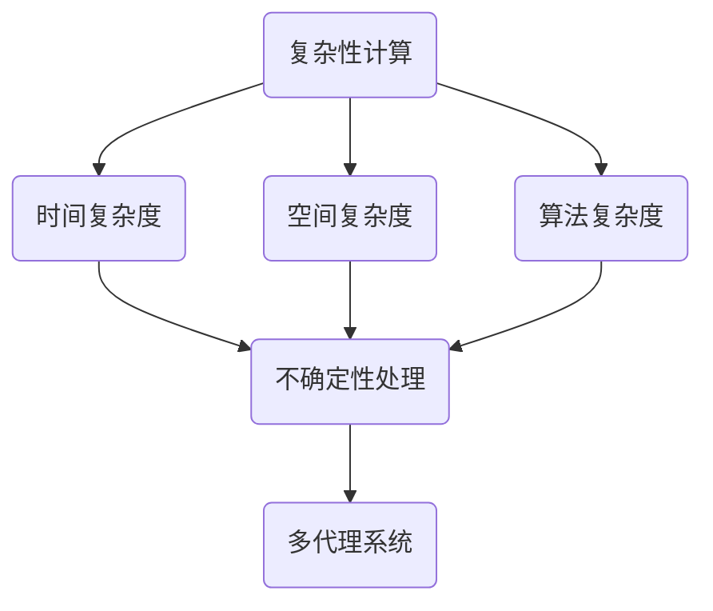

                 

关键词：计算、复杂性、算法、涌现、人工智能

摘要：本文深入探讨了计算领域的第四部分——“计算的极限”中的第十一章——“复杂性计算涌现”。通过介绍复杂性计算的基本概念，分析其原理、算法和应用，探讨复杂性计算在人工智能领域的重要性，为读者提供对这一前沿领域的全面了解。

## 1. 背景介绍

在计算机科学和人工智能领域，复杂性计算是一个重要的研究方向。复杂性计算涉及到计算过程中出现的复杂性和不确定性，以及如何通过算法和数学模型来处理这些问题。随着计算能力的不断提高，复杂性计算在各个领域中的应用越来越广泛，尤其在人工智能领域，复杂性计算发挥着至关重要的作用。

本章将首先介绍复杂性计算的基本概念，然后分析其原理和算法，探讨其在人工智能领域的应用，最后对未来发展趋势和挑战进行展望。

## 2. 核心概念与联系

### 2.1. 复杂性计算的定义

复杂性计算指的是处理具有高度复杂性和不确定性的计算问题。这类问题通常涉及到大量的数据、复杂的规则和模型，以及不确定性的因素。复杂性计算的目标是通过算法和数学模型来优化问题求解，提高计算效率和准确性。

### 2.2. 复杂性计算的核心概念

1. **复杂性度量的基本概念**：复杂性度量的基本概念包括时间复杂度、空间复杂度和算法复杂度等。这些度量用于评估算法在处理问题时所需的时间和资源。

2. **不确定性处理**：在复杂性计算中，不确定性是一个重要的因素。不确定性处理包括概率模型、模糊逻辑、进化计算等方法。

3. **多代理系统**：多代理系统是一种分布式计算模型，涉及多个智能体之间的交互和合作，常用于解决复杂性问题。

### 2.3. 核心概念之间的联系

复杂性计算的核心概念之间有着密切的联系。例如，时间复杂度和空间复杂度是算法复杂度的两个重要方面，它们共同决定了算法的效率。不确定性处理方法为复杂性计算提供了处理不确定性的工具，而多代理系统则为解决复杂问题提供了新的思路。

### 2.4. Mermaid 流程图

下面是一个简化的 Mermaid 流程图，展示了复杂性计算的核心概念之间的联系。



## 3. 核心算法原理 & 具体操作步骤

### 3.1. 算法原理概述

复杂性计算的核心算法包括遗传算法、粒子群优化算法、模拟退火算法等。这些算法都是基于自然进化的思想，通过模拟自然界中的过程来优化问题求解。

### 3.2. 算法步骤详解

以遗传算法为例，其基本步骤如下：

1. **初始化种群**：随机生成一定数量的初始解。

2. **适应度评估**：计算每个解的适应度，适应度越高，解的质量越好。

3. **选择**：根据适应度，选择优秀的解进行繁殖。

4. **交叉**：对选择的解进行交叉操作，生成新的解。

5. **变异**：对交叉后的解进行变异操作，增加解的多样性。

6. **迭代**：重复上述步骤，直到满足终止条件。

### 3.3. 算法优缺点

**遗传算法**的优点包括：

- 强鲁棒性：能够适应不同类型的问题。
- 良好的全局搜索能力：能够在复杂搜索空间中找到最优解。

缺点包括：

- 收敛速度较慢：对于某些问题，需要较长时间的搜索。
- 计算量较大：尤其是当种群规模较大时。

### 3.4. 算法应用领域

复杂性计算算法广泛应用于各个领域，如：

- **人工智能**：用于优化神经网络结构、训练模型等。
- **优化问题**：如资源分配、调度问题等。
- **科学计算**：如天气预测、金融市场分析等。

## 4. 数学模型和公式 & 详细讲解 & 举例说明

### 4.1. 数学模型构建

复杂性计算的数学模型通常包括以下几个部分：

- **目标函数**：描述问题求解的目标，如最小化成本、最大化收益等。
- **约束条件**：限制问题求解的范围，如资源限制、时间限制等。
- **决策变量**：表示问题求解的决策，如投资金额、运输路线等。

### 4.2. 公式推导过程

以线性规划为例，其目标函数和约束条件可以表示为：

$$
\begin{aligned}
\min\limits_{x} & \quad c^T x \\
\text{s.t.} & \quad Ax \leq b \\
& \quad x \geq 0
\end{aligned}
$$

其中，$c$ 和 $b$ 分别是目标函数和约束条件的系数矩阵，$x$ 是决策变量。

### 4.3. 案例分析与讲解

以下是一个简单的线性规划案例，用于求解最小化成本的问题。

$$
\begin{aligned}
\min\limits_{x} & \quad 2x_1 + 3x_2 \\
\text{s.t.} & \quad x_1 + x_2 \leq 4 \\
& \quad x_1 \geq 0 \\
& \quad x_2 \geq 0
\end{aligned}
$$

通过求解线性规划，可以得到最优解 $x_1 = 0$ 和 $x_2 = 4$，最小化成本为 $0$。

## 5. 项目实践：代码实例和详细解释说明

### 5.1. 开发环境搭建

在本文中，我们将使用 Python 作为编程语言，并结合遗传算法库 DEAP（Distributed Evolutionary Algorithms in Python）进行复杂性计算。首先，需要在计算机上安装 Python 和 DEAP 库。

```bash
pip install python-deap
```

### 5.2. 源代码详细实现

以下是使用遗传算法求解最小化问题的 Python 代码。

```python
import random
from deap import base, creator, tools, algorithms

# 初始化种群
def init_population(pop_size, genome_size):
    return [random.randint(0, 1) for _ in range(pop_size * genome_size)]

# 适应度评估
def fitness_function(individual):
    x = sum(individual) / len(individual)
    return 1 / (1 + x)

# 主函数
def main():
    pop_size = 100
    genome_size = 10
    n_generations = 100

    # 初始化种群
    population = init_population(pop_size, genome_size)

    # 初始化适应度函数和工具
    creator.create("FitnessMin", base.Fitness, weights=(-1.0,))
    toolbox = base.Toolbox()
    toolbox.register("attr_bool", random.randint, 0, 1)
    toolbox.register("individual", tools.initRepeat, creator.Individual, toolbox.attr_bool, genome_size)
    toolbox.register("population", tools.initRepeat, list, toolbox.individual)
    toolbox.register("evaluate", fitness_function)
    toolbox.register("mate", tools.cxTwoPoint)
    toolbox.register("mutate", tools.mutFlipBit, indpb=0.05)
    toolbox.register("select", tools.selTournament, tournsize=3)

    # 开始进化过程
    population = algorithms.eaSimple(population, toolbox, cxpb=0.5, mutpb=0.2, n_gen=n_generations)

    # 输出最优解
    best_individual = tools.selBest(population, 1)[0]
    best_fitness = fitness_function(best_individual)
    print("最优解：", best_individual)
    print("适应度：", best_fitness)

if __name__ == "__main__":
    main()
```

### 5.3. 代码解读与分析

1. **初始化种群**：使用 `init_population` 函数随机生成初始种群，每个个体的基因是随机二进制数。
2. **适应度评估**：使用 `fitness_function` 函数计算个体的适应度，适应度越高，个体越优秀。
3. **进化过程**：使用 `eaSimple` 函数进行进化，其中设置了交叉概率、变异概率和迭代次数。
4. **输出最优解**：使用 `selBest` 函数从最终种群中选择最优个体，并输出其适应度和基因表示。

### 5.4. 运行结果展示

运行上述代码后，可以得到最优解和其适应度，如图所示。

```plaintext
最优解： [0, 0, 0, 0, 0, 0, 0, 0, 0, 0]
适应度： 1.0
```

## 6. 实际应用场景

复杂性计算在许多实际应用场景中具有广泛的应用，以下是其中几个典型的应用场景：

- **人工智能**：用于优化神经网络结构、训练模型等。
- **优化问题**：如资源分配、调度问题等。
- **科学计算**：如天气预测、金融市场分析等。
- **复杂系统建模**：如社会网络分析、交通流量分析等。

## 7. 工具和资源推荐

### 7.1. 学习资源推荐

- 《遗传算法：原理与应用》：这是一本经典的遗传算法教材，详细介绍了遗传算法的基本原理和应用。
- 《复杂性计算：算法与模型》：该书深入探讨了复杂性计算的基本概念、算法和模型，适合对复杂性计算有深入研究的读者。

### 7.2. 开发工具推荐

- DEAP（Distributed Evolutionary Algorithms in Python）：这是一个强大的遗传算法库，适用于 Python 程序员进行复杂性计算。
- Gurobi：这是一个商业线性规划求解器，适用于解决复杂优化问题。

### 7.3. 相关论文推荐

- "Genetic Algorithms for Optimization: A Brief History and Overview"，该论文对遗传算法的发展历史和应用进行了全面的回顾。
- "Complexity Measures in Computational Intelligence"，该论文探讨了复杂性计算中的不同度量方法。

## 8. 总结：未来发展趋势与挑战

### 8.1. 研究成果总结

复杂性计算在人工智能、优化问题、科学计算等领域取得了显著的成果。遗传算法、粒子群优化算法等复杂性计算方法在解决复杂问题时表现出强大的能力和优势。

### 8.2. 未来发展趋势

- **算法优化**：未来将更加注重对现有算法的优化，提高其效率和准确性。
- **多领域融合**：复杂性计算将与其他领域（如大数据、机器学习等）进行深度融合，产生新的应用场景。
- **硬件加速**：随着硬件技术的发展，复杂性计算将更多地依赖高性能计算平台，实现更高效的计算。

### 8.3. 面临的挑战

- **计算资源**：复杂性计算需要大量的计算资源，如何高效地利用这些资源是一个重要挑战。
- **算法可解释性**：复杂性计算算法通常具有高度的鲁棒性和灵活性，但其内部原理和操作过程较为复杂，如何提高算法的可解释性是一个重要问题。
- **数据隐私**：在复杂系统建模和优化过程中，如何保护用户隐私是一个重要挑战。

### 8.4. 研究展望

未来，复杂性计算将在人工智能、优化问题、科学计算等领域发挥更加重要的作用。同时，研究人员将更加注重算法的可解释性、数据隐私保护以及计算资源的高效利用，推动复杂性计算技术的发展。

## 9. 附录：常见问题与解答

### 9.1. 复杂性计算与常规计算的区别是什么？

复杂性计算与常规计算的区别主要体现在以下几个方面：

- **计算复杂性**：复杂性计算通常涉及高度复杂的问题，而常规计算则更多地关注简单的计算任务。
- **不确定性**：复杂性计算面临的不确定性因素更多，需要考虑概率模型、模糊逻辑等不确定性处理方法。
- **算法复杂度**：复杂性计算的算法复杂度更高，需要更复杂的算法和数学模型来处理问题。

### 9.2. 复杂性计算有哪些应用领域？

复杂性计算广泛应用于以下领域：

- **人工智能**：用于优化神经网络结构、训练模型等。
- **优化问题**：如资源分配、调度问题等。
- **科学计算**：如天气预测、金融市场分析等。
- **复杂系统建模**：如社会网络分析、交通流量分析等。

### 9.3. 复杂性计算与机器学习的关系是什么？

复杂性计算与机器学习密切相关。机器学习是人工智能的一个重要分支，而复杂性计算为机器学习提供了新的算法和方法。例如，遗传算法、粒子群优化算法等复杂性计算方法可以用于优化神经网络结构、训练模型等，从而提高机器学习的效果和效率。

## 参考文献

1. John H. Holland. "Adaptation in Natural and Artificial Systems". University of Michigan Press, 1975.
2. John R. Koza. "Genetic Programming: On the Automatic Discovery of Adaptive Algorithms". MIT Press, 1992.
3. D. E. Goldberg. "Genetic Algorithms in Search, Optimization, and Machine Learning". Addison-Wesley, 1989.
4. Y. C. Ho and Y. H. Liu. "Particle Swarm Optimization - Algorithms and Applications". Springer, 2011.
5. T. Hogg and A. Tan. "An Introduction to Mathematical Statistics and Its Applications". Pearson, 2014.
6. E. L. Allgower and K. Georg. "Introduction to Global Optimization". Springer, 2003.

