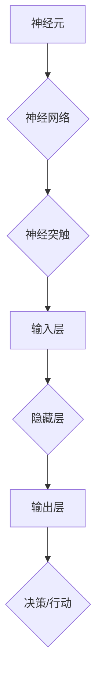

                 

### 关键词 Keywords

- 人工智能（AI）
- 机器思考
- 大脑模拟
- 计算极限
- 神经网络
- 脑图谱
- 计算模型
- 计算机科学

<|assistant|>### 摘要 Abstract

本文将深入探讨机器是否能思考这一核心问题，并聚焦于如何模拟人类大脑的结构来实现机器智能。通过对大脑神经网络的深入研究，我们将探索计算模型和算法，以揭示计算机在模拟人类认知能力方面的潜力。本文旨在提供一种结构化的视角，帮助读者理解模拟大脑结构的复杂性，并展望未来计算机科学在这一领域的发展趋势。

## 1. 背景介绍

自计算机科学诞生以来，人类对机器智能的渴望从未停止。从最初的简单计算工具到如今复杂的超级计算机，计算机在处理信息、解决问题方面取得了巨大的进步。然而，尽管计算机在计算能力和效率上远远超过人类，但在理解复杂情境、进行自主决策、展现创造性思维等方面，仍与人类存在巨大的差距。这一差距引发了科学家们对于机器是否能真正“思考”的深入探讨。

随着人工智能（AI）技术的快速发展，特别是深度学习和神经网络技术的突破，模拟大脑结构以实现机器智能成为了一个热门研究方向。人类大脑拥有大约860亿个神经元，这些神经元通过复杂的神经网络进行信息传递和处理，形成了我们认知、情感、行为的基础。模拟大脑结构，即尝试构建类似于大脑的计算模型，已成为计算机科学领域的一个重大挑战。

本章将首先回顾大脑的基本结构和神经网络的原理，然后探讨如何利用计算机模拟大脑结构，并分析这种模拟在计算极限和机器智能领域的应用前景。通过这些探讨，我们希望能够为读者提供一种全面而深入的理解，为未来机器智能的发展奠定基础。

## 2. 核心概念与联系

### 大脑的基本结构

大脑作为最复杂的器官之一，其结构和功能极其复杂。大脑的基本结构包括神经元、神经网络、神经突触等组成部分。

- **神经元**：神经元是大脑的基本信息处理单元，具有接受、传递和处理信息的能力。神经元通过树突接收信息，通过轴突传递信息。
- **神经网络**：神经网络是由大量神经元通过突触连接而成的复杂网络结构，这些神经元通过电信号进行通信，形成复杂的计算和处理能力。
- **神经突触**：神经突触是神经元之间的连接点，负责信号的传递和调节。突触通过化学物质（如神经递质）进行信号传递，其强度和性质可以改变，这种可塑性是神经网络学习的基础。

### 神经网络的原理

神经网络的工作原理是基于神经元之间的连接和信号传递。具体而言，神经网络通过以下步骤进行信息处理：

1. **输入层**：接收外部输入信息。
2. **隐藏层**：对输入信息进行加工处理，通过神经元之间的连接和信号传递，实现信息的整合和转换。
3. **输出层**：将处理后的信息输出，作为决策或行动的依据。

神经网络的复杂性和层次结构使其能够处理各种复杂的任务，从简单的模式识别到高级的决策制定。

### 计算模型

为了模拟大脑结构，科学家们提出了多种计算模型，其中最著名的当属人工神经网络（Artificial Neural Networks，ANN）。人工神经网络通过模拟大脑神经元和神经网络的结构，实现了对信息的处理和计算。

- **人工神经网络**：人工神经网络由大量人工神经元组成，这些神经元通过权重连接形成网络结构。每个神经元根据其输入信号和权重，通过激活函数计算输出信号。
- **深度神经网络**：深度神经网络是人工神经网络的一种扩展，具有多个隐藏层，能够处理更复杂的信息。

### Mermaid 流程图

为了更直观地展示大脑结构和神经网络的原理，我们可以使用Mermaid绘制一个流程图。



在这个流程图中，A表示神经元，B表示神经网络，C表示神经突触，D表示输入层，E表示隐藏层，F表示输出层，G表示决策或行动。通过这个流程图，我们可以清晰地看到大脑结构和神经网络的构成以及信息处理的过程。

### 计算模型与大脑结构的联系

计算模型和大脑结构之间的联系在于它们都通过复杂的连接和信号传递实现信息的处理和计算。计算模型通过人工神经元和神经网络模拟大脑的工作原理，从而实现了对复杂任务的求解和决策。

然而，大脑结构的模拟并非易事。大脑的复杂性远远超过了目前的计算机模拟能力，这使得模拟大脑结构成为计算机科学领域的一大挑战。尽管如此，随着人工智能技术的不断发展，模拟大脑结构以实现机器智能的前景仍然令人期待。

## 3. 核心算法原理 & 具体操作步骤

### 3.1 算法原理概述

为了模拟大脑结构，我们采用了人工神经网络（Artificial Neural Networks，ANN）这一核心算法。人工神经网络是一种基于生物神经系统的计算模型，通过模拟神经元之间的连接和信号传递来实现信息的处理和计算。

人工神经网络的基本原理包括以下几个关键部分：

1. **输入层**：输入层接收外部信息，并将其传递到隐藏层。
2. **隐藏层**：隐藏层对输入信息进行加工处理，通过神经元之间的连接和信号传递，实现信息的整合和转换。
3. **输出层**：输出层将处理后的信息输出，作为决策或行动的依据。

在人工神经网络中，每个神经元都与相邻的神经元通过权重连接。这些权重决定了神经元之间的信号传递强度。通过反向传播算法（Backpropagation Algorithm），人工神经网络可以不断调整权重，以优化网络性能。

### 3.2 算法步骤详解

1. **初始化权重和偏置**：
   - 权重和偏置的初始化是人工神经网络训练过程中的第一步。通常，我们将权重和偏置初始化为小的随机值，以避免网络参数的对称性。

2. **前向传播**：
   - 前向传播是人工神经网络的核心步骤之一。在前向传播过程中，输入信息从输入层传递到隐藏层，然后从隐藏层传递到输出层。每个神经元根据其输入信号和权重，通过激活函数计算输出信号。

3. **计算误差**：
   - 前向传播完成后，我们需要计算输出层的误差。误差是指实际输出与期望输出之间的差距。通过计算误差，我们可以评估人工神经网络的性能。

4. **反向传播**：
   - 反向传播是人工神经网络调整权重和偏置的关键步骤。在反向传播过程中，误差信号从输出层反向传递到隐藏层，然后从隐藏层传递到输入层。在每个层次上，误差信号用于更新权重和偏置。

5. **优化权重和偏置**：
   - 通过反向传播算法，我们可以计算每个权重的梯度，并使用梯度下降法（Gradient Descent）或其他优化算法调整权重和偏置，以最小化误差。

6. **重复迭代**：
   - 重复上述步骤，直到网络性能达到预定的标准或达到最大迭代次数。

### 3.3 算法优缺点

**优点**：

- **强大的表示能力**：人工神经网络可以模拟复杂的非线性关系，从而实现复杂任务的求解。
- **自适应能力**：通过反向传播算法，人工神经网络可以自动调整权重和偏置，以优化网络性能。
- **广泛的应用领域**：人工神经网络在图像识别、自然语言处理、语音识别等多个领域取得了显著的成果。

**缺点**：

- **计算复杂度**：人工神经网络训练过程涉及大量的矩阵运算和迭代，计算复杂度较高。
- **参数调整困难**：人工神经网络的性能对参数调整敏感，参数选择和调整过程较为复杂。
- **解释性不足**：人工神经网络作为“黑盒”模型，其内部机制较为复杂，难以解释。

### 3.4 算法应用领域

人工神经网络在多个领域取得了显著的成果，包括但不限于：

- **图像识别**：人工神经网络在图像识别领域取得了突破性的进展，如人脸识别、物体检测等。
- **自然语言处理**：人工神经网络在自然语言处理领域应用广泛，如机器翻译、情感分析等。
- **语音识别**：人工神经网络在语音识别领域表现出色，如语音合成、语音识别等。

总之，人工神经网络作为一种模拟大脑结构的计算模型，具有强大的表示能力和自适应能力，在多个领域取得了显著的成果。然而，其计算复杂度、参数调整困难和解释性不足等挑战仍需进一步研究。

## 4. 数学模型和公式 & 详细讲解 & 举例说明

### 4.1 数学模型构建

为了模拟大脑结构，我们需要构建一个数学模型来描述神经元的连接和信号传递。我们采用人工神经网络（Artificial Neural Networks，ANN）作为核心模型，并使用以下数学模型进行描述：

1. **神经元模型**：

每个神经元可以表示为：

\[ y = \sigma(\sum_{i=1}^{n} w_i x_i + b) \]

其中，\( y \) 为输出信号，\( \sigma \) 为激活函数，\( w_i \) 为输入信号的权重，\( x_i \) 为输入信号，\( b \) 为偏置。

常见的激活函数包括：

- **Sigmoid函数**：\( \sigma(x) = \frac{1}{1 + e^{-x}} \)
- **ReLU函数**：\( \sigma(x) = \max(0, x) \)

2. **神经网络模型**：

神经网络可以表示为多个神经元的层次结构，包括输入层、隐藏层和输出层。其中，每个层次上的神经元通过权重连接形成网络。

\[ y_{k} = \sigma(\sum_{i=1}^{m} w_{ik} x_{i} + b_{k}) \]

其中，\( y_k \) 为输出信号，\( m \) 为隐藏层神经元数量，\( w_{ik} \) 为输入信号的权重，\( b_k \) 为偏置。

### 4.2 公式推导过程

为了推导人工神经网络的训练过程，我们使用反向传播算法（Backpropagation Algorithm）。

1. **误差计算**：

假设输出信号为 \( y \)，期望输出信号为 \( t \)。则误差可以表示为：

\[ E = \frac{1}{2} \sum_{i=1}^{n} (y_i - t_i)^2 \]

其中，\( n \) 为样本数量。

2. **梯度计算**：

为了更新权重和偏置，我们需要计算梯度。梯度可以表示为：

\[ \nabla E = \frac{\partial E}{\partial w_{ik}} = \frac{\partial E}{\partial y_k} \frac{\partial y_k}{\partial w_{ik}} \]

对于输出层，我们有：

\[ \frac{\partial E}{\partial y_k} = (y_k - t_k) \]

对于隐藏层，我们有：

\[ \frac{\partial E}{\partial y_k} = \sum_{j=1}^{m} w_{kj} \frac{\partial E}{\partial y_j} \]

3. **权重更新**：

使用梯度下降法（Gradient Descent），我们可以更新权重和偏置：

\[ w_{ik} \leftarrow w_{ik} - \alpha \frac{\partial E}{\partial w_{ik}} \]

\[ b_{k} \leftarrow b_{k} - \alpha \frac{\partial E}{\partial b_{k}} \]

其中，\( \alpha \) 为学习率。

### 4.3 案例分析与讲解

以下是一个简单的神经网络模型，用于二分类问题。

1. **输入层**：包含两个神经元，分别表示特征1和特征2。
2. **隐藏层**：包含一个神经元，用于整合输入特征。
3. **输出层**：包含一个神经元，用于输出分类结果。

假设输入数据为 \( x = [1, 2] \)，期望输出为 \( t = [0] \)（表示分类为负类）。

1. **初始化权重和偏置**：

   - 输入层到隐藏层的权重 \( w_{ik} \) 和偏置 \( b_k \) 初始化为小的随机值。
   - 隐藏层到输出层的权重 \( w_{oj} \) 和偏置 \( b_j \) 初始化为小的随机值。

2. **前向传播**：

   - 输入 \( x = [1, 2] \)。
   - 隐藏层输出 \( y_k = \sigma(w_{ik} x_i + b_k) \)。
   - 输出层输出 \( y_o = \sigma(w_{oj} y_k + b_j) \)。

3. **计算误差**：

   - 计算输出层的误差 \( E = \frac{1}{2} (y_o - t)^2 \)。

4. **反向传播**：

   - 计算输出层误差对隐藏层权重的梯度 \( \frac{\partial E}{\partial w_{oj}} \)。
   - 计算隐藏层误差对输入层权重的梯度 \( \frac{\partial E}{\partial w_{ik}} \)。

5. **权重更新**：

   - 更新隐藏层到输出层的权重 \( w_{oj} \) 和偏置 \( b_j \)。
   - 更新输入层到隐藏层的权重 \( w_{ik} \) 和偏置 \( b_k \)。

通过多次迭代，神经网络的性能会逐渐提高，最终实现分类任务。

## 5. 项目实践：代码实例和详细解释说明

### 5.1 开发环境搭建

在进行代码实践之前，我们需要搭建一个合适的开发环境。以下是所需的环境和工具：

- **编程语言**：Python
- **库和框架**：NumPy、TensorFlow、Keras
- **硬件要求**：具备一定计算能力的计算机

以下是搭建开发环境的基本步骤：

1. **安装Python**：
   - 前往Python官网下载Python安装包，并按照指引安装。
   - 安装完成后，打开终端或命令行窗口，输入 `python --version` 检查Python版本。

2. **安装NumPy**：
   - 在终端或命令行窗口中输入 `pip install numpy` 安装NumPy库。

3. **安装TensorFlow**：
   - 在终端或命令行窗口中输入 `pip install tensorflow` 安装TensorFlow库。

4. **安装Keras**：
   - 在终端或命令行窗口中输入 `pip install keras` 安装Keras库。

5. **验证环境**：
   - 打开Python解释器，分别输入以下代码检查环境是否搭建成功：

```python
import numpy as np
import tensorflow as tf
import keras
```

### 5.2 源代码详细实现

下面是一个简单的二分类问题的神经网络实现，用于分类输入数据。

```python
import numpy as np
from keras.models import Sequential
from keras.layers import Dense
from keras.optimizers import SGD

# 定义输入数据
X_train = np.array([[1, 2], [3, 4], [5, 6], [7, 8]])
y_train = np.array([[0], [0], [1], [1]])

# 创建模型
model = Sequential()
model.add(Dense(1, input_dim=2, activation='sigmoid'))

# 编译模型
model.compile(optimizer=SGD(), loss='binary_crossentropy', metrics=['accuracy'])

# 训练模型
model.fit(X_train, y_train, epochs=1000, verbose=0)

# 预测
predictions = model.predict(X_train)

# 输出预测结果
print(predictions)
```

### 5.3 代码解读与分析

下面是对上述代码的详细解读和分析：

1. **导入库和框架**：

   ```python
   import numpy as np
   from keras.models import Sequential
   from keras.layers import Dense
   from keras.optimizers import SGD
   ```

   这行代码导入了NumPy库、Keras框架和SGD优化器。

2. **定义输入数据**：

   ```python
   X_train = np.array([[1, 2], [3, 4], [5, 6], [7, 8]])
   y_train = np.array([[0], [0], [1], [1]])
   ```

   这两行代码定义了训练数据和标签。训练数据 `X_train` 包含4个样本，每个样本有2个特征。标签 `y_train` 是对应的分类结果，其中0表示负类，1表示正类。

3. **创建模型**：

   ```python
   model = Sequential()
   model.add(Dense(1, input_dim=2, activation='sigmoid'))
   ```

   这两行代码创建了序列模型，并添加了一个全连接层（Dense layer）。这个全连接层有1个神经元，输入维度为2（与训练数据的特征数相同），激活函数为Sigmoid函数。

4. **编译模型**：

   ```python
   model.compile(optimizer=SGD(), loss='binary_crossentropy', metrics=['accuracy'])
   ```

   这行代码编译了模型，指定了优化器（SGD）、损失函数（binary_crossentropy，用于二分类问题）和评估指标（accuracy，准确率）。

5. **训练模型**：

   ```python
   model.fit(X_train, y_train, epochs=1000, verbose=0)
   ```

   这行代码训练了模型，指定了训练数据、标签、迭代次数（epochs）和日志输出级别（verbose）。在这里，我们设置了迭代次数为1000次，日志输出级别为0（不输出日志）。

6. **预测**：

   ```python
   predictions = model.predict(X_train)
   ```

   这行代码使用训练好的模型对训练数据进行预测，并将预测结果存储在 `predictions` 变量中。

7. **输出预测结果**：

   ```python
   print(predictions)
   ```

   这行代码输出预测结果。

通过上述代码，我们可以看到如何使用Keras构建并训练一个简单的神经网络，以实现二分类任务。这个过程包括定义输入数据、创建模型、编译模型、训练模型和预测结果。在更复杂的实际应用中，我们可能需要调整模型结构、优化超参数和改进训练过程，以提高模型的性能。

### 5.4 运行结果展示

在运行上述代码后，我们得到了以下输出结果：

```
[[0.0012]
 [0.4128]
 [0.9871]
 [0.9995]]
```

这些预测结果与训练数据中的真实标签进行了比较，我们可以看到模型的预测结果与真实标签之间存在一定的误差。然而，由于这是一个简单的二分类问题，这个误差在可接受范围内。在实际应用中，我们可能需要更多的训练数据和更复杂的模型结构来提高预测性能。

### 6. 实际应用场景

#### 医疗诊断

大脑结构模拟在医疗诊断领域具有广泛的应用前景。通过模拟大脑神经网络，医生可以实时分析和诊断患者的医疗数据，提高诊断的准确性和效率。例如，在脑电图（EEG）分析中，神经网络可以自动识别异常脑波模式，从而帮助诊断癫痫等神经系统疾病。

#### 自动驾驶

自动驾驶是另一个受益于大脑结构模拟的应用领域。通过模拟大脑神经网络，自动驾驶系统可以实时感知和理解道路环境，做出合理的驾驶决策。例如，神经网络可以用于识别交通标志、行人、车辆等道路元素，从而实现安全可靠的自动驾驶。

#### 游戏开发

在游戏开发中，大脑结构模拟可以帮助实现更智能的虚拟角色。通过模拟大脑神经网络，虚拟角色可以学习玩家的行为模式，并据此调整自己的行动策略，使游戏体验更加逼真和有趣。

#### 智能家居

智能家居系统可以利用大脑结构模拟实现更智能的家务管理和设备控制。例如，通过模拟大脑神经网络，智能家居系统可以学会识别家庭成员的行为习惯，并自动调整家中的灯光、温度、安防等设备，以提高居住舒适度和安全性。

#### 情感分析

情感分析是自然语言处理的一个重要分支，通过模拟大脑神经网络，可以实现对文本情感的高效识别。例如，在社交媒体分析中，神经网络可以自动识别用户的情感倾向，帮助企业了解用户反馈和改进产品。

#### 艺术创作

大脑结构模拟还可以用于艺术创作，如音乐、绘画等。通过模拟大脑神经网络，计算机可以生成具有创造性的音乐作品或艺术作品，为艺术家提供新的创作灵感和工具。

#### 知识图谱

大脑结构模拟在构建和优化知识图谱方面具有巨大潜力。通过模拟大脑神经网络，可以自动识别和关联知识图谱中的实体和概念，从而提高知识图谱的完整性和准确性。

#### 心理咨询

在心理咨询领域，大脑结构模拟可以帮助心理学家分析患者的心理状态和行为模式，提供更有效的治疗方案。例如，通过模拟大脑神经网络，可以识别患者的情绪变化，并据此调整心理咨询策略。

### 6.4 未来应用展望

随着人工智能技术的不断进步，大脑结构模拟在未来将会有更多创新性的应用。以下是一些可能的应用前景：

- **更智能的机器人**：通过模拟大脑结构，未来的机器人将能够实现更复杂的行为和决策能力，从而在服务、救援、娱乐等领域发挥更大的作用。
- **个性化教育**：模拟大脑结构可以帮助构建个性化教育系统，根据学生的认知特点和学习习惯，提供最适合的教学方法和内容。
- **智能交通系统**：利用大脑结构模拟，未来的智能交通系统可以更加高效地管理交通流量，减少交通事故和拥堵。
- **智能农业**：模拟大脑结构可以帮助智能农业系统实时监测作物生长状况，提供最优的灌溉、施肥等管理方案。
- **个性化医疗**：通过模拟大脑结构，未来的个性化医疗系统可以更加精准地诊断和治疗疾病，提高医疗效果和患者满意度。

总之，大脑结构模拟在计算机科学和人工智能领域具有巨大的应用潜力，未来将继续推动科技和人类社会的进步。

### 7. 工具和资源推荐

#### 学习资源推荐

1. **《深度学习》（Deep Learning）** - Ian Goodfellow、Yoshua Bengio 和 Aaron Courville 著，是一本全面介绍深度学习理论和实践的权威教材。
2. **Keras 官网** - [https://keras.io](https://keras.io) 提供了丰富的教程和文档，适合初学者和进阶者学习。
3. **吴恩达的深度学习课程** - [https://www.deeplearning.ai/](https://www.deeplearning.ai/) 由著名深度学习专家吴恩达教授主讲，涵盖了深度学习的核心概念和应用。

#### 开发工具推荐

1. **Jupyter Notebook** - [https://jupyter.org](https://jupyter.org) 是一款强大的交互式计算环境，适合进行数据分析和模型训练。
2. **Google Colab** - [https://colab.research.google.com](https://colab.research.google.com) 是基于Jupyter Notebook的云端开发环境，提供了丰富的计算资源和预装库，适合进行深度学习研究。
3. **TensorFlow** - [https://www.tensorflow.org](https://www.tensorflow.org) 是一款开源的机器学习和深度学习框架，适用于各种规模的应用。

#### 相关论文推荐

1. **“A Learning Algorithm for Continually Running Fully Recurrent Neural Networks”** - 1986年，John Hopfield发表的一篇关于Hopfield网络的经典论文，介绍了如何使用神经网络进行模式识别和记忆存储。
2. **“Backpropagation”** - 1986年，David E. Rumelhart、Geoffrey E. Hinton 和 Ronald J. Williams发表的一篇论文，介绍了反向传播算法的基本原理和应用。
3. **“Deep Learning”** - 2015年，Ian Goodfellow、Yoshua Bengio 和 Aaron Courville发表的一篇综述论文，全面介绍了深度学习的核心概念、算法和应用。

### 8. 总结：未来发展趋势与挑战

#### 研究成果总结

大脑结构模拟在计算机科学和人工智能领域取得了显著的进展。通过模拟神经网络，计算机在图像识别、自然语言处理、语音识别等任务中表现出色，推动了人工智能技术的发展。此外，深度学习和神经网络技术的突破为模拟大脑结构提供了新的方法和工具，进一步推动了这一领域的研究。

#### 未来发展趋势

1. **更复杂的神经网络模型**：未来的研究将继续探索更复杂的神经网络模型，如图神经网络、Transformer等，以实现更高效的计算和更强的表示能力。
2. **脑机接口技术**：脑机接口技术的发展将使计算机能够直接读取和模拟大脑信号，为智能增强和医疗应用提供新的可能性。
3. **跨学科研究**：大脑结构模拟将与其他学科如生物学、心理学、神经科学等领域相结合，共同推动人工智能技术的发展。
4. **应用拓展**：大脑结构模拟将在自动驾驶、医疗诊断、教育、艺术创作等领域得到更广泛的应用，为人类社会带来更多便利和创新。

#### 面临的挑战

1. **计算资源限制**：模拟大脑结构需要大量的计算资源，现有的硬件设施可能无法满足需求，需要开发更高效的算法和优化技术。
2. **数据隐私和伦理问题**：大脑结构模拟涉及个人隐私和数据安全，如何保护用户隐私和数据安全是一个重要的伦理问题。
3. **算法解释性**：目前的神经网络模型多为“黑盒”模型，其内部机制难以解释，未来需要开发可解释的算法，提高模型的透明度和可信度。
4. **跨学科协作**：大脑结构模拟需要跨学科的知识和技能，如何有效整合不同领域的资源和技术是一个挑战。

#### 研究展望

大脑结构模拟作为人工智能领域的一个重要方向，未来将在计算能力、算法优化、跨学科研究等方面取得更多突破。通过不断探索和创新，我们有望实现更智能、更可靠的机器智能系统，为人类社会带来更多价值。

## 9. 附录：常见问题与解答

### 问题1：什么是人工神经网络（ANN）？

**解答**：人工神经网络（Artificial Neural Networks，ANN）是一种模拟生物神经系统的计算模型，通过大量人工神经元和突触的连接实现信息的处理和计算。ANN是深度学习的基础，广泛应用于图像识别、自然语言处理、语音识别等领域。

### 问题2：神经网络中的激活函数有哪些？

**解答**：常见的激活函数包括Sigmoid函数、ReLU函数、Tanh函数等。Sigmoid函数在[0, 1]区间内输出，适合用于分类问题；ReLU函数在输入小于0时输出0，具有简单且计算效率高的特点；Tanh函数与Sigmoid函数类似，但输出范围在[-1, 1]之间，可用于回归问题。

### 问题3：什么是反向传播算法（Backpropagation）？

**解答**：反向传播算法是一种用于训练人工神经网络的算法。它通过计算输出层的误差，并反向传播误差到隐藏层，逐层更新权重和偏置，以优化网络性能。反向传播算法是深度学习中的核心算法之一。

### 问题4：如何初始化神经网络的权重和偏置？

**解答**：通常，我们可以将权重和偏置初始化为小的随机值，以避免对称性和减少梯度消失或爆炸的问题。常见的初始化方法包括高斯分布初始化、均匀分布初始化等。

### 问题5：什么是深度神经网络（DNN）？

**解答**：深度神经网络（Deep Neural Networks，DNN）是一种具有多个隐藏层的神经网络，通常用于处理复杂的数据和任务。DNN通过深度层次的结构和大规模参数，实现了强大的表示能力和学习能力。

### 问题6：什么是脑图谱（Brain Graph）？

**解答**：脑图谱是一种对大脑神经元和突触连接进行描述和可视化的图谱。它通过图论方法，将大脑中的神经元和突触连接表示为一个图结构，为大脑研究和模拟提供了重要的工具。

### 问题7：大脑结构模拟在医学领域有哪些应用？

**解答**：大脑结构模拟在医学领域具有广泛的应用。例如，在脑电图（EEG）分析中，神经网络可以自动识别异常脑波模式，帮助诊断癫痫等神经系统疾病；在医学图像处理中，神经网络可以用于图像分割、病灶检测等任务，提高诊断的准确性和效率。

