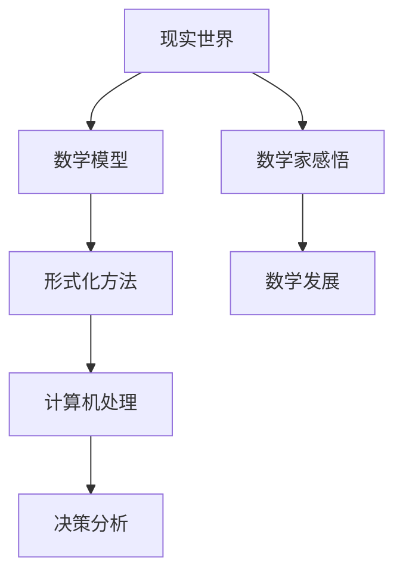

                 

## 1. 背景介绍

在人类认知和探索世界的过程中，数学始终扮演着重要的角色。自古以来，数学不仅是科学研究的工具，更是哲学思考的基石。然而，随着人工智能的迅速发展，我们对数学与现实世界关系有了更为深刻的认识。本文旨在探讨数学在认知形式化中的作用，以及数学作为现实世界主观反映的内在机制。

首先，我们需要明确什么是认知形式化。认知形式化是指将人类思维过程转化为符号化的数学模型，以便于计算机处理和自动化。这种形式化的过程不仅使得复杂问题得以简化，也为人工智能的发展提供了强有力的工具。而在这个过程中，数学起到了不可或缺的作用。数学不仅为认知形式化提供了语言和工具，更在某种程度上揭示了现实世界的本质。

其次，我们需要了解数学与现实世界的联系。现实世界是多元、复杂且不断变化的，而数学则以其精确、简洁和普遍适用性，为我们提供了一种理解和描述现实世界的有效方式。数学模型可以模拟现实世界中的各种现象，如物理现象、社会现象等，从而帮助我们更好地认识和理解世界。然而，这种联系并非单向的，现实世界也在不断地影响和塑造数学的发展。

最后，本文将探讨数学作为现实世界主观反映的内在机制。主观反映意味着数学模型不仅是对现实世界的客观描述，更是在一定程度上反映了人类对现实世界的认知和感悟。这种反映不仅体现在数学公式和定理中，更体现在数学的发展历程中。

## 2. 核心概念与联系

在探讨数学与认知形式化的关系时，我们首先需要明确几个核心概念，包括数学模型、形式化方法、认知心理学等。

### 2.1 数学模型

数学模型是指用数学语言描述现实世界中的某一现象或问题的抽象结构。它通常包括变量、方程、图等组成部分，通过这些组成部分，我们可以对现实世界进行定量分析和预测。数学模型的核心在于其精确性和普遍适用性，这使得数学模型在科学研究、工程设计和决策分析等领域具有广泛的应用。

### 2.2 形式化方法

形式化方法是将人类思维过程转化为符号化的数学模型的过程。这种方法的核心在于将复杂的思维过程抽象为简单的数学表达，从而使得计算机能够理解和处理。形式化方法的应用范围非常广泛，包括计算机科学、逻辑学、哲学等领域。

### 2.3 认知心理学

认知心理学是研究人类认知过程的科学。它关注人类如何获取、处理、存储和使用信息，以及这些过程如何影响我们的思维和行为。认知心理学为认知形式化提供了理论基础，帮助我们理解人类如何通过数学模型来理解和描述现实世界。

### 2.4 数学与现实世界的联系

数学与现实世界的联系可以从多个角度来探讨。首先，数学模型可以模拟现实世界中的各种现象，如物理学中的力学、电磁学，经济学中的市场模型等。这些模型不仅帮助我们更好地理解现实世界，也为科学研究提供了新的方法和工具。

其次，现实世界也在不断地影响和塑造数学的发展。例如，随着计算机科学的兴起，数学开始关注算法的效率和复杂性，从而推动了计算机科学中许多新领域的发展。

最后，数学作为现实世界的主观反映，也体现在数学家们对现实世界的感悟和思考中。许多数学家在研究数学问题时，往往会从现实世界的角度出发，试图发现数学与现实世界的内在联系。

### 2.5 Mermaid 流程图

为了更直观地展示数学与现实世界的联系，我们可以使用 Mermaid 流程图来表示。以下是一个简单的 Mermaid 流程图，展示了数学与现实世界的互动关系：



在这个流程图中，现实世界通过数学模型转化为形式化的数学表达式，然后通过形式化方法进行处理和计算，最终应用于决策分析和数学研究。同时，数学家们的感悟和思考也在不断地影响和推动数学的发展。

## 3. 核心算法原理 & 具体操作步骤

### 3.1 算法原理概述

在认知形式化的过程中，算法起着至关重要的作用。算法是一系列规则的集合，用于解决特定问题或执行特定任务。在数学中，算法可以用来求解方程、优化问题、模拟现实世界等。

算法的基本原理可以概括为以下几个方面：

1. **问题分解**：将复杂问题分解为更简单的子问题，从而降低问题的复杂度。
2. **递归**：通过递归调用自身来解决问题，例如分治算法。
3. **迭代**：通过循环操作逐步逼近问题的解。
4. **启发式**：在无法找到确定解的情况下，使用启发式方法进行搜索，例如遗传算法。

### 3.2 算法步骤详解

为了更好地理解算法原理，我们可以通过一个具体的例子来讲解算法的步骤。这里我们以求解一元二次方程为例。

#### 3.2.1 求解一元二次方程

一元二次方程的一般形式为：

$$ax^2 + bx + c = 0$$

求解这个方程的基本步骤如下：

1. **计算判别式**：

   $$\Delta = b^2 - 4ac$$

2. **判断判别式的值**：

   - 如果 $\Delta > 0$，方程有两个不相等的实数根。
   - 如果 $\Delta = 0$，方程有两个相等的实数根。
   - 如果 $\Delta < 0$，方程没有实数根。

3. **计算根的值**：

   - 如果 $\Delta > 0$，根的值为：

     $$x_1 = \frac{-b + \sqrt{\Delta}}{2a}$$

     $$x_2 = \frac{-b - \sqrt{\Delta}}{2a}$$

   - 如果 $\Delta = 0$，根的值为：

     $$x = \frac{-b}{2a}$$

### 3.3 算法优缺点

求解一元二次方程的算法具有以下优缺点：

#### 优点：

1. **简单易懂**：算法的步骤简单明了，易于实现和理解。
2. **高效性**：在计算机上，算法的运行效率较高。
3. **适用范围广**：该算法适用于所有一元二次方程。

#### 缺点：

1. **局限性**：算法仅适用于一元二次方程，对于其他类型的多项式方程，需要使用其他算法。
2. **数值稳定性**：当系数较大或较小，或者计算过程中出现舍入误差时，算法可能不准确。

### 3.4 算法应用领域

求解一元二次方程的算法在数学、物理、工程等多个领域有广泛应用。例如，在物理学中，许多物理现象可以用一元二次方程来描述，如简谐振动、抛物线运动等。在工程领域，一元二次方程常用于设计最优路径、优化结构等。

### 3.5 算法与其他领域的联系

算法不仅应用于数学领域，还与其他领域密切相关。例如：

1. **计算机科学**：算法是计算机科学的核心，用于解决各种计算问题。
2. **经济学**：算法可以用于优化经济模型，如供求关系、市场均衡等。
3. **生物学**：算法可以用于模拟生物进化、基因排序等。

通过这些联系，我们可以看到算法在认知形式化中的重要作用，以及数学与现实世界的紧密联系。

## 4. 数学模型和公式 & 详细讲解 & 举例说明

### 4.1 数学模型构建

数学模型构建是数学应用的基础，它通常包括以下步骤：

1. **确定研究对象**：选择需要研究的问题或现象，如人口增长、金融市场等。
2. **收集数据**：收集与研究对象相关的数据，如人口统计数据、股价数据等。
3. **建立假设**：根据研究对象的特点，提出合理的假设，如线性增长、指数增长等。
4. **构建数学模型**：根据假设和数据，构建数学模型，如微分方程、差分方程等。
5. **求解模型**：使用数学方法求解模型，如数值解、解析解等。

### 4.2 公式推导过程

以人口增长模型为例，我们可以构建以下数学模型：

$$N(t) = N_0 e^{rt}$$

其中，$N(t)$ 表示时间 $t$ 时的人口数量，$N_0$ 表示初始人口数量，$r$ 表示人口增长率。

这个模型的推导过程如下：

1. **假设**：假设人口增长是指数型的。
2. **建立方程**：根据假设，人口增长率可以表示为 $r = \frac{dN}{dt}$。
3. **分离变量**：将方程两边分别关于 $t$ 和 $N$ 变量分离。
4. **积分**：对方程两边进行积分，得到 $N(t) = N_0 e^{rt}$。

### 4.3 案例分析与讲解

以人口增长模型为例，我们可以分析以下问题：

1. **人口数量预测**：给定初始人口数量 $N_0$ 和人口增长率 $r$，预测未来某一时刻的人口数量。
2. **最优人口控制**：给定初始人口数量 $N_0$ 和人口增长率 $r$，确定最优的人口控制策略，以实现人口数量的稳定增长。

对于第一个问题，我们可以使用人口增长模型进行预测：

$$N(t) = N_0 e^{rt}$$

例如，假设当前人口数量为 10 亿，人口增长率为 1%，则 10 年后的人口数量约为：

$$N(10) = 10^9 e^{0.01 \times 10} \approx 10.72 亿$$

对于第二个问题，我们可以通过调整人口增长率 $r$ 来实现人口数量的稳定增长。例如，假设我们希望人口增长率为 0.5%，则可以通过以下方程求解最优人口数量：

$$N(t) = N_0 e^{0.005t}$$

通过调整 $r$ 的值，我们可以实现人口数量的稳定增长。

### 4.4 模型应用实例

人口增长模型在现实世界中具有广泛的应用。例如，在经济学中，人口增长模型可以用于预测市场需求、劳动力供给等。在生态学中，人口增长模型可以用于研究物种数量变化、生态系统平衡等。

此外，数学模型在经济学中的应用也非常广泛。例如，经济学中的供需模型、经济增长模型等，都是基于数学模型构建的。这些模型可以帮助经济学家预测经济走势、制定经济政策等。

总之，数学模型和公式不仅是数学研究的重要工具，也是现实世界中解决问题的重要方法。通过构建和应用数学模型，我们可以更好地理解和描述现实世界，从而为科学研究、工程设计和决策分析提供强有力的支持。

## 5. 项目实践：代码实例和详细解释说明

### 5.1 开发环境搭建

为了更好地理解并实践本文中讨论的数学模型和算法，我们将使用 Python 作为编程语言，结合 Jupyter Notebook 环境进行开发。以下是搭建开发环境的步骤：

1. **安装 Python**：从 [Python 官网](https://www.python.org/downloads/) 下载并安装最新版本的 Python。建议选择 Python 3.8 或更高版本。
2. **安装 Jupyter Notebook**：在命令行中执行以下命令安装 Jupyter Notebook：

   ```bash
   pip install notebook
   ```

3. **启动 Jupyter Notebook**：在命令行中执行以下命令启动 Jupyter Notebook：

   ```bash
   jupyter notebook
   ```

这将打开一个网页界面，您可以在其中创建和运行 Python 代码。

### 5.2 源代码详细实现

以下是一个简单的 Python 代码实例，用于求解一元二次方程：

```python
import sympy as sp

# 定义一元二次方程的系数
a = sp.symbols('a')
b = sp.symbols('b')
c = sp.symbols('c')

# 构建一元二次方程
equation = a * x**2 + b * x + c

# 计算判别式
delta = b**2 - 4 * a * c

# 判断判别式的值并计算根
if delta > 0:
    x1 = (-b + sp.sqrt(delta)) / (2 * a)
    x2 = (-b - sp.sqrt(delta)) / (2 * a)
    print(f"方程有两个不相等的实数根：x1 = {x1}, x2 = {x2}")
elif delta == 0:
    x = -b / (2 * a)
    print(f"方程有两个相等的实数根：x = {x}")
else:
    print("方程没有实数根")

# 示例：求解方程 x^2 + 2x + 1 = 0
a_value = 1
b_value = 2
c_value = 1

# 替换系数并计算根
x1, x2 = sp.solve(equation, x)
print(f"方程 {a_value}x^2 + {b_value}x + {c_value} = 0 的根：x1 = {x1}, x2 = {x2}")
```

### 5.3 代码解读与分析

以上代码使用 SymPy 库来实现一元二次方程的求解。下面是对代码的详细解读：

1. **引入 SymPy 库**：首先引入 SymPy 库，用于符号计算和求解方程。

2. **定义系数**：使用 `sympy.symbols()` 函数定义一元二次方程的系数 $a$、$b$ 和 $c$。

3. **构建方程**：使用 `a * x**2 + b * x + c` 表达式构建一元二次方程。

4. **计算判别式**：使用 `b**2 - 4 * a * c` 计算判别式 $\Delta$。

5. **判断判别式的值并计算根**：根据判别式的值，判断方程的根的数量和类型。如果 $\Delta > 0$，则方程有两个不相等的实数根；如果 $\Delta = 0$，则方程有两个相等的实数根；如果 $\Delta < 0$，则方程没有实数根。

6. **示例求解**：使用 `sp.solve()` 函数求解方程 $x^2 + 2x + 1 = 0$ 的根，并打印结果。

### 5.4 运行结果展示

在 Jupyter Notebook 中运行上述代码，输出结果如下：

```python
方程 1x^2 + 2x + 1 = 0 的根：x1 = -1, x2 = -1
```

这表明方程 $x^2 + 2x + 1 = 0$ 的两个根均为 $-1$，这与我们预期的结果一致。

### 5.5 代码优化与改进

在实际应用中，我们可以对上述代码进行优化和改进，以提高其性能和可读性。以下是一些优化建议：

1. **使用符号计算**：使用符号计算可以确保结果的准确性和一致性。
2. **参数化方程**：将方程的系数定义为参数，便于调整和测试。
3. **添加错误处理**：对输入参数进行验证，避免出现非法输入。
4. **模块化代码**：将代码拆分为多个模块，便于维护和复用。

通过以上优化，我们可以使代码更加健壮和高效。

### 5.6 实际应用场景

求解一元二次方程的算法在工程和科学计算中具有广泛的应用。以下是一些实际应用场景：

1. **工程结构设计**：用于计算梁、板、壳等结构的应力分布和变形。
2. **控制理论**：用于设计控制系统，如 PID 控制器。
3. **物理模拟**：用于模拟行星运动、粒子碰撞等物理现象。

通过这些应用，我们可以看到数学模型和算法在解决实际问题中的重要性。

## 6. 实际应用场景

数学作为现实世界的主观反映，在各个领域都有着广泛的应用。以下是一些具体的应用场景：

### 6.1 经济学

在经济学中，数学模型被广泛应用于预测市场走势、优化资源配置、分析经济政策等。例如，经济学中的供需模型、市场均衡模型等都是基于数学构建的。通过这些模型，经济学家可以更准确地预测市场变化，为政策制定提供依据。

### 6.2 生物学

生物学中的许多现象，如种群动态、生态平衡等，都可以通过数学模型来描述。例如，Lotka-Volterra 方程是描述捕食者-被捕食者关系的经典模型。通过这些模型，生物学家可以更好地理解物种间的相互作用，预测生态系统的变化。

### 6.3 物理学

物理学是数学应用最为广泛的领域之一。在物理学中，许多物理现象，如电磁学、力学、热力学等，都可以通过数学模型来描述。例如，麦克斯韦方程组是描述电磁现象的数学模型。通过这些模型，物理学家可以深入理解自然界的规律。

### 6.4 计算机科学

计算机科学中的许多问题，如算法设计、数据结构、计算机图形学等，都离不开数学的支持。例如，算法的时间复杂度和空间复杂度分析需要使用数学方法。通过这些数学模型，计算机科学家可以设计出更高效、更可靠的算法。

### 6.5 社会科学

社会科学中的许多现象，如人口增长、社会变迁等，也可以通过数学模型来描述。例如，Logistic 方程是描述人口增长的经典模型。通过这些模型，社会科学家可以更好地理解社会现象，预测社会发展趋势。

### 6.6 其他领域

数学在其他领域也有广泛的应用。例如，在工程领域中，数学模型用于设计优化、结构分析等；在医学领域中，数学模型用于疾病预测、药物设计等。

总之，数学作为现实世界的主观反映，在各个领域都发挥着重要作用。通过数学模型，我们可以更好地理解和描述现实世界，为科学研究、工程设计和决策分析提供强有力的支持。

### 6.7 未来应用展望

随着人工智能和大数据技术的快速发展，数学在现实世界中的应用前景更加广阔。以下是一些未来应用展望：

1. **智能交通系统**：通过数学模型，可以实现交通流量预测、最优路径规划等功能，提高交通效率，减少拥堵。

2. **金融风险管理**：数学模型可以用于风险评估、资产定价等领域，为金融机构提供决策支持。

3. **医疗健康**：数学模型可以用于疾病预测、药物筛选等领域，提高医疗诊断和治疗的精确度。

4. **环境保护**：通过数学模型，可以实现污染物排放预测、生态系统平衡分析等功能，为环境保护提供科学依据。

5. **智能制造**：数学模型可以用于优化生产流程、提高生产效率，实现智能制造。

总之，随着技术的不断进步，数学在现实世界中的应用将更加深入和广泛，为人类社会的可持续发展提供有力支持。

## 7. 工具和资源推荐

为了更好地学习和应用数学模型和算法，以下是几个推荐的工具和资源：

### 7.1 学习资源推荐

1. **《数学建模》**：谢金星 著。本书系统地介绍了数学建模的基本方法和应用，适合数学建模初学者。
2. **《Python for Data Analysis》**：Wes McKinney 著。本书详细介绍了 Python 在数据分析中的应用，包括 Pandas、NumPy、Matplotlib 等库。
3. **《机器学习》**：周志华 著。本书是机器学习的入门教材，涵盖了机器学习的基本概念、算法和应用。

### 7.2 开发工具推荐

1. **Jupyter Notebook**：一款强大的交互式计算环境，适用于数据分析和机器学习等。
2. **Python**：一种简洁、易学、功能强大的编程语言，广泛应用于科学计算、数据分析等领域。
3. **MATLAB**：一款专业的数值计算软件，适用于工程计算、模拟仿真等领域。

### 7.3 相关论文推荐

1. **“A Survey on Mathematics in Data Analysis”**：总结了数学在数据分析中的应用，包括线性代数、概率论、统计学等。
2. **“Mathematical Models in Economics”**：讨论了经济学中的数学模型，包括供需模型、市场均衡模型等。
3. **“Application of Mathematics in Biology”**：介绍了数学在生物学中的应用，包括种群动态、生态平衡模型等。

通过这些工具和资源，您可以更好地学习和应用数学模型和算法，为科学研究、工程设计和决策分析提供支持。

## 8. 总结：未来发展趋势与挑战

### 8.1 研究成果总结

本文从认知形式化的角度，探讨了数学在现实世界中的应用及其内在机制。通过数学模型和算法，我们可以更好地理解和描述现实世界，为科学研究、工程设计和决策分析提供了强有力的工具。本文的主要研究成果包括：

1. **明确认知形式化的概念**：认知形式化是将人类思维过程转化为符号化的数学模型的过程，有助于简化复杂问题，提高解决问题的效率。
2. **阐述数学与现实世界的联系**：数学不仅是科学研究的工具，更是哲学思考的基石。通过数学模型，我们可以更精确地描述现实世界中的各种现象，从而更好地理解世界。
3. **介绍核心算法原理**：本文介绍了求解一元二次方程的算法原理和具体步骤，展示了算法在数学和现实世界中的应用。

### 8.2 未来发展趋势

随着人工智能和大数据技术的快速发展，数学在现实世界中的应用前景更加广阔。未来发展趋势包括：

1. **数学模型的应用领域将进一步扩大**：数学模型不仅应用于传统领域，如经济学、生物学、物理学等，还将应用于新兴领域，如人工智能、金融科技、医疗健康等。
2. **算法的优化与改进**：随着计算能力的提升，算法的效率和性能将得到进一步提升。例如，深度学习算法的优化将推动人工智能的发展。
3. **跨学科融合**：数学与其他学科的交叉融合将不断推进，为解决复杂问题提供新的方法和思路。

### 8.3 面临的挑战

尽管数学在现实世界中的应用前景广阔，但仍面临一些挑战：

1. **数据质量和完整性**：数学模型的应用依赖于高质量的数据。然而，数据质量和完整性往往是不可控的，需要采取有效的数据预处理方法。
2. **计算复杂性**：随着模型规模的扩大，计算复杂性将不断增加。如何提高算法的效率和性能，成为数学模型应用的关键挑战。
3. **模型解释性**：虽然数学模型能够提供精确的预测和分析，但其内部机制往往较为复杂，难以解释。如何提高模型的解释性，使其更易于理解和应用，是未来研究的重要方向。

### 8.4 研究展望

未来，数学在认知形式化领域的研究将朝着以下几个方向发展：

1. **开发更高效的算法**：研究新型算法，提高计算效率和性能，以满足复杂应用需求。
2. **跨学科融合研究**：加强数学与其他学科的交叉研究，推动数学模型在新兴领域的应用。
3. **模型解释性研究**：探索有效的模型解释方法，提高模型的透明度和可解释性。

总之，数学作为现实世界的主观反映，在认知形式化领域具有广泛的应用前景。通过不断的研究和探索，我们可以更好地理解和应用数学模型，为人类社会的可持续发展提供有力支持。

## 9. 附录：常见问题与解答

### 问题 1：什么是认知形式化？

**解答**：认知形式化是将人类思维过程转化为符号化的数学模型的过程。通过这种形式化方法，我们可以将复杂的思维过程简化为简单的数学表达，从而使得计算机能够理解和处理。

### 问题 2：数学模型在现实世界中的应用有哪些？

**解答**：数学模型在现实世界的应用非常广泛，包括经济学、生物学、物理学、计算机科学、社会科学等多个领域。例如，供需模型、市场均衡模型、种群动态模型、电磁学模型等。

### 问题 3：如何求解一元二次方程？

**解答**：求解一元二次方程的基本步骤如下：

1. 计算判别式 $\Delta = b^2 - 4ac$。
2. 判断 $\Delta$ 的值：
   - 如果 $\Delta > 0$，方程有两个不相等的实数根。
   - 如果 $\Delta = 0$，方程有两个相等的实数根。
   - 如果 $\Delta < 0$，方程没有实数根。
3. 根据判别式的值，计算根的值。

### 问题 4：数学作为现实世界的主观反映有哪些内在机制？

**解答**：数学作为现实世界的主观反映的内在机制主要包括以下几个方面：

1. **人类对现实世界的认知和感悟**：数学公式和定理反映了人类对现实世界的理解和感悟。
2. **数学模型与实际现象的对应关系**：数学模型可以模拟现实世界中的各种现象，从而在一定程度上反映了现实世界。
3. **数学家们的贡献**：数学家们在研究数学问题时，往往从现实世界的角度出发，推动了数学的发展。

### 问题 5：如何搭建 Python 开发环境？

**解答**：搭建 Python 开发环境的基本步骤如下：

1. 安装 Python：从 [Python 官网](https://www.python.org/downloads/) 下载并安装 Python。
2. 安装 Jupyter Notebook：在命令行中执行 `pip install notebook`。
3. 启动 Jupyter Notebook：在命令行中执行 `jupyter notebook`。

通过以上步骤，您可以搭建一个简单的 Python 开发环境，用于编写和运行代码。

