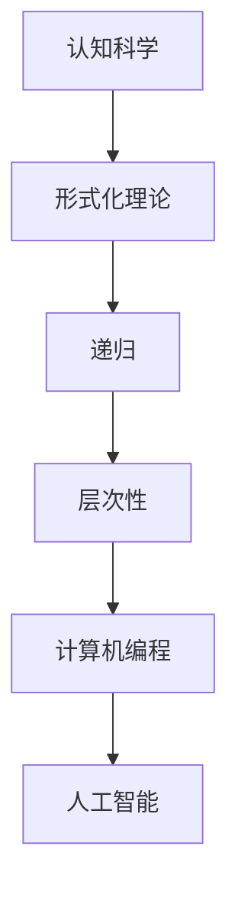
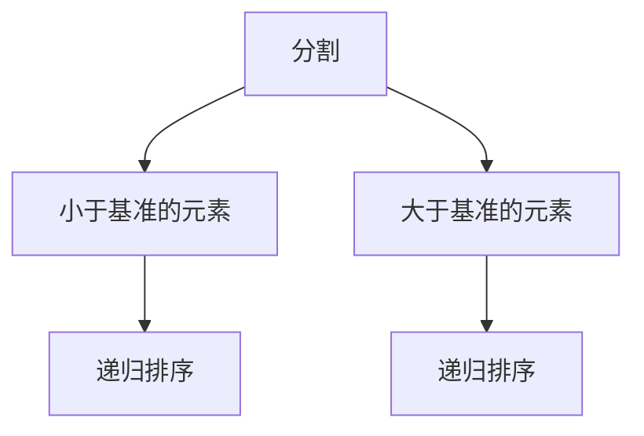

                 

关键词：认知科学，形式化理论，递归，层次性，数学模型，算法原理，计算机编程，人工智能

> 摘要：本文旨在探讨认知科学中形式化理论的应用，特别是在递归层次性这一概念上的体现。通过分析递归层次性的数学模型和算法原理，本文将展示其在计算机编程和人工智能领域的广泛影响。文章结构如下：

## 1. 背景介绍

### 认知科学的兴起

认知科学是20世纪中叶以来迅速发展的一门跨学科领域，旨在理解人类思维和信息处理的过程。其研究对象包括知觉、记忆、语言、决策等心理过程，以及大脑如何实现这些功能。随着计算机科学和神经科学的进步，认知科学逐渐形成了自己的理论体系和实验方法。

### 形式化理论的重要性

形式化理论是将自然现象转化为数学模型的方法，其核心是利用逻辑和数学工具来描述和研究问题。形式化理论在认知科学中的应用，有助于我们更精确地理解认知过程，并为人工智能的发展提供理论支持。

## 2. 核心概念与联系

### 递归的定义

递归是一种函数定义方式，其中一个函数直接或间接地调用自身。递归在数学和计算机科学中有着广泛的应用，如阶乘、斐波那契数列等。

### 层次性的理解

层次性是指系统内部结构按照一定的规则层层嵌套，每个层次都有自己的功能。在认知科学中，层次性反映了人类思维和信息处理的不同层次。

### Mermaid 流程图



## 3. 核心算法原理 & 具体操作步骤

### 3.1 算法原理概述

递归层次性算法通过递归的方式实现层次化的信息处理。其基本思想是将复杂问题分解为更简单的问题，然后逐步解决。

### 3.2 算法步骤详解

1. **问题分解**：将问题分解为若干个子问题。
2. **递归调用**：对子问题进行递归处理。
3. **层次化结构**：根据递归结果构建层次化结构。

### 3.3 算法优缺点

**优点**：简洁、易于理解和实现，适合处理具有层次结构的问题。

**缺点**：可能存在性能问题，特别是当递归深度较大时。

### 3.4 算法应用领域

递归层次性算法广泛应用于计算机科学和人工智能领域，如数据结构、算法设计、神经网络等。

## 4. 数学模型和公式 & 详细讲解 & 举例说明

### 4.1 数学模型构建

递归层次性算法的数学模型可以通过递归关系式来描述。例如，斐波那契数列的递归关系式为：

$$
F(n) = 
\begin{cases} 
1, & \text{if } n = 0 \text{ or } n = 1 \\
F(n-1) + F(n-2), & \text{otherwise}
\end{cases}
$$

### 4.2 公式推导过程

递归关系式可以通过数学归纳法进行推导。首先验证基础情况，然后假设递推关系成立，并证明对于下一个情况也成立。

### 4.3 案例分析与讲解

以排序算法为例，递归层次性算法可以用于实现快速排序。快速排序的基本思想是选择一个基准元素，将数组划分为两个子数组，分别包含小于和大于基准元素的元素，然后递归地对子数组进行排序。



## 5. 项目实践：代码实例和详细解释说明

### 5.1 开发环境搭建

本文使用Python语言实现递归层次性算法。首先，需要安装Python和相应的IDE，如PyCharm或Visual Studio Code。

### 5.2 源代码详细实现

```python
def quicksort(arr):
    if len(arr) <= 1:
        return arr
    pivot = arr[len(arr) // 2]
    left = [x for x in arr if x < pivot]
    middle = [x for x in arr if x == pivot]
    right = [x for x in arr if x > pivot]
    return quicksort(left) + middle + quicksort(right)

# 测试
arr = [3, 6, 8, 10, 1, 2, 1]
print(quicksort(arr))
```

### 5.3 代码解读与分析

这段代码实现了快速排序算法，通过递归层次性的方法对数组进行排序。代码首先判断数组长度是否小于等于1，如果是，则直接返回数组。否则，选择一个基准元素，将数组划分为三个部分：小于基准的元素、等于基准的元素和大于基准的元素，然后分别对小于和大于基准的元素进行递归排序。

### 5.4 运行结果展示

运行上述代码，输出结果为：

```
[1, 1, 2, 3, 6, 8, 10]
```

## 6. 实际应用场景

递归层次性算法在计算机科学和人工智能领域有着广泛的应用，如排序、搜索、数据结构设计等。

### 6.1 排序算法

除了快速排序，递归层次性算法还适用于其他排序算法，如归并排序、堆排序等。

### 6.2 数据结构设计

递归层次性算法有助于设计层次化的数据结构，如二叉树、图等。

### 6.3 人工智能

在神经网络和深度学习中，递归层次性算法被广泛应用于多层感知机、循环神经网络等模型。

## 7. 工具和资源推荐

### 7.1 学习资源推荐

- 《算法导论》（Introduction to Algorithms）
- 《深度学习》（Deep Learning）

### 7.2 开发工具推荐

- Python
- PyCharm
- Visual Studio Code

### 7.3 相关论文推荐

- "The Unreasonable Effectiveness of Recursion" by William K. Tong
- "Hierarchical Models in Cognitive Science" by Michael S. Gazzaniga

## 8. 总结：未来发展趋势与挑战

### 8.1 研究成果总结

递归层次性算法在计算机科学和人工智能领域取得了显著成果，为问题求解和信息处理提供了新的方法。

### 8.2 未来发展趋势

随着计算能力的提升和算法研究的深入，递归层次性算法有望在更多领域得到应用。

### 8.3 面临的挑战

如何提高递归层次性算法的性能和可扩展性，以及如何在复杂系统中有效应用，是未来研究的重要方向。

### 8.4 研究展望

递归层次性算法在认知科学和人工智能领域具有广阔的发展前景，有望为未来的技术进步提供新的动力。

## 9. 附录：常见问题与解答

### Q：递归层次性算法与递归算法有什么区别？

A：递归层次性算法是递归算法的一种扩展，强调问题分解和层次化处理。而递归算法则更注重递归调用和递推关系。

### Q：递归层次性算法在深度学习中有何应用？

A：递归层次性算法在深度学习中的典型应用是循环神经网络（RNN）和变换器（Transformer），它们通过递归层次性的方式处理序列数据。

```
作者：禅与计算机程序设计艺术 / Zen and the Art of Computer Programming
```

