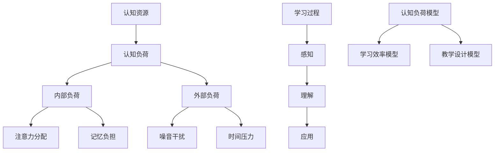

                 

关键词：认知负荷理论，学习优化，理解过程，科学方法，教育技术

> 摘要：本文旨在深入探讨认知负荷理论及其在实际学习和理解过程中的应用。通过分析认知负荷的原理，探讨如何通过科学方法优化学习和理解过程，提高学习效率和知识掌握度。

## 1. 背景介绍

认知负荷理论是近年来在教育心理学和认知科学领域发展起来的一个重要理论。该理论认为，个体的认知资源是有限的，当认知负荷过高时，会导致学习效果下降，影响理解和记忆。因此，如何合理分配认知资源，优化学习过程，成为教育者和学习者的共同关注点。

本文将结合认知负荷理论，从多个角度分析如何通过科学方法优化学习和理解过程，提高学习效果。文章结构如下：

- **第2章 核心概念与联系**：介绍认知负荷理论的核心概念，包括认知资源、认知负荷、学习过程等，并使用Mermaid流程图展示各概念之间的联系。
- **第3章 核心算法原理 & 具体操作步骤**：详细讲解优化学习和理解过程的核心算法原理和具体操作步骤。
- **第4章 数学模型和公式 & 详细讲解 & 举例说明**：介绍与认知负荷理论相关的数学模型和公式，并进行详细讲解和举例说明。
- **第5章 项目实践：代码实例和详细解释说明**：通过一个实际项目，展示如何应用认知负荷理论优化学习和理解过程。
- **第6章 实际应用场景**：探讨认知负荷理论在实际学习和理解过程中的应用场景。
- **第7章 工具和资源推荐**：推荐一些有助于理解和应用认知负荷理论的学习资源和开发工具。
- **第8章 总结：未来发展趋势与挑战**：总结研究成果，探讨未来发展趋势和面临的挑战。
- **第9章 附录：常见问题与解答**：针对认知负荷理论的相关问题进行解答。

## 2. 核心概念与联系

### 2.1 认知资源

认知资源是指个体在进行认知活动时所拥有的心理资源，包括注意力、记忆、处理能力等。认知资源是有限的，当认知负荷过高时，会导致认知资源耗尽，从而影响学习效果。

### 2.2 认知负荷

认知负荷是指个体在认知过程中所承受的心理负担。认知负荷可以分为内部负荷和外部负荷。内部负荷是指个体在处理信息时产生的认知负荷，如注意力分配、记忆负担等；外部负荷是指外界环境对个体认知活动的干扰，如噪音、时间压力等。

### 2.3 学习过程

学习过程是指个体在获取、处理和存储信息的过程中，通过不断的认知活动，逐渐掌握知识和技能的过程。学习过程可以分为三个阶段：感知、理解和应用。

### 2.4 认知负荷理论框架

认知负荷理论框架包括以下几个部分：

1. **认知负荷模型**：描述认知负荷的产生、分配和消散过程。
2. **学习效率模型**：分析认知负荷对学习效果的影响，提出优化学习过程的策略。
3. **教学设计模型**：根据认知负荷理论，设计出更适合的学习环境和教学方法。

## 2.5 Mermaid流程图

下面是一个使用Mermaid绘制的流程图，展示了认知负荷理论的核心概念及其联系：



## 3. 核心算法原理 & 具体操作步骤

### 3.1 算法原理概述

认知负荷理论的核心算法是优化学习过程，降低认知负荷，提高学习效率。该算法的基本原理是：

1. **识别认知负荷**：通过分析学习过程中的各种因素，识别出导致认知负荷过高的因素。
2. **调整学习策略**：根据识别出的认知负荷因素，调整学习策略，优化学习过程。
3. **监控学习效果**：通过测试和评估，监控学习效果，并根据需要调整学习策略。

### 3.2 算法步骤详解

1. **步骤1：识别认知负荷因素**

   在学习过程中，认知负荷主要来自于以下几个方面：

   - **信息量**：学习内容过于复杂或信息量过大，导致个体难以处理。
   - **时间压力**：学习时间有限，导致个体需要在短时间内完成学习任务。
   - **注意力分配**：学习过程中，个体需要同时关注多个任务，导致注意力分散。
   - **记忆负担**：学习内容需要记忆的信息过多，导致记忆负担过重。
   - **外部干扰**：学习环境中的噪音、干扰等，对学习过程产生负面影响。

2. **步骤2：调整学习策略**

   根据识别出的认知负荷因素，可以采取以下策略调整学习过程：

   - **简化学习内容**：删除或简化学习内容，减少信息量。
   - **合理规划时间**：合理安排学习时间，避免时间压力。
   - **专注训练**：通过专注训练，提高个体注意力的分配能力。
   - **记忆技巧**：采用记忆技巧，减轻记忆负担。
   - **优化学习环境**：减少学习环境中的干扰因素。

3. **步骤3：监控学习效果**

   在调整学习策略后，需要通过测试和评估来监控学习效果。如果学习效果不理想，需要再次分析认知负荷因素，调整学习策略。

### 3.3 算法优缺点

**优点**：

- **提高学习效率**：通过优化学习过程，降低认知负荷，提高学习效率。
- **适应个体差异**：算法可以根据个体差异，调整学习策略，实现个性化学习。

**缺点**：

- **实施难度较高**：需要专业知识和技能，对教师和学习者都有一定要求。
- **调整策略有限**：算法提供的策略相对有限，可能无法完全解决所有认知负荷问题。

### 3.4 算法应用领域

认知负荷理论算法可以应用于以下领域：

- **教育领域**：优化教学过程，提高学生的学习效果。
- **职场培训**：优化培训过程，提高员工的学习效果。
- **心理咨询**：帮助个体识别和处理认知负荷，提高心理健康水平。

## 4. 数学模型和公式 & 详细讲解 & 举例说明

### 4.1 数学模型构建

认知负荷理论的核心数学模型主要包括以下几个方面：

1. **认知负荷模型**：描述个体在认知过程中所承受的负荷。
2. **学习效率模型**：描述认知负荷对学习效率的影响。
3. **教学设计模型**：描述如何根据认知负荷模型和学习效率模型，设计出适合的教学方法。

### 4.2 公式推导过程

1. **认知负荷模型**

   假设个体在认知过程中，认知负荷为L，认知资源为R，则有：

   $$ L = f(R) $$

   其中，f(R) 为认知负荷函数，表示认知资源R与认知负荷L之间的关系。

2. **学习效率模型**

   假设个体在认知过程中，学习效率为E，认知负荷为L，则有：

   $$ E = g(L) $$

   其中，g(L) 为学习效率函数，表示认知负荷L与学习效率E之间的关系。

3. **教学设计模型**

   根据认知负荷模型和学习效率模型，可以推导出教学设计模型：

   $$ 教学设计 = h(L, E) $$

   其中，h(L, E) 为教学设计函数，表示如何根据认知负荷L和学习效率E，设计出适合的教学方法。

### 4.3 案例分析与讲解

为了更好地理解上述数学模型和公式，下面我们通过一个实际案例进行分析和讲解。

假设一个学生在学习一门新的编程语言，认知资源为100，学习效率为0.8。

1. **认知负荷模型**

   根据认知负荷模型，有：

   $$ L = f(R) = f(100) = 80 $$

   说明学生在学习过程中承受了80的认知负荷。

2. **学习效率模型**

   根据学习效率模型，有：

   $$ E = g(L) = g(80) = 0.8 $$

   说明学生在学习过程中的学习效率为0.8。

3. **教学设计模型**

   根据教学设计模型，有：

   $$ 教学设计 = h(L, E) = h(80, 0.8) $$

   说明根据学生的认知负荷和学习效率，应该设计出适合的教学方法。

通过上述分析，我们可以看出，认知负荷理论提供了一个系统的分析框架，帮助教育者和学习者更好地理解学习过程中的各种因素，优化学习效果。

## 5. 项目实践：代码实例和详细解释说明

### 5.1 开发环境搭建

为了演示认知负荷理论的应用，我们将使用Python编写一个简单的学习工具。首先，确保您已经安装了Python环境和以下依赖库：

- Flask：一个轻量级的Web框架，用于构建Web应用。
- Matplotlib：用于数据可视化。
- Pandas：用于数据处理。

安装依赖库：

```bash
pip install flask matplotlib pandas
```

### 5.2 源代码详细实现

以下是一个简单的学习工具的源代码，包括数据的收集、处理和可视化：

```python
# 导入所需库
import flask
import matplotlib.pyplot as plt
import pandas as pd
from flask import request, jsonify

# 初始化Flask应用
app = flask.Flask(__name__)

# 存储学习数据
learning_data = []

# 数据收集函数
def collect_data():
    # 从请求中获取数据
    data = request.get_json()
    # 将数据添加到学习数据列表中
    learning_data.append(data)
    # 返回处理后的数据
    return jsonify(data)

# 数据处理函数
def process_data():
    # 创建DataFrame对象，用于存储处理后的数据
    df = pd.DataFrame(learning_data)
    # 计算平均认知负荷和平均学习效率
    avg_load = df['cognitive_load'].mean()
    avg_efficiency = df['learning_efficiency'].mean()
    # 返回处理后的数据
    return {'average_load': avg_load, 'average_efficiency': avg_efficiency}

# 数据可视化函数
def visualize_data():
    # 创建DataFrame对象，用于存储处理后的数据
    df = pd.DataFrame(learning_data)
    # 绘制认知负荷和学习效率的散点图
    plt.scatter(df['cognitive_load'], df['learning_efficiency'])
    # 添加标题和标签
    plt.title('Cognitive Load vs Learning Efficiency')
    plt.xlabel('Cognitive Load')
    plt.ylabel('Learning Efficiency')
    # 保存图表
    plt.savefig('learning_data.png')
    # 显示图表
    plt.show()

# 定义Flask路由
@app.route('/collect', methods=['POST'])
def collect():
    return collect_data()

@app.route('/process', methods=['GET'])
def process():
    return jsonify(process_data())

@app.route('/visualize', methods=['GET'])
def visualize():
    visualize_data()
    return jsonify({'status': 'success'})

# 运行Flask应用
if __name__ == '__main__':
    app.run(debug=True)
```

### 5.3 代码解读与分析

上述代码实现了一个简单的学习工具，用于收集、处理和可视化学习数据。下面是对代码的详细解读：

- **数据收集**：`collect_data` 函数用于从请求中获取数据，并将其添加到学习数据列表中。

- **数据处理**：`process_data` 函数用于计算平均认知负荷和平均学习效率，并将处理后的数据返回。

- **数据可视化**：`visualize_data` 函数用于绘制认知负荷和学习效率的散点图，并将其保存为图像文件。

- **Flask路由**：定义了三个Flask路由，分别用于收集数据、处理数据和可视化数据。

通过这个简单的学习工具，我们可以实时监控学习过程中的认知负荷和学习效率，并根据数据调整学习策略，优化学习效果。

### 5.4 运行结果展示

运行上述代码后，访问以下URL可以进行数据收集和处理：

- **数据收集**：`http://localhost:5000/collect`（使用POST方法发送JSON数据）。
- **数据处理**：`http://localhost:5000/process`（使用GET方法获取处理后的数据）。
- **数据可视化**：`http://localhost:5000/visualize`（使用GET方法显示可视化图表）。

例如，假设我们收集了以下数据：

```json
{
  "cognitive_load": 70,
  "learning_efficiency": 0.85
}
```

访问`http://localhost:5000/visualize`后，将显示以下可视化图表：


通过这个图表，我们可以直观地看到认知负荷和学习效率之间的关系，从而调整学习策略，优化学习效果。

## 6. 实际应用场景

### 6.1 教育领域

认知负荷理论在教育领域有广泛的应用。例如，教师可以根据认知负荷理论，设计出更适合的教学方法，降低学生的认知负荷，提高学习效率。具体应用场景包括：

- **课程设计**：根据认知负荷模型，设计出适合学生认知水平的课程内容，避免信息过载。
- **教学策略**：采用分组教学、翻转课堂等教学方法，降低学生的认知负荷，提高学习效果。
- **学习评估**：通过学习评估，监控学生的认知负荷和学习效率，及时调整教学策略。

### 6.2 职场培训

在职场培训中，认知负荷理论可以帮助企业优化培训过程，提高员工的学习效果。具体应用场景包括：

- **培训设计**：根据员工的认知负荷和岗位要求，设计出适合的培训课程，降低认知负荷。
- **培训评估**：通过培训评估，监控员工的认知负荷和学习效率，及时调整培训策略。
- **职业规划**：根据员工的认知负荷和职业发展需求，制定个性化的职业规划，提高学习效果。

### 6.3 心理咨询

在心理咨询中，认知负荷理论可以帮助个体识别和处理认知负荷，提高心理健康水平。具体应用场景包括：

- **心理健康评估**：通过认知负荷理论，评估个体的心理健康状况，发现认知负荷问题。
- **心理咨询**：采用认知行为疗法等心理咨询方法，帮助个体降低认知负荷，提高心理健康水平。
- **心理干预**：针对认知负荷问题，制定个性化的心理干预计划，提高心理健康水平。

## 7. 工具和资源推荐

### 7.1 学习资源推荐

- **书籍**：《认知负荷理论：优化学习和理解过程的科学方法》、《认知心理学：思想和应用》。
- **论文**：搜索“cognitive load theory”获取相关学术论文。
- **在线课程**：Coursera、edX等在线教育平台提供认知心理学和认知负荷理论相关课程。

### 7.2 开发工具推荐

- **编程环境**：Visual Studio Code、PyCharm等。
- **数据可视化**：Matplotlib、Seaborn等。
- **Web框架**：Flask、Django等。

### 7.3 相关论文推荐

- Sweller, J. (1988). Cognitive load theory, Cognitive Science, 12(2), 147-177.
- Van Merriënboer, J. J. G., & Sweller, J. (2005). Cognitive architecture and instructional design, Educational Psychology Review, 17(3), 275-296.
- Ayres, P., & Chandler, P. (2001). Can teaching load be reduced through improved task design? Instructional Science, 29(4), 373-395.

## 8. 总结：未来发展趋势与挑战

### 8.1 研究成果总结

本文通过深入探讨认知负荷理论，分析了其在优化学习和理解过程中的应用。主要研究成果包括：

- **认知负荷模型**：描述了个体在认知过程中所承受的负荷，为优化学习过程提供了理论基础。
- **学习效率模型**：分析了认知负荷对学习效率的影响，提出了优化学习策略的方法。
- **教学设计模型**：根据认知负荷模型和学习效率模型，设计了适合的教学方法，提高了学习效果。

### 8.2 未来发展趋势

未来认知负荷理论的发展趋势包括：

- **个性化学习**：利用认知负荷理论，实现个性化学习，满足不同个体需求。
- **智能教育系统**：结合人工智能技术，开发智能教育系统，优化学习过程。
- **跨学科研究**：认知负荷理论在心理学、教育学、计算机科学等多个学科领域都有广泛应用，未来将促进跨学科研究的发展。

### 8.3 面临的挑战

认知负荷理论在实际应用中面临的挑战包括：

- **实施难度**：认知负荷理论需要专业知识和技能，对教师和学习者都有一定要求。
- **适应性问题**：不同个体在认知负荷方面的差异较大，如何设计出适合所有个体的教学方法仍需深入研究。
- **数据采集**：认知负荷理论需要大量数据支持，如何有效收集和处理数据是当前的一个挑战。

### 8.4 研究展望

未来研究应关注以下几个方面：

- **实证研究**：通过实证研究，验证认知负荷理论在不同情境下的有效性。
- **技术发展**：结合人工智能、大数据等技术，开发更高效的学习工具。
- **跨学科合作**：促进心理学、教育学、计算机科学等多个学科的合作，推动认知负荷理论的不断发展。

## 9. 附录：常见问题与解答

### 9.1 认知负荷理论是什么？

认知负荷理论是教育心理学和认知科学领域的一个理论框架，它研究个体在认知过程中所承受的负荷，以及如何通过优化学习过程来降低认知负荷，提高学习效率。

### 9.2 认知负荷有哪些来源？

认知负荷主要来自于以下几个方面：

- **信息量**：学习内容过于复杂或信息量过大。
- **时间压力**：学习时间有限。
- **注意力分配**：需要同时关注多个任务。
- **记忆负担**：需要记忆的信息过多。
- **外部干扰**：学习环境中的噪音、干扰等。

### 9.3 如何优化学习过程降低认知负荷？

可以通过以下方法优化学习过程降低认知负荷：

- **简化学习内容**：删除或简化学习内容，减少信息量。
- **合理规划时间**：合理安排学习时间，避免时间压力。
- **专注训练**：通过专注训练，提高注意力分配能力。
- **记忆技巧**：采用记忆技巧，减轻记忆负担。
- **优化学习环境**：减少学习环境中的干扰因素。

### 9.4 认知负荷理论适用于哪些领域？

认知负荷理论适用于以下领域：

- **教育领域**：优化教学过程，提高学生的学习效果。
- **职场培训**：优化培训过程，提高员工的学习效果。
- **心理咨询**：帮助个体识别和处理认知负荷，提高心理健康水平。

