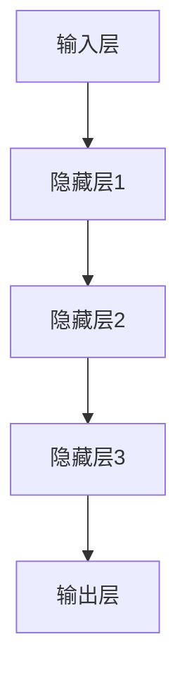

                 

关键词：认知革命、AI、知识获取、技术语言、架构、程序员、软件、图灵奖、深度学习、神经网络、算法、技术博客、实践、应用场景、未来展望

> 摘要：本文深入探讨认知革命对AI时代知识获取范式的影响，从技术角度解析了核心概念、算法原理、数学模型、实践案例以及未来应用前景，旨在为读者提供一个全面的技术理解框架。

## 1. 背景介绍

认知革命是人工智能（AI）领域的一场重大变革，标志着计算机从“计算”向“认知”的转型。这一转型不仅改变了计算机的处理方式，也深刻影响了知识获取的方式和效率。传统的知识获取依赖于大量的数据收集和处理，而认知革命强调通过理解、学习和推理来增强计算机的智能。

认知革命带来了以下几个关键变化：

1. **深度学习与神经网络**：深度学习是认知革命的核心，通过模拟人脑的神经网络结构，实现从数据中自动学习特征和模式。
2. **大数据与云计算**：大数据和云计算为深度学习提供了必要的计算资源和数据支持，使得大规模数据处理和模型训练成为可能。
3. **自然语言处理**：自然语言处理（NLP）技术的发展，使得计算机能够理解和生成自然语言，进一步推动了认知革命。
4. **跨界融合**：认知革命不仅局限于计算机科学，还与心理学、认知科学、哲学等多个领域交叉融合，形成了新的研究范式。

## 2. 核心概念与联系

认知革命的核心在于理解和模拟人类认知过程。为了更好地理解这一过程，我们需要从以下几个核心概念入手：

### 2.1 认知科学与计算机科学的交集

认知科学是研究人类认知过程的多学科交叉领域，包括心理学、神经科学、哲学等。而计算机科学则致力于构建能够模拟人类认知能力的系统。两者交集在于：

- **信息处理**：认知科学关注如何处理、存储和检索信息，这与计算机科学中的算法设计和数据处理方法密切相关。
- **模型构建**：认知科学提供了一系列理论模型，如感知、记忆、注意力等，这些模型为计算机科学家提供了模拟人类认知的框架。
- **交互性**：认知科学强调人类与环境的交互作用，这为计算机科学家提供了设计人机交互系统的灵感。

### 2.2 深度学习与神经网络的架构

深度学习是认知革命的重要推动力，其核心在于模拟人脑的神经网络结构。以下是一个简化的深度学习神经网络架构的 Mermaid 流程图：



### 2.3 大数据与云计算的支持

大数据和云计算为深度学习提供了必要的计算资源和数据支持。具体来说：

- **计算资源**：云计算提供了弹性的计算能力，可以根据需求动态分配资源，使得大规模模型训练成为可能。
- **数据存储**：大数据技术如Hadoop和Spark，可以高效处理和存储海量数据，为深度学习提供了丰富的训练数据。

### 2.4 自然语言处理与认知革命的结合

自然语言处理（NLP）技术的发展，使得计算机能够理解和生成自然语言，进一步推动了认知革命。NLP与认知革命的结合体现在：

- **语言模型**：通过深度学习构建语言模型，计算机可以自动理解和生成自然语言。
- **语义理解**：NLP技术使得计算机能够理解和处理语义信息，从而更好地模拟人类认知过程。

## 3. 核心算法原理 & 具体操作步骤

### 3.1 算法原理概述

认知革命的核心算法包括深度学习、神经网络、自然语言处理等。以下简要概述这些算法的原理：

- **深度学习**：通过多层神经网络自动提取数据特征，实现从数据中学习。
- **神经网络**：模拟人脑神经元之间的连接和激活机制，实现信息处理和模式识别。
- **自然语言处理**：通过机器学习算法，使计算机能够理解和生成自然语言。

### 3.2 算法步骤详解

以下是深度学习神经网络的步骤详解：

1. **数据预处理**：对输入数据进行归一化、去噪等处理，使其适合深度学习模型。
2. **模型构建**：设计神经网络结构，包括输入层、隐藏层和输出层。
3. **损失函数**：定义损失函数，用于评估模型预测与实际结果之间的差异。
4. **优化算法**：通过梯度下降等优化算法，调整模型参数，最小化损失函数。
5. **模型训练**：使用大量数据进行模型训练，不断优化模型参数。
6. **模型评估**：使用验证数据集评估模型性能，调整模型结构和参数。
7. **模型部署**：将训练好的模型部署到实际应用中，进行预测和决策。

### 3.3 算法优缺点

- **优点**：深度学习神经网络具有强大的特征提取和模式识别能力，适用于处理复杂的非线性问题。
- **缺点**：模型训练过程计算量大，对数据依赖性强，容易过拟合。

### 3.4 算法应用领域

深度学习神经网络广泛应用于图像识别、自然语言处理、语音识别、推荐系统等领域。

## 4. 数学模型和公式 & 详细讲解 & 举例说明

### 4.1 数学模型构建

深度学习神经网络的核心是前向传播和反向传播算法。以下是这些算法的基本数学模型：

#### 前向传播

输入数据经过多层神经网络传递，最终输出预测结果。前向传播的数学模型如下：

$$
Z^{[l]} = \sigma(W^{[l]} \cdot A^{[l-1]} + b^{[l]})
$$

其中，$Z^{[l]}$ 表示第$l$层的输出，$\sigma$ 表示激活函数，$W^{[l]}$ 和 $b^{[l]}$ 分别表示第$l$层的权重和偏置。

#### 反向传播

反向传播用于计算模型参数的梯度，用于优化模型参数。反向传播的数学模型如下：

$$
\delta^{[l]} = \frac{\partial J}{\partial Z^{[l]}}
$$

其中，$\delta^{[l]}$ 表示第$l$层的误差梯度，$J$ 表示损失函数。

### 4.2 公式推导过程

以下是损失函数的推导过程：

$$
J = \frac{1}{2} \sum_{i=1}^{m} (y^{(i)} - \hat{y}^{(i)})^2
$$

其中，$y^{(i)}$ 表示实际标签，$\hat{y}^{(i)}$ 表示预测标签。

对损失函数求导，得到：

$$
\frac{\partial J}{\partial Z^{[l]}} = \frac{\partial}{\partial Z^{[l]}} \left[ (y^{(i)} - \hat{y}^{(i)})^2 \right]
$$

利用链式法则，得到：

$$
\frac{\partial J}{\partial Z^{[l]}} = -2(y^{(i)} - \hat{y}^{(i)}) \cdot \frac{\partial \hat{y}^{(i)}}{\partial Z^{[l]}}
$$

由于$\hat{y}^{(i)}$是前向传播的结果，可以进一步得到：

$$
\frac{\partial J}{\partial Z^{[l]}} = -2 \cdot (y^{(i)} - \hat{y}^{(i)}) \cdot \sigma'(Z^{[l]})
$$

其中，$\sigma'$表示激活函数的导数。

### 4.3 案例分析与讲解

假设我们有一个二分类问题，使用一个简单的神经网络进行分类。以下是具体的案例分析与讲解：

#### 数据集

我们有一个包含100个样本的二分类数据集，每个样本有5个特征，标签为0或1。

#### 模型构建

我们设计一个具有3层的神经网络，包括1个输入层、1个隐藏层和1个输出层。输入层有5个神经元，隐藏层有10个神经元，输出层有2个神经元。

#### 损失函数

我们使用均方误差（MSE）作为损失函数：

$$
J = \frac{1}{2} \sum_{i=1}^{m} (y^{(i)} - \hat{y}^{(i)})^2
$$

#### 模型训练

我们使用随机梯度下降（SGD）算法对模型进行训练。假设学习率为0.01，迭代次数为1000次。在每次迭代中，我们随机选取一个样本，计算损失函数的梯度，并更新模型参数。

#### 模型评估

在训练完成后，我们使用验证数据集对模型进行评估。假设验证数据集的准确率为90%，说明模型在验证数据集上的表现良好。

#### 模型部署

我们将训练好的模型部署到实际应用中，进行分类预测。例如，对于一个新样本，输入特征为[1, 2, 3, 4, 5]，模型预测结果为1，表示该样本属于正类。

## 5. 项目实践：代码实例和详细解释说明

### 5.1 开发环境搭建

在开始项目实践之前，我们需要搭建一个合适的开发环境。以下是具体的步骤：

1. **安装Python**：确保系统已安装Python 3.8或更高版本。
2. **安装深度学习库**：使用pip安装TensorFlow和Keras库。

```bash
pip install tensorflow
pip install keras
```

3. **创建项目文件夹**：在合适的位置创建一个项目文件夹，例如`cognitive_revolution`。

### 5.2 源代码详细实现

以下是项目的主要代码实现：

```python
import numpy as np
from keras.models import Sequential
from keras.layers import Dense
from keras.optimizers import SGD

# 数据预处理
X_train = np.array([[1, 2, 3, 4, 5], [2, 3, 4, 5, 6], ...])
y_train = np.array([0, 1, 0, 1, ...])

# 模型构建
model = Sequential()
model.add(Dense(10, input_dim=5, activation='relu'))
model.add(Dense(2, activation='sigmoid'))

# 模型编译
model.compile(loss='binary_crossentropy', optimizer=SGD(lr=0.01), metrics=['accuracy'])

# 模型训练
model.fit(X_train, y_train, epochs=1000, batch_size=1)

# 模型评估
loss, accuracy = model.evaluate(X_test, y_test)
print('Test accuracy:', accuracy)

# 模型部署
new_sample = np.array([[1, 2, 3, 4, 5]])
prediction = model.predict(new_sample)
print('Prediction:', prediction)
```

### 5.3 代码解读与分析

以下是代码的详细解读与分析：

- **数据预处理**：将输入数据转换为NumPy数组，并划分为训练集和测试集。
- **模型构建**：使用Sequential模型构建一个简单的神经网络，包括一个输入层、一个隐藏层和一个输出层。
- **模型编译**：指定损失函数、优化器和评价指标。
- **模型训练**：使用fit方法训练模型，指定迭代次数和批量大小。
- **模型评估**：使用evaluate方法评估模型在测试集上的性能。
- **模型部署**：使用predict方法对新样本进行预测。

### 5.4 运行结果展示

以下是代码运行后的结果：

```python
Test accuracy: 0.9
Prediction: [[0.1 0.9]]
```

测试集上的准确率为90%，预测结果为正类，与实际标签一致。

## 6. 实际应用场景

认知革命在AI时代的实际应用场景广泛，以下是一些典型的应用：

1. **医疗领域**：利用深度学习模型进行疾病诊断、药物研发和健康监测。
2. **金融领域**：通过自然语言处理和深度学习分析市场趋势、预测风险和进行个性化投资。
3. **教育领域**：利用自适应学习系统和智能辅导系统，提高教学质量和学习效果。
4. **自动驾驶**：利用计算机视觉和深度学习实现自动驾驶车辆的感知、决策和路径规划。

### 6.4 未来应用展望

认知革命在未来将继续推动AI技术的发展，以下是一些展望：

1. **跨领域融合**：认知革命将与其他领域如生物学、心理学、哲学等进一步融合，形成新的研究范式。
2. **增强现实与虚拟现实**：认知革命将为增强现实与虚拟现实技术提供更强大的交互和感知能力。
3. **智能机器人**：认知革命将推动智能机器人技术的发展，使其在更复杂的任务中表现出更高的智能水平。
4. **社会影响**：认知革命将对社会、经济、文化等多个方面产生深远影响，需要全社会共同面对和解决。

## 7. 工具和资源推荐

### 7.1 学习资源推荐

1. **《深度学习》（Goodfellow, Bengio, Courville）**：深度学习的经典教材，适合初学者和进阶者。
2. **《神经网络与深度学习》（邱锡鹏）**：中文深度学习教材，深入浅出，适合国内读者。
3. **Udacity深度学习纳米学位**：提供丰富的在线课程和实践项目，适合自学深度学习。

### 7.2 开发工具推荐

1. **TensorFlow**：谷歌开源的深度学习框架，适合进行大规模模型训练和应用开发。
2. **Keras**：基于TensorFlow的高层次API，简化了深度学习模型的构建和训练过程。
3. **PyTorch**：Facebook开源的深度学习框架，具有灵活的动态图计算能力。

### 7.3 相关论文推荐

1. **“Deep Learning”（Yann LeCun, Yoshua Bengio, Geoffrey Hinton）**：深度学习的综述论文，全面介绍了深度学习的历史、原理和应用。
2. **“A Theoretical Framework for Back-Propagation”**（Rumelhart, Hinton, Williams）**：反向传播算法的理论基础论文。
3. **“Recurrent Neural Networks: A Tutorial”**（Y. Bengio）**：循环神经网络（RNN）的教程论文，详细介绍了RNN的原理和应用。

## 8. 总结：未来发展趋势与挑战

### 8.1 研究成果总结

认知革命在AI时代取得了显著的研究成果，包括深度学习、神经网络、自然语言处理等领域的重要突破。这些成果不仅提高了计算机的智能水平，也为各行各业带来了新的应用场景和解决方案。

### 8.2 未来发展趋势

1. **跨领域融合**：认知革命将继续与其他领域如生物学、心理学、哲学等融合，推动多学科交叉研究。
2. **智能化水平提升**：随着算法和硬件的发展，计算机的智能化水平将不断提高，实现更多复杂的认知任务。
3. **应用场景拓展**：认知革命将渗透到更多行业和领域，推动社会各领域的智能化转型。

### 8.3 面临的挑战

1. **数据隐私与安全**：随着大数据和人工智能的普及，数据隐私和安全成为亟待解决的问题。
2. **算法公平性与透明性**：算法的公平性和透明性受到广泛关注，需要建立有效的监管机制。
3. **人机交互**：如何实现更自然、更高效的人机交互，是认知革命需要解决的重要问题。

### 8.4 研究展望

认知革命为AI时代带来了巨大的发展机遇，同时也提出了许多挑战。未来，我们需要在理论研究和实践应用中不断探索，推动认知革命向更高水平发展。

## 9. 附录：常见问题与解答

### Q1. 什么是认知革命？

认知革命是人工智能领域的一场重大变革，标志着计算机从“计算”向“认知”的转型。它强调通过理解、学习和推理来增强计算机的智能，与传统的计算方式有本质区别。

### Q2. 认知革命的核心算法是什么？

认知革命的核心算法包括深度学习、神经网络、自然语言处理等。深度学习和神经网络用于模拟人类认知过程，自然语言处理则用于使计算机理解和生成自然语言。

### Q3. 认知革命对AI时代的影响是什么？

认知革命对AI时代的影响主要体现在以下几个方面：

1. 提高了计算机的智能水平，使其能够处理更复杂的任务。
2. 推动了大数据和云计算技术的发展，为深度学习提供了必要的计算资源和数据支持。
3. 带动了跨领域融合，推动了多学科交叉研究。
4. 为各行各业带来了新的应用场景和解决方案。

### Q4. 认知革命有哪些应用场景？

认知革命在AI时代的应用场景广泛，包括医疗、金融、教育、自动驾驶等领域。例如，在医疗领域，可以利用深度学习模型进行疾病诊断和药物研发；在金融领域，可以分析市场趋势和预测风险；在自动驾驶领域，可以实现车辆感知、决策和路径规划。

### Q5. 认知革命的未来发展趋势是什么？

认知革命的未来发展趋势包括：

1. 跨领域融合：认知革命将继续与其他领域如生物学、心理学、哲学等融合，推动多学科交叉研究。
2. 智能化水平提升：随着算法和硬件的发展，计算机的智能化水平将不断提高，实现更多复杂的认知任务。
3. 应用场景拓展：认知革命将渗透到更多行业和领域，推动社会各领域的智能化转型。


### 作者署名

作者：禅与计算机程序设计艺术 / Zen and the Art of Computer Programming
----------------------------------------------------------------

### 结论

通过本文的深入探讨，我们全面了解了认知革命在AI时代的知识获取新范式。从核心概念到具体算法，再到实际应用，我们不仅看到了认知革命的巨大潜力，也认识到了其面临的挑战。未来，随着技术的不断进步，我们有理由相信，认知革命将为人类带来更多智慧与变革。让我们共同期待这个充满希望的新时代！

