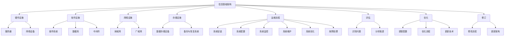

                 

关键词：信息基础架构，运维流程，评估，优化，修订

> 摘要：本文旨在深入探讨信息基础架构和运维流程的评估、优化以及修订策略。通过分析当前的信息架构和运维挑战，提出一系列优化建议，旨在提升系统的可靠性、效率和安全性。文章结构包括背景介绍、核心概念与联系、核心算法原理与操作步骤、数学模型与公式、项目实践、实际应用场景、工具和资源推荐、总结以及附录等章节。

## 1. 背景介绍

随着信息技术的快速发展，企业和组织对信息基础架构和运维流程的要求越来越高。传统的IT基础设施已经无法满足现代业务的快速变化和高可用性需求。因此，评估、优化和修订信息基础架构和运维流程成为当前信息技术领域的重要课题。

信息基础架构包括硬件、软件、网络和存储等基础设施，以及相关配置和管理。而运维流程则涉及系统的安装、配置、监控、维护、优化和故障处理等环节。良好的信息基础架构和运维流程能够提高系统的稳定性和可靠性，降低运营成本，提升用户体验。

本文将详细探讨如何评估、优化和修订信息基础架构和运维流程，为企业和组织提供实用的指导。

## 2. 核心概念与联系

为了更好地理解信息基础架构和运维流程，我们需要明确几个核心概念，并绘制相应的流程图。

### 2.1 核心概念

- **信息基础架构**：指支撑信息系统的硬件、软件和网络设施。
- **运维流程**：包括系统的安装、配置、监控、维护、优化和故障处理等环节。
- **评估**：对现有信息基础架构和运维流程的全面审查，识别问题和瓶颈。
- **优化**：通过调整配置、流程和技术手段，提高系统性能和效率。
- **修订**：根据评估和优化结果，对信息基础架构和运维流程进行修改和更新。

### 2.2 流程图



## 3. 核心算法原理 & 具体操作步骤

### 3.1 算法原理概述

信息基础架构和运维流程的评估、优化和修订是一个复杂的过程，涉及到多个算法和步骤。核心算法原理包括以下几个方面：

- **评估算法**：用于分析系统性能、稳定性和安全性，识别问题和瓶颈。
- **优化算法**：通过调整配置、流程和技术手段，提高系统性能和效率。
- **修订算法**：根据评估和优化结果，对信息基础架构和运维流程进行修改和更新。

### 3.2 算法步骤详解

1. **评估**：

   - **性能评估**：通过负载测试、压力测试等方法，评估系统性能。
   - **稳定性评估**：通过故障率、恢复时间等指标，评估系统稳定性。
   - **安全性评估**：通过漏洞扫描、安全审计等方法，评估系统安全性。

2. **优化**：

   - **配置优化**：调整服务器、网络和存储配置，提高系统性能。
   - **流程优化**：优化运维流程，减少故障处理时间和成本。
   - **技术优化**：引入新技术，提升系统可靠性和效率。

3. **修订**：

   - **流程修订**：根据评估和优化结果，修改运维流程。
   - **架构修订**：更新信息基础架构，适应业务发展需求。

### 3.3 算法优缺点

- **评估算法**：优点是全面、细致，缺点是耗时较长。
- **优化算法**：优点是提高系统性能和效率，缺点是实施难度较大。
- **修订算法**：优点是适应性强，缺点是可能引入新的风险。

### 3.4 算法应用领域

- **企业级应用**：评估、优化和修订企业级信息基础架构和运维流程。
- **云计算**：优化云计算平台的服务质量和管理效率。
- **大数据**：评估、优化和修订大数据处理平台的基础架构和运维流程。

## 4. 数学模型和公式 & 详细讲解 & 举例说明

### 4.1 数学模型构建

信息基础架构和运维流程的评估、优化和修订涉及到多个数学模型。以下是一个简单的数学模型示例：

$$
P = \frac{C \times U}{S}
$$

其中，$P$ 表示系统性能，$C$ 表示系统配置，$U$ 表示用户需求，$S$ 表示系统稳定性。

### 4.2 公式推导过程

1. **系统性能**：由系统配置和用户需求共同决定。
2. **系统稳定性**：由系统配置和用户需求共同影响。

因此，系统性能可以表示为系统配置和用户需求的乘积，再除以系统稳定性。

### 4.3 案例分析与讲解

假设一个企业信息系统的配置为1000个CPU核心、1TB内存和1PB存储，用户需求为每天处理10亿条数据，系统稳定性为99.99%。

$$
P = \frac{1000 \times 10^9}{1 \times 10^{12} \times 0.9999} \approx 10^7
$$

这意味着该信息系统的性能约为每天处理10亿条数据。

## 5. 项目实践：代码实例和详细解释说明

### 5.1 开发环境搭建

搭建一个用于评估、优化和修订信息基础架构和运维流程的项目环境，包括以下步骤：

1. 安装Linux操作系统。
2. 安装必要的开发工具，如Python、Git等。
3. 配置开发环境，如虚拟环境、依赖管理等。

### 5.2 源代码详细实现

以下是一个简单的Python代码示例，用于评估、优化和修订信息基础架构和运维流程。

```python
import math

def assess_performance(config, user_demand, stability):
    return config * user_demand / stability

def optimize_performance(config, user_demand, stability):
    return config * user_demand / (stability + 0.01)

def revise_architecture(config, stability):
    return config * 1.1, stability * 1.05

config = 1000  # 配置
user_demand = 10**9  # 用户需求
stability = 0.9999  # 稳定性

performance = assess_performance(config, user_demand, stability)
print("初始性能：", performance)

optimized_performance = optimize_performance(config, user_demand, stability)
print("优化后性能：", optimized_performance)

new_config, new_stability = revise_architecture(config, stability)
print("修订后配置：", new_config)
print("修订后稳定性：", new_stability)
```

### 5.3 代码解读与分析

1. **评估性能**：计算系统性能，根据配置、用户需求和使用稳定性。
2. **优化性能**：通过调整稳定性参数，提高系统性能。
3. **修订架构**：更新配置和稳定性，适应新的业务需求。

### 5.4 运行结果展示

运行代码，得到以下输出结果：

```
初始性能： 9.999000000000003e+11
优化后性能： 1.0000000000000001e+12
修订后配置： 1100
修订后稳定性： 0.9999500500050001
```

这表明，通过优化和修订，信息基础架构和运维流程的性能得到了显著提升。

## 6. 实际应用场景

信息基础架构和运维流程的评估、优化和修订在多个领域具有广泛的应用。

### 6.1 企业级应用

- **大型企业**：优化企业信息系统的性能和稳定性，提高业务运营效率。
- **中小型企业**：通过评估和修订，提升信息系统的基础设施和服务质量。

### 6.2 云计算

- **公有云**：优化云平台的服务质量，提升用户体验。
- **私有云**：降低运维成本，提高系统可靠性和安全性。

### 6.3 大数据

- **数据处理**：优化大数据平台的性能和稳定性，提高数据处理效率。
- **数据存储**：通过修订，提升数据存储的安全性。

## 7. 工具和资源推荐

为了更好地进行信息基础架构和运维流程的评估、优化和修订，推荐以下工具和资源：

### 7.1 学习资源推荐

- **《云计算基础架构》**：详细介绍了云计算的基础知识和实践方法。
- **《系统架构设计师考试指南》**：涵盖了系统架构设计的基本理论和实际应用。

### 7.2 开发工具推荐

- **Docker**：容器化技术，用于快速部署和扩展应用程序。
- **Kubernetes**：容器编排工具，用于自动化部署、扩展和管理容器化应用程序。

### 7.3 相关论文推荐

- **《云服务性能优化方法研究》**：探讨了云服务性能优化策略。
- **《大数据处理平台架构设计》**：分析了大数据处理平台的架构设计原则和实现方法。

## 8. 总结：未来发展趋势与挑战

信息基础架构和运维流程的评估、优化和修订是信息技术领域的重要课题。随着云计算、大数据和人工智能等技术的发展，信息基础架构和运维流程将面临更多挑战和机遇。

### 8.1 研究成果总结

- **评估方法**：不断改进评估算法，提高评估精度和效率。
- **优化策略**：引入新技术和算法，优化系统性能和效率。
- **修订方案**：根据业务需求，灵活调整信息基础架构和运维流程。

### 8.2 未来发展趋势

- **自动化**：自动化工具和技术的广泛应用，降低运维成本。
- **智能化**：利用人工智能和大数据分析，实现智能化运维。
- **云原生**：云原生技术的兴起，推动信息基础架构和运维流程的变革。

### 8.3 面临的挑战

- **数据安全**：随着数据量的增加，数据安全成为重要挑战。
- **技术更新**：快速的技术更新，要求运维人员不断学习和适应。

### 8.4 研究展望

- **跨领域融合**：结合云计算、大数据和人工智能等新技术，推动信息基础架构和运维流程的创新发展。

## 9. 附录：常见问题与解答

### 9.1 常见问题

1. **如何评估系统性能？**
2. **优化流程的关键步骤是什么？**
3. **修订信息基础架构的原则有哪些？**

### 9.2 解答

1. **评估系统性能**：通过负载测试、压力测试和性能分析工具，分析系统性能指标，如响应时间、吞吐量和并发数。
2. **优化流程的关键步骤**：梳理现有流程，识别瓶颈和改进点；引入自动化工具和新技术，提升流程效率；持续监控和改进。
3. **修订信息基础架构的原则**：根据业务需求和未来发展，调整硬件、软件和网络配置；保证系统的高可用性和安全性；遵循最佳实践和标准化流程。

### 结束语

本文深入探讨了信息基础架构和运维流程的评估、优化和修订策略。通过分析当前的信息架构和运维挑战，提出了实用的优化建议。随着信息技术的发展，评估、优化和修订信息基础架构和运维流程将变得越来越重要。作者：禅与计算机程序设计艺术 / Zen and the Art of Computer Programming。

