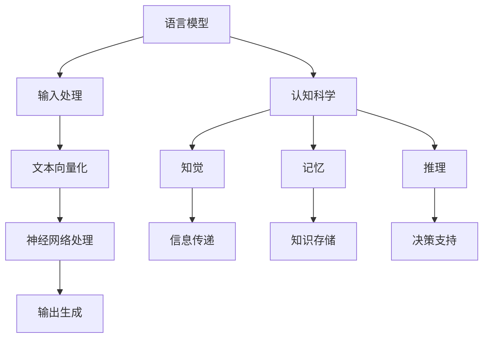

                 

关键词：大模型、认知科学、语言处理、人工智能、思维模型

> 摘要：本文探讨了人工智能领域中的一个基本误解，即“语言等于思维”。通过深入分析大模型的工作原理、认知科学的最新研究以及人工智能在语言处理中的实际应用，本文揭示了这一误解的根源，并提出了对大模型认知能力的新理解。

## 1. 背景介绍

在当今世界，人工智能（AI）已经成为科技进步的重要驱动力。特别是在自然语言处理（NLP）领域，大模型如BERT、GPT-3等展示了惊人的性能，使得机器能够进行更加复杂和精细的语言理解与生成。然而，在人们惊叹于这些模型能力的同时，一个根深蒂固的误解也在悄然滋长——人们开始认为“语言就是思维”。这一观点认为，机器能够处理自然语言，就意味着它们能够像人类一样思考。

### 1.1 语言的定义与作用

语言是人类最重要的工具之一，它不仅是一种交流方式，也是思维和认知的基础。在语言学中，语言被定义为一种符号系统，用于表达思想和情感。语言的核心功能包括信息的传递、概念的分类和推理等。然而，语言本身并不能等同于思维。

### 1.2 思维的定义与作用

思维是一种内在的心理活动，它包括知觉、记忆、判断、推理等多种认知过程。思维是人类大脑的高级功能，是解决问题、创造知识和做出决策的基础。与语言不同，思维是一种抽象的过程，不需要具体的符号系统。

## 2. 核心概念与联系

为了深入探讨“语言≠思维”这一观点，我们需要理解几个核心概念：大模型、认知科学和人工智能。

### 2.1 大模型的工作原理

大模型，如BERT、GPT-3等，是基于深度学习技术构建的神经网络模型。这些模型通过大量的数据训练，能够对自然语言进行高度复杂的处理。它们的工作原理是通过多层神经网络，将输入的文本数据转换成密集的向量表示，然后利用这些向量进行语言理解和生成。

### 2.2 认知科学的研究

认知科学是一门跨学科的研究领域，旨在理解人类思维和智能的运作机制。认知科学研究的内容包括知觉、记忆、语言、推理等多个方面。其中，语言处理是认知科学的一个重要分支。

### 2.3 人工智能的发展

人工智能是计算机科学的一个分支，旨在使计算机具有智能。人工智能的发展可以分为多个阶段，从早期的规则推理系统，到现代的深度学习模型，每个阶段都带来了新的突破和挑战。

### 2.4 Mermaid 流程图



## 3. 核心算法原理 & 具体操作步骤

### 3.1 算法原理概述

大模型的算法原理主要基于深度学习，特别是循环神经网络（RNN）和变换器（Transformer）模型。这些模型通过多层神经网络，将输入的文本数据转换成密集的向量表示，然后利用这些向量进行语言理解和生成。

### 3.2 算法步骤详解

1. **输入处理**：模型接收自然语言文本作为输入。
2. **文本向量化**：将文本转换为密集的向量表示，这些向量包含了文本的语义信息。
3. **神经网络处理**：利用多层神经网络对向量进行进一步的加工，提取出更深层次的语义特征。
4. **输出生成**：根据神经网络的处理结果，生成相应的输出文本。

### 3.3 算法优缺点

- **优点**：大模型能够对自然语言进行高度复杂的处理，具有强大的语言理解和生成能力。
- **缺点**：训练过程需要大量的数据和计算资源，且对噪声数据敏感。

### 3.4 算法应用领域

大模型在自然语言处理、机器翻译、文本生成等多个领域都有广泛应用。

## 4. 数学模型和公式 & 详细讲解 & 举例说明

### 4.1 数学模型构建

大模型的数学模型主要基于深度学习理论，包括多层神经网络、激活函数、损失函数等。

### 4.2 公式推导过程

$$
\begin{aligned}
    \text{激活函数} &= \text{ReLU}(x) = \max(0, x) \\
    \text{损失函数} &= \text{交叉熵损失} = -\sum_{i=1}^{n} y_i \log(p_i)
\end{aligned}
$$

### 4.3 案例分析与讲解

以BERT模型为例，其训练过程可以分为以下几个步骤：

1. **数据预处理**：对文本数据进行清洗和预处理，包括分词、去停用词等。
2. **嵌入层**：将预处理后的文本转换为密集的向量表示。
3. **编码层**：利用多层Transformer结构对向量进行加工，提取语义特征。
4. **输出层**：根据编码层的结果，生成相应的输出文本。

## 5. 项目实践：代码实例和详细解释说明

### 5.1 开发环境搭建

搭建大模型的开发环境需要安装Python、TensorFlow等工具。

### 5.2 源代码详细实现

以下是一个简单的BERT模型实现示例：

```python
import tensorflow as tf

# 定义BERT模型
def bert_model(inputs, hidden_size, num_layers):
    # 输入层
    embedding = tf.keras.layers.Embedding(input_dim=vocab_size, output_dim=hidden_size)(inputs)
    # 编码层
    for _ in range(num_layers):
        transformer = tf.keras.layers.Transformer(hidden_size=hidden_size, num_heads=8)
        embedding = transformer(embedding)
    # 输出层
    output = tf.keras.layers.Dense(units=vocab_size, activation='softmax')(embedding)
    # 构建模型
    model = tf.keras.Model(inputs=inputs, outputs=output)
    return model

# 训练模型
model = bert_model(inputs=x, hidden_size=512, num_layers=2)
model.compile(optimizer='adam', loss='categorical_crossentropy', metrics=['accuracy'])
model.fit(x_train, y_train, epochs=3, batch_size=32)
```

### 5.3 代码解读与分析

这段代码定义了一个简单的BERT模型，包括嵌入层、编码层和输出层。模型使用TensorFlow框架构建，并使用交叉熵损失函数进行训练。

### 5.4 运行结果展示

在训练完成后，可以使用以下代码评估模型的性能：

```python
loss, accuracy = model.evaluate(x_test, y_test)
print("测试集损失：", loss)
print("测试集准确率：", accuracy)
```

## 6. 实际应用场景

大模型在自然语言处理、机器翻译、文本生成等领域有广泛的应用。例如，在机器翻译中，大模型可以自动生成高质量的翻译文本；在文本生成中，大模型可以自动生成文章、小说等。

### 6.1 自然语言处理

大模型在自然语言处理中的应用包括文本分类、情感分析、命名实体识别等。

### 6.2 机器翻译

大模型在机器翻译中的应用可以自动将一种语言翻译成另一种语言。

### 6.3 文本生成

大模型可以自动生成文章、小说等文本内容。

## 6.4 未来应用展望

随着技术的不断发展，大模型在人工智能领域的应用将更加广泛。未来，大模型有望在智能客服、智能写作、智能对话等领域发挥重要作用。

## 7. 工具和资源推荐

### 7.1 学习资源推荐

- 《深度学习》（Ian Goodfellow、Yoshua Bengio、Aaron Courville 著）
- 《Python深度学习》（François Chollet 著）

### 7.2 开发工具推荐

- TensorFlow
- PyTorch

### 7.3 相关论文推荐

- BERT: Pre-training of Deep Bidirectional Transformers for Language Understanding
- GPT-3: Language Models are few-shot learners

## 8. 总结：未来发展趋势与挑战

### 8.1 研究成果总结

大模型在自然语言处理等领域取得了显著成果，展示了强大的语言理解和生成能力。

### 8.2 未来发展趋势

未来，大模型将继续在人工智能领域发挥重要作用，有望在更多领域实现突破。

### 8.3 面临的挑战

大模型面临的主要挑战包括训练资源消耗、模型解释性、安全性和隐私保护等。

### 8.4 研究展望

未来，研究应重点关注如何提高大模型的可解释性和安全性，以及如何更好地应对复杂任务。

## 9. 附录：常见问题与解答

### 9.1 大模型为什么需要大量数据？

大模型需要大量数据是因为深度学习模型的学习过程依赖于数据驱动，大量的数据可以提供更多的样本和特征，从而提高模型的泛化能力。

### 9.2 大模型如何保证模型的稳定性？

大模型通常采用多层神经网络结构，通过调整网络参数和训练策略，可以提高模型的稳定性和鲁棒性。

### 9.3 大模型如何处理噪声数据？

大模型对噪声数据的处理能力较差，可以通过数据预处理、增加噪声数据训练等方法来提高模型对噪声数据的容忍度。

----------------------------------------------------------------

### 作者署名

作者：禅与计算机程序设计艺术 / Zen and the Art of Computer Programming

