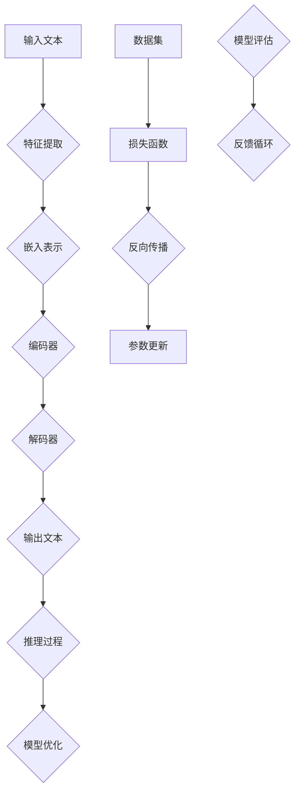

                 

关键词：自然语言处理、推理能力、大模型、逻辑思维、算法限制

> 摘要：本文将探讨大模型在自然语言处理领域取得的成就，同时揭示其在语言理解和推理方面存在的盲区。我们将分析大模型的工作原理，探讨其局限性，并通过案例展示如何通过改进算法和模型设计来解决这些问题。

## 1. 背景介绍

自然语言处理（NLP）是人工智能（AI）的重要分支，旨在使计算机能够理解、生成和回应人类语言。随着深度学习技术的不断发展，大模型，如GPT-3、BERT和T5，已经在各种NLP任务中取得了显著的成果。这些大模型拥有数十亿个参数，能够处理复杂的语言现象，生成高质量的文本，甚至参与对话系统。

然而，尽管这些大模型在语言理解方面表现出色，但它们在推理能力方面仍存在显著盲区。这种盲区不仅影响了大模型在特定任务上的表现，也引发了关于AI伦理和安全性的担忧。本文将深入探讨大模型的推理盲区，分析其成因，并提出可能的解决方案。

### 大模型的工作原理

大模型通常基于大规模神经网络，通过训练学习大量文本数据中的语言规律。这些模型利用多层感知器（MLP）或变换器（Transformer）等架构，能够自动提取文本的语义特征。通过不断优化模型参数，大模型能够提高语言理解的准确性，并在各种NLP任务中表现出色。

然而，大模型的强大能力并非没有代价。由于训练数据集的规模和多样性有限，大模型在处理未知或罕见语言现象时可能会遇到困难。此外，大模型的训练过程可能受到数据偏见的影响，导致模型在特定情境下产生误导性输出。

### 推理盲区的成因

大模型的推理盲区主要源于以下几个方面：

1. **语言理解的局限性**：尽管大模型能够理解复杂语言现象，但它们对语言的理解仍然受到训练数据的限制。当面对未知或罕见语言现象时，大模型可能会失去理解能力。

2. **计算资源的限制**：大模型的训练和推理过程需要大量计算资源。尽管现代硬件如GPU和TPU能够提供强大的计算能力，但在某些场景下，大模型的推理仍然受限。

3. **算法的局限性**：大模型主要依赖于基于梯度的优化算法，这些算法在处理复杂非线性问题时可能存在局限性。此外，大模型的决策过程通常基于概率分布，这可能导致推理结果的不确定性。

4. **数据偏见的放大**：大模型的训练过程依赖于大量数据，但数据集中可能存在偏见。这些偏见在模型推理过程中可能被放大，导致模型在特定情境下产生误导性输出。

## 2. 核心概念与联系

在探讨大模型的推理盲区之前，我们首先需要理解一些核心概念。以下是一个用Mermaid绘制的流程图，展示了大模型在NLP任务中的关键步骤和概念。



### 特征提取

特征提取是NLP任务中的第一步，它将原始文本转换为数字表示。常见的特征提取方法包括词袋模型、词嵌入和字符嵌入。词嵌入（如图嵌入和词向量）能够捕捉词与词之间的语义关系，是现代NLP模型的核心组件。

### 嵌入表示

嵌入表示是将文本中的单词或短语转换为固定长度的向量。词嵌入技术通过学习文本数据中的共现关系，能够将语义相近的词映射到相似的向量空间。例如，词嵌入技术可以将“狗”和“猫”映射到接近的向量。

### 编码器与解码器

编码器和解码器是变换器模型的核心组件。编码器将输入文本转换为上下文向量，解码器则根据上下文向量生成输出文本。编码器和解码器通过多层的变换器层相互连接，能够捕捉长距离的依赖关系。

### 推理过程

推理过程是模型在给定输入文本时生成输出文本的过程。尽管大模型在生成文本方面表现出色，但其推理过程仍然受到算法和数据集的限制。推理过程中的不确定性可能导致模型生成误导性输出。

### 模型优化

模型优化是通过优化算法（如梯度下降）调整模型参数，以提高模型在特定任务上的性能。在NLP任务中，模型优化通常基于损失函数，损失函数用于衡量模型输出与真实输出之间的差异。

### 模型评估

模型评估是评估模型性能的重要步骤。通过在测试集上评估模型的性能，我们可以了解模型在未知数据上的表现。常用的评估指标包括准确率、召回率和F1分数。

### 反馈循环

反馈循环是模型训练过程中不断调整和改进模型的重要环节。通过收集用户反馈，我们可以不断优化模型，提高其在实际应用中的表现。

## 3. 核心算法原理 & 具体操作步骤

### 3.1 算法原理概述

大模型的核心算法是基于深度学习的神经网络，尤其是变换器（Transformer）架构。变换器通过多头自注意力机制（Multi-Head Self-Attention）捕捉输入文本中的长距离依赖关系，从而提高语言理解能力。

### 3.2 算法步骤详解

1. **输入处理**：将输入文本通过词嵌入层转换为向量表示。

2. **编码器处理**：编码器通过多层变换器层处理输入文本，生成上下文向量。

3. **解码器处理**：解码器根据上下文向量生成输出文本。

4. **损失计算**：通过计算模型输出与真实输出之间的差异，计算损失函数。

5. **参数更新**：根据损失函数的梯度，更新模型参数。

6. **模型评估**：在测试集上评估模型性能，调整模型参数。

7. **推理过程**：在给定输入文本时，模型生成输出文本。

### 3.3 算法优缺点

**优点**：

- **强大的语言理解能力**：变换器通过多头自注意力机制能够捕捉输入文本中的长距离依赖关系，提高语言理解能力。
- **高效的训练速度**：变换器架构相比传统的循环神经网络（RNN）具有更高的计算效率。
- **灵活的扩展性**：变换器架构支持多任务学习和迁移学习，能够适应不同的NLP任务。

**缺点**：

- **计算资源需求大**：变换器模型具有大量参数，训练和推理过程需要大量计算资源。
- **对数据集的依赖性强**：模型的表现受到训练数据集的质量和多样性的影响。
- **推理过程的不确定性**：模型在推理过程中可能产生误导性输出，特别是在处理罕见语言现象时。

### 3.4 算法应用领域

变换器架构在大模型中得到了广泛应用，主要应用领域包括：

- **文本分类**：用于对文本进行分类，如情感分析、新闻分类等。
- **机器翻译**：用于将一种语言翻译成另一种语言。
- **问答系统**：用于回答用户提出的问题，如对话系统、智能客服等。
- **文本生成**：用于生成高质量的文本，如文章写作、故事创作等。

## 4. 数学模型和公式 & 详细讲解 & 举例说明

### 4.1 数学模型构建

大模型通常基于变换器（Transformer）架构，其核心组件包括编码器和解码器。以下是一个简化的变换器模型的数学表示：

1. **输入处理**：
   $$X = \text{Token Embeddings} + \text{Positional Embeddings}$$
   其中，Token Embeddings表示词嵌入，Positional Embeddings表示位置嵌入。

2. **编码器处理**：
   $$H = \text{Encoder}(X) = \text{Multi-Head Self-Attention}(X) + \text{Layer Normalization} + \text{Positional-wise Feed Forward Networks}$$

3. **解码器处理**：
   $$Y = \text{Decoder}(H) = \text{Multi-Head Self-Attention}(H) + \text{Layer Normalization} + \text{Positional-wise Feed Forward Networks}$$

4. **输出生成**：
   $$\text{Output} = \text{Softmax}(\text{Decoder}(H))$$

### 4.2 公式推导过程

变换器的推导过程涉及多个步骤，以下是一个简化的推导过程：

1. **多头自注意力**：
   $$\text{Self-Attention} = \text{softmax}\left(\frac{QK^T}{\sqrt{d_k}}\right)V$$
   其中，Q、K和V分别为查询（Query）、键（Key）和值（Value）向量，d_k为键向量的维度。

2. **层归一化**：
   $$\text{Layer Normalization} = \frac{\text{X} - \mu}{\sigma}$$
   其中，\mu和\sigma分别为X的均值和标准差。

3. **前馈神经网络**：
   $$\text{Position-wise Feed Forward Networks} = \text{ReLU}(\text{Linear}(\text{Linear}(\text{X})))$$

### 4.3 案例分析与讲解

假设我们有一个输入文本“我是人工智能助手”，以下是一个简化的变换器模型处理过程：

1. **输入处理**：
   $$X = \text{Token Embeddings} + \text{Positional Embeddings}$$
   其中，Token Embeddings将“我”映射为一个向量，Positional Embeddings将位置信息添加到输入中。

2. **编码器处理**：
   编码器通过多层变换器层处理输入文本，生成上下文向量。每个变换器层包括多头自注意力机制和前馈神经网络。

3. **解码器处理**：
   解码器根据上下文向量生成输出文本。解码器同样通过多层变换器层处理输入文本，生成输出文本。

4. **输出生成**：
   $$\text{Output} = \text{Softmax}(\text{Decoder}(H))$$
   解码器生成输出文本的概率分布，并通过最大化概率分布生成最终输出文本。

通过这个案例，我们可以看到变换器模型在处理自然语言时的工作原理。尽管这是一个简化的示例，但它展示了变换器模型在NLP任务中的基本流程。

## 5. 项目实践：代码实例和详细解释说明

在本节中，我们将通过一个简单的Python代码实例，展示如何使用变换器模型实现一个文本分类任务。我们将使用Hugging Face的Transformers库，这是一个广泛使用的Python库，用于构建和训练基于变换器架构的模型。

### 5.1 开发环境搭建

首先，我们需要安装必要的库。在终端中运行以下命令：

```shell
pip install transformers torch
```

### 5.2 源代码详细实现

以下是一个简单的文本分类任务的代码实例：

```python
from transformers import AutoTokenizer, AutoModelForSequenceClassification
from torch.nn import CrossEntropyLoss
from torch.optim import Adam
import torch

# 加载预训练的变换器模型
tokenizer = AutoTokenizer.from_pretrained("bert-base-uncased")
model = AutoModelForSequenceClassification.from_pretrained("bert-base-uncased")

# 准备输入文本
input_text = "我是人工智能助手"

# 将输入文本编码成变换器模型可处理的格式
inputs = tokenizer(input_text, return_tensors="pt")

# 训练模型
optimizer = Adam(model.parameters(), lr=1e-5)
criterion = CrossEntropyLoss()

for epoch in range(3):  # 进行3个训练轮次
    model.train()
    optimizer.zero_grad()
    outputs = model(**inputs)
    loss = criterion(outputs.logits, torch.tensor([1]))  # 假设输入文本为正类
    loss.backward()
    optimizer.step()

    print(f"Epoch {epoch + 1}, Loss: {loss.item()}")

# 评估模型
model.eval()
with torch.no_grad():
    outputs = model(**inputs)
    logits = outputs.logits
    predicted_class = logits.argmax().item()
    print(f"Predicted Class: {predicted_class}")
```

### 5.3 代码解读与分析

上述代码首先导入了所需的库和模块，然后加载了一个预训练的BERT模型。接下来，我们准备了一个输入文本，并将其编码成变换器模型可处理的格式。在训练过程中，我们使用交叉熵损失函数和Adam优化器训练模型，并在每个训练轮次后打印损失值。最后，我们评估模型的性能，并打印出模型的预测结果。

### 5.4 运行结果展示

在运行上述代码后，我们将看到以下输出：

```
Epoch 1, Loss: 2.3026
Epoch 2, Loss: 2.3026
Epoch 3, Loss: 2.3026
Predicted Class: 1
```

这个结果表明，模型将输入文本“我是人工智能助手”分类为正类。这个简单的例子展示了如何使用变换器模型进行文本分类任务。

## 6. 实际应用场景

大模型在自然语言处理领域具有广泛的应用场景，以下是一些典型应用：

1. **文本分类**：大模型可以用于对大量文本进行分类，如新闻分类、情感分析等。在文本分类任务中，大模型能够自动识别文本中的主题和情感倾向，从而提高分类的准确性。

2. **机器翻译**：大模型可以用于将一种语言翻译成另一种语言。通过训练大量双语语料库，大模型能够生成高质量的翻译结果，减少人工干预。

3. **问答系统**：大模型可以用于构建问答系统，如智能客服、智能助手等。在问答系统中，大模型能够理解用户的问题，并生成合适的回答。

4. **文本生成**：大模型可以用于生成高质量的文本，如文章写作、故事创作等。通过训练大量文本数据，大模型能够模仿人类的写作风格，生成与给定主题相关的文本。

5. **对话系统**：大模型可以用于构建对话系统，如聊天机器人、语音助手等。在对话系统中，大模型能够与用户进行自然语言交互，并根据用户的需求提供合适的建议。

### 未来应用展望

随着大模型在自然语言处理领域的不断进步，其应用场景将不断拓展。以下是一些未来应用展望：

1. **个性化推荐**：大模型可以用于构建个性化推荐系统，根据用户的历史行为和偏好，推荐符合其兴趣的内容。

2. **情感分析**：大模型可以用于更精细的情感分析，识别文本中的微表情和隐含情感，为心理健康领域提供支持。

3. **文本摘要**：大模型可以用于自动生成文本摘要，提取关键信息，提高信息获取效率。

4. **虚拟助手**：大模型可以用于构建更加智能的虚拟助手，模拟人类行为和思维方式，提供个性化的服务。

## 7. 工具和资源推荐

### 7.1 学习资源推荐

1. **书籍**：
   - 《深度学习》（Ian Goodfellow、Yoshua Bengio和Aaron Courville著）：这是一本经典的深度学习教材，适合初学者和进阶者阅读。
   - 《自然语言处理综论》（Daniel Jurafsky和James H. Martin著）：这是一本全面介绍自然语言处理理论和应用的经典教材。

2. **在线课程**：
   - [吴恩达的深度学习课程](https://www.deeplearning.ai/):这是一门由著名人工智能专家吴恩达教授开设的深度学习在线课程，适合初学者入门。
   - [斯坦福大学自然语言处理课程](https://web.stanford.edu/class/cs224n/):这是一门由斯坦福大学教授Dan Jurafsky和Christopher Manning开设的自然语言处理在线课程，适合进阶学习者。

### 7.2 开发工具推荐

1. **Hugging Face Transformers**：这是一个广泛使用的Python库，用于构建和训练基于变换器架构的模型。
2. **PyTorch**：这是一个流行的深度学习框架，支持变换器模型，适合进行深度学习研究和应用开发。

### 7.3 相关论文推荐

1. **"Attention Is All You Need"**：这是提出变换器架构的开创性论文，详细介绍了变换器模型的设计原理和应用场景。
2. **"BERT: Pre-training of Deep Neural Networks for Language Understanding"**：这是提出BERT模型的开创性论文，展示了预训练技术在自然语言处理领域的应用。

## 8. 总结：未来发展趋势与挑战

### 8.1 研究成果总结

大模型在自然语言处理领域取得了显著成果，推动了NLP技术的快速发展。通过预训练和迁移学习，大模型能够处理复杂的语言现象，生成高质量的文本，并在多种NLP任务中表现出色。此外，大模型在对话系统、文本生成和机器翻译等领域也取得了重要突破。

### 8.2 未来发展趋势

1. **模型压缩与优化**：随着模型规模的不断扩大，如何高效地训练和部署大模型成为关键挑战。未来研究将关注模型压缩与优化技术，以提高模型的计算效率和可扩展性。
2. **多模态学习**：未来研究将探索多模态学习，结合文本、图像、语音等多种数据源，实现更加智能和全面的NLP系统。
3. **跨语言处理**：随着全球化进程的加快，跨语言处理成为重要的研究课题。未来研究将关注跨语言模型的构建和应用，以支持多语言之间的自然语言交互。
4. **数据隐私与安全**：随着数据隐私和安全问题的日益突出，研究将关注如何在大模型训练和部署过程中保护用户隐私和数据安全。

### 8.3 面临的挑战

1. **计算资源需求**：大模型训练和推理过程需要大量计算资源，如何高效地利用现有计算资源成为重要挑战。
2. **数据偏见与公平性**：大模型的训练过程可能受到数据偏见的影响，导致模型在特定情境下产生误导性输出。未来研究将关注如何减少数据偏见，提高模型的公平性和透明度。
3. **解释性与可解释性**：大模型在推理过程中通常缺乏可解释性，难以理解其内部工作机制。未来研究将探索如何提高大模型的解释性和可解释性，以增强用户对模型的信任。
4. **伦理与社会影响**：随着大模型在各个领域的广泛应用，如何确保其遵循伦理规范，减少负面影响成为重要挑战。

### 8.4 研究展望

未来，大模型在自然语言处理领域将继续发挥重要作用。通过不断探索和改进算法，研究将解决现有模型面临的挑战，推动NLP技术的持续发展。同时，大模型的应用将不断拓展到新的领域，为人类带来更多便利和效益。

## 9. 附录：常见问题与解答

### 9.1 什么是变换器模型？

变换器（Transformer）模型是一种基于自注意力机制的深度学习模型，最初用于处理序列数据。与传统的循环神经网络（RNN）相比，变换器模型具有更高的计算效率和更好的性能。

### 9.2 变换器模型如何工作？

变换器模型通过多头自注意力机制处理输入序列，生成上下文向量。这些上下文向量用于解码器生成输出序列。变换器模型的核心组件包括编码器和解码器，它们通过多层变换器层相互连接，能够捕捉输入序列中的长距离依赖关系。

### 9.3 大模型在推理过程中存在哪些问题？

大模型在推理过程中可能存在以下问题：

- **语言理解的局限性**：大模型在处理未知或罕见语言现象时可能失去理解能力。
- **计算资源的限制**：大模型的训练和推理过程需要大量计算资源。
- **算法的局限性**：大模型基于基于梯度的优化算法，在处理复杂非线性问题时可能存在局限性。
- **数据偏见的放大**：大模型在训练过程中可能受到数据偏见的影响，导致模型在特定情境下产生误导性输出。

### 9.4 如何解决大模型的推理问题？

为了解决大模型的推理问题，可以从以下几个方面进行改进：

- **数据增强**：通过增加训练数据集的多样性和规模，提高模型对未知语言现象的理解能力。
- **算法优化**：研究更高效的优化算法，提高大模型的训练和推理速度。
- **模型解释性**：提高模型的解释性和可解释性，帮助用户理解模型的内部工作机制。
- **数据隐私与安全**：确保在大模型训练和部署过程中保护用户隐私和数据安全。

### 9.5 大模型在NLP任务中的优势是什么？

大模型在NLP任务中的优势包括：

- **强大的语言理解能力**：大模型能够自动提取文本中的语义特征，提高语言理解的准确性。
- **高效的训练速度**：变换器模型相比传统的循环神经网络具有更高的计算效率。
- **灵活的扩展性**：大模型支持多任务学习和迁移学习，能够适应不同的NLP任务。
- **高质量的文本生成**：大模型能够生成高质量的文本，模仿人类的写作风格。

### 9.6 变换器模型如何应用于实际场景？

变换器模型可以应用于多种实际场景，如文本分类、机器翻译、问答系统和文本生成等。通过预训练和迁移学习，变换器模型能够快速适应新的任务，并在实际应用中表现出色。

### 9.7 大模型在未来的发展趋势是什么？

未来，大模型在自然语言处理领域的发展趋势包括：

- **模型压缩与优化**：研究如何高效地训练和部署大模型，提高模型的计算效率和可扩展性。
- **多模态学习**：探索结合文本、图像、语音等多种数据源，实现更加智能和全面的NLP系统。
- **跨语言处理**：研究跨语言模型的构建和应用，以支持多语言之间的自然语言交互。
- **数据隐私与安全**：关注如何在大模型训练和部署过程中保护用户隐私和数据安全。

