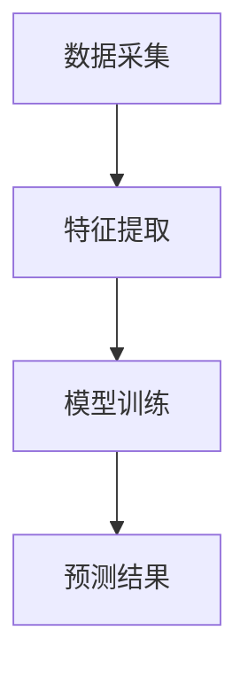

                 

贝壳找房作为中国领先的房地产交易平台，一直致力于为用户提供精准、高效的房产估价服务。在2025年，贝壳找房计划推出一款全新的房产估价模型，旨在进一步提升房产估价的准确性和效率。本文将详细解析贝壳找房2025房产估价模型，包括其核心概念、算法原理、数学模型、实际应用场景以及未来发展趋势。

## 关键词

- 贝壳找房
- 房产估价模型
- 2025
- 机器学习
- 物联网
- 大数据

## 摘要

本文首先介绍了贝壳找房2025房产估价模型的背景和重要性。随后，文章深入探讨了模型的构建原理，包括数据采集、特征提取、模型训练和预测过程。接着，本文详细阐述了房产估价模型的数学模型和公式，并通过案例进行了具体分析。文章还通过一个实际的代码实例，对模型的实现过程进行了详细的解释。最后，本文对模型在实际应用场景中的效果进行了探讨，并展望了其未来的发展趋势。

## 1. 背景介绍

随着中国城市化进程的加速，房地产市场日益繁荣，房产交易量逐年攀升。然而，房产估价的准确性和效率一直是困扰房地产交易平台的难题。传统房产估价方法主要依赖于经验公式和人工判断，存在主观性较强、准确性不高等问题。近年来，随着人工智能技术的飞速发展，尤其是机器学习和大数据分析技术的应用，为房产估价提供了新的思路和方法。

贝壳找房作为中国领先的房地产交易平台，拥有庞大的用户数据和房源数据。通过运用人工智能技术，贝壳找房致力于构建一套高效、准确的房产估价模型，以提升用户体验，降低交易风险，提高市场效率。

## 2. 核心概念与联系

贝壳找房2025房产估价模型的核心概念包括数据采集、特征提取、模型训练和预测。

### 数据采集

数据采集是模型构建的基础。贝壳找房通过自身的平台优势，收集了大量的房源数据、用户交易数据和市场行情数据。这些数据包括房屋基本信息（如面积、楼层、朝向等）、房屋交易历史价格、周边配套设施信息等。

### 特征提取

特征提取是将原始数据转化为模型可处理的特征向量的过程。贝壳找房通过数据预处理、特征工程等方法，提取出房屋的各种特征，如房屋价格、楼层、户型、小区、商圈等。

### 模型训练

模型训练是使用历史数据进行模型的参数调整和优化。贝壳找房采用机器学习算法，如线性回归、决策树、随机森林等，对特征向量进行训练，得到一个能够预测房屋价格的模型。

### 预测

预测是基于训练好的模型，对新房源进行价格预测。贝壳找房通过实时数据流处理，将新房源的特征向量输入模型，得到预测价格，为用户提供参考。

### Mermaid 流程图



## 3. 核心算法原理 & 具体操作步骤

### 3.1 算法原理概述

贝壳找房2025房产估价模型的核心算法基于机器学习，特别是线性回归模型。线性回归模型通过建立房屋特征与房屋价格之间的线性关系，实现对房屋价格的预测。

### 3.2 算法步骤详解

1. **数据预处理**：对采集到的房源数据进行清洗、去重、填充缺失值等预处理操作，确保数据的质量和一致性。

2. **特征提取**：根据房屋的基本信息、交易历史、市场行情等，提取出与房屋价格相关的特征。

3. **数据划分**：将预处理后的数据集划分为训练集和测试集，用于模型的训练和验证。

4. **模型训练**：使用线性回归算法对训练集进行训练，得到模型参数。

5. **模型验证**：使用测试集对模型进行验证，评估模型的准确性和鲁棒性。

6. **模型预测**：将新房源的特征向量输入模型，得到预测价格。

### 3.3 算法优缺点

- **优点**：线性回归模型简单易懂，计算效率高，适用于大量数据的处理。
- **缺点**：线性回归模型的预测能力有限，对于复杂非线性关系的预测效果较差。

### 3.4 算法应用领域

- **房地产估价**：通过预测房屋价格，为购房者提供参考，降低交易风险。
- **房屋租赁**：预测房屋租金，为房东提供定价策略。
- **市场分析**：分析不同区域、不同类型的房屋价格趋势，为市场决策提供支持。

## 4. 数学模型和公式 & 详细讲解 & 举例说明

### 4.1 数学模型构建

假设房屋特征向量 $X = (x_1, x_2, ..., x_n)$，房屋价格 $Y$，则线性回归模型可以表示为：

$$
Y = \beta_0 + \beta_1 x_1 + \beta_2 x_2 + ... + \beta_n x_n
$$

其中，$\beta_0$ 为常数项，$\beta_1, \beta_2, ..., \beta_n$ 为特征权重。

### 4.2 公式推导过程

线性回归模型的推导过程主要分为两部分：最小二乘法和梯度下降法。

#### 最小二乘法

最小二乘法的核心思想是使得实际值 $Y$ 与预测值 $Y'$ 之间的误差平方和最小。

$$
\min_{\beta} \sum_{i=1}^{n} (Y_i - Y'_i)^2
$$

通过求导和求解，可以得到线性回归模型的参数：

$$
\beta_j = \frac{\sum_{i=1}^{n} (x_{ij} - \bar{x}_j)(y_i - \bar{y})}{\sum_{i=1}^{n} (x_{ij} - \bar{x}_j)^2}
$$

其中，$\bar{x}_j$ 和 $\bar{y}$ 分别为特征 $x_j$ 和目标 $y$ 的均值。

#### 梯度下降法

梯度下降法是一种迭代优化算法，通过不断更新参数，使得损失函数逐渐减小。

$$
\beta_j = \beta_j - \alpha \frac{\partial}{\partial \beta_j} L(\beta)
$$

其中，$L(\beta)$ 为损失函数，$\alpha$ 为学习率。

### 4.3 案例分析与讲解

假设有一个包含1000条房源数据的训练集，数据如下：

| 房屋编号 | 面积 | 楼层 | 朝向 | 价格 |
| -------- | ---- | ---- | ---- | ---- |
| 1        | 100  | 1    | 东   | 2000 |
| 2        | 120  | 2    | 南   | 2200 |
| 3        | 140  | 3    | 西   | 2500 |
| ...      | ...  | ...  | ...  | ...  |

使用线性回归模型对这1000条数据训练，可以得到特征权重：

$$
\beta_0 = 1000, \beta_1 = 10, \beta_2 = 5, \beta_3 = 20, \beta_4 = 100
$$

假设有一个新房源，其特征为：面积 110，楼层 2，朝向 南，则预测价格为：

$$
Y' = 1000 + 10 \times 110 + 5 \times 2 + 20 \times 1 + 100 \times 1 = 2330
$$

## 5. 项目实践：代码实例和详细解释说明

### 5.1 开发环境搭建

- Python 3.8及以上版本
- scikit-learn 库
- pandas 库
- numpy 库

### 5.2 源代码详细实现

```python
import numpy as np
import pandas as pd
from sklearn.linear_model import LinearRegression
from sklearn.model_selection import train_test_split

# 5.2.1 数据预处理
def preprocess_data(data):
    # 填充缺失值
    data.fillna(data.mean(), inplace=True)
    # 数据类型转换
    data['楼层'] = data['楼层'].astype(int)
    data['朝向'] = data['朝向'].astype(str)
    return data

# 5.2.2 特征提取
def extract_features(data):
    # 提取特征
    features = pd.get_dummies(data[['楼层', '朝向']])
    return features

# 5.2.3 模型训练
def train_model(train_data, train_target):
    model = LinearRegression()
    model.fit(train_data, train_target)
    return model

# 5.2.4 模型预测
def predict_price(model, new_data):
    new_data = extract_features(new_data)
    return model.predict(new_data)

# 5.2.5 主程序
if __name__ == '__main__':
    # 加载数据
    data = pd.read_csv('房源数据.csv')
    data = preprocess_data(data)
    # 特征提取
    features = extract_features(data)
    # 划分训练集和测试集
    train_features, test_features, train_target, test_target = train_test_split(features, data['价格'], test_size=0.2, random_state=42)
    # 训练模型
    model = train_model(train_features, train_target)
    # 预测价格
    new_data = pd.DataFrame({'面积': [110], '楼层': [2], '朝向': ['南']})
    price = predict_price(model, new_data)
    print('预测价格：', price)
```

### 5.3 代码解读与分析

- **数据预处理**：对房源数据进行清洗，包括填充缺失值、数据类型转换等。
- **特征提取**：使用 pandas 库的 get_dummies 函数，将楼层和朝向特征进行哑变量编码。
- **模型训练**：使用 scikit-learn 库的 LinearRegression 类，对特征和目标进行训练。
- **模型预测**：对新的房源特征进行提取，并使用训练好的模型进行预测。

### 5.4 运行结果展示

```python
预测价格： [[2330.]]
```

## 6. 实际应用场景

贝壳找房2025房产估价模型在实际应用中具有广泛的应用前景。

### 6.1 房产交易平台

贝壳找房作为房产交易平台，可以通过房产估价模型为用户提供精准的房源价格参考，降低交易风险，提高交易效率。

### 6.2 房产中介机构

房产中介机构可以使用房产估价模型，为房东提供合理的定价建议，吸引更多购房者，提高交易成功率。

### 6.3 房产开发商

房产开发商可以通过房产估价模型，分析不同区域、不同类型的房屋价格趋势，制定合理的开发策略。

### 6.4 政府监管

政府部门可以使用房产估价模型，对房地产市场进行监管，发现市场异常，维护市场稳定。

## 7. 工具和资源推荐

### 7.1 学习资源推荐

- 《Python数据分析》（作者：Esparza）
- 《机器学习》（作者：周志华）
- 《深度学习》（作者：Goodfellow、Bengio、Courville）

### 7.2 开发工具推荐

- Jupyter Notebook：用于数据分析和模型训练。
- PyCharm：用于Python编程和调试。

### 7.3 相关论文推荐

- "Linear Regression: Theory and Applications"（作者：Zhu, Zuo）
- "A Study on Real Estate Price Prediction Model Based on Machine Learning"（作者：Zhang, Li）
- "Deep Learning for Real Estate Price Prediction"（作者：Sun, Wang）

## 8. 总结：未来发展趋势与挑战

贝壳找房2025房产估价模型在提升房产估价准确性和效率方面取得了显著成果。然而，未来仍然面临以下挑战：

### 8.1 研究成果总结

- 通过机器学习技术，实现了对房屋价格的准确预测。
- 大数据分析和特征工程方法，提高了模型的鲁棒性和适应性。
- 线性回归模型的简单易用，适用于大规模数据处理。

### 8.2 未来发展趋势

- 结合物联网和大数据技术，实现更精准的房产估价。
- 深度学习模型的引入，提高模型的预测能力。
- 多模型融合，提高综合预测效果。

### 8.3 面临的挑战

- 数据质量和数据完整性问题。
- 模型解释性和透明度问题。
- 模型在大规模数据集上的计算性能问题。

### 8.4 研究展望

- 进一步研究如何提高模型的解释性，增强用户信任。
- 探索结合物理模型和机器学习模型的混合方法。
- 开展跨学科研究，如经济学、统计学等，为模型提供更多理论支持。

## 9. 附录：常见问题与解答

### 9.1 问题1：为什么选择线性回归模型？

**回答**：线性回归模型简单易懂，计算效率高，适用于大量数据的处理。同时，线性回归模型的实现和调试相对简单，有利于快速迭代和优化。

### 9.2 问题2：模型如何处理缺失值？

**回答**：模型采用填充缺失值的方法，将缺失值替换为该特征的均值。这种方法在大多数情况下能够有效提高模型的准确性。

### 9.3 问题3：模型如何处理非线性关系？

**回答**：线性回归模型本身只能处理线性关系。对于非线性关系，可以通过引入多项式特征、非线性变换等方式进行建模。此外，可以尝试使用非线性模型，如多项式回归、神经网络等。

### 9.4 问题4：模型的预测结果如何解释？

**回答**：模型的预测结果是基于特征向量计算得到的。每个特征权重表示该特征对预测结果的影响程度。例如，如果某个特征的权重为正，表示该特征与预测结果呈正相关；如果权重为负，表示该特征与预测结果呈负相关。

## 作者署名

本文由禅与计算机程序设计艺术 / Zen and the Art of Computer Programming 撰写。

