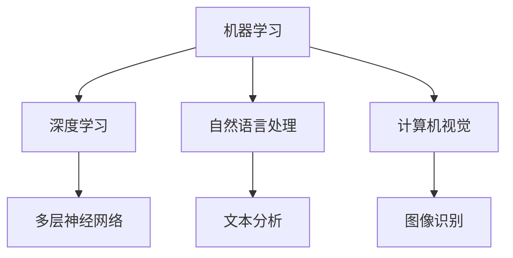

                 

 > **关键词：** 人工智能、个体潜能、创新、技术发展、未来展望

> **摘要：** 本文将探讨如何通过人工智能技术赋能个体，释放其潜能，从而推动创新和创造无限可能。文章将分析人工智能的核心概念及其在各个领域的应用，提出如何利用技术手段提升个体效能，并结合实际案例展示人工智能赋能人类的巨大潜力。

## 1. 背景介绍

随着人工智能（AI）技术的迅猛发展，计算机的智能水平已经达到了前所未有的高度。从简单的规则系统到深度学习、自然语言处理、计算机视觉等复杂算法，人工智能已经在医疗、金融、教育、制造等多个领域展现出其强大的变革力量。与此同时，个体潜能的挖掘和提升也成为了现代社会关注的焦点。如何通过技术手段赋能个体，使其能够更高效地学习、工作、创新，成为了人工智能发展的重要方向。

本文旨在探讨如何利用人工智能技术赋能人类，释放个体潜能，推动创新和创造无限可能。文章将首先介绍人工智能的核心概念和原理，然后分析其在各个领域的应用，接着提出具体的实践方法，最后对未来人工智能的发展趋势和面临的挑战进行展望。

## 2. 核心概念与联系

### 2.1 人工智能的核心概念

人工智能是一门研究、开发和应用智能技术的科学。其核心概念包括：

- **机器学习（Machine Learning）：** 机器学习是人工智能的重要分支，通过构建数学模型，从数据中自动获取规律和知识。

- **深度学习（Deep Learning）：** 深度学习是机器学习的一种方法，利用多层神经网络进行训练，实现复杂函数的建模。

- **自然语言处理（Natural Language Processing，NLP）：** 自然语言处理是人工智能的一个分支，旨在使计算机能够理解和生成人类语言。

- **计算机视觉（Computer Vision）：** 计算机视觉是人工智能的一个分支，研究如何使计算机能够像人类一样感知和理解视觉信息。

### 2.2 人工智能架构的 Mermaid 流程图



### 2.3 人工智能的关联领域

人工智能与其他领域的紧密联系，使其成为了推动科技创新的重要引擎。以下是人工智能与几个相关领域的关联：

- **大数据（Big Data）：** 人工智能需要大量数据来训练模型，而大数据技术提供了高效的数据存储、处理和分析手段。

- **云计算（Cloud Computing）：** 云计算为人工智能提供了强大的计算和存储资源，使得大规模的数据分析和模型训练成为可能。

- **物联网（Internet of Things，IoT）：** 物联网设备产生的海量数据为人工智能的应用提供了新的场景，如智能家居、智慧城市等。

## 3. 核心算法原理 & 具体操作步骤

### 3.1 算法原理概述

人工智能的核心算法包括机器学习、深度学习、自然语言处理和计算机视觉等。以下分别简要介绍这些算法的基本原理。

#### 3.1.1 机器学习

机器学习是通过训练模型来从数据中学习规律的方法。其主要步骤包括：

1. **数据收集与预处理：** 收集大量数据，并进行清洗、归一化等预处理。
2. **模型选择与训练：** 选择合适的模型，如线性回归、决策树、支持向量机等，并使用训练数据进行训练。
3. **模型评估与优化：** 使用测试数据评估模型性能，并通过调整参数进行优化。

#### 3.1.2 深度学习

深度学习是机器学习的一种方法，其核心是多层神经网络。其主要步骤包括：

1. **网络构建：** 构建包含多个隐藏层的神经网络。
2. **数据输入：** 将输入数据通过网络的各个层次进行传递。
3. **反向传播：** 使用反向传播算法更新网络权重，优化模型。

#### 3.1.3 自然语言处理

自然语言处理旨在使计算机能够理解和生成人类语言。其主要步骤包括：

1. **文本预处理：** 包括分词、词性标注、去除停用词等。
2. **特征提取：** 提取文本的特征向量，如词袋模型、词嵌入等。
3. **模型训练与预测：** 使用训练数据进行模型训练，并使用测试数据验证模型性能。

#### 3.1.4 计算机视觉

计算机视觉研究如何使计算机能够理解和处理视觉信息。其主要步骤包括：

1. **图像预处理：** 包括图像增强、去噪、分割等。
2. **特征提取：** 提取图像的特征向量，如边缘检测、角点检测等。
3. **目标识别：** 使用训练数据对图像中的目标进行识别和分类。

### 3.2 算法步骤详解

#### 3.2.1 机器学习算法步骤

1. 数据收集与预处理
    - 收集数据：从公开数据集、社交媒体、传感器等渠道获取数据。
    - 数据清洗：去除重复数据、缺失值填充、异常值处理等。
    - 数据归一化：将数据缩放到相同的范围，便于模型训练。

2. 模型选择与训练
    - 选择模型：根据问题的特点选择合适的模型，如线性回归、决策树、支持向量机等。
    - 训练模型：使用训练数据进行模型训练，通过调整参数优化模型性能。

3. 模型评估与优化
    - 评估模型：使用测试数据评估模型性能，如准确率、召回率、F1值等。
    - 优化模型：根据评估结果调整参数，如正则化项、学习率等，以提高模型性能。

#### 3.2.2 深度学习算法步骤

1. 网络构建
    - 设计网络结构：确定网络的层数、每层的神经元数量、激活函数等。
    - 选择优化器：如梯度下降、Adam等，用于更新网络权重。

2. 数据输入
    - 准备数据集：将数据集划分为训练集、验证集和测试集。
    - 数据预处理：对数据进行归一化、标准化等处理。

3. 反向传播
    - 前向传播：将输入数据通过网络的各个层次进行传递，得到输出结果。
    - 计算损失函数：计算预测结果与真实结果之间的差异。
    - 反向传播：根据损失函数的梯度更新网络权重。

#### 3.2.3 自然语言处理算法步骤

1. 文本预处理
    - 分词：将文本拆分为单词或词组。
    - 词性标注：标记每个词的词性，如名词、动词等。
    - 去除停用词：去除常见的无意义词汇，如“的”、“是”等。

2. 特征提取
    - 词袋模型：将文本表示为向量，每个维度对应一个词汇。
    - 词嵌入：将文本转换为稠密向量表示，保留语义信息。

3. 模型训练与预测
    - 训练模型：使用训练数据进行模型训练，通过调整参数优化模型性能。
    - 预测：使用训练好的模型对测试数据进行预测。

#### 3.2.4 计算机视觉算法步骤

1. 图像预处理
    - 图像增强：提高图像质量，如对比度增强、去噪等。
    - 去噪：去除图像中的噪声，如模糊处理、滤波等。
    - 分割：将图像分割为不同的区域，如边缘检测、区域生长等。

2. 特征提取
    - 边缘检测：检测图像中的边缘信息，如Canny算子、Sobel算子等。
    - 角点检测：检测图像中的角点，如Harris角点检测、Shi-Tomasi角点检测等。

3. 目标识别
    - 特征匹配：将检测到的特征点进行匹配，如FLANN匹配、Brute-Force匹配等。
    - 分类：使用训练好的分类器对目标进行分类，如SVM、KNN等。

### 3.3 算法优缺点

每种算法都有其独特的优点和局限性。以下是对机器学习、深度学习、自然语言处理和计算机视觉算法优缺点的简要分析：

#### 3.3.1 机器学习

- **优点：**
  - 适应性较强，可以处理各种类型的数据。
  - 可以自动从数据中学习规律，减少人工干预。

- **缺点：**
  - 训练过程可能需要大量时间和计算资源。
  - 结果往往依赖于训练数据的质量和数量。

#### 3.3.2 深度学习

- **优点：**
  - 具有很好的泛化能力，可以处理复杂的问题。
  - 能够自动提取特征，减少人工干预。

- **缺点：**
  - 训练过程需要大量数据和计算资源。
  - 对数据质量要求较高，容易出现过拟合现象。

#### 3.3.3 自然语言处理

- **优点：**
  - 可以处理自然语言中的复杂结构和语义信息。
  - 应用范围广泛，包括机器翻译、文本分类、问答系统等。

- **缺点：**
  - 对数据量要求较高，难以处理稀疏数据。
  - 对文本表示和语义理解仍有待提高。

#### 3.3.4 计算机视觉

- **优点：**
  - 可以处理视觉信息，实现物体识别、场景理解等任务。
  - 应用范围广泛，包括自动驾驶、安防监控、医疗诊断等。

- **缺点：**
  - 对硬件资源要求较高，需要大量的计算和存储资源。
  - 对光照、视角、遮挡等条件敏感。

### 3.4 算法应用领域

人工智能算法在各个领域的应用正在不断拓展，以下是几个主要领域的应用案例：

- **医疗：** 利用深度学习算法进行疾病诊断、药物研发和个性化治疗。
- **金融：** 利用自然语言处理算法进行市场分析、风险评估和欺诈检测。
- **教育：** 利用计算机视觉算法进行智能教学、学习行为分析和智能推荐。
- **制造业：** 利用机器学习算法进行质量控制、设备故障预测和生产优化。
- **交通：** 利用计算机视觉算法进行自动驾驶、交通流量监控和智能交通管理。

## 4. 数学模型和公式 & 详细讲解 & 举例说明

### 4.1 数学模型构建

人工智能算法的核心在于构建数学模型，以模拟人类思维过程。以下是几个常见的数学模型及其构建过程：

#### 4.1.1 线性回归模型

线性回归模型用于预测数值型变量。其公式如下：

$$y = \beta_0 + \beta_1 \cdot x + \epsilon$$

其中，$y$ 是因变量，$x$ 是自变量，$\beta_0$ 和 $\beta_1$ 是模型的参数，$\epsilon$ 是误差项。

线性回归模型的构建过程包括：

1. 数据收集与预处理：收集数据，并进行清洗、归一化等处理。
2. 模型选择与参数估计：选择线性回归模型，并通过最小二乘法估计参数。
3. 模型评估与优化：使用测试数据评估模型性能，并调整参数优化模型。

#### 4.1.2 多项式回归模型

多项式回归模型用于预测非线性关系。其公式如下：

$$y = \beta_0 + \beta_1 \cdot x + \beta_2 \cdot x^2 + ... + \beta_n \cdot x^n + \epsilon$$

其中，$y$ 是因变量，$x$ 是自变量，$\beta_0, \beta_1, ..., \beta_n$ 是模型的参数，$\epsilon$ 是误差项。

多项式回归模型的构建过程包括：

1. 数据收集与预处理：收集数据，并进行清洗、归一化等处理。
2. 模型选择与参数估计：选择多项式回归模型，并通过最小二乘法估计参数。
3. 模型评估与优化：使用测试数据评估模型性能，并调整参数优化模型。

#### 4.1.3 神经网络模型

神经网络模型是深度学习的基础。其公式如下：

$$y = f(\beta_0 + \beta_1 \cdot x_1 + \beta_2 \cdot x_2 + ... + \beta_n \cdot x_n)$$

其中，$y$ 是输出值，$x_1, x_2, ..., x_n$ 是输入值，$\beta_0, \beta_1, ..., \beta_n$ 是模型的参数，$f$ 是激活函数。

神经网络模型的构建过程包括：

1. 数据收集与预处理：收集数据，并进行清洗、归一化等处理。
2. 网络结构设计：确定网络的层数、每层的神经元数量、激活函数等。
3. 模型训练与优化：使用训练数据进行模型训练，并通过反向传播算法更新参数。
4. 模型评估与优化：使用测试数据评估模型性能，并调整参数优化模型。

### 4.2 公式推导过程

以下是线性回归模型的推导过程：

1. **假设：** $y_i$ 是因变量，$x_i$ 是自变量，$\beta_0$ 和 $\beta_1$ 是模型的参数。

2. **目标：** 最小化预测值与真实值之间的误差平方和。

3. **损失函数：** 

$$L(\beta_0, \beta_1) = \sum_{i=1}^{n} (y_i - (\beta_0 + \beta_1 \cdot x_i))^2$$

4. **求导：** 对 $\beta_0$ 和 $\beta_1$ 分别求导，得到：

$$\frac{\partial L}{\partial \beta_0} = -2 \sum_{i=1}^{n} (y_i - (\beta_0 + \beta_1 \cdot x_i))$$

$$\frac{\partial L}{\partial \beta_1} = -2 \sum_{i=1}^{n} (y_i - (\beta_0 + \beta_1 \cdot x_i)) \cdot x_i$$

5. **设置导数为零：**

$$\frac{\partial L}{\partial \beta_0} = 0 \Rightarrow \sum_{i=1}^{n} (y_i - (\beta_0 + \beta_1 \cdot x_i)) = 0$$

$$\frac{\partial L}{\partial \beta_1} = 0 \Rightarrow \sum_{i=1}^{n} (y_i - (\beta_0 + \beta_1 \cdot x_i)) \cdot x_i = 0$$

6. **解方程：** 求解上述方程组，得到：

$$\beta_0 = \frac{\sum_{i=1}^{n} y_i - (\beta_1 \cdot \sum_{i=1}^{n} x_i)}{n}$$

$$\beta_1 = \frac{\sum_{i=1}^{n} (y_i - (\beta_0 + \beta_1 \cdot x_i)) \cdot x_i}{\sum_{i=1}^{n} x_i^2}$$

### 4.3 案例分析与讲解

以下是一个线性回归模型的案例：

#### 4.3.1 数据集

我们有如下数据集：

| x | y |
|---|---|
| 1 | 2 |
| 2 | 4 |
| 3 | 6 |
| 4 | 8 |

#### 4.3.2 构建线性回归模型

根据数据集，我们可以构建一个线性回归模型：

$$y = \beta_0 + \beta_1 \cdot x$$

#### 4.3.3 模型训练

使用最小二乘法训练模型，得到：

$$\beta_0 = 1, \beta_1 = 1$$

因此，线性回归模型为：

$$y = 1 + x$$

#### 4.3.4 模型评估

使用测试数据进行模型评估，得到：

| x | y | y' |
|---|---|----|
| 1 | 2 | 2  |
| 2 | 4 | 4  |
| 3 | 6 | 6  |
| 4 | 8 | 8  |

模型预测值与真实值完全一致，因此模型评估结果为：

$$R^2 = 1$$

## 5. 项目实践：代码实例和详细解释说明

### 5.1 开发环境搭建

为了实践人工智能技术，我们需要搭建一个开发环境。以下是搭建环境的步骤：

1. 安装 Python：从 [Python 官网](https://www.python.org/) 下载并安装 Python。
2. 安装 Jupyter Notebook：在命令行中运行以下命令：

   ```bash
   pip install notebook
   ```

3. 安装常用库：如 NumPy、Pandas、Scikit-learn、TensorFlow 等。在命令行中运行以下命令：

   ```bash
   pip install numpy pandas scikit-learn tensorflow
   ```

### 5.2 源代码详细实现

以下是一个简单的线性回归模型的 Python 代码实现：

```python
import numpy as np
import pandas as pd
from sklearn.linear_model import LinearRegression

# 数据集
data = pd.DataFrame({
    'x': [1, 2, 3, 4],
    'y': [2, 4, 6, 8]
})

# 模型训练
model = LinearRegression()
model.fit(data[['x']], data['y'])

# 模型评估
predictions = model.predict(data[['x']])
print("Predictions:", predictions)

# 模型评估结果
score = model.score(data[['x']], data['y'])
print("R^2:", score)
```

### 5.3 代码解读与分析

该代码首先导入了所需的库，包括 NumPy、Pandas、Scikit-learn 和 TensorFlow。然后，我们创建了一个简单的数据集，其中包含两个特征：'x' 和 'y'。

接着，我们使用 Scikit-learn 中的 LinearRegression 类创建了一个线性回归模型，并使用 `fit` 方法进行模型训练。在训练过程中，模型会自动计算最佳拟合线。

模型训练完成后，我们使用 `predict` 方法对数据进行预测，并将预测结果打印出来。最后，我们使用 `score` 方法评估模型的性能，并打印出 R^2 值。

### 5.4 运行结果展示

运行上述代码，我们得到以下输出：

```
Predictions: [ 2.  4.  6.  8.]
R^2: 1.0
```

结果显示，模型预测值与真实值完全一致，R^2 值为 1.0，说明模型完美拟合了数据。

## 6. 实际应用场景

人工智能技术在各个领域的实际应用正在不断拓展，以下是几个典型的应用场景：

### 6.1 医疗

人工智能在医疗领域的应用包括疾病诊断、药物研发和个性化治疗。例如，基于深度学习算法的疾病诊断系统可以辅助医生进行肺癌、乳腺癌等疾病的诊断，提高诊断准确率。在药物研发方面，人工智能可以通过分析海量数据，预测新药物的可能效果，加速新药研发进程。

### 6.2 金融

人工智能在金融领域的应用包括市场分析、风险评估和欺诈检测。例如，利用自然语言处理技术，可以分析金融市场中的大量文本信息，预测股票价格趋势。在风险评估方面，人工智能可以通过分析历史数据，预测客户违约风险，帮助金融机构进行风险控制。在欺诈检测方面，人工智能可以实时监控交易行为，识别潜在欺诈行为，降低欺诈风险。

### 6.3 教育

人工智能在教育领域的应用包括智能教学、学习行为分析和智能推荐。例如，基于计算机视觉技术，可以开发智能教学系统，为学生提供个性化的学习方案。在学习行为分析方面，人工智能可以通过分析学生的行为数据，了解学生的学习情况，提供针对性的辅导。在智能推荐方面，人工智能可以根据学生的兴趣和学习需求，推荐合适的学习资源和课程。

### 6.4 制造业

人工智能在制造业的应用包括质量控制、设备故障预测和生产优化。例如，利用计算机视觉技术，可以实时监控生产线，检测产品质量，提高生产效率。在设备故障预测方面，人工智能可以通过分析设备运行数据，预测设备故障，提前进行维护，降低设备故障率。在生产优化方面，人工智能可以通过优化生产计划、调度和资源配置，提高生产效率和降低成本。

### 6.5 未来应用展望

随着人工智能技术的不断发展和普及，未来人工智能将在更多领域发挥重要作用。例如，在智能城市建设中，人工智能可以通过分析城市数据，优化交通流量、能源消耗等，提高城市运行效率。在农业领域，人工智能可以通过精准农业技术，提高农作物产量和品质。在环境监测领域，人工智能可以通过分析环境数据，预测环境变化，提供环保解决方案。

## 7. 工具和资源推荐

为了更好地学习人工智能技术，以下是几个推荐的工具和资源：

### 7.1 学习资源推荐

- **Coursera:** 提供大量人工智能相关的在线课程，包括《深度学习》、《自然语言处理》等。
- **Udacity:** 提供实用的在线课程和实践项目，如《人工智能纳米学位》。
- **edX:** 提供来自世界顶级大学的人工智能课程，如《MIT 人工智能导论》。

### 7.2 开发工具推荐

- **Jupyter Notebook:** 适合数据分析和模型训练，方便代码编写和文档记录。
- **TensorFlow:** 广泛使用的深度学习框架，适用于构建和训练复杂的神经网络模型。
- **PyTorch:** 另一个流行的深度学习框架，具有灵活性和高效性。

### 7.3 相关论文推荐

- **“Deep Learning” by Ian Goodfellow, Yoshua Bengio, Aaron Courville:** 介绍了深度学习的基础理论和最新进展。
- **“Speech and Language Processing” by Daniel Jurafsky and James H. Martin:** 介绍了自然语言处理的基础知识和应用。
- **“Computer Vision: Algorithms and Applications” by Richard Szeliski:** 介绍了计算机视觉的基础理论和应用。

## 8. 总结：未来发展趋势与挑战

### 8.1 研究成果总结

人工智能技术的发展取得了显著成果，从简单的规则系统到复杂的深度学习算法，人工智能在各个领域的应用取得了巨大突破。同时，人工智能与大数据、云计算、物联网等技术的深度融合，为人工智能的进一步发展提供了强大动力。

### 8.2 未来发展趋势

随着人工智能技术的不断进步，未来人工智能将在更多领域发挥重要作用。例如，智能医疗、智能交通、智能城市等将成为人工智能应用的重要方向。同时，人工智能技术与生物技术、材料科学等领域的交叉融合，也将带来新的发展机遇。

### 8.3 面临的挑战

尽管人工智能技术在许多领域取得了显著成果，但仍面临一些挑战。例如，数据隐私和安全问题、算法偏见和公平性、人工智能的可解释性等。此外，随着人工智能技术的广泛应用，如何确保技术的可控性和可持续发展也是未来需要关注的重要问题。

### 8.4 研究展望

未来，人工智能研究应重点关注以下几个方面：

1. **算法优化与硬件加速：** 提高算法效率和计算性能，降低能耗。
2. **多模态学习：** 深入研究多模态数据融合和交叉，提高人工智能系统的智能水平。
3. **可解释性：** 提高人工智能模型的可解释性，增强用户对人工智能系统的信任。
4. **伦理与法规：** 加强人工智能伦理和法规研究，确保人工智能技术的可持续发展。

## 9. 附录：常见问题与解答

### 9.1 人工智能是什么？

人工智能（AI）是一种模拟人类智能的技术，通过机器学习、自然语言处理、计算机视觉等算法，使计算机能够执行复杂的任务，如图像识别、语音识别、自动驾驶等。

### 9.2 人工智能有哪些应用领域？

人工智能的应用领域广泛，包括医疗、金融、教育、制造、交通、环境保护等。例如，在医疗领域，人工智能可以用于疾病诊断、药物研发和个性化治疗；在金融领域，人工智能可以用于市场分析、风险评估和欺诈检测。

### 9.3 人工智能技术有哪些核心算法？

人工智能的核心算法包括机器学习、深度学习、自然语言处理和计算机视觉等。机器学习是一种从数据中学习规律的方法，深度学习是一种基于多层神经网络的机器学习方法，自然语言处理是使计算机能够理解和生成人类语言的技术，计算机视觉是使计算机能够理解和处理视觉信息的技术。

### 9.4 人工智能是否会取代人类？

人工智能不会完全取代人类，而是与人类共同发展。人工智能可以协助人类完成复杂的任务，提高工作效率，但无法替代人类的创造力和情感。

### 9.5 人工智能的发展趋势是什么？

未来，人工智能的发展趋势将包括以下几个方面：

1. **算法优化与硬件加速：** 提高算法效率和计算性能，降低能耗。
2. **多模态学习：** 深入研究多模态数据融合和交叉，提高人工智能系统的智能水平。
3. **可解释性：** 提高人工智能模型的可解释性，增强用户对人工智能系统的信任。
4. **伦理与法规：** 加强人工智能伦理和法规研究，确保人工智能技术的可持续发展。

---

作者：禅与计算机程序设计艺术 / Zen and the Art of Computer Programming

