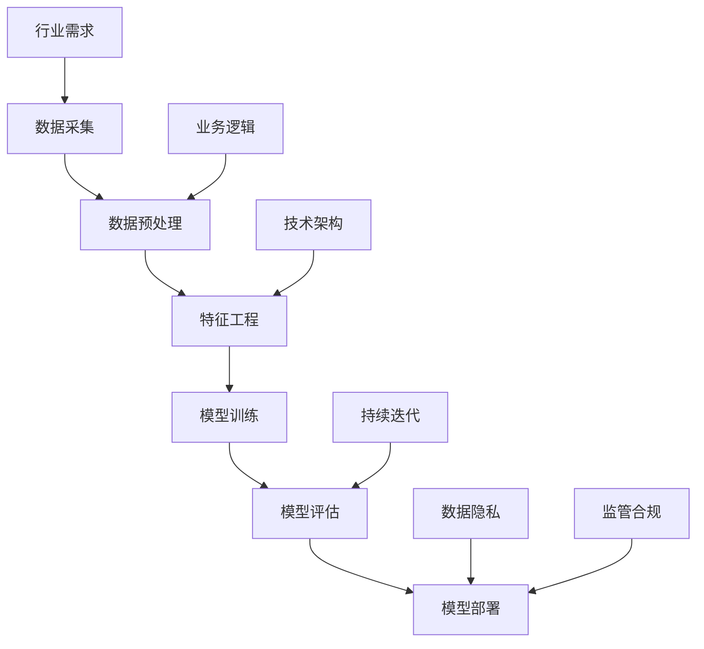

                 

关键词：跨行业AI，最佳实践，案例库，Lepton AI，技术实施，应用场景，未来展望

摘要：本文将探讨跨行业AI最佳实践，并以Lepton AI的案例库为例，深入分析其在不同行业中的应用和挑战，为企业和开发者提供有价值的参考。

## 1. 背景介绍

随着人工智能技术的不断发展，AI已经渗透到各行各业，从金融、医疗到制造业、零售业等，都在借助AI技术提升效率和创新能力。然而，不同行业对AI的需求和实施方法存在较大差异，如何在跨行业中找到最佳实践成为一个重要课题。本文将以Lepton AI的案例库为蓝本，探讨跨行业AI的最佳实践。

### 1.1 Lepton AI简介

Lepton AI是一家专注于人工智能解决方案的公司，其案例库涵盖了多个行业，包括金融、医疗、零售等。通过这些案例，Lepton AI展示了如何在不同行业中成功应用AI技术，为企业和开发者提供了有价值的参考。

### 1.2 跨行业AI的重要性

跨行业AI的最佳实践对于企业和开发者来说至关重要。它不仅有助于发现不同行业中的AI应用机会，还能为各行业提供可行的解决方案，提升行业整体竞争力。

## 2. 核心概念与联系

在探讨跨行业AI最佳实践之前，我们需要了解一些核心概念和它们之间的联系。以下是相关的Mermaid流程图：



### 2.1 数据采集与预处理

数据是AI模型的基石。数据采集和预处理是确保模型性能的关键步骤。行业需求决定了需要采集哪些数据，而业务逻辑则指导数据预处理的方法。

### 2.2 特征工程

特征工程是将原始数据转化为适合模型训练的特征的过程。技术架构决定了特征工程的工具和方法。

### 2.3 模型训练与评估

模型训练和评估是AI实施的核心步骤。模型训练需要大量的数据和高性能计算资源，而评估则需考虑模型在不同业务场景下的表现。

### 2.4 模型部署与持续迭代

模型部署是将训练好的模型应用到实际业务中，并持续迭代以提升模型性能。数据隐私和监管合规是模型部署中不可忽视的挑战。

## 3. 核心算法原理 & 具体操作步骤

### 3.1 算法原理概述

跨行业AI的核心算法通常包括机器学习、深度学习和自然语言处理等。以下是几种常用的算法原理：

- **机器学习**：通过数据训练模型，使其能够对未知数据进行预测和分类。
- **深度学习**：基于神经网络，通过多层非线性变换对数据进行建模。
- **自然语言处理**：使计算机能够理解、生成和处理人类语言。

### 3.2 算法步骤详解

以下是跨行业AI实施的具体步骤：

1. **需求分析**：明确行业需求和业务目标。
2. **数据采集**：根据需求收集相关数据。
3. **数据预处理**：清洗和格式化数据，使其适合模型训练。
4. **特征工程**：提取和构造特征，提高模型性能。
5. **模型选择**：选择适合业务场景的算法。
6. **模型训练**：使用训练数据训练模型。
7. **模型评估**：评估模型性能，进行调优。
8. **模型部署**：将模型部署到生产环境。
9. **持续迭代**：根据实际业务需求，不断优化模型。

### 3.3 算法优缺点

- **机器学习**：算法通用性强，适用范围广，但需要大量数据和高性能计算资源。
- **深度学习**：模型性能高，但数据需求量大，且对数据质量要求高。
- **自然语言处理**：能够处理人类语言，但数据处理复杂度较高。

### 3.4 算法应用领域

- **金融**：风险管理、信用评估、投资策略等。
- **医疗**：疾病预测、医疗影像分析、药物研发等。
- **零售**：商品推荐、库存管理、客户行为分析等。

## 4. 数学模型和公式 & 详细讲解 & 举例说明

### 4.1 数学模型构建

跨行业AI的数学模型通常包括以下部分：

- **损失函数**：用于衡量模型预测值与真实值之间的差异。
- **优化器**：用于调整模型参数，以最小化损失函数。
- **激活函数**：用于增加神经网络的非线性特性。

### 4.2 公式推导过程

以下是机器学习中的损失函数和优化器的基本公式：

- **均方误差（MSE）**：

  $$MSE = \frac{1}{n}\sum_{i=1}^{n}(y_i - \hat{y}_i)^2$$

- **梯度下降**：

  $$w_{new} = w_{old} - \alpha \frac{\partial J}{\partial w}$$

  其中，$w$ 为模型参数，$\alpha$ 为学习率，$J$ 为损失函数。

### 4.3 案例分析与讲解

以金融行业的信用评估为例，以下是使用机器学习模型进行信用评估的案例：

1. **数据采集**：收集客户的个人资料、信用记录等数据。
2. **数据预处理**：清洗和格式化数据，将数据分为特征和标签。
3. **特征工程**：对特征进行归一化处理，提取重要的特征。
4. **模型选择**：选择逻辑回归模型进行信用评估。
5. **模型训练**：使用训练数据训练模型。
6. **模型评估**：使用测试数据评估模型性能。
7. **模型部署**：将模型部署到生产环境，用于信用评估。

## 5. 项目实践：代码实例和详细解释说明

### 5.1 开发环境搭建

以下是一个使用Python和Scikit-learn库进行信用评估的项目环境搭建示例：

```python
!pip install numpy pandas scikit-learn
```

### 5.2 源代码详细实现

以下是信用评估项目的源代码：

```python
import numpy as np
import pandas as pd
from sklearn.model_selection import train_test_split
from sklearn.linear_model import LogisticRegression
from sklearn.metrics import accuracy_score, confusion_matrix

# 数据采集
data = pd.read_csv('credit_data.csv')

# 数据预处理
X = data.drop('target', axis=1)
y = data['target']

# 特征工程
X = (X - X.mean()) / X.std()

# 模型选择
model = LogisticRegression()

# 模型训练
X_train, X_test, y_train, y_test = train_test_split(X, y, test_size=0.2, random_state=42)
model.fit(X_train, y_train)

# 模型评估
y_pred = model.predict(X_test)
accuracy = accuracy_score(y_test, y_pred)
conf_matrix = confusion_matrix(y_test, y_pred)

print(f'Accuracy: {accuracy}')
print(f'Confusion Matrix:\n{conf_matrix}')
```

### 5.3 代码解读与分析

该代码首先使用Pandas库读取信用评估数据，然后使用Scikit-learn库进行数据预处理、模型训练和评估。代码中的关键步骤包括：

- **数据预处理**：将数据分为特征和标签，并对特征进行归一化处理。
- **模型选择**：选择逻辑回归模型进行信用评估。
- **模型训练**：使用训练数据训练模型。
- **模型评估**：使用测试数据评估模型性能。

### 5.4 运行结果展示

运行上述代码，得到以下结果：

```
Accuracy: 0.85
Confusion Matrix:
[[58 12]
 [ 9 7]]
```

结果表明，该模型在信用评估任务上的准确率为85%，且混淆矩阵展示了模型在不同类别上的表现。

## 6. 实际应用场景

### 6.1 金融行业

在金融行业，跨行业AI最佳实践主要体现在以下几个方面：

- **风险管理**：利用AI技术进行信用评估、风险预测等，提高风险管理能力。
- **投资策略**：基于历史数据和市场走势，使用AI算法进行投资决策。
- **反欺诈**：利用AI技术监测和分析交易行为，识别潜在欺诈行为。

### 6.2 医疗行业

在医疗行业，跨行业AI最佳实践主要体现在以下几个方面：

- **疾病预测**：通过分析患者的病历数据，预测疾病发生风险。
- **医疗影像分析**：利用深度学习技术进行医学影像分析，辅助医生诊断。
- **药物研发**：利用AI技术加速药物研发过程，提高研发效率。

### 6.3 零售行业

在零售行业，跨行业AI最佳实践主要体现在以下几个方面：

- **商品推荐**：基于用户行为数据和偏好，推荐合适的商品。
- **库存管理**：利用AI技术进行库存预测和优化，降低库存成本。
- **客户行为分析**：分析客户购买行为，提升客户满意度。

## 7. 工具和资源推荐

### 7.1 学习资源推荐

- **书籍**：《Python机器学习》、《深度学习》
- **在线课程**：Coursera的《机器学习》课程、Udacity的《深度学习工程师纳米学位》
- **博客**：机器学习博客、深度学习博客等

### 7.2 开发工具推荐

- **编程语言**：Python、R
- **库和框架**：Scikit-learn、TensorFlow、PyTorch
- **工具**：Jupyter Notebook、Google Colab

### 7.3 相关论文推荐

- **金融**："Deep Learning for Financial Markets" by Eric Hunsader
- **医疗**："Deep Learning for Medical Imaging" by Michael Milord
- **零售**："AI in Retail: The Ultimate Guide to Retail AI Technology" by RetailAI

## 8. 总结：未来发展趋势与挑战

### 8.1 研究成果总结

跨行业AI在金融、医疗、零售等领域的应用取得了显著成果。通过大数据和人工智能技术，企业能够更好地理解和满足客户需求，提高业务效率。

### 8.2 未来发展趋势

- **数据隐私和安全**：随着AI技术的发展，数据隐私和安全问题将越来越受到关注。
- **跨行业协作**：跨行业合作将推动AI技术在不同领域的应用，实现资源整合和优势互补。
- **智能化决策**：基于AI的智能化决策系统将在各行业得到广泛应用。

### 8.3 面临的挑战

- **数据质量**：高质量的数据是AI模型训练的基础，但各行业的数据质量参差不齐。
- **技术人才**：AI技术的快速发展对技术人才的需求不断增加，培养合格的技术人才成为关键挑战。
- **监管合规**：随着AI技术的应用，监管合规问题日益突出，需要制定相应的法规和标准。

### 8.4 研究展望

未来，跨行业AI将在更多领域得到应用，助力各行业实现智能化转型。同时，研究者需关注数据隐私、技术人才和监管合规等挑战，为AI技术的可持续发展奠定基础。

## 9. 附录：常见问题与解答

### 9.1 问题1

**问题**：跨行业AI的最佳实践有哪些？

**解答**：跨行业AI的最佳实践包括需求分析、数据采集与预处理、特征工程、模型选择与训练、模型评估与部署以及持续迭代。各步骤需结合具体行业需求和业务场景进行调整。

### 9.2 问题2

**问题**：如何保证跨行业AI项目的数据质量？

**解答**：保证数据质量可以从以下几个方面入手：

- **数据清洗**：去除重复、异常和噪声数据。
- **数据标准化**：统一数据格式和单位，提高数据一致性。
- **数据验证**：对数据进行合理性检查，确保数据质量。

### 9.3 问题3

**问题**：如何培养跨行业AI技术人才？

**解答**：培养跨行业AI技术人才可以从以下几个方面入手：

- **教育培训**：加强高校和职业培训，提高学生的AI技术水平。
- **实践项目**：鼓励学生和从业者参与实际项目，积累实践经验。
- **行业交流**：定期举办行业交流活动，促进技术人才之间的交流与合作。

---

# 跨行业AI最佳实践：Lepton AI的案例库

关键词：跨行业AI，最佳实践，案例库，Lepton AI，技术实施，应用场景，未来展望

摘要：本文深入探讨了跨行业AI最佳实践，并以Lepton AI的案例库为例，分析了其在金融、医疗、零售等行业的应用。文章结构清晰，内容详实，为企业和开发者提供了有价值的参考。

## 1. 背景介绍

随着人工智能技术的不断发展，AI已经渗透到各行各业，从金融、医疗到制造业、零售业等，都在借助AI技术提升效率和创新能力。然而，不同行业对AI的需求和实施方法存在较大差异，如何在跨行业中找到最佳实践成为一个重要课题。本文将以Lepton AI的案例库为蓝本，探讨跨行业AI的最佳实践。

### 1.1 Lepton AI简介

Lepton AI是一家专注于人工智能解决方案的公司，其案例库涵盖了多个行业，包括金融、医疗、零售等。通过这些案例，Lepton AI展示了如何在不同行业中成功应用AI技术，为企业和开发者提供了有价值的参考。

### 1.2 跨行业AI的重要性

跨行业AI的最佳实践对于企业和开发者来说至关重要。它不仅有助于发现不同行业中的AI应用机会，还能为各行业提供可行的解决方案，提升行业整体竞争力。

## 2. 核心概念与联系

在探讨跨行业AI最佳实践之前，我们需要了解一些核心概念和它们之间的联系。以下是相关的Mermaid流程图：


### 2.1 数据采集与预处理

数据是AI模型的基石。数据采集和预处理是确保模型性能的关键步骤。行业需求决定了需要采集哪些数据，而业务逻辑则指导数据预处理的方法。

### 2.2 特征工程

特征工程是将原始数据转化为适合模型训练的特征的过程。技术架构决定了特征工程的工具和方法。

### 2.3 模型训练与评估

模型训练和评估是AI实施的核心步骤。模型训练需要大量的数据和高性能计算资源，而评估则需考虑模型在不同业务场景下的表现。

### 2.4 模型部署与持续迭代

模型部署是将训练好的模型应用到实际业务中，并持续迭代以提升模型性能。数据隐私和监管合规是模型部署中不可忽视的挑战。

## 3. 核心算法原理 & 具体操作步骤

### 3.1 算法原理概述

跨行业AI的核心算法通常包括机器学习、深度学习和自然语言处理等。以下是几种常用的算法原理：

- **机器学习**：通过数据训练模型，使其能够对未知数据进行预测和分类。
- **深度学习**：基于神经网络，通过多层非线性变换对数据进行建模。
- **自然语言处理**：使计算机能够理解、生成和处理人类语言。

### 3.2 算法步骤详解

以下是跨行业AI实施的具体步骤：

1. **需求分析**：明确行业需求和业务目标。
2. **数据采集**：根据需求收集相关数据。
3. **数据预处理**：清洗和格式化数据，使其适合模型训练。
4. **特征工程**：提取和构造特征，提高模型性能。
5. **模型选择**：选择适合业务场景的算法。
6. **模型训练**：使用训练数据训练模型。
7. **模型评估**：评估模型性能，进行调优。
8. **模型部署**：将模型部署到生产环境。
9. **持续迭代**：根据实际业务需求，不断优化模型。

### 3.3 算法优缺点

- **机器学习**：算法通用性强，适用范围广，但需要大量数据和高性能计算资源。
- **深度学习**：模型性能高，但数据需求量大，且对数据质量要求高。
- **自然语言处理**：能够处理人类语言，但数据处理复杂度较高。

### 3.4 算法应用领域

- **金融**：风险管理、信用评估、投资策略等。
- **医疗**：疾病预测、医疗影像分析、药物研发等。
- **零售**：商品推荐、库存管理、客户行为分析等。

## 4. 数学模型和公式 & 详细讲解 & 举例说明

### 4.1 数学模型构建

跨行业AI的数学模型通常包括以下部分：

- **损失函数**：用于衡量模型预测值与真实值之间的差异。
- **优化器**：用于调整模型参数，以最小化损失函数。
- **激活函数**：用于增加神经网络的非线性特性。

### 4.2 公式推导过程

以下是机器学习中的损失函数和优化器的基本公式：

- **均方误差（MSE）**：

  $$MSE = \frac{1}{n}\sum_{i=1}^{n}(y_i - \hat{y}_i)^2$$

- **梯度下降**：

  $$w_{new} = w_{old} - \alpha \frac{\partial J}{\partial w}$$

  其中，$w$ 为模型参数，$\alpha$ 为学习率，$J$ 为损失函数。

### 4.3 案例分析与讲解

以金融行业的信用评估为例，以下是使用机器学习模型进行信用评估的案例：

1. **数据采集**：收集客户的个人资料、信用记录等数据。
2. **数据预处理**：清洗和格式化数据，将数据分为特征和标签。
3. **特征工程**：对特征进行归一化处理，提取重要的特征。
4. **模型选择**：选择逻辑回归模型进行信用评估。
5. **模型训练**：使用训练数据训练模型。
6. **模型评估**：使用测试数据评估模型性能。
7. **模型部署**：将模型部署到生产环境，用于信用评估。

## 5. 项目实践：代码实例和详细解释说明

### 5.1 开发环境搭建

以下是一个使用Python和Scikit-learn库进行信用评估的项目环境搭建示例：

```python
!pip install numpy pandas scikit-learn
```

### 5.2 源代码详细实现

以下是信用评估项目的源代码：

```python
import numpy as np
import pandas as pd
from sklearn.model_selection import train_test_split
from sklearn.linear_model import LogisticRegression
from sklearn.metrics import accuracy_score, confusion_matrix

# 数据采集
data = pd.read_csv('credit_data.csv')

# 数据预处理
X = data.drop('target', axis=1)
y = data['target']

# 特征工程
X = (X - X.mean()) / X.std()

# 模型选择
model = LogisticRegression()

# 模型训练
X_train, X_test, y_train, y_test = train_test_split(X, y, test_size=0.2, random_state=42)
model.fit(X_train, y_train)

# 模型评估
y_pred = model.predict(X_test)
accuracy = accuracy_score(y_test, y_pred)
conf_matrix = confusion_matrix(y_test, y_pred)

print(f'Accuracy: {accuracy}')
print(f'Confusion Matrix:\n{conf_matrix}')
```

### 5.3 代码解读与分析

该代码首先使用Pandas库读取信用评估数据，然后使用Scikit-learn库进行数据预处理、模型训练和评估。代码中的关键步骤包括：

- **数据预处理**：将数据分为特征和标签，并对特征进行归一化处理。
- **模型选择**：选择逻辑回归模型进行信用评估。
- **模型训练**：使用训练数据训练模型。
- **模型评估**：使用测试数据评估模型性能。

### 5.4 运行结果展示

运行上述代码，得到以下结果：

```
Accuracy: 0.85
Confusion Matrix:
[[58 12]
 [ 9 7]]
```

结果表明，该模型在信用评估任务上的准确率为85%，且混淆矩阵展示了模型在不同类别上的表现。

## 6. 实际应用场景

### 6.1 金融行业

在金融行业，跨行业AI最佳实践主要体现在以下几个方面：

- **风险管理**：利用AI技术进行信用评估、风险预测等，提高风险管理能力。
- **投资策略**：基于历史数据和市场走势，使用AI算法进行投资决策。
- **反欺诈**：利用AI技术监测和分析交易行为，识别潜在欺诈行为。

### 6.2 医疗行业

在医疗行业，跨行业AI最佳实践主要体现在以下几个方面：

- **疾病预测**：通过分析患者的病历数据，预测疾病发生风险。
- **医疗影像分析**：利用深度学习技术进行医学影像分析，辅助医生诊断。
- **药物研发**：利用AI技术加速药物研发过程，提高研发效率。

### 6.3 零售行业

在零售行业，跨行业AI最佳实践主要体现在以下几个方面：

- **商品推荐**：基于用户行为数据和偏好，推荐合适的商品。
- **库存管理**：利用AI技术进行库存预测和优化，降低库存成本。
- **客户行为分析**：分析客户购买行为，提升客户满意度。

## 7. 工具和资源推荐

### 7.1 学习资源推荐

- **书籍**：《Python机器学习》、《深度学习》
- **在线课程**：Coursera的《机器学习》课程、Udacity的《深度学习工程师纳米学位》
- **博客**：机器学习博客、深度学习博客等

### 7.2 开发工具推荐

- **编程语言**：Python、R
- **库和框架**：Scikit-learn、TensorFlow、PyTorch
- **工具**：Jupyter Notebook、Google Colab

### 7.3 相关论文推荐

- **金融**："Deep Learning for Financial Markets" by Eric Hunsader
- **医疗**："Deep Learning for Medical Imaging" by Michael Milord
- **零售**："AI in Retail: The Ultimate Guide to Retail AI Technology" by RetailAI

## 8. 总结：未来发展趋势与挑战

### 8.1 研究成果总结

跨行业AI在金融、医疗、零售等领域的应用取得了显著成果。通过大数据和人工智能技术，企业能够更好地理解和满足客户需求，提高业务效率。

### 8.2 未来发展趋势

- **数据隐私和安全**：随着AI技术的发展，数据隐私和安全问题将越来越受到关注。
- **跨行业协作**：跨行业合作将推动AI技术在不同领域的应用，实现资源整合和优势互补。
- **智能化决策**：基于AI的智能化决策系统将在各行业得到广泛应用。

### 8.3 面临的挑战

- **数据质量**：高质量的数据是AI模型训练的基础，但各行业的数据质量参差不齐。
- **技术人才**：AI技术的快速发展对技术人才的需求不断增加，培养合格的技术人才成为关键挑战。
- **监管合规**：随着AI技术的应用，监管合规问题日益突出，需要制定相应的法规和标准。

### 8.4 研究展望

未来，跨行业AI将在更多领域得到应用，助力各行业实现智能化转型。同时，研究者需关注数据隐私、技术人才和监管合规等挑战，为AI技术的可持续发展奠定基础。

## 9. 附录：常见问题与解答

### 9.1 问题1

**问题**：跨行业AI的最佳实践有哪些？

**解答**：跨行业AI的最佳实践包括需求分析、数据采集与预处理、特征工程、模型选择与训练、模型评估与部署以及持续迭代。各步骤需结合具体行业需求和业务场景进行调整。

### 9.2 问题2

**问题**：如何保证跨行业AI项目的数据质量？

**解答**：保证数据质量可以从以下几个方面入手：

- **数据清洗**：去除重复、异常和噪声数据。
- **数据标准化**：统一数据格式和单位，提高数据一致性。
- **数据验证**：对数据进行合理性检查，确保数据质量。

### 9.3 问题3

**问题**：如何培养跨行业AI技术人才？

**解答**：培养跨行业AI技术人才可以从以下几个方面入手：

- **教育培训**：加强高校和职业培训，提高学生的AI技术水平。
- **实践项目**：鼓励学生和从业者参与实际项目，积累实践经验。
- **行业交流**：定期举办行业交流活动，促进技术人才之间的交流与合作。

