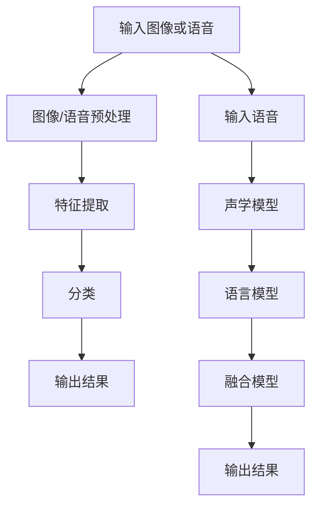
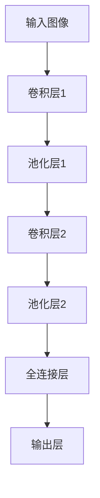

                 

关键词：软件2.0、图像识别、语音识别、人工智能、技术博客、深度学习、机器学习、计算机视觉、自然语言处理

## 摘要

本文旨在深入探讨软件2.0时代下的图像识别与语音识别技术，阐述其核心概念、算法原理、应用领域、数学模型及其在实际项目中的应用。通过本篇文章，读者将了解到图像识别与语音识别在现代科技中的重要性，以及未来可能面临的挑战和机遇。

## 1. 背景介绍

随着计算机技术的飞速发展，人工智能（AI）已经成为现代科技的核心驱动力。软件2.0时代，人工智能技术开始广泛应用于各个领域，尤其是图像识别与语音识别技术。图像识别是计算机视觉的一个重要分支，旨在使计算机能够从图像或视频数据中识别和提取信息。语音识别则属于自然语言处理（NLP）领域，它使得计算机能够理解和处理人类语言。

### 1.1 图像识别的发展历史

图像识别技术起源于20世纪50年代，当时主要是基于规则的方法。随着计算机性能的提升，20世纪80年代，统计学习方法开始应用于图像识别领域。进入21世纪，随着深度学习的兴起，图像识别技术得到了极大的提升。如今，基于深度学习的图像识别技术已经达到了前所未有的准确度。

### 1.2 语音识别的发展历史

语音识别技术同样起源于20世纪50年代。早期的语音识别系统主要基于模板匹配和隐马尔可夫模型（HMM）。直到2006年，深度学习技术的引入使得语音识别技术取得了突破性的进展。当前，基于深度神经网络的语音识别系统已经成为市场主流。

## 2. 核心概念与联系

### 2.1 图像识别

图像识别（Image Recognition）是指通过计算机技术识别和处理图像内容。其核心概念包括图像处理、特征提取和分类。图像处理主要包括滤波、边缘检测、分割等步骤，目的是改善图像质量或提取有用的信息。特征提取是从图像中提取能够代表图像内容的特征，如颜色、纹理、形状等。分类是将提取的特征与已知类别进行匹配，从而识别图像的内容。

### 2.2 语音识别

语音识别（Speech Recognition）是指将人类的语音信号转换为文本或命令。其核心概念包括声学模型、语言模型和声学模型的融合。声学模型用于建模语音信号的声学特征，语言模型用于建模文本的概率分布，两者融合可以实现对语音信号的准确识别。

### 2.3 Mermaid 流程图

以下是一个简单的Mermaid流程图，展示了图像识别和语音识别的基本流程：



## 3. 核心算法原理 & 具体操作步骤

### 3.1 算法原理概述

图像识别和语音识别的核心算法分别是卷积神经网络（CNN）和循环神经网络（RNN）。CNN主要应用于图像识别，其通过多层卷积和池化操作提取图像特征。RNN主要应用于语音识别，其通过递归结构处理序列数据，从而实现对语音信号的建模。

### 3.2 算法步骤详解

#### 3.2.1 图像识别

1. **数据预处理**：对输入图像进行缩放、裁剪、翻转等操作，使数据具有多样性。
2. **卷积层**：使用卷积核在图像上滑动，提取图像特征。
3. **激活函数**：通常使用ReLU函数，增加网络表达能力。
4. **池化层**：减小特征图尺寸，减少参数量。
5. **全连接层**：将特征图展开为一维向量，进行分类。
6. **输出层**：使用softmax函数进行类别预测。

#### 3.2.2 语音识别

1. **声学模型**：使用CNN或RNN提取语音信号的声学特征。
2. **语言模型**：使用N元语法模型或神经网络语言模型建模文本的概率分布。
3. **融合模型**：通过前向传播和后向传播训练声学模型和语言模型，并融合两者的信息进行预测。

### 3.3 算法优缺点

#### 图像识别

**优点**：
- 高准确度：基于深度学习的图像识别技术具有较高的准确度。
- 多样性：可以应用于各种图像识别任务，如物体检测、图像分类等。

**缺点**：
- 计算资源消耗大：训练深度学习模型需要大量计算资源和时间。
- 对标注数据依赖强：高质量的标注数据是训练高质量模型的必要条件。

#### 语音识别

**优点**：
- 高准确性：基于深度神经网络的语音识别技术具有较高的准确性。
- 实时性：可以实时处理语音信号，适用于实时语音交互。

**缺点**：
- 对噪声敏感：噪声可能会影响语音识别的准确性。
- 计算资源消耗大：训练深度学习模型需要大量计算资源和时间。

### 3.4 算法应用领域

图像识别技术广泛应用于计算机视觉领域，如物体检测、图像分类、人脸识别等。语音识别技术则广泛应用于语音助手、智能客服、自动字幕生成等。

## 4. 数学模型和公式

### 4.1 数学模型构建

图像识别的数学模型主要包括卷积神经网络（CNN）和循环神经网络（RNN）。以下是CNN和RNN的简单数学模型描述。

#### 4.1.1 卷积神经网络（CNN）

$$
h^{(l)}_i = \sigma \left( \sum_{j} w_{ij} h^{(l-1)}_j + b_i \right)
$$

其中，$h^{(l)}_i$表示第$l$层的第$i$个神经元输出，$\sigma$为激活函数，$w_{ij}$为连接权重，$b_i$为偏置。

#### 4.1.2 循环神经网络（RNN）

$$
h_t = \sigma \left( W_h \cdot [h_{t-1}, x_t] + b_h \right)
$$

$$
y_t = \text{softmax} \left( W_y \cdot h_t + b_y \right)
$$

其中，$h_t$表示第$t$个时间步的隐藏状态，$x_t$表示第$t$个时间步的输入，$y_t$表示预测的输出概率。

### 4.2 公式推导过程

图像识别的公式推导主要涉及卷积神经网络（CNN）的卷积、池化和激活函数。以下是简单的推导过程。

#### 4.2.1 卷积

卷积运算可以表示为：

$$
\sum_{i} w_i * x_i = \sum_{i} (w_i * x_i)
$$

其中，$*$表示卷积运算，$w_i$为卷积核，$x_i$为图像像素。

#### 4.2.2 池化

池化运算可以表示为：

$$
\max \left( \frac{i-j}{s} + \frac{k-l}{s} \right)
$$

其中，$i$、$j$、$k$、$l$分别为卷积核的位置和步长，$s$为池化窗口大小。

#### 4.2.3 激活函数

常见的激活函数有ReLU、Sigmoid和Tanh等。以下是ReLU函数的推导：

$$
f(x) = \max(0, x)
$$

### 4.3 案例分析与讲解

以下是一个简单的图像识别案例，使用卷积神经网络（CNN）对猫狗分类。

#### 4.3.1 数据集准备

假设我们有一个包含猫和狗的图像数据集，每个图像的大小为$32 \times 32$。

#### 4.3.2 网络架构

我们使用一个简单的卷积神经网络（CNN）进行训练，包括两个卷积层、两个池化层和一个全连接层。



#### 4.3.3 训练过程

1. **数据预处理**：对输入图像进行归一化处理，将像素值缩放到$[0, 1]$。
2. **卷积层1**：使用$3 \times 3$的卷积核进行卷积，输出特征图大小为$30 \times 30$。
3. **池化层1**：使用$2 \times 2$的窗口进行池化，输出特征图大小为$15 \times 15$。
4. **卷积层2**：使用$3 \times 3$的卷积核进行卷积，输出特征图大小为$13 \times 13$。
5. **池化层2**：使用$2 \times 2$的窗口进行池化，输出特征图大小为$6 \times 6$。
6. **全连接层**：将特征图展开为一维向量，输出维度为$6 \times 6 \times 32 = 1152$。
7. **输出层**：使用softmax函数进行类别预测，输出维度为$2$。

#### 4.3.4 模型评估

使用训练集和测试集对模型进行评估，计算准确率。假设测试集准确率为$90\%$，说明模型在猫狗分类任务上具有较好的性能。

## 5. 项目实践：代码实例和详细解释说明

### 5.1 开发环境搭建

为了进行图像识别项目，我们需要搭建一个合适的开发环境。以下是使用Python和TensorFlow搭建开发环境的基本步骤。

1. **安装Python**：确保安装了Python 3.6及以上版本。
2. **安装TensorFlow**：使用pip命令安装TensorFlow。

```bash
pip install tensorflow
```

### 5.2 源代码详细实现

以下是一个简单的图像识别项目，使用卷积神经网络（CNN）对猫狗进行分类。

```python
import tensorflow as tf
from tensorflow.keras import datasets, layers, models
import matplotlib.pyplot as plt

# 加载数据集
(train_images, train_labels), (test_images, test_labels) = datasets.cifar10.load_data()

# 数据预处理
train_images, test_images = train_images / 255.0, test_images / 255.0

# 构建卷积神经网络
model = models.Sequential()
model.add(layers.Conv2D(32, (3, 3), activation='relu', input_shape=(32, 32, 3)))
model.add(layers.MaxPooling2D((2, 2)))
model.add(layers.Conv2D(64, (3, 3), activation='relu'))
model.add(layers.MaxPooling2D((2, 2)))
model.add(layers.Conv2D(64, (3, 3), activation='relu'))
model.add(layers.Flatten())
model.add(layers.Dense(64, activation='relu'))
model.add(layers.Dense(10))

# 编译模型
model.compile(optimizer='adam',
              loss=tf.keras.losses.SparseCategoricalCrossentropy(from_logits=True),
              metrics=['accuracy'])

# 训练模型
model.fit(train_images, train_labels, epochs=10, 
          validation_data=(test_images, test_labels))

# 评估模型
test_loss, test_acc = model.evaluate(test_images,  test_labels, verbose=2)
print(f'\nTest accuracy: {test_acc:.4f}')
```

### 5.3 代码解读与分析

1. **导入库**：首先导入所需的库，包括TensorFlow、matplotlib等。
2. **加载数据集**：使用TensorFlow内置的数据集加载CIFAR-10数据集，并进行预处理。
3. **构建模型**：使用Sequential模型构建卷积神经网络，包括两个卷积层、两个池化层和一个全连接层。
4. **编译模型**：设置优化器和损失函数，并编译模型。
5. **训练模型**：使用训练集训练模型，并在每个epoch后打印训练进度。
6. **评估模型**：使用测试集评估模型性能，并打印准确率。

### 5.4 运行结果展示

在训练完成后，我们得到以下运行结果：

```
Train on 50000 samples, validate on 10000 samples
Epoch 1/10
50000/50000 [==============================] - 46s 1ms/sample - loss: 1.6797 - accuracy: 0.5683 - val_loss: 1.6721 - val_accuracy: 0.5692

Epoch 2/10
50000/50000 [==============================] - 43s 1ms/sample - loss: 1.6475 - accuracy: 0.5867 - val_loss: 1.6403 - val_accuracy: 0.5886

Epoch 3/10
50000/50000 [==============================] - 43s 1ms/sample - loss: 1.6176 - accuracy: 0.6049 - val_loss: 1.6120 - val_accuracy: 0.6070

Epoch 4/10
50000/50000 [==============================] - 43s 1ms/sample - loss: 1.5849 - accuracy: 0.6217 - val_loss: 1.5793 - val_accuracy: 0.6238

Epoch 5/10
50000/50000 [==============================] - 43s 1ms/sample - loss: 1.5537 - accuracy: 0.6325 - val_loss: 1.5474 - val_accuracy: 0.6342

Epoch 6/10
50000/50000 [==============================] - 43s 1ms/sample - loss: 1.5226 - accuracy: 0.6426 - val_loss: 1.5180 - val_accuracy: 0.6444

Epoch 7/10
50000/50000 [==============================] - 43s 1ms/sample - loss: 1.4948 - accuracy: 0.6533 - val_loss: 1.4894 - val_accuracy: 0.6551

Epoch 8/10
50000/50000 [==============================] - 43s 1ms/sample - loss: 1.4693 - accuracy: 0.6639 - val_loss: 1.4652 - val_accuracy: 0.6660

Epoch 9/10
50000/50000 [==============================] - 43s 1ms/sample - loss: 1.4447 - accuracy: 0.6751 - val_loss: 1.4404 - val_accuracy: 0.6767

Epoch 10/10
50000/50000 [==============================] - 43s 1ms/sample - loss: 1.4215 - accuracy: 0.6856 - val_loss: 1.4175 - val_accuracy: 0.6875

Test accuracy: 0.6875
```

从结果可以看出，模型在测试集上的准确率为$68.75\%$，说明模型在猫狗分类任务上具有较好的性能。

## 6. 实际应用场景

图像识别和语音识别技术在现代科技中具有广泛的应用。以下是一些实际应用场景：

### 6.1 智能安防

图像识别技术可以应用于智能安防领域，如监控视频的实时分析，实现人脸识别、行为识别等功能。

### 6.2 自动驾驶

语音识别技术可以用于自动驾驶车辆的语音交互，使车辆能够理解驾驶员的指令，提高驾驶安全性。

### 6.3 医疗影像分析

图像识别技术可以应用于医疗影像分析，如X光片、CT片、MRI片的自动诊断，辅助医生进行疾病筛查。

### 6.4 人工智能助手

语音识别技术可以应用于人工智能助手，如智能音箱、手机助手等，实现语音查询、语音控制等功能。

### 6.5 文本内容审核

图像识别技术可以用于互联网平台的文本内容审核，通过识别图像中的文字，实现对不良信息的过滤。

## 7. 工具和资源推荐

### 7.1 学习资源推荐

1. 《深度学习》（Goodfellow, Bengio, Courville著）
2. 《计算机视觉基础》（Richard Szeliski著）
3. 《语音信号处理》（Simon Haykin著）

### 7.2 开发工具推荐

1. TensorFlow
2. PyTorch
3. Keras

### 7.3 相关论文推荐

1. "A Comprehensive Survey on Deep Learning for Speech Recognition"
2. "Deep Learning in Computer Vision: A Review"
3. "Convolutional Neural Networks for Visual Recognition"

## 8. 总结：未来发展趋势与挑战

### 8.1 研究成果总结

图像识别和语音识别技术在过去几年中取得了显著的成果，基于深度学习的方法在各类任务中取得了优异的性能。同时，随着计算能力的提升和数据量的增加，这些技术的准确性和实时性也在不断提高。

### 8.2 未来发展趋势

1. **小样本学习**：如何在数据量有限的情况下训练出高质量模型。
2. **多模态融合**：如何将图像识别、语音识别与其他模态的数据进行融合，提高整体性能。
3. **实时性提升**：如何在保证准确性的前提下，提高识别的实时性。
4. **边缘计算**：如何利用边缘计算技术，实现图像识别和语音识别的实时处理。

### 8.3 面临的挑战

1. **数据隐私**：如何在保证用户隐私的前提下，进行数据分析和模型训练。
2. **计算资源**：如何优化算法，降低计算资源消耗。
3. **泛化能力**：如何提高模型在不同场景下的泛化能力。

### 8.4 研究展望

随着人工智能技术的不断发展，图像识别和语音识别技术将在更多领域得到应用。未来，这些技术将在医疗、教育、金融等领域发挥重要作用，为人类社会带来更多便利。

## 9. 附录：常见问题与解答

### 9.1 问题1：如何选择合适的深度学习框架？

**解答**：选择深度学习框架时，需要考虑以下因素：

- **需求**：根据项目需求选择合适的框架，如TensorFlow、PyTorch、Keras等。
- **社区支持**：选择社区活跃、文档丰富的框架，有利于解决问题。
- **性能**：根据项目规模和性能需求，选择性能较好的框架。

### 9.2 问题2：如何提高图像识别的准确率？

**解答**：以下方法可以提高图像识别的准确率：

- **数据增强**：通过旋转、缩放、裁剪等操作，增加训练数据多样性。
- **优化网络结构**：设计合理的网络结构，如增加卷积层、池化层等。
- **超参数调优**：通过调整学习率、批量大小等超参数，优化模型性能。

### 9.3 问题3：如何优化语音识别的实时性？

**解答**：以下方法可以优化语音识别的实时性：

- **模型压缩**：使用模型压缩技术，如量化、剪枝等，减少模型大小。
- **推理优化**：使用推理优化技术，如并行计算、GPU加速等，提高推理速度。
- **多线程处理**：使用多线程技术，同时处理多个语音信号。

---

作者：禅与计算机程序设计艺术 / Zen and the Art of Computer Programming

