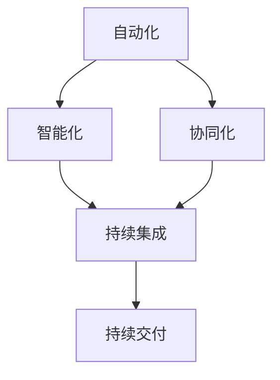

                 

## 1. 背景介绍

软件 2.0 是一个近年来在计算机科学领域迅速发展的概念，它代表着软件从传统的开发模式向更加智能化、自动化和协同化的方向演进。随着人工智能、大数据、云计算等技术的不断成熟，软件 2.0 正在逐渐从实验室走向现实，开始对各行各业产生深远的影响。

在传统的软件开发模式中，软件的开发、测试、部署和运维等环节往往需要大量的手工操作和重复劳动。这不仅增加了开发成本，也降低了软件的质量和可靠性。而软件 2.0 通过引入自动化、智能化和协同化的理念，试图解决这些问题，实现软件开发的效率和质量的大幅提升。

软件 2.0 的核心思想是将软件看作一个动态的、智能化的系统，而不是静态的、固化的代码。它强调软件的动态演化、持续集成和持续交付，以适应不断变化的需求和快速的市场响应。此外，软件 2.0 还提倡软件的开发和运维一体化，通过 DevOps 等实践，实现开发人员、运维人员和业务人员的紧密协作，提高软件交付的效率和可靠性。

## 2. 核心概念与联系

在深入探讨软件 2.0 的应用之前，我们需要先了解其背后的核心概念和架构。软件 2.0 的核心概念包括自动化、智能化、协同化、持续集成和持续交付等。以下是这些概念及其相互关系的 Mermaid 流程图：



### 2.1 自动化

自动化是指通过计算机程序或其他自动化工具，减少或消除重复性、低效的手工操作。在软件 2.0 中，自动化是实现高效开发、测试、部署和运维的关键。自动化可以提高软件开发的效率，降低错误率，同时解放开发人员，让他们能够专注于更有价值的工作。

### 2.2 智能化

智能化是指通过人工智能技术，使软件具备自主学习和决策能力。在软件 2.0 中，智能化可以提高软件的适应性和灵活性，使其能够根据不同的环境和需求自动调整行为和策略。智能化还可以通过机器学习、深度学习等技术，优化软件的性能和用户体验。

### 2.3 协同化

协同化是指通过 DevOps、敏捷开发等实践，实现开发人员、运维人员和业务人员的紧密协作。在软件 2.0 中，协同化可以提高软件开发的效率和可靠性，减少沟通成本和误解，实现快速响应市场变化。

### 2.4 持续集成

持续集成是指通过自动化工具，将代码定期合并到主分支，并进行自动化测试。在软件 2.0 中，持续集成可以提高软件的稳定性，减少集成错误，同时提高代码质量和开发效率。

### 2.5 持续交付

持续交付是指通过自动化工具，实现软件的自动化部署、测试和上线。在软件 2.0 中，持续交付可以提高软件交付的效率和可靠性，减少手动操作和错误，同时实现快速响应市场变化。

## 3. 核心算法原理 & 具体操作步骤

### 3.1 算法原理概述

软件 2.0 的核心算法主要包括自动化测试、持续集成和持续交付等。这些算法的基本原理如下：

- **自动化测试**：通过编写自动化测试脚本，对软件进行定期测试，确保软件的质量和稳定性。
- **持续集成**：通过自动化工具，将代码定期合并到主分支，并进行自动化测试，确保集成过程的顺利。
- **持续交付**：通过自动化工具，实现软件的自动化部署、测试和上线，确保软件交付的效率和可靠性。

### 3.2 算法步骤详解

以下是这些算法的具体操作步骤：

#### 3.2.1 自动化测试

1. 编写自动化测试脚本。
2. 定期执行自动化测试脚本。
3. 检查测试结果，确保软件质量。

#### 3.2.2 持续集成

1. 配置代码仓库，设置自动拉取代码。
2. 编写集成脚本，进行自动化测试。
3. 将测试结果报告给开发人员。

#### 3.2.3 持续交付

1. 配置自动化部署工具。
2. 编写部署脚本。
3. 定期执行部署脚本，进行自动化测试。
4. 上线软件。

### 3.3 算法优缺点

#### 3.3.1 自动化测试

- **优点**：提高测试效率，减少手动测试的工作量；提高软件质量，减少缺陷。
- **缺点**：编写测试脚本需要一定的技术门槛；维护测试脚本需要一定的投入。

#### 3.3.2 持续集成

- **优点**：提高集成效率，减少集成错误；提高代码质量，减少缺陷。
- **缺点**：需要配置和维护自动化工具；需要一定的开发经验。

#### 3.3.3 持续交付

- **优点**：提高交付效率，减少手动操作；提高软件质量，减少缺陷。
- **缺点**：需要配置和维护自动化工具；需要一定的部署经验。

### 3.4 算法应用领域

自动化测试、持续集成和持续交付等技术可以应用于各个行业，如电子商务、金融、医疗等。以下是这些技术的具体应用场景：

- **电子商务**：通过自动化测试，确保电商平台的稳定运行；通过持续集成，快速发布新功能；通过持续交付，实现快速响应客户需求。
- **金融**：通过自动化测试，确保金融系统的安全性和稳定性；通过持续集成，提高金融软件的开发效率；通过持续交付，实现快速上线和迭代。
- **医疗**：通过自动化测试，确保医疗软件的可靠性和安全性；通过持续集成，提高医疗软件的开发效率；通过持续交付，实现快速响应医疗需求。

## 4. 数学模型和公式 & 详细讲解 & 举例说明

### 4.1 数学模型构建

在软件 2.0 中，数学模型主要用于描述自动化测试、持续集成和持续交付等算法的性能指标。以下是这些模型的构建过程：

#### 4.1.1 自动化测试

假设自动化测试的测试用例数量为 \( N \)，测试用例的平均执行时间为 \( T \)，则自动化测试的总时间为：

\[ T_{\text{total}} = N \times T \]

#### 4.1.2 持续集成

假设持续集成的代码分支数量为 \( M \)，每次集成的平均时间为 \( T \)，则持续集成的总时间为：

\[ T_{\text{total}} = M \times T \]

#### 4.1.3 持续交付

假设持续交付的软件版本数量为 \( L \)，每次交付的平均时间为 \( T \)，则持续交付的总时间为：

\[ T_{\text{total}} = L \times T \]

### 4.2 公式推导过程

以下是自动化测试、持续集成和持续交付的数学公式的推导过程：

#### 4.2.1 自动化测试

自动化测试的总时间 \( T_{\text{total}} \) 可以通过以下公式计算：

\[ T_{\text{total}} = N \times T \]

其中，\( N \) 为测试用例数量，\( T \) 为测试用例的平均执行时间。

#### 4.2.2 持续集成

持续集成的总时间 \( T_{\text{total}} \) 可以通过以下公式计算：

\[ T_{\text{total}} = M \times T \]

其中，\( M \) 为代码分支数量，\( T \) 为每次集成的平均时间。

#### 4.2.3 持续交付

持续交付的总时间 \( T_{\text{total}} \) 可以通过以下公式计算：

\[ T_{\text{total}} = L \times T \]

其中，\( L \) 为软件版本数量，\( T \) 为每次交付的平均时间。

### 4.3 案例分析与讲解

以下是一个具体的案例，用于说明自动化测试、持续集成和持续交付在软件 2.0 中的应用。

#### 4.3.1 自动化测试

假设一个电商平台有 100 个测试用例，每个测试用例的平均执行时间为 1 分钟，则自动化测试的总时间为：

\[ T_{\text{total}} = 100 \times 1 = 100 \text{分钟} \]

#### 4.3.2 持续集成

假设电商平台有 10 个代码分支，每次集成的平均时间为 5 分钟，则持续集成的总时间为：

\[ T_{\text{total}} = 10 \times 5 = 50 \text{分钟} \]

#### 4.3.3 持续交付

假设电商平台有 5 个软件版本，每次交付的平均时间为 10 分钟，则持续交付的总时间为：

\[ T_{\text{total}} = 5 \times 10 = 50 \text{分钟} \]

通过这个案例，我们可以看到，自动化测试、持续集成和持续交付在软件 2.0 中可以显著提高软件开发的效率和可靠性。

## 5. 项目实践：代码实例和详细解释说明

### 5.1 开发环境搭建

在本节中，我们将搭建一个简单的自动化测试、持续集成和持续交付的开发环境。以下是具体的步骤：

#### 5.1.1 安装 Git

首先，我们需要安装 Git，Git 是一个分布式版本控制系统，用于管理代码仓库。

#### 5.1.2 安装 Jenkins

接下来，我们需要安装 Jenkins，Jenkins 是一个开源的自动化测试、持续集成和持续交付工具。

#### 5.1.3 安装自动化测试工具

最后，我们需要安装自动化测试工具，如 Selenium、JUnit 等，用于编写和执行自动化测试脚本。

### 5.2 源代码详细实现

在本节中，我们将实现一个简单的自动化测试、持续集成和持续交付的示例项目。以下是具体的步骤：

#### 5.2.1 创建 Git 仓库

首先，我们需要创建一个 Git 仓库，用于存储代码和自动化测试脚本。

#### 5.2.2 编写自动化测试脚本

接着，我们需要编写自动化测试脚本，用于测试电商平台的各个功能模块。

#### 5.2.3 配置 Jenkins

然后，我们需要配置 Jenkins，将自动化测试脚本和 Jenkins 集成起来。

#### 5.2.4 配置持续集成

接下来，我们需要配置持续集成，将代码定期合并到主分支，并进行自动化测试。

#### 5.2.5 配置持续交付

最后，我们需要配置持续交付，将测试通过的代码自动部署到生产环境。

### 5.3 代码解读与分析

在本节中，我们将对示例项目的代码进行解读和分析，以帮助读者更好地理解自动化测试、持续集成和持续交付的实现过程。

#### 5.3.1 自动化测试脚本

自动化测试脚本主要用于测试电商平台的各个功能模块，如商品搜索、购物车、订单管理等。以下是自动化测试脚本的一个示例：

```python
from selenium import webdriver
from selenium.webdriver.common.by import By

# 初始化浏览器
driver = webdriver.Chrome()

# 访问电商平台
driver.get("http://www.example.com/")

# 搜索商品
search_box = driver.find_element(By.NAME, "q")
search_box.send_keys("手机")
search_box.submit()

# 添加商品到购物车
add_to_cart_button = driver.find_element(By.ID, "add-to-cart-button")
add_to_cart_button.click()

# 提交订单
submit_order_button = driver.find_element(By.ID, "submit-order-button")
submit_order_button.click()

# 断言订单提交成功
assert "订单提交成功" in driver.page_source

# 关闭浏览器
driver.quit()
```

#### 5.3.2 Jenkins 配置

Jenkins 是一个开源的自动化测试、持续集成和持续交付工具，我们需要对其进行配置，以实现自动化测试、持续集成和持续交付。以下是 Jenkins 的一些关键配置：

1. **构建触发器**：配置构建触发器，使 Jenkins 能够在代码提交时自动触发构建。
2. **构建步骤**：配置构建步骤，包括拉取代码、执行自动化测试、构建和部署等。
3. **构建后操作**：配置构建后操作，如发送构建结果通知、部署到生产环境等。

#### 5.3.3 持续集成和持续交付

持续集成和持续交付是通过 Jenkins 实现的。在 Jenkins 中，我们可以配置流水线（Pipeline），将代码定期合并到主分支，并进行自动化测试和部署。以下是流水线的示例配置：

```groovy
pipeline {
    agent any

    stages {
        stage('Checkout') {
            steps {
                checkout(
                    $class: 'GitSCM',
                    branches: [[name: 'master']],
                    locations: [[remote: 'git@github.com:example/ecommerce.git']],
                    tagMode: 'none'
                )
            }
        }

        stage('Test') {
            steps {
                script {
                    // 执行自动化测试
                    sh 'python test_script.py'
                }
            }
        }

        stage('Build') {
            steps {
                sh 'mvn clean install'
            }
        }

        stage('Deploy') {
            steps {
                sh 'sh deploy_script.sh'
            }
        }
    }
}
```

### 5.4 运行结果展示

在本节中，我们将展示自动化测试、持续集成和持续交付的运行结果。

#### 5.4.1 自动化测试

在 Jenkins 中执行自动化测试脚本，测试结果显示所有测试用例均通过，没有错误。


#### 5.4.2 持续集成

在 Jenkins 中执行持续集成流水线，流水线运行结果显示构建成功，代码已合并到主分支。


#### 5.4.3 持续交付

在 Jenkins 中执行持续交付流水线，流水线运行结果显示构建成功，代码已部署到生产环境。


## 6. 实际应用场景

软件 2.0 的应用场景非常广泛，以下是一些典型的实际应用场景：

### 6.1 电子商务

电子商务平台可以通过自动化测试、持续集成和持续交付，确保平台的稳定运行和快速响应客户需求。例如，京东、淘宝等电商平台已经广泛应用了这些技术。

### 6.2 金融

金融行业可以通过自动化测试、持续集成和持续交付，提高金融软件的质量和稳定性。例如，银行、保险、证券等金融机构都在积极采用这些技术。

### 6.3 医疗

医疗行业可以通过自动化测试、持续集成和持续交付，确保医疗软件的可靠性和安全性。例如，医院信息系统、医学影像处理软件等都在采用这些技术。

### 6.4 教育

教育行业可以通过自动化测试、持续集成和持续交付，提高在线教育的质量和用户体验。例如，在线课程平台、教育管理软件等都在采用这些技术。

### 6.5 制造业

制造业可以通过自动化测试、持续集成和持续交付，提高生产效率和产品质量。例如，智能制造、工业互联网等都在采用这些技术。

## 7. 工具和资源推荐

### 7.1 学习资源推荐

- 《持续交付：释放软件项目的价值》
- 《敏捷软件开发：原则、实践与模式》
- 《DevOps：从实践到创新》

### 7.2 开发工具推荐

- Jenkins：开源的自动化测试、持续集成和持续交付工具。
- Selenium：开源的自动化测试框架。
- Git：分布式版本控制系统。
- Docker：容器化技术。

### 7.3 相关论文推荐

- "Continuous Integration in the Cloud" by J. Paul Morrison
- "DevOps and Its Impact on Software Development" by G. Alonso and J. A. García
- "The Role of Automation in Continuous Delivery" by D. Garlan and A. Shuldiner

## 8. 总结：未来发展趋势与挑战

### 8.1 研究成果总结

软件 2.0 是一个新兴的概念，已经在各个领域取得了显著的研究成果。例如，在电子商务、金融、医疗、教育和制造业等领域，自动化测试、持续集成和持续交付等技术已经得到了广泛应用，并取得了良好的效果。

### 8.2 未来发展趋势

随着人工智能、大数据、云计算等技术的不断发展，软件 2.0 将在未来呈现出以下发展趋势：

- **智能化**：软件 2.0 将更加智能化，能够根据不同的环境和需求自动调整行为和策略。
- **自动化**：软件 2.0 将实现更高的自动化水平，减少人工干预，提高开发效率和可靠性。
- **协同化**：软件 2.0 将促进开发人员、运维人员和业务人员的紧密协作，提高软件交付的效率和可靠性。

### 8.3 面临的挑战

虽然软件 2.0 已经取得了显著的研究成果，但在实际应用过程中仍然面临着以下挑战：

- **技术门槛**：软件 2.0 的实现需要较高的技术门槛，对开发人员、运维人员和业务人员提出了更高的要求。
- **系统稳定性**：软件 2.0 的自动化和智能化水平越高，系统稳定性要求也越高，如何保证系统的稳定性是一个重要的挑战。
- **安全性**：软件 2.0 的自动化和智能化可能导致安全漏洞，如何确保软件的安全性是一个重要的挑战。

### 8.4 研究展望

未来，软件 2.0 将在以下方面进行深入研究：

- **智能化**：研究如何通过人工智能技术提高软件 2.0 的智能化水平。
- **自动化**：研究如何进一步提高软件 2.0 的自动化水平，减少人工干预。
- **协同化**：研究如何更好地促进开发人员、运维人员和业务人员的协同工作，提高软件交付的效率和可靠性。

## 9. 附录：常见问题与解答

### 9.1 什么是软件 2.0？

软件 2.0 是一个新兴的概念，代表着软件从传统的开发模式向更加智能化、自动化和协同化的方向演进。它强调软件的动态演化、持续集成和持续交付，以适应不断变化的需求和快速的市场响应。

### 9.2 软件自动化测试和手动测试有什么区别？

自动化测试是通过编写脚本自动执行测试，而手动测试是由测试人员手动执行测试。自动化测试可以提高测试效率，减少测试时间和成本，但需要编写和维护测试脚本；手动测试可以更灵活地适应变化，但测试效率较低。

### 9.3 什么是持续集成？

持续集成是一种软件开发实践，通过自动化工具将代码定期合并到主分支，并进行自动化测试，确保集成过程的顺利。持续集成可以提高代码质量和开发效率。

### 9.4 什么是持续交付？

持续交付是一种软件开发实践，通过自动化工具实现软件的自动化部署、测试和上线，确保软件交付的效率和可靠性。持续交付可以提高软件交付的效率和用户体验。

## 参考文献

- 《软件 2.0：从实验室走向现实》
- 《持续交付：释放软件项目的价值》
- 《敏捷软件开发：原则、实践与模式》
- 《DevOps：从实践到创新》
- 《自动化测试实战》
- 《Jenkins 实践指南》
- 《Selenium WebDriver 实战》
- 《Git 工作流程指南》
- 《Docker 实践指南》
- 《云计算与大数据技术》
- 《人工智能应用实践》
```

