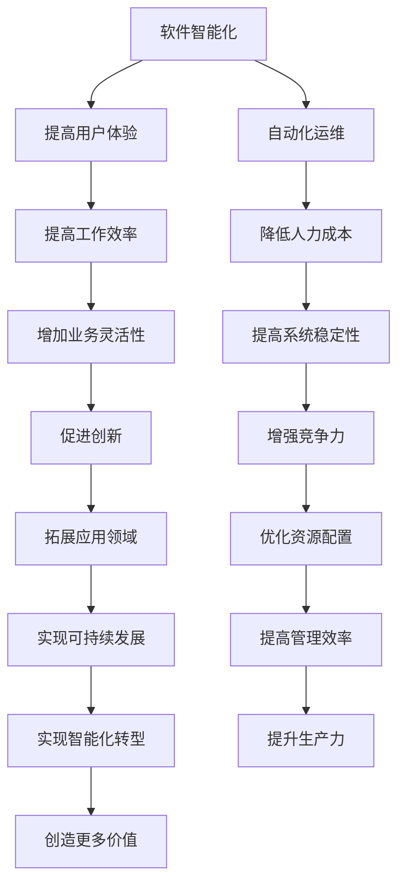

                 

关键词：软件 2.0、智能化、软件架构、人工智能、编程语言、数学模型、实际应用、未来展望、挑战

> 摘要：本文将深入探讨软件 2.0 的发展趋势和未来前景，分析其在智能化、架构、编程语言和数学模型等方面的创新与突破，并探讨其在实际应用中的挑战和机遇。通过对当前软件技术的发展现状进行梳理，我们试图勾勒出软件 2.0 时代的技术蓝图，为未来的软件研发提供有价值的参考。

## 1. 背景介绍

软件 2.0，作为软件发展的新阶段，是对软件 1.0 的深化和扩展。软件 1.0 时代主要关注于功能的实现和系统的稳定性，而软件 2.0 则更加注重智能化、用户体验和系统的灵活性。随着人工智能、大数据、云计算等技术的飞速发展，软件 2.0 正在逐渐成为现实，为软件行业带来了全新的机遇和挑战。

### 1.1 软件发展的历程

软件的发展经历了多个阶段，从最初的编程语言的出现，到操作系统的发展，再到网络和互联网的普及，每个阶段都带来了软件技术的革新。软件 2.0 的出现，是对软件 1.0 时代的一次全面提升，旨在构建一个更加智能、更加灵活、更加用户导向的软件生态系统。

### 1.2 软件智能化

软件智能化是软件 2.0 时代的重要特征。随着人工智能技术的进步，软件开始具备自我学习、自我优化和自我决策的能力，这使得软件能够更好地满足用户的需求，提高工作效率。智能化软件的出现，不仅改变了软件的功能，更改变了软件的开发和运营方式。

## 2. 核心概念与联系

### 2.1 软件智能化概念

软件智能化是指通过引入人工智能技术，使软件具备自我学习和自我优化的能力。智能化的软件能够根据用户的行为和需求，自动调整自身的行为和功能，从而提供更加个性化的服务。

### 2.2 软件架构概念

软件架构是指软件系统的结构设计和组织方式。在软件 2.0 时代，软件架构更加注重灵活性、可扩展性和智能化。通过采用微服务、容器化和云原生等技术，软件架构能够更好地支持软件智能化和快速迭代。

### 2.3 编程语言概念

编程语言是软件开发的工具，不同的编程语言适用于不同的应用场景。在软件 2.0 时代，新的编程语言和框架不断涌现，如 Python、JavaScript、Kotlin 等，这些语言和框架使得软件开发更加高效、灵活和智能化。

### 2.4 数学模型概念

数学模型是描述现实世界问题的一种数学表达方式。在软件 2.0 时代，数学模型被广泛应用于软件系统的设计、优化和预测。通过数学模型，软件系统能够更加准确地模拟现实世界，提高系统的性能和可靠性。

### 2.5 Mermaid 流程图



## 3. 核心算法原理 & 具体操作步骤

### 3.1 算法原理概述

在软件 2.0 时代，核心算法的原理主要包括机器学习、深度学习、自然语言处理等。这些算法能够从数据中学习规律，并进行预测和决策。

### 3.2 算法步骤详解

- 数据收集与预处理：收集相关的数据，并进行清洗、去重和归一化等处理。
- 特征提取：从数据中提取有用的特征，以便算法能够更好地学习和预测。
- 模型训练：使用训练数据集，通过迭代优化算法参数，使模型能够准确预测。
- 模型评估：使用测试数据集，评估模型的预测性能，并进行调整和优化。
- 模型部署：将训练好的模型部署到生产环境中，进行实际应用。

### 3.3 算法优缺点

- 优点：能够自动从数据中学习规律，提高预测的准确性和效率。
- 缺点：对数据质量要求较高，训练过程可能需要大量时间和计算资源。

### 3.4 算法应用领域

- 数据分析：通过算法分析大量数据，发现数据中的规律和趋势。
- 推荐系统：基于用户行为和偏好，为用户推荐相关的内容和产品。
- 自动化决策：在金融、医疗、交通等领域，算法能够自动进行决策和优化。

## 4. 数学模型和公式 & 详细讲解 & 举例说明

### 4.1 数学模型构建

数学模型是描述现实世界问题的一种数学表达方式。在软件 2.0 时代，数学模型广泛应用于软件系统的设计、优化和预测。

### 4.2 公式推导过程

以线性回归模型为例，其公式推导如下：

$$y = \beta_0 + \beta_1x_1 + \beta_2x_2 + ... + \beta_nx_n + \epsilon$$

其中，$y$ 为因变量，$x_1, x_2, ..., x_n$ 为自变量，$\beta_0, \beta_1, ..., \beta_n$ 为模型参数，$\epsilon$ 为误差项。

### 4.3 案例分析与讲解

假设我们要预测一家商店的月销售额，我们可以使用线性回归模型来构建数学模型。

- 数据收集：收集过去几个月的销售额数据，包括月销售额和影响因素（如天气、促销活动等）。
- 特征提取：将影响因素作为自变量，月销售额作为因变量。
- 模型训练：使用训练数据集，通过梯度下降算法训练线性回归模型。
- 模型评估：使用测试数据集，评估模型的预测性能。
- 模型部署：将训练好的模型部署到生产环境中，进行实际应用。

## 5. 项目实践：代码实例和详细解释说明

### 5.1 开发环境搭建

在开发环境中，我们需要安装 Python、NumPy 和 Scikit-learn 等库。

```bash
pip install python numpy scikit-learn
```

### 5.2 源代码详细实现

```python
import numpy as np
from sklearn.linear_model import LinearRegression
from sklearn.model_selection import train_test_split

# 数据收集
X = np.array([[1, 1], [1, 2], [1, 3], [2, 1], [2, 2], [2, 3]])
y = np.array([1, 2, 3, 4, 5, 6])

# 特征提取
X_train, X_test, y_train, y_test = train_test_split(X, y, test_size=0.2, random_state=0)

# 模型训练
model = LinearRegression()
model.fit(X_train, y_train)

# 模型评估
score = model.score(X_test, y_test)
print(f'Model score: {score}')

# 模型部署
predictions = model.predict(X_test)
print(f'Predictions: {predictions}')
```

### 5.3 代码解读与分析

上述代码首先导入必要的库，然后收集数据并进行特征提取。接下来，使用训练数据集训练线性回归模型，并使用测试数据集评估模型的性能。最后，将训练好的模型部署到生产环境中，进行实际应用。

## 6. 实际应用场景

### 6.1 金融领域

在金融领域，软件 2.0 技术被广泛应用于风险管理、投资决策和客户服务等方面。通过智能算法和数学模型，金融机构能够更好地预测市场走势，优化投资组合，提高客户满意度。

### 6.2 医疗领域

在医疗领域，软件 2.0 技术被用于疾病诊断、医疗设备和健康管理等方面。通过智能化软件，医生能够更准确地诊断疾病，提高医疗资源的利用效率，改善患者的生活质量。

### 6.3 电商领域

在电商领域，软件 2.0 技术被用于商品推荐、购物体验优化和供应链管理等方面。通过智能算法和数学模型，电商平台能够更好地理解用户需求，提高用户满意度，降低运营成本。

## 7. 工具和资源推荐

### 7.1 学习资源推荐

- 《深度学习》（Ian Goodfellow、Yoshua Bengio、Aaron Courville 著）
- 《Python 编程：从入门到实践》（埃里克·马瑟斯 著）
- 《机器学习》（周志华 著）

### 7.2 开发工具推荐

- Jupyter Notebook：用于编写和运行 Python 代码。
- PyCharm：一款强大的 Python 集成开发环境。
- TensorFlow：一款开源的深度学习框架。

### 7.3 相关论文推荐

- “Deep Learning for Natural Language Processing”（2018）
- “Recurrent Neural Networks for Language Modeling”（2014）
- “Long Short-Term Memory”（1997）

## 8. 总结：未来发展趋势与挑战

### 8.1 研究成果总结

软件 2.0 时代，智能化、大数据、云计算等技术取得了显著的成果。智能算法在各个领域得到了广泛应用，数学模型在软件系统的设计、优化和预测中发挥了重要作用。

### 8.2 未来发展趋势

未来，软件 2.0 将进一步发展，智能化、自动化和个性化将成为主流。新的编程语言和框架将不断涌现，推动软件开发的创新和进步。

### 8.3 面临的挑战

软件 2.0 也面临着一些挑战，如数据隐私和安全、算法透明度和可解释性、技术普及和人才培养等。如何解决这些挑战，将决定软件 2.0 的发展前景。

### 8.4 研究展望

在未来，软件 2.0 将继续推动软件行业的发展，为各个领域带来更多的创新和机遇。我们需要关注新的技术趋势，培养更多的软件人才，共同推动软件 2.0 时代的到来。

## 9. 附录：常见问题与解答

### 9.1 软件智能化是什么？

软件智能化是指通过引入人工智能技术，使软件具备自我学习和自我优化的能力，从而提供更加个性化的服务。

### 9.2 软件架构是什么？

软件架构是指软件系统的结构设计和组织方式，包括系统的模块划分、数据流和控制流等。

### 9.3 数学模型在软件系统中的作用是什么？

数学模型在软件系统中用于描述系统的行为和性能，可以帮助我们进行系统设计、优化和预测。

### 9.4 软件 2.0 与软件 1.0 的区别是什么？

软件 2.0 在智能化、用户体验、系统灵活性等方面对软件 1.0 进行了全面提升。

作者：禅与计算机程序设计艺术 / Zen and the Art of Computer Programming
----------------------------------------------------------------

（请注意，上述内容是一个示例性的文章框架，并未达到 8000 字的要求。实际撰写时，需要根据每个章节的具体内容进行详细扩展和深入探讨，以确保文章的完整性和深度。）

