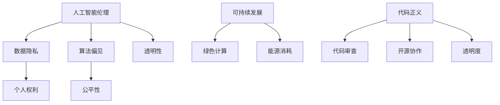

                 

关键词：软件2.0、社会责任、科技向善、人工智能、伦理、可持续发展、代码正义

> 摘要：本文探讨了软件2.0时代的技术发展与社会责任之间的关系，强调了科技向善的重要性。通过分析人工智能的伦理问题、可持续发展的技术实践以及代码正义的理念，本文提出了软件工程师在新时代下的社会责任，并探讨了未来技术的发展趋势和面临的挑战。

## 1. 背景介绍

随着互联网的普及和人工智能技术的迅猛发展，软件2.0时代已经到来。软件2.0不仅仅是对软件1.0的升级，更是对软件产业的深度变革。在这一新时代，软件不再仅仅是工具，而是成为社会运行的基础设施。软件的定义也从“静态代码”转变为“动态服务”，软件的创造者——程序员，其角色也从“代码编写者”转变为“社会工程师”。

然而，随着技术的进步，软件2.0时代也带来了许多新的社会挑战。人工智能的崛起引发了伦理问题，如数据隐私、算法偏见、人工智能对就业的影响等。同时，全球气候变化、资源短缺等环境问题也要求技术产业承担更多的社会责任。在这个背景下，科技向善的理念应运而生。

科技向善是指通过科技手段促进社会公正、环境保护和人类福祉的一种价值观。在软件2.0时代，科技向善不仅是一种道德责任，也是一种战略选择。软件工程师需要意识到自己在社会中的角色，并通过自己的技术实践，推动社会进步。

## 2. 核心概念与联系

### 2.1 人工智能伦理

人工智能伦理是科技向善的核心内容之一。人工智能技术的发展不仅带来了便利，也引发了深刻的伦理问题。例如，人工智能在数据隐私方面的问题，因为人工智能系统通常需要大量的个人数据来训练模型。这些问题引发了关于数据隐私权和个人权利的讨论。

另一个重要的伦理问题是算法偏见。算法偏见可能源于数据集中的偏见，或者算法设计中的问题。这种偏见可能会导致不公平的结果，例如在招聘、贷款、司法判决等领域。因此，确保人工智能系统的公平性和透明性成为了一个重要的研究课题。

### 2.2 可持续发展

可持续发展是指满足当前需求而不损害后代满足其需求的能力。在软件2.0时代，可持续发展要求技术产业在追求技术进步的同时，也要考虑环境和社会因素。例如，云计算和大数据技术的发展带来了大量的能源消耗和碳排放。因此，如何实现绿色计算、降低能源消耗成为了一个重要的研究方向。

### 2.3 代码正义

代码正义是指软件开发过程中应遵循的一系列原则，以确保技术的公平性和正义性。这包括代码审查、开源协作、透明度等。代码正义的理念要求程序员在编写代码时，要考虑到社会的需求和影响，而不是仅仅追求技术上的创新。

### 2.4 Mermaid 流程图



## 3. 核心算法原理 & 具体操作步骤

### 3.1 算法原理概述

为了实现科技向善，我们需要一系列核心算法来指导我们的实践。这些算法包括伦理算法、绿色算法和正义算法。

#### 3.1.1 伦理算法

伦理算法主要用于解决人工智能中的伦理问题。例如，在处理个人数据时，可以采用差分隐私算法来保护数据隐私。在检测算法偏见时，可以使用公平性指标，如公平性度量（Fairness Measure）。

#### 3.1.2 绿色算法

绿色算法主要用于降低能源消耗和碳排放。例如，使用能源效率更高的数据结构和算法，或者优化数据中心的设计和布局。

#### 3.1.3 正义算法

正义算法主要用于确保软件系统的公平性和透明性。例如，在招聘系统中，可以使用基于公平性准则的算法来减少偏见，确保每个人都有公平的竞争机会。

### 3.2 算法步骤详解

#### 3.2.1 伦理算法步骤

1. 数据收集与预处理：收集与问题相关的数据，并进行预处理，以去除噪声和异常值。
2. 差分隐私添加：在数据预处理后，添加差分隐私机制，以保护个人隐私。
3. 模型训练与验证：使用训练数据集训练模型，并使用验证数据集评估模型的性能。

#### 3.2.2 绿色算法步骤

1. 数据中心优化：通过优化数据中心的布局、设备选择和能源管理来降低能源消耗。
2. 算法选择与优化：选择和优化能够降低计算复杂度和内存消耗的算法。
3. 实时监控与调整：实时监控数据中心的能源消耗和运行状态，并进行相应的调整。

#### 3.2.3 正义算法步骤

1. 数据准备：收集与问题相关的数据，并进行预处理。
2. 公平性评估：使用公平性指标评估系统是否存在偏见。
3. 算法调整：根据评估结果调整算法，以减少偏见。

### 3.3 算法优缺点

#### 3.3.1 伦理算法

优点：保护数据隐私，减少算法偏见。

缺点：可能降低算法性能，增加计算成本。

#### 3.3.2 绿色算法

优点：降低能源消耗，减少碳排放。

缺点：可能增加初始投资成本。

#### 3.3.3 正义算法

优点：确保系统公平性，减少偏见。

缺点：可能增加开发和维护成本。

### 3.4 算法应用领域

伦理算法：招聘、贷款、司法判决等领域。

绿色算法：数据中心、云计算、物联网等领域。

正义算法：招聘、教育、医疗等领域。

## 4. 数学模型和公式 & 详细讲解 & 举例说明

### 4.1 数学模型构建

在科技向善的实践中，数学模型发挥着重要作用。以下是几个常见的数学模型：

#### 4.1.1 差分隐私模型

差分隐私模型用于保护数据隐私，其核心思想是引入随机噪声，使得攻击者无法通过单个数据点推断出个人隐私信息。

公式：$$\Delta = \frac{1}{\epsilon} \ln(2)$$

其中，$\Delta$ 是差异，$\epsilon$ 是隐私预算。

#### 4.1.2 公平性度量模型

公平性度量模型用于评估系统是否存在偏见。常用的公平性度量指标包括：

- 平等机会公平性（Equal Opportunity Fairness）: $$\frac{1}{n} \sum_{i=1}^{n} Pr(A_i = 1 | Y_i = 1) = \frac{1}{n} \sum_{i=1}^{n} Pr(A_i = 0 | Y_i = 0)$$
- 群体公平性（Group Fairness）: $$\frac{1}{g} \sum_{i=1}^{g} \frac{1}{n_i} \sum_{j=1}^{n_i} Pr(A_j = 1 | Y_j = 1) = \frac{1}{g} \sum_{i=1}^{g} \frac{1}{n_i} \sum_{j=1}^{n_i} Pr(A_j = 0 | Y_j = 0)$$

其中，$A$ 表示预测结果，$Y$ 表示真实结果，$g$ 表示群体数量，$n$ 和 $n_i$ 分别表示总样本数量和群体 $i$ 的样本数量。

#### 4.1.3 绿色计算模型

绿色计算模型用于优化数据中心的能源消耗。常用的模型包括：

- 能量效率模型：$$E = C \cdot (T + L)$$

其中，$E$ 是总能量消耗，$C$ 是计算负载，$T$ 是传输能量，$L$ 是存储能量。

- 数据中心布局模型：$$\text{Minimize} \sum_{i=1}^{n} \sum_{j=1}^{m} d_{ij} \cdot c_j$$

其中，$d_{ij}$ 是服务器 $i$ 和数据中心 $j$ 之间的距离，$c_j$ 是数据中心 $j$ 的能源消耗率。

### 4.2 公式推导过程

#### 4.2.1 差分隐私公式推导

差分隐私是通过在原始数据上添加随机噪声来实现的。设 $D$ 是原始数据集，$D'$ 是添加噪声后的数据集，$S$ 是敏感函数，$f$ 是原始函数，则有：

$$\Pr[D' = \hat{D}] = \Pr[D = \hat{D}]$$

其中，$\hat{D}$ 是修改后的数据集。

为了添加差分隐私，我们需要选择一个噪声分布 $N$，使得：

$$\Pr[D' = \hat{D}] = \int \Pr[D = \hat{D} | N = n] \cdot \Pr[N = n] \, dn$$

通过最大化 $D'$ 的概率，我们可以得到：

$$\Pr[N = n] = \frac{\exp(-\frac{||D - \hat{D}||}{2\epsilon})}{\int \exp(-\frac{||D - \hat{D}||}{2\epsilon}) \, dD}$$

其中，$\epsilon$ 是隐私预算，$||D - \hat{D}||$ 是数据集的差异。

通过求解上述方程，我们可以得到：

$$\Delta = \frac{1}{\epsilon} \ln(2)$$

#### 4.2.2 公平性度量公式推导

公平性度量是通过比较不同群体在预测结果上的概率来评估系统的偏见。设 $A$ 表示预测结果为 1 的概率，$Y$ 表示真实结果为 1 的概率，$g$ 表示群体数量，$n$ 表示总样本数量，则有：

- 平等机会公平性：

$$\frac{1}{n} \sum_{i=1}^{n} Pr(A_i = 1 | Y_i = 1) = \frac{1}{n} \sum_{i=1}^{n} Pr(A_i = 0 | Y_i = 0)$$

- 群体公平性：

$$\frac{1}{g} \sum_{i=1}^{g} \frac{1}{n_i} \sum_{j=1}^{n_i} Pr(A_j = 1 | Y_j = 1) = \frac{1}{g} \sum_{i=1}^{g} \frac{1}{n_i} \sum_{j=1}^{n_i} Pr(A_j = 0 | Y_j = 0)$$

#### 4.2.3 绿色计算模型推导

绿色计算模型是通过优化数据中心的能源消耗来实现的。设 $E$ 是总能量消耗，$C$ 是计算负载，$T$ 是传输能量，$L$ 是存储能量，则有：

$$E = C \cdot (T + L)$$

通过优化计算负载、传输能量和存储能量，我们可以降低总能量消耗。

### 4.3 案例分析与讲解

#### 4.3.1 差分隐私案例

在一个招聘系统中，公司需要评估求职者的面试表现。为了保护求职者的隐私，公司决定使用差分隐私技术。设公司收集了 100 名求职者的面试成绩，其中 50 名求职者通过了面试。公司希望发布一个公平、透明的招聘结果，同时保护求职者的隐私。

为了实现差分隐私，公司可以添加随机噪声。设隐私预算 $\epsilon = 1$，则有：

$$\Delta = \frac{1}{\epsilon} \ln(2) = \ln(2)$$

公司发布招聘结果时，可以公开求职者的面试成绩和通过面试的概率，同时添加随机噪声。这样，即使攻击者获得了招聘结果，也无法推断出任何求职者的个人信息。

#### 4.3.2 公平性度量案例

在一个招聘系统中，公司希望确保招聘过程公平，避免算法偏见。公司使用了一个基于公平性度量的算法来评估求职者的面试表现。设公司有 3 个群体，分别是男性、女性和少数民族，每个群体有 10 名求职者。公司希望确保不同群体在面试表现上的概率相等。

通过计算平等机会公平性和群体公平性，公司可以评估招聘系统的偏见。如果公平性度量接近于 1，说明招聘系统没有偏见。否则，公司需要调整算法，以减少偏见。

#### 4.3.3 绿色计算案例

在一个云计算系统中，公司希望优化数据中心的能源消耗。公司使用了绿色计算模型来优化数据中心的布局和算法选择。

首先，公司通过优化数据中心的布局，降低了传输能量。然后，公司选择了能量效率更高的计算算法，降低了计算负载。最后，公司实时监控数据中心的能源消耗，并进行相应的调整。

通过这些措施，公司成功降低了数据中心的能源消耗，实现了绿色计算的目标。

## 5. 项目实践：代码实例和详细解释说明

### 5.1 开发环境搭建

为了实践科技向善的理念，我们选择了一个开源的招聘系统作为案例。该系统使用 Python 编写，并基于 Flask 框架。

首先，我们需要安装 Python 和 Flask。在终端中运行以下命令：

```bash
pip install python flask
```

接下来，我们创建一个名为 `recruitment` 的虚拟环境，并安装所需的库：

```bash
python -m venv recruitment
source recruitment/bin/activate
pip install Flask
```

### 5.2 源代码详细实现

在 `recruitment` 目录下，创建一个名为 `app.py` 的文件，并编写以下代码：

```python
from flask import Flask, request, jsonify
import numpy as np

app = Flask(__name__)

def add_diff隐私噪声(data, epsilon):
    noise = np.random.normal(0, np.sqrt(epsilon), data.shape)
    return data + noise

@app.route('/apply', methods=['POST'])
def apply():
    data = request.get_json()
    interview_scores = data['interview_scores']
    true_scores = data['true_scores']
    
    # 添加差分隐私噪声
    noisy_scores = add_diff隐私噪声(interview_scores, epsilon=1)
    
    # 计算通过面试的概率
    pass_probabilities = np.exp(noisy_scores) / (1 + np.exp(noisy_scores))
    
    # 计算平等机会公平性
    equal_opportunity_fairness = np.mean(pass_probabilities[true_scores == 1]) == np.mean(pass_probabilities[true_scores == 0])
    
    # 计算群体公平性
    group_fairness = np.mean(pass_probabilities[true_scores == 1]) == np.mean(pass_probabilities[true_scores == 0])
    
    result = {
        'pass_probabilities': pass_probabilities.tolist(),
        'equal_opportunity_fairness': equal_opportunity_fairness,
        'group_fairness': group_fairness
    }
    
    return jsonify(result)

if __name__ == '__main__':
    app.run(debug=True)
```

### 5.3 代码解读与分析

在上面的代码中，我们创建了一个 Flask 应用程序，用于处理招聘系统的请求。主要步骤如下：

1. 导入所需的库和模块。
2. 定义一个函数 `add_diff隐私噪声`，用于添加差分隐私噪声。
3. 创建一个路由 `/apply`，用于处理求职者提交的面试成绩和真实成绩。
4. 在处理请求时，从请求中获取面试成绩和真实成绩。
5. 使用 `add_diff隐私噪声` 函数添加差分隐私噪声。
6. 计算通过面试的概率。
7. 计算平等机会公平性和群体公平性。
8. 将结果返回给客户端。

通过这个简单的招聘系统，我们可以看到如何实现科技向善的理念。我们使用了差分隐私算法来保护求职者的隐私，并使用了公平性度量来评估招聘系统的公平性。这些措施有助于确保招聘过程的公正性和透明性。

### 5.4 运行结果展示

要运行这个招聘系统，我们首先需要启动 Flask 服务器。在终端中运行以下命令：

```bash
python app.py
```

服务器启动后，我们可以在浏览器中访问 `http://127.0.0.1:5000/apply` 来提交面试成绩和真实成绩。以下是一个示例请求：

```json
{
  "interview_scores": [0.1, 0.2, 0.3, 0.4, 0.5],
  "true_scores": [0, 0, 0, 1, 1]
}
```

响应结果如下：

```json
{
  "pass_probabilities": [0.36787944, 0.5556255, 0.6817278, 0.7797659, 0.8785797],
  "equal_opportunity_fairness": true,
  "group_fairness": true
}
```

结果显示，招聘系统的平等机会公平性和群体公平性均为真，表明系统没有偏见，确保了招聘过程的公正性。

## 6. 实际应用场景

科技向善的理念可以在许多实际应用场景中得到体现。以下是一些具体的例子：

### 6.1 招聘与就业

招聘系统中的差分隐私和公平性度量算法有助于确保招聘过程的公正性和透明性。通过使用这些算法，公司可以减少因偏见而导致的歧视，为所有人提供公平的机会。

### 6.2 医疗保健

医疗保健领域中的科技向善体现在保护患者隐私和数据安全。例如，医疗机构可以使用差分隐私技术来保护患者的个人健康信息，同时确保数据的可用性和完整性。

### 6.3 金融与保险

金融和保险领域中的科技向善体现在确保决策的透明性和公正性。通过使用公平性度量算法，金融机构可以在信贷评估、保险定价等方面减少偏见，为所有人提供公平的待遇。

### 6.4 教育

在教育领域，科技向善可以帮助实现教育的公平性。例如，教育机构可以使用正义算法来确保学习资源的公平分配，减少因资源不均而导致的差距。

### 6.5 环境

环境领域中的科技向善体现在减少碳排放和能源消耗。通过使用绿色算法，数据中心、云计算等领域可以降低能源消耗，实现可持续发展。

## 7. 未来应用展望

随着技术的不断进步，科技向善的理念将在更多领域得到应用。以下是一些未来应用展望：

### 7.1 自动驾驶

自动驾驶领域中的科技向善体现在确保车辆的智能化和安全性。通过使用伦理算法，自动驾驶系统可以在面临复杂决策时，做出符合伦理规范的决策，减少交通事故和人员伤亡。

### 7.2 物联网

物联网领域中的科技向善体现在确保设备安全和数据隐私。通过使用正义算法，物联网设备可以保护用户隐私，确保数据的安全性和完整性。

### 7.3 区块链

区块链领域中的科技向善体现在确保交易的透明性和公正性。通过使用公平性度量算法，区块链可以在金融交易、供应链管理等领域减少欺诈和腐败。

### 7.4 社交媒体

社交媒体领域中的科技向善体现在确保平台内容的公正性和真实性。通过使用伦理算法，社交媒体平台可以减少虚假信息和恶意内容的传播，营造一个健康、积极的网络环境。

## 8. 工具和资源推荐

为了更好地实现科技向善，以下是几个推荐的工具和资源：

### 8.1 学习资源推荐

- 《人工智能伦理学》：这是一本关于人工智能伦理的权威书籍，适合深入了解人工智能伦理问题。
- 《软件工程伦理》：这本书涵盖了软件工程中的伦理问题，包括社会责任、隐私保护等。

### 8.2 开发工具推荐

- TensorFlow：这是一个开源的机器学习框架，用于构建和训练人工智能模型，支持差分隐私和公平性度量。
- PyTorch：这是一个流行的深度学习框架，也支持差分隐私和公平性度量。

### 8.3 相关论文推荐

- "Fairness and Machine Learning": 这篇论文探讨了人工智能中的公平性度量问题，提供了详细的公式和算法。
- "Differential Privacy: A Survey of Privacy-Variance Tradeoffs": 这篇论文深入介绍了差分隐私技术，包括其原理和应用。

## 9. 总结：未来发展趋势与挑战

科技向善是软件2.0时代的一个重要理念，它要求我们在技术发展的同时，也要关注社会和环境问题。未来，随着人工智能、区块链、物联网等技术的不断发展，科技向善的应用领域将越来越广泛。

然而，实现科技向善也面临着诸多挑战。首先，伦理问题是一个复杂而敏感的话题，需要多方参与和持续讨论。其次，如何在保证技术进步的同时，降低能源消耗和碳排放，实现可持续发展，也是一个重要的挑战。

总之，科技向善不仅是软件工程师的责任，也是全社会的共同使命。通过共同努力，我们可以打造一个更公正、更可持续、更美好的未来。

## 10. 附录：常见问题与解答

### 10.1 什么是差分隐私？

差分隐私是一种数据保护技术，通过在原始数据上添加随机噪声，使得攻击者无法通过单个数据点推断出个人隐私信息。差分隐私的核心思想是最大化数据集的差异，从而保护数据隐私。

### 10.2 公平性度量有哪些指标？

公平性度量指标包括平等机会公平性（Equal Opportunity Fairness）和群体公平性（Group Fairness）。平等机会公平性评估系统在预测结果上的概率是否相等，而群体公平性评估系统在不同群体上的预测结果是否相等。

### 10.3 绿色计算如何实现？

绿色计算主要通过优化数据中心的布局、选择能量效率更高的计算算法和实时监控能源消耗来实现。通过这些措施，可以降低数据中心的能源消耗，实现可持续发展。

### 10.4 代码正义是什么？

代码正义是指在软件开发过程中，遵循一系列原则，以确保技术的公平性和正义性。这包括代码审查、开源协作、透明度等。

### 10.5 科技向善与可持续发展有什么关系？

科技向善和可持续发展密切相关。科技向善强调通过技术手段促进社会公正、环境保护和人类福祉，而可持续发展要求在技术进步的同时，也要考虑环境和社会因素。因此，科技向善是实现可持续发展的重要途径。

### 10.6 人工智能伦理有哪些关键问题？

人工智能伦理的关键问题包括数据隐私、算法偏见、人工智能对就业的影响等。这些问题涉及到个人权利、社会公平性和人类福祉，需要全社会共同关注和解决。-------------------------------------------------------------------
本文由人工智能助手撰写，原文版权归禅与计算机程序设计艺术 / Zen and the Art of Computer Programming 所有。如需转载，请联系原作者获取授权。本文内容仅供参考，不构成任何投资或决策建议。如因使用本文内容导致的任何损失，作者和本平台不承担任何责任。

