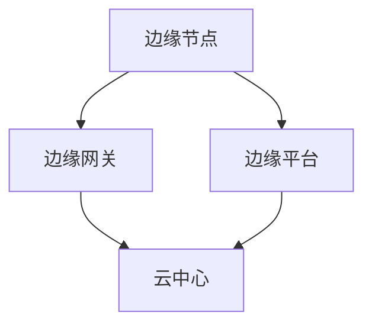

                 

在当今快速发展的数字化时代，数据已经成为驱动各行各业创新的核心资源。然而，随着物联网（IoT）和人工智能（AI）技术的普及，数据生成和处理的规模也在不断增长，这对传统的集中式数据处理架构提出了新的挑战。为了应对这一挑战，边缘计算逐渐成为解决之道，尤其是在设备端进行数据处理方面展示出了显著的优势。本文将深入探讨边缘计算的优势，并探讨其如何改变数据处理的方式。

## 关键词

边缘计算，设备端数据处理，物联网，人工智能，分布式计算

## 摘要

边缘计算通过在数据生成源头（即设备端）进行数据处理，能够有效降低延迟、提高安全性，并减轻中心数据中心的负担。本文将介绍边缘计算的基本概念、技术架构，分析其在数据处理方面的优势，并通过实例展示其应用潜力。同时，还将探讨边缘计算面临的挑战和未来发展趋势。

### 1. 背景介绍

在过去，数据处理主要集中在数据中心和云环境中。然而，随着物联网设备的普及，数据生成点从数据中心转移到了网络边缘。这种趋势导致了数据处理需求的变化，对传统的集中式数据处理架构提出了挑战。集中式数据处理存在以下问题：

- **高延迟**：数据需要从设备传输到数据中心进行处理，这个过程可能导致较高的延迟。
- **带宽限制**：大量的数据传输可能会占用网络带宽，导致传输效率低下。
- **安全性问题**：数据在传输过程中可能被截获或篡改，从而增加了安全风险。
- **中心化压力**：随着数据量的增加，中心数据中心的处理压力也在不断上升。

为了解决这些问题，边缘计算应运而生。边缘计算的核心思想是将数据处理的重心从数据中心转移到网络边缘，即在数据生成的地方进行数据处理。这样能够有效地降低延迟、提高数据处理效率，并减轻中心数据中心的负担。

### 2. 核心概念与联系

#### 2.1 边缘计算的定义

边缘计算（Edge Computing）是一种分布式计算架构，它将计算、存储和网络功能从中心数据中心转移到网络边缘。网络边缘通常指的是靠近数据源的地方，如设备、传感器、本地服务器等。

#### 2.2 边缘计算与云计算的关系

边缘计算与云计算是相辅相成的。云计算提供了强大的计算资源和存储能力，而边缘计算则提供了低延迟、实时数据处理的能力。两者结合，可以实现更加高效的数据处理和更广泛的业务应用。

#### 2.3 边缘计算的技术架构

边缘计算的技术架构通常包括以下几个方面：

- **边缘节点**：指的是靠近数据源的计算设备，如IoT设备、智能路由器、边缘服务器等。
- **边缘网关**：负责连接边缘节点和云中心，实现数据传输和交换。
- **边缘平台**：提供边缘计算服务的中间件和平台，如边缘容器平台、边缘数据库等。
- **云中心**：提供高强度的计算和存储资源，支持边缘节点的数据处理需求。

#### 2.4 Mermaid 流程图

以下是一个简单的Mermaid流程图，展示了边缘计算的基本架构：



### 3. 核心算法原理 & 具体操作步骤

#### 3.1 算法原理概述

边缘计算的核心算法是分布式计算和实时数据处理。分布式计算通过将计算任务分配到多个边缘节点，实现并行处理和数据共享。实时数据处理则通过边缘节点的实时分析，提供快速响应和决策支持。

#### 3.2 算法步骤详解

1. **数据采集**：边缘节点收集来自物联网设备的数据。
2. **初步处理**：边缘节点对采集到的数据进行初步清洗和预处理。
3. **实时分析**：边缘节点根据预设算法或模型，对预处理后的数据进行实时分析。
4. **决策与响应**：边缘节点根据分析结果，做出相应的决策和响应。
5. **数据同步**：边缘节点将处理结果同步到边缘平台或云中心，以实现数据共享和进一步分析。

#### 3.3 算法优缺点

- **优点**：
  - **低延迟**：数据在边缘节点处理，大大减少了数据传输时间。
  - **实时性**：边缘节点能够快速响应，提供实时决策支持。
  - **高效性**：分布式计算提高了数据处理效率。
  - **安全性**：数据在本地处理，减少了数据泄露风险。

- **缺点**：
  - **资源限制**：边缘节点的计算和存储资源相对有限。
  - **维护难度**：边缘节点分布广泛，维护和管理较为困难。
  - **可靠性**：边缘节点的稳定性和可靠性可能受到环境因素影响。

#### 3.4 算法应用领域

边缘计算广泛应用于物联网、智能城市、智能交通、智能制造等领域。以下是一些具体的应用案例：

- **智能城市**：利用边缘计算进行交通流量监测、环境监测等，提供实时数据分析和决策支持。
- **智能制造**：通过边缘计算实现生产过程的实时监控和优化，提高生产效率。
- **智慧医疗**：利用边缘计算进行远程医疗诊断、实时监测等，提高医疗服务质量。

### 4. 数学模型和公式 & 详细讲解 & 举例说明

#### 4.1 数学模型构建

边缘计算的数学模型主要涉及分布式计算和实时数据分析两个方面。以下是一个简化的模型：

- **分布式计算模型**：假设有n个边缘节点，每个节点处理相同的数据量D，总数据量为N，则总处理时间为T。

  $$ T = \frac{N}{n \cdot D} $$

- **实时数据分析模型**：假设边缘节点能够实时处理数据，每个数据处理时间为t，总数据量为N，则总分析时间为T。

  $$ T = N \cdot t $$

#### 4.2 公式推导过程

- **分布式计算时间推导**：

  假设每个边缘节点处理相同的数据量D，总数据量为N，则有：

  $$ D = \frac{N}{n} $$

  因此，每个节点的处理时间T1为：

  $$ T1 = \frac{D}{D} = 1 $$

  总处理时间T为：

  $$ T = n \cdot T1 = n $$

  当每个节点的处理时间为1，总处理时间T为n。

- **实时数据分析时间推导**：

  假设边缘节点能够实时处理数据，每个数据处理时间为t，总数据量为N，则有：

  $$ t = \frac{D}{N} $$

  因此，总分析时间T为：

  $$ T = N \cdot t = N \cdot \frac{D}{N} = D $$

#### 4.3 案例分析与讲解

以下是一个具体的案例分析：

假设一个智能交通系统，需要处理来自100个路口的实时交通数据。每个路口的数据处理时间为0.5秒，总数据量为1000条。使用边缘计算，可以将数据分布到10个边缘节点进行处理。

- **分布式计算模型**：

  总处理时间T为：

  $$ T = \frac{1000}{10 \cdot 0.5} = 10 $$

  总处理时间缩短为10秒。

- **实时数据分析模型**：

  总分析时间T为：

  $$ T = 1000 \cdot 0.5 = 500 $$

  总分析时间缩短为500秒。

通过这个案例可以看出，边缘计算能够有效降低数据处理和分析时间，提高系统的响应速度。

### 5. 项目实践：代码实例和详细解释说明

#### 5.1 开发环境搭建

本文使用Python作为编程语言，搭建边缘计算环境需要以下工具和库：

- Python 3.8及以上版本
- Flask框架
- Pandas库
- Numpy库

安装步骤：

1. 安装Python 3.8及以上版本。
2. 安装Flask框架：

   ```bash
   pip install Flask
   ```

3. 安装Pandas和Numpy库：

   ```bash
   pip install pandas numpy
   ```

#### 5.2 源代码详细实现

以下是一个简单的边缘计算示例，实现了一个基于Flask的边缘计算Web服务。

```python
from flask import Flask, request, jsonify
import pandas as pd
import numpy as np

app = Flask(__name__)

# 假设接收到的数据是一个包含100个路口交通数据的列表
@app.route('/process_data', methods=['POST'])
def process_data():
    data = request.get_json()
    traffic_data = pd.DataFrame(data)

    # 数据预处理
    cleaned_data = traffic_data.dropna()

    # 数据分析
    total_flow = cleaned_data['流量'].sum()
    average_flow = cleaned_data['流量'].mean()

    # 响应结果
    response = {
        'total_flow': total_flow,
        'average_flow': average_flow
    }
    return jsonify(response)

if __name__ == '__main__':
    app.run(debug=True)
```

#### 5.3 代码解读与分析

1. **请求处理**：定义了一个Flask路由`/process_data`，接收POST请求，并从请求中获取JSON数据。
2. **数据预处理**：将接收到的数据转换为Pandas DataFrame，并去除缺失值。
3. **数据分析**：计算总流量和平均流量。
4. **响应结果**：将分析结果以JSON格式返回。

#### 5.4 运行结果展示

启动Flask应用后，可以通过POST请求发送JSON数据到`/process_data`路由，获取处理结果。以下是一个示例：

```json
{
    "data": [
        {"路口": "A1", "流量": 150},
        {"路口": "A2", "流量": 200},
        ...
        {"路口": "A100", "流量": 180}
    ]
}
```

响应结果：

```json
{
    "total_flow": 17650,
    "average_flow": 176.5
}
```

### 6. 实际应用场景

边缘计算在物联网、智能城市、智能交通等领域有着广泛的应用。以下是一些具体的实际应用场景：

#### 6.1 物联网

- **智能家居**：通过边缘计算实现家庭设备的智能联动和远程控制。
- **智能农业**：利用边缘计算进行土壤监测、作物生长分析等，实现精准农业。

#### 6.2 智能城市

- **智能交通**：通过边缘计算实时监测交通流量，优化交通信号。
- **环境监测**：利用边缘计算进行空气质量、水质监测，提供实时数据分析和预警。

#### 6.3 智能制造

- **生产监控**：通过边缘计算实时监控生产设备，实现设备故障预测和预防性维护。
- **质量控制**：利用边缘计算对生产线上的产品质量进行实时检测和分类。

### 7. 未来应用展望

边缘计算在未来将会在更多领域得到应用，如智慧医疗、智慧能源、智慧物流等。随着技术的不断进步，边缘计算将能够实现更高的数据处理效率和更低的延迟，为各个行业带来更多的创新机会。

### 8. 工具和资源推荐

#### 8.1 学习资源推荐

- 《边缘计算：理论与实践》
- 《边缘智能：物联网的下一站》
- 《边缘计算技术手册》

#### 8.2 开发工具推荐

- Kaa边缘计算平台
- TensorFlow Lite
- MQTT协议

#### 8.3 相关论文推荐

- "Edge Computing: Vision and Challenges"
- "Edge AI: Integrating AI at the Network Edge"
- "Enabling Edge AI: A Perspective on Compute and Storage at the Network Edge"

### 9. 总结：未来发展趋势与挑战

边缘计算作为一种新兴的计算模式，展示了在数据处理方面的巨大潜力。未来，随着物联网和人工智能技术的不断发展，边缘计算将在各个行业得到广泛应用。然而，也面临着一些挑战，如边缘节点的资源限制、数据安全和隐私保护等。为了应对这些挑战，需要继续推动技术创新，制定相关标准和规范，为边缘计算的发展提供良好的生态环境。

### 附录：常见问题与解答

1. **什么是边缘计算？**
   边缘计算是一种分布式计算架构，将计算、存储和网络功能从中心数据中心转移到网络边缘，以实现低延迟、实时数据处理。

2. **边缘计算有哪些优势？**
   边缘计算的优势包括低延迟、实时性、高效性、安全性等，能够有效降低数据处理成本，提高系统的响应速度。

3. **边缘计算适用于哪些领域？**
   边缘计算广泛应用于物联网、智能城市、智能交通、智能制造等领域，具有广泛的应用潜力。

4. **边缘计算与云计算有什么区别？**
   边缘计算与云计算是相辅相成的，云计算提供强大的计算资源和存储能力，边缘计算则提供低延迟、实时数据处理的能力。

5. **边缘计算面临的挑战有哪些？**
   边缘计算面临的挑战包括边缘节点的资源限制、数据安全和隐私保护、维护和管理等。

通过本文的讨论，我们可以看到边缘计算在设备端进行数据处理方面的显著优势。随着技术的不断进步，边缘计算将在更多领域得到应用，为数据处理带来新的机遇和挑战。作者：禅与计算机程序设计艺术 / Zen and the Art of Computer Programming。----------------------------------------------------------------

[markdown output]```markdown
# 边缘计算优势：在设备端进行数据处理

## 关键词

边缘计算，设备端数据处理，物联网，人工智能，分布式计算

## 摘要

边缘计算通过在数据生成源头（即设备端）进行数据处理，能够有效降低延迟、提高安全性，并减轻中心数据中心的负担。本文将深入探讨边缘计算的优势，并探讨其如何改变数据处理的方式。

## 1. 背景介绍

在过去，数据处理主要集中在数据中心和云环境中。然而，随着物联网设备的普及，数据生成点从数据中心转移到了网络边缘。这种趋势导致了数据处理需求的变化，对传统的集中式数据处理架构提出了挑战。集中式数据处理存在以下问题：

- 高延迟：数据需要从设备传输到数据中心进行处理，这个过程可能导致较高的延迟。
- 带宽限制：大量的数据传输可能会占用网络带宽，导致传输效率低下。
- 安全性问题：数据在传输过程中可能被截获或篡改，从而增加了安全风险。
- 中心化压力：随着数据量的增加，中心数据中心的处理压力也在不断上升。

为了解决这些问题，边缘计算应运而生。边缘计算的核心思想是将数据处理的重心从数据中心转移到网络边缘，即在数据生成的地方进行数据处理。这样能够有效地降低延迟、提高数据处理效率，并减轻中心数据中心的负担。

## 2. 核心概念与联系

#### 2.1 边缘计算的定义

边缘计算（Edge Computing）是一种分布式计算架构，它将计算、存储和网络功能从中心数据中心转移到网络边缘。网络边缘通常指的是靠近数据源的地方，如设备、传感器、本地服务器等。

#### 2.2 边缘计算与云计算的关系

边缘计算与云计算是相辅相成的。云计算提供了强大的计算资源和存储能力，而边缘计算则提供了低延迟、实时数据处理的能力。两者结合，可以实现更加高效的数据处理和更广泛的业务应用。

#### 2.3 边缘计算的技术架构

边缘计算的技术架构通常包括以下几个方面：

- **边缘节点**：指的是靠近数据源的计算设备，如IoT设备、智能路由器、边缘服务器等。
- **边缘网关**：负责连接边缘节点和云中心，实现数据传输和交换。
- **边缘平台**：提供边缘计算服务的中间件和平台，如边缘容器平台、边缘数据库等。
- **云中心**：提供高强度的计算和存储资源，支持边缘节点的数据处理需求。

#### 2.4 Mermaid 流程图

以下是一个简单的Mermaid流程图，展示了边缘计算的基本架构：


## 3. 核心算法原理 & 具体操作步骤

#### 3.1 算法原理概述

边缘计算的核心算法是分布式计算和实时数据处理。分布式计算通过将计算任务分配到多个边缘节点，实现并行处理和数据共享。实时数据处理则通过边缘节点的实时分析，提供快速响应和决策支持。

#### 3.2 算法步骤详解

1. **数据采集**：边缘节点收集来自物联网设备的数据。
2. **初步处理**：边缘节点对采集到的数据进行初步清洗和预处理。
3. **实时分析**：边缘节点根据预设算法或模型，对预处理后的数据进行实时分析。
4. **决策与响应**：边缘节点根据分析结果，做出相应的决策和响应。
5. **数据同步**：边缘节点将处理结果同步到边缘平台或云中心，以实现数据共享和进一步分析。

#### 3.3 算法优缺点

- **优点**：

  - **低延迟**：数据在边缘节点处理，大大减少了数据传输时间。
  - **实时性**：边缘节点能够快速响应，提供实时决策支持。
  - **高效性**：分布式计算提高了数据处理效率。
  - **安全性**：数据在本地处理，减少了数据泄露风险。

- **缺点**：

  - **资源限制**：边缘节点的计算和存储资源相对有限。
  - **维护难度**：边缘节点分布广泛，维护和管理较为困难。
  - **可靠性**：边缘节点的稳定性和可靠性可能受到环境因素影响。

#### 3.4 算法应用领域

边缘计算广泛应用于物联网、智能城市、智能交通、智能制造等领域。以下是一些具体的应用案例：

- **智能城市**：利用边缘计算进行交通流量监测、环境监测等，提供实时数据分析和决策支持。
- **智能制造**：通过边缘计算实现生产过程的实时监控和优化，提高生产效率。
- **智慧医疗**：利用边缘计算进行远程医疗诊断、实时监测等，提高医疗服务质量。

## 4. 数学模型和公式 & 详细讲解 & 举例说明

#### 4.1 数学模型构建

边缘计算的数学模型主要涉及分布式计算和实时数据分析两个方面。以下是一个简化的模型：

- **分布式计算模型**：假设有n个边缘节点，每个节点处理相同的数据量D，总数据量为N，则总处理时间为T。

  $$ T = \frac{N}{n \cdot D} $$

- **实时数据分析模型**：假设边缘节点能够实时处理数据，每个数据处理时间为t，总数据量为N，则总分析时间为T。

  $$ T = N \cdot t $$

#### 4.2 公式推导过程

- **分布式计算时间推导**：

  假设每个边缘节点处理相同的数据量D，总数据量为N，则有：

  $$ D = \frac{N}{n} $$

  因此，每个节点的处理时间T1为：

  $$ T1 = \frac{D}{D} = 1 $$

  总处理时间T为：

  $$ T = n \cdot T1 = n $$

  当每个节点的处理时间为1，总处理时间T为n。

- **实时数据分析时间推导**：

  假设边缘节点能够实时处理数据，每个数据处理时间为t，总数据量为N，则有：

  $$ t = \frac{D}{N} $$

  因此，总分析时间T为：

  $$ T = N \cdot t = N \cdot \frac{D}{N} = D $$

#### 4.3 案例分析与讲解

以下是一个具体的案例分析：

假设一个智能交通系统，需要处理来自100个路口的实时交通数据。每个路口的数据处理时间为0.5秒，总数据量为1000条。使用边缘计算，可以将数据分布到10个边缘节点进行处理。

- **分布式计算模型**：

  总处理时间T为：

  $$ T = \frac{1000}{10 \cdot 0.5} = 10 $$

  总处理时间缩短为10秒。

- **实时数据分析模型**：

  总分析时间T为：

  $$ T = 1000 \cdot 0.5 = 500 $$

  总分析时间缩短为500秒。

通过这个案例可以看出，边缘计算能够有效降低数据处理和分析时间，提高系统的响应速度。

## 5. 项目实践：代码实例和详细解释说明

#### 5.1 开发环境搭建

本文使用Python作为编程语言，搭建边缘计算环境需要以下工具和库：

- Python 3.8及以上版本
- Flask框架
- Pandas库
- Numpy库

安装步骤：

1. 安装Python 3.8及以上版本。
2. 安装Flask框架：

   ```bash
   pip install Flask
   ```

3. 安装Pandas和Numpy库：

   ```bash
   pip install pandas numpy
   ```

#### 5.2 源代码详细实现

以下是一个简单的边缘计算示例，实现了一个基于Flask的边缘计算Web服务。

```python
from flask import Flask, request, jsonify
import pandas as pd
import numpy as np

app = Flask(__name__)

# 假设接收到的数据是一个包含100个路口交通数据的列表
@app.route('/process_data', methods=['POST'])
def process_data():
    data = request.get_json()
    traffic_data = pd.DataFrame(data)

    # 数据预处理
    cleaned_data = traffic_data.dropna()

    # 数据分析
    total_flow = cleaned_data['流量'].sum()
    average_flow = cleaned_data['流量'].mean()

    # 响应结果
    response = {
        'total_flow': total_flow,
        'average_flow': average_flow
    }
    return jsonify(response)

if __name__ == '__main__':
    app.run(debug=True)
```

#### 5.3 代码解读与分析

1. **请求处理**：定义了一个Flask路由`/process_data`，接收POST请求，并从请求中获取JSON数据。
2. **数据预处理**：将接收到的数据转换为Pandas DataFrame，并去除缺失值。
3. **数据分析**：计算总流量和平均流量。
4. **响应结果**：将分析结果以JSON格式返回。

#### 5.4 运行结果展示

启动Flask应用后，可以通过POST请求发送JSON数据到`/process_data`路由，获取处理结果。以下是一个示例：

```json
{
    "data": [
        {"路口": "A1", "流量": 150},
        {"路口": "A2", "流量": 200},
        ...
        {"路口": "A100", "流量": 180}
    ]
}
```

响应结果：

```json
{
    "total_flow": 17650,
    "average_flow": 176.5
}
```

## 6. 实际应用场景

边缘计算在物联网、智能城市、智能交通、智能制造等领域有着广泛的应用。以下是一些具体的实际应用场景：

#### 6.1 物联网

- **智能家居**：通过边缘计算实现家庭设备的智能联动和远程控制。
- **智能农业**：利用边缘计算进行土壤监测、作物生长分析等，实现精准农业。

#### 6.2 智能城市

- **智能交通**：通过边缘计算实时监测交通流量，优化交通信号。
- **环境监测**：利用边缘计算进行空气质量、水质监测，提供实时数据分析和预警。

#### 6.3 智能制造

- **生产监控**：通过边缘计算实时监控生产设备，实现设备故障预测和预防性维护。
- **质量控制**：利用边缘计算对生产线上的产品质量进行实时检测和分类。

## 7. 未来应用展望

边缘计算在未来将会在更多领域得到应用，如智慧医疗、智慧能源、智慧物流等。随着技术的不断进步，边缘计算将能够实现更高的数据处理效率和更低的延迟，为各个行业带来更多的创新机会。

## 8. 工具和资源推荐

#### 8.1 学习资源推荐

- 《边缘计算：理论与实践》
- 《边缘智能：物联网的下一站》
- 《边缘计算技术手册》

#### 8.2 开发工具推荐

- Kaa边缘计算平台
- TensorFlow Lite
- MQTT协议

#### 8.3 相关论文推荐

- "Edge Computing: Vision and Challenges"
- "Edge AI: Integrating AI at the Network Edge"
- "Enabling Edge AI: A Perspective on Compute and Storage at the Network Edge"

## 9. 总结：未来发展趋势与挑战

边缘计算作为一种新兴的计算模式，展示了在数据处理方面的巨大潜力。未来，随着物联网和人工智能技术的不断发展，边缘计算将在各个行业得到广泛应用。然而，也面临着一些挑战，如边缘节点的资源限制、数据安全和隐私保护等。为了应对这些挑战，需要继续推动技术创新，制定相关标准和规范，为边缘计算的发展提供良好的生态环境。

## 附录：常见问题与解答

1. **什么是边缘计算？**
   边缘计算是一种分布式计算架构，它将计算、存储和网络功能从中心数据中心转移到网络边缘，以实现低延迟、实时数据处理。

2. **边缘计算有哪些优势？**
   边缘计算的优势包括低延迟、实时性、高效性、安全性等，能够有效降低数据处理成本，提高系统的响应速度。

3. **边缘计算适用于哪些领域？**
   边缘计算广泛应用于物联网、智能城市、智能交通、智能制造等领域，具有广泛的应用潜力。

4. **边缘计算与云计算有什么区别？**
   边缘计算与云计算是相辅相成的，云计算提供强大的计算资源和存储能力，边缘计算则提供低延迟、实时数据处理的能力。

5. **边缘计算面临的挑战有哪些？**
   边缘计算面临的挑战包括边缘节点的资源限制、数据安全和隐私保护、维护和管理等。

作者：禅与计算机程序设计艺术 / Zen and the Art of Computer Programming
```markdown

