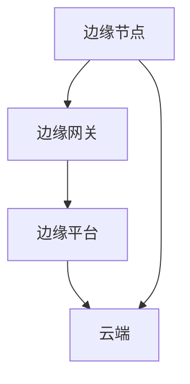

                 

关键词：边缘计算、数据处理、设备端、计算效率、实时性、安全性

> 摘要：随着物联网、人工智能和5G技术的快速发展，边缘计算逐渐成为提升数据处理效率、保障实时性和安全性的关键技术。本文将从边缘计算的背景出发，深入探讨其在设备端进行数据处理的巨大优势，并通过实际案例分析，展望其未来发展趋势与挑战。

## 1. 背景介绍

边缘计算（Edge Computing）是一种分布式计算架构，通过在网络边缘（接近数据源和终端设备）部署计算、存储和网络资源，实现数据的本地处理、分析和决策。传统的云计算模式中，数据需要上传至云端进行处理，这种方式在数据量大、实时性要求高、安全性需求严格的场景下存在诸多不足。而边缘计算则可以有效地缓解这些问题，提高数据处理效率，保障系统的实时性和安全性。

边缘计算的兴起，得益于以下几个因素的推动：

1. **物联网（IoT）的快速发展**：随着各类智能设备的广泛应用，产生的数据量呈指数级增长，对数据处理速度和实时性的要求也越来越高。
2. **5G技术的普及**：5G技术的低延迟、高带宽特性，为边缘计算提供了坚实的基础。
3. **人工智能（AI）技术的进步**：AI技术的发展，使得边缘设备能够具备更强的数据处理和分析能力。
4. **数据隐私和安全性的需求**：随着数据隐私和信息安全问题日益突出，数据在本地进行处理可以更好地保障数据安全。

## 2. 核心概念与联系

边缘计算的核心概念包括边缘节点、边缘网关、边缘平台等。这些概念相互联系，共同构成了边缘计算体系架构。

### 2.1 边缘节点

边缘节点是指网络边缘处的计算设备，如工业机器人、智能摄像头、智能手机等。它们可以独立执行数据处理任务，也可以与其他边缘节点协同工作。

### 2.2 边缘网关

边缘网关是连接边缘节点和云端的桥梁，负责数据传输、协议转换和安全防护等功能。边缘网关不仅承担着数据传输的任务，还可以进行初步的数据处理和分析。

### 2.3 边缘平台

边缘平台是边缘计算的核心，负责资源的调度、管理和监控。边缘平台可以集成各类中间件和服务，提供高效、可靠的数据处理能力。

### 2.4 Mermaid 流程图

以下是一个简化的边缘计算架构的 Mermaid 流程图：



## 3. 核心算法原理 & 具体操作步骤

边缘计算的核心在于如何在边缘节点上高效地处理数据。以下是一个典型的边缘数据处理流程：

### 3.1 算法原理概述

边缘数据处理算法主要包括以下几个步骤：

1. **数据采集**：从边缘节点收集数据。
2. **数据预处理**：对数据进行清洗、格式化等预处理操作。
3. **实时分析**：在边缘节点上执行实时数据分析，如异常检测、预测分析等。
4. **决策执行**：根据分析结果，执行相应的操作，如控制设备开关、发送警报等。
5. **数据上传**：将处理后的数据上传至云端进行进一步分析。

### 3.2 算法步骤详解

1. **数据采集**：边缘节点通过传感器或其他设备收集数据，如温度、湿度、图像等。
2. **数据预处理**：对采集到的数据进行清洗、去噪、归一化等预处理操作，以提高数据质量。
3. **实时分析**：利用机器学习、深度学习等算法，对预处理后的数据进行实时分析，如异常检测、分类识别等。
4. **决策执行**：根据分析结果，执行相应的操作。例如，如果检测到设备故障，可以自动发送维修通知。
5. **数据上传**：将处理后的数据上传至云端，用于长期存储和进一步分析。

### 3.3 算法优缺点

**优点**：

1. **实时性高**：数据在边缘节点上进行处理，减少了数据传输延迟。
2. **安全性好**：数据在本地处理，可以更好地保障数据隐私和安全。
3. **减轻云端压力**：边缘节点分担了部分数据处理任务，减轻了云端的计算压力。

**缺点**：

1. **计算能力有限**：边缘节点的计算能力相对较弱，可能无法处理复杂的数据分析任务。
2. **网络不稳定**：边缘节点可能处于网络较差的环境中，数据传输可能受到影响。

### 3.4 算法应用领域

边缘数据处理算法广泛应用于多个领域，如：

1. **智能工厂**：对生产设备进行实时监控和故障预测。
2. **智能交通**：对交通流量进行实时分析和调度。
3. **智能医疗**：对医疗数据进行分析和诊断。
4. **智能城市**：对城市环境数据进行实时监测和管理。

## 4. 数学模型和公式 & 详细讲解 & 举例说明

边缘数据处理过程中，常常会涉及到一些数学模型和公式。以下是一个简单的例子：

### 4.1 数学模型构建

假设我们有一个时间序列数据集 \(X = \{x_1, x_2, ..., x_n\}\)，我们希望对数据进行异常检测。可以使用以下数学模型：

$$
z = \frac{x_i - \bar{x}}{\sigma}
$$

其中，\(\bar{x}\) 是数据集的平均值，\(\sigma\) 是数据集的标准差，\(z\) 是每个数据点的标准化值。

### 4.2 公式推导过程

首先，计算数据集的平均值：

$$
\bar{x} = \frac{1}{n}\sum_{i=1}^{n}x_i
$$

然后，计算数据集的标准差：

$$
\sigma = \sqrt{\frac{1}{n-1}\sum_{i=1}^{n}(x_i - \bar{x})^2}
$$

最后，将每个数据点进行标准化：

$$
z = \frac{x_i - \bar{x}}{\sigma}
$$

### 4.3 案例分析与讲解

假设我们有一个时间序列数据集，如下所示：

$$
X = \{2.5, 2.7, 2.8, 3.2, 4.0, 5.0, 6.0\}
$$

首先，计算平均值：

$$
\bar{x} = \frac{1}{7}\sum_{i=1}^{7}x_i = \frac{2.5 + 2.7 + 2.8 + 3.2 + 4.0 + 5.0 + 6.0}{7} = 3.8
$$

然后，计算标准差：

$$
\sigma = \sqrt{\frac{1}{7-1}\sum_{i=1}^{7}(x_i - \bar{x})^2} = \sqrt{\frac{1}{6}(2.5 - 3.8)^2 + (2.7 - 3.8)^2 + (2.8 - 3.8)^2 + (3.2 - 3.8)^2 + (4.0 - 3.8)^2 + (5.0 - 3.8)^2 + (6.0 - 3.8)^2} \approx 1.6
$$

最后，计算每个数据点的标准化值：

$$
z = \frac{x_i - \bar{x}}{\sigma}
$$

对于每个数据点，我们有：

$$
z_1 = \frac{2.5 - 3.8}{1.6} \approx -0.68
$$

$$
z_2 = \frac{2.7 - 3.8}{1.6} \approx -0.44
$$

$$
z_3 = \frac{2.8 - 3.8}{1.6} \approx -0.25
$$

$$
z_4 = \frac{3.2 - 3.8}{1.6} \approx -0.13
$$

$$
z_5 = \frac{4.0 - 3.8}{1.6} \approx 0.06
$$

$$
z_6 = \frac{5.0 - 3.8}{1.6} \approx 0.63
$$

$$
z_7 = \frac{6.0 - 3.8}{1.6} \approx 1.19
$$

根据标准化值，我们可以判断数据点 \(x_7 = 6.0\) 为异常值，因为它对应的标准化值 \(z_7\) 明显大于其他数据点。

## 5. 项目实践：代码实例和详细解释说明

### 5.1 开发环境搭建

为了演示边缘数据处理，我们将使用 Python 编写一个简单的边缘节点程序。首先，确保你的系统上安装了 Python 3 和必要的库，如 NumPy、Pandas 和 Matplotlib。

### 5.2 源代码详细实现

以下是一个简单的边缘数据处理程序的示例代码：

```python
import numpy as np
import pandas as pd
import matplotlib.pyplot as plt

# 生成示例时间序列数据
np.random.seed(0)
data = np.random.normal(size=100)
data = pd.Series(data)

# 数据预处理
data = data.rolling(window=5).mean()

# 实时分析
z_scores = (data - data.mean()) / data.std()

# 决策执行
threshold = 2
outliers = z_scores.abs() > threshold
print("检测到的异常值：", data[outliers])

# 运行结果展示
plt.figure(figsize=(10, 5))
plt.plot(data, label='原始数据')
plt.plot(data[outliers], 'r.', label='异常值')
plt.legend()
plt.show()
```

### 5.3 代码解读与分析

1. **数据生成**：使用 NumPy 生成一个标准正态分布的随机数序列，作为示例时间序列数据。

2. **数据预处理**：使用 Pandas 的 rolling 方法对数据进行移动平均，以平滑数据。

3. **实时分析**：计算数据的标准化值，即 z-score。

4. **决策执行**：设置一个阈值，判断哪些数据点为异常值。

5. **运行结果展示**：使用 Matplotlib 绘制原始数据和异常值，以便于观察。

### 5.4 运行结果展示

运行上述代码后，我们将看到一张图表，其中原始数据以蓝色线条表示，异常值以红色点表示。通过这种可视化方式，我们可以直观地识别出数据中的异常点。

## 6. 实际应用场景

边缘计算在各个领域的应用越来越广泛，以下是一些实际应用场景：

1. **智能制造**：在制造过程中，边缘计算可以实时监控设备的运行状态，预测设备故障，提高生产效率。
2. **智能交通**：通过边缘计算，可以对交通流量进行实时分析，优化交通信号控制，减少交通拥堵。
3. **智能医疗**：在医疗领域，边缘计算可以实时分析患者的生理数据，快速诊断疾病，提高医疗服务质量。
4. **智能城市**：在城市管理中，边缘计算可以对城市环境数据进行实时监测，提高城市管理水平。

## 7. 未来应用展望

随着技术的不断进步，边缘计算的应用前景十分广阔。未来，边缘计算有望在以下几个方向取得重大突破：

1. **边缘智能**：通过集成 AI 技术，实现边缘设备自主学习和决策能力，提高边缘计算的智能化水平。
2. **网络协同**：构建边缘计算与云端的协同网络，实现数据的跨域共享和分析，提升整体计算效率。
3. **安全隐私**：加强边缘计算的安全防护机制，保障数据的安全和隐私。
4. **能耗优化**：通过优化边缘设备的能耗管理，提高边缘计算的可持续性。

## 8. 总结：未来发展趋势与挑战

边缘计算作为新兴的技术领域，具有巨大的发展潜力。然而，也面临着一系列挑战：

1. **计算能力**：边缘设备计算能力有限，如何提高边缘设备的计算能力是未来研究的重要方向。
2. **网络安全**：边缘计算涉及到大量的数据传输和处理，如何保障数据的安全和隐私是亟待解决的问题。
3. **协同优化**：如何实现边缘计算与云端、其他边缘节点的协同优化，提高整体系统的性能和效率。

总之，边缘计算在提升数据处理效率、保障实时性和安全性方面具有显著优势。未来，随着技术的不断进步，边缘计算将在各个领域发挥更加重要的作用。

## 9. 附录：常见问题与解答

### 9.1 边缘计算与云计算的区别是什么？

**边缘计算**是指在数据源附近（如设备、传感器等）进行数据处理和计算，以降低数据传输延迟，提高实时性和安全性。**云计算**则是将数据处理和计算任务交由远程服务器（云）完成。

### 9.2 边缘计算的主要优势是什么？

边缘计算的主要优势包括：降低数据传输延迟、提高实时性、减少数据传输成本、提高数据安全性、减轻云端计算压力等。

### 9.3 边缘计算在哪些领域有广泛应用？

边缘计算在智能制造、智能交通、智能医疗、智能城市、智能家居等领域有广泛应用。

### 9.4 如何提高边缘设备的计算能力？

可以通过集成更高性能的处理器、采用分布式计算架构、优化算法和代码等方式提高边缘设备的计算能力。

### 9.5 边缘计算如何保障数据安全和隐私？

可以通过加密传输、数据去识别化、安全隔离等技术手段保障数据的安全和隐私。

---

作者：禅与计算机程序设计艺术 / Zen and the Art of Computer Programming
----------------------------------------------------------------

以上便是《边缘计算优势：在设备端进行数据处理》的完整文章。本文详细介绍了边缘计算的背景、核心概念、算法原理、数学模型、项目实践、实际应用场景、未来展望以及常见问题与解答。希望本文能够帮助读者更好地理解边缘计算的优势和应用，为未来的技术研究和实践提供参考。

