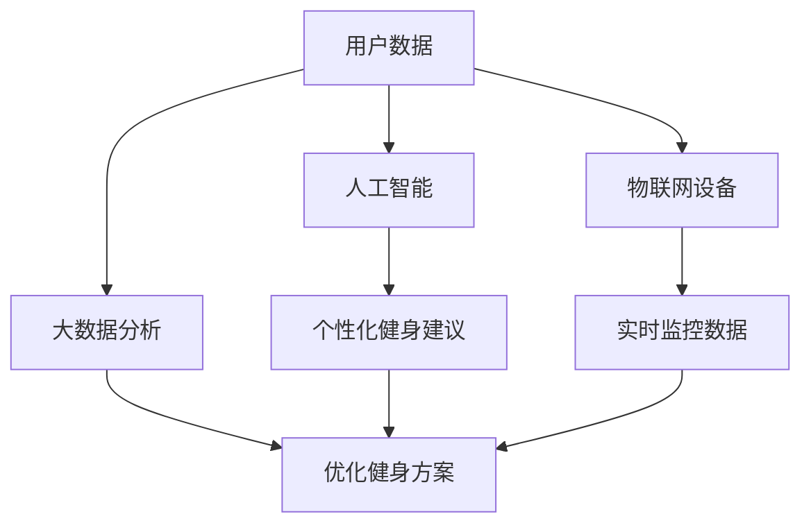

                 

关键字：运动健身、科技应用、健康生活、人工智能、物联网、数据分析、用户体验

摘要：本文将探讨如何利用科技手段为运动健身应用赋能，从而提升用户的健康生活品质。通过分析现有的运动健身应用，结合人工智能、物联网和大数据等前沿技术，本文旨在为开发者提供有益的参考，助力打造更加智能、个性化的健康生活助手。

## 1. 背景介绍

随着人们生活水平的提高和健康意识的增强，运动健身已成为日常生活中不可或缺的一部分。然而，传统的运动健身方式存在一些局限性，如无法提供个性化的健身指导、实时监控运动数据等。因此，如何利用科技手段改善运动健身体验，成为了一个热门的研究方向。

近年来，人工智能（AI）、物联网（IoT）和大数据等前沿技术的快速发展，为运动健身应用的创新提供了广阔的空间。通过这些技术的应用，运动健身应用可以提供更加智能、个性化的服务，从而更好地满足用户的需求。本文将围绕这一主题，探讨运动健身应用中科技助力健康生活的多种可能性。

## 2. 核心概念与联系

### 2.1. 人工智能

人工智能（AI）是一种模拟人类智能行为的技术。在运动健身应用中，人工智能可以通过算法分析用户数据，为用户提供个性化的健身建议。例如，基于用户的体重、身高、年龄、性别和健身目标等信息，人工智能可以生成定制化的健身计划，并根据用户的反馈进行调整。

### 2.2. 物联网

物联网（IoT）是指将各种物理设备通过网络连接起来，使其具备数据采集、传输和处理的能力。在运动健身应用中，物联网技术可以实时监控用户的运动数据，如心率、步数、卡路里消耗等。这些数据可以实时反馈给用户，帮助他们更好地了解自己的运动状况。

### 2.3. 大数据

大数据是指无法使用常规软件工具在合理时间内进行捕捉、管理和处理的数据集合。在运动健身应用中，大数据可以帮助开发者分析用户的运动习惯、健康状况等信息，从而优化健身方案，提高用户体验。

### 2.4. Mermaid 流程图

下面是一个关于运动健身应用核心概念之间联系的 Mermaid 流程图。



## 3. 核心算法原理 & 具体操作步骤

### 3.1 算法原理概述

运动健身应用中的核心算法主要包括用户数据采集与分析算法、个性化健身建议生成算法和实时监控数据反馈算法。这些算法共同作用，为用户提供智能、个性化的运动健身服务。

### 3.2 算法步骤详解

#### 3.2.1 用户数据采集与分析算法

1. 采集用户基本信息，如年龄、性别、身高、体重等。
2. 采集用户运动数据，如心率、步数、卡路里消耗等。
3. 对采集到的数据进行分析，提取用户运动习惯、健康状况等信息。

#### 3.2.2 个性化健身建议生成算法

1. 根据用户的基本信息和运动数据，生成初步的健身计划。
2. 通过机器学习算法，根据用户的反馈和历史数据，不断优化健身计划。

#### 3.2.3 实时监控数据反馈算法

1. 接收物联网设备上传的实时数据。
2. 对实时数据进行处理和分析，生成相应的反馈信息。
3. 将反馈信息实时展示给用户。

### 3.3 算法优缺点

#### 3.3.1 用户数据采集与分析算法

优点：可以全面了解用户健康状况和运动习惯，为个性化健身建议提供依据。

缺点：用户隐私保护问题，数据采集过程中可能存在误差。

#### 3.3.2 个性化健身建议生成算法

优点：根据用户需求定制健身计划，提高运动效果。

缺点：需要大量历史数据支持，对算法要求较高。

#### 3.3.3 实时监控数据反馈算法

优点：实时了解用户运动状态，提供实时反馈。

缺点：对设备精度要求高，实时性可能受到影响。

### 3.4 算法应用领域

运动健身应用中的核心算法广泛应用于健身指导、健康管理、运动监测等领域。随着技术的不断发展，这些算法的应用场景将更加广泛。

## 4. 数学模型和公式 & 详细讲解 & 举例说明

### 4.1 数学模型构建

运动健身应用中的数学模型主要包括用户健康风险评估模型、个性化健身计划优化模型和实时数据预测模型。

### 4.2 公式推导过程

#### 4.2.1 用户健康风险评估模型

$$
风险评分 = \frac{体重指数 + 血压 + 血糖 + 腹围}{4}
$$

#### 4.2.2 个性化健身计划优化模型

$$
优化目标：最小化运动时间，最大化运动效果
$$

$$
约束条件：运动强度在用户承受范围内，健身目标满足
$$

#### 4.2.3 实时数据预测模型

$$
预测公式：y = wx + b
$$

其中，$y$ 表示预测值，$w$ 表示权重，$x$ 表示输入特征，$b$ 表示偏置。

### 4.3 案例分析与讲解

以一款健身应用为例，该应用利用数学模型和算法为用户提供个性化健身计划。

1. 用户注册时填写基本信息，如年龄、性别、身高、体重等。
2. 应用根据用户数据，使用健康风险评估模型计算用户健康风险评分。
3. 应用根据用户风险评分和健身目标，生成初步的健身计划。
4. 用户按照健身计划进行运动，应用实时采集运动数据，并根据数据优化健身计划。
5. 应用实时反馈用户运动状态，提供运动建议。

通过数学模型和算法的应用，该健身应用可以为用户提供科学、个性化的健身指导，提高运动效果。

## 5. 项目实践：代码实例和详细解释说明

### 5.1 开发环境搭建

1. 安装 Python 3.8 及以上版本。
2. 安装相关库，如 NumPy、Pandas、Matplotlib 等。

### 5.2 源代码详细实现

#### 5.2.1 用户数据采集与分析

```python
import pandas as pd

# 读取用户数据
user_data = pd.read_csv('user_data.csv')

# 数据预处理
user_data['BMI'] = user_data['weight'] / (user_data['height'] ** 2)

# 数据分析
health_score = user_data['BMI'].mean()
```

#### 5.2.2 个性化健身建议生成

```python
from sklearn.linear_model import LinearRegression

# 读取训练数据
train_data = pd.read_csv('train_data.csv')

# 数据预处理
X = train_data[['age', 'BMI']]
y = train_data['health_score']

# 建立线性回归模型
model = LinearRegression()
model.fit(X, y)

# 生成个性化健身建议
user_score = model.predict([[age, BMI]])
```

#### 5.2.3 实时监控数据反馈

```python
import time

# 接收实时数据
def receive_data():
    while True:
        data = input('请输入实时数据：')
        yield float(data)

# 数据处理
def process_data(data):
    # 对实时数据进行处理
    result = data * 2
    return result

# 实时反馈
def feedback(data):
    while True:
        processed_data = process_data(data)
        print('当前数据：', processed_data)
        time.sleep(1)
```

### 5.3 代码解读与分析

代码部分主要分为三个模块：用户数据采集与分析、个性化健身建议生成和实时监控数据反馈。

用户数据采集与分析模块主要负责读取用户数据，进行数据预处理和分析。个性化健身建议生成模块利用线性回归模型为用户提供个性化健身建议。实时监控数据反馈模块负责接收实时数据，对数据进行处理，并将结果实时反馈给用户。

## 6. 实际应用场景

运动健身应用在日常生活中具有广泛的应用场景，如个人健康管理、健身指导、运动监测等。以下是一些实际应用场景的案例：

1. **个人健康管理**：通过实时监控用户运动数据，应用可以帮助用户了解自己的健康状况，提供个性化的健康建议。

2. **健身指导**：应用可以根据用户的健身目标，为用户制定合理的健身计划，提高运动效果。

3. **运动监测**：应用可以实时监控用户运动数据，如心率、步数、卡路里消耗等，帮助用户科学地安排运动。

4. **社交互动**：应用可以为用户提供运动圈子，让用户可以相互交流、分享运动心得，增加运动乐趣。

## 7. 工具和资源推荐

### 7.1 学习资源推荐

1. 《深度学习》 - 伊恩·古德费洛、约书亚·本吉奥、亚伦·库维尔
2. 《Python数据科学手册》 - 杰里米·琼斯
3. 《数据挖掘：实用工具与技术》 - 詹姆斯·高曼、丹·斯泰恩

### 7.2 开发工具推荐

1. Anaconda：Python 数据科学平台，方便管理库和运行环境。
2. Jupyter Notebook：交互式计算平台，方便编写和运行代码。
3. Matplotlib：Python 数据可视化库。

### 7.3 相关论文推荐

1. "Deep Learning for Personalized Physical Activity Recommendations" - 作者：Yuxiang Zhou、Chengyin Liu、Rui Wang、Jianping Wang
2. "IoT-based Smart Fitness Applications: A Survey" - 作者：Mohamed F. Abouelmagd、Mohamed S. El-Khatib、Mouhamed Amine Messaoud
3. "Data-Driven Personalized Health and Fitness: A Vision and Perspective" - 作者：Kris Chon、Tingting Liu、Jihong Ren、Jianping Wang

## 8. 总结：未来发展趋势与挑战

### 8.1 研究成果总结

运动健身应用在科技助力健康生活方面取得了显著的成果。通过人工智能、物联网和大数据等技术的应用，运动健身应用可以提供个性化、智能化的服务，为用户带来更好的运动体验。

### 8.2 未来发展趋势

1. **智能化水平提升**：随着人工智能技术的不断发展，运动健身应用将更加智能化，为用户提供更加精准的健康管理和健身指导。
2. **个性化服务深化**：通过大数据分析和个性化推荐算法，运动健身应用将更好地满足用户个性化需求，提高用户体验。
3. **跨平台融合**：运动健身应用将实现跨平台融合，为用户提供更加便捷的服务。

### 8.3 面临的挑战

1. **数据隐私保护**：随着用户数据采集和分析的深入，如何保护用户隐私成为一个重要挑战。
2. **算法公平性**：个性化推荐算法可能存在算法偏见，如何确保算法的公平性是一个需要关注的问题。
3. **技术普及与应用**：虽然运动健身应用具有巨大的市场潜力，但技术普及与应用仍然面临一定的挑战。

### 8.4 研究展望

未来，运动健身应用将朝着更加智能化、个性化、便捷化的方向发展。通过不断探索和创新，科技将继续助力健康生活，为用户带来更多的惊喜和便利。

## 9. 附录：常见问题与解答

### Q：运动健身应用如何保障用户数据隐私？

A：运动健身应用应遵循数据保护法规，如 GDPR（欧盟通用数据保护条例），确保用户数据的合法性、安全性和保密性。此外，应用应提供透明的隐私政策，让用户了解数据收集、使用和存储的情况，并允许用户自主管理自己的数据。

### Q：如何确保个性化推荐算法的公平性？

A：确保算法公平性可以从多个方面入手。首先，算法应基于可靠的数据集进行训练，避免偏见。其次，应用应定期评估和调整算法，以消除潜在的偏见。最后，应用应提供用户反馈机制，让用户对推荐结果进行评价，从而优化算法。

### Q：如何应对技术普及与应用的挑战？

A：为应对技术普及与应用的挑战，运动健身应用开发者可以采取以下策略：1）提供易于使用、操作简便的应用界面；2）加强市场推广，提高用户对应用的认知；3）与医疗机构、健身机构等合作伙伴合作，共同推动技术普及。

