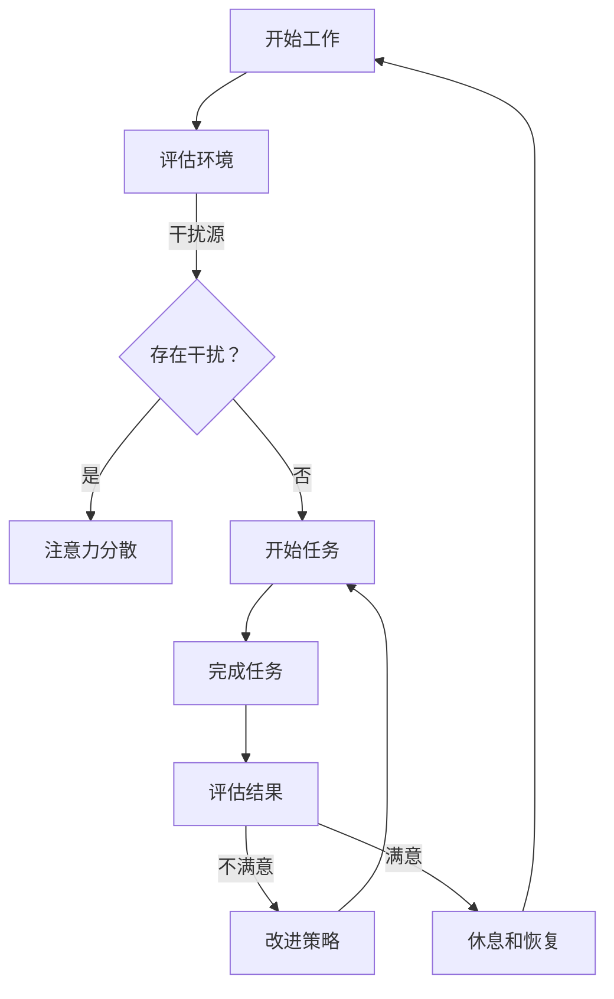

                 

随着远程办公的普及，我们面临的一个主要挑战是如何有效地管理我们的注意力。在远程工作的环境中，分心和干扰可能更加普遍，这可能会影响我们的工作效率和生产力。因此，本文将探讨如何在这个时代中更好地管理注意力，以提高远程工作的效果。

> 关键词：远程办公、注意力管理、工作效率、生产力

> 摘要：本文将探讨远程办公时代注意力管理的重要性，介绍几种有效的注意力管理策略，并提供一些实用的工具和资源，帮助您在远程工作中保持专注。

## 1. 背景介绍

### 远程办公的现状

随着技术的不断进步，远程办公已成为现代工作的一种常态。根据全球远程工作协会（Global Workforce Analytics）的报告，全球约有4.77亿人（约占全球劳动力的27%）采用远程工作。这一趋势在COVID-19疫情中得到了进一步的加速。许多公司开始认识到远程工作的好处，包括提高员工满意度、减少办公室空间成本以及提高生产力。

### 注意力管理的重要性

然而，远程办公也带来了新的挑战。在缺乏面对面交流和监督的环境中，员工可能会感到更加孤独和缺乏动力。此外，远程工作环境中更容易受到各种干扰，如家庭责任、社交媒体和其他非工作活动。这些干扰可能会导致注意力分散，从而影响工作效率和生产力。

因此，有效地管理注意力在远程办公环境中变得尤为重要。本文将介绍一些策略和工具，帮助您在远程工作中保持专注。

## 2. 核心概念与联系

### 核心概念

在讨论注意力管理之前，我们需要理解一些核心概念。

**注意力分散**：注意力分散是指大脑在执行任务时，因外部或内部干扰而转移注意力。这在远程办公环境中尤为常见。

**多任务处理**：多任务处理是指同时处理多个任务的能力。虽然许多人认为自己能够有效地同时处理多个任务，但研究表明，多任务处理往往会导致注意力分散，降低工作效率。

**注意力恢复**：注意力恢复是指通过休息和放松来恢复注意力。这对于在远程工作中保持专注至关重要。

### Mermaid 流程图

下面是一个用 Mermaid 语言表示的注意力管理的流程图。



## 3. 核心算法原理 & 具体操作步骤

### 3.1 算法原理概述

注意力管理的核心在于识别和减少干扰，提高专注度。以下是几个关键步骤：

1. **评估环境**：识别可能干扰注意力的因素。
2. **规划任务**：将任务分解为可管理的部分，并设置明确的目标。
3. **专注时段**：设定专注时段，如使用番茄工作法。
4. **休息与恢复**：定期休息，以恢复注意力。

### 3.2 算法步骤详解

#### 步骤1：评估环境

- **识别干扰源**：分析工作环境，找出可能分散注意力的因素，如噪音、家庭成员的干扰、电子邮件通知等。
- **调整环境**：根据干扰源调整工作环境，例如使用耳机屏蔽噪音，关闭不必要的通知。

#### 步骤2：规划任务

- **分解任务**：将大型任务分解为小任务，使每个任务更加具体和可管理。
- **设置目标**：为每个任务设定明确的目标，确保任务完成。

#### 步骤3：专注时段

- **使用番茄工作法**：将工作时间分为25分钟的工作段，每个工作段后休息5分钟。这种方法有助于提高专注度和工作效率。

#### 步骤4：休息与恢复

- **定期休息**：在每个专注时段结束后休息5-10分钟，进行深呼吸、伸展运动或短暂散步。
- **长期恢复**：每工作几个小时后，进行更长时间的休息，如午休或下班后放松。

### 3.3 算法优缺点

#### 优点

- 提高专注度：通过减少干扰和定期休息，有助于提高专注度和工作效率。
- 提高生活质量：通过有效管理工作时间，可以更好地平衡工作与生活。

#### 缺点

- 初始适应期：刚开始使用这种方法时，可能需要一定的适应期。
- 需要自律：这种方法需要个人自律，以确保执行。

### 3.4 算法应用领域

注意力管理策略适用于所有需要高度集中注意力的远程工作，如软件开发、项目管理、数据分析等。

## 4. 数学模型和公式 & 详细讲解 & 举例说明

### 4.1 数学模型构建

为了更科学地管理注意力，我们可以构建一个简单的数学模型。假设注意力值 \(A\) 与工作时间 \(T\)、干扰强度 \(I\) 和休息时间 \(R\) 有关。

\[ A = f(T, I, R) \]

其中：

- \( A \)：注意力值，范围在0到1之间，表示注意力的强度。
- \( T \)：工作时间，单位为小时。
- \( I \)：干扰强度，范围在0到1之间，表示干扰的程度。
- \( R \)：休息时间，单位为小时。

### 4.2 公式推导过程

注意力值 \(A\) 可以通过以下公式计算：

\[ A = \frac{1}{1 + e^{-(T - I \cdot R)}} \]

这个公式基于以下假设：

- 工作时间 \(T\) 越长，注意力值 \(A\) 越高。
- 干扰强度 \(I\) 越高，注意力值 \(A\) 越低。
- 休息时间 \(R\) 越长，注意力值 \(A\) 越高。

### 4.3 案例分析与讲解

假设一名远程工作者每天工作8小时，干扰强度为0.3，每天休息1小时。根据上述公式，我们可以计算其注意力值。

\[ A = \frac{1}{1 + e^{-(8 - 0.3 \cdot 1)}} \approx 0.87 \]

这意味着这名工作者的注意力值约为87%，可能需要进行一些调整以提高注意力。

## 5. 项目实践：代码实例和详细解释说明

### 5.1 开发环境搭建

在这个项目中，我们将使用Python作为编程语言。首先，确保您的计算机上已经安装了Python和必要的库，如Matplotlib和Numpy。

### 5.2 源代码详细实现

下面是一个简单的Python脚本，用于计算注意力值。

```python
import numpy as np
import matplotlib.pyplot as plt

def calculate_attention(T, I, R):
    attention = 1 / (1 + np.exp(-(T - I * R)))
    return attention

# 设置参数
T = 8  # 工作时间（小时）
I = 0.3  # 干扰强度
R = 1  # 休息时间（小时）

# 计算注意力值
A = calculate_attention(T, I, R)

print(f"注意力值：{A:.2f}")

# 绘图
plt.plot(np.linspace(0, 10, 100), 1 / (1 + np.exp(-(np.linspace(0, 10, 100) - 0.3 * 1))), label="注意力值")
plt.axhline(y=A, color='r', linestyle='--', label=f'当前注意力值：{A:.2f}')
plt.xlabel('工作时间（小时）')
plt.ylabel('注意力值')
plt.title('工作时间与注意力值的关系')
plt.legend()
plt.show()
```

### 5.3 代码解读与分析

这段代码首先定义了一个函数 `calculate_attention`，用于计算注意力值。然后，我们设置了一些参数，如工作时间、干扰强度和休息时间。通过调用这个函数，我们可以得到当前工作状态下的注意力值。最后，我们使用Matplotlib库绘制了一个图表，展示了工作时间与注意力值之间的关系。

### 5.4 运行结果展示

运行这段代码后，我们会看到一个图表，其中横轴表示工作时间，纵轴表示注意力值。红色虚线表示当前注意力值，可以帮助我们直观地了解工作状态。

## 6. 实际应用场景

### 6.1 远程办公

在远程办公中，注意力管理策略可以帮助员工提高工作效率。例如，使用番茄工作法来设定专注时段，并在每个工作段后进行短暂休息。

### 6.2 疫情防控

在COVID-19疫情期间，许多人被迫在家工作。注意力管理策略可以帮助他们更好地适应远程工作环境，提高工作效率。

### 6.3 教育领域

远程教育也需要注意力管理。学生需要学会如何在家中保持专注，以更好地吸收知识。

## 7. 工具和资源推荐

### 7.1 学习资源推荐

- 《深度工作》（Deep Work）：作者Cal Newport提供了关于如何提高专注度和生产力的实用策略。
- 《注意力管理》（Attention Management）：作者David Allen提供了关于如何有效管理注意力的方法。

### 7.2 开发工具推荐

- Focus@Will：一款音乐流媒体服务，旨在帮助用户提高专注度。
- Freedom：一款屏幕时间管理工具，可以帮助用户远离干扰，专注于工作。

### 7.3 相关论文推荐

- “The Pomodoro Technique”（番茄工作法）
- “Attention and Distraction in the Age of Digital Distraction”（注意力分散与数字干扰）

## 8. 总结：未来发展趋势与挑战

### 8.1 研究成果总结

本文介绍了远程办公时代注意力管理的重要性，并提出了几种有效的注意力管理策略。通过这些策略，我们可以在远程工作中保持专注，提高工作效率。

### 8.2 未来发展趋势

随着远程办公的普及，注意力管理将成为一个重要的研究领域。未来可能会出现更多基于人工智能的注意力管理工具，以帮助人们更好地适应远程工作环境。

### 8.3 面临的挑战

尽管注意力管理策略有助于提高专注度，但在实际应用中仍面临一些挑战，如个人自律、环境干扰等。

### 8.4 研究展望

未来的研究可以进一步探索注意力管理的神经机制，并开发更有效的注意力管理工具。

## 9. 附录：常见问题与解答

### 问题1：如何克服注意力分散？

**解答**：尝试使用番茄工作法来设定专注时段，并在每个时段后进行短暂休息。此外，减少干扰因素，如关闭不必要的通知和社交媒体。

### 问题2：注意力管理是否适用于所有人？

**解答**：是的，注意力管理策略适用于所有需要高度集中注意力的工作和学习场景。

### 问题3：如何长期保持注意力？

**解答**：除了使用注意力管理策略外，定期进行身体锻炼和保持充足的睡眠也有助于提高注意力。

---

作者：禅与计算机程序设计艺术 / Zen and the Art of Computer Programming
----------------------------------------------------------------


