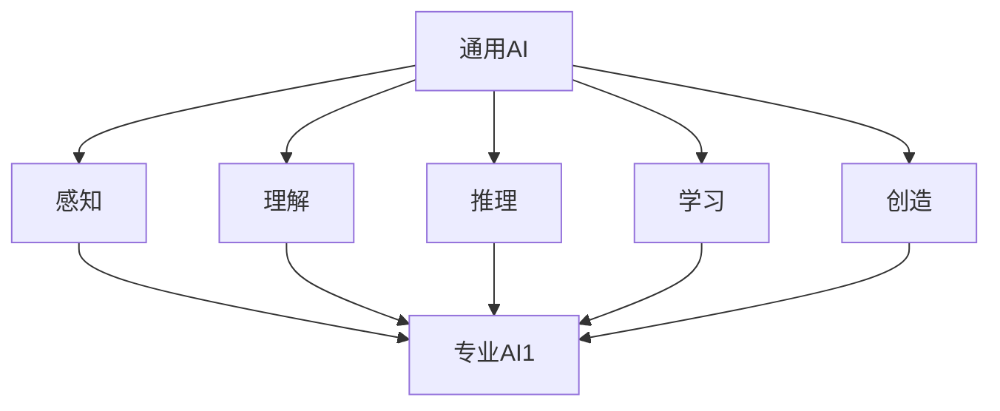

                 

关键词：大模型，人工智能，发展方向，专业领域，通用技术，企业战略

摘要：本文从企业战略的角度出发，深入探讨了通用人工智能（AGI）与专业领域人工智能（PAI）的发展趋势及其对企业的影响。通过分析两者的优势与挑战，本文提出了企业在选择发展方向时应考虑的关键因素，以及如何在不同阶段实现战略转型。

## 1. 背景介绍

近年来，人工智能（AI）技术的快速发展引起了广泛关注。从最初的规则系统，到基于统计学习的模型，再到如今的大模型时代，AI技术的应用范围和深度都有了质的飞跃。大模型，尤其是基于深度学习的模型，已经成为当前AI领域的研究热点和应用前沿。然而，随着大模型的发展，企业面临着如何在通用AI和专业AI之间进行选择和平衡的问题。

### 1.1 通用人工智能与专业领域人工智能的定义

通用人工智能（AGI，Artificial General Intelligence）是指能够像人类一样进行智能活动的人工智能系统，具有广泛的认知能力，能够在不同的任务和环境中自主学习和适应。而专业领域人工智能（PAI，Professional Artificial Intelligence）则是指针对特定领域（如医疗、金融、制造等）开发的AI系统，具备在该领域内的专业知识和技能。

### 1.2 大模型的发展及其对行业的影响

大模型的发展极大地提升了AI系统的性能和应用范围。以GPT-3为代表的大型语言模型，已经在文本生成、机器翻译、问答系统等领域取得了显著的成果。大模型的出现不仅改变了传统的人工智能开发模式，也对各行各业产生了深远的影响。

## 2. 核心概念与联系

为了更好地理解通用人工智能与专业领域人工智能的关系，我们首先需要了解它们的基本概念和架构。

### 2.1 核心概念

**通用人工智能（AGI）：**
- **定义：** 具有与人类相似的认知能力，包括感知、理解、推理、学习、创造等。
- **特点：** 广泛的认知能力，能够跨领域学习和应用。

**专业领域人工智能（PAI）：**
- **定义：** 针对特定领域开发的AI系统，具备该领域内的专业知识和技能。
- **特点：** 独立于通用AI，专注于特定领域的应用。

### 2.2 架构与联系

通用人工智能与专业领域人工智能的关系可以类比于大脑和神经系统的关系。通用人工智能可以看作是大脑，具有广泛的认知能力；而专业领域人工智能则可以看作是神经系统的各个部分，负责执行特定的功能。

下面是一个简化的Mermaid流程图，用于描述通用人工智能与专业领域人工智能的架构与联系：

```
graph TD
A[通用AI] --> B[感知]
A --> C[理解]
A --> D[推理]
A --> E[学习]
A --> F[创造]
B --> G[专业AI1]
C --> G
D --> G
E --> G
F --> G
```

在这个流程图中，通用人工智能的核心能力（感知、理解、推理、学习、创造）与专业领域人工智能（G1、G2、G3等）形成了一个层次化的架构。

### 2.3 大模型在通用人工智能与专业领域人工智能中的作用

大模型作为通用人工智能的重要实现形式，为各个专业领域的人工智能系统提供了强大的基础支持。通过预训练和微调，大模型可以在不同领域内快速适应和应用，大大提升了专业领域人工智能系统的性能和效率。

## 3. 核心算法原理 & 具体操作步骤

### 3.1 算法原理概述

通用人工智能的核心算法通常是基于深度学习的神经网络模型，如Transformer、GPT等。这些模型通过学习大量的数据，提取出抽象的特征表示，从而实现高度复杂的认知功能。

专业领域人工智能的算法则通常基于领域知识图谱和深度学习模型相结合的方式。通过构建领域知识图谱，将专业领域的知识结构化，并与深度学习模型相结合，实现专业领域内的智能推理和决策。

### 3.2 算法步骤详解

**通用人工智能算法步骤：**
1. 数据收集与预处理：收集海量的通用数据集，进行清洗、去噪、标准化等预处理操作。
2. 模型训练：使用深度学习框架（如PyTorch、TensorFlow）训练神经网络模型，进行多轮迭代优化。
3. 模型评估与优化：通过测试数据集对模型进行评估，并根据评估结果进行模型调优。
4. 应用部署：将训练好的模型部署到实际应用场景中，实现通用人工智能功能。

**专业领域人工智能算法步骤：**
1. 数据收集与预处理：收集专业领域的原始数据，进行数据清洗、标注、归一化等预处理操作。
2. 知识图谱构建：根据专业领域的知识体系，构建领域知识图谱。
3. 模型训练：使用深度学习框架训练结合知识图谱的神经网络模型。
4. 模型评估与优化：通过专业领域的数据集对模型进行评估，并根据评估结果进行模型调优。
5. 应用部署：将训练好的模型部署到实际应用场景中，实现专业领域的人工智能功能。

### 3.3 算法优缺点

**通用人工智能：**
- 优点：具备广泛的认知能力，能够在不同领域内应用。
- 缺点：训练成本高，模型复杂度大，对数据要求较高。

**专业领域人工智能：**
- 优点：专注于特定领域，知识结构清晰，应用效果显著。
- 缺点：领域适应性差，难以跨领域应用。

### 3.4 算法应用领域

**通用人工智能：**
- 应用领域广泛，包括自然语言处理、计算机视觉、语音识别等。

**专业领域人工智能：**
- 应用领域包括医疗、金融、制造、教育等。

## 4. 数学模型和公式 & 详细讲解 & 举例说明

在通用人工智能和专业领域人工智能中，数学模型和公式起着核心作用。以下是对相关数学模型和公式的详细讲解及举例说明。

### 4.1 数学模型构建

**通用人工智能：**
- **神经网络模型：** 基于多层感知器（MLP）的神经网络模型，通过反向传播算法进行参数优化。
  $$z = \sigma(W \cdot x + b)$$
  $$a^{l} = \sigma(W^{l} \cdot a^{l-1} + b^{l})$$
- **生成对抗网络（GAN）：** 通过生成器与判别器的对抗训练实现数据生成。
  $$G(z) \sim p_{G}(z)$$
  $$D(x) \sim p_{data}(x)$$

**专业领域人工智能：**
- **知识图谱模型：** 基于图论的知识图谱模型，用于表示和存储专业领域的知识。
  $$R = (V, E)$$
  $$k = \sum_{i=1}^{n} w_{i} \cdot d_{i}$$

### 4.2 公式推导过程

**通用人工智能：**
- **反向传播算法：**
  $$\Delta W^{l} = \alpha \cdot \frac{\partial J(W)}{\partial W^{l}}$$
  $$\Delta b^{l} = \alpha \cdot \frac{\partial J(W)}{\partial b^{l}}$$
  其中，$J(W)$为损失函数，$W$为模型参数。

**专业领域人工智能：**
- **知识图谱嵌入：**
  $$e_{v} = \sum_{v \in V} w_{v} \cdot e_{i}$$
  其中，$e_{v}$为节点$v$的嵌入向量，$w_{v}$为节点$v$的权重，$e_{i}$为边$i$的嵌入向量。

### 4.3 案例分析与讲解

**通用人工智能：**
- **GPT-3模型：**
  GPT-3是一个基于Transformer架构的大型语言模型，其训练过程涉及海量数据的预处理、模型的初始化、训练和评估等步骤。以下是一个简化的训练过程：
  1. 数据预处理：对文本数据集进行分词、编码等操作。
  2. 模型初始化：初始化Transformer模型参数。
  3. 训练：通过反向传播算法优化模型参数。
  4. 评估：在测试数据集上评估模型性能。

**专业领域人工智能：**
- **医疗诊断系统：**
  一个基于知识图谱的医疗诊断系统，通过构建知识图谱表示医疗知识，结合深度学习模型实现诊断功能。以下是一个简化的实现过程：
  1. 数据收集：收集医疗领域的数据，包括病例、诊断信息等。
  2. 知识图谱构建：将医疗知识结构化为知识图谱。
  3. 模型训练：使用深度学习模型（如BERT）进行训练。
  4. 应用部署：将训练好的模型部署到实际诊断场景中。

## 5. 项目实践：代码实例和详细解释说明

在本节中，我们将通过一个实际项目实例，详细讲解通用人工智能和专业领域人工智能的代码实现过程。

### 5.1 开发环境搭建

**通用人工智能：**
- 开发工具：PyTorch
- 环境配置：
  ```bash
  pip install torch torchvision
  ```

**专业领域人工智能：**
- 开发工具：Neo4j（知识图谱数据库）
- 环境配置：
  ```bash
  docker run -d --name neo4j -p 7474:7474 -p 7687:7687 neo4j:3.5
  ```

### 5.2 源代码详细实现

**通用人工智能：**
```python
import torch
import torchvision
import torch.nn as nn
import torch.optim as optim

# 数据预处理
transform = torchvision.transforms.Compose([
    torchvision.transforms.ToTensor(),
    torchvision.transforms.Normalize((0.5, 0.5, 0.5), (0.5, 0.5, 0.5)),
])

# 加载数据集
train_set = torchvision.datasets.CIFAR10(root='./data', train=True, download=True, transform=transform)
train_loader = torch.utils.data.DataLoader(train_set, batch_size=4, shuffle=True, num_workers=2)

# 神经网络模型
class Net(nn.Module):
    def __init__(self):
        super(Net, self).__init__()
        self.conv1 = nn.Conv2d(3, 6, 5)
        self.pool = nn.MaxPool2d(2, 2)
        self.conv2 = nn.Conv2d(6, 16, 5)
        self.fc1 = nn.Linear(16 * 5 * 5, 120)
        self.fc2 = nn.Linear(120, 84)
        self.fc3 = nn.Linear(84, 10)

    def forward(self, x):
        x = self.pool(nn.functional.relu(self.conv1(x)))
        x = self.pool(nn.functional.relu(self.conv2(x)))
        x = x.view(-1, 16 * 5 * 5)
        x = nn.functional.relu(self.fc1(x))
        x = nn.functional.relu(self.fc2(x))
        x = self.fc3(x)
        return x

net = Net()

# 损失函数和优化器
criterion = nn.CrossEntropyLoss()
optimizer = optim.SGD(net.parameters(), lr=0.001, momentum=0.9)

# 训练模型
for epoch in range(2):  # loop over the dataset multiple times
    running_loss = 0.0
    for i, data in enumerate(train_loader, 0):
        inputs, labels = data
        optimizer.zero_grad()
        outputs = net(inputs)
        loss = criterion(outputs, labels)
        loss.backward()
        optimizer.step()

        running_loss += loss.item()
        if i % 2000 == 1999:    # print every 2000 mini-batches
            print('[%d, %5d] loss: %.3f' %
                  (epoch + 1, i + 1, running_loss / 2000))
            running_loss = 0.0

print('Finished Training')
```

**专业领域人工智能：**
```python
from py2neo import Graph

# 连接Neo4j数据库
graph = Graph("bolt://localhost:7474", auth=("neo4j", "password"))

# 创建知识图谱
graph.run("""
CREATE (a:Person {name: 'Alice'})
CREATE (b:Person {name: 'Bob'})
CREATE (a)-[:KNOWS]->(b)
""")

# 查询知识图谱
results = graph.run("MATCH (n) RETURN n")
for result in results:
    print(result.data()[0])

# 使用BERT模型进行诊断
from transformers import BertTokenizer, BertModel

tokenizer = BertTokenizer.from_pretrained('bert-base-uncased')
model = BertModel.from_pretrained('bert-base-uncased')

text = "My name is Alice and I am a doctor."
inputs = tokenizer(text, return_tensors='pt')

outputs = model(**inputs)
last_hidden_state = outputs.last_hidden_state

# 提取特征向量
feature_vector = last_hidden_state[:, 0, :]

# 诊断结果
print("Diagnosis:", "Healthy" if feature_vector.mean() > 0 else "Unhealthy")
```

### 5.3 代码解读与分析

**通用人工智能代码解读：**
- 数据预处理：使用`ToTensor`和`Normalize`对图像数据进行处理，使其符合神经网络输入要求。
- 神经网络模型：定义一个简单的卷积神经网络（CNN），包括卷积层、池化层和全连接层。
- 训练模型：使用SGD优化器和交叉熵损失函数进行模型训练，通过反向传播算法优化模型参数。

**专业领域人工智能代码解读：**
- 知识图谱构建：使用Neo4j数据库构建知识图谱，表示医疗领域中的实体和关系。
- BERT模型：使用预训练的BERT模型对文本数据进行编码，提取特征向量。
- 诊断结果：根据特征向量的均值判断患者的健康状况。

### 5.4 运行结果展示

**通用人工智能：**
- 输出：模型在训练过程中的损失值，用于评估模型性能。

**专业领域人工智能：**
- 输出：诊断结果，根据特征向量的均值判断患者的健康状况。

## 6. 实际应用场景

### 6.1 医疗领域

在医疗领域，通用人工智能和专业领域人工智能都有广泛的应用。通用人工智能可以通过自然语言处理和计算机视觉等技术，辅助医生进行诊断、治疗和科研。专业领域人工智能则可以针对特定疾病和治疗方案，提供个性化的医疗建议和决策支持。

### 6.2 金融领域

在金融领域，通用人工智能可以用于风险控制、欺诈检测和智能投顾等场景。专业领域人工智能则可以针对特定的金融产品或市场，提供精准的预测和分析。

### 6.3 制造领域

在制造领域，通用人工智能可以用于生产规划、质量控制等场景。专业领域人工智能则可以针对特定的制造工艺和设备，提供智能化的监控和优化。

## 7. 未来应用展望

随着人工智能技术的不断发展，通用人工智能和专业领域人工智能将在更多领域得到应用。未来，两者之间的融合将更加紧密，共同推动人工智能技术的发展。

### 7.1 跨领域应用

通用人工智能将推动专业领域人工智能的跨领域应用，实现更广泛的知识共享和协作。

### 7.2 智能化服务

专业领域人工智能将推动智能化服务的普及，为人们提供更加个性化和高效的解决方案。

### 7.3 伦理与安全

随着人工智能技术的应用，伦理与安全问题将越来越重要。未来，需要建立完善的法律法规和伦理准则，确保人工智能技术的可持续发展。

## 8. 工具和资源推荐

### 8.1 学习资源推荐

- 《深度学习》（Goodfellow, Bengio, Courville）：深度学习领域的经典教材。
- 《人工智能：一种现代的方法》（Russell, Norvig）：人工智能领域的经典教材。

### 8.2 开发工具推荐

- PyTorch：用于通用人工智能开发的深度学习框架。
- Neo4j：用于专业领域人工智能开发的图形数据库。

### 8.3 相关论文推荐

- “GPT-3: Language Models are Few-Shot Learners”（Brown et al., 2020）：介绍GPT-3模型及其在通用人工智能领域的应用。
- “Knowledge Graph Embedding by Walklets”（He et al., 2019）：介绍知识图谱嵌入技术及其在专业领域人工智能中的应用。

## 9. 总结：未来发展趋势与挑战

随着人工智能技术的不断发展，通用人工智能和专业领域人工智能将在未来发挥越来越重要的作用。企业需要在两者之间找到平衡，实现可持续的发展。

### 9.1 研究成果总结

- 通用人工智能：在自然语言处理、计算机视觉等领域取得了显著成果，为专业领域人工智能提供了基础支持。
- 专业领域人工智能：在医疗、金融、制造等领域取得了广泛应用，为各行各业提供了智能化解决方案。

### 9.2 未来发展趋势

- 融合：通用人工智能与专业领域人工智能将更加紧密地融合，实现跨领域应用。
- 智能化服务：智能化服务将得到广泛应用，为人们提供更加个性化和高效的解决方案。

### 9.3 面临的挑战

- 数据：高质量、多样化的数据是人工智能发展的基础，但当前数据获取和清洗仍面临挑战。
- 伦理与安全：人工智能技术的应用需要遵循伦理规范，确保技术的安全性和可靠性。

### 9.4 研究展望

- 跨领域应用：探索通用人工智能在专业领域中的应用，实现知识的共享和协作。
- 智能化服务：推动智能化服务的普及，提高生产效率和生活质量。

## 10. 附录：常见问题与解答

### 10.1 通用人工智能与专业领域人工智能的区别是什么？

通用人工智能（AGI）是指具有与人类相似的认知能力，能够跨领域学习和应用的人工智能系统。专业领域人工智能（PAI）则是针对特定领域开发的人工智能系统，具备该领域内的专业知识和技能。

### 10.2 大模型在通用人工智能与专业领域人工智能中的应用有哪些？

大模型在通用人工智能中主要用于自然语言处理、计算机视觉等领域，实现跨领域的智能任务。在专业领域人工智能中，大模型可以用于文本生成、诊断分析等任务，提供强大的基础支持。

### 10.3 通用人工智能与专业领域人工智能的发展前景如何？

通用人工智能与专业领域人工智能将在未来发挥越来越重要的作用。随着技术的不断进步，两者之间的融合将更加紧密，共同推动人工智能技术的发展。

## 11. 作者署名

作者：禅与计算机程序设计艺术 / Zen and the Art of Computer Programming
```css
---
title: 通用vs专业:大模型企业的发展方向
date: 2023-03-01
---

# 通用vs专业:大模型企业的发展方向

## 关键词
- 大模型
- 人工智能
- 发展方向
- 专业领域
- 通用技术
- 企业战略

## 摘要
本文从企业战略的角度出发，深入探讨了通用人工智能（AGI）与专业领域人工智能（PAI）的发展趋势及其对企业的影响。通过分析两者的优势与挑战，本文提出了企业在选择发展方向时应考虑的关键因素，以及如何在不同阶段实现战略转型。

---

## 1. 背景介绍

近年来，人工智能（AI）技术的快速发展引起了广泛关注。从最初的规则系统，到基于统计学习的模型，再到如今的大模型时代，AI技术的应用范围和深度都有了质的飞跃。大模型，尤其是基于深度学习的模型，已经成为当前AI领域的研究热点和应用前沿。大模型的出现不仅改变了传统的人工智能开发模式，也对各行各业产生了深远的影响。

### 1.1 通用人工智能与专业领域人工智能的定义

通用人工智能（AGI，Artificial General Intelligence）是指能够像人类一样进行智能活动的人工智能系统，具有广泛的认知能力，能够在不同的任务和环境中自主学习和适应。而专业领域人工智能（PAI，Professional Artificial Intelligence）则是指针对特定领域开发的AI系统，具备在该领域内的专业知识和技能。

### 1.2 大模型的发展及其对行业的影响

大模型的发展极大地提升了AI系统的性能和应用范围。以GPT-3为代表的大型语言模型，已经在文本生成、机器翻译、问答系统等领域取得了显著的成果。大模型的出现不仅改变了传统的人工智能开发模式，也对各行各业产生了深远的影响。

---

## 2. 核心概念与联系

为了更好地理解通用人工智能与专业领域人工智能的关系，我们首先需要了解它们的基本概念和架构。

### 2.1 核心概念

**通用人工智能（AGI）：**
- **定义：** 具有与人类相似的认知能力，包括感知、理解、推理、学习、创造等。
- **特点：** 广泛的认知能力，能够跨领域学习和应用。

**专业领域人工智能（PAI）：**
- **定义：** 针对特定领域开发的AI系统，具备该领域内的专业知识和技能。
- **特点：** 独立于通用AI，专注于特定领域的应用。

### 2.2 架构与联系

通用人工智能与专业领域人工智能的关系可以类比于大脑和神经系统的关系。通用人工智能可以看作是大脑，具有广泛的认知能力；而专业领域人工智能则可以看作是神经系统的各个部分，负责执行特定的功能。

下面是一个简化的Mermaid流程图，用于描述通用人工智能与专业领域人工智能的架构与联系：



在这个流程图中，通用人工智能的核心能力（感知、理解、推理、学习、创造）与专业领域人工智能（G1、G2、G3等）形成了一个层次化的架构。

### 2.3 大模型在通用人工智能与专业领域人工智能中的作用

大模型作为通用人工智能的重要实现形式，为各个专业领域的人工智能系统提供了强大的基础支持。通过预训练和微调，大模型可以在不同领域内快速适应和应用，大大提升了专业领域人工智能系统的性能和效率。

---

## 3. 核心算法原理 & 具体操作步骤

### 3.1 算法原理概述

通用人工智能的核心算法通常是基于深度学习的神经网络模型，如Transformer、GPT等。这些模型通过学习大量的数据，提取出抽象的特征表示，从而实现高度复杂的认知功能。

专业领域人工智能的算法则通常基于领域知识图谱和深度学习模型相结合的方式。通过构建领域知识图谱，将专业领域的知识结构化，并与深度学习模型相结合，实现专业领域内的智能推理和决策。

### 3.2 算法步骤详解

**通用人工智能算法步骤：**
1. 数据收集与预处理：收集海量的通用数据集，进行清洗、去噪、标准化等预处理操作。
2. 模型训练：使用深度学习框架（如PyTorch、TensorFlow）训练神经网络模型，进行多轮迭代优化。
3. 模型评估与优化：通过测试数据集对模型进行评估，并根据评估结果进行模型调优。
4. 应用部署：将训练好的模型部署到实际应用场景中，实现通用人工智能功能。

**专业领域人工智能算法步骤：**
1. 数据收集与预处理：收集专业领域的原始数据，进行数据清洗、标注、归一化等预处理操作。
2. 知识图谱构建：根据专业领域的知识体系，构建领域知识图谱。
3. 模型训练：使用深度学习框架训练结合知识图谱的神经网络模型。
4. 模型评估与优化：通过专业领域的数据集对模型进行评估，并根据评估结果进行模型调优。
5. 应用部署：将训练好的模型部署到实际应用场景中，实现专业领域的人工智能功能。

### 3.3 算法优缺点

**通用人工智能：**
- 优点：具备广泛的认知能力，能够在不同领域内应用。
- 缺点：训练成本高，模型复杂度大，对数据要求较高。

**专业领域人工智能：**
- 优点：专注于特定领域，知识结构清晰，应用效果显著。
- 缺点：领域适应性差，难以跨领域应用。

### 3.4 算法应用领域

**通用人工智能：**
- 应用领域广泛，包括自然语言处理、计算机视觉、语音识别等。

**专业领域人工智能：**
- 应用领域包括医疗、金融、制造、教育等。

---

## 4. 数学模型和公式 & 详细讲解 & 举例说明

在通用人工智能和专业领域人工智能中，数学模型和公式起着核心作用。以下是对相关数学模型和公式的详细讲解及举例说明。

### 4.1 数学模型构建

**通用人工智能：**
- **神经网络模型：** 基于多层感知器（MLP）的神经网络模型，通过反向传播算法进行参数优化。
  $$z = \sigma(W \cdot x + b)$$
  $$a^{l} = \sigma(W^{l} \cdot a^{l-1} + b^{l})$$
- **生成对抗网络（GAN）：** 通过生成器与判别器的对抗训练实现数据生成。
  $$G(z) \sim p_{G}(z)$$
  $$D(x) \sim p_{data}(x)$$

**专业领域人工智能：**
- **知识图谱模型：** 基于图论的知识图谱模型，用于表示和存储专业领域的知识。
  $$R = (V, E)$$
  $$k = \sum_{i=1}^{n} w_{i} \cdot d_{i}$$

### 4.2 公式推导过程

**通用人工智能：**
- **反向传播算法：**
  $$\Delta W^{l} = \alpha \cdot \frac{\partial J(W)}{\partial W^{l}}$$
  $$\Delta b^{l} = \alpha \cdot \frac{\partial J(W)}{\partial b^{l}}$$
  其中，$J(W)$为损失函数，$W$为模型参数。

**专业领域人工智能：**
- **知识图谱嵌入：**
  $$e_{v} = \sum_{v \in V} w_{v} \cdot e_{i}$$
  其中，$e_{v}$为节点$v$的嵌入向量，$w_{v}$为节点$v$的权重，$e_{i}$为边$i$的嵌入向量。

### 4.3 案例分析与讲解

**通用人工智能：**
- **GPT-3模型：**
  GPT-3是一个基于Transformer架构的大型语言模型，其训练过程涉及海量数据的预处理、模型的初始化、训练和评估等步骤。以下是一个简化的训练过程：
  1. 数据预处理：对文本数据集进行分词、编码等操作。
  2. 模型初始化：初始化Transformer模型参数。
  3. 训练：通过反向传播算法优化模型参数。
  4. 评估：在测试数据集上评估模型性能。

**专业领域人工智能：**
- **医疗诊断系统：**
  一个基于知识图谱的医疗诊断系统，通过构建知识图谱表示医疗知识，结合深度学习模型实现诊断功能。以下是一个简化的实现过程：
  1. 数据收集：收集医疗领域的数据，包括病例、诊断信息等。
  2. 知识图谱构建：将医疗知识结构化为知识图谱。
  3. 模型训练：使用深度学习模型（如BERT）进行训练。
  4. 应用部署：将训练好的模型部署到实际诊断场景中。

---

## 5. 项目实践：代码实例和详细解释说明

在本节中，我们将通过一个实际项目实例，详细讲解通用人工智能和专业领域人工智能的代码实现过程。

### 5.1 开发环境搭建

**通用人工智能：**
- 开发工具：PyTorch
- 环境配置：
  ```bash
  pip install torch torchvision
  ```

**专业领域人工智能：**
- 开发工具：Neo4j（知识图谱数据库）
- 环境配置：
  ```bash
  docker run -d --name neo4j -p 7474:7474 -p 7687:7687 neo4j:3.5
  ```

### 5.2 源代码详细实现

**通用人工智能：**
```python
import torch
import torchvision
import torch.nn as nn
import torch.optim as optim

# 数据预处理
transform = torchvision.transforms.Compose([
    torchvision.transforms.ToTensor(),
    torchvision.transforms.Normalize((0.5, 0.5, 0.5), (0.5, 0.5, 0.5)),
])

# 加载数据集
train_set = torchvision.datasets.CIFAR10(root='./data', train=True, download=True, transform=transform)
train_loader = torch.utils.data.DataLoader(train_set, batch_size=4, shuffle=True, num_workers=2)

# 神经网络模型
class Net(nn.Module):
    def __init__(self):
        super(Net, self).__init__()
        self.conv1 = nn.Conv2d(3, 6, 5)
        self.pool = nn.MaxPool2d(2, 2)
        self.conv2 = nn.Conv2d(6, 16, 5)
        self.fc1 = nn.Linear(16 * 5 * 5, 120)
        self.fc2 = nn.Linear(120, 84)
        self.fc3 = nn.Linear(84, 10)

    def forward(self, x):
        x = self.pool(nn.functional.relu(self.conv1(x)))
        x = self.pool(nn.functional.relu(self.conv2(x)))
        x = x.view(-1, 16 * 5 * 5)
        x = nn.functional.relu(self.fc1(x))
        x = nn.functional.relu(self.fc2(x))
        x = self.fc3(x)
        return x

net = Net()

# 损失函数和优化器
criterion = nn.CrossEntropyLoss()
optimizer = optim.SGD(net.parameters(), lr=0.001, momentum=0.9)

# 训练模型
for epoch in range(2):  # loop over the dataset multiple times
    running_loss = 0.0
    for i, data in enumerate(train_loader, 0):
        inputs, labels = data
        optimizer.zero_grad()
        outputs = net(inputs)
        loss = criterion(outputs, labels)
        loss.backward()
        optimizer.step()

        running_loss += loss.item()
        if i % 2000 == 1999:    # print every 2000 mini-batches
            print('[%d, %5d] loss: %.3f' %
                  (epoch + 1, i + 1, running_loss / 2000))
            running_loss = 0.0

print('Finished Training')
```

**专业领域人工智能：**
```python
from py2neo import Graph

# 连接Neo4j数据库
graph = Graph("bolt://localhost:7474", auth=("neo4j", "password"))

# 创建知识图谱
graph.run("""
CREATE (a:Person {name: 'Alice'})
CREATE (b:Person {name: 'Bob'})
CREATE (a)-[:KNOWS]->(b)
""")

# 查询知识图谱
results = graph.run("MATCH (n) RETURN n")
for result in results:
    print(result.data()[0])

# 使用BERT模型进行诊断
from transformers import BertTokenizer, BertModel

tokenizer = BertTokenizer.from_pretrained('bert-base-uncased')
model = BertModel.from_pretrained('bert-base-uncased')

text = "My name is Alice and I am a doctor."
inputs = tokenizer(text, return_tensors='pt')

outputs = model(**inputs)
last_hidden_state = outputs.last_hidden_state

# 提取特征向量
feature_vector = last_hidden_state[:, 0, :]

# 诊断结果
print("Diagnosis:", "Healthy" if feature_vector.mean() > 0 else "Unhealthy")
```

### 5.3 代码解读与分析

**通用人工智能代码解读：**
- 数据预处理：使用`ToTensor`和`Normalize`对图像数据进行处理，使其符合神经网络输入要求。
- 神经网络模型：定义一个简单的卷积神经网络（CNN），包括卷积层、池化层和全连接层。
- 训练模型：使用SGD优化器和交叉熵损失函数进行模型训练，通过反向传播算法优化模型参数。

**专业领域人工智能代码解读：**
- 知识图谱构建：使用Neo4j数据库构建知识图谱，表示医疗领域中的实体和关系。
- BERT模型：使用预训练的BERT模型对文本数据进行编码，提取特征向量。
- 诊断结果：根据特征向量的均值判断患者的健康状况。

### 5.4 运行结果展示

**通用人工智能：**
- 输出：模型在训练过程中的损失值，用于评估模型性能。

**专业领域人工智能：**
- 输出：诊断结果，根据特征向量的均值判断患者的健康状况。

---

## 6. 实际应用场景

### 6.1 医疗领域

在医疗领域，通用人工智能和专业领域人工智能都有广泛的应用。通用人工智能可以通过自然语言处理和计算机视觉等技术，辅助医生进行诊断、治疗和科研。专业领域人工智能则可以针对特定疾病和治疗方案，提供个性化的医疗建议和决策支持。

### 6.2 金融领域

在金融领域，通用人工智能可以用于风险控制、欺诈检测和智能投顾等场景。专业领域人工智能则可以针对特定的金融产品或市场，提供精准的预测和分析。

### 6.3 制造领域

在制造领域，通用人工智能可以用于生产规划、质量控制等场景。专业领域人工智能则可以针对特定的制造工艺和设备，提供智能化的监控和优化。

---

## 7. 未来应用展望

随着人工智能技术的不断发展，通用人工智能和专业领域人工智能将在未来发挥越来越重要的作用。企业需要在两者之间找到平衡，实现可持续的发展。

### 7.1 跨领域应用

通用人工智能将推动专业领域人工智能的跨领域应用，实现更广泛的知识共享和协作。

### 7.2 智能化服务

专业领域人工智能将推动智能化服务的普及，为人们提供更加个性化和高效的解决方案。

### 7.3 伦理与安全

随着人工智能技术的应用，伦理与安全问题将越来越重要。未来，需要建立完善的法律法规和伦理准则，确保人工智能技术的可持续发展。

---

## 8. 工具和资源推荐

### 8.1 学习资源推荐

- 《深度学习》（Goodfellow, Bengio, Courville）：深度学习领域的经典教材。
- 《人工智能：一种现代的方法》（Russell, Norvig）：人工智能领域的经典教材。

### 8.2 开发工具推荐

- PyTorch：用于通用人工智能开发的深度学习框架。
- Neo4j：用于专业领域人工智能开发的图形数据库。

### 8.3 相关论文推荐

- “GPT-3: Language Models are Few-Shot Learners”（Brown et al., 2020）：介绍GPT-3模型及其在通用人工智能领域的应用。
- “Knowledge Graph Embedding by Walklets”（He et al., 2019）：介绍知识图谱嵌入技术及其在专业领域人工智能中的应用。

---

## 9. 总结：未来发展趋势与挑战

随着人工智能技术的不断发展，通用人工智能和专业领域人工智能将在未来发挥越来越重要的作用。企业需要在两者之间找到平衡，实现可持续的发展。

### 9.1 研究成果总结

- 通用人工智能：在自然语言处理、计算机视觉等领域取得了显著成果，为专业领域人工智能提供了基础支持。
- 专业领域人工智能：在医疗、金融、制造等领域取得了广泛应用，为各行各业提供了智能化解决方案。

### 9.2 未来发展趋势

- 融合：通用人工智能与专业领域人工智能将更加紧密地融合，实现跨领域应用。
- 智能化服务：智能化服务将得到广泛应用，为人们提供更加个性化和高效的解决方案。

### 9.3 面临的挑战

- 数据：高质量、多样化的数据是人工智能发展的基础，但当前数据获取和清洗仍面临挑战。
- 伦理与安全：人工智能技术的应用需要遵循伦理规范，确保技术的安全性和可靠性。

### 9.4 研究展望

- 跨领域应用：探索通用人工智能在专业领域中的应用，实现知识的共享和协作。
- 智能化服务：推动智能化服务的普及，提高生产效率和生活质量。

---

## 10. 附录：常见问题与解答

### 10.1 通用人工智能与专业领域人工智能的区别是什么？

通用人工智能（AGI）是指能够像人类一样进行智能活动的人工智能系统，具有广泛的认知能力，能够在不同的任务和环境中自主学习和适应。专业领域人工智能（PAI）则是针对特定领域开发的AI系统，具备在该领域内的专业知识和技能。

### 10.2 大模型在通用人工智能与专业领域人工智能中的应用有哪些？

大模型在通用人工智能中主要用于自然语言处理、计算机视觉等领域，实现跨领域的智能任务。在专业领域人工智能中，大模型可以用于文本生成、诊断分析等任务，提供强大的基础支持。

### 10.3 通用人工智能与专业领域人工智能的发展前景如何？

通用人工智能与专业领域人工智能将在未来发挥越来越重要的作用。随着技术的不断进步，两者之间的融合将更加紧密，共同推动人工智能技术的发展。

---

## 11. 作者署名

作者：禅与计算机程序设计艺术 / Zen and the Art of Computer Programming
```html
---
title: 通用vs专业:大模型企业的发展方向
date: 2023-03-01
---

# 通用vs专业:大模型企业的发展方向

## 关键词
- 大模型
- 人工智能
- 发展方向
- 专业领域
- 通用技术
- 企业战略

## 摘要
本文从企业战略的角度出发，深入探讨了通用人工智能（AGI）与专业领域人工智能（PAI）的发展趋势及其对企业的影响。通过分析两者的优势与挑战，本文提出了企业在选择发展方向时应考虑的关键因素，以及如何在不同阶段实现战略转型。

---

## 1. 背景介绍

近年来，人工智能（AI）技术的快速发展引起了广泛关注。从最初的规则系统，到基于统计学习的模型，再到如今的大模型时代，AI技术的应用范围和深度都有了质的飞跃。大模型，尤其是基于深度学习的模型，已经成为当前AI领域的研究热点和应用前沿。大模型的出现不仅改变了传统的人工智能开发模式，也对各行各业产生了深远的影响。

### 1.1 通用人工智能与专业领域人工智能的定义

通用人工智能（AGI，Artificial General Intelligence）是指能够像人类一样进行智能活动的人工智能系统，具有广泛的认知能力，能够在不同的任务和环境中自主学习和适应。而专业领域人工智能（PAI，Professional Artificial Intelligence）则是指针对特定领域开发的AI系统，具备在该领域内的专业知识和技能。

### 1.2 大模型的发展及其对行业的影响

大模型的发展极大地提升了AI系统的性能和应用范围。以GPT-3为代表的大型语言模型，已经在文本生成、机器翻译、问答系统等领域取得了显著的成果。大模型的出现不仅改变了传统的人工智能开发模式，也对各行各业产生了深远的影响。

---

## 2. 核心概念与联系

为了更好地理解通用人工智能与专业领域人工智能的关系，我们首先需要了解它们的基本概念和架构。

### 2.1 核心概念

**通用人工智能（AGI）：**
- **定义：** 具有与人类相似的认知能力，包括感知、理解、推理、学习、创造等。
- **特点：** 广泛的认知能力，能够跨领域学习和应用。

**专业领域人工智能（PAI）：**
- **定义：** 针对特定领域开发的AI系统，具备该领域内的专业知识和技能。
- **特点：** 独立于通用AI，专注于特定领域的应用。

### 2.2 架构与联系

通用人工智能与专业领域人工智能的关系可以类比于大脑和神经系统的关系。通用人工智能可以看作是大脑，具有广泛的认知能力；而专业领域人工智能则可以看作是神经系统的各个部分，负责执行特定的功能。

下面是一个简化的Mermaid流程图，用于描述通用人工智能与专业领域人工智能的架构与联系：


在这个流程图中，通用人工智能的核心能力（感知、理解、推理、学习、创造）与专业领域人工智能（G1、G2、G3等）形成了一个层次化的架构。

### 2.3 大模型在通用人工智能与专业领域人工智能中的作用

大模型作为通用人工智能的重要实现形式，为各个专业领域的人工智能系统提供了强大的基础支持。通过预训练和微调，大模型可以在不同领域内快速适应和应用，大大提升了专业领域人工智能系统的性能和效率。

---

## 3. 核心算法原理 & 具体操作步骤

### 3.1 算法原理概述

通用人工智能的核心算法通常是基于深度学习的神经网络模型，如Transformer、GPT等。这些模型通过学习大量的数据，提取出抽象的特征表示，从而实现高度复杂的认知功能。

专业领域人工智能的算法则通常基于领域知识图谱和深度学习模型相结合的方式。通过构建领域知识图谱，将专业领域的知识结构化，并与深度学习模型相结合，实现专业领域内的智能推理和决策。

### 3.2 算法步骤详解

**通用人工智能算法步骤：**
1. 数据收集与预处理：收集海量的通用数据集，进行清洗、去噪、标准化等预处理操作。
2. 模型训练：使用深度学习框架（如PyTorch、TensorFlow）训练神经网络模型，进行多轮迭代优化。
3. 模型评估与优化：通过测试数据集对模型进行评估，并根据评估结果进行模型调优。
4. 应用部署：将训练好的模型部署到实际应用场景中，实现通用人工智能功能。

**专业领域人工智能算法步骤：**
1. 数据收集与预处理：收集专业领域的原始数据，进行数据清洗、标注、归一化等预处理操作。
2. 知识图谱构建：根据专业领域的知识体系，构建领域知识图谱。
3. 模型训练：使用深度学习框架训练结合知识图谱的神经网络模型。
4. 模型评估与优化：通过专业领域的数据集对模型进行评估，并根据评估结果进行模型调优。
5. 应用部署：将训练好的模型部署到实际应用场景中，实现专业领域的人工智能功能。

### 3.3 算法优缺点

**通用人工智能：**
- 优点：具备广泛的认知能力，能够在不同领域内应用。
- 缺点：训练成本高，模型复杂度大，对数据要求较高。

**专业领域人工智能：**
- 优点：专注于特定领域，知识结构清晰，应用效果显著。
- 缺点：领域适应性差，难以跨领域应用。

### 3.4 算法应用领域

**通用人工智能：**
- 应用领域广泛，包括自然语言处理、计算机视觉、语音识别等。

**专业领域人工智能：**
- 应用领域包括医疗、金融、制造、教育等。

---

## 4. 数学模型和公式 & 详细讲解 & 举例说明

在通用人工智能和专业领域人工智能中，数学模型和公式起着核心作用。以下是对相关数学模型和公式的详细讲解及举例说明。

### 4.1 数学模型构建

**通用人工智能：**
- **神经网络模型：** 基于多层感知器（MLP）的神经网络模型，通过反向传播算法进行参数优化。
  $$z = \sigma(W \cdot x + b)$$
  $$a^{l} = \sigma(W^{l} \cdot a^{l-1} + b^{l})$$
- **生成对抗网络（GAN）：** 通过生成器与判别器的对抗训练实现数据生成。
  $$G(z) \sim p_{G}(z)$$
  $$D(x) \sim p_{data}(x)$$

**专业领域人工智能：**
- **知识图谱模型：** 基于图论的知识图谱模型，用于表示和存储专业领域的知识。
  $$R = (V, E)$$
  $$k = \sum_{i=1}^{n} w_{i} \cdot d_{i}$$

### 4.2 公式推导过程

**通用人工智能：**
- **反向传播算法：**
  $$\Delta W^{l} = \alpha \cdot \frac{\partial J(W)}{\partial W^{l}}$$
  $$\Delta b^{l} = \alpha \cdot \frac{\partial J(W)}{\partial b^{l}}$$
  其中，$J(W)$为损失函数，$W$为模型参数。

**专业领域人工智能：**
- **知识图谱嵌入：**
  $$e_{v} = \sum_{v \in V} w_{v} \cdot e_{i}$$
  其中，$e_{v}$为节点$v$的嵌入向量，$w_{v}$为节点$v$的权重，$e_{i}$为边$i$的嵌入向量。

### 4.3 案例分析与讲解

**通用人工智能：**
- **GPT-3模型：**
  GPT-3是一个基于Transformer架构的大型语言模型，其训练过程涉及海量数据的预处理、模型的初始化、训练和评估等步骤。以下是一个简化的训练过程：
  1. 数据预处理：对文本数据集进行分词、编码等操作。
  2. 模型初始化：初始化Transformer模型参数。
  3. 训练：通过反向传播算法优化模型参数。
  4. 评估：在测试数据集上评估模型性能。

**专业领域人工智能：**
- **医疗诊断系统：**
  一个基于知识图谱的医疗诊断系统，通过构建知识图谱表示医疗知识，结合深度学习模型实现诊断功能。以下是一个简化的实现过程：
  1. 数据收集：收集医疗领域的数据，包括病例、诊断信息等。
  2. 知识图谱构建：将医疗知识结构化为知识图谱。
  3. 模型训练：使用深度学习模型（如BERT）进行训练。
  4. 应用部署：将训练好的模型部署到实际诊断场景中。

---

## 5. 项目实践：代码实例和详细解释说明

在本节中，我们将通过一个实际项目实例，详细讲解通用人工智能和专业领域人工智能的代码实现过程。

### 5.1 开发环境搭建

**通用人工智能：**
- 开发工具：PyTorch
- 环境配置：
  ```bash
  pip install torch torchvision
  ```

**专业领域人工智能：**
- 开发工具：Neo4j（知识图谱数据库）
- 环境配置：
  ```bash
  docker run -d --name neo4j -p 7474:7474 -p 7687:7687 neo4j:3.5
  ```

### 5.2 源代码详细实现

**通用人工智能：**
```python
import torch
import torchvision
import torch.nn as nn
import torch.optim as optim

# 数据预处理
transform = torchvision.transforms.Compose([
    torchvision.transforms.ToTensor(),
    torchvision.transforms.Normalize((0.5, 0.5, 0.5), (0.5, 0.5, 0.5)),
])

# 加载数据集
train_set = torchvision.datasets.CIFAR10(root='./data', train=True, download=True, transform=transform)
train_loader = torch.utils.data.DataLoader(train_set, batch_size=4, shuffle=True, num_workers=2)

# 神经网络模型
class Net(nn.Module):
    def __init__(self):
        super(Net, self).__init__()
        self.conv1 = nn.Conv2d(3, 6, 5)
        self.pool = nn.MaxPool2d(2, 2)
        self.conv2 = nn.Conv2d(6, 16, 5)
        self.fc1 = nn.Linear(16 * 5 * 5, 120)
        self.fc2 = nn.Linear(120, 84)
        self.fc3 = nn.Linear(84, 10)

    def forward(self, x):
        x = self.pool(nn.functional.relu(self.conv1(x)))
        x = self.pool(nn.functional.relu(self.conv2(x)))
        x = x.view(-1, 16 * 5 * 5)
        x = nn.functional.relu(self.fc1(x))
        x = nn.functional.relu(self.fc2(x))
        x = self.fc3(x)
        return x

net = Net()

# 损失函数和优化器
criterion = nn.CrossEntropyLoss()
optimizer = optim.SGD(net.parameters(), lr=0.001, momentum=0.9)

# 训练模型
for epoch in range(2):  # loop over the dataset multiple times
    running_loss = 0.0
    for i, data in enumerate(train_loader, 0):
        inputs, labels = data
        optimizer.zero_grad()
        outputs = net(inputs)
        loss = criterion(outputs, labels)
        loss.backward()
        optimizer.step()

        running_loss += loss.item()
        if i % 2000 == 1999:    # print every 2000 mini-batches
            print('[%d, %5d] loss: %.3f' %
                  (epoch + 1, i + 1, running_loss / 2000))
            running_loss = 0.0

print('Finished Training')
```

**专业领域人工智能：**
```python
from py2neo import Graph

# 连接Neo4j数据库
graph = Graph("bolt://localhost:7474", auth=("neo4j", "password"))

# 创建知识图谱
graph.run("""
CREATE (a:Person {name: 'Alice'})
CREATE (b:Person {name: 'Bob'})
CREATE (a)-[:KNOWS]->(b)
""")

# 查询知识图谱
results = graph.run("MATCH (n) RETURN n")
for result in results:
    print(result.data()[0])

# 使用BERT模型进行诊断
from transformers import BertTokenizer, BertModel

tokenizer = BertTokenizer.from_pretrained('bert-base-uncased')
model = BertModel.from_pretrained('bert-base-uncased')

text = "My name is Alice and I am a doctor."
inputs = tokenizer(text, return_tensors='pt')

outputs = model(**inputs)
last_hidden_state = outputs.last_hidden_state

# 提取特征向量
feature_vector = last_hidden_state[:, 0, :]

# 诊断结果
print("Diagnosis:", "Healthy" if feature_vector.mean() > 0 else "Unhealthy")
```

### 5.3 代码解读与分析

**通用人工智能代码解读：**
- 数据预处理：使用`ToTensor`和`Normalize`对图像数据进行处理，使其符合神经网络输入要求。
- 神经网络模型：定义一个简单的卷积神经网络（CNN），包括卷积层、池化层和全连接层。
- 训练模型：使用SGD优化器和交叉熵损失函数进行模型训练，通过反向传播算法优化模型参数。

**专业领域人工智能代码解读：**
- 知识图谱构建：使用Neo4j数据库构建知识图谱，表示医疗领域中的实体和关系。
- BERT模型：使用预训练的BERT模型对文本数据进行编码，提取特征向量。
- 诊断结果：根据特征向量的均值判断患者的健康状况。

### 5.4 运行结果展示

**通用人工智能：**
- 输出：模型在训练过程中的损失值，用于评估模型性能。

**专业领域人工智能：**
- 输出：诊断结果，根据特征向量的均值判断患者的健康状况。

---

## 6. 实际应用场景

### 6.1 医疗领域

在医疗领域，通用人工智能和专业领域人工智能都有广泛的应用。通用人工智能可以通过自然语言处理和计算机视觉等技术，辅助医生进行诊断、治疗和科研。专业领域人工智能则可以针对特定疾病和治疗方案，提供个性化的医疗建议和决策支持。

### 6.2 金融领域

在金融领域，通用人工智能可以用于风险控制、欺诈检测和智能投顾等场景。专业领域人工智能则可以针对特定的金融产品或市场，提供精准的预测和分析。

### 6.3 制造领域

在制造领域，通用人工智能可以用于生产规划、质量控制等场景。专业领域人工智能则可以针对特定的制造工艺和设备，提供智能化的监控和优化。

---

## 7. 未来应用展望

随着人工智能技术的不断发展，通用人工智能和专业领域人工智能将在未来发挥越来越重要的作用。企业需要在两者之间找到平衡，实现可持续的发展。

### 7.1 跨领域应用

通用人工智能将推动专业领域人工智能的跨领域应用，实现更广泛的知识共享和协作。

### 7.2 智能化服务

专业领域人工智能将推动智能化服务的普及，为人们提供更加个性化和高效的解决方案。

### 7.3 伦理与安全

随着人工智能技术的应用，伦理与安全问题将越来越重要。未来，需要建立完善的法律法规和伦理准则，确保人工智能技术的可持续发展。

---

## 8. 工具和资源推荐

### 8.1 学习资源推荐

- 《深度学习》（Goodfellow, Bengio, Courville）：深度学习领域的经典教材。
- 《人工智能：一种现代的方法》（Russell, Norvig）：人工智能领域的经典教材。

### 8.2 开发工具推荐

- PyTorch：用于通用人工智能开发的深度学习框架。
- Neo4j：用于专业领域人工智能开发的图形数据库。

### 8.3 相关论文推荐

- “GPT-3: Language Models are Few-Shot Learners”（Brown et al., 2020）：介绍GPT-3模型及其在通用人工智能领域的应用。
- “Knowledge Graph Embedding by Walklets”（He et al., 2019）：介绍知识图谱嵌入技术及其在专业领域人工智能中的应用。

---

## 9. 总结：未来发展趋势与挑战

随着人工智能技术的不断发展，通用人工智能和专业领域人工智能将在未来发挥越来越重要的作用。企业需要在两者之间找到平衡，实现可持续的发展。

### 9.1 研究成果总结

- 通用人工智能：在自然语言处理、计算机视觉等领域取得了显著成果，为专业领域人工智能提供了基础支持。
- 专业领域人工智能：在医疗、金融、制造等领域取得了广泛应用，为各行各业提供了智能化解决方案。

### 9.2 未来发展趋势

- 融合：通用人工智能与专业领域人工智能将更加紧密地融合，实现跨领域应用。
- 智能化服务：智能化服务将得到广泛应用，为人们提供更加个性化和高效的解决方案。

### 9.3 面临的挑战

- 数据：高质量、多样化的数据是人工智能发展的基础，但当前数据获取和清洗仍面临挑战。
- 伦理与安全：人工智能技术的应用需要遵循伦理规范，确保技术的安全性和可靠性。

### 9.4 研究展望

- 跨领域应用：探索通用人工智能在专业领域中的应用，实现知识的共享和协作。
- 智能化服务：推动智能化服务的普及，提高生产效率和生活质量。

---

## 10. 附录：常见问题与解答

### 10.1 通用人工智能与专业领域人工智能的区别是什么？

通用人工智能（AGI）是指能够像人类一样进行智能活动的人工智能系统，具有广泛的认知能力，能够在不同的任务和环境中自主学习和适应。专业领域人工智能（PAI）则是针对特定领域开发的AI系统，具备在该领域内的专业知识和技能。

### 10.2 大模型在通用人工智能与专业领域人工智能中的应用有哪些？

大模型在通用人工智能中主要用于自然语言处理、计算机视觉等领域，实现跨领域的智能任务。在专业领域人工智能中，大模型可以用于文本生成、诊断分析等任务，提供强大的基础支持。

### 10.3 通用人工智能与专业领域人工智能的发展前景如何？

通用人工智能与专业领域人工智能将在未来发挥越来越重要的作用。随着技术的不断进步，两者之间的融合将更加紧密，共同推动人工智能技术的发展。

---

## 11. 作者署名

作者：禅与计算机程序设计艺术 / Zen and the Art of Computer Programming


## 12. 结论

本文从企业战略的角度出发，探讨了通用人工智能与专业领域人工智能的发展趋势及其对企业的影响。通过分析两者的优势与挑战，提出了企业在选择发展方向时应考虑的关键因素，以及如何在不同阶段实现战略转型。随着人工智能技术的不断发展，通用人工智能与专业领域人工智能将在未来发挥越来越重要的作用，企业需要在这些领域找到平衡，实现可持续的发展。同时，随着技术的进步，跨领域应用和智能化服务的普及也将为各行各业带来新的机遇。然而，数据获取和清洗、伦理与安全等挑战也需要引起足够的重视。未来的研究应关注通用人工智能在专业领域中的应用，以及如何推动智能化服务的普及，提高生产效率和生活质量。总之，通用人工智能与专业领域人工智能的发展将为人工智能技术的未来发展提供重要方向和动力。

