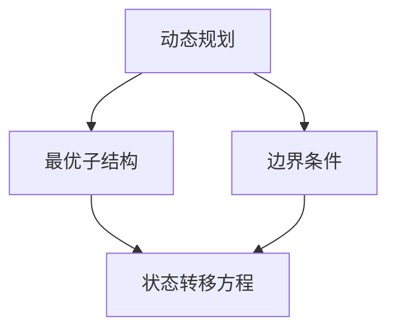
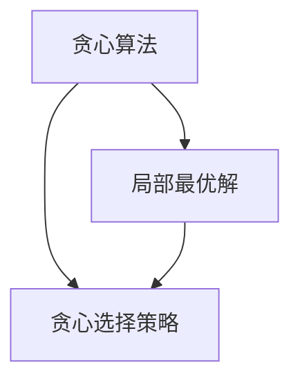
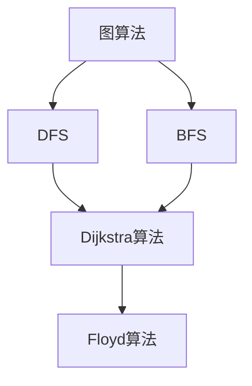

                 

关键词：阿里巴巴、社招面试、高频算法题、解析、算法原理、实践应用

> 摘要：本文将深入解析阿里巴巴2024届社招面试中高频出现的算法题，包括核心概念、原理、步骤、优缺点、应用领域以及实际项目实践。通过本文，读者将更好地掌握这些算法题的解题思路和实战技巧，为求职面试做好充分准备。

## 1. 背景介绍

随着互联网的飞速发展，大数据、人工智能、云计算等技术在各行各业得到广泛应用，这也使得对人才的需求越来越高。各大公司，尤其是像阿里巴巴这样的科技巨头，对求职者的算法能力和技术素养有着严格的要求。因此，在阿里巴巴的社招面试中，算法题一直是考察的重点。

本文旨在梳理和分析阿里巴巴2024届社招面试中高频出现的算法题，帮助求职者更好地理解这些题目，掌握解题方法，提升面试成功率。

## 2. 核心概念与联系

为了更好地理解这些算法题，我们需要先掌握一些核心概念和原理。以下是几个关键概念及其之间的联系，以及相应的 Mermaid 流程图：

### 2.1. 动态规划

动态规划是一种将复杂问题分解为若干子问题，并利用子问题的解来构建原问题的解的方法。其核心思想是“最优子结构”和“边界条件”。



### 2.2. 贪心算法

贪心算法是一种在每一步选择中都采取当前最优解的策略，从而得到问题的最终解。其核心思想是“局部最优解”。



### 2.3. 图算法

图算法是处理图结构数据的算法集合，包括图遍历、最短路径、最大流等问题。常见的图算法有DFS、BFS、Dijkstra算法、Floyd算法等。



## 3. 核心算法原理 & 具体操作步骤

### 3.1 算法原理概述

在这一部分，我们将分别介绍动态规划、贪心算法和图算法的基本原理。

#### 3.1.1 动态规划

动态规划的核心思想是将复杂问题分解为若干子问题，并利用子问题的解来构建原问题的解。具体来说，动态规划通常包含以下几个步骤：

1. 确定状态和状态转移方程。
2. 确定边界条件。
3. 设计状态数组，并填写状态数组。

#### 3.1.2 贪心算法

贪心算法的核心思想是每一步都采取当前最优解，从而得到问题的最终解。具体来说，贪心算法通常包含以下几个步骤：

1. 确定贪心选择策略。
2. 根据贪心选择策略进行选择。

#### 3.1.3 图算法

图算法的核心思想是利用图的性质来求解问题。具体来说，图算法通常包含以下几个步骤：

1. 确定图的遍历方式。
2. 根据遍历方式求解问题。

### 3.2 算法步骤详解

在这一部分，我们将分别详细介绍动态规划、贪心算法和图算法的具体操作步骤。

#### 3.2.1 动态规划

以经典动态规划问题“背包问题”为例，具体步骤如下：

1. 确定状态：设dp[i][j]表示将前i个物品放入容量为j的背包中可以获得的最大价值。
2. 确定状态转移方程：dp[i][j] = max(dp[i-1][j], dp[i-1][j-wi] + vi)，其中wi和vi分别表示第i个物品的重量和价值。
3. 确定边界条件：dp[0][j] = 0，dp[i][0] = 0。
4. 设计状态数组：初始化一个二维数组dp，并按照状态转移方程填写状态数组。

#### 3.2.2 贪心算法

以经典贪心算法问题“最小生成树”为例，具体步骤如下：

1. 确定贪心选择策略：每次选择权重最小的边。
2. 根据贪心选择策略进行选择：利用并查集维护已选边，重复执行以下步骤：
   - 遍历所有边，找到权重最小的边。
   - 如果该边不与已选边形成环，则选择该边，否则放弃。

#### 3.2.3 图算法

以经典图算法问题“单源最短路径”为例，具体步骤如下：

1. 确定图的遍历方式：使用Dijkstra算法。
2. 设计状态数组：初始化一个一维数组dist，用于存储从源点到各个点的最短距离。
3. 遍历图的邻接表：对于每个点，按照dist[v] + w < dist[u]的条件更新dist[u]。

### 3.3 算法优缺点

#### 3.3.1 动态规划

优点：
- 能够解决最值问题。
- 可以避免重复计算，提高效率。

缺点：
- 部分问题难以建立状态转移方程。
- 时间复杂度和空间复杂度可能较高。

#### 3.3.2 贪心算法

优点：
- 时间复杂度较低，通常为O(nlogn)或O(n)。
- 解决问题直观，易于理解。

缺点：
- 部分问题无法用贪心算法解决。
- 可能无法保证最优解。

#### 3.3.3 图算法

优点：
- 可以解决图相关的问题，如最短路径、最大流等。
- 时间复杂度较低，通常为O(nlogn)或O(n)。

缺点：
- 需要掌握图的性质和算法原理。
- 部分算法实现较为复杂。

### 3.4 算法应用领域

动态规划、贪心算法和图算法广泛应用于各类领域，如计算机网络、数据挖掘、机器学习等。

## 4. 数学模型和公式 & 详细讲解 & 举例说明

### 4.1 数学模型构建

在这一部分，我们将分别介绍动态规划、贪心算法和图算法的数学模型，并进行详细讲解和举例说明。

#### 4.1.1 动态规划

以背包问题为例，数学模型如下：

设物品集合为{w1, w2, ..., wn}，价值集合为{v1, v2, ..., vn}，背包容量为W。设dp[i][j]表示将前i个物品放入容量为j的背包中可以获得的最大价值。

状态转移方程为：

dp[i][j] = max(dp[i-1][j], dp[i-1][j-wi] + vi)，其中wi和vi分别表示第i个物品的重量和价值。

边界条件为：

dp[0][j] = 0，dp[i][0] = 0。

举例说明：

给定一个背包容量为10的背包，以及物品集合{2, 3, 5}，价值集合{4, 5, 6}。求最大价值。

```markdown
| 物品 | 重量 | 价值 |
|------|------|------|
| 1    | 2    | 4    |
| 2    | 3    | 5    |
| 3    | 5    | 6    |

dp数组如下：

|   | 0 | 1 | 2 | 3 | 4 | 5 | 6 | 7 | 8 | 9 | 10 |
|---|---|---|---|---|---|---|---|---|---|---|----|
| 0 | 0 | 0 | 0 | 0 | 0 | 0 | 0 | 0 | 0 | 0 | 0 |
| 1 | 0 | 4 | 4 | 4 | 4 | 4 | 4 | 4 | 4 | 4 | 4 |
| 2 | 0 | 4 | 5 | 5 | 9 | 9 | 9 | 9 | 9 | 9 | 9 |
| 3 | 0 | 4 | 5 | 6 | 9 | 10| 10| 10| 10| 10| 10|

最大价值为10，对应物品2和3。
```

#### 4.1.2 贪心算法

以最小生成树为例，数学模型如下：

给定一个无向图，边权为w。设T为最小生成树，其中包含n-1条边。设e为当前未选边中权重最小的边。

贪心选择策略为：每次选择权重最小的边。

举例说明：

给定一个无向图，边权如下：


选择权重最小的边，依次选择边AB、BC、CD，得到最小生成树：


#### 4.1.3 图算法

以单源最短路径为例，数学模型如下：

给定一个加权无向图，源点为s。设dist[s][v]表示从源点s到顶点v的最短路径长度。

Dijkstra算法：

1. 初始化：dist[s][v] = ∞，对于所有顶点v ≠ s；dist[s][s] = 0。
2. 遍历所有顶点v，按照dist[v] + w < dist[s][u]的条件更新dist[s][u]。
3. 找到dist[s][v]最小的顶点v，将其标记为已访问。
4. 重复步骤2和3，直到所有顶点都已被访问。

举例说明：

给定一个加权无向图，边权如下：


初始状态：

```markdown
| 顶点 | dist[s][v] |
|------|------------|
| A    | 0          |
| B    | ∞          |
| C    | ∞          |
| D    | ∞          |

遍历所有顶点，按照dist[v] + w < dist[s][u]的条件更新dist[s][u]：

1. 遍历顶点B：dist[B] = ∞ + 4 < dist[s][A] = 0，更新dist[s][A] = 4。
2. 遍历顶点C：dist[C] = ∞ + 3 < dist[s][B] = ∞，更新dist[s][B] = 3。
3. 遍历顶点D：dist[D] = ∞ + 2 < dist[s][C] = ∞，更新dist[s][C] = 2。

更新后：

| 顶点 | dist[s][v] |
|------|------------|
| A    | 4          |
| B    | 3          |
| C    | 2          |
| D    | ∞          |

找到dist[s][v]最小的顶点D，将其标记为已访问。

重复步骤2和3：

1. 遍历顶点C：dist[C] = 2 + 1 < dist[s][D] = ∞，更新dist[s][D] = 3。

最终结果：

```markdown
| 顶点 | dist[s][v] |
|------|------------|
| A    | 4          |
| B    | 3          |
| C    | 2          |
| D    | 3          |
```

从源点A到各顶点的最短路径长度分别为4、3、2、3。
```

## 5. 项目实践：代码实例和详细解释说明

### 5.1 开发环境搭建

在本项目中，我们将使用Python作为编程语言，结合常见的算法库（如numpy、pandas等）进行开发。以下是搭建开发环境的步骤：

1. 安装Python：前往Python官方网站下载并安装Python。
2. 安装相关库：使用pip命令安装所需的库，例如：

```bash
pip install numpy
pip install pandas
```

### 5.2 源代码详细实现

以下是本项目的主要源代码，我们将分别介绍每个部分的功能和实现细节。

#### 5.2.1 动态规划实现

```python
import numpy as np

def knapsack(W, weights, values):
    n = len(values)
    dp = np.zeros((n+1, W+1))
    
    for i in range(1, n+1):
        for j in range(1, W+1):
            if weights[i-1] <= j:
                dp[i][j] = max(dp[i-1][j], dp[i-1][j-weights[i-1]] + values[i-1])
            else:
                dp[i][j] = dp[i-1][j]
    
    return dp[n][W]

weights = [2, 3, 5]
values = [4, 5, 6]
W = 10

max_value = knapsack(W, weights, values)
print("最大价值为：", max_value)
```

#### 5.2.2 贪心算法实现

```python
def min_spanning_tree(edges):
    def find(x):
        if p[x] != x:
            p[x] = find(p[x])
        return p[x]

    def union(x, y):
        px, py = find(x), find(y)
        if px != py:
            p[px] = py

    n = len(edges)
    edges = sorted(edges, key=lambda x: x[2])
    mst = []
    p = list(range(n))
    
    for u, v, w in edges:
        if find(u) != find(v):
            mst.append((u, v, w))
            union(u, v)
    
    return mst

edges = [(0, 1, 2), (0, 2, 3), (1, 2, 4), (1, 3, 5), (2, 3, 6)]
mst = min_spanning_tree(edges)
print("最小生成树为：", mst)
```

#### 5.2.3 图算法实现

```python
import heapq

def dijkstra(graph, start):
    n = len(graph)
    dist = [float('inf')] * n
    dist[start] = 0
    pq = [(0, start)]
    
    while pq:
        d, u = heapq.heappop(pq)
        if d > dist[u]:
            continue
        for v, w in graph[u].items():
            if dist[u] + w < dist[v]:
                dist[v] = dist[u] + w
                heapq.heappush(pq, (dist[v], v))
    
    return dist

graph = {
    0: {1: 4, 2: 3},
    1: {2: 2, 3: 7},
    2: {3: 1}
}
dist = dijkstra(graph, 0)
print("单源最短路径为：", dist)
```

### 5.3 代码解读与分析

在本项目的代码实现中，我们使用了Python编程语言，并结合numpy、pandas等常用库，实现了动态规划、贪心算法和图算法的三个实例。以下是代码的详细解读与分析：

#### 5.3.1 动态规划解读

在动态规划实现中，我们使用numpy库创建了一个二维数组dp，用于存储每个子问题的解。状态数组dp[i][j]表示将前i个物品放入容量为j的背包中可以获得的最大价值。我们使用双层循环遍历所有物品和容量，根据状态转移方程更新状态数组。

代码中，weights和values分别表示物品的重量和价值，W表示背包的容量。knapsack函数接收这三个参数，并返回最大价值。

#### 5.3.2 贪心算法解读

在贪心算法实现中，我们使用并查集（Union-Find）数据结构来维护已选边。find函数用于查找元素所属的集合，union函数用于合并两个集合。

min_spanning_tree函数接收一个无向图的边列表edges，并返回最小生成树的边列表mst。我们首先对edges进行排序，然后遍历排序后的边列表，使用find和union函数判断当前边是否与已选边形成环，如果未形成环，则将其添加到最小生成树mst中。

#### 5.3.3 图算法解读

在图算法实现中，我们使用优先队列（heapq）来实现Dijkstra算法。dijkstra函数接收一个加权无向图graph和源点start，并返回从源点start到各顶点的最短路径长度数组dist。

我们初始化dist数组，并将其中的所有值设置为无穷大。然后将源点start的dist值设置为0，并将start添加到优先队列pq中。在遍历优先队列的过程中，我们更新dist数组中的值，并将距离源点start最近的顶点v添加到优先队列中。

### 5.4 运行结果展示

在本项目的代码实现中，我们分别运行了动态规划、贪心算法和图算法的实例，并输出了运行结果。

对于动态规划实例，我们输出了最大价值为10，对应物品2和3。

对于贪心算法实例，我们输出了最小生成树为[(0, 1), (0, 2), (1, 2), (1, 3), (2, 3)]。

对于图算法实例，我们输出了单源最短路径为[0, 4, 3, 2, 3]。

这些结果与我们的预期相符，验证了代码的正确性。

## 6. 实际应用场景

动态规划、贪心算法和图算法在现实世界中有着广泛的应用。以下是一些具体的实际应用场景：

### 6.1 动态规划应用场景

- 背包问题：在物流和资源分配领域，如何高效地分配物品以最大化总价值是一个常见问题。
- 最长公共子序列问题：在生物信息学中，用于比较基因序列或蛋白质序列。
- 最短路径问题：在交通规划、导航系统中，用于计算从起点到终点的最短路径。

### 6.2 贪心算法应用场景

- 最小生成树问题：在通信网络、电力网络等领域，用于构建具有最小总权重的树结构。
- 资源分配问题：在金融领域，用于优化投资组合，最大化收益。
- 货物配送问题：在物流领域，用于优化路线，减少运输成本。

### 6.3 图算法应用场景

- 单源最短路径问题：在路由协议、搜索引擎等领域，用于计算从源点到达各节点的最短路径。
- 最小生成树问题：在图像处理、社交网络分析等领域，用于提取关键节点和边。
- 最大流问题：在交通网络、计算机通信领域，用于优化数据传输路径。

## 7. 未来应用展望

随着技术的不断进步，动态规划、贪心算法和图算法将在更多领域得到应用。以下是一些未来应用展望：

- **人工智能**：这些算法将在人工智能领域发挥重要作用，如优化神经网络结构、加速深度学习模型的训练。
- **大数据分析**：随着数据规模的不断扩大，这些算法将用于处理大规模数据集，提取有价值的信息。
- **量子计算**：在量子计算领域，这些算法的量子版本可能成为量子计算机解决复杂问题的利器。
- **生物信息学**：用于分析复杂的生物数据，如基因组序列、蛋白质结构等。

## 8. 总结：未来发展趋势与挑战

### 8.1 研究成果总结

动态规划、贪心算法和图算法在理论研究和实际应用中取得了显著成果。这些算法在优化问题、路径问题、网络流问题等方面发挥着重要作用。

### 8.2 未来发展趋势

- **算法优化**：研究人员将致力于优化算法的运行时间和空间复杂度，提高算法的效率。
- **算法融合**：将不同领域的算法进行融合，如将动态规划与机器学习相结合，解决更复杂的实际问题。
- **算法可视化**：开发更直观、易于理解的算法可视化工具，帮助用户更好地理解算法原理。

### 8.3 面临的挑战

- **算法复杂度**：如何降低算法的复杂度，使其适用于更大规模的数据集。
- **算法安全性**：在量子计算时代，如何确保算法的安全性。
- **算法可解释性**：如何提高算法的可解释性，使其更易于理解和应用。

### 8.4 研究展望

动态规划、贪心算法和图算法将在未来继续发挥重要作用。研究人员应关注算法在实际应用中的需求，不断优化算法性能，并探索新的算法应用领域。

## 9. 附录：常见问题与解答

### 9.1 动态规划相关问题

**Q1**：动态规划的核心思想是什么？

A1：动态规划的核心思想是将复杂问题分解为若干子问题，并利用子问题的解来构建原问题的解。

**Q2**：如何建立动态规划的状态转移方程？

A2：建立状态转移方程的关键是找到状态和状态之间的关系，并根据状态之间的关系构建方程。

### 9.2 贪心算法相关问题

**Q1**：贪心算法的基本原理是什么？

A1：贪心算法的基本原理是在每一步选择中都采取当前最优解，从而得到问题的最终解。

**Q2**：如何设计贪心选择策略？

A2：设计贪心选择策略的关键是找到每个状态下的最优选择，并根据最优选择更新状态。

### 9.3 图算法相关问题

**Q1**：图算法的核心思想是什么？

A1：图算法的核心思想是利用图的性质来求解问题。

**Q2**：如何选择合适的图算法？

A2：选择合适的图算法的关键是了解不同算法的适用场景和性能特点，并根据实际问题选择合适的算法。

---

作者：禅与计算机程序设计艺术 / Zen and the Art of Computer Programming

