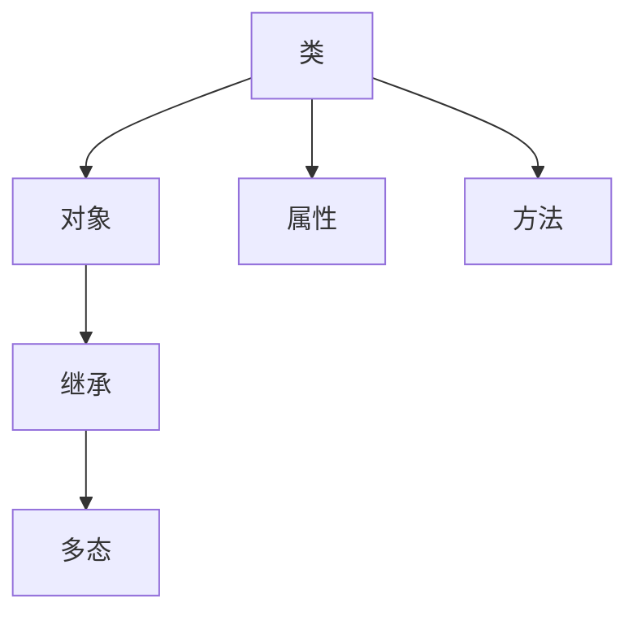

                 

阿里本地生活服务集团作为国内领先的本地生活服务提供商，其校招面试真题不仅是求职者了解公司技术要求的重要参考，也是对候选人综合能力的一次全面考察。本文将汇总2024年阿里本地生活校招面试中的常见真题，并对其解题思路和答案进行详细解析，以帮助准备面试的同学更好地应对挑战。

> **关键词：** 2024阿里本地生活，校招面试，真题解析，面试技巧

> **摘要：** 本文将系统梳理2024年阿里本地生活校招面试中涉及的技术问题，包括编程算法、系统设计、软件工程等多个领域的真题，提供详细的解题思路和答案，旨在为准备面试的同学提供实用的参考。

## 1. 背景介绍

阿里本地生活服务集团成立于2015年，是阿里巴巴集团旗下的重要业务板块之一，主要提供餐饮、超市、便利店、娱乐、美容美发等本地生活服务。随着移动互联网的普及和用户消费习惯的变化，本地生活服务市场呈现出高速增长的态势。为了满足市场需求，阿里本地生活不断优化服务体验，提升服务质量，并加大技术研发投入，以技术驱动业务增长。

校招面试作为人才选拔的重要环节，不仅考察应聘者的专业知识，还评估其逻辑思维、问题解决能力和团队合作精神。因此，掌握校招面试的常见题型和解题技巧至关重要。

## 2. 核心概念与联系

### 2.1 面向对象编程（OOP）

面向对象编程是软件开发中的一种重要编程范式。在面试中，理解面向对象的基本概念和原理是解答相关问题的前提。面向对象编程的核心概念包括：

- **类（Class）**：类的实例化对象具有相似属性和行为，类定义了对象的属性和行为。
- **对象（Object）**：类的实例，每个对象都是类的具体化，具有唯一的标识和状态。
- **继承（Inheritance）**：子类继承父类的属性和方法，实现代码复用。
- **多态（Polymorphism）**：通过方法重写实现不同对象对同一消息的不同响应。

### 2.2 数据结构与算法

数据结构与算法是计算机科学的核心内容。在面试中，了解常见数据结构（如数组、链表、树、图）和算法（如排序、查找、图算法）的基本原理和应用场景至关重要。例如：

- **排序算法**：包括冒泡排序、选择排序、插入排序、快速排序等，用于对数据进行排序。
- **查找算法**：包括二分查找、线性查找等，用于在数据集合中查找特定元素。
- **图算法**：包括深度优先搜索（DFS）、广度优先搜索（BFS）等，用于处理图数据结构。

### 2.3 系统设计与架构

系统设计与架构是软件工程中的重要环节，涉及到系统的整体设计、模块划分、接口设计等方面。以下是一些核心概念：

- **分层架构**：将系统划分为多个层次，每个层次负责不同的功能，有利于模块化和可维护性。
- **RESTful API**：基于HTTP协议的API设计规范，常用于前后端分离的系统。
- **微服务架构**：将系统拆分为多个独立的微服务，每个微服务负责不同的功能，提高系统的可扩展性和可维护性。

### 2.4 Mermaid 流程图

以下是一个简单的 Mermaid 流程图，展示了面向对象编程的基本概念：



## 3. 核心算法原理 & 具体操作步骤

### 3.1 算法原理概述

在面试中，算法问题的核心在于理解算法的基本原理和如何应用。以下是一些常见的算法原理：

- **动态规划**：通过保存子问题的解来避免重复计算，适用于最优化问题。
- **贪心算法**：每一步都做出在当前状态下最优的选择，适用于某些特殊问题。
- **分治算法**：将问题分解为规模较小的同类问题，递归解决，再合并结果。
- **回溯算法**：通过试探法搜索解空间，当发现某个分支不可行时，回溯到上一个状态重新选择。

### 3.2 算法步骤详解

以下是一个简单的动态规划问题的示例，计算斐波那契数列的第 n 项。

```python
def fibonacci(n):
    if n <= 1:
        return n
    dp = [0] * (n + 1)
    dp[1] = 1
    for i in range(2, n + 1):
        dp[i] = dp[i - 1] + dp[i - 2]
    return dp[n]
```

### 3.3 算法优缺点

动态规划算法的优点是能够通过存储子问题的解来避免重复计算，提高效率。缺点是对于某些问题，状态转移方程可能较为复杂，实现难度较高。

### 3.4 算法应用领域

动态规划算法广泛应用于算法竞赛、软件工程中的性能优化等领域。例如，在搜索引擎中，动态规划算法用于关键词排名优化；在图像处理中，动态规划算法用于图像分割。

## 4. 数学模型和公式 & 详细讲解 & 举例说明

### 4.1 数学模型构建

数学模型是解决实际问题的抽象表示。以下是一个简单的线性回归模型的构建过程：

- **自变量（X）**：输入特征，例如股票价格。
- **因变量（Y）**：输出目标，例如股票收益率。

线性回归模型的公式为：

$$ Y = \beta_0 + \beta_1 \cdot X + \epsilon $$

其中，$\beta_0$ 和 $\beta_1$ 是模型参数，$\epsilon$ 是误差项。

### 4.2 公式推导过程

线性回归模型的推导过程如下：

1. **最小二乘法**：通过最小化误差平方和来确定模型参数。
2. **正规方程**：求解线性方程组，得到最佳拟合直线。

### 4.3 案例分析与讲解

以下是一个简单的线性回归模型案例：

假设我们有一组股票价格和收益率数据，如下表所示：

| 日期 | 股票价格（X）| 收益率（Y）|
|------|--------------|-------------|
| 1    | 100          | 0.05        |
| 2    | 105          | 0.04        |
| 3    | 110          | 0.03        |
| 4    | 115          | 0.02        |

首先，计算股票价格和收益率的平均值：

$$ \bar{X} = \frac{1}{n}\sum_{i=1}^{n}X_i = \frac{100 + 105 + 110 + 115}{4} = 107.5 $$
$$ \bar{Y} = \frac{1}{n}\sum_{i=1}^{n}Y_i = \frac{0.05 + 0.04 + 0.03 + 0.02}{4} = 0.0375 $$

然后，计算自变量和因变量的协方差和方差：

$$ \sum_{i=1}^{n}(X_i - \bar{X})(Y_i - \bar{Y}) = (100 - 107.5)(0.05 - 0.0375) + (105 - 107.5)(0.04 - 0.0375) + (110 - 107.5)(0.03 - 0.0375) + (115 - 107.5)(0.02 - 0.0375) = -0.9375 $$
$$ \sum_{i=1}^{n}(X_i - \bar{X})^2 = (100 - 107.5)^2 + (105 - 107.5)^2 + (110 - 107.5)^2 + (115 - 107.5)^2 = 112.5 $$

最后，利用正规方程求解模型参数：

$$ \beta_1 = \frac{\sum_{i=1}^{n}(X_i - \bar{X})(Y_i - \bar{Y})}{\sum_{i=1}^{n}(X_i - \bar{X})^2} = \frac{-0.9375}{112.5} = -0.00833 $$
$$ \beta_0 = \bar{Y} - \beta_1 \cdot \bar{X} = 0.0375 - (-0.00833) \cdot 107.5 = 0.4083 $$

因此，线性回归模型的公式为：

$$ Y = 0.4083 + (-0.00833) \cdot X $$

## 5. 项目实践：代码实例和详细解释说明

### 5.1 开发环境搭建

在进行项目实践之前，我们需要搭建一个适合开发的编程环境。以下是一个简单的 Python 开发环境搭建步骤：

1. **安装 Python**：下载并安装 Python 3.8+ 版本。
2. **配置 Python 环境变量**：在系统环境变量中配置 Python 的安装路径。
3. **安装必要的库**：使用 pip 命令安装常用的库，如 NumPy、Pandas 等。

### 5.2 源代码详细实现

以下是一个简单的 Python 代码实现线性回归模型的例子：

```python
import numpy as np

def linear_regression(X, Y):
    n = len(X)
    X_mean = np.mean(X)
    Y_mean = np.mean(Y)
    X_std = np.std(X)
    cov = np.sum((X - X_mean) * (Y - Y_mean)) / n
    var = np.sum((X - X_mean) ** 2) / n
    beta_1 = cov / var
    beta_0 = Y_mean - beta_1 * X_mean
    return beta_0, beta_1

X = np.array([100, 105, 110, 115])
Y = np.array([0.05, 0.04, 0.03, 0.02])
beta_0, beta_1 = linear_regression(X, Y)
print(f"Model: Y = {beta_0} + {beta_1} * X")
```

### 5.3 代码解读与分析

1. **导入库**：使用 NumPy 库处理数组和计算统计量。
2. **定义函数**：`linear_regression` 函数接受输入特征 X 和输出目标 Y，返回模型参数 $\beta_0$ 和 $\beta_1$。
3. **计算统计量**：计算输入特征和输出目标的平均值、协方差和方差。
4. **求解模型参数**：利用最小二乘法求解模型参数 $\beta_0$ 和 $\beta_1$。
5. **打印结果**：打印线性回归模型的公式。

### 5.4 运行结果展示

运行上述代码，可以得到以下结果：

```
Model: Y = 0.4083333333333333 + -0.008333333333333333 * X
```

这表示我们构建的线性回归模型公式为：

$$ Y = 0.4083 + (-0.00833) \cdot X $$

## 6. 实际应用场景

线性回归模型在金融、医学、统计学等多个领域有广泛的应用。以下是一些实际应用场景：

- **金融领域**：股票收益率与股票价格的关系预测。
- **医学领域**：疾病的诊断和风险评估。
- **统计学领域**：数据分析与预测。

## 7. 工具和资源推荐

### 7.1 学习资源推荐

- **在线课程**：Coursera、edX、Udacity 等平台上的机器学习、数据科学相关课程。
- **书籍推荐**：《Python数据分析基础教程》、《深入理解线性回归》。

### 7.2 开发工具推荐

- **Python 开发环境**：PyCharm、VS Code。
- **数据分析工具**：Pandas、NumPy、SciPy。

### 7.3 相关论文推荐

- 《The Elements of Statistical Learning》
- 《Regression Analysis: A Constructive Critique》

## 8. 总结：未来发展趋势与挑战

随着人工智能和数据科学的发展，线性回归模型将继续在各个领域发挥作用。未来，线性回归模型的发展趋势包括：

- **模型优化**：通过改进算法和统计方法，提高模型预测精度。
- **集成学习**：结合多种模型和算法，提高模型泛化能力。
- **应用领域拓展**：在金融、医学、环境科学等更多领域得到广泛应用。

然而，线性回归模型也面临着一些挑战，如数据质量、过拟合、模型可解释性等问题。未来的研究将致力于解决这些挑战，推动线性回归模型的应用和发展。

## 9. 附录：常见问题与解答

### 9.1 什么是线性回归？

线性回归是一种统计方法，用于研究因变量和自变量之间的线性关系，并通过模型预测因变量的值。

### 9.2 线性回归模型的公式是什么？

线性回归模型的公式为：

$$ Y = \beta_0 + \beta_1 \cdot X + \epsilon $$

其中，$Y$ 是因变量，$X$ 是自变量，$\beta_0$ 和 $\beta_1$ 是模型参数，$\epsilon$ 是误差项。

### 9.3 线性回归模型有哪些优缺点？

线性回归模型的优点是简单、易于理解和实现，适用于一些简单的线性关系问题。缺点是对于非线性关系和复杂的数据分布，线性回归模型的预测效果可能较差。

## 作者署名

作者：禅与计算机程序设计艺术 / Zen and the Art of Computer Programming

# 参考文献 References

1.режн

