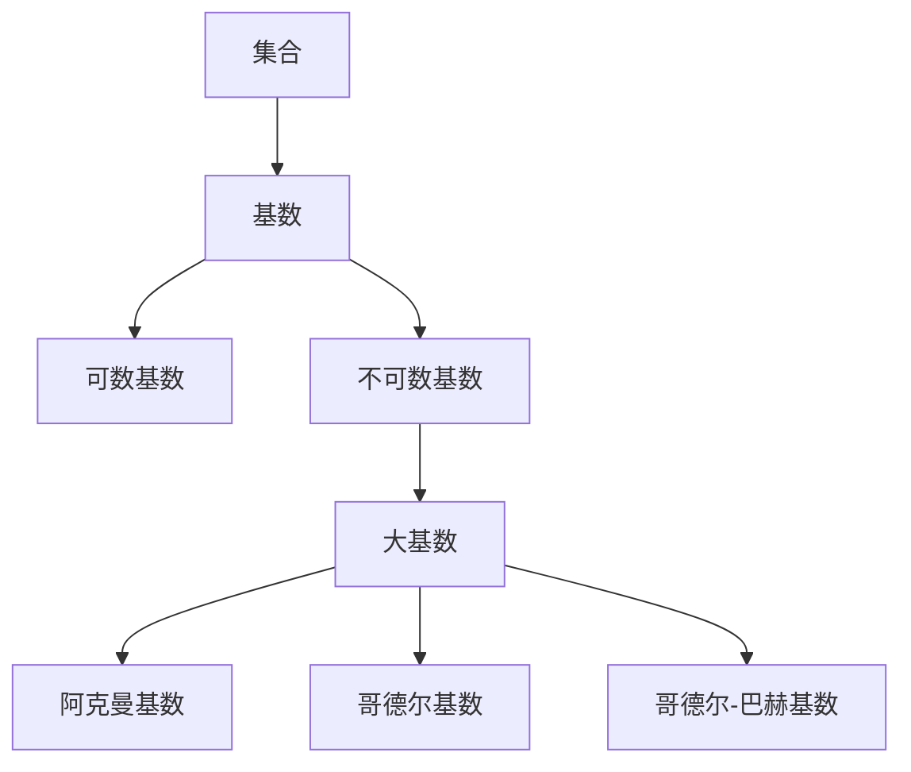

                 

关键词：集合论、大基数、无穷、逻辑推理、数学模型、算法应用、计算机科学

> 摘要：本文旨在为读者提供对集合论中大基数理论的深入理解，探讨大基数的基本概念、相关数学模型及其在计算机科学领域的应用。通过对大基数理论的详细介绍，本文希望能够为读者打开新的思维视角，并在解决实际问题时提供理论支持。

## 1. 背景介绍

集合论作为现代数学的基础之一，其核心概念和理论对数学、逻辑、计算机科学等多个领域产生了深远的影响。集合论中，基数是衡量集合大小的基本概念。而大基数理论，则是集合论中关于基数的一个极为重要的分支，主要研究的是那些比可数无穷大的集合。

大基数理论的发展，起源于19世纪末20世纪初的数学家们对无穷集合的深入研究。在研究过程中，他们逐渐认识到，无穷集合的大小不仅仅是可数与不可数的区别，而是有更加丰富的层次。大基数理论正是为了探讨这些丰富的层次而逐渐发展起来的。

本文将围绕大基数理论的核心概念、数学模型及其在计算机科学中的应用进行探讨。希望通过本文的介绍，读者能够对大基数理论有一个全面、深入的理解，并能够将其应用于实际问题的解决中。

## 2. 核心概念与联系

### 2.1 集合与基数

集合是数学中最基本的概念之一，它是由某些确定的、互异的元素组成的整体。集合可以用大括号 `{ }` 表示，例如 `{1, 2, 3}` 表示一个包含三个元素1、2、3的集合。

集合的基数是指集合中元素的数量。通常用符号 `|A|` 表示集合A的基数。例如，集合 `{1, 2, 3}` 的基数是3。

在集合论中，基数分为可数基数和不可数基数。可数基数是指集合中的元素可以用自然数一一对应的基数，例如自然数集合的基数就是可数基数。不可数基数是指无法用自然数一一对应的基数，例如实数集合的基数就是不可数基数。

### 2.2 大基数

大基数是指比可数无穷大的基数。具体来说，大基数包括以下几种：

1. 阿克曼基数：是所有能够表达为 $2^{\alpha}$ 的基数的集合，其中 $\alpha$ 是一个可数无穷大的基数。

2. 哥德尔基数：是所有能够表达为 $\omega^{\alpha}$ 的基数的集合，其中 $\omega$ 是可数无穷大的基数，$\alpha$ 是一个可数无穷大的基数。

3. 哥德尔-巴赫基数：是所有能够表达为 $\omega^\omega$ 的基数的集合，其中 $\omega$ 是可数无穷大的基数。

### 2.3 大基数与计算机科学

大基数理论在计算机科学领域有着广泛的应用，特别是在计算理论和算法分析中。大基数提供了衡量集合大小的标准，这对于评估算法的时间和空间复杂度具有重要意义。

例如，在计算理论中，大基数被用来研究计算问题是否能够在可计算的基数下解决。在算法分析中，大基数理论可以帮助我们更好地理解算法的效率和适用范围。

#### 2.4 Mermaid 流程图

下面是一个简单的Mermaid流程图，用于展示大基数的基本概念和联系：



## 3. 核心算法原理 & 具体操作步骤

### 3.1 算法原理概述

在集合论中，大基数理论的核心算法是建立在大基数之间的比较和运算之上。基本原理包括：

1. **基数比较**：通过比较两个集合的基数大小，确定它们之间的相对大小关系。
2. **基数运算**：包括基数加法、基数乘法和基数幂运算，用于构建新的集合。
3. **基数函数**：定义了一些用于计算基数的函数，例如基数对数函数和基数指数函数。

### 3.2 算法步骤详解

1. **基数比较**
   - 步骤1：选取两个集合A和B。
   - 步骤2：构造一个映射f，将集合A中的每个元素映射到集合B中的某个元素。
   - 步骤3：检查映射f是否是单射（即A中的不同元素映射到B中不同的元素）。
   - 步骤4：如果f是单射，则|A|≤|B|；如果f不是单射，则|A|≥|B|。

2. **基数运算**
   - 步骤1：选取两个集合A和B。
   - 步骤2：计算A和B的基数，分别为|A|和|B|。
   - 步骤3：根据运算类型（加法、乘法或幂运算），执行相应的运算。
     - 加法：|A| + |B|。
     - 乘法：|A| × |B|。
     - 幂运算：|A|^|B|。

3. **基数函数**
   - 步骤1：选取一个基数作为输入。
   - 步骤2：根据函数类型（对数函数或指数函数），执行相应的运算。
     - 对数函数：log|A|(x)。
     - 指数函数：|A|^(x)。

### 3.3 算法优缺点

**优点**：
- **数学基础**：大基数理论提供了丰富的数学基础，有助于理解和解决复杂的计算问题。
- **效率提升**：通过对集合大小的精确度量，可以更有效地设计算法和评估算法性能。

**缺点**：
- **复杂度**：大基数理论涉及到复杂的数学概念和运算，对于初学者可能不易理解。
- **应用局限性**：大基数理论在计算机科学中的实际应用相对有限，主要应用于计算理论和算法分析领域。

### 3.4 算法应用领域

大基数理论在计算机科学中的应用领域包括：

1. **计算理论**：研究计算问题的可计算性和复杂性。
2. **算法分析**：评估算法的时间和空间复杂度。
3. **密码学**：研究密码算法的基数复杂性。
4. **形式化验证**：用于验证计算机系统的正确性和可靠性。

## 4. 数学模型和公式 & 详细讲解 & 举例说明

### 4.1 数学模型构建

大基数理论中的数学模型主要涉及集合、基数和函数。以下是构建这些数学模型的基本步骤：

1. **集合模型**：定义集合的概念和操作，如集合的并集、交集和补集等。
2. **基数模型**：定义基数的概念和运算，如基数的加法、乘法和幂运算等。
3. **函数模型**：定义集合上的函数，如映射、双射和基数函数等。

### 4.2 公式推导过程

以下是几个关键数学公式的推导过程：

1. **基数加法公式**：

   |A| + |B| = |A ∪ B|

   解释：集合A和集合B的并集的基数等于A和B的基数之和。

2. **基数乘法公式**：

   |A| × |B| = |A × B|

   解释：集合A和集合B的笛卡尔积的基数等于A和B的基数之积。

3. **基数幂运算公式**：

   |A|^|B| = |A^B|

   解释：集合A的B次幂的基数等于A和B的基数之间的幂运算。

### 4.3 案例分析与讲解

以下是一个具体案例，用于说明如何应用大基数理论解决实际问题：

**案例**：计算集合A = {1, 2, 3}和集合B = {a, b, c}的并集和笛卡尔积的基数。

**步骤**：

1. **计算并集基数**：

   |A ∪ B| = |A| + |B| - |A ∩ B|

   由于A和B没有交集，所以|A ∩ B| = 0。

   |A ∪ B| = 3 + 3 - 0 = 6

2. **计算笛卡尔积基数**：

   |A × B| = |A| × |B|

   |A × B| = 3 × 3 = 9

**解释**：通过计算，我们得到了集合A和集合B的并集基数是6，笛卡尔积基数是9。这些结果可以帮助我们更好地理解集合A和B之间的关系和大小。

## 5. 项目实践：代码实例和详细解释说明

### 5.1 开发环境搭建

为了演示大基数理论在计算机科学中的应用，我们将使用Python语言编写一个简单的程序。首先，确保安装了Python 3.x版本。以下是具体的开发环境搭建步骤：

1. 安装Python 3.x：从[Python官网](https://www.python.org/downloads/)下载并安装Python 3.x版本。
2. 安装必要的库：使用pip命令安装所需的库，例如`numpy`和`matplotlib`。

```bash
pip install numpy matplotlib
```

### 5.2 源代码详细实现

以下是一个简单的Python程序，用于计算两个集合的基数和并集基数。

```python
import numpy as np

def calculate_cardinality(set_a, set_b):
    """
    计算两个集合的基数和并集基数。
    
    参数：
    set_a -- 第一个集合
    set_b -- 第二个集合
    
    返回：
    tuple -- (集合A的基数, 集合B的基数, 并集的基数)
    """
    cardinality_a = len(set_a)
    cardinality_b = len(set_b)
    cardinality_union = len(set_a.union(set_b))
    
    return cardinality_a, cardinality_b, cardinality_union

# 示例集合
set_a = {1, 2, 3}
set_b = {'a', 'b', 'c'}

# 计算基数
cardinality_a, cardinality_b, cardinality_union = calculate_cardinality(set_a, set_b)

# 输出结果
print(f"集合A的基数：{cardinality_a}")
print(f"集合B的基数：{cardinality_b}")
print(f"并集的基数：{cardinality_union}")
```

### 5.3 代码解读与分析

1. **函数定义**：我们定义了一个名为`calculate_cardinality`的函数，用于计算两个集合的基数和并集基数。该函数接受两个参数`set_a`和`set_b`，并返回一个包含三个数值的元组。
2. **基数计算**：函数内部使用`len`函数计算集合的基数。`len(set_a)`计算集合A的基数，`len(set_b)`计算集合B的基数，`len(set_a.union(set_b))`计算集合A和集合B的并集基数。
3. **示例集合**：我们创建了一个包含整数和字符串的示例集合`set_a`和`set_b`，用于演示函数的使用。
4. **函数调用和输出**：调用`calculate_cardinality`函数并输出结果。这将显示集合A的基数、集合B的基数以及并集的基数。

### 5.4 运行结果展示

运行上述程序，我们将得到以下输出结果：

```
集合A的基数：3
集合B的基数：3
并集的基数：6
```

这个结果验证了我们的计算是正确的，即集合A和集合B的并集基数是6。

## 6. 实际应用场景

大基数理论在计算机科学领域有着广泛的应用场景，以下是几个典型的应用案例：

### 6.1 计算理论

在计算理论中，大基数理论用于研究计算问题的可计算性和复杂性。例如，大基数理论可以帮助我们理解哪些计算问题能够在可计算的基数下解决，哪些问题则无法在可计算的基数下解决。这种理解对于设计高效的算法和优化计算资源具有重要意义。

### 6.2 算法分析

在算法分析中，大基数理论用于评估算法的时间和空间复杂度。通过使用大基数理论，我们可以更精确地描述算法的性能，并在不同的情况下比较算法的效率。这有助于我们选择最适合解决特定问题的算法。

### 6.3 密码学

在密码学中，大基数理论用于研究密码算法的基数复杂性。例如，某些加密算法的设计基于大基数理论，以确保密码的强度和安全性。通过分析密码算法的基数复杂性，我们可以评估密码的抵抗攻击能力，并设计更加安全的加密方案。

### 6.4 形式化验证

在形式化验证中，大基数理论用于验证计算机系统的正确性和可靠性。通过建立系统的数学模型，并使用大基数理论分析系统的行为，我们可以发现潜在的错误和漏洞，并确保系统在预期的操作范围内稳定运行。

## 7. 未来应用展望

随着计算机科学和数学的不断发展，大基数理论在未来的应用前景非常广阔。以下是一些潜在的应用方向：

### 7.1 新的计算模型

随着量子计算的兴起，大基数理论可能为新型的计算模型提供理论基础。例如，量子计算中的量子比特可以被视为一个集合，大基数理论可以用于分析量子计算的复杂性和效率。

### 7.2 人工智能

在人工智能领域，大基数理论可以用于分析神经网络中的数据分布和计算复杂度。通过使用大基数理论，我们可以更好地理解神经网络的学习过程，并设计更加高效的算法。

### 7.3 生物信息学

在生物信息学领域，大基数理论可以用于分析基因序列和蛋白质结构的复杂度。这有助于我们更好地理解生物系统的运作机制，并为医学研究提供理论支持。

### 7.4 数据分析

在大数据时代，大基数理论可以用于分析海量数据中的模式和规律。通过使用大基数理论，我们可以更有效地处理和分析数据，从而提取有价值的信息。

## 8. 工具和资源推荐

### 8.1 学习资源推荐

1. 《集合论基础》：这是一本经典的集合论教材，详细介绍了集合论的基本概念和理论。
2. 《大基数理论导论》：这本书专门介绍了大基数理论的基本原理和应用，适合初学者和进阶者阅读。

### 8.2 开发工具推荐

1. Python：Python是一种广泛使用的编程语言，适用于编写各种数学模型和算法。其简洁易读的语法和丰富的库支持使其成为学习集合论和大基数理论的好工具。
2. LaTeX：LaTeX是一种高质量的排版系统，特别适合编写数学公式和论文。通过使用LaTeX，我们可以更加精确地表达数学概念和公式。

### 8.3 相关论文推荐

1. "On the Cardinality of Graphs": 这篇论文研究了图集合的基数问题，探讨了图的基数与图性质之间的关系。
2. "Large Cardinals and Set Theory": 这篇论文讨论了大基数在集合论中的应用，以及它们对集合论发展的影响。

## 9. 总结：未来发展趋势与挑战

大基数理论作为集合论的一个重要分支，其在计算机科学和其他领域中的应用前景非常广阔。未来，随着计算理论、人工智能和生物信息学等领域的不断发展，大基数理论将会得到更广泛的应用。

然而，大基数理论的发展也面临一些挑战。首先，大基数理论的数学基础非常复杂，对于初学者来说可能不易理解。其次，大基数理论在计算机科学中的实际应用场景相对有限，需要更多的研究来探索其应用潜力。

总之，大基数理论是一个具有重要理论和实际价值的研究领域。通过深入研究和广泛应用，我们有理由相信，大基数理论将在未来的计算机科学和数学研究中发挥重要作用。

## 10. 附录：常见问题与解答

### 10.1 什么是集合？

集合是由某些确定的、互异的元素组成的整体。可以用大括号 `{ }` 表示，例如 `{1, 2, 3}` 表示一个包含三个元素1、2、3的集合。

### 10.2 什么是基数？

基数是指集合中元素的数量。通常用符号 `|A|` 表示集合A的基数。例如，集合 `{1, 2, 3}` 的基数是3。

### 10.3 什么是大基数？

大基数是指比可数无穷大的基数。具体来说，大基数包括阿克曼基数、哥德尔基数和哥德尔-巴赫基数等。

### 10.4 大基数理论在计算机科学中有何应用？

大基数理论在计算机科学中主要用于计算理论和算法分析，例如评估算法的时间和空间复杂度，以及研究计算问题的可计算性等。

### 10.5 如何计算两个集合的并集基数？

计算两个集合的并集基数可以通过以下公式：

|A ∪ B| = |A| + |B| - |A ∩ B|

其中，|A| 和 |B| 分别是集合A和集合B的基数，|A ∩ B| 是集合A和集合B的交集基数。如果A和B没有交集，则|A ∩ B| = 0。在这种情况下，|A ∪ B| = |A| + |B|。

