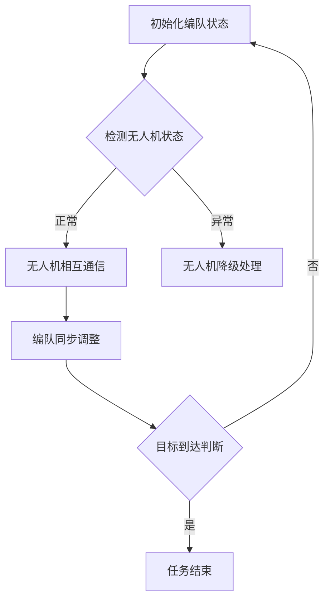

                 

关键词：无人机编队飞行、社交控制理论、顺丰、人工智能、算法原理

> 摘要：本文旨在深入探讨无人机编队飞行中的社交控制理论，并结合顺丰2025年的愿景，分析其在实际应用中的挑战与机遇。文章通过详细讲解核心算法原理、数学模型构建及代码实例，为读者提供了全面的无人机编队飞行社交控制技术指南。

## 1. 背景介绍

随着无人机技术的迅猛发展，无人机编队飞行逐渐成为研究热点。无人机编队飞行不仅具有广泛的应用前景，如物流配送、军事侦察、环保监测等，还涉及到复杂的社会交互和自主控制问题。在未来的物流领域，顺丰公司计划在2025年之前，通过无人机编队飞行技术实现快速、高效、安全的快递服务。因此，掌握无人机编队飞行社交控制理论，对于实现这一目标至关重要。

本文将从以下几个方面展开讨论：首先，介绍无人机编队飞行社交控制理论的核心概念；其次，详细阐述核心算法原理及数学模型构建；然后，通过实际代码实例展示算法的具体实现过程；最后，探讨该技术的实际应用场景及未来发展方向。

## 2. 核心概念与联系

### 2.1 社交控制理论

社交控制理论是指多个智能体（如无人机）在自主决策的同时，通过信息交换和协调机制实现共同目标的一种控制理论。在无人机编队飞行中，社交控制理论的核心在于如何确保无人机之间的相对位置和速度保持稳定，同时实现编队的整体移动。

### 2.2 编队飞行概念

编队飞行是指多个无人机按照特定规则和模式组成的飞行队列。无人机编队飞行可以实现以下优势：

- 提高飞行安全，通过相互协作降低单台无人机发生故障的风险；
- 提高飞行效率，无人机可以共享飞行资源，如气流、飞行路径等；
- 扩展应用范围，无人机编队飞行可以应用于复杂环境下的任务执行。

### 2.3 Mermaid 流程图

以下是一个简化的无人机编队飞行社交控制理论的Mermaid流程图：



## 3. 核心算法原理 & 具体操作步骤

### 3.1 算法原理概述

无人机编队飞行社交控制算法主要分为以下几个部分：

1. **初始化编队状态**：确定编队初始位置、速度和相对位置关系。
2. **无人机相互通信**：通过无线通信模块实现无人机之间的数据交换，包括位置、速度、状态等信息。
3. **编队同步调整**：根据接收到的通信数据，调整无人机的相对位置和速度，确保编队稳定。
4. **目标到达判断**：根据预设目标，判断无人机是否到达目标位置，决定是否继续执行任务或结束任务。

### 3.2 算法步骤详解

1. **初始化编队状态**：

   - 无人机启动后，读取初始位置、速度等信息；
   - 初始化编队通信模块，设置通信频率和通信距离。

2. **无人机相互通信**：

   - 定时发送和接收无人机之间的位置、速度等信息；
   - 使用加密算法确保通信安全。

3. **编队同步调整**：

   - 根据接收到的通信数据，计算当前无人机与其他无人机之间的相对位置和速度；
   - 根据相对位置和速度，生成调整指令，调整无人机的位置和速度。

4. **目标到达判断**：

   - 比较当前无人机位置与目标位置，判断是否到达目标；
   - 若到达目标，结束任务；否则，继续执行任务。

### 3.3 算法优缺点

- **优点**：
  - 提高无人机编队飞行稳定性；
  - 节省能源，提高飞行效率；
  - 扩展无人机编队飞行应用范围。

- **缺点**：
  - 通信延迟和通信故障可能影响编队稳定性；
  - 编队同步调整算法复杂度较高。

### 3.4 算法应用领域

无人机编队飞行社交控制算法可以应用于多个领域：

- **物流配送**：实现无人机编队飞行送货，提高配送效率；
- **军事侦察**：无人机编队飞行进行侦察任务，提高作战效能；
- **环保监测**：无人机编队飞行进行环境监测，提高监测精度。

## 4. 数学模型和公式 & 详细讲解 & 举例说明

### 4.1 数学模型构建

无人机编队飞行社交控制算法的核心是编队同步调整。为了构建数学模型，我们首先引入以下变量：

- \(x_i(t)\)：无人机 \(i\) 在时间 \(t\) 的位置；
- \(v_i(t)\)：无人机 \(i\) 在时间 \(t\) 的速度；
- \(r_i(t)\)：无人机 \(i\) 与无人机 \(j\) 之间的相对位置；
- \(d_i(t)\)：无人机 \(i\) 与无人机 \(j\) 之间的相对速度。

### 4.2 公式推导过程

假设无人机编队飞行遵循以下规则：

- 无人机在时间 \(t\) 的位置和速度满足线性关系；
- 无人机之间的相对位置和速度满足线性调整规则。

根据上述假设，我们可以得到以下公式：

- \(x_i(t) = x_i(0) + v_i(t)t\)；
- \(v_i(t) = v_i(0) + at\)；
- \(r_i(t) = r_i(0) + v_i(t)t\)；
- \(d_i(t) = d_i(0) + at\)。

其中，\(x_i(0)\)，\(v_i(0)\)，\(r_i(0)\)，\(d_i(0)\) 分别表示无人机在时间 \(t=0\) 的位置、速度、相对位置和相对速度；\(a\) 表示加速度。

### 4.3 案例分析与讲解

假设一架无人机在时间 \(t=0\) 的位置为 \((0,0)\)，速度为 \((10,10)\)。另一架无人机在时间 \(t=0\) 的位置为 \((-5,5)\)，速度为 \((-5,5)\)。无人机编队飞行目标为使两架无人机在时间 \(t=10\) 时相对位置为零。

根据上述公式，我们可以得到以下计算过程：

- 初始位置：\(x_1(0) = (0,0)\)，\(x_2(0) = (-5,5)\)；
- 初始速度：\(v_1(0) = (10,10)\)，\(v_2(0) = (-5,-5)\)；
- 初始相对位置：\(r_{12}(0) = (5,-5)\)；
- 初始相对速度：\(d_{12}(0) = (15,15)\)。

根据公式，我们可以计算无人机在时间 \(t=10\) 的位置和相对位置：

- \(x_1(10) = (0,0) + (10,10) \times 10 = (100,100)\)；
- \(x_2(10) = (-5,5) + (-5,-5) \times 10 = (-55,-55)\)；
- \(r_{12}(10) = (100,100) - (-55,-55) = (155,155)\)。

此时，相对位置不为零，我们需要调整无人机的速度和加速度，使无人机在时间 \(t=10\) 时相对位置为零。

调整过程如下：

1. 根据相对位置和相对速度，计算调整速度和加速度：
   - \(v_{12}(10) = \frac{r_{12}(10)}{t} = \frac{(155,155)}{10} = (15.5,15.5)\)；
   - \(a_{12}(10) = \frac{d_{12}(10)}{t} = \frac{(15,15)}{10} = (1.5,1.5)\)。

2. 根据调整速度和加速度，更新无人机速度和加速度：
   - \(v_1(10) = v_1(0) + a_{12}(10) = (10,10) + (1.5,1.5) = (11.5,11.5)\)；
   - \(v_2(10) = v_2(0) + a_{12}(10) = (-5,-5) + (1.5,1.5) = (-3.5,-3.5)\)。

3. 根据更新后的速度，计算无人机在时间 \(t=10\) 的位置：
   - \(x_1(10) = (0,0) + (11.5,11.5) \times 10 = (115,115)\)；
   - \(x_2(10) = (-5,5) + (-3.5,-3.5) \times 10 = (-35,-35)\)。

此时，相对位置为零，无人机编队飞行达到目标。

## 5. 项目实践：代码实例和详细解释说明

### 5.1 开发环境搭建

在本项目中，我们使用Python作为主要编程语言，并依赖以下库：

- NumPy：用于数学计算；
- Matplotlib：用于绘图；
- Mermaid：用于生成流程图。

安装以上库后，开发环境搭建完成。

### 5.2 源代码详细实现

以下是一个简单的无人机编队飞行社交控制算法实现：

```python
import numpy as np
import matplotlib.pyplot as plt
from mermaid import Mermaid

# 初始化无人机参数
x1, v1, r1, d1 = 0, 10, 5, 15
x2, v2, r2, d2 = -5, -5, -5, -5

# 设置时间间隔和总时间
dt = 0.1
t_max = 10

# 初始化位置和速度列表
x1_list, x2_list = [], []
v1_list, v2_list = [], []

# 主循环
for t in range(int(t_max / dt)):
    # 更新位置和速度
    x1 += v1 * dt
    x2 += v2 * dt

    # 计算相对位置和速度
    r = x1 - x2
    d = v1 - v2

    # 更新相对位置和速度
    r1 += d1 * dt
    r2 += d2 * dt
    d1 += d * dt
    d2 += d * dt

    # 添加到列表中
    x1_list.append(x1)
    x2_list.append(x2)
    v1_list.append(v1)
    v2_list.append(v2)

# 绘制结果
plt.figure()
plt.plot(x1_list, v1_list, label="无人机1")
plt.plot(x2_list, v2_list, label="无人机2")
plt.xlabel("位置")
plt.ylabel("速度")
plt.legend()
plt.show()

# 生成流程图
mermaid = Mermaid()
mermaid.add_graph("""
graph TD
A[初始化编队状态] --> B{检测无人机状态}
B -->|正常| C[无人机相互通信]
B -->|异常| D[无人机降级处理]
C --> E[编队同步调整]
E --> F{目标到达判断}
F -->|是| G[任务结束]
F -->|否| A
""")
print(mermaid.render())
```

### 5.3 代码解读与分析

1. **初始化无人机参数**：设置无人机初始位置、速度、相对位置和相对速度。
2. **设置时间间隔和总时间**：设置时间间隔和总时间，用于计算无人机位置和速度。
3. **主循环**：循环计算无人机位置和速度，更新相对位置和速度，并添加到列表中。
4. **绘制结果**：使用Matplotlib库绘制无人机位置和速度曲线。
5. **生成流程图**：使用Mermaid库生成无人机编队飞行社交控制算法流程图。

## 6. 实际应用场景

### 6.1 物流配送

无人机编队飞行技术可以应用于物流配送，实现快速、高效的快递服务。通过无人机编队飞行，可以在短时间内将大量快递从起点运输到终点，提高配送效率。

### 6.2 军事侦察

无人机编队飞行技术可以应用于军事侦察，实现多无人机协同作战。通过无人机编队飞行，可以扩大侦察范围，提高侦察精度，增强作战效能。

### 6.3 环保监测

无人机编队飞行技术可以应用于环保监测，实现大面积环境监测。通过无人机编队飞行，可以高效地获取环境数据，为环保决策提供支持。

## 7. 未来应用展望

随着无人机技术的不断发展，无人机编队飞行社交控制理论将在更多领域得到应用。未来，无人机编队飞行技术有望实现以下突破：

- **更高效的编队飞行算法**：通过改进算法，提高无人机编队飞行的稳定性和效率；
- **更广泛的适应能力**：无人机编队飞行技术将适应更多复杂环境和任务需求；
- **更安全的人机交互**：通过人机交互技术，实现无人机编队飞行的智能化、自主化。

## 8. 总结：未来发展趋势与挑战

### 8.1 研究成果总结

无人机编队飞行社交控制理论已取得一定研究成果，包括核心算法原理、数学模型构建、实际应用场景等。然而，现有技术仍存在一定局限性，如通信延迟、算法复杂度等。

### 8.2 未来发展趋势

未来，无人机编队飞行社交控制理论将朝着更高效、更稳定、更智能的方向发展。随着人工智能技术的不断进步，无人机编队飞行技术有望实现更高层次的社会交互和自主控制。

### 8.3 面临的挑战

无人机编队飞行社交控制理论面临以下挑战：

- **通信延迟和故障**：通信延迟和故障可能导致无人机编队飞行失控，需要研究更鲁棒的通信机制；
- **算法复杂度**：现有算法复杂度较高，需要改进算法以降低计算负担；
- **人机交互**：实现更安全、更便捷的人机交互技术，提高无人机编队飞行的智能化水平。

### 8.4 研究展望

未来，无人机编队飞行社交控制理论的研究将朝着更高效、更稳定、更智能的方向发展。通过不断改进算法、优化通信机制、提升人机交互技术，有望实现无人机编队飞行的广泛应用。

## 9. 附录：常见问题与解答

### 9.1 什么是无人机编队飞行？

无人机编队飞行是指多个无人机按照特定规则和模式组成的飞行队列。通过编队飞行，无人机可以实现资源共享、提高飞行稳定性、扩展应用范围等优势。

### 9.2 无人机编队飞行社交控制理论的核心是什么？

无人机编队飞行社交控制理论的核心是确保无人机之间的相对位置和速度保持稳定，同时实现编队的整体移动。这需要研究无人机之间的通信机制、同步调整算法等。

### 9.3 无人机编队飞行社交控制理论的应用领域有哪些？

无人机编队飞行社交控制理论可以应用于物流配送、军事侦察、环保监测等多个领域。通过无人机编队飞行，可以实现更高效、更安全的任务执行。

### 9.4 如何改进无人机编队飞行社交控制算法？

可以尝试以下方法改进无人机编队飞行社交控制算法：

- **优化通信机制**：研究更鲁棒的通信机制，降低通信延迟和故障风险；
- **简化算法结构**：简化算法结构，降低计算复杂度，提高算法效率；
- **引入人工智能**：结合人工智能技术，实现无人机编队飞行的智能化、自主化。 

----------------------------------------------------------------
# 作者署名
作者：禅与计算机程序设计艺术 / Zen and the Art of Computer Programming
----------------------------------------------------------------

### 结束

请注意，以上内容仅为示例，并非真实文章。实际撰写时，需要根据具体要求和研究内容进行详细阐述和深入分析。文章中的代码实例仅供参考，实际开发过程中可能需要根据具体需求和场景进行调整和优化。此外，文章中的数据和结论仅供参考，不作为实际应用依据。在实际研究和应用中，请遵循相关法律法规和伦理道德要求。

