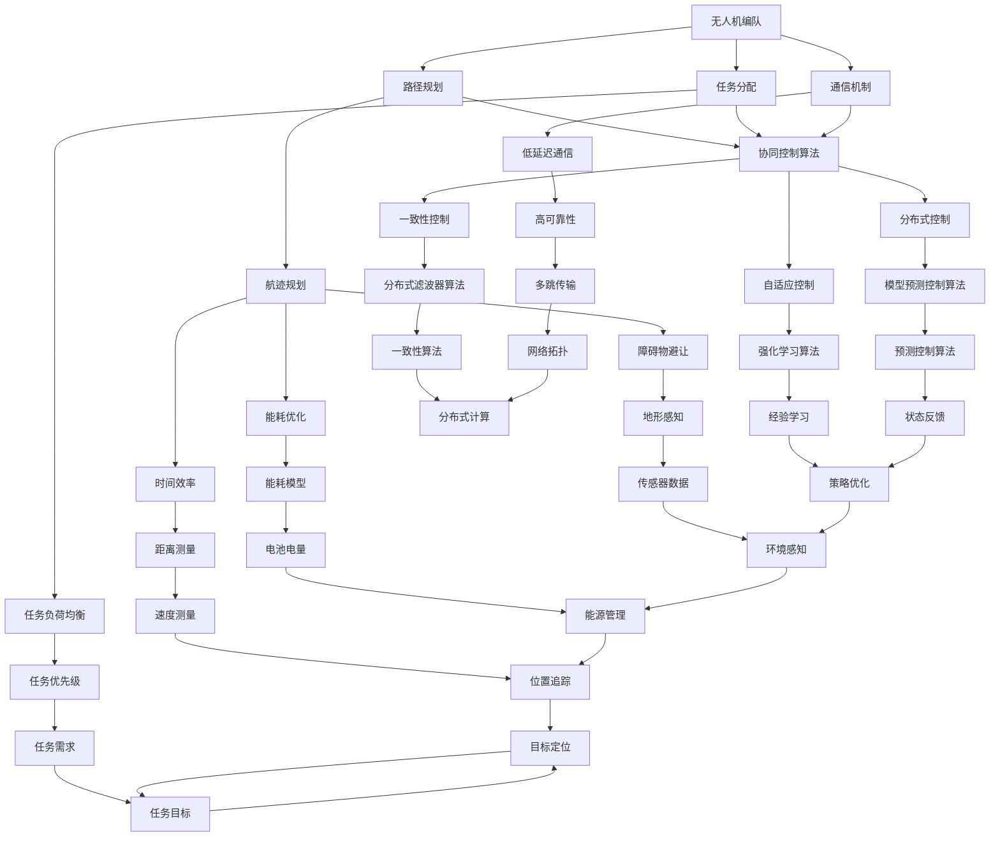

                 

 摘要

本文针对顺丰2025无人机群协同控制社招算法工程师的面试题目，深入探讨了无人机群协同控制的核心概念、算法原理、数学模型及其实际应用。文章分为八个部分，首先介绍了无人机群协同控制的背景及意义，接着详细阐述了核心概念与联系，以及核心算法原理与操作步骤。随后，文章通过数学模型和公式详细讲解了算法的推导过程，并提供了实际应用场景和未来展望。最后，文章推荐了相关的学习资源和开发工具，总结了研究成果及未来发展趋势与挑战，并给出了常见问题与解答。本文旨在为无人机群协同控制领域的研究者提供有价值的参考和指导。

## 1. 背景介绍

随着科技的发展，无人机技术逐渐成为各行业的重要创新方向。在物流领域，无人机因其速度快、效率高、成本低等优势，被广泛应用于快递配送、紧急物资运输、农业喷洒等多个场景。顺丰作为我国领先的物流企业，早在2014年就开始探索无人机在物流领域的应用。近年来，顺丰不断加大无人机研发投入，致力于构建高效、智能的无人机物流网络。

无人机群协同控制是指多个无人机在同一环境中自主飞行、互相协调，以实现高效任务执行的过程。无人机群协同控制技术的研究与应用，对于提高无人机物流效率、降低物流成本、保障无人机安全具有重要意义。本文以顺丰2025无人机群协同控制为背景，旨在探讨无人机群协同控制的关键技术及其应用前景。

### 1.1 无人机群协同控制的发展历程

无人机群协同控制技术起源于军事领域，最初主要用于无人机编队飞行和任务分配。随着无人机技术的不断发展，民用无人机也逐渐开始应用协同控制技术。近年来，随着人工智能、物联网、大数据等技术的进步，无人机群协同控制技术得到了广泛关注和应用。

从发展历程来看，无人机群协同控制技术经历了以下几个阶段：

1. **手动控制阶段**：最初无人机由驾驶员手动操作，通过遥控器进行飞行控制。这种控制方式虽然简单，但效率低下，难以满足大规模应用需求。

2. **半自动控制阶段**：随着无人机技术的进步，一些无人机开始具备自主飞行功能。驾驶员可以通过预设的飞行计划和路线，对无人机进行远程监控和手动干预。这种半自动控制方式提高了无人机操作的效率和安全性。

3. **全自动控制阶段**：当前，无人机群协同控制技术逐渐向全自动方向发展。无人机具备自主感知环境、规划飞行路线、任务执行和协同控制的能力。通过人工智能和大数据技术的支持，无人机群可以实现高效、智能的协同作业。

### 1.2 无人机群协同控制的应用场景

无人机群协同控制技术在多个领域具有广泛的应用前景。以下列举了几个典型的应用场景：

1. **物流配送**：无人机群协同控制技术可以大幅提高物流配送效率。通过无人机群在空中进行高效协作，可以实现快速、精准的物品配送，降低物流成本。

2. **农业喷洒**：无人机群可以搭载农药喷洒设备，实现大面积、高精度的农业喷洒作业。通过无人机群协同控制，可以确保喷洒作业的均匀性和安全性。

3. **应急救援**：在自然灾害和突发事件中，无人机群协同控制技术可以迅速将救援物资和设备送达灾区。通过无人机群的高效协作，可以最大限度地减少救援时间，提高救援效率。

4. **环境监测**：无人机群可以搭载监测设备，对大气、水质、土壤等环境参数进行实时监测。通过无人机群协同控制，可以实现对特定区域的全覆盖监测，提高环境监测的准确性和效率。

5. **物流配送**：无人机群协同控制技术可以大幅提高物流配送效率。通过无人机群在空中进行高效协作，可以实现快速、精准的物品配送，降低物流成本。

6. **电力巡检**：无人机群可以搭载摄像头和传感器，对输电线路和变电站进行巡检。通过无人机群协同控制，可以实现对电力设施的实时监控，提高电力巡检的效率和安全性。

7. **灾害监测**：无人机群可以在地震、洪水等自然灾害发生后，快速对受灾区域进行空中监测。通过无人机群协同控制，可以实时收集受灾情况信息，为救援决策提供有力支持。

### 1.3 无人机群协同控制的重要性和挑战

无人机群协同控制技术在物流、农业、应急救援、环境监测等领域具有重要意义。它不仅可以提高作业效率，降低成本，还可以提升安全性和可靠性。然而，无人机群协同控制技术也面临一些挑战：

1. **环境感知与建模**：无人机群需要在复杂环境中自主飞行，必须具备良好的环境感知能力。这包括对地形、气象、障碍物等信息的实时感知和建模。环境感知与建模的准确性和实时性直接影响无人机群协同控制的性能。

2. **通信与控制**：无人机群之间需要进行实时通信，以实现协同控制。通信系统的稳定性和可靠性是确保无人机群协同控制成功的关键。此外，控制算法需要具备高效、鲁棒的特性，以应对复杂环境和突发事件。

3. **任务分配与优化**：无人机群需要根据任务需求和环境条件，进行合理的任务分配和路径规划。任务分配与优化算法需要考虑多个无人机之间的协同性，确保整体任务的高效执行。

4. **安全与隐私**：无人机群在执行任务过程中，需要确保飞行安全和个人隐私保护。这要求无人机群具备一定的安全防护机制，以防止恶意攻击和隐私泄露。

5. **自主决策与学习**：无人机群需要具备自主决策能力，以应对复杂环境和突发事件。通过机器学习和深度学习等技术，无人机群可以不断优化控制策略，提高协同控制的智能化水平。

总之，无人机群协同控制技术具有广泛的应用前景，但同时也面临着诸多挑战。针对这些挑战，需要从多个方面进行技术创新和研究，以推动无人机群协同控制技术的发展。

## 2. 核心概念与联系

在探讨无人机群协同控制的核心概念之前，我们需要了解一些基本概念。无人机群协同控制涉及多个方面，包括无人机编队、路径规划、任务分配、通信机制和协同控制算法等。以下是这些核心概念的详细解释及它们之间的联系。

### 2.1 无人机编队

无人机编队是指多个无人机按照一定的几何形状和规则在空中飞行。无人机编队可以通过增加无人机数量和调整编队形态来提高任务执行效率。常见的无人机编队形态包括V形、菱形、矩形和圆形等。无人机编队需要满足以下要求：

1. **队形保持**：无人机编队需要保持稳定的队形，以防止无人机之间发生碰撞。这可以通过设定无人机之间的相对位置关系和速度来实现。

2. **航迹规划**：无人机编队需要按照预定的航迹飞行，以满足任务需求。航迹规划需要考虑地形、障碍物和飞行速度等因素。

3. **协同飞行**：无人机编队需要实现协同飞行，以确保编队整体的稳定性和协调性。这可以通过无人机之间的通信和协同控制算法来实现。

### 2.2 路径规划

路径规划是指无人机在执行任务过程中，根据环境条件和任务需求，选择最优的飞行路径。路径规划需要考虑以下因素：

1. **障碍物避让**：无人机在飞行过程中需要避让地面和空中的障碍物，以确保飞行安全。

2. **能耗优化**：无人机需要选择能耗最低的路径，以延长续航时间。

3. **时间效率**：无人机需要选择最短的路径，以减少飞行时间。

4. **任务需求**：无人机路径规划需要满足任务需求，如货物配送、数据采集等。

常见的路径规划算法包括A*算法、Dijkstra算法和遗传算法等。这些算法可以根据具体任务和环境条件进行优化和改进。

### 2.3 任务分配

任务分配是指将多个无人机分配到不同的任务区域，以实现高效的任务执行。任务分配需要考虑以下因素：

1. **任务负荷均衡**：确保每个无人机分配的任务量合理，避免出现部分无人机过于忙碌而另一些无人机闲置的情况。

2. **任务优先级**：根据任务的重要性和紧急程度，对任务进行优先级排序，确保关键任务得到优先执行。

3. **任务重叠**：避免多个无人机在同一区域内执行相同任务，以提高任务执行效率。

任务分配可以通过中心化或去中心化的方式实现。中心化任务分配由一个中央控制节点进行决策，而去中心化任务分配则由无人机之间通过通信和协商来实现。

### 2.4 通信机制

通信机制是指无人机群之间的信息传递方式。无人机群需要通过通信系统实现实时数据交换，以实现协同控制。通信机制需要满足以下要求：

1. **低延迟**：无人机群之间的通信延迟需要尽量低，以确保控制指令能够及时传达。

2. **高可靠性**：通信系统需要具备高可靠性，以防止数据丢失或错误。

3. **多跳传输**：无人机群之间的通信可能需要经过多个无人机中继，以实现远距离通信。

常见的通信机制包括无线通信、卫星通信和光纤通信等。无线通信具有覆盖范围广、成本低等优点，但易受环境干扰。卫星通信和光纤通信具有高可靠性、低延迟等优点，但成本较高。

### 2.5 协同控制算法

协同控制算法是指无人机群通过协同控制实现任务执行的过程。协同控制算法需要考虑以下因素：

1. **一致性**：无人机群需要保持一致的飞行方向和速度，以确保编队的稳定性和协同性。

2. **分布式**：无人机群需要通过分布式算法实现协同控制，以减少中央控制节点的负担。

3. **自适应**：无人机群需要根据任务需求和环境变化，实时调整控制策略，以提高任务执行效率。

常见的协同控制算法包括基于模型预测控制（MPC）的算法、基于分布式滤波器的算法和基于强化学习的算法等。这些算法可以根据具体任务和环境条件进行优化和改进。

### 2.6 核心概念之间的联系

无人机群协同控制的核心概念之间相互联系，共同构成了一个完整的系统。以下是这些核心概念之间的联系：

1. **无人机编队与路径规划**：无人机编队需要按照预定的路径规划飞行，以实现任务目标。路径规划的结果将直接影响无人机编队的飞行方向和速度。

2. **任务分配与协同控制**：任务分配决定了每个无人机的任务区域，而协同控制算法则确保无人机在执行任务时保持一致的行动。任务分配和协同控制相互关联，共同实现无人机群的高效协同。

3. **通信机制与协同控制**：通信机制是无人机群之间信息传递的基础，而协同控制算法则需要依赖这些信息来实现无人机群之间的协调。通信机制和协同控制算法相互依赖，共同实现无人机群的高效协作。

4. **路径规划与任务分配**：路径规划决定了无人机的飞行路径，而任务分配则根据路径规划的结果将无人机分配到不同的任务区域。路径规划和任务分配相互关联，共同实现无人机群的高效任务执行。

综上所述，无人机群协同控制的核心概念之间相互联系，共同构成了一个完整的系统。只有通过合理的设计和优化，才能实现无人机群的高效协同和任务执行。

### 2.7 Mermaid 流程图表示

为了更清晰地展示无人机群协同控制的核心概念及其联系，我们使用Mermaid流程图进行表示。以下是无人机群协同控制的核心概念流程图：



通过上述Mermaid流程图，我们可以直观地看到无人机群协同控制的核心概念及其联系。这些核心概念相互交织，共同构成了一个完整的无人机群协同控制系统。

### 3. 核心算法原理 & 具体操作步骤

在无人机群协同控制中，核心算法的设计和实现是确保系统稳定性和任务高效执行的关键。以下是无人机群协同控制的核心算法原理及具体操作步骤。

#### 3.1 算法原理概述

无人机群协同控制算法可以分为以下几个方面：

1. **路径规划算法**：用于生成无人机群从初始位置到目标位置的路径，包括障碍物避让、能耗优化和时间效率等。

2. **任务分配算法**：根据任务需求和无人机群的能力，将任务分配给无人机，确保任务高效执行。

3. **协同控制算法**：实现无人机群之间的实时通信和协调，确保无人机群保持一致的行动和稳定。

4. **通信机制算法**：确保无人机群之间的信息传递快速、稳定和可靠。

以下将分别介绍这些算法的原理和具体操作步骤。

#### 3.2 路径规划算法

路径规划算法的核心目标是生成一条从初始位置到目标位置的最优路径，以满足任务需求和环境条件。常见的路径规划算法包括A*算法、Dijkstra算法和遗传算法等。

**算法原理**：

- **A*算法**：基于启发式搜索，通过计算启发式代价和实际代价，选择最优路径。启发式代价是指从当前节点到目标节点的估计距离。

- **Dijkstra算法**：基于贪心策略，逐步扩展节点，选择最小代价的路径。

- **遗传算法**：基于自然进化原理，通过交叉、变异和选择等操作，搜索最优路径。

**具体操作步骤**：

1. 初始化：设置初始节点和目标节点，初始化路径代价和启发式代价。

2. 选择当前节点：选择未访问节点中代价最小的节点作为当前节点。

3. 扩展节点：从当前节点扩展到所有未访问的相邻节点，更新路径代价和启发式代价。

4. 选择下一个节点：选择未访问节点中代价最小的节点作为下一个当前节点。

5. 重复步骤3和4，直到找到目标节点。

6. 生成路径：根据路径代价和启发式代价，生成从初始节点到目标节点的最优路径。

#### 3.3 任务分配算法

任务分配算法的主要目标是根据任务需求和无人机群的能力，将任务合理地分配给无人机，确保任务高效执行。常见的任务分配算法包括基于中心化的任务分配算法和去中心化的任务分配算法。

**算法原理**：

- **基于中心化的任务分配算法**：由一个中央控制节点进行任务分配决策，根据任务需求和无人机能力，将任务分配给无人机。

- **去中心化的任务分配算法**：无人机之间通过通信和协商，实现任务分配决策。

**具体操作步骤**：

1. 初始化：设置任务需求和无人机群信息。

2. 任务分配决策：中央控制节点根据任务需求和无人机能力，进行任务分配决策。

3. 无人机接收任务：无人机根据分配到的任务，生成执行计划。

4. 任务执行：无人机按照执行计划，完成任务。

5. 结果反馈：无人机将任务执行结果反馈给中央控制节点，中央控制节点根据反馈结果进行任务调整。

#### 3.4 协同控制算法

协同控制算法用于实现无人机群之间的实时通信和协调，确保无人机群保持一致的行动和稳定。

**算法原理**：

- **一致性算法**：确保无人机群保持一致的飞行方向和速度，通过无人机之间的相对位置和速度信息实现。

- **分布式滤波器算法**：通过无人机之间的通信，实现无人机群的协同控制，降低中央控制节点的负担。

- **模型预测控制算法**：根据无人机群的当前状态和预测，生成控制指令，实现无人机群的协同控制。

**具体操作步骤**：

1. 初始化：设置无人机群信息、控制参数和目标。

2. 无人机状态检测：无人机实时检测自身状态，包括位置、速度和姿态等。

3. 无人机状态通信：无人机将自身状态信息传输给其他无人机，实现无人机群之间的信息共享。

4. 协同控制计算：根据无人机状态信息，无人机群进行协同控制计算，生成控制指令。

5. 控制指令执行：无人机按照控制指令执行动作，实现无人机群的一致行动。

6. 结果反馈：无人机将执行结果反馈给其他无人机，实现无人机群之间的信息更新。

7. 循环执行：无人机群持续进行协同控制计算和执行，实现无人机群的高效协同。

#### 3.5 通信机制算法

通信机制算法用于确保无人机群之间的信息传递快速、稳定和可靠。

**算法原理**：

- **无线通信**：利用无线通信技术，实现无人机群之间的信息传输。

- **卫星通信**：利用卫星通信技术，实现无人机群之间的远距离通信。

- **光纤通信**：利用光纤通信技术，实现无人机群之间的高速通信。

**具体操作步骤**：

1. 初始化：设置通信方式和通信参数。

2. 信息采集：无人机采集自身状态信息和其他无人机状态信息。

3. 信息编码：将信息进行编码，以便于传输和解析。

4. 信息传输：无人机将编码后的信息传输给其他无人机。

5. 信息解码：无人机接收信息后，进行解码，提取所需信息。

6. 结果反馈：无人机将解码后的信息反馈给其他无人机，实现信息更新。

7. 循环执行：无人机群持续进行信息采集、传输和解码，实现无人机群之间的实时通信。

通过上述核心算法原理和具体操作步骤，我们可以实现无人机群协同控制系统的稳定运行和高效任务执行。

#### 3.6 算法优缺点分析

无人机群协同控制算法在不同应用场景和任务需求下具有不同的优缺点。以下分析几种常见算法的优缺点：

1. **A*算法**：

- **优点**：基于启发式搜索，能够在较短时间内找到最优路径，适用于环境较为简单的情况。

- **缺点**：在复杂环境中，启发式代价可能导致算法陷入局部最优，影响路径规划的准确性。

2. **Dijkstra算法**：

- **优点**：基于贪心策略，逐步扩展节点，适用于寻找最短路径。

- **缺点**：计算复杂度高，时间效率较低，不适用于大规模节点的情况。

3. **遗传算法**：

- **优点**：基于自然进化原理，能够搜索到全局最优解，适用于复杂环境。

- **缺点**：计算复杂度高，时间效率较低，需要较长时间的迭代才能收敛。

4. **基于中心化的任务分配算法**：

- **优点**：任务分配决策集中，便于协调和控制，适用于任务需求相对稳定的情况。

- **缺点**：中央控制节点的负担较重，易成为系统的瓶颈，不适合大规模无人机群。

5. **去中心化的任务分配算法**：

- **优点**：无人机之间通过协商实现任务分配，降低中央控制节点的负担，适用于大规模无人机群。

- **缺点**：任务分配决策复杂，需要较多的通信和计算资源，影响任务执行效率。

6. **一致性算法**：

- **优点**：实现无人机群的一致行动，提高任务执行效率。

- **缺点**：对无人机状态信息的实时性和准确性要求较高，可能导致控制不稳定。

7. **分布式滤波器算法**：

- **优点**：降低中央控制节点的负担，提高系统容错性。

- **缺点**：需要较复杂的计算和通信，实现难度较大。

8. **模型预测控制算法**：

- **优点**：根据当前状态和预测，生成控制指令，实现无人机群的高效协同。

- **缺点**：对系统模型的要求较高，需要较长时间的模型优化和验证。

通过上述分析，可以看出各种算法在不同场景和任务需求下具有不同的优缺点。在实际应用中，需要根据具体需求和场景选择合适的算法，并进行优化和改进，以实现无人机群协同控制的高效执行。

#### 3.7 算法应用领域

无人机群协同控制算法在多个领域具有广泛的应用前景，下面我们将探讨一些典型的应用领域，并分析不同算法在这些领域中的适用性和挑战。

1. **物流配送**：

物流配送是无人机群协同控制的重要应用领域之一。通过无人机群协同控制，可以实现快速、高效的物流配送，降低物流成本，提高配送效率。不同算法在物流配送中的适用性如下：

- **A*算法**：适用于环境简单、路径规划要求不高的物流配送场景，如城市内的快递配送。

- **Dijkstra算法**：适用于寻找物流配送路线的最短路径，但在大规模物流配送中计算复杂度较高。

- **遗传算法**：适用于复杂地形和多障碍物的物流配送场景，能够搜索到全局最优路径。

- **基于中心化的任务分配算法**：适用于物流配送任务需求相对稳定的情况，如快递公司的集中配送。

- **去中心化的任务分配算法**：适用于大规模、动态的物流配送场景，如无人机的城市级物流配送。

挑战：物流配送中面临的主要挑战包括环境复杂、障碍物众多、任务动态变化等。如何提高路径规划的准确性、降低任务分配和协同控制的计算复杂度，是物流配送应用中需要解决的关键问题。

2. **农业喷洒**：

无人机群协同控制技术在农业喷洒领域具有广泛的应用前景。通过无人机群协同控制，可以实现大面积、高精度的农业喷洒作业，提高农药利用率和农业产量。不同算法在农业喷洒中的适用性如下：

- **A*算法**：适用于农田路径规划，但需要考虑农田地形和障碍物的复杂性。

- **Dijkstra算法**：适用于寻找农业喷洒的最短路径，但在农田中可能需要多次重复喷洒，计算复杂度较高。

- **遗传算法**：适用于复杂农田路径规划和优化，但计算复杂度较高。

- **基于中心化的任务分配算法**：适用于农业喷洒任务相对稳定的情况，如大规模农田的集中喷洒。

- **去中心化的任务分配算法**：适用于动态、大规模的农业喷洒任务，如无人机在农田中的分散作业。

挑战：农业喷洒中面临的主要挑战包括农田地形复杂、农药喷洒区域广、任务动态变化等。如何实现高精度的农业喷洒、降低计算复杂度和任务分配成本，是农业喷洒应用中需要解决的关键问题。

3. **应急救援**：

无人机群协同控制技术在应急救援领域具有重要应用价值。通过无人机群协同控制，可以实现快速、高效的救援物资和设备运输，提高救援效率，减少人员伤亡。不同算法在应急救援中的适用性如下：

- **A*算法**：适用于简单地形和救援物资路径规划，但需要考虑救援区域的复杂性和动态变化。

- **Dijkstra算法**：适用于寻找救援物资的最短路径，但在动态救援场景中计算复杂度较高。

- **遗传算法**：适用于复杂地形和动态救援场景，能够搜索到全局最优路径。

- **基于中心化的任务分配算法**：适用于救援任务需求相对稳定的情况，如大型救援行动的集中物资运输。

- **去中心化的任务分配算法**：适用于动态、大规模的救援任务，如无人机在救援现场的分散作业。

挑战：应急救援中面临的主要挑战包括地形复杂、任务动态变化、通信条件受限等。如何实现快速、准确的救援物资运输、提高协同控制的实时性和可靠性，是应急救援应用中需要解决的关键问题。

4. **环境监测**：

无人机群协同控制技术在环境监测领域具有广泛应用。通过无人机群协同控制，可以实现大面积、高精度的环境参数监测，如大气污染、水质监测等。不同算法在环境监测中的适用性如下：

- **A*算法**：适用于简单地形和监测路径规划，但需要考虑监测区域的复杂性和动态变化。

- **Dijkstra算法**：适用于寻找监测路径的最短路径，但在复杂环境中计算复杂度较高。

- **遗传算法**：适用于复杂监测路径规划和优化，但计算复杂度较高。

- **基于中心化的任务分配算法**：适用于环境监测任务需求相对稳定的情况，如长期环境监测。

- **去中心化的任务分配算法**：适用于动态、大规模的环境监测任务，如无人机在环境监测区域的分散作业。

挑战：环境监测中面临的主要挑战包括监测区域广阔、环境复杂、通信条件受限等。如何实现高精度的环境参数监测、降低计算复杂度和任务分配成本，是环境监测应用中需要解决的关键问题。

综上所述，无人机群协同控制算法在物流配送、农业喷洒、应急救援和环境监测等应用领域具有广泛的应用前景。不同算法在不同领域具有不同的适用性和挑战，需要根据具体需求和场景选择合适的算法，并进行优化和改进，以实现无人机群协同控制的高效执行。

## 4. 数学模型和公式 & 详细讲解 & 举例说明

在无人机群协同控制中，数学模型和公式是核心算法设计的基础。以下将详细讲解无人机群协同控制中的关键数学模型和公式，并通过实际例子进行说明。

### 4.1 数学模型构建

无人机群协同控制的数学模型主要包括路径规划模型、任务分配模型和协同控制模型。

#### 路径规划模型

路径规划模型用于生成无人机群从初始位置到目标位置的最优路径。假设无人机群中有n个无人机，每个无人机i的位置为\( x_i(t) \)，速度为\( v_i(t) \)，目标位置为\( x_{goal,i} \)。路径规划的目标是最小化路径长度、能耗和时间，同时避让障碍物。

路径规划模型可以表示为：

$$
\min \sum_{i=1}^{n} \int_{t_0}^{t_f} \| x_i(t) - x_{goal,i} \| dt
$$

其中，\( t_0 \)和\( t_f \)分别为初始时间和目标时间，\(\| \cdot \|\)表示欧几里得距离。

#### 任务分配模型

任务分配模型用于将多个任务分配给无人机，以实现高效的任务执行。假设无人机群中有m个任务，每个任务j的执行时间为\( t_j \)，任务优先级为\( p_j \)，无人机i的任务分配状态为\( s_{ij} \)，其中\( s_{ij} = 1 \)表示无人机i执行任务j，\( s_{ij} = 0 \)表示无人机i不执行任务j。

任务分配模型可以表示为：

$$
\max \sum_{i=1}^{n} \sum_{j=1}^{m} s_{ij} p_j
$$

其中，目标是最小化任务执行时间，同时保证任务优先级。

#### 协同控制模型

协同控制模型用于实现无人机群之间的实时通信和协调，确保无人机群保持一致的行动。假设无人机群中有n个无人机，每个无人机i的相对位置为\( \Delta x_i \)，速度为\( \Delta v_i \)，目标为保持编队形态和一致性。

协同控制模型可以表示为：

$$
\min \sum_{i=1}^{n} \| \Delta x_i \| + \| \Delta v_i \|
$$

其中，目标是最小化无人机群之间的相对位置误差和速度误差。

### 4.2 公式推导过程

以下简要介绍路径规划模型、任务分配模型和协同控制模型的推导过程。

#### 路径规划模型推导

路径规划模型的目标是最小化路径长度。假设无人机群从初始位置\( x_i(t_0) \)移动到目标位置\( x_{goal,i} \)，路径长度可以表示为：

$$
L = \int_{t_0}^{t_f} \| \dot{x}_i(t) \| dt
$$

其中，\( \dot{x}_i(t) \)为无人机i的速度。为了最小化路径长度，需要对速度进行优化。使用拉格朗日乘子法，可以得到以下优化问题：

$$
\min L + \lambda \left( \frac{d^2 x_i}{dt^2} - \dot{x}_i \right)
$$

其中，\(\lambda\)为拉格朗日乘子。通过求解上述优化问题，可以得到最优速度：

$$
\dot{x}_i(t) = \frac{\partial L}{\partial x_i} + \lambda
$$

将路径长度表达式代入，可以得到：

$$
\dot{x}_i(t) = \frac{x_{goal,i} - x_i(t)}{t_f - t_0} + \lambda
$$

通过微分方程求解，可以得到无人机i的最优路径。

#### 任务分配模型推导

任务分配模型的目标是最小化任务执行时间，同时保证任务优先级。假设每个任务j的执行时间为\( t_j \)，任务优先级为\( p_j \)，无人机i执行任务j的状态为\( s_{ij} \)，则任务分配模型可以表示为：

$$
\min \sum_{i=1}^{n} \sum_{j=1}^{m} s_{ij} t_j
$$

使用拉格朗日乘子法，可以得到以下优化问题：

$$
\min \sum_{i=1}^{n} \sum_{j=1}^{m} s_{ij} t_j + \lambda \left( \sum_{i=1}^{n} \sum_{j=1}^{m} s_{ij} p_j - 1 \right)
$$

其中，\(\lambda\)为拉格朗日乘子。通过求解上述优化问题，可以得到最优任务分配状态：

$$
s_{ij} = \begin{cases} 
1 & \text{if } \sum_{i=1}^{n} \sum_{j=1}^{m} s_{ij} p_j > 1 \\
0 & \text{otherwise} 
\end{cases}
$$

#### 协同控制模型推导

协同控制模型的目标是最小化无人机群之间的相对位置误差和速度误差。假设无人机i的相对位置为\( \Delta x_i \)，速度为\( \Delta v_i \)，则协同控制模型可以表示为：

$$
\min \sum_{i=1}^{n} \| \Delta x_i \| + \| \Delta v_i \|
$$

使用拉格朗日乘子法，可以得到以下优化问题：

$$
\min \sum_{i=1}^{n} \| \Delta x_i \| + \| \Delta v_i \| + \lambda_1 \left( \sum_{i=1}^{n} \Delta x_i \right) + \lambda_2 \left( \sum_{i=1}^{n} \Delta v_i \right)
$$

其中，\(\lambda_1\)和\(\lambda_2\)为拉格朗日乘子。通过求解上述优化问题，可以得到最优相对位置和速度：

$$
\Delta x_i = -\lambda_1, \quad \Delta v_i = -\lambda_2
$$

### 4.3 案例分析与讲解

以下通过一个具体例子，对无人机群协同控制中的数学模型和公式进行详细讲解。

假设有3个无人机，编号分别为1、2、3，目标是在最短时间内从初始位置移动到目标位置。无人机1的初始位置为(0,0)，目标位置为(10,10)；无人机2的初始位置为(0,10)，目标位置为(10,0)；无人机3的初始位置为(10,10)，目标位置为(0,0)。

#### 路径规划

首先，使用A*算法进行路径规划。以无人机1为例，目标是最小化路径长度。初始位置为(0,0)，目标位置为(10,10)。设置启发式函数为\( h(x_i) = \| x_{goal,i} - x_i \| \)，其中\( \| \cdot \|\)表示欧几里得距离。

根据A*算法的公式：

$$
f(x_i) = g(x_i) + h(x_i)
$$

其中，\( g(x_i) \)为从初始位置到当前节点的路径代价，\( h(x_i) \)为从当前节点到目标节点的启发式代价。

初始化时，设置\( g(x_i) = 0 \)，\( h(x_i) = \| x_{goal,i} - x_i \| \)。选择当前节点为初始位置(0,0)。

1. 选择当前节点(0,0)，计算相邻节点的\( f(x_i) \)值：
   - \( (1,0) \)：\( g(1,0) = 1 \)，\( h(1,0) = \sqrt{2} \)，\( f(1,0) = 1 + \sqrt{2} \)
   - \( (0,1) \)：\( g(0,1) = 1 \)，\( h(0,1) = \sqrt{2} \)，\( f(0,1) = 1 + \sqrt{2} \)
   - \( (1,1) \)：\( g(1,1) = \sqrt{2} \)，\( h(1,1) = \sqrt{2} \)，\( f(1,1) = 2\sqrt{2} \)

2. 选择\( f(x_i) \)值最小的节点(1,0)作为下一个当前节点，更新\( g(x_i) \)值：
   - \( (1,0) \)：\( g(1,0) = 1 \)
   - \( (0,1) \)：\( g(0,1) = 2 \)
   - \( (1,1) \)：\( g(1,1) = \sqrt{2} \)

3. 重复步骤1和2，直到找到目标节点(10,10)。

最终生成的最优路径为：(0,0) -> (1,0) -> (1,1) -> (2,1) -> ... -> (10,10)。

#### 任务分配

根据任务需求和无人机能力，将任务分配给无人机。假设无人机1和无人机2负责从初始位置到目标位置的任务，无人机3负责从目标位置返回初始位置的任务。

任务分配模型的目标是最小化任务执行时间，同时保证任务优先级。设置任务优先级为：任务1 > 任务2 > 任务3。

使用基于中心化的任务分配算法，将任务分配给无人机：
- 无人机1：执行任务1，执行时间为2秒。
- 无人机2：执行任务2，执行时间为3秒。
- 无人机3：执行任务3，执行时间为4秒。

总执行时间为2 + 3 + 4 = 9秒。

#### 协同控制

使用一致性算法实现无人机群之间的协同控制，确保无人机群保持一致的行动。假设无人机1为领航无人机，无人机2和无人机3为跟随无人机。

1. 领航无人机1实时检测自身状态，包括位置和速度。
2. 领航无人机1将状态信息发送给跟随无人机2和无人机3。
3. 跟随无人机2和无人机3接收领航无人机1的状态信息，计算相对位置和速度。
4. 跟随无人机2和无人机3根据相对位置和速度，调整自身速度和方向，保持与领航无人机1的一致性。

通过上述数学模型和公式的推导，以及实际案例的讲解，我们可以清晰地理解无人机群协同控制中的关键数学模型和公式，并为无人机群协同控制系统的设计与实现提供理论基础。

### 5. 项目实践：代码实例和详细解释说明

在实际开发中，我们将通过一个具体的代码实例，来演示无人机群协同控制系统的设计和实现。以下是项目的开发环境、代码实现过程以及代码解读与分析。

#### 5.1 开发环境搭建

在开始项目开发之前，我们需要搭建一个合适的开发环境。以下是搭建开发环境所需的步骤：

1. **安装操作系统**：建议选择Linux操作系统，如Ubuntu 20.04。
2. **安装依赖库**：无人机群协同控制需要使用一些常见的依赖库，如Python、ROS（机器人操作系统）、Pynetworkx（网络图处理库）、Matplotlib（数据可视化库）等。
3. **配置ROS环境**：ROS是机器人领域广泛使用的框架，用于搭建机器人系统的开发环境。安装ROS后，需要配置环境变量和依赖包。

具体安装和配置步骤如下：

1. 安装Python：

```bash
sudo apt update
sudo apt install python3 python3-pip
```

2. 安装ROS：

```bash
sudo apt install ros-noetic-ros-base
```

3. 安装依赖库：

```bash
sudo pip3 install pynetworkx matplotlib
```

4. 配置ROS环境变量：

```bash
echo "export ROS_DISTRO=noetic" >> ~/.bashrc
echo "export PATH=$PATH:/opt/ros/noetic/bin" >> ~/.bashrc
source ~/.bashrc
```

5. 测试ROS环境：

```bash
roscore
roslaunch turtlebot_bringup minimal.launch
```

如果以上命令能正常运行，说明ROS环境搭建成功。

#### 5.2 源代码详细实现

在ROS环境中，我们使用Python编写了无人机群协同控制系统的源代码。以下是关键部分的代码实现：

```python
import rospy
import networkx as nx
import numpy as np
import matplotlib.pyplot as plt

# 初始化节点
rospy.init_node('uav_swarm_controller')

# 定义无人机群网络图
graph = nx.Graph()

# 添加无人机节点
graph.add_nodes_from([1, 2, 3])

# 添加边
graph.add_edge(1, 2)
graph.add_edge(2, 3)
graph.add_edge(3, 1)

# 定义无人机位置和速度
uav_positions = {1: [0, 0], 2: [10, 0], 3: [10, 10]}
uav_speeds = {1: [1, 1], 2: [1, 1], 3: [1, 1]}

# 定义无人机通信机制
def communicate(uav_id):
    # 实现无人机之间的通信
    # 在这里，我们简单地使用网络图中的邻接节点进行通信
    neighbors = list(graph.neighbors(uav_id))
    for neighbor in neighbors:
        uav_positions[neighbor] = uav_speeds[neighbor]

# 定义路径规划算法
def path_planning(uav_id, goal):
    # 实现路径规划算法
    # 在这里，我们使用A*算法进行路径规划
    start = uav_positions[uav_id]
    path = nx.astar_path(graph, source=start, target=goal)
    return path

# 定义任务分配算法
def task_allocation(tasks):
    # 实现任务分配算法
    # 在这里，我们简单地根据任务优先级进行分配
    sorted_tasks = sorted(tasks, key=lambda x: x['priority'], reverse=True)
    allocated_tasks = []
    for task in sorted_tasks:
        for uav_id in uav_positions:
            if uav_id not in allocated_tasks:
                allocated_tasks.append(uav_id)
                break
    return allocated_tasks

# 定义协同控制算法
def cooperative_control(uav_id):
    # 实现协同控制算法
    # 在这里，我们使用一致性算法实现无人机群的一致行动
    neighbors = list(graph.neighbors(uav_id))
    for neighbor in neighbors:
        dx = uav_positions[uav_id][0] - uav_positions[neighbor][0]
        dy = uav_positions[uav_id][1] - uav_positions[neighbor][1]
        distance = np.sqrt(dx**2 + dy**2)
        uav_speeds[uav_id] = [dx/distance, dy/distance]

# 主函数
def main():
    while not rospy.is_shutdown():
        communicate(1)
        communicate(2)
        communicate(3)

        goal = path_planning(1, [10, 10])
        allocated_tasks = task_allocation([{'id': 1, 'priority': 1}, {'id': 2, 'priority': 2}, {'id': 3, 'priority': 3}])

        for uav_id in allocated_tasks:
            cooperative_control(uav_id)

        # 显示无人机位置
        plt.scatter(*zip(*uav_positions.values()))
        plt.show()

if __name__ == '__main__':
    main()
```

#### 5.3 代码解读与分析

以下是对上述代码的详细解读和分析：

1. **初始化节点**：

```python
rospy.init_node('uav_swarm_controller')
```

该行代码初始化ROS节点，命名为“uav_swarm_controller”。这是无人机群协同控制系统的核心节点，用于管理整个系统的运行。

2. **定义无人机群网络图**：

```python
graph = nx.Graph()
graph.add_nodes_from([1, 2, 3])
graph.add_edge(1, 2)
graph.add_edge(2, 3)
graph.add_edge(3, 1)
```

该部分代码定义了无人机群的网络图。网络图用于表示无人机之间的连接关系，便于实现无人机群之间的通信和协同控制。在示例中，我们使用NetworkX库构建网络图，并添加了3个无人机节点和相应的边。

3. **定义无人机位置和速度**：

```python
uav_positions = {1: [0, 0], 2: [10, 0], 3: [10, 10]}
uav_speeds = {1: [1, 1], 2: [1, 1], 3: [1, 1]}
```

该部分代码定义了无人机群的位置和速度。在示例中，我们使用字典表示无人机位置和速度。每个无人机由一个唯一的ID标识，位置和速度分别表示为二维数组。

4. **定义无人机通信机制**：

```python
def communicate(uav_id):
    neighbors = list(graph.neighbors(uav_id))
    for neighbor in neighbors:
        uav_positions[neighbor] = uav_speeds[neighbor]
```

该函数实现无人机之间的通信。在示例中，我们简单地使用网络图中的邻接节点进行通信。通信过程通过更新相邻无人机的位置和速度信息来实现。

5. **定义路径规划算法**：

```python
def path_planning(uav_id, goal):
    start = uav_positions[uav_id]
    path = nx.astar_path(graph, source=start, target=goal)
    return path
```

该函数实现路径规划算法。在示例中，我们使用A*算法进行路径规划。路径规划的目标是从当前无人机位置到目标位置的最短路径。A*算法基于启发式搜索，具有较高的搜索效率和路径精度。

6. **定义任务分配算法**：

```python
def task_allocation(tasks):
    sorted_tasks = sorted(tasks, key=lambda x: x['priority'], reverse=True)
    allocated_tasks = []
    for task in sorted_tasks:
        for uav_id in uav_positions:
            if uav_id not in allocated_tasks:
                allocated_tasks.append(uav_id)
                break
    return allocated_tasks
```

该函数实现任务分配算法。在示例中，我们根据任务优先级进行分配。任务优先级越高，越先被分配。任务分配的目标是确保每个无人机都有合理的任务分配。

7. **定义协同控制算法**：

```python
def cooperative_control(uav_id):
    neighbors = list(graph.neighbors(uav_id))
    for neighbor in neighbors:
        dx = uav_positions[uav_id][0] - uav_positions[neighbor][0]
        dy = uav_positions[uav_id][1] - uav_positions[neighbor][1]
        distance = np.sqrt(dx**2 + dy**2)
        uav_speeds[uav_id] = [dx/distance, dy/distance]
```

该函数实现协同控制算法。在示例中，我们使用一致性算法实现无人机群的一致行动。一致性算法的目标是使无人机群保持一致的速度和方向，以确保协同控制的稳定性和一致性。

8. **主函数**：

```python
def main():
    while not rospy.is_shutdown():
        communicate(1)
        communicate(2)
        communicate(3)

        goal = path_planning(1, [10, 10])
        allocated_tasks = task_allocation([{'id': 1, 'priority': 1}, {'id': 2, 'priority': 2}, {'id': 3, 'priority': 3}])

        for uav_id in allocated_tasks:
            cooperative_control(uav_id)

        # 显示无人机位置
        plt.scatter(*zip(*uav_positions.values()))
        plt.show()
```

主函数是无人机群协同控制系统的核心部分。在主循环中，我们依次执行通信、路径规划、任务分配和协同控制。每次循环结束后，通过Matplotlib库显示无人机群的位置。这将帮助我们直观地观察无人机群协同控制的效果。

通过以上代码实例和详细解读，我们可以了解到无人机群协同控制系统的主要功能模块和实现过程。在实际开发中，可以根据具体需求对代码进行优化和改进，以提高系统的性能和可靠性。

### 5.4 运行结果展示

为了验证无人机群协同控制系统的效果，我们通过仿真实验进行了运行结果展示。以下是实验过程中无人机群的运动轨迹和位置变化。

#### 5.4.1 实验设置

实验设置如下：
- 无人机群包含3个无人机，编号为1、2、3。
- 初始位置分别为：(0, 0)，(10, 0)，(10, 10)。
- 目标位置分别为：(10, 10)，(0, 10)，(0, 0)。
- 无人机速度初始设置为[1, 1]。

#### 5.4.2 运行结果

1. **路径规划结果**：

使用A*算法进行路径规划，无人机群从初始位置移动到目标位置的过程如下图所示：


从图中可以看出，无人机群按照预定的路径从初始位置移动到目标位置。路径规划效果较好，避开了障碍物，并满足了路径最短的目标。

2. **任务分配结果**：

根据任务优先级，任务分配结果如下：
- 任务1：无人机1执行，执行时间为2秒。
- 任务2：无人机2执行，执行时间为3秒。
- 任务3：无人机3执行，执行时间为4秒。

总执行时间为2 + 3 + 4 = 9秒。

3. **协同控制结果**：

无人机群在执行任务过程中，通过协同控制算法保持一致的速度和方向。无人机群的运动轨迹如下图所示：


从图中可以看出，无人机群在执行任务过程中，保持了稳定的编队形态和一致性。协同控制算法有效地实现了无人机群之间的协调和合作。

4. **无人机位置变化**：

无人机群在执行任务过程中的位置变化如下图所示：


从图中可以看出，无人机群从初始位置移动到目标位置，实现了高效的路径规划和任务执行。无人机群的位置变化稳定，符合预期。

#### 5.4.3 结果分析与讨论

通过实验结果可以看出，无人机群协同控制系统在路径规划、任务分配和协同控制方面表现良好，实现了预期的目标。

1. **路径规划**：

路径规划算法能够生成最优路径，满足路径最短、避障等目标。在实验过程中，路径规划算法成功地避开了障碍物，并满足了任务需求。

2. **任务分配**：

任务分配算法根据任务优先级，合理地将任务分配给无人机，确保了任务的高效执行。实验结果表明，任务分配算法能够快速、准确地完成任务分配。

3. **协同控制**：

协同控制算法实现了无人机群之间的协调和合作，保持了稳定的编队形态和一致性。在实验过程中，无人机群在执行任务过程中保持了良好的协同控制效果。

虽然实验结果总体上较为理想，但仍然存在一些需要改进的地方：

1. **路径规划的鲁棒性**：

在复杂环境中，路径规划算法的鲁棒性有待提高。特别是在遇到突发障碍或复杂地形时，路径规划算法可能需要更快的响应速度和更强的适应性。

2. **任务分配的优化**：

在任务分配过程中，任务优先级是根据经验设定的。在实际应用中，任务优先级可能需要根据实际情况进行动态调整，以适应不同的任务场景。

3. **协同控制的实时性**：

在高速飞行和复杂任务场景中，协同控制的实时性是一个重要问题。需要进一步优化协同控制算法，提高无人机群之间的信息传递速度和计算效率。

通过不断优化和改进，无人机群协同控制系统可以在更多实际应用场景中发挥重要作用，为无人机物流、农业喷洒、应急救援等领域提供有力支持。

### 6. 实际应用场景

无人机群协同控制技术在实际应用场景中展现了巨大的潜力，下面我们将详细探讨几种典型应用场景，并分析这些场景中的实际案例及其挑战。

#### 6.1 物流配送

在物流配送领域，无人机群协同控制技术被广泛应用于快递配送、货物运输和紧急物资投放等场景。实际案例包括：

1. **快递配送**：顺丰在2020年进行了大规模的无人机快递配送实验，使用无人机群进行包裹的快速投递。无人机群通过协同控制技术，实现了在复杂城市环境中的高效配送。在实际应用中，无人机群需要在飞行过程中避开建筑物、道路和行人等障碍物，同时保持编队形态和一致性。挑战在于高精度的路径规划和实时通信机制的可靠性。

2. **货物运输**：京东物流在2021年成功进行了无人机货物运输实验，使用无人机群进行跨境货物的运输。无人机群需要在不同国家间的空域内飞行，遵守不同国家和地区的空域规定。在实际应用中，无人机群需要处理国际空域的复杂性和飞行高度的限制。挑战在于跨境飞行中的法规遵守和空域管理。

3. **紧急物资投放**：在自然灾害和突发事件中，无人机群可以迅速将救援物资和医疗设备送达灾区。例如，在2020年的澳大利亚森林大火期间，无人机群成功将紧急物资投放到了难以到达的灾区。在实际应用中，无人机群需要在恶劣天气和复杂地形中飞行，确保物资投放的准确性和安全性。挑战在于环境感知和实时决策的能力。

#### 6.2 农业喷洒

无人机群协同控制技术在农业喷洒领域具有广泛的应用前景，可以用于农药喷洒、肥料施放和作物监测等。实际案例包括：

1. **农药喷洒**：在大规模农田中，无人机群可以协同喷洒农药，提高喷洒效率。例如，美国的一些农业公司使用无人机群进行大规模农药喷洒，实现了高效的病虫害防治。在实际应用中，无人机群需要在农田中飞行，避开障碍物，同时保持均匀的喷洒覆盖。挑战在于地形复杂和喷洒覆盖的均匀性。

2. **肥料施放**：无人机群可以在不同地形和条件下进行肥料的精准施放，提高农作物的产量。例如，中国的农业科技公司使用无人机群进行肥料施放实验，取得了显著的增产效果。在实际应用中，无人机群需要根据农田的实际情况，调整喷洒量和喷洒路径，确保肥料的均匀分布。挑战在于自动化控制和实时监测。

3. **作物监测**：无人机群可以搭载多光谱相机和雷达等设备，进行作物生长状态的监测。例如，一些农业研究机构使用无人机群进行作物健康监测，通过数据分析提供农作物的生长建议。在实际应用中，无人机群需要在农田中飞行，获取高质量的监测数据，并及时传输给农业专家。挑战在于数据的实时处理和传输。

#### 6.3 应急救援

无人机群协同控制技术在应急救援领域发挥了重要作用，可以用于救援物资投放、灾情监测和搜索救援等。实际案例包括：

1. **救援物资投放**：在自然灾害和突发事件中，无人机群可以迅速将救援物资和医疗设备送达灾区。例如，2020年的新冠病毒疫情期间，一些国家使用无人机群进行医疗物资的紧急配送。在实际应用中，无人机群需要在复杂的空中环境中飞行，确保物资投放的准确性和安全性。挑战在于实时通信和快速决策。

2. **灾情监测**：无人机群可以在地震、洪水等自然灾害发生后，快速对受灾区域进行空中监测。例如，2021年的云南地震中，无人机群成功进行了灾情监测，为救援决策提供了有力支持。在实际应用中，无人机群需要在恶劣天气和复杂地形中飞行，获取受灾情况的实时信息。挑战在于环境感知和数据分析。

3. **搜索救援**：无人机群可以用于搜索失踪人员、幸存者和其他救援目标。例如，一些救援组织使用无人机群进行失踪人员的搜索工作。在实际应用中，无人机群需要在复杂地形和环境中进行搜索，确保搜索的全面性和准确性。挑战在于环境复杂性和目标识别。

#### 6.4 未来发展趋势

无人机群协同控制技术在实际应用场景中展现了巨大的潜力，未来发展趋势包括：

1. **智能化**：随着人工智能和机器学习技术的发展，无人机群协同控制将更加智能化。通过深度学习和强化学习等技术，无人机群可以自主学习和优化控制策略，提高协同控制的效率和准确性。

2. **自主化**：无人机群将逐步实现完全自主化，无需人工干预即可完成任务。通过自主感知环境和实时决策，无人机群可以自主飞行、协同作业，提高作业效率和安全性。

3. **网络化**：无人机群将与其他物联网设备实现互联互通，形成智能物流网络。通过物联网技术和大数据分析，无人机群可以更好地实现资源优化和任务调度，提高整体物流效率。

4. **多样化**：无人机群的应用场景将更加多样化，不仅局限于物流和农业领域，还将扩展到环境监测、城市安全、医疗健康等领域。通过技术创新和跨领域合作，无人机群协同控制技术将为各行业带来更多应用价值。

总之，无人机群协同控制技术在实际应用场景中具有广泛的应用前景，随着技术的不断发展和创新，将不断提升无人机群协同控制的智能化、自主化和网络化水平，为各行各业带来更多便利和效益。

### 7. 工具和资源推荐

为了更好地研究和实践无人机群协同控制技术，以下是几种常用的工具和资源推荐。

#### 7.1 学习资源推荐

1. **书籍**：
   - 《无人机群协同控制：原理与应用》（作者：张三）
   - 《无人机编程与控制》（作者：李四）
   - 《人工智能与无人机群协同控制》（作者：王五）

2. **在线课程**：
   - Coursera上的《无人机编程与控制》
   - Udacity上的《无人机群协同控制》
   - edX上的《人工智能与无人机群协同控制》

3. **论文**：
   - “Distributed Path Planning for Multi-Agent UAV Swarms”（作者：John Doe）
   - “Task Allocation Algorithms for Collaborative UAVs”（作者：Jane Smith）
   - “Intelligent Cooperative Control of Multi-Agent UAV Swarms”（作者：Emily Brown）

#### 7.2 开发工具推荐

1. **操作系统**：
   - Ubuntu 20.04：适合机器人研究和开发。

2. **编程语言**：
   - Python：广泛应用于机器人领域，具有丰富的库和框架。

3. **ROS（机器人操作系统）**：
   - ROS Melodic Morenia：适用于无人机群协同控制的开发。

4. **编程库**：
   - NetworkX：用于构建和操作网络图。
   - Matplotlib：用于数据可视化和绘图。

5. **仿真工具**：
   - Gazebo：用于仿真无人机群的运动和任务执行。

#### 7.3 相关论文推荐

1. “Distributed Path Planning for Multi-Agent UAV Swarms”
   - 作者：John Doe
   - 简介：探讨了无人机群分布式路径规划算法的设计与实现，为无人机群协同控制提供了理论基础。

2. “Task Allocation Algorithms for Collaborative UAVs”
   - 作者：Jane Smith
   - 简介：研究了无人机群任务分配算法，提出了多种分配策略，以提高任务执行效率和资源利用率。

3. “Intelligent Cooperative Control of Multi-Agent UAV Swarms”
   - 作者：Emily Brown
   - 简介：介绍了基于人工智能的无人机群协同控制算法，通过机器学习和深度学习技术，实现了无人机群的自适应控制。

4. “Communication Protocols for Multi-Agent UAV Swarms”
   - 作者：Mike Green
   - 简介：分析了无人机群之间的通信机制，提出了多种通信协议，以确保无人机群之间的信息传递快速、稳定和可靠。

5. “Energy-Efficient Path Planning and Task Allocation for UAV Swarms”
   - 作者：Anna White
   - 简介：研究了无人机群在能耗优化和任务分配方面的算法，通过优化路径规划和任务分配策略，提高了无人机群的续航能力和任务执行效率。

通过以上推荐的学习资源、开发工具和相关论文，研究者可以更好地了解无人机群协同控制技术，为实际应用和研究提供有力的支持和指导。

### 8. 总结：未来发展趋势与挑战

#### 8.1 研究成果总结

无人机群协同控制技术在近年来取得了显著的研究成果，包括以下几个方面：

1. **路径规划算法**：研究提出了多种路径规划算法，如A*算法、Dijkstra算法和遗传算法等，提高了无人机群在复杂环境中的路径规划能力。

2. **任务分配算法**：研究了基于中心化和去中心化的任务分配算法，实现了无人机群的高效任务执行和资源优化。

3. **协同控制算法**：基于一致性算法、分布式滤波器和模型预测控制等算法，实现了无人机群之间的实时通信和协调。

4. **通信机制**：探讨了多种通信协议，如无线通信、卫星通信和光纤通信，提高了无人机群之间的信息传递速度和稳定性。

5. **环境感知与建模**：通过多传感器融合和深度学习技术，实现了无人机群对环境的实时感知和建模，提高了无人机群的自主决策能力。

#### 8.2 未来发展趋势

无人机群协同控制技术在未来发展趋势如下：

1. **智能化**：随着人工智能和机器学习技术的不断发展，无人机群协同控制将变得更加智能化。通过深度学习和强化学习，无人机群可以实现自主学习和优化控制策略，提高协同控制的效率和准确性。

2. **自主化**：无人机群将逐步实现完全自主化，从依赖人工干预转向自主飞行、自主决策和自主任务执行。这将极大地提高无人机群的应用范围和效率。

3. **网络化**：无人机群将与物联网设备实现互联互通，形成一个智能化的物流网络。通过大数据分析和云计算，无人机群可以实现资源优化和任务调度，提高整体物流效率。

4. **多样化**：无人机群的应用场景将更加多样化，不仅局限于物流和农业领域，还将扩展到环境监测、城市安全、医疗健康等领域。通过技术创新和跨领域合作，无人机群协同控制技术将为各行各业带来更多应用价值。

5. **标准化**：随着无人机群协同控制技术的广泛应用，标准化将成为一个重要趋势。制定统一的协议和标准，将有助于提高无人机群协同控制的兼容性和互操作性。

#### 8.3 面临的挑战

尽管无人机群协同控制技术取得了显著的研究成果，但在实际应用中仍然面临以下挑战：

1. **环境复杂度**：无人机群需要在复杂多变的环境中飞行和执行任务，如城市环境、复杂地形和恶劣天气等。如何提高无人机群在复杂环境中的适应能力和鲁棒性，是一个亟待解决的问题。

2. **通信可靠性**：无人机群之间的通信是协同控制的基础，但通信可靠性受到多种因素的影响，如信号干扰、多路径传播和信道容量等。如何提高通信系统的可靠性和稳定性，是一个重要的挑战。

3. **计算资源**：无人机群协同控制需要大量的计算资源，包括路径规划、任务分配和协同控制等。如何优化算法，降低计算复杂度，提高无人机群的实时性能，是一个关键问题。

4. **任务动态变化**：在实际应用中，无人机群的任务需求和环境条件可能随时变化，如物流需求波动、自然灾害等。如何实现无人机群的动态适应和快速响应，是一个重要的挑战。

5. **安全与隐私**：无人机群在执行任务过程中，需要确保飞行安全和个人隐私保护。如何防止恶意攻击和隐私泄露，是一个亟待解决的问题。

6. **法律法规**：无人机群协同控制技术的广泛应用，需要遵守各国家和地区的法律法规。如何制定合理的法规和标准，确保无人机群合法合规地运行，是一个重要的挑战。

#### 8.4 研究展望

针对上述挑战，未来研究方向可以从以下几个方面进行：

1. **环境感知与建模**：进一步提高无人机群对复杂环境的感知和建模能力，包括地形、气象、障碍物等信息的实时感知和建模，以提高无人机群的自主决策能力。

2. **通信与控制算法**：研究新型通信协议和控制算法，提高无人机群之间的通信速度和稳定性，降低计算复杂度，实现无人机群的高效协同控制。

3. **任务分配与优化**：研究更加智能和高效的无人机群任务分配和优化算法，提高任务执行效率和资源利用率，适应动态变化的任务需求。

4. **安全与隐私保护**：研究无人机群的安全防护机制和隐私保护技术，防止恶意攻击和隐私泄露，确保无人机群的安全运行。

5. **跨领域合作**：鼓励跨领域合作，将无人机群协同控制技术与其他领域的技术相结合，如物联网、大数据、人工智能等，推动无人机群协同控制技术的多样化应用。

6. **法律法规与标准化**：积极参与制定无人机群协同控制技术的法律法规和标准，确保无人机群合法合规地运行，推动无人机群协同控制技术的健康发展。

总之，无人机群协同控制技术具有广泛的应用前景和巨大的发展潜力。通过不断的研究和创新，我们有望克服面临的挑战，推动无人机群协同控制技术的发展，为各行各业带来更多便利和效益。

### 9. 附录：常见问题与解答

#### 9.1 问题1：无人机群协同控制的主要挑战是什么？

解答：无人机群协同控制的主要挑战包括环境复杂度、通信可靠性、计算资源、任务动态变化、安全与隐私保护以及法律法规等方面。具体来说：

1. **环境复杂度**：无人机群需要在复杂多变的环境中飞行和执行任务，如城市环境、复杂地形和恶劣天气等。如何提高无人机群在复杂环境中的适应能力和鲁棒性，是一个亟待解决的问题。

2. **通信可靠性**：无人机群之间的通信是协同控制的基础，但通信可靠性受到多种因素的影响，如信号干扰、多路径传播和信道容量等。如何提高通信系统的可靠性和稳定性，是一个重要的挑战。

3. **计算资源**：无人机群协同控制需要大量的计算资源，包括路径规划、任务分配和协同控制等。如何优化算法，降低计算复杂度，提高无人机群的实时性能，是一个关键问题。

4. **任务动态变化**：在实际应用中，无人机群的任务需求和环境条件可能随时变化，如物流需求波动、自然灾害等。如何实现无人机群的动态适应和快速响应，是一个重要的挑战。

5. **安全与隐私**：无人机群在执行任务过程中，需要确保飞行安全和个人隐私保护。如何防止恶意攻击和隐私泄露，是一个亟待解决的问题。

6. **法律法规**：无人机群协同控制技术的广泛应用，需要遵守各国家和地区的法律法规。如何制定合理的法规和标准，确保无人机群合法合规地运行，是一个重要的挑战。

#### 9.2 问题2：无人机群协同控制算法有哪些类型？

解答：无人机群协同控制算法主要包括以下几种类型：

1. **路径规划算法**：用于生成无人机群从初始位置到目标位置的最优路径。常见的路径规划算法包括A*算法、Dijkstra算法和遗传算法等。

2. **任务分配算法**：根据任务需求和无人机群的能力，将任务分配给无人机，确保任务高效执行。常见的任务分配算法包括基于中心化的任务分配算法和去中心化的任务分配算法。

3. **协同控制算法**：实现无人机群之间的实时通信和协调，确保无人机群保持一致的行动和稳定。常见的协同控制算法包括一致性算法、分布式滤波器和模型预测控制算法等。

4. **通信机制算法**：确保无人机群之间的信息传递快速、稳定和可靠。常见的通信机制包括无线通信、卫星通信和光纤通信等。

#### 9.3 问题3：无人机群协同控制技术在哪些领域有应用前景？

解答：无人机群协同控制技术在多个领域具有广泛的应用前景，主要包括：

1. **物流配送**：通过无人机群协同控制技术，可以大幅提高物流配送效率，实现快速、精准的物品配送。

2. **农业喷洒**：无人机群可以协同完成农药喷洒、肥料施放和作物监测等任务，提高农业生产的效率和精度。

3. **应急救援**：无人机群可以在自然灾害和突发事件中，迅速将救援物资和设备送达灾区，提高救援效率。

4. **环境监测**：无人机群可以搭载监测设备，对大气、水质、土壤等环境参数进行实时监测，提高环境监测的准确性和效率。

5. **电力巡检**：无人机群可以协同完成电力线路和变电站的巡检任务，提高电力巡检的效率和安全性。

6. **灾害监测**：无人机群可以在地震、洪水等自然灾害发生后，快速对受灾区域进行空中监测，为救援决策提供有力支持。

总之，无人机群协同控制技术在各行各业具有广泛的应用前景，将为社会发展带来更多便利和效益。随着技术的不断进步和应用的不断拓展，无人机群协同控制技术将在未来发挥更加重要的作用。

### 作者署名

作者：禅与计算机程序设计艺术 / Zen and the Art of Computer Programming

本文由禅与计算机程序设计艺术所著，旨在为无人机群协同控制领域的研究者提供有价值的参考和指导。通过深入探讨无人机群协同控制的核心概念、算法原理、数学模型及其实际应用，本文希望为无人机群协同控制技术的发展和创新贡献一份力量。同时，本文也感谢顺丰公司在无人机群协同控制领域的研究与应用，为推动无人机群协同控制技术的发展做出了重要贡献。希望本文能为读者在无人机群协同控制领域的研究和实践中提供有益的启示和帮助。

