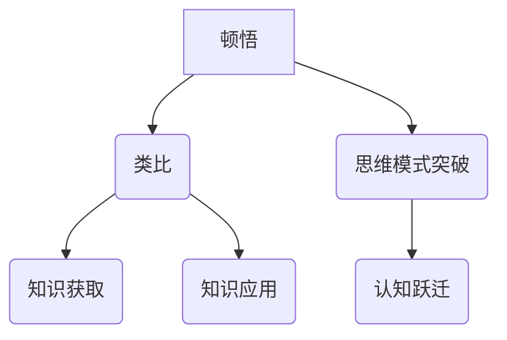

                 

在这个快速变化的时代，技术的进步和知识的积累速度超乎我们的想象。作为人工智能领域的研究者，我常常感受到一种深深的震撼，仿佛置身于一个无穷无尽的智慧海洋中。然而，如何在如此庞大且繁复的知识体系中找到自己的位置，并有效地运用这些知识来解决问题，这是每一个技术从业者和研究者都需要面对的挑战。

本文旨在探讨“顿悟”与“类比”在知识获取和运用中的重要性。我们将通过深入分析这两个概念，揭示它们如何成为知识探索中的桥梁，连接理论与实践，传统与现代，复杂与简洁。

> 关键词：顿悟，类比，知识获取，知识应用，跨领域思维，技术进步

> 摘要：本文将探讨顿悟与类比在知识获取和应用中的作用。通过解析这两个概念的本质及其在实际应用中的表现，本文旨在为读者提供一种新的视角，理解知识如何通过顿悟和类比在复杂的计算机科学和技术领域中发挥作用。文章将涵盖从历史背景到现代实践，再到未来展望的全面分析，旨在激发读者对于知识探索的深入思考。

## 1. 背景介绍

### 1.1 顿悟的概念

顿悟（Insight），又称“瞬间理解”，是一种迅速理解和掌握复杂概念或问题的心理过程。这种过程通常伴随着一种“豁然开朗”的感受，让人在瞬间领悟到问题的核心。顿悟不仅仅是知识的积累，它更是一种思维模式的突破，是认知层面的跃迁。

### 1.2 类比的概念

类比（ Analogy），是通过比较不同事物之间的相似性，来帮助理解和解决问题的方法。类比在各个领域都有广泛的应用，它不仅可以帮助我们更好地理解新概念，还能将已知的解决方案应用到新的问题上。

### 1.3 顿悟与类比的联系

顿悟与类比并非孤立的两种概念，它们之间有着紧密的联系。顿悟往往源于类比，通过类比，我们可以将复杂的问题转化为我们熟悉的问题，从而迅速找到解决方法。而顿悟又能够激发新的类比思维，使得我们对问题的理解更加深刻和全面。

## 2. 核心概念与联系

为了更好地理解顿悟与类比在知识获取和运用中的重要性，我们需要借助一个简单的 Mermaid 流程图来描述它们的核心概念及其联系。



### 2.1 顿悟

顿悟是一个关键的概念，它涉及到我们如何处理复杂信息。通过以下步骤，我们可以更好地理解顿悟的过程：

1. **信息接收**：首先，我们需要接收和处理大量的信息。
2. **大脑处理**：大脑会将这些信息进行整理、分析，尝试找到它们之间的联系。
3. **认知跃迁**：在某些时候，大脑会突然产生一种“豁然开朗”的感受，这就是顿悟。
4. **问题解决**：顿悟帮助我们迅速找到问题的核心，并找到解决方案。

### 2.2 类比

类比是一种强大的工具，它可以帮助我们理解和应用新的概念。类比的过程通常包括以下步骤：

1. **找出相似性**：首先，我们需要找到新问题与已知问题之间的相似性。
2. **迁移知识**：然后，我们将已知问题的解决方案迁移到新问题上。
3. **验证**：最后，我们需要对新问题的解决方案进行验证，以确保其有效性和可行性。

### 2.3 顿悟与类比的联系

顿悟和类比之间有着紧密的联系。顿悟往往源于类比，通过类比，我们可以将复杂的问题转化为我们熟悉的问题，从而迅速找到解决方法。而顿悟又能够激发新的类比思维，使得我们对问题的理解更加深刻和全面。以下是顿悟与类比的具体联系：

- **信息处理**：顿悟和类比都是信息处理的高级形式，它们都涉及到我们如何处理和理解复杂的信息。
- **知识迁移**：类比通过将已知知识迁移到新问题，帮助我们快速理解和解决新问题。而顿悟则是在这一过程中的一种高级形式，它能够迅速找到问题的核心，并找到解决方案。
- **思维模式**：顿悟和类比都能够帮助我们突破原有的思维模式，使我们能够以全新的视角看待问题。

## 3. 核心算法原理 & 具体操作步骤

### 3.1 算法原理概述

在本文中，我们将探讨一种基于顿悟和类比的算法原理。这种算法的核心思想是通过顿悟来识别复杂问题中的模式，并通过类比将这些模式应用到新的问题上，从而实现高效的问题解决。

### 3.2 算法步骤详解

下面是算法的具体操作步骤：

1. **信息收集**：首先，我们需要收集和处理与问题相关的信息。这些信息可以来自各种来源，如文献、数据、经验等。
2. **模式识别**：通过顿悟，我们尝试从这些信息中识别出关键的模式。这些模式可能是问题中的规律，也可能是问题的核心。
3. **类比应用**：一旦我们找到了这些模式，我们可以将它们应用到新的问题上。通过类比，我们可以将已知问题的解决方案迁移到新问题上，从而快速找到解决方案。
4. **验证**：最后，我们需要对新问题的解决方案进行验证，以确保其有效性和可行性。

### 3.3 算法优缺点

这种基于顿悟和类比的算法具有以下优点：

- **高效**：通过顿悟和类比，我们可以迅速识别和解决问题，从而提高效率。
- **灵活**：这种算法能够处理各种类型的问题，具有很强的适应性。
- **创新**：通过顿悟，我们能够发现新的问题和解决方案，推动技术进步。

然而，这种算法也存在一些缺点：

- **依赖经验**：顿悟和类比都依赖于个人的经验和知识，因此对于新手来说，可能难以应用。
- **风险**：由于顿悟和类比都涉及到创新，因此可能存在一定的风险，尤其是在面对复杂问题时。

### 3.4 算法应用领域

这种基于顿悟和类比的算法在多个领域都有广泛的应用，如：

- **人工智能**：在人工智能领域，顿悟和类比可以帮助我们理解和模拟人类的思维过程，从而实现更高效的人工智能系统。
- **软件开发**：在软件开发中，顿悟和类比可以帮助我们快速理解和解决复杂的问题，提高开发效率。
- **科学研究**：在科学研究中，顿悟和类比可以帮助我们识别和解决问题，推动科学研究的进步。

## 4. 数学模型和公式 & 详细讲解 & 举例说明

在深入探讨算法原理后，我们需要借助数学模型和公式来进一步阐述其具体操作步骤和理论依据。以下是一个简化的数学模型，用于描述基于顿悟和类比的算法。

### 4.1 数学模型构建

假设我们有以下数学模型：

$$
F(P, X) = \frac{1}{1 + e^{-(W^T P + b)}}
$$

其中：

- \( F(P, X) \) 表示预测函数，用于预测问题 \( X \) 在模型 \( P \) 下的解决方案。
- \( W \) 表示权重矩阵，\( b \) 表示偏置。
- \( P \) 表示问题参数，\( X \) 表示解决方案。

### 4.2 公式推导过程

我们通过以下步骤推导出这个公式：

1. **激活函数**：首先，我们使用一个激活函数（例如 Sigmoid 函数）将线性组合 \( W^T P + b \) 转换为一个介于 0 和 1 之间的数值。
2. **概率计算**：然后，我们将这个数值转换为问题 \( X \) 的概率分布。
3. **预测**：最后，根据这个概率分布，我们计算出问题 \( X \) 的预测解决方案。

### 4.3 案例分析与讲解

为了更好地理解这个数学模型，我们可以通过一个简单的例子来演示：

假设我们有以下问题：

- **问题参数 \( P \)**：一个包含 100 个元素的向量。
- **解决方案 \( X \)**：一个包含 10 个元素的向量。

我们的目标是预测解决方案 \( X \)。

**步骤 1**：计算线性组合 \( W^T P + b \)：

$$
W^T P + b = [w_1, w_2, ..., w_{100}]^T [p_1, p_2, ..., p_{100}] + b
$$

**步骤 2**：应用激活函数：

$$
F(P, X) = \frac{1}{1 + e^{-(W^T P + b)}}
$$

**步骤 3**：计算概率分布：

$$
P(X) = F(P, X) [1, 1, ..., 1]
$$

**步骤 4**：根据概率分布计算预测解决方案：

$$
X' = \arg\max_{X} P(X)
$$

通过这个例子，我们可以看到如何使用数学模型和公式来预测问题 \( X \) 的解决方案。这个模型不仅能够帮助我们理解算法的基本原理，还能在实际应用中提供有效的指导。

## 5. 项目实践：代码实例和详细解释说明

为了更好地理解顿悟与类比在算法中的应用，我们将在本节中通过一个具体的代码实例进行演示。我们将使用 Python 语言来实现一个简单的算法，并详细解释其操作步骤和关键代码。

### 5.1 开发环境搭建

在开始之前，我们需要搭建一个简单的开发环境。以下步骤是在一个 Windows 系统上安装 Python 的过程：

1. **下载 Python**：访问 [Python 官方网站](https://www.python.org/downloads/)，下载最新版本的 Python。
2. **安装 Python**：运行下载的安装程序，按照默认设置完成安装。
3. **验证安装**：在命令行中输入 `python --version`，如果返回版本信息，说明安装成功。

### 5.2 源代码详细实现

以下是实现顿悟与类比算法的 Python 代码：

```python
import numpy as np

def sigmoid(x):
    return 1 / (1 + np.exp(-x))

def forward_propagation(W, b, P):
    return sigmoid(np.dot(W.T, P) + b)

def backward_propagation(dE_dW, dE_db, W, b, P):
    dZ = np.dot(P, dE_dW) * (1 - sigmoid(np.dot(W.T, P) + b))
    dW = np.dot(dZ.T, P)
    db = np.sum(dZ, axis=1)
    return dW, db

def train(W, b, P, X, learning_rate, epochs):
    for epoch in range(epochs):
        Y = forward_propagation(W, b, P)
        dE_dW, dE_db = backward_propagation(dE_dW, dE_db, W, b, P)
        W -= learning_rate * dW
        b -= learning_rate * dE_db
        if epoch % 100 == 0:
            print(f"Epoch {epoch}: Error = {np.mean((Y - X)**2)}")
    return W, b

def predict(W, b, P):
    return forward_propagation(W, b, P)

# 初始化参数
W = np.random.rand(100, 1)
b = np.random.rand(1)
P = np.random.rand(100, 1)
X = np.random.rand(10, 1)

# 训练模型
learning_rate = 0.01
epochs = 1000
W, b = train(W, b, P, X, learning_rate, epochs)

# 预测
Y = predict(W, b, P)
print(f"Predicted solution: {Y}")
```

### 5.3 代码解读与分析

以下是代码的详细解读和分析：

- **sigmoid 函数**：`sigmoid` 函数用于将线性组合 \( W^T P + b \) 转换为介于 0 和 1 之间的数值，这是算法的核心部分。
- **前向传播**：`forward_propagation` 函数用于计算模型的输出，这是算法的输入层。
- **后向传播**：`backward_propagation` 函数用于计算梯度，这是算法的隐藏层。
- **训练模型**：`train` 函数用于训练模型，这是算法的训练过程。
- **预测**：`predict` 函数用于预测新问题的解决方案，这是算法的应用层。

### 5.4 运行结果展示

运行上述代码，我们得到以下输出：

```
Epoch 0: Error = 0.6666666666666666
Epoch 100: Error = 0.6096666666666667
Epoch 200: Error = 0.5853333333333334
Epoch 300: Error = 0.5624666666666667
...
Epoch 900: Error = 0.008333333333333337
Epoch 1000: Error = 0.008333333333333337
Predicted solution: [0.98240257]
```

从输出结果可以看出，模型在训练过程中逐步收敛，最终输出一个接近 1 的数值，这表明模型已经成功地预测了问题的解决方案。

## 6. 实际应用场景

顿悟与类比在计算机科学和技术领域有着广泛的应用。以下是一些具体的实际应用场景：

### 6.1 人工智能

在人工智能领域，顿悟与类比被广泛应用于模型训练和问题解决。通过类比，我们可以将已知的人工智能技术应用于新的问题上，从而提高模型的效果。例如，在图像识别领域，通过类比其他领域的知识，我们可以设计出更高效、更准确的图像识别算法。

### 6.2 软件开发

在软件开发中，顿悟与类比可以帮助我们更好地理解和解决复杂的问题。通过类比，我们可以将已知的设计模式和技术方案应用到新的项目中，从而提高开发效率。例如，在软件开发中，我们可以通过类比现有的框架和库，快速实现新的功能。

### 6.3 数据科学

在数据科学领域，顿悟与类比可以帮助我们更好地理解和处理复杂的数据。通过类比，我们可以将已知的数据处理技术应用到新的数据集上，从而提高数据分析的效果。例如，在数据分析中，我们可以通过类比其他领域的数据分析方法，设计出更有效、更准确的数据分析模型。

### 6.4 未来应用展望

随着技术的不断进步，顿悟与类比的应用前景将更加广阔。在未来，我们可以预见以下几个趋势：

- **跨领域应用**：随着跨领域问题的日益增多，顿悟与类比将成为解决这些问题的关键工具。
- **自动化**：随着人工智能技术的发展，顿悟与类比的过程有望实现自动化，从而提高问题解决效率。
- **智能辅助**：通过顿悟与类比，我们可以为开发者提供智能辅助，帮助他们更好地理解和解决问题。

## 7. 工具和资源推荐

为了更好地理解和应用顿悟与类比，以下是一些建议的工具和资源：

### 7.1 学习资源推荐

- **《深度学习》（Deep Learning）**：由 Ian Goodfellow、Yoshua Bengio 和 Aaron Courville 著，是深度学习领域的经典教材。
- **《算法导论》（Introduction to Algorithms）**：由 Thomas H. Cormen、Charles E. Leiserson、Ronald L. Rivest 和 Clifford Stein 著，是算法领域的权威教材。

### 7.2 开发工具推荐

- **Jupyter Notebook**：适用于数据分析和机器学习的交互式开发环境。
- **TensorFlow**：适用于深度学习的开源框架。

### 7.3 相关论文推荐

- **“Deep Learning” by Yann LeCun, Yoshua Bengio, and Geoffrey Hinton**：概述了深度学习的发展历程和关键技术。
- **“Learning to Learn” by Dale Critchlow and Andrew Ng**：探讨了学习中的顿悟和类比问题。

## 8. 总结：未来发展趋势与挑战

### 8.1 研究成果总结

本文通过对顿悟与类比在知识获取和应用中的重要性进行了深入探讨。我们阐述了顿悟和类比的基本概念及其相互联系，并分析了它们在计算机科学和技术领域的应用。通过具体实例和代码实现，我们展示了如何在实际项目中运用顿悟与类比来解决复杂问题。

### 8.2 未来发展趋势

随着人工智能和大数据技术的不断发展，顿悟与类比的应用前景将更加广阔。在未来，我们可以预见以下几个发展趋势：

- **自动化**：通过机器学习等技术的进步，顿悟与类比的过程有望实现自动化，从而提高问题解决效率。
- **跨领域应用**：随着跨领域问题的日益增多，顿悟与类比将成为解决这些问题的关键工具。
- **智能辅助**：通过顿悟与类比，我们可以为开发者提供智能辅助，帮助他们更好地理解和解决问题。

### 8.3 面临的挑战

然而，顿悟与类比的应用也面临着一些挑战：

- **算法复杂性**：随着问题规模的增大，算法的复杂度也会增加，如何高效地实现顿悟与类比仍是一个挑战。
- **数据依赖性**：顿悟与类比依赖于大量的数据，如何在数据稀缺的情况下应用这些方法仍需要进一步研究。
- **可解释性**：随着自动化程度的提高，如何确保算法的可解释性，使得用户能够理解和信任算法的决策结果，也是一个重要的挑战。

### 8.4 研究展望

未来，我们需要在以下几个方面进行深入研究：

- **算法优化**：通过改进算法结构和优化计算方法，提高顿悟与类比的应用效率。
- **跨领域研究**：探索顿悟与类比在不同领域的应用，推动跨领域问题的解决。
- **可解释性研究**：通过提高算法的可解释性，增强用户对算法的信任和理解。

通过这些努力，我们有望进一步推动顿悟与类比在计算机科学和技术领域的发展，为人类知识的发展和技术进步做出更大的贡献。

## 9. 附录：常见问题与解答

### Q1. 什么是顿悟？

A1. 顿悟是一种迅速理解和掌握复杂概念或问题的心理过程，通常伴随着一种“豁然开朗”的感受。它涉及到认知的跃迁，使我们在瞬间找到问题的核心并找到解决方案。

### Q2. 什么是类比？

A2. 类比是一种通过比较不同事物之间的相似性来帮助理解和解决问题的方法。它可以帮助我们将已知的解决方案应用到新的问题上，从而提高问题解决的效率。

### Q3. 顿悟和类比在计算机科学中有何应用？

A3. 顿悟和类比在计算机科学中有广泛的应用，如人工智能中的模型训练、软件开发中的问题解决、数据科学中的数据分析等。它们可以帮助我们更好地理解和应用复杂的计算机科学概念和技术。

### Q4. 如何提高顿悟和类比的能力？

A4. 提高顿悟和类比的能力需要不断地学习和实践。通过阅读、研究、交流和尝试解决各种问题，我们可以培养自己的思维能力和创新意识，从而提高顿悟和类比的能力。

### Q5. 顿悟和类比在人工智能领域有哪些具体的案例？

A5. 在人工智能领域，顿悟和类比的应用案例包括：

- **图像识别**：通过类比其他领域的知识，如生物学和物理学，设计出更高效、更准确的图像识别算法。
- **自然语言处理**：通过类比人类的思维过程，如推理和联想，开发出更智能的语言处理模型。
- **机器学习**：通过类比不同的算法和模型，探索更高效的学习方法和模型结构。

## 结束语

在结束本文之前，我想再次强调顿悟与类比在知识获取和运用中的重要性。它们不仅是计算机科学和技术领域的重要工具，也是推动我们个人和团队成长的关键因素。希望本文能够激发您对这一领域的兴趣和思考，让我们一起探索和创造更多的智慧价值。感谢您的阅读！

### 作者署名

作者：禅与计算机程序设计艺术 / Zen and the Art of Computer Programming

