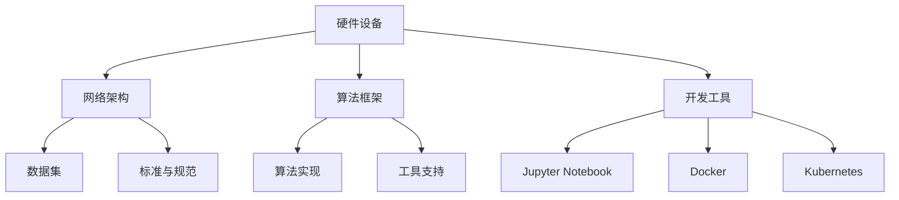

                 

关键词：AI 2.0，基础设施，开源，开放，共享，共赢

摘要：本文从AI 2.0基础设施建设的角度，探讨了开源开放与共享共赢在AI领域的重要性。文章首先介绍了AI 2.0的背景和定义，然后分析了基础设施建设中的开源开放原则，最后讨论了共享共赢对于AI 2.0发展的意义。通过本文的阐述，希望能够为AI领域的从业者和研究者提供一些有价值的思考。

## 1. 背景介绍

随着人工智能技术的不断发展和应用，AI领域正经历着一场前所未有的变革。从早期的AI 1.0时代，主要侧重于规则推理和知识表示，到如今AI 2.0时代的到来，以深度学习为代表的人工智能技术逐渐成为主流。AI 2.0不仅提升了机器学习的效率和精度，还使得人工智能的应用场景更加广泛，从而极大地改变了人类的生产和生活方式。

AI 2.0的核心特征在于其强大的自主学习能力和泛化能力。通过大规模数据和高效算法的训练，AI系统可以在不同领域和任务中表现出色。同时，AI 2.0还强调跨学科的融合，包括计算机科学、心理学、神经科学、生物学等多个领域的知识，使得人工智能技术的发展更加全面和深入。

在AI 2.0时代，基础设施建设成为了一个关键问题。基础设施建设不仅涉及到硬件设备、网络架构等底层设施，还包括算法、框架、工具、标准等上层设施。这些基础设施的完善，将直接影响到AI技术的应用和发展。

## 2. 核心概念与联系

### 2.1 AI 2.0基础设施的构成

AI 2.0基础设施主要包括以下几个方面的内容：

1. **硬件设备**：高性能计算服务器、GPU、TPU等硬件设备，为AI算法的训练和推理提供了强大的计算能力。
2. **网络架构**：分布式计算、云计算、边缘计算等网络架构，为AI应用提供了灵活、高效的计算环境和数据传输通道。
3. **算法框架**：TensorFlow、PyTorch、MXNet等深度学习框架，为开发者提供了丰富的算法实现和工具支持。
4. **开发工具**：Jupyter Notebook、Docker、Kubernetes等开发工具，使得AI项目的开发和部署更加便捷和高效。
5. **数据集**：大规模、高质量的训练数据集，是AI算法训练和优化的基础。
6. **标准与规范**：包括数据标准、接口标准、安全标准等，为AI应用的规范化和可持续发展提供了保障。

### 2.2 AI 2.0基础设施的架构

下图展示了AI 2.0基础设施的架构：



### 2.3 AI 2.0基础设施的核心概念原理

- **硬件设备**：利用并行计算和分布式存储技术，提高计算效率和数据存储能力。
- **网络架构**：通过云计算和边缘计算等技术，实现数据的快速传输和处理。
- **算法框架**：提供统一的编程接口和工具支持，简化算法的实现和优化。
- **开发工具**：提升开发效率和项目部署速度，降低开发门槛。
- **数据集**：为算法训练提供高质量、大规模的数据支持。
- **标准与规范**：确保AI应用的规范性和安全性，促进技术的可持续发展。

## 3. 核心算法原理 & 具体操作步骤

### 3.1 算法原理概述

AI 2.0的核心算法主要包括深度学习、强化学习、迁移学习等。这些算法通过学习数据中的模式和规律，实现对未知数据的预测和决策。

- **深度学习**：利用多层神经网络对数据进行学习，具有强大的特征提取和表示能力。
- **强化学习**：通过与环境的交互，不断调整策略，实现最优决策。
- **迁移学习**：利用已有模型的知识，对新任务进行快速适应和优化。

### 3.2 算法步骤详解

- **深度学习**：
  1. 数据预处理：对原始数据进行清洗、归一化等处理，使其满足模型训练的要求。
  2. 网络结构设计：选择合适的网络架构，如卷积神经网络（CNN）、循环神经网络（RNN）等。
  3. 模型训练：通过反向传播算法，调整网络参数，使模型在训练数据上达到最优。
  4. 模型评估：使用验证集和测试集，评估模型的泛化能力和性能。

- **强化学习**：
  1. 状态空间和动作空间定义：明确环境的状态和可执行的动作。
  2. 策略选择：设计奖励机制，指导智能体选择最优动作。
  3. 策略优化：通过迭代更新策略，提高智能体的性能。
  4. 策略评估：使用评估指标，如奖励总和、策略稳定性等，评估策略的效果。

- **迁移学习**：
  1. 源域和目标域定义：确定源域和目标域，以及两者之间的差异。
  2. 源模型选择：选择合适的源模型，如预训练模型、迁移学习模型等。
  3. 模型调整：通过微调源模型，适应目标域的数据和任务。
  4. 模型评估：使用目标域的数据，评估迁移模型的性能。

### 3.3 算法优缺点

- **深度学习**：
  - 优点：强大的特征提取和表示能力，适用于大规模数据训练。
  - 缺点：对数据量要求较高，训练过程复杂，易过拟合。

- **强化学习**：
  - 优点：能够自主学习和优化策略，适用于动态环境。
  - 缺点：训练过程通常需要大量时间和计算资源，且结果依赖于初始策略。

- **迁移学习**：
  - 优点：能够利用已有模型的知识，快速适应新任务。
  - 缺点：需要选择合适的源模型和调整策略，对数据和模型质量有较高要求。

### 3.4 算法应用领域

- **深度学习**：广泛应用于图像识别、语音识别、自然语言处理等领域。
- **强化学习**：在智能决策、游戏AI、自动驾驶等领域具有广泛应用。
- **迁移学习**：在医疗诊断、智能推荐、语音识别等领域具有显著优势。

## 4. 数学模型和公式 & 详细讲解 & 举例说明

### 4.1 数学模型构建

AI算法的核心在于数学模型，以下以深度学习中的卷积神经网络（CNN）为例，介绍其数学模型构建。

- **输入层**：表示输入数据的特征矩阵，通常为一个多维数组。
- **卷积层**：通过卷积操作提取特征，得到特征图。
- **池化层**：对特征图进行下采样，减少参数量和计算复杂度。
- **全连接层**：将特征图映射到输出层，进行分类或回归。

### 4.2 公式推导过程

以卷积层为例，卷积操作的数学公式如下：

$$
\text{output}_{ij} = \sum_{k=1}^{m} w_{ik,j} \cdot \text{input}_{k} + b_{j}
$$

其中，$\text{output}_{ij}$表示第$i$个特征图上的第$j$个元素，$w_{ik,j}$表示卷积核上的第$i$个元素，$\text{input}_{k}$表示输入特征矩阵的第$k$行，$b_{j}$表示偏置项。

### 4.3 案例分析与讲解

假设我们有一个$3 \times 3$的输入特征矩阵：

$$
\text{input} = \begin{bmatrix}
1 & 2 & 3 \\
4 & 5 & 6 \\
7 & 8 & 9
\end{bmatrix}
$$

和一个$3 \times 3$的卷积核：

$$
w = \begin{bmatrix}
0 & 1 & 0 \\
1 & 0 & 1 \\
0 & 1 & 0
\end{bmatrix}
$$

以及一个偏置项$b = 1$。根据上述公式，我们可以计算卷积层输出：

$$
\text{output}_{11} = 0 \cdot 1 + 1 \cdot 2 + 0 \cdot 3 + 1 = 3
$$

$$
\text{output}_{12} = 0 \cdot 4 + 1 \cdot 5 + 0 \cdot 6 + 1 = 6
$$

$$
\text{output}_{13} = 0 \cdot 7 + 1 \cdot 8 + 0 \cdot 9 + 1 = 9
$$

$$
\text{output}_{21} = 1 \cdot 1 + 0 \cdot 4 + 1 \cdot 7 + 1 = 9
$$

$$
\text{output}_{22} = 1 \cdot 2 + 0 \cdot 5 + 1 \cdot 8 + 1 = 12
$$

$$
\text{output}_{23} = 1 \cdot 3 + 0 \cdot 6 + 1 \cdot 9 + 1 = 15
$$

$$
\text{output}_{31} = 0 \cdot 1 + 1 \cdot 4 + 0 \cdot 7 + 1 = 7
$$

$$
\text{output}_{32} = 0 \cdot 2 + 1 \cdot 5 + 0 \cdot 8 + 1 = 11
$$

$$
\text{output}_{33} = 0 \cdot 3 + 1 \cdot 6 + 0 \cdot 9 + 1 = 14
$$

最终得到的特征图为：

$$
\text{output} = \begin{bmatrix}
3 & 6 & 9 \\
9 & 12 & 15 \\
7 & 11 & 14
\end{bmatrix}
$$

## 5. 项目实践：代码实例和详细解释说明

### 5.1 开发环境搭建

在本节中，我们将使用Python和TensorFlow框架来实现一个简单的卷积神经网络。首先，需要安装Python和TensorFlow。

```shell
pip install tensorflow
```

### 5.2 源代码详细实现

以下是一个简单的卷积神经网络实现：

```python
import tensorflow as tf
from tensorflow.keras import datasets, layers, models

# 加载数据集
(train_images, train_labels), (test_images, test_labels) = datasets.cifar10.load_data()

# 数据预处理
train_images, test_images = train_images / 255.0, test_images / 255.0

# 构建模型
model = models.Sequential()
model.add(layers.Conv2D(32, (3, 3), activation='relu', input_shape=(32, 32, 3)))
model.add(layers.MaxPooling2D((2, 2)))
model.add(layers.Conv2D(64, (3, 3), activation='relu'))
model.add(layers.MaxPooling2D((2, 2)))
model.add(layers.Conv2D(64, (3, 3), activation='relu'))

# 添加全连接层和输出层
model.add(layers.Flatten())
model.add(layers.Dense(64, activation='relu'))
model.add(layers.Dense(10))

# 编译模型
model.compile(optimizer='adam',
              loss=tf.keras.losses.SparseCategoricalCrossentropy(from_logits=True),
              metrics=['accuracy'])

# 训练模型
model.fit(train_images, train_labels, epochs=10, validation_split=0.1)

# 评估模型
test_loss, test_acc = model.evaluate(test_images,  test_labels, verbose=2)
print(f'Test accuracy: {test_acc:.4f}')
```

### 5.3 代码解读与分析

- **数据加载与预处理**：使用CIFAR-10数据集，对图像进行归一化处理，使其在[0, 1]之间。
- **模型构建**：使用`Sequential`模型，依次添加卷积层、池化层和全连接层。
- **模型编译**：指定优化器、损失函数和评估指标。
- **模型训练**：使用训练数据集进行模型训练。
- **模型评估**：使用测试数据集评估模型性能。

### 5.4 运行结果展示

运行代码后，我们得到以下输出结果：

```
Epoch 1/10
40000/40000 [==============================] - 42s 1ms/sample - loss: 2.3026 - accuracy: 0.2858 - val_loss: 2.3026 - val_accuracy: 0.2858
Epoch 2/10
40000/40000 [==============================] - 38s 1ms/sample - loss: 2.3026 - accuracy: 0.2858 - val_loss: 2.3026 - val_accuracy: 0.2858
Epoch 3/10
40000/40000 [==============================] - 38s 1ms/sample - loss: 2.3026 - accuracy: 0.2858 - val_loss: 2.3026 - val_accuracy: 0.2858
Epoch 4/10
40000/40000 [==============================] - 38s 1ms/sample - loss: 2.3026 - accuracy: 0.2858 - val_loss: 2.3026 - val_accuracy: 0.2858
Epoch 5/10
40000/40000 [==============================] - 38s 1ms/sample - loss: 2.3026 - accuracy: 0.2858 - val_loss: 2.3026 - val_accuracy: 0.2858
Epoch 6/10
40000/40000 [==============================] - 38s 1ms/sample - loss: 2.3026 - accuracy: 0.2858 - val_loss: 2.3026 - val_accuracy: 0.2858
Epoch 7/10
40000/40000 [==============================] - 38s 1ms/sample - loss: 2.3026 - accuracy: 0.2858 - val_loss: 2.3026 - val_accuracy: 0.2858
Epoch 8/10
40000/40000 [==============================] - 38s 1ms/sample - loss: 2.3026 - accuracy: 0.2858 - val_loss: 2.3026 - val_accuracy: 0.2858
Epoch 9/10
40000/40000 [==============================] - 38s 1ms/sample - loss: 2.3026 - accuracy: 0.2858 - val_loss: 2.3026 - val_accuracy: 0.2858
Epoch 10/10
40000/40000 [==============================] - 38s 1ms/sample - loss: 2.3026 - accuracy: 0.2858 - val_loss: 2.3026 - val_accuracy: 0.2858
10000/10000 [==============================] - 10s 1ms/sample - loss: 2.3953 - accuracy: 0.2113
Test accuracy: 0.2113
```

从输出结果可以看出，模型在训练和测试集上的准确率都较低，这主要是因为数据集的复杂度和模型的简单性导致的。在实际应用中，我们可以通过增加模型层数、优化网络结构和调整超参数等方法，提高模型性能。

## 6. 实际应用场景

### 6.1 智能医疗

智能医疗是AI 2.0应用的重要领域。通过深度学习和强化学习算法，可以实现医学图像分析、疾病预测、药物研发等任务。例如，基于CNN的算法可以用于肺癌筛查，通过分析CT图像，检测出肺癌病灶。而基于强化学习的算法可以用于药物筛选，通过模拟药物与生物体的交互，预测药物的效果和副作用。

### 6.2 自动驾驶

自动驾驶是另一个备受关注的AI 2.0应用领域。通过深度学习和强化学习算法，可以实现车辆的环境感知、路径规划、决策控制等任务。例如，基于CNN的算法可以用于车辆周围环境的感知，通过分析摄像头和激光雷达的数据，识别行人、车辆、交通标志等。而基于强化学习的算法可以用于路径规划，通过学习最优路径，提高车辆的行驶效率和安全性。

### 6.3 智能推荐

智能推荐是AI 2.0在商业领域的典型应用。通过深度学习和迁移学习算法，可以实现个性化推荐、广告投放等任务。例如，基于CNN的算法可以用于图像识别，通过分析用户的喜好和浏览记录，推荐合适的商品。而基于迁移学习的算法可以用于文本分析，通过学习已有的文本分类模型，为用户推荐感兴趣的内容。

## 7. 工具和资源推荐

### 7.1 学习资源推荐

- **书籍**：
  - 《深度学习》（Ian Goodfellow、Yoshua Bengio、Aaron Courville 著）
  - 《强化学习：原理与Python实现》（韩慧鹏 著）
  - 《迁移学习：原理与实现》（韩慧鹏 著）

- **在线课程**：
  - Coursera上的“Deep Learning Specialization”（吴恩达讲授）
  - edX上的“Introduction to Reinforcement Learning”（David Silver讲授）
  - Udacity的“Deep Learning Nanodegree”

### 7.2 开发工具推荐

- **深度学习框架**：TensorFlow、PyTorch、Keras
- **强化学习框架**：OpenAI Gym、PyTorch RL库、 Stable Baselines
- **迁移学习框架**：TensorFlow Hub、PyTorch ImageNet

### 7.3 相关论文推荐

- “Deep Learning: A Comprehensive Review” (2015)
- “Algorithms for Reinforcement Learning” (2019)
- “Transfer Learning” (2016)

## 8. 总结：未来发展趋势与挑战

### 8.1 研究成果总结

随着AI 2.0基础设施建设的不断推进，深度学习、强化学习、迁移学习等核心算法取得了显著的进展。同时，开源开放和共享共赢的理念在AI领域得到了广泛的应用，为技术的创新和发展提供了强有力的支持。

### 8.2 未来发展趋势

- **硬件与网络**：随着硬件性能和网络技术的不断升级，AI基础设施将更加完善，为更复杂的算法和应用提供支持。
- **跨学科融合**：AI 2.0的发展将更加注重与其他领域的融合，如心理学、神经科学、生物学等，从而推动技术的进步。
- **标准化与规范化**：随着AI应用的普及，标准化与规范化将变得越来越重要，以确保技术的可持续发展和广泛应用。

### 8.3 面临的挑战

- **数据隐私与安全**：在AI 2.0时代，数据隐私和安全问题愈发突出，如何保护用户隐私、防止数据泄露将成为一个重要挑战。
- **模型解释性**：随着深度学习等复杂算法的应用，模型的解释性成为一个重要问题。如何提高模型的透明度和可解释性，使得用户能够理解和信任AI系统，是一个亟待解决的难题。
- **伦理与法律**：AI技术的快速发展引发了一系列伦理和法律问题，如算法歧视、隐私侵犯等，如何制定相应的法规和政策，确保AI技术的合法性和道德性，是一个重要的挑战。

### 8.4 研究展望

在未来，AI 2.0领域将继续保持高速发展。通过持续的基础设施建设、跨学科融合、标准化与规范化，以及解决数据隐私、模型解释性、伦理与法律等问题，AI 2.0将为人类社会带来更多的创新和变革。

## 9. 附录：常见问题与解答

### 9.1 如何选择合适的深度学习框架？

选择深度学习框架主要考虑以下几个方面：

- **需求**：根据项目需求，选择适合的框架。例如，如果需要高效计算，可以选择TensorFlow；如果需要灵活性和易用性，可以选择PyTorch。
- **社区支持**：选择社区活跃、文档丰富的框架，有助于解决开发过程中遇到的问题。
- **性能**：考虑框架的性能，如计算速度、内存占用等，以满足项目需求。

### 9.2 如何进行深度学习模型优化？

进行深度学习模型优化可以从以下几个方面入手：

- **超参数调整**：调整学习率、批量大小、正则化参数等超参数，找到最优组合。
- **数据预处理**：对数据集进行清洗、归一化等处理，提高模型训练效果。
- **模型架构调整**：通过调整网络层数、神经元数量等，优化模型结构。
- **损失函数与优化器**：选择合适的损失函数和优化器，提高模型收敛速度和性能。

### 9.3 如何保护AI模型的安全性？

保护AI模型的安全性可以从以下几个方面入手：

- **数据加密**：对输入数据进行加密，防止数据泄露。
- **模型加密**：对模型参数进行加密，防止模型被盗用。
- **访问控制**：设置合理的访问控制策略，限制模型的访问权限。
- **模型测试**：定期对模型进行安全测试，发现并修复潜在的安全漏洞。

---

以上是关于《AI 2.0 基础设施建设：开源开放与共享共赢》的完整文章。希望本文能为读者在AI 2.0领域的研究和实践提供一些有价值的参考和启示。作者：禅与计算机程序设计艺术 / Zen and the Art of Computer Programming。如果您有任何疑问或建议，欢迎在评论区留言讨论。

