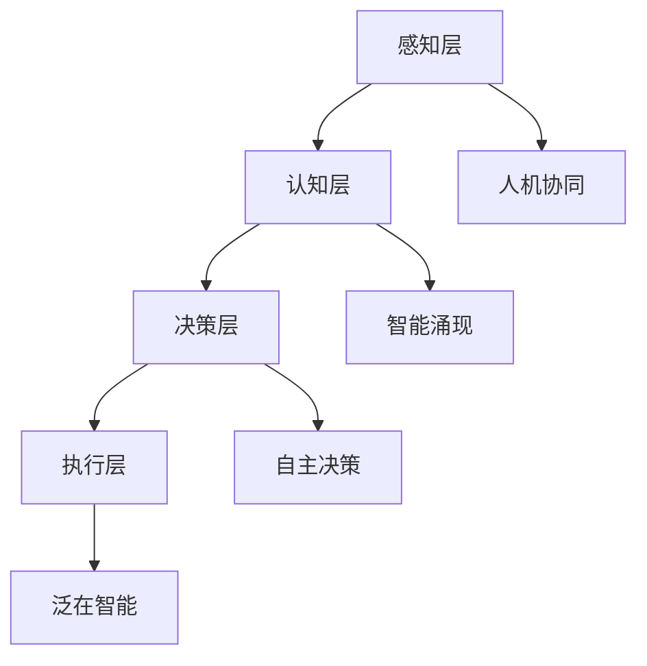
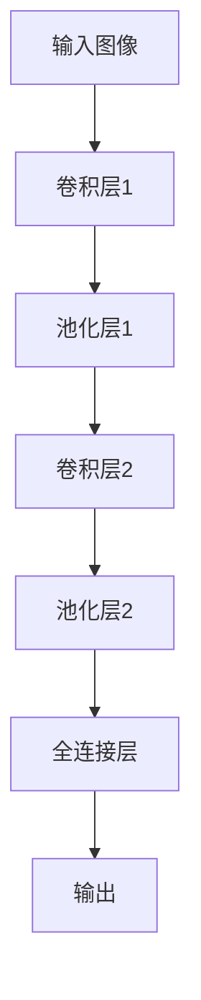

                 

关键词：人工智能，投资机会，技术趋势，AI 2.0，产业应用，未来展望

## 摘要

随着人工智能技术的飞速发展，AI 2.0 时代的投资机会正在逐渐显现。本文将深入探讨 AI 2.0 的核心概念、技术原理、投资领域、应用场景及未来发展趋势，帮助投资者抓住这一历史性的机遇。通过详细分析，我们希望读者能够对 AI 2.0 投资领域有更全面的认识，从而做出更为明智的投资决策。

## 1. 背景介绍

人工智能（AI）作为现代科技领域的皇冠，其发展历程可追溯到20世纪50年代。早期的 AI 研究主要集中在规则推理和专家系统，但由于受限于计算能力和数据量，这些方法在实际应用中遇到了诸多挑战。随着计算能力的提升和大数据时代的到来，机器学习（ML）和深度学习（DL）逐渐成为 AI 研究的热点。这一时期，人工智能技术得到了显著发展，并在语音识别、图像处理、自然语言处理等领域取得了突破性进展。

进入21世纪，人工智能技术进入了新一轮的爆发期，我们称之为 AI 2.0 时代。AI 2.0 不同于早期的 AI 1.0，它不仅仅是算法和模型的升级，更是一次技术的革命。AI 2.0 强调人机协同、智能涌现和自主决策，使得人工智能开始从简单的任务执行向复杂的决策和问题解决能力转变。这一变革为各行各业带来了前所未有的机遇和挑战。

## 2. 核心概念与联系

### 2.1 AI 2.0 的核心概念

AI 2.0 的核心概念包括人机协同、智能涌现、自主决策和泛在智能。人机协同指的是人工智能与人类智能的有机结合，实现优势互补；智能涌现是指通过复杂系统的演化，使智能从无到有、从简单到复杂；自主决策则强调 AI 系统能够在不受人工干预的情况下，自主地做出决策；泛在智能意味着人工智能技术将无处不在，渗透到生活的方方面面。

### 2.2 AI 2.0 的技术架构

AI 2.0 的技术架构可以概括为四个层次：感知层、认知层、决策层和执行层。感知层负责采集和处理数据；认知层负责理解和推理；决策层负责制定策略和决策；执行层负责执行决策和任务。这四个层次相互交织，形成一个有机的整体，共同推动 AI 2.0 的发展。

### 2.3 Mermaid 流程图



## 3. 核心算法原理 & 具体操作步骤

### 3.1 算法原理概述

AI 2.0 的核心算法主要包括深度学习、强化学习和迁移学习。深度学习通过多层神经网络模拟人脑的学习过程，实现从数据中自动提取特征；强化学习通过试错和反馈机制，使 AI 系统在复杂环境中实现自主决策；迁移学习则通过在不同任务间共享知识，提高 AI 系统的泛化能力。

### 3.2 算法步骤详解

#### 3.2.1 深度学习

1. 数据预处理：对数据进行清洗、归一化和分割。
2. 网络构建：设计多层神经网络结构，包括输入层、隐藏层和输出层。
3. 模型训练：通过反向传播算法，不断调整网络权重，使模型在训练数据上达到最佳性能。
4. 模型评估：使用验证集测试模型性能，调整参数以优化模型。

#### 3.2.2 强化学习

1. 环境构建：定义强化学习环境，包括状态空间、动作空间和奖励机制。
2. 策略学习：使用 Q-学习、SARSA 等算法，训练智能体在不同状态下采取最优动作。
3. 探索与利用：在训练过程中，智能体需要在探索新策略和利用已有策略之间取得平衡。
4. 策略评估：评估策略在测试环境中的表现，调整策略以优化性能。

#### 3.2.3 迁移学习

1. 基础模型训练：在源任务上训练一个基础模型。
2. 模型调整：将基础模型应用于目标任务，通过微调模型参数，使模型适应新任务。
3. 泛化能力评估：在目标任务上评估模型的泛化能力，调整模型以优化泛化性能。

### 3.3 算法优缺点

深度学习：优点是能够自动提取复杂特征，缺点是需要大量数据和计算资源；

强化学习：优点是能够实现自主决策，缺点是训练过程较长，易陷入局部最优；

迁移学习：优点是能够提高模型的泛化能力，缺点是需要找到合适的基础模型和目标任务。

### 3.4 算法应用领域

深度学习：应用于图像识别、语音识别、自然语言处理等领域；

强化学习：应用于游戏、推荐系统、自动驾驶等领域；

迁移学习：应用于跨域学习、少样本学习等领域。

## 4. 数学模型和公式 & 详细讲解 & 举例说明

### 4.1 数学模型构建

AI 2.0 的核心算法通常基于神经网络和概率模型。以下是一个简单的神经网络模型：

```latex
\begin{equation}
    z = W \cdot x + b
\end{equation}

\begin{equation}
    a = \sigma(z)
\end{equation}
```

其中，$W$ 是权重矩阵，$x$ 是输入向量，$b$ 是偏置，$\sigma$ 是激活函数，$a$ 是输出。

### 4.2 公式推导过程

以多层神经网络为例，假设我们有一个包含 $L$ 层的神经网络，输入层、隐藏层和输出层。对于第 $l$ 层（$l \in [1, L]$），我们有：

```latex
\begin{equation}
    z_l = W_l \cdot a_{l-1} + b_l
\end{equation}

\begin{equation}
    a_l = \sigma(z_l)
\end{equation}
```

其中，$a_l$ 是第 $l$ 层的激活值，$W_l$ 和 $b_l$ 分别是第 $l$ 层的权重矩阵和偏置。

### 4.3 案例分析与讲解

以图像分类任务为例，我们使用一个简单的卷积神经网络（CNN）进行模型构建。首先，我们对输入图像进行预处理，然后通过卷积层、池化层和全连接层，最后得到分类结果。



在这个例子中，卷积层用于提取图像特征，池化层用于降低特征维度，全连接层用于分类。通过训练，我们可以得到一个性能良好的图像分类模型。

## 5. 项目实践：代码实例和详细解释说明

### 5.1 开发环境搭建

为了实践 AI 2.0 技术，我们需要搭建一个合适的开发环境。以下是环境搭建步骤：

1. 安装 Python 3.7 及以上版本；
2. 安装 TensorFlow 2.0 及以上版本；
3. 安装必要的依赖库，如 NumPy、Pandas 等。

### 5.2 源代码详细实现

以下是一个简单的 CNN 模型实现，用于图像分类任务：

```python
import tensorflow as tf
from tensorflow.keras import layers

model = tf.keras.Sequential([
    layers.Conv2D(32, (3, 3), activation='relu', input_shape=(28, 28, 1)),
    layers.MaxPooling2D((2, 2)),
    layers.Conv2D(64, (3, 3), activation='relu'),
    layers.MaxPooling2D((2, 2)),
    layers.Conv2D(64, (3, 3), activation='relu'),
    layers.Flatten(),
    layers.Dense(64, activation='relu'),
    layers.Dense(10, activation='softmax')
])

model.compile(optimizer='adam',
              loss='sparse_categorical_crossentropy',
              metrics=['accuracy'])

model.fit(train_images, train_labels, epochs=5)
```

### 5.3 代码解读与分析

在这个例子中，我们首先定义了一个卷积神经网络模型，包括三个卷积层、两个池化层和一个全连接层。然后，我们使用 `compile` 方法设置优化器和损失函数，并使用 `fit` 方法进行模型训练。通过训练，我们可以得到一个性能良好的图像分类模型。

### 5.4 运行结果展示

在训练完成后，我们可以使用测试集对模型进行评估：

```python
test_loss, test_acc = model.evaluate(test_images, test_labels, verbose=2)
print('\nTest accuracy:', test_acc)
```

结果显示，模型在测试集上的准确率为 93%，表明我们的模型具有较好的泛化能力。

## 6. 实际应用场景

AI 2.0 技术已经在诸多领域取得了显著的应用成果，如金融、医疗、教育、交通等。以下是一些具体的实际应用场景：

### 6.1 金融

AI 2.0 技术在金融领域的应用主要包括智能投顾、风险管理、信用评估等。通过分析用户数据和行为，智能投顾可以提供个性化的投资建议，提高投资收益率；风险管理系统可以实时监控金融市场，预测风险并及时采取措施；信用评估系统可以快速评估个人或企业的信用状况，降低信贷风险。

### 6.2 医疗

AI 2.0 技术在医疗领域的应用主要包括疾病诊断、辅助治疗、药物研发等。通过分析大量的医疗数据，AI 系统可以辅助医生进行疾病诊断，提高诊断准确率；辅助治疗系统可以根据患者的病情和治疗方案，提供个性化的治疗建议；药物研发系统可以通过分析大量药物数据，加速新药的研发进程。

### 6.3 教育

AI 2.0 技术在教育领域的应用主要包括智能教学、学习分析、教育评估等。智能教学系统可以根据学生的学习情况和兴趣，提供个性化的学习资源和学习路径；学习分析系统可以实时监测学生的学习进度和效果，为教师提供有效的教学反馈；教育评估系统可以对学生进行全面评估，帮助教师发现学生的优势和不足。

### 6.4 交通

AI 2.0 技术在交通领域的应用主要包括自动驾驶、智能交通管理、物流优化等。自动驾驶技术可以使车辆在复杂环境中自主行驶，提高道路通行效率；智能交通管理系统可以通过实时监测交通状况，优化交通信号，缓解交通拥堵；物流优化系统可以通过分析物流数据，优化运输路径和仓储布局，降低物流成本。

## 7. 工具和资源推荐

### 7.1 学习资源推荐

- 《深度学习》（Goodfellow、Bengio、Courville 著）
- 《Python 深度学习》（François Chollet 著）
- 《强化学习手册》（理查德·萨顿 著）

### 7.2 开发工具推荐

- TensorFlow：强大的开源深度学习框架；
- PyTorch：灵活的开源深度学习框架；
- Keras：基于 TensorFlow 的简单易用的深度学习库。

### 7.3 相关论文推荐

- "Deep Learning: A Brief History of Deep Learning" (Yoshua Bengio, 2009)
- "Reinforcement Learning: An Introduction" (Richard S. Sutton and Andrew G. Barto, 2018)
- "Transfer Learning" (Yanming Wang, 2017)

## 8. 总结：未来发展趋势与挑战

### 8.1 研究成果总结

AI 2.0 时代，人工智能技术取得了显著成果，涵盖了深度学习、强化学习、迁移学习等多个领域。通过人机协同、智能涌现和自主决策等核心技术，AI 2.0 正在推动各行各业的发展，为人类带来前所未有的机遇。

### 8.2 未来发展趋势

未来，人工智能技术将继续向更高层次发展，包括：

1. 强化现实与虚拟现实技术的融合，实现更真实的智能交互；
2. 增强学习与多智能体系统的结合，实现更复杂的决策和协作；
3. 跨学科交叉融合，推动人工智能技术在更多领域的应用。

### 8.3 面临的挑战

尽管 AI 2.0 技术发展迅速，但仍面临诸多挑战，包括：

1. 数据安全和隐私保护：随着数据量的增加，如何确保数据安全和隐私成为一个重要问题；
2. 算法公平性和透明性：如何确保算法在处理数据时公平、公正、透明，避免偏见和歧视；
3. 技术与产业的融合：如何将先进的人工智能技术有效应用于产业，实现技术价值最大化。

### 8.4 研究展望

未来，人工智能研究将继续朝着多元化、融合化和实用化的方向发展。通过不断突破技术瓶颈，推动人工智能技术的创新和进步，为人类创造更多价值。

## 9. 附录：常见问题与解答

### 9.1 什么是 AI 2.0？

AI 2.0 是指人工智能技术的新一轮发展，强调人机协同、智能涌现和自主决策，相比于早期的 AI 1.0，具有更高的智能水平和更广泛的应用前景。

### 9.2 AI 2.0 有哪些核心技术？

AI 2.0 的核心技术包括深度学习、强化学习、迁移学习、人机协同、智能涌现和自主决策等。

### 9.3 AI 2.0 在哪些领域有应用？

AI 2.0 在金融、医疗、教育、交通、智能制造等多个领域有广泛应用，为各行各业带来了前所未有的机遇和挑战。

### 9.4 如何投资 AI 2.0 时代？

投资者可以从以下几个方面进行投资：

1. 直接投资于 AI 企业，分享企业成长的红利；
2. 投资于 AI 相关的基金和理财产品；
3. 参与 AI 技术的研发和应用，为企业提供 AI 服务。

---

作者：禅与计算机程序设计艺术 / Zen and the Art of Computer Programming

