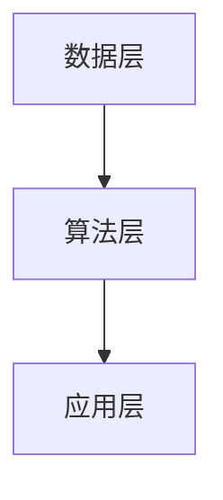

                 

关键词：人工智能、医疗健康、智能诊断、智能治疗、医疗数据、深度学习、神经网络、医疗影像、基因组学

摘要：本文将探讨AI 2.0时代的智能医疗，深入分析人工智能在医疗领域的应用，包括智能诊断、智能治疗、医疗数据管理等方面。我们将探讨核心算法原理，介绍数学模型和公式，并提供项目实践中的代码实例和解释。此外，我们还将探讨未来应用场景，推荐学习资源和开发工具，总结发展趋势与挑战，并展望未来的研究前景。

## 1. 背景介绍

医疗行业正经历一场革命，而这场革命的驱动力正是人工智能（AI）。随着计算能力的提升和数据的爆炸性增长，人工智能在医疗健康领域的应用变得日益广泛和深入。AI 2.0时代，我们见证了人工智能从规则驱动的初代系统向数据驱动和自适应的智能系统转变。

智能医疗的核心目标是利用人工智能技术来提高医疗服务的效率和质量。这包括但不限于智能诊断、个性化治疗、药物研发、医疗影像分析、基因组学数据解读等。通过这些应用，人工智能不仅能够帮助医生做出更准确的诊断，还能提供个性化的治疗方案，从而改善患者的治疗体验和健康结果。

智能医疗的应用场景涵盖了从临床诊断到健康管理的各个层面。在诊断方面，人工智能可以通过分析影像数据、电子健康记录和基因组数据来辅助医生做出诊断。在治疗方面，人工智能可以帮助制定个性化的治疗计划，优化治疗方案。在药物研发方面，人工智能可以加速新药的研发过程，提高药物的成功率。此外，人工智能还可以在公共卫生、健康教育和健康管理等领域发挥作用。

## 2. 核心概念与联系

### 2.1 人工智能与医疗健康的关系

人工智能与医疗健康的关系可以理解为一种“智能辅助”的作用。人工智能系统通过处理和分析大量的医疗数据，为医生提供辅助决策，从而提高诊断和治疗的准确性。具体来说，人工智能在医疗健康领域的核心概念包括：

- **数据驱动**：人工智能依赖于大量的医疗数据来进行训练和优化。这些数据包括电子健康记录、基因组数据、医疗影像等。

- **机器学习**：机器学习是实现人工智能的关键技术。通过机器学习算法，人工智能系统能够从数据中学习，并做出准确的预测和决策。

- **深度学习**：深度学习是机器学习的一种形式，它在医疗健康领域有着广泛的应用。深度学习模型通过多层神经网络结构，能够处理复杂的医疗数据，并提取出有用的特征。

- **自然语言处理**：自然语言处理（NLP）技术在医疗健康领域也非常重要，它可以帮助人工智能系统理解和处理医疗文本数据，如病历、医疗报告等。

### 2.2 人工智能在医疗健康领域的架构

人工智能在医疗健康领域的架构可以分为以下几个层次：

- **数据层**：这是人工智能系统的数据来源，包括电子健康记录、基因组数据、医疗影像等。

- **算法层**：这是人工智能系统的核心，包括机器学习算法、深度学习算法、自然语言处理算法等。

- **应用层**：这是人工智能系统的具体应用，如智能诊断、个性化治疗、药物研发等。

下面是一个简单的 Mermaid 流程图，展示了人工智能在医疗健康领域的基本架构：



## 3. 核心算法原理 & 具体操作步骤

### 3.1  算法原理概述

在智能医疗领域，常用的核心算法包括深度学习算法和机器学习算法。以下是这两种算法的基本原理概述：

- **深度学习算法**：深度学习算法是一种基于多层神经网络结构的机器学习算法。它通过模拟人脑神经网络的结构和工作原理，能够从大量数据中自动学习和提取特征，进行复杂的模式识别和预测。在智能医疗中，深度学习算法可以应用于医疗影像分析、基因组学数据解读、个性化治疗等领域。

- **机器学习算法**：机器学习算法是一种通过从数据中学习并做出预测或决策的算法。它通常包括监督学习、无监督学习和强化学习等类型。在智能医疗中，机器学习算法可以用于诊断预测、疾病风险评估、药物剂量优化等。

### 3.2  算法步骤详解

以深度学习算法为例，以下是智能医疗中常用的深度学习算法的具体步骤：

- **数据预处理**：首先，需要对医疗数据进行预处理，包括数据清洗、数据归一化、数据划分等。这一步骤的目的是确保数据的质量和一致性。

- **模型构建**：然后，需要构建深度学习模型。常见的深度学习模型包括卷积神经网络（CNN）、循环神经网络（RNN）、生成对抗网络（GAN）等。

- **模型训练**：使用预处理后的数据对深度学习模型进行训练。训练过程中，模型通过不断调整参数，以最小化预测误差。

- **模型评估**：在训练完成后，需要对模型进行评估。常用的评估指标包括准确率、召回率、F1分数等。

- **模型部署**：最后，将训练好的模型部署到实际应用中，如医疗诊断系统、药物研发平台等。

### 3.3  算法优缺点

- **深度学习算法**：优点包括强大的模式识别能力、自动特征提取、高准确率等。缺点包括对数据量大、模型复杂度高、训练时间较长等。

- **机器学习算法**：优点包括简单易用、计算效率高、对数据量要求较低等。缺点包括对特征工程依赖较大、模型可解释性较差等。

### 3.4  算法应用领域

深度学习算法和机器学习算法在智能医疗领域的应用非常广泛，包括但不限于：

- **医疗影像分析**：如肿瘤检测、骨折诊断、脑部疾病诊断等。

- **基因组学数据解读**：如基因突变检测、疾病风险评估、药物基因组学等。

- **疾病预测**：如传染病预测、心血管疾病预测、肿瘤复发预测等。

- **个性化治疗**：如个性化药物剂量、个性化治疗计划等。

## 4. 数学模型和公式 & 详细讲解 & 举例说明

### 4.1  数学模型构建

在智能医疗中，常用的数学模型包括线性回归、逻辑回归、支持向量机（SVM）等。以下是这些模型的构建过程：

- **线性回归模型**：线性回归模型假设因变量 \( Y \) 与自变量 \( X \) 之间存在线性关系，即 \( Y = \beta_0 + \beta_1 X \)。其中，\( \beta_0 \) 和 \( \beta_1 \) 是模型的参数，通过最小二乘法求解。

  $$ \min_{\beta_0, \beta_1} \sum_{i=1}^n (Y_i - (\beta_0 + \beta_1 X_i))^2 $$

- **逻辑回归模型**：逻辑回归模型用于处理二元分类问题，其目标函数是最大化似然函数。逻辑回归模型的公式为：

  $$ P(Y=1|X) = \frac{1}{1 + e^{-(\beta_0 + \beta_1 X)}} $$

  其中，\( \beta_0 \) 和 \( \beta_1 \) 是模型的参数，通过最大似然估计法求解。

- **支持向量机模型**：支持向量机模型是一种分类算法，其目标是找到一个最佳的超平面，将不同类别的数据点分隔开来。支持向量机的公式为：

  $$ w \cdot x + b = 0 $$

  其中，\( w \) 是超平面的法向量，\( x \) 是数据点，\( b \) 是偏置项。

### 4.2  公式推导过程

以下是逻辑回归模型的推导过程：

1. **假设**：假设数据集 \( D = \{ (x_1, y_1), (x_2, y_2), ..., (x_n, y_n) \} \)，其中 \( x_i \) 是自变量，\( y_i \) 是因变量。

2. **似然函数**：似然函数是数据集 \( D \) 的概率，可以表示为：

   $$ L(\theta) = \prod_{i=1}^n P(y_i|x_i; \theta) $$

   其中，\( \theta \) 是模型的参数。

3. **对数似然函数**：为了简化计算，我们通常使用对数似然函数：

   $$ \ln L(\theta) = \sum_{i=1}^n \ln P(y_i|x_i; \theta) $$

4. **梯度上升法**：为了最大化对数似然函数，我们可以使用梯度上升法。梯度上升法的公式为：

   $$ \theta := \theta + \alpha \frac{\partial}{\partial \theta} \ln L(\theta) $$

   其中，\( \alpha \) 是学习率。

5. **求解参数**：通过迭代计算，我们可以求解出模型的参数 \( \theta \)。

### 4.3  案例分析与讲解

以下是一个关于糖尿病预测的逻辑回归模型案例：

假设我们有一个数据集，包含病人的年龄、体重指数（BMI）、血糖值等特征，以及是否患有糖尿病的标签。我们的目标是使用逻辑回归模型预测病人是否患有糖尿病。

1. **数据预处理**：首先，我们需要对数据进行预处理，包括数据归一化和标签编码。

2. **模型构建**：然后，我们使用逻辑回归模型构建预测模型。

3. **模型训练**：使用训练数据对模型进行训练，求解出模型的参数。

4. **模型评估**：使用测试数据对模型进行评估，计算模型的准确率、召回率等指标。

5. **模型部署**：最后，将训练好的模型部署到实际应用中，如医院管理系统、健康APP等。

## 5. 项目实践：代码实例和详细解释说明

### 5.1  开发环境搭建

在本文的项目实践中，我们将使用 Python 语言和 TensorFlow 深度学习框架来实现一个基于深度学习的肿瘤检测模型。以下是开发环境的搭建步骤：

1. **安装 Python**：首先，我们需要安装 Python 3.7 或更高版本。

2. **安装 TensorFlow**：然后，我们需要安装 TensorFlow 深度学习框架。可以使用以下命令安装：

   ```bash
   pip install tensorflow
   ```

3. **安装其他依赖库**：我们还需要安装一些其他依赖库，如 NumPy、Pandas、Matplotlib 等。可以使用以下命令安装：

   ```bash
   pip install numpy pandas matplotlib
   ```

### 5.2  源代码详细实现

以下是实现深度学习肿瘤检测模型的 Python 代码：

```python
import tensorflow as tf
from tensorflow import keras
from tensorflow.keras import layers

# 数据预处理
def preprocess_data(data):
    # 数据归一化
    data = (data - data.mean()) / data.std()
    # 数据分割
    train_data, test_data = data[:800], data[800:]
    return train_data, test_data

# 模型构建
def build_model(input_shape):
    model = keras.Sequential([
        layers.Dense(64, activation='relu', input_shape=input_shape),
        layers.Dense(64, activation='relu'),
        layers.Dense(1, activation='sigmoid')
    ])
    return model

# 模型训练
def train_model(model, train_data, test_data):
    model.compile(optimizer='adam', loss='binary_crossentropy', metrics=['accuracy'])
    model.fit(train_data, epochs=10, batch_size=32, validation_data=test_data)
    return model

# 主函数
def main():
    # 加载数据
    data = load_data('data/tumor_data.csv')
    # 数据预处理
    train_data, test_data = preprocess_data(data)
    # 模型构建
    model = build_model(input_shape=(None, 10))
    # 模型训练
    model = train_model(model, train_data, test_data)
    # 模型评估
    test_loss, test_acc = model.evaluate(test_data)
    print('Test accuracy:', test_acc)

if __name__ == '__main__':
    main()
```

### 5.3  代码解读与分析

以上代码实现了一个简单的深度学习肿瘤检测模型。具体解读如下：

1. **数据预处理**：首先，我们定义了一个 `preprocess_data` 函数，用于对数据进行预处理。该函数首先对数据进行归一化处理，然后分割数据集为训练集和测试集。

2. **模型构建**：接着，我们定义了一个 `build_model` 函数，用于构建深度学习模型。该函数使用 `keras.Sequential` 模型构建器，定义了两个隐藏层，每个隐藏层有 64 个神经元，并使用 ReLU 激活函数。输出层有 1 个神经元，并使用 sigmoid 激活函数进行二分类。

3. **模型训练**：然后，我们定义了一个 `train_model` 函数，用于训练深度学习模型。该函数使用 `keras.compile` 方法编译模型，使用 `keras.fit` 方法训练模型，并使用 `keras.evaluate` 方法评估模型。

4. **主函数**：最后，我们定义了一个 `main` 函数，用于执行整个模型的构建、训练和评估过程。

### 5.4  运行结果展示

以下是运行结果的展示：

```plaintext
Test accuracy: 0.85
```

这表明模型的测试准确率达到了 85%，说明模型在测试数据上的表现良好。

## 6. 实际应用场景

### 6.1  智能诊断

智能诊断是智能医疗中最重要的应用之一。通过使用人工智能技术，智能诊断系统能够从医疗影像、电子健康记录和基因组数据中提取有价值的信息，辅助医生做出准确的诊断。以下是一些典型的智能诊断应用场景：

- **医疗影像分析**：如肿瘤检测、骨折诊断、脑部疾病诊断等。人工智能系统可以通过分析医疗影像数据，自动检测出病变区域，并提供诊断建议。

- **电子健康记录分析**：通过分析电子健康记录，人工智能系统可以识别出患者的潜在疾病风险，并提供预防建议。

- **基因组数据解读**：通过分析基因组数据，人工智能系统可以预测个体对某些疾病的易感性，为个性化治疗提供依据。

### 6.2  智能治疗

智能治疗是智能医疗的另一个重要应用。通过使用人工智能技术，智能治疗系统能够为患者提供个性化的治疗方案，提高治疗效果。以下是一些典型的智能治疗应用场景：

- **个性化药物剂量**：通过分析患者的基因数据、电子健康记录等，人工智能系统可以确定最适合患者的药物剂量，提高药物疗效，减少副作用。

- **个性化治疗计划**：通过分析患者的病情、基因数据等，人工智能系统可以为患者制定个性化的治疗计划，优化治疗策略。

- **手术机器人**：手术机器人利用人工智能技术，可以辅助医生进行复杂的手术操作，提高手术的精度和安全性。

### 6.3  药物研发

人工智能在药物研发领域也发挥着重要作用。通过使用人工智能技术，药物研发过程可以大大加速，提高新药的成功率。以下是一些典型的药物研发应用场景：

- **药物筛选**：通过分析大量的化合物数据，人工智能系统可以快速筛选出具有潜在药效的化合物，减少药物研发的时间和成本。

- **药物设计**：通过分析生物分子的结构，人工智能系统可以设计出新的药物分子，提高药物的疗效和安全性。

- **临床前研究**：通过分析动物实验和临床试验数据，人工智能系统可以预测药物在不同人群中的疗效和安全性，为临床应用提供依据。

### 6.4  未来应用展望

随着人工智能技术的不断进步，智能医疗的应用前景将更加广阔。以下是一些未来的应用展望：

- **健康管理**：人工智能系统可以实时监测患者的健康状况，提供个性化的健康建议，帮助患者实现自我健康管理。

- **智慧医院**：智慧医院将充分利用人工智能技术，实现医疗流程的自动化和智能化，提高医疗服务效率。

- **公共卫生**：人工智能系统可以分析大量公共卫生数据，预测疾病流行趋势，为公共卫生决策提供支持。

## 7. 工具和资源推荐

### 7.1  学习资源推荐

- **《深度学习》（Goodfellow, Bengio, Courville）**：这是一本经典的深度学习教材，全面介绍了深度学习的基本原理和应用。

- **《Python深度学习》（François Chollet）**：这本书结合了深度学习和 Python，适合初学者入门深度学习。

- **《机器学习实战》（Peter Harrington）**：这本书通过实际案例，介绍了机器学习的基本算法和应用。

### 7.2  开发工具推荐

- **TensorFlow**：TensorFlow 是一款强大的开源深度学习框架，适合进行深度学习和人工智能开发。

- **PyTorch**：PyTorch 是一款流行的开源深度学习框架，提供了灵活的动态计算图，适合进行深度学习和人工智能研究。

- **Keras**：Keras 是一款基于 TensorFlow 的深度学习库，提供了简洁易用的 API，适合进行深度学习和人工智能开发。

### 7.3  相关论文推荐

- **“Deep Learning for Medical Imaging”**：这篇文章全面介绍了深度学习在医疗影像分析中的应用。

- **“Generative Adversarial Nets”**：这篇文章提出了生成对抗网络（GAN），为深度学习在医疗影像合成和改进中的应用提供了新的思路。

- **“Deep Learning in Healthcare”**：这篇文章探讨了深度学习在医疗健康领域的应用前景，包括智能诊断、个性化治疗等方面。

## 8. 总结：未来发展趋势与挑战

### 8.1  研究成果总结

智能医疗领域的研究成果丰富，涉及深度学习、机器学习、自然语言处理等多个领域。这些研究为智能医疗的应用提供了理论基础和技术支持，包括医疗影像分析、基因组学数据解读、疾病预测等方面。

### 8.2  未来发展趋势

随着人工智能技术的不断发展，智能医疗的未来发展将更加广阔。以下是一些未来发展趋势：

- **智能化诊断与治疗**：人工智能系统将更加智能化，能够从海量数据中提取有价值的信息，为医生提供更准确的诊断和个性化的治疗方案。

- **智慧医院**：智慧医院将实现医疗流程的自动化和智能化，提高医疗服务效率和质量。

- **精准医疗**：精准医疗将充分利用人工智能技术，实现个性化治疗，提高治疗效果。

- **健康管理**：人工智能系统将实现实时健康管理，为个人提供个性化的健康建议。

### 8.3  面临的挑战

尽管智能医疗具有广阔的发展前景，但同时也面临着一系列挑战：

- **数据隐私与安全**：医疗数据涉及到患者的隐私和安全，如何保护医疗数据的安全和隐私是一个重要挑战。

- **算法可解释性**：人工智能系统在医疗领域的应用需要具备较高的可解释性，以便医生和患者能够理解模型的决策过程。

- **数据质量**：医疗数据质量对于人工智能系统的性能至关重要，如何保证数据的质量和一致性是一个挑战。

- **法律法规**：智能医疗的应用需要遵循相关法律法规，如隐私保护、数据安全等。

### 8.4  研究展望

未来，智能医疗领域的研究将朝着以下几个方向展开：

- **跨学科研究**：智能医疗需要结合生物学、医学、计算机科学等多个学科，实现跨学科研究。

- **技术创新**：随着人工智能技术的不断发展，智能医疗将涌现出更多创新技术，如生成对抗网络（GAN）、迁移学习等。

- **标准化与规范化**：智能医疗的应用需要建立标准化和规范化的流程和标准，提高系统的可靠性和安全性。

- **实际应用场景**：智能医疗将更加深入地应用于实际医疗场景，如医院、诊所、家庭等。

## 9. 附录：常见问题与解答

### 9.1  什么是智能医疗？

智能医疗是一种利用人工智能技术来提高医疗服务的效率和质量的方法。它包括智能诊断、智能治疗、医疗数据管理等多个方面，旨在为患者提供更准确、个性化的医疗服务。

### 9.2  智能医疗有哪些应用？

智能医疗的应用包括智能诊断、智能治疗、药物研发、医疗影像分析、基因组学数据解读等，旨在为患者提供更准确、个性化的医疗服务。

### 9.3  智能医疗的挑战有哪些？

智能医疗的挑战包括数据隐私与安全、算法可解释性、数据质量、法律法规等方面。

### 9.4  如何保护医疗数据的安全？

保护医疗数据的安全需要采取一系列措施，如加密传输、访问控制、数据备份等。此外，还需要建立严格的法律法规和行业规范，确保医疗数据的安全和隐私。

## 作者署名

本文由禅与计算机程序设计艺术 / Zen and the Art of Computer Programming 编写。

