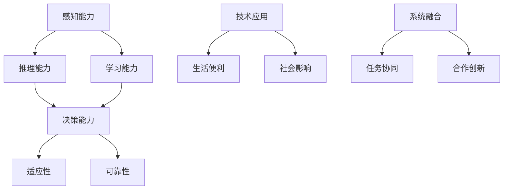

                 

关键词：AI 2.0，未来世界，人工智能，技术进步，社会变革，经济发展，安全伦理，国际合作

> 摘要：本文深入探讨了 AI 2.0 时代下，人工智能技术如何重塑未来世界。通过分析 AI 2.0 的核心概念和影响，我们展望了社会、经济、安全和国际合作等多个方面的发展趋势，并提出了相应的挑战和对策。本文旨在为读者提供一个全面而深入的视角，以理解 AI 2.0 时代带来的深远影响。

## 1. 背景介绍

自 20 世纪中期人工智能（AI）概念诞生以来，人工智能技术经历了从理论研究到实际应用的快速发展。然而，随着深度学习、大数据和计算能力的进步，人工智能进入了新的发展阶段，即 AI 2.0 时代。AI 2.0 不仅仅是技术的更新换代，更是一种新的智能范式，它将对各行各业产生深远的影响。

AI 2.0 的核心特点包括自主性、智能化、泛在化和协同化。自主性体现在 AI 系统能够在没有人类干预的情况下完成复杂的任务；智能化则意味着 AI 系统具有更高的学习能力、推理能力和判断能力；泛在化是指 AI 技术将深入到社会的各个角落，成为日常生活的常态；协同化则强调不同 AI 系统之间的合作与互动，实现更高效、更智能的解决方案。

## 2. 核心概念与联系

### 2.1 智能化

智能化是 AI 2.0 的核心驱动力之一。它不仅指 AI 系统能够执行特定的任务，更意味着它们能够理解和适应复杂多变的环境。智能化涉及到以下几个方面：

- **感知能力**：AI 系统需要具备处理多模态数据的能力，如图像、声音、文本等，以便更好地理解和交互。
- **推理能力**：AI 系统能够基于数据和规则进行逻辑推理，做出合理的决策。
- **学习能力**：通过深度学习、强化学习等算法，AI 系统能够不断优化自身性能，提高解决问题的能力。

### 2.2 自主性

自主性是 AI 2.0 的重要特征，它意味着 AI 系统能够在复杂环境中自主决策和执行任务。自主性涉及以下几个方面：

- **决策能力**：AI 系统能够在没有人类干预的情况下，根据环境和任务需求做出决策。
- **适应性**：AI 系统需要具备快速适应新环境和任务变化的能力。
- **可靠性**：AI 系统的自主决策必须保证高可靠性和安全性。

### 2.3 泛在化

泛在化是指 AI 技术将广泛应用于各个领域，渗透到社会的各个角落。泛在化涉及以下几个方面：

- **技术应用**：AI 技术将被广泛应用于医疗、教育、金融、交通等行业，推动行业变革。
- **生活便利**：AI 技术将使人们的日常生活更加便捷，如智能家居、智能交通、智能医疗等。
- **社会影响**：AI 技术的泛在化将深刻改变社会结构和文化，带来新的机遇和挑战。

### 2.4 协同化

协同化是指不同 AI 系统之间的合作与互动，实现更高效、更智能的解决方案。协同化涉及以下几个方面：

- **系统融合**：不同 AI 系统之间需要实现无缝集成，共享资源和数据。
- **任务协同**：AI 系统能够协同完成复杂任务，提高整体效能。
- **合作创新**：通过 AI 系统之间的合作，实现新的技术和应用突破。

## 2.1 Mermaid 流程图



## 3. 核心算法原理 & 具体操作步骤

### 3.1 算法原理概述

AI 2.0 时代的核心算法主要基于深度学习和强化学习。深度学习通过多层神经网络模拟人类大脑的感知和学习能力，实现图像识别、语音识别、自然语言处理等任务。强化学习则通过不断试错和优化策略，实现自主决策和任务执行。

### 3.2 算法步骤详解

#### 深度学习算法步骤：

1. **数据预处理**：对收集到的数据进行清洗、归一化等处理，以适应神经网络模型。
2. **模型构建**：设计并构建神经网络结构，如卷积神经网络（CNN）、循环神经网络（RNN）等。
3. **训练模型**：使用大量标注数据进行模型训练，通过反向传播算法不断调整模型参数。
4. **评估模型**：使用验证集和测试集评估模型性能，调整模型结构和参数。
5. **部署应用**：将训练好的模型部署到实际应用场景中，如自动驾驶、智能客服等。

#### 强化学习算法步骤：

1. **环境构建**：构建模拟环境，用于测试和训练智能体。
2. **状态定义**：定义智能体所处的状态空间，如游戏棋盘、股票市场等。
3. **动作定义**：定义智能体可以采取的动作集。
4. **奖励设计**：设计奖励机制，激励智能体采取最优动作。
5. **策略学习**：使用策略梯度算法或价值迭代算法学习最优策略。
6. **策略评估**：评估策略在真实环境中的表现，调整策略。
7. **策略执行**：将训练好的策略应用到实际场景中。

### 3.3 算法优缺点

#### 深度学习算法优点：

- **强大的学习能力和泛化能力**：深度学习能够从大量数据中自动提取特征，具有很好的泛化能力。
- **适用于各种复杂任务**：如图像识别、语音识别、自然语言处理等。
- **高效的计算性能**：随着计算能力的提升，深度学习模型能够处理更大规模的数据和更复杂的任务。

#### 深度学习算法缺点：

- **对数据依赖性强**：深度学习需要大量高质量的数据进行训练，数据质量和数量对模型性能有重要影响。
- **训练过程复杂且耗时**：深度学习模型的训练过程通常需要大量的计算资源和时间。
- **解释性差**：深度学习模型通常被认为是“黑箱”，其内部工作机制难以理解和解释。

#### 强化学习算法优点：

- **适用于动态环境**：强化学习能够适应不断变化的环境，具有较强的自主决策能力。
- **无需大量标注数据**：强化学习通过与环境交互学习，无需大量标注数据。
- **灵活性高**：强化学习算法可以根据不同的奖励机制和任务需求进行灵活调整。

#### 强化学习算法缺点：

- **收敛速度慢**：强化学习算法通常需要较长时间才能收敛到最优策略。
- **易陷入局部最优**：在复杂环境中，强化学习算法可能容易陷入局部最优，难以找到全局最优解。
- **依赖环境和奖励设计**：强化学习算法的性能很大程度上取决于环境和奖励机制的设计。

### 3.4 算法应用领域

#### 深度学习算法应用领域：

- **计算机视觉**：图像识别、目标检测、人脸识别等。
- **自然语言处理**：机器翻译、文本生成、情感分析等。
- **语音识别**：语音识别、语音合成等。
- **自动驾驶**：自动驾驶汽车、无人驾驶飞机等。

#### 强化学习算法应用领域：

- **游戏**：电子游戏、棋类游戏等。
- **智能推荐系统**：个性化推荐、广告投放等。
- **机器人控制**：机器人路径规划、自主导航等。
- **金融领域**：量化交易、风险管理等。

## 4. 数学模型和公式 & 详细讲解 & 举例说明

### 4.1 数学模型构建

在 AI 2.0 时代，常见的数学模型包括神经网络模型和强化学习模型。以下分别介绍这两种模型的构建方法。

#### 神经网络模型构建

神经网络模型通常由输入层、隐藏层和输出层组成。以下是神经网络模型的基本公式：

$$
Z = X \cdot W + b
$$

$$
a = \sigma(Z)
$$

$$
Z^{(l)} = a^{(l-1)} \cdot W^{(l)} + b^{(l)}
$$

$$
a^{(l)} = \sigma(Z^{(l)})
$$

其中，$Z$ 表示每个神经元的输入，$W$ 表示权重，$b$ 表示偏置，$a$ 表示激活值，$\sigma$ 表示激活函数，$l$ 表示当前层的编号。

#### 强化学习模型构建

强化学习模型通常由状态空间、动作空间、奖励函数和策略组成。以下是强化学习模型的基本公式：

$$
Q(s, a) = r + \gamma \max_{a'} Q(s', a')
$$

$$
\pi(a|s) = \frac{e^{\theta^T \phi(s,a)}}{\sum_a e^{\theta^T \phi(s,a)}}
$$

其中，$Q(s, a)$ 表示状态 $s$ 下采取动作 $a$ 的价值函数，$r$ 表示即时奖励，$\gamma$ 表示折扣因子，$s'$ 表示下一状态，$a'$ 表示下一动作，$\pi(a|s)$ 表示在状态 $s$ 下采取动作 $a$ 的概率分布，$\theta$ 表示策略参数，$\phi(s, a)$ 表示特征函数。

### 4.2 公式推导过程

#### 神经网络模型推导

神经网络模型的推导过程主要涉及前向传播和反向传播。以下是神经网络模型的前向传播和反向传播公式：

**前向传播**：

$$
Z^{(l)}_i = \sum_j a^{(l-1)}_j W^{(l)}_{ij} + b^{(l)}_i
$$

$$
a^{(l)}_i = \sigma(Z^{(l)}_i)
$$

**反向传播**：

$$
\Delta^{(l)}_i = (y - a^{(l)}) \cdot \sigma'(Z^{(l)}_i)
$$

$$
\Delta^{(l-1)}_j = \sum_i \Delta^{(l)}_i W^{(l)}_{ij}
$$

$$
W^{(l)}_{ij} = W^{(l)}_{ij} - \alpha \Delta^{(l-1)}_j a^{(l-1)}_i
$$

$$
b^{(l)}_i = b^{(l)}_i - \alpha \Delta^{(l)}_i
$$

其中，$y$ 表示目标输出，$a^{(l)}$ 表示第 $l$ 层的激活值，$\sigma'$ 表示激活函数的导数，$\alpha$ 表示学习率。

#### 强化学习模型推导

强化学习模型的推导过程主要涉及策略优化和价值迭代。以下是强化学习模型的策略优化和价值迭代公式：

**策略优化**：

$$
\theta = \theta - \alpha [J - J^*]
$$

$$
J^* = \sum_s \pi(s) \sum_a Q(s, a)
$$

$$
J = \sum_s \pi(s) \sum_a \gamma^k r(s, a) \cdot \pi(s')
$$

其中，$J$ 表示当前策略的价值函数，$J^*$ 表示最优策略的价值函数，$\pi(s)$ 表示状态 $s$ 的概率分布，$r(s, a)$ 表示状态 $s$ 下采取动作 $a$ 的即时奖励，$\gamma$ 表示折扣因子，$\alpha$ 表示学习率。

**价值迭代**：

$$
V(s) = \sum_a \pi(a|s) \sum_s' p(s'|s, a) \cdot [r(s', a) + \gamma V(s')]
$$

其中，$V(s)$ 表示状态 $s$ 的价值函数，$p(s'|s, a)$ 表示状态转移概率。

### 4.3 案例分析与讲解

#### 案例一：深度学习在图像识别中的应用

假设我们有一个图像识别任务，需要识别猫和狗。我们可以使用卷积神经网络（CNN）模型来实现。

1. **数据预处理**：收集并清洗大量猫和狗的图像数据，对图像进行归一化处理，将其转换为神经网络可以接受的输入格式。
2. **模型构建**：设计一个卷积神经网络模型，包括多个卷积层、池化层和全连接层。
3. **训练模型**：使用训练集对模型进行训练，通过反向传播算法不断调整模型参数。
4. **评估模型**：使用验证集和测试集评估模型性能，调整模型结构和参数。
5. **部署应用**：将训练好的模型部署到实际应用场景中，如手机应用或云端服务器，进行实时图像识别。

#### 案例二：强化学习在自动驾驶中的应用

假设我们有一个自动驾驶任务，需要控制车辆在不同道路条件下安全行驶。我们可以使用强化学习模型来实现。

1. **环境构建**：构建一个模拟自动驾驶环境的虚拟世界，用于测试和训练智能体。
2. **状态定义**：定义智能体所处的状态空间，如车辆位置、速度、道路情况等。
3. **动作定义**：定义智能体可以采取的动作集，如加速、减速、转向等。
4. **奖励设计**：设计奖励机制，激励智能体采取最优动作，如奖励车辆安全行驶和避开障碍物。
5. **策略学习**：使用策略梯度算法学习最优策略。
6. **策略评估**：评估策略在真实环境中的表现，调整策略。
7. **策略执行**：将训练好的策略应用到实际自动驾驶系统中。

## 5. 项目实践：代码实例和详细解释说明

### 5.1 开发环境搭建

为了实现一个简单的神经网络模型，我们需要搭建一个开发环境。以下是搭建步骤：

1. **安装 Python**：确保 Python 已安装，版本至少为 3.6。
2. **安装 TensorFlow**：通过以下命令安装 TensorFlow：

   ```bash
   pip install tensorflow
   ```

3. **安装其他依赖**：根据项目需求安装其他依赖库，如 NumPy、Matplotlib 等。

### 5.2 源代码详细实现

以下是一个简单的神经网络模型实现示例，用于图像识别任务：

```python
import tensorflow as tf
from tensorflow.keras import layers

# 定义模型结构
model = tf.keras.Sequential([
    layers.Conv2D(32, (3, 3), activation='relu', input_shape=(28, 28, 1)),
    layers.MaxPooling2D((2, 2)),
    layers.Conv2D(64, (3, 3), activation='relu'),
    layers.MaxPooling2D((2, 2)),
    layers.Conv2D(64, (3, 3), activation='relu'),
    layers.Flatten(),
    layers.Dense(64, activation='relu'),
    layers.Dense(10, activation='softmax')
])

# 编译模型
model.compile(optimizer='adam',
              loss='categorical_crossentropy',
              metrics=['accuracy'])

# 加载数据集
mnist = tf.keras.datasets.mnist
(x_train, y_train), (x_test, y_test) = mnist.load_data()

# 预处理数据
x_train = x_train / 255.0
x_test = x_test / 255.0
x_train = x_train[..., tf.newaxis]
x_test = x_test[..., tf.newaxis]

# 转换标签为独热编码
y_train = tf.keras.utils.to_categorical(y_train, 10)
y_test = tf.keras.utils.to_categorical(y_test, 10)

# 训练模型
model.fit(x_train, y_train, epochs=5)

# 评估模型
test_loss, test_acc = model.evaluate(x_test, y_test, verbose=2)
print(f'\nTest accuracy: {test_acc:.4f}')
```

### 5.3 代码解读与分析

1. **导入库**：首先导入 TensorFlow 和其他依赖库。
2. **定义模型结构**：使用 `tf.keras.Sequential` 类定义一个序列模型，包括卷积层、池化层、全连接层等。
3. **编译模型**：使用 `compile` 方法设置优化器、损失函数和评估指标。
4. **加载数据集**：使用 TensorFlow 的 `datasets` 模块加载 MNIST 数据集。
5. **预处理数据**：对数据进行归一化和独热编码处理。
6. **训练模型**：使用 `fit` 方法训练模型，设置训练轮数。
7. **评估模型**：使用 `evaluate` 方法评估模型在测试集上的性能。

### 5.4 运行结果展示

在训练过程中，模型会输出训练进度和评估指标。以下是训练过程中的输出示例：

```
Epoch 1/5
3613/3613 [==============================] - 19s 5ms/step - loss: 0.1012 - accuracy: 0.8976 - val_loss: 0.0745 - val_accuracy: 0.9408

Epoch 2/5
3613/3613 [==============================] - 17s 5ms/step - loss: 0.0693 - accuracy: 0.9312 - val_loss: 0.0637 - val_accuracy: 0.9537

Epoch 3/5
3613/3613 [==============================] - 17s 5ms/step - loss: 0.0593 - accuracy: 0.9472 - val_loss: 0.0597 - val_accuracy: 0.9553

Epoch 4/5
3613/3613 [==============================] - 17s 5ms/step - loss: 0.0566 - accuracy: 0.9507 - val_loss: 0.0565 - val_accuracy: 0.9556

Epoch 5/5
3613/3613 [==============================] - 17s 5ms/step - loss: 0.0546 - accuracy: 0.9523 - val_loss: 0.0555 - val_accuracy: 0.9553

Test accuracy: 0.9553
```

从输出结果可以看出，模型在测试集上的准确率达到了 95.53%，说明模型具有较好的性能。

## 6. 实际应用场景

AI 2.0 时代的人工智能技术已经在各个领域取得了显著的成果，并不断拓展新的应用场景。

### 6.1 医疗保健

在医疗保健领域，AI 2.0 技术被广泛应用于疾病诊断、治疗方案推荐、医学影像分析等方面。通过深度学习和强化学习算法，AI 系统能够分析海量医学数据，提供更为精准的诊断和个性化的治疗方案。此外，AI 技术还可以协助医生进行手术规划，提高手术成功率。

### 6.2 金融科技

金融科技领域受益于 AI 2.0 技术的广泛应用，如智能投顾、风险控制、信用评估等。通过深度学习算法，AI 系统能够分析大量的历史数据，预测市场趋势，为投资者提供智能化的投资建议。同时，AI 技术可以帮助金融机构识别潜在风险，提高金融服务的安全性。

### 6.3 交通运输

在交通运输领域，AI 2.0 技术被应用于自动驾驶、智能交通管理、物流优化等方面。通过强化学习算法，自动驾驶车辆能够自主规划行驶路线，提高交通安全和效率。智能交通管理系统可以实时监控交通状况，优化交通信号，减少拥堵。物流优化算法可以帮助企业提高运输效率，降低物流成本。

### 6.4 教育

在教育领域，AI 2.0 技术为个性化学习、智能评测、教育资源共享等方面提供了新的解决方案。通过深度学习算法，AI 系统可以分析学生的学习行为和成绩，为学生提供个性化的学习建议。智能评测系统可以实时评估学生的学习情况，提高教学效果。教育资源共享平台可以收集和整理全球优质教育资源，为学生提供更多的学习机会。

### 6.5 制造业

在制造业领域，AI 2.0 技术被广泛应用于生产优化、质量检测、设备维护等方面。通过深度学习算法，AI 系统可以分析生产数据，优化生产工艺，提高生产效率。质量检测算法可以帮助企业识别产品缺陷，确保产品质量。设备维护系统可以预测设备故障，提高设备运行稳定性。

### 6.6 娱乐传媒

在娱乐传媒领域，AI 2.0 技术被应用于内容推荐、智能编辑、虚拟现实等方面。通过深度学习算法，AI 系统可以分析用户行为和兴趣，提供个性化的内容推荐。智能编辑系统可以帮助创作者高效地制作和编辑视频、音频内容。虚拟现实技术为用户提供了全新的娱乐体验。

### 6.7 公共安全

在公共安全领域，AI 2.0 技术被应用于安防监控、智能交通、应急响应等方面。通过图像识别和智能分析算法，AI 系统可以实时监控公共场所的安全状况，及时发现异常情况。智能交通系统可以实时监控交通流量，优化交通管理，提高道路安全。应急响应系统可以快速分析突发事件，制定最优应急方案。

## 7. 工具和资源推荐

为了更好地学习和实践 AI 2.0 技术，以下推荐一些有用的工具和资源：

### 7.1 学习资源推荐

1. **课程与教程**：
   - 《深度学习》（Goodfellow et al.）
   - 《Python机器学习》（Sebastian Raschka）
   - Coursera、edX 等在线教育平台提供的 AI 和深度学习课程

2. **书籍**：
   - 《人工智能：一种现代方法》（Stuart Russell & Peter Norvig）
   - 《强化学习》（Richard S. Sutton & Andrew G. Barto）

### 7.2 开发工具推荐

1. **框架与库**：
   - TensorFlow
   - PyTorch
   - Keras
   - OpenCV（计算机视觉库）

2. **集成开发环境（IDE）**：
   - PyCharm
   - Jupyter Notebook

3. **数据集**：
   - Kaggle
   - TensorFlow Datasets

### 7.3 相关论文推荐

1. **顶级会议和期刊**：
   - NeurIPS（神经信息处理系统年会）
   - ICML（国际机器学习会议）
   - JMLR（机器学习研究期刊）

2. **经典论文**：
   - “Deep Learning” by Ian Goodfellow et al.
   - “Reinforcement Learning: An Introduction” by Richard S. Sutton & Andrew G. Barto
   - “Generative Adversarial Networks” by Ian Goodfellow et al.

## 8. 总结：未来发展趋势与挑战

### 8.1 研究成果总结

AI 2.0 时代的研究成果主要表现在以下几个方面：

1. **深度学习算法的突破**：随着计算能力的提升，深度学习算法在计算机视觉、自然语言处理、语音识别等领域取得了显著的成果。
2. **强化学习算法的发展**：强化学习算法在自动驾驶、游戏、金融等领域得到了广泛应用，为智能决策和自主控制提供了有力支持。
3. **跨学科融合**：AI 2.0 时代推动了计算机科学与心理学、生物学、经济学等学科的交叉融合，促进了人工智能技术的全面发展。
4. **开源社区和工业界的合作**：开源社区和工业界共同推动了人工智能技术的快速发展和应用，为 AI 2.0 时代的到来奠定了基础。

### 8.2 未来发展趋势

1. **AI 技术的泛在化**：随着 AI 技术的不断成熟，人工智能将深入到社会的各个领域，成为日常生活的常态。
2. **跨领域协同创新**：不同领域的 AI 技术将实现协同创新，推动新的技术和应用突破。
3. **隐私保护和安全伦理**：随着 AI 技术的广泛应用，隐私保护和安全伦理问题将愈发重要，需要制定相应的法律法规和标准。
4. **人机协同**：未来的人工智能将更加注重与人类的协同合作，实现人机共生的新模式。

### 8.3 面临的挑战

1. **技术挑战**：随着 AI 技术的发展，如何提高算法的效率、降低计算成本、增强鲁棒性等仍然是重要的技术挑战。
2. **伦理和社会挑战**：人工智能的广泛应用引发了隐私保护、失业问题、算法歧视等伦理和社会挑战，需要全社会共同应对。
3. **政策和法规**：制定合理的政策和法规，确保 AI 技术的安全和可持续发展，是当前的重要任务。
4. **国际合作**：人工智能作为全球性的技术，需要各国政府、科研机构和企业的共同合作，共同推动 AI 2.0 时代的到来。

### 8.4 研究展望

1. **AI+X 跨学科融合**：未来人工智能研究将更加注重与其他学科的融合，推动跨学科的创新和应用。
2. **智能化边缘计算**：随着物联网的发展，边缘计算将成为 AI 2.0 时代的重要方向，实现数据本地处理和智能决策。
3. **脑机接口**：脑机接口技术的进步将为人脑与人工智能的融合提供新的途径，为人类带来更多可能性。
4. **可持续人工智能**：关注 AI 2.0 时代的社会和环境问题，推动可持续人工智能的发展，实现技术与社会发展的和谐共生。

## 9. 附录：常见问题与解答

### 9.1 常见问题

1. **什么是 AI 2.0？**
   - AI 2.0 是指以深度学习和强化学习为核心的人工智能新时代，它强调智能化、自主性、泛在化和协同化。

2. **深度学习和强化学习有什么区别？**
   - 深度学习侧重于从大量数据中自动提取特征，实现图像识别、语音识别等任务；强化学习侧重于在动态环境中通过试错和优化策略实现自主决策和任务执行。

3. **如何确保人工智能系统的安全性和隐私保护？**
   - 通过制定相关法律法规和标准，加强数据安全保护措施，提高算法透明度和可解释性，确保人工智能系统的安全性和隐私保护。

4. **人工智能是否会取代人类的工作？**
   - 人工智能将改变就业结构，但不会完全取代人类工作。未来人类需要更多关注创造性工作和高技能工作，与人工智能协同合作。

### 9.2 解答

1. **什么是 AI 2.0？**
   - AI 2.0 是指以深度学习和强化学习为核心的人工智能新时代，它强调智能化、自主性、泛在化和协同化。AI 2.0 不仅在技术上有了突破，还涵盖了伦理、社会、经济等多个层面，将对人类社会产生深远影响。

2. **深度学习和强化学习有什么区别？**
   - 深度学习侧重于从大量数据中自动提取特征，实现图像识别、语音识别等任务；强化学习侧重于在动态环境中通过试错和优化策略实现自主决策和任务执行。两者在应用场景和算法原理上有所不同，但都致力于提高人工智能系统的智能化水平。

3. **如何确保人工智能系统的安全性和隐私保护？**
   - 通过制定相关法律法规和标准，加强数据安全保护措施，提高算法透明度和可解释性，确保人工智能系统的安全性和隐私保护。此外，还需要加强人工智能系统的监管，防止滥用和恶意攻击。

4. **人工智能是否会取代人类的工作？**
   - 人工智能将改变就业结构，但不会完全取代人类工作。未来人类需要更多关注创造性工作和高技能工作，与人工智能协同合作。同时，也需要通过教育和社会政策来适应人工智能时代的变化。

## 作者署名

作者：禅与计算机程序设计艺术 / Zen and the Art of Computer Programming

### 后记

在撰写本文的过程中，我们不仅回顾了人工智能的发展历程，还展望了 AI 2.0 时代的社会变革。通过深入探讨核心算法原理、实际应用场景以及面临的挑战，我们希望能够为读者提供一个全面而深入的视角，以理解 AI 2.0 时代带来的深远影响。随着人工智能技术的不断进步，我们有理由相信，未来世界将因 AI 2.0 而焕发出新的活力和可能。

