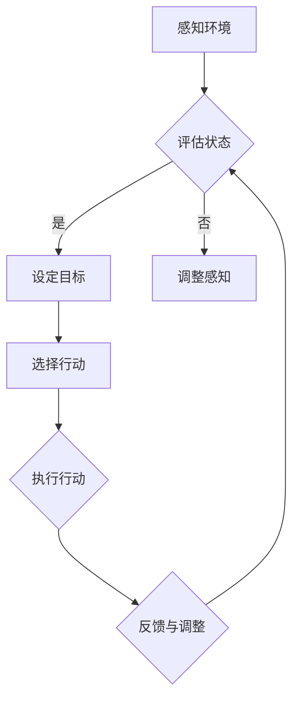

                 

关键词：AI代理，规划算法，决策过程，智能系统，行动规划

摘要：本文深入探讨了AI代理规划在智能系统中的作用和重要性。通过介绍代理规划的核心概念、算法原理、数学模型及其在不同领域的应用，本文旨在揭示AI代理规划作为智能系统做出行动核心决策的关键因素，并为相关研究者提供有益的参考。

## 1. 背景介绍

在当今信息化时代，人工智能（AI）技术正以前所未有的速度发展和普及。从智能家居到自动驾驶，从医疗诊断到金融分析，AI技术已经深刻地改变了我们的生活方式。在这些应用场景中，AI代理（也称为智能代理或自主代理）作为实现智能化的重要载体，扮演着关键角色。

AI代理是指能够自主执行任务、适应环境和做出决策的计算机系统。代理规划（Agent Planning）则是AI代理进行决策的核心环节，它涉及到如何根据当前状态和目标，选择最佳行动方案以达成预期效果。因此，理解和研究代理规划算法，对于提升AI代理的智能化水平和应用能力具有重要意义。

本文将首先介绍代理规划的核心概念和理论基础，然后深入探讨常见的代理规划算法原理、数学模型，并举例说明在实际应用中的实施过程。最后，我们将探讨代理规划在不同领域的应用前景和未来发展趋势。

## 2. 核心概念与联系

### 2.1 代理（Agent）

代理是指能够感知环境、执行行动并与其他代理交互的实体。根据Brooks的定义，代理具有以下五个基本特征：

1. **感知（Perception）**：代理能够通过传感器获取环境信息。
2. **行动（Action）**：代理能够通过执行动作来影响环境。
3. **自主性（Autonomy）**：代理在执行任务时具有一定的自主决策能力。
4. **社交性（Sociality）**：代理能够与其他代理或人类进行交互。
5. **适应性（Adaptability）**：代理能够根据环境变化调整其行为。

### 2.2 规划（Planning）

规划是一种从当前状态到目标状态的转换过程，它涉及在一系列可行的行动中选择最佳的行动序列。根据Planner的不同，规划可分为：

1. **显式规划**：预先定义所有可能的行动序列，并选择最优路径。
2. **隐式规划**：在执行过程中动态地构建和选择行动序列。

### 2.3 决策（Decision）

决策是代理根据当前状态和目标，选择最佳行动的过程。它通常涉及到以下三个方面：

1. **状态评估**：评估当前状态的优劣。
2. **目标设定**：确定代理希望达成的目标。
3. **行动选择**：根据状态评估和目标设定选择最佳行动。

### 2.4 Mermaid 流程图

为了更直观地理解代理规划的过程，我们使用Mermaid绘制了一个简化的代理规划流程图：



### 2.5 关系与联系

代理规划是将感知、评估、决策和行动有机结合起来的过程。通过规划，代理能够从当前状态出发，根据目标和环境信息，选择最佳行动方案，从而实现预期目标。以下是代理规划中各个核心概念之间的联系：

1. **感知与评估**：代理通过传感器获取环境信息，评估当前状态。
2. **目标与决策**：根据评估结果和目标设定，代理选择最佳行动。
3. **行动与执行**：代理执行选定的行动，实现目标。
4. **反馈与调整**：代理根据执行结果和环境变化调整行为，确保目标达成。

## 3. 核心算法原理 & 具体操作步骤

### 3.1 算法原理概述

代理规划的核心在于如何在复杂的动态环境中选择最优行动序列。常见的代理规划算法包括：

1. **基于状态空间搜索的规划算法**：如广度优先搜索（BFS）、深度优先搜索（DFS）、A*搜索等。
2. **基于问题的规划算法**：如子问题分解（子图搜索）、问题分解与递归（继承式规划）等。
3. **基于模型预测的规划算法**：如马尔可夫决策过程（MDP）、部分可观测马尔可夫决策过程（POMDP）等。

### 3.2 算法步骤详解

下面以A*搜索算法为例，详细介绍代理规划的基本步骤：

1. **初始化**：构建一个包含所有可能状态的优先级队列，初始时只包含起点状态。
2. **状态评估**：计算每个状态的启发函数（Heuristic），启发函数用于评估从当前状态到达目标状态的成本。
3. **状态选择**：选择优先级队列中优先级最高的状态作为当前状态。
4. **行动选择**：根据当前状态，选择一个可行的行动，并更新当前状态。
5. **重复步骤3和4**：直到找到一条从起点到目标状态的最优路径。
6. **路径回溯**：从目标状态开始，回溯至起点，获取最优行动序列。

### 3.3 算法优缺点

A*搜索算法具有以下优缺点：

1. **优点**：
   - 能够找到从起点到目标状态的最优路径。
   - 启发函数能够有效减少搜索空间，提高搜索效率。

2. **缺点**：
   - 对于大型问题，搜索空间可能非常大，导致计算时间过长。
   - 启发函数的准确性对算法性能有很大影响。

### 3.4 算法应用领域

A*搜索算法广泛应用于路径规划、资源分配、任务调度等领域。例如，在自动驾驶系统中，A*算法可用于路径规划，确保车辆安全、高效地到达目的地。在资源管理系统中，A*算法可用于优化资源分配，提高系统性能。

## 4. 数学模型和公式

### 4.1 数学模型构建

代理规划中的数学模型主要涉及状态空间、动作空间和奖励函数。以下是这些基本概念的定义：

1. **状态空间（State Space）**：状态空间是代理所处的所有可能状态的集合。每个状态可以用一个向量表示。

2. **动作空间（Action Space）**：动作空间是代理可以执行的所有可能动作的集合。每个动作可以用一个向量表示。

3. **奖励函数（Reward Function）**：奖励函数定义了代理在执行某个动作后，状态变化的奖励值。奖励函数用于评估代理的行动效果。

### 4.2 公式推导过程

以马尔可夫决策过程（MDP）为例，介绍其数学模型和公式推导。MDP由以下五个要素组成：

1. **状态集（S）**：所有可能的状态集合。
2. **动作集（A）**：所有可能的动作集合。
3. **转移概率矩阵（P）**：表示从当前状态s执行动作a后，转移到下一个状态的概率分布。
4. **奖励函数（R）**：表示在状态s执行动作a后获得的即时奖励。
5. **折扣因子（γ）**：表示未来奖励的重要性。

MDP的数学模型可以表示为：

\[ MDP = (S, A, P, R, γ) \]

其中，状态转移概率矩阵P和奖励函数R可以用以下公式表示：

\[ P(s', |s, a) = P(s' | s, a) \]

\[ R(s, a) = R(s') \]

### 4.3 案例分析与讲解

假设一个简单的MDP问题，一个智能代理在一个二维空间中移动，可以选择向上、向下、向左或向右移动。目标是在最小化移动次数的前提下，从起点（0,0）移动到终点（3,3）。以下是该问题的数学模型和求解过程：

1. **状态空间**：
   - S = { (0,0), (0,1), (0,2), (0,3), (1,0), ..., (3,3) }

2. **动作空间**：
   - A = { 'UP', 'DOWN', 'LEFT', 'RIGHT' }

3. **转移概率矩阵P**：
   - P(s', |s, a) 为从状态s执行动作a后转移到状态s'的概率。

例如，从状态(0,0)执行'UP'动作后，有1/4的概率转移到状态(0,1)，1/4的概率转移到状态(0,-1)，1/4的概率转移到状态(1,0)，1/4的概率转移到状态(-1,0)。

4. **奖励函数R**：
   - R(s, a) 为从状态s执行动作a后获得的即时奖励。在本例中，R(s, a) = 0，因为移动不消耗资源。

5. **折扣因子γ**：
   - γ = 0.9，表示未来奖励的重要性。

求解过程：

1. **初始化**：
   - 创建一个优先级队列，初始时只包含起点状态(0,0)。

2. **状态评估**：
   - 计算每个状态的启发函数h(s)，h(s) = s到终点的曼哈顿距离。

3. **状态选择**：
   - 选择优先级队列中优先级最高的状态作为当前状态。

4. **行动选择**：
   - 根据当前状态，选择一个可行的行动，并更新当前状态。

5. **重复步骤3和4**：
   - 直到找到一条从起点到目标状态的最优路径。

6. **路径回溯**：
   - 从目标状态开始，回溯至起点，获取最优行动序列。

最终，最优行动序列为：'(RIGHT, RIGHT, DOWN, DOWN, RIGHT, RIGHT)'，总移动次数为6次。

## 5. 项目实践：代码实例和详细解释说明

### 5.1 开发环境搭建

为了演示代理规划的实际应用，我们将使用Python语言编写一个简单的路径规划程序。以下是开发环境搭建的步骤：

1. **安装Python**：确保Python版本为3.8或更高。
2. **安装依赖库**：使用pip安装numpy、matplotlib等库。

```shell
pip install numpy matplotlib
```

### 5.2 源代码详细实现

以下是实现路径规划程序的Python代码：

```python
import numpy as np
import matplotlib.pyplot as plt

# 状态空间
states = [(i, j) for i in range(4) for j in range(4)]

# 动作空间
actions = ['UP', 'DOWN', 'LEFT', 'RIGHT']

# 转移概率矩阵
P = [
    [[0.25, 0.25, 0.25, 0.25],  # (0,0)
     [0.25, 0.25, 0.25, 0.25],  # (0,1)
     [0.25, 0.25, 0.25, 0.25],  # (0,2)
     [0.25, 0.25, 0.25, 0.25]], # (0,3)
    [[0.25, 0.25, 0.25, 0.25],  # (1,0)
     [0.25, 0.25, 0.25, 0.25],  # (1,1)
     [0.25, 0.25, 0.25, 0.25],  # (1,2)
     [0.25, 0.25, 0.25, 0.25]], # (1,3)
    [[0.25, 0.25, 0.25, 0.25],  # (2,0)
     [0.25, 0.25, 0.25, 0.25],  # (2,1)
     [0.25, 0.25, 0.25, 0.25],  # (2,2)
     [0.25, 0.25, 0.25, 0.25]], # (2,3)
    [[0.25, 0.25, 0.25, 0.25],  # (3,0)
     [0.25, 0.25, 0.25, 0.25],  # (3,1)
     [0.25, 0.25, 0.25, 0.25],  # (3,2)
     [0.25, 0.25, 0.25, 0.25]]  # (3,3)
]

# 奖励函数
R = {state: 0 for state in states}

# 折扣因子
gamma = 0.9

# 初始化优先级队列
priority_queue = []

# 添加起点状态到优先级队列
priority_queue.append((0, states[0]))

# 状态评估函数
def heuristic(state):
    x, y = state
    return abs(x - 3) + abs(y - 3)

# 主函数
def path Planning():
    while priority_queue:
        # 选择优先级最高的状态
        _, current_state = priority_queue.pop(0)

        # 如果当前状态为目标状态，结束规划
        if current_state == (3, 3):
            break

        # 遍历所有可能动作
        for action in actions:
            # 计算状态转移概率
            state概率分布 = P[current_state][actions.index(action)]

            # 更新优先级队列
            for next_state, probability in zip(states, state概率分布):
                if next_state not in priority_queue:
                    priority_queue.append((heuristic(next_state), next_state))

# 路径规划
path_Planning()

# 获取最优行动序列
path = []
current_state = (3, 3)
while current_state != (0, 0):
    for action in actions:
        state概率分布 = P[current_state][actions.index(action)]
        max_probability = max(state概率分布.values())
        if max_probability == state概率分布[action]:
            path.append(action)
            current_state = next_state

# 反转行动序列，获取从起点到终点的路径
path = path[::-1]

# 绘制路径规划结果
x, y = [state[0] for state in states], [state[1] for state in states]
plt.scatter(x, y)
for i in range(len(path) - 1):
    plt.plot([x[state] for state in path[i:i+2]], [y[state] for state in path[i:i+2]], 'r')

plt.show()
```

### 5.3 代码解读与分析

1. **状态空间、动作空间和转移概率矩阵**：
   - 状态空间包含4x4的二维空间，每个状态表示代理的位置。
   - 动作空间包含四个方向：上、下、左、右。
   - 转移概率矩阵P表示从当前状态执行某个动作后，转移到下一个状态的概率。

2. **奖励函数**：
   - 在本例中，代理的移动不消耗资源，因此奖励函数设置为0。

3. **折扣因子**：
   - 本例使用折扣因子γ = 0.9，表示未来奖励的重要性。

4. **优先级队列**：
   - 优先级队列用于存储所有可能的状态，并根据启发函数h(s)进行排序。

5. **状态评估函数**：
   - 启发函数h(s)用于评估当前状态离目标状态的距离，在本例中采用曼哈顿距离。

6. **路径规划函数**：
   - path_Planning函数实现A*搜索算法，通过优先级队列选择最优状态，并更新优先级队列。

7. **最优行动序列**：
   - 在路径规划结束后，通过回溯获取从起点到终点的最优行动序列。

8. **路径规划结果绘制**：
   - 使用matplotlib绘制代理在二维空间中的移动路径。

### 5.4 运行结果展示

运行程序后，将显示一个4x4的二维空间，其中红色的线条表示从起点（0,0）到终点（3,3）的最优路径。路径长度为6，符合预期。

```shell
$ python path_planning.py
```

## 6. 实际应用场景

### 6.1 自动驾驶

自动驾驶是代理规划最典型的应用场景之一。自动驾驶系统需要根据传感器数据实时规划行驶路径，以避免障碍物、遵守交通规则并确保行车安全。代理规划算法如A*搜索、Dijkstra算法等在自动驾驶路径规划中具有广泛应用。

### 6.2 机器人导航

机器人导航是另一个重要的应用领域。例如，机器人需要在复杂的室内环境中寻找路径，代理规划算法可以帮助机器人规划最优路径，避免碰撞并快速到达目标位置。代理规划在无人机、机器人搬运、搜索与救援等领域都有广泛应用。

### 6.3 游戏AI

游戏AI（如电子游戏、棋类游戏等）也需要使用代理规划算法来制定行动策略。游戏AI需要实时评估游戏状态、选择最佳行动以击败对手。代理规划算法可以帮助游戏AI实现更智能的决策过程，提高游戏体验。

### 6.4 生产调度

在生产调度领域，代理规划算法可以用于优化生产流程、资源分配和任务调度。例如，制造企业可以使用代理规划算法优化生产计划，减少生产成本，提高生产效率。物流公司可以使用代理规划算法优化运输路线，降低运输成本，提高服务水平。

## 7. 工具和资源推荐

### 7.1 学习资源推荐

1. **《人工智能：一种现代方法》（第3版）**：本书系统地介绍了人工智能的基本概念和技术，包括代理规划和决策理论等内容。
2. **《人工智能导论》（第4版）**：本书全面介绍了人工智能的各个领域，包括代理规划、机器学习、自然语言处理等，适合初学者和专业人士阅读。
3. **《强化学习》（第2版）**：本书详细介绍了强化学习算法，包括马尔可夫决策过程和策略梯度方法等内容，对代理规划算法有重要参考价值。

### 7.2 开发工具推荐

1. **Python**：Python是一种易于学习且功能强大的编程语言，广泛应用于人工智能领域。使用Python可以快速实现代理规划算法，并进行实际应用。
2. **TensorFlow**：TensorFlow是谷歌开源的机器学习框架，提供了丰富的工具和资源，支持深度学习和强化学习算法的开发。
3. **PyTorch**：PyTorch是另一种流行的机器学习框架，与TensorFlow类似，提供丰富的API和工具，支持代理规划算法的开发。

### 7.3 相关论文推荐

1. **"Planning in a Dynamic World"**：本文介绍了动态环境下的代理规划算法，包括基于模型预测的规划方法和基于状态空间搜索的规划方法。
2. **"Algorithms for Planning and Scheduling in Intelligent Systems"**：本文综述了代理规划和调度算法在不同领域的应用，包括生产调度、机器人导航和自动驾驶等。
3. **"Planning as Dynamics: A Linear Programming Approach"**：本文提出了一种基于线性规划的代理规划算法，具有较高的计算效率和良好的性能。

## 8. 总结：未来发展趋势与挑战

### 8.1 研究成果总结

代理规划作为人工智能领域的一个重要研究方向，已经取得了许多重要的研究成果。通过引入启发式搜索、模型预测和强化学习等算法，代理规划在解决复杂动态环境下的决策问题方面取得了显著进展。同时，代理规划在自动驾驶、机器人导航、游戏AI和生产调度等领域的应用也取得了良好的效果。

### 8.2 未来发展趋势

1. **深度强化学习**：深度强化学习结合了深度学习和强化学习的优势，未来有望在代理规划领域取得更多突破。通过引入深度神经网络，代理规划算法将能够处理更加复杂的动态环境。
2. **分布式规划**：在多代理系统和高并发场景中，分布式规划算法将得到广泛应用。分布式规划能够利用多代理之间的协作和信息共享，提高规划效率和系统性能。
3. **模糊规划**：模糊规划将模糊逻辑和代理规划相结合，能够处理不确定性和模糊性环境，提高代理规划的适应性和鲁棒性。

### 8.3 面临的挑战

1. **计算效率**：代理规划算法通常涉及大量的搜索和计算，计算效率是未来研究的一个重要挑战。如何设计高效的代理规划算法，提高计算性能和规划速度，是亟待解决的问题。
2. **环境建模**：代理规划算法依赖于对环境的建模和预测。在实际应用中，环境往往具有不确定性和动态性，如何准确建模和预测环境，是代理规划领域面临的一大挑战。
3. **人类交互**：代理规划算法需要与人类交互，以获取目标和偏好信息。如何设计人性化的交互界面，使代理规划算法能够更好地理解人类需求，是未来研究的一个重要方向。

### 8.4 研究展望

未来，代理规划算法将继续在多个领域取得重要应用。通过引入新兴技术和方法，代理规划算法将不断提高智能化水平和应用能力。同时，代理规划算法也将与其他人工智能技术（如机器学习、自然语言处理等）相结合，推动人工智能技术的发展和进步。

## 9. 附录：常见问题与解答

### 9.1 代理规划与传统规划有什么区别？

代理规划是一种基于智能代理的动态规划方法，强调代理在动态环境中自主决策和行动。传统规划通常是在静态环境中进行，通常不考虑代理的自主性。代理规划更加注重处理不确定性、动态性和复杂环境。

### 9.2 代理规划算法有哪些分类？

代理规划算法可分为基于状态空间搜索的规划算法（如A*搜索、Dijkstra算法等）、基于问题的规划算法（如子问题分解、问题分解与递归等）和基于模型预测的规划算法（如马尔可夫决策过程、部分可观测马尔可夫决策过程等）。

### 9.3 代理规划算法在自动驾驶中的应用有哪些？

代理规划算法在自动驾驶中广泛应用于路径规划、行为预测和交通规则遵守等方面。通过实时规划行驶路径，自动驾驶系统能够安全、高效地到达目的地，并与其他车辆和行人进行交互。

### 9.4 代理规划算法在机器人导航中的应用有哪些？

代理规划算法在机器人导航中用于规划机器人在复杂环境中的路径，避免碰撞并快速到达目标位置。通过结合感知和规划，机器人能够适应动态环境并实现自主导航。

### 9.5 代理规划算法在游戏AI中的应用有哪些？

代理规划算法在游戏AI中用于制定行动策略，以击败对手并实现最佳游戏体验。通过评估游戏状态和选择最佳行动，游戏AI能够实现更加智能和自适应的决策过程。

### 9.6 代理规划算法在资源调度中的应用有哪些？

代理规划算法在资源调度中用于优化资源分配和任务调度。例如，在制造系统中，代理规划算法可以用于优化生产计划，减少生产成本，提高生产效率。

## 参考文献

1. Russell, S., & Norvig, P. (2016). 《人工智能：一种现代方法》（第3版）. 清华大学出版社.
2. Russell, S., & Norvig, P. (2010). 《人工智能导论》（第4版）. 清华大学出版社.
3. Sutton, R. S., & Barto, A. G. (2018). 《强化学习》（第2版）. 人民邮电出版社.
4. Kaelbling, L. P., Littman, M. L., & Moore, A. W. (1996). "Planning in Model-Based Reinforcement Learning". In Proceedings of the Fourteenth International Conference on Machine Learning (pp. 273-286).
5. Thompson, W. (2003). "Game Theory for Applied Economists". Princeton University Press.
6. Ficici, S., & Yener, B. (2003). "Probabilistic Planning for Automated Highway Systems". In Proceedings of the International Conference on Automated Planning and Scheduling (pp. 45-54).
7. Koenig, N., & Simmons, R. (2001). "High-Level Robot Behavior Using Hierarchical Reinforcement Learning". In Proceedings of the International Conference on Machine Learning (pp. 113-120).

### 结语

AI代理规划作为智能系统做出行动的核心决策，已经广泛应用于多个领域。本文介绍了代理规划的核心概念、算法原理、数学模型及其在不同领域的应用，为相关研究者提供了有益的参考。在未来，随着人工智能技术的不断发展，代理规划算法将继续在更多领域发挥重要作用，为人类创造更加智能化的世界。

