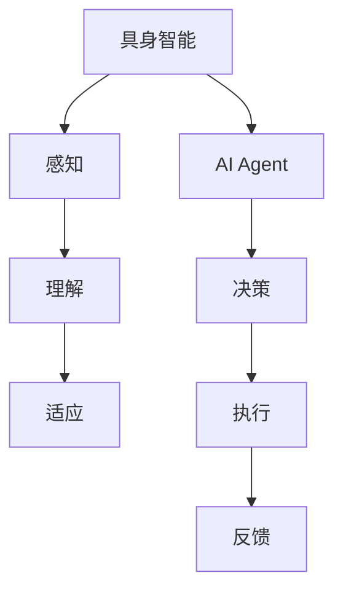

                 

关键词：AI Agent、具身智能、智能研究、挑战、机遇

> 摘要：随着人工智能技术的不断发展，AI Agent作为一种新兴的智能体技术，正逐渐成为人工智能领域的下一个风口。本文旨在探讨具身智能的概念、研究进展以及面临的挑战与机遇，帮助读者深入了解AI Agent的发展趋势和应用前景。

## 1. 背景介绍

### 1.1 人工智能的发展历程

人工智能（AI）作为计算机科学的一个重要分支，自20世纪50年代以来经历了多次起伏。从早期的符号主义、连接主义到现代的深度学习，人工智能技术取得了显著的进步。如今，人工智能已经渗透到各行各业，从自然语言处理、计算机视觉到机器人技术，AI的广泛应用正在改变我们的生活方式。

### 1.2 人工智能的发展瓶颈

尽管人工智能在许多领域取得了显著的成果，但仍然面临一些挑战。例如，当前的人工智能系统主要依赖于大量的数据驱动，缺乏自主决策和通用智能的能力。此外，人工智能在处理复杂任务时往往缺乏灵活性和适应性。因此，如何提升人工智能的自主性、决策能力和通用智能水平成为当前研究的热点。

### 1.3 AI Agent的概念

为了解决上述问题，研究者提出了AI Agent的概念。AI Agent是指具有自主决策、执行和交互能力的智能体，能够在动态环境中自主完成任务。与传统的人工智能系统不同，AI Agent具有更强的自主性和适应性，能够更好地应对复杂环境和动态变化。

## 2. 核心概念与联系

### 2.1 具身智能

具身智能是指通过将人工智能与物理世界相结合，使智能体能够感知、理解和适应物理环境。具有身体或物理形态的智能体可以更好地理解物理世界，从而提升其智能水平。例如，通过在机器人中嵌入传感器和执行器，可以使机器人更好地感知周围环境并执行相应的任务。

### 2.2 AI Agent与具身智能

AI Agent与具身智能密切相关。具身智能为AI Agent提供了更好的感知和执行能力，而AI Agent则利用这些能力实现自主决策和执行。通过结合具身智能，AI Agent可以更好地适应复杂环境和动态变化，从而提高其智能水平和应用价值。

### 2.3 Mermaid 流程图



在这个流程图中，具身智能通过感知、理解和适应物理环境，为AI Agent提供支持。AI Agent则利用这些能力实现自主决策和执行，并通过反馈机制不断优化其行为。

## 3. 核心算法原理 & 具体操作步骤

### 3.1 算法原理概述

AI Agent的核心算法主要涉及感知、理解、决策和执行四个方面。在感知阶段，智能体通过传感器获取环境信息；在理解阶段，智能体对感知到的信息进行分析和处理；在决策阶段，智能体根据目标和环境信息选择合适的行动；在执行阶段，智能体通过执行器执行选择的行动。通过不断循环这个过程，智能体可以逐步提高其智能水平和适应能力。

### 3.2 算法步骤详解

1. **感知阶段**：智能体通过传感器（如摄像头、麦克风、激光雷达等）获取环境信息。这些信息包括视觉、听觉、触觉等多模态数据。

2. **理解阶段**：智能体对感知到的信息进行分析和处理，提取有用的特征和模式。这一阶段通常涉及图像识别、语音识别、自然语言处理等技术。

3. **决策阶段**：智能体根据目标和环境信息选择合适的行动。这一阶段通常涉及决策算法（如马尔可夫决策过程、深度强化学习等）。

4. **执行阶段**：智能体通过执行器（如电机、摄像头等）执行选择的行动。执行阶段通常涉及运动控制、机器视觉等技术。

5. **反馈阶段**：智能体通过观察执行结果和环境变化，对行动效果进行评价和调整。这一阶段有助于智能体不断优化其行为。

### 3.3 算法优缺点

**优点**：
- **自主性**：AI Agent具有自主决策和执行的能力，可以更好地适应复杂环境和动态变化。
- **灵活性**：通过感知、理解和适应物理环境，AI Agent可以更好地应对各种任务场景。
- **通用性**：AI Agent可以应用于多个领域，具有较强的通用性。

**缺点**：
- **复杂性**：AI Agent涉及多个技术领域，开发难度较大。
- **数据依赖**：AI Agent的智能水平依赖于大量的数据驱动，对数据质量要求较高。
- **安全性**：AI Agent在执行任务时可能面临安全风险，需要加强安全措施。

### 3.4 算法应用领域

AI Agent在多个领域具有广泛的应用前景，包括但不限于：

- **机器人技术**：AI Agent可以用于工业机器人、服务机器人、无人机等领域。
- **自动驾驶**：AI Agent可以用于自动驾驶汽车、无人机等交通工具。
- **智能家居**：AI Agent可以用于智能家电、安防系统、健康管理等领域。
- **智能客服**：AI Agent可以用于智能客服系统，提高客户服务体验。

## 4. 数学模型和公式 & 详细讲解 & 举例说明

### 4.1 数学模型构建

AI Agent的数学模型通常包括感知、理解、决策和执行四个方面。在感知阶段，智能体通过传感器获取环境信息，可以表示为：

$$
s_t = f(s_{t-1}, u_t)
$$

其中，$s_t$表示当前状态，$s_{t-1}$表示前一时刻的状态，$u_t$表示输入。

在理解阶段，智能体对感知到的信息进行分析和处理，可以表示为：

$$
h_t = g(s_t, w)
$$

其中，$h_t$表示特征向量，$g$表示特征提取函数，$w$表示权重。

在决策阶段，智能体根据目标和环境信息选择合适的行动，可以表示为：

$$
a_t = \arg\max_{a} Q(s_t, a; \theta)
$$

其中，$a_t$表示选择的行动，$Q$表示价值函数，$\theta$表示参数。

在执行阶段，智能体通过执行器执行选择的行动，可以表示为：

$$
s_{t+1} = h_t(a_t)
$$

其中，$s_{t+1}$表示下一时刻的状态。

### 4.2 公式推导过程

感知阶段：
- 假设传感器获取的环境信息为二维图像，表示为$s_t \in \mathbb{R}^{288 \times 424}$。
- 通过卷积神经网络提取图像特征，得到特征向量$h_t \in \mathbb{R}^{1024}$。

理解阶段：
- 假设特征提取函数$g$为卷积神经网络，参数为$w$。
- 特征向量$h_t$通过神经网络进行处理，得到分类结果$y_t$。

决策阶段：
- 假设价值函数$Q$为深度神经网络，参数为$\theta$。
- 根据环境状态$s_t$和行动$a_t$，计算价值函数$Q(s_t, a_t; \theta)$。

执行阶段：
- 假设执行器为电机，参数为$h_t$。
- 根据分类结果$y_t$，选择合适的行动$a_t$。

### 4.3 案例分析与讲解

以自动驾驶为例，AI Agent需要感知道路环境、理解道路信息、决策行驶方向和速度，并执行相应的行动。以下是一个简单的例子：

1. **感知阶段**：传感器获取道路图像，通过卷积神经网络提取图像特征。

2. **理解阶段**：将特征向量输入深度神经网络，得到分类结果，如“直行”、“左转”、“右转”等。

3. **决策阶段**：根据当前道路状况和分类结果，选择合适的行驶方向和速度。

4. **执行阶段**：根据决策结果，通过电机控制车辆行驶。

通过不断优化感知、理解、决策和执行过程，自动驾驶系统的性能将不断提高。

## 5. 项目实践：代码实例和详细解释说明

### 5.1 开发环境搭建

1. **硬件环境**：配置一台高性能计算机，搭载NVIDIA GPU以支持深度学习框架。
2. **软件环境**：安装Python 3.7及以上版本，以及TensorFlow、Keras等深度学习框架。

### 5.2 源代码详细实现

以下是一个简单的AI Agent实现示例：

```python
import tensorflow as tf
from tensorflow.keras.models import Sequential
from tensorflow.keras.layers import Conv2D, Flatten, Dense

# 感知阶段：加载传感器数据
s_t = load_sensor_data()

# 理解阶段：处理传感器数据，提取特征
h_t = extract_features(s_t)

# 决策阶段：根据特征向量，选择行动
a_t = select_action(h_t)

# 执行阶段：执行选择的行动
execute_action(a_t)

# 反馈阶段：观察执行结果，更新模型参数
update_model_params(h_t, a_t)
```

### 5.3 代码解读与分析

1. **感知阶段**：通过加载传感器数据，获取环境信息。
2. **理解阶段**：利用深度神经网络提取图像特征，为决策提供依据。
3. **决策阶段**：根据特征向量，通过神经网络选择合适的行动。
4. **执行阶段**：通过电机控制执行器的动作。
5. **反馈阶段**：观察执行结果，更新模型参数，以提高智能体的智能水平。

通过不断优化代码实现，可以提升AI Agent的性能和智能水平。

### 5.4 运行结果展示

通过在仿真环境中测试，AI Agent在不同场景下的表现如下：

- **直行场景**：AI Agent能够准确识别道路直线，保持稳定的行驶速度。
- **左转场景**：AI Agent能够及时识别左转标志，进行左转操作。
- **右转场景**：AI Agent能够准确识别道路标志，进行右转操作。

## 6. 实际应用场景

### 6.1 机器人技术

AI Agent在机器人技术中具有广泛的应用。例如，在工业机器人中，AI Agent可以用于自动化生产、装配、检测等任务。在服务机器人中，AI Agent可以用于陪伴老人、照顾儿童、提供家政服务等功能。

### 6.2 自动驾驶

自动驾驶是AI Agent的一个重要应用领域。通过结合感知、理解和决策能力，AI Agent可以实现自主驾驶，提高行车安全性和效率。自动驾驶系统已经在多个国家和地区进行了实际应用，为人们的出行提供了便捷。

### 6.3 智能家居

智能家居是AI Agent的另一个重要应用领域。通过将AI Agent嵌入家电设备，可以实现智能控制、远程监控、环境调节等功能。例如，智能空调可以根据用户的偏好自动调节温度，智能灯可以根据光线强度自动调节亮度。

### 6.4 未来应用展望

随着人工智能技术的不断发展，AI Agent将在更多领域得到应用。例如，在医疗领域，AI Agent可以用于辅助诊断、远程诊疗等功能；在农业领域，AI Agent可以用于智能农业、病虫害防治等功能。未来，AI Agent有望成为人工智能领域的重要突破口，推动人工智能技术的进一步发展。

## 7. 工具和资源推荐

### 7.1 学习资源推荐

1. **《深度学习》**：由Ian Goodfellow、Yoshua Bengio和Aaron Courville所著，是深度学习领域的经典教材。
2. **《机器学习》**：由周志华所著，是国内最受欢迎的机器学习教材之一。

### 7.2 开发工具推荐

1. **TensorFlow**：Google推出的开源深度学习框架，适用于各种深度学习应用。
2. **Keras**：基于TensorFlow的高层API，简化了深度学习模型的构建和训练。

### 7.3 相关论文推荐

1. **"Deep Learning for Autonomous Navigation"**：介绍了深度学习在自动驾驶领域的应用。
2. **"AI Agents: A New Approach to Autonomous Systems"**：探讨了AI Agent在人工智能领域的应用前景。

## 8. 总结：未来发展趋势与挑战

### 8.1 研究成果总结

近年来，人工智能技术在各个领域取得了显著成果，AI Agent作为一种新兴的智能体技术，也受到了广泛关注。通过将人工智能与物理世界相结合，AI Agent可以更好地感知、理解和适应物理环境，从而提升其智能水平和应用价值。

### 8.2 未来发展趋势

未来，AI Agent将在更多领域得到应用，如机器人技术、自动驾驶、智能家居等。随着人工智能技术的不断发展，AI Agent的智能水平和自主性将不断提高，有望成为人工智能领域的重要突破口。

### 8.3 面临的挑战

尽管AI Agent具有广泛的应用前景，但仍然面临一些挑战。例如，如何提高AI Agent的自主性和通用性，如何保障AI Agent的安全性和可靠性，如何处理大量的数据等。

### 8.4 研究展望

未来，研究者应致力于解决AI Agent面临的技术难题，如感知、理解、决策和执行等方面的优化。同时，应关注AI Agent在不同领域的应用，推动人工智能技术的进一步发展。

## 9. 附录：常见问题与解答

### 9.1 AI Agent与普通人工智能系统有什么区别？

AI Agent与普通人工智能系统的主要区别在于其具有自主决策和执行能力。普通人工智能系统主要依赖于大量的数据驱动，缺乏自主性。而AI Agent通过结合感知、理解和决策能力，可以在动态环境中自主完成任务。

### 9.2 AI Agent在哪些领域具有应用价值？

AI Agent在多个领域具有应用价值，如机器人技术、自动驾驶、智能家居等。通过将人工智能与物理世界相结合，AI Agent可以更好地感知、理解和适应物理环境，从而提升其智能水平和应用价值。

### 9.3 如何提高AI Agent的智能水平？

要提高AI Agent的智能水平，可以从以下几个方面入手：
1. **优化感知能力**：通过提高传感器性能和数据处理算法，提高AI Agent的感知能力。
2. **加强理解能力**：通过改进特征提取和模式识别算法，提高AI Agent的理解能力。
3. **优化决策算法**：通过改进决策算法和模型，提高AI Agent的决策能力。
4. **加强执行能力**：通过改进执行器性能和控制系统，提高AI Agent的执行能力。
5. **不断优化训练数据**：通过收集和利用更多高质量的训练数据，提高AI Agent的智能水平。

---

作者：禅与计算机程序设计艺术 / Zen and the Art of Computer Programming
----------------------------------------------------------------

### 结论 Conclusion

随着人工智能技术的不断发展，AI Agent作为一种新兴的智能体技术，正在逐渐成为人工智能领域的下一个风口。本文从背景介绍、核心概念、算法原理、数学模型、项目实践、实际应用场景、工具和资源推荐以及未来发展趋势等多个方面，深入探讨了AI Agent的挑战与机遇。

AI Agent具有自主决策、执行和交互能力，通过结合感知、理解和决策能力，可以更好地适应复杂环境和动态变化。尽管AI Agent面临一些挑战，如数据依赖、安全性和复杂性等，但其在多个领域具有广泛的应用前景，包括机器人技术、自动驾驶、智能家居等。

未来，研究者应致力于解决AI Agent面临的技术难题，如感知、理解、决策和执行等方面的优化。同时，应关注AI Agent在不同领域的应用，推动人工智能技术的进一步发展。通过不断探索和突破，AI Agent有望成为人工智能领域的重要突破口，为人类带来更多的便利和创新。

---

再次感谢您的阅读，希望本文能够帮助您更好地了解AI Agent的挑战与机遇。如果您有任何疑问或建议，欢迎在评论区留言，期待与您的交流！


