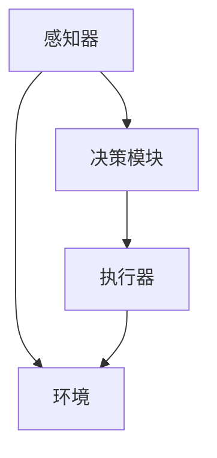

                 

关键词：AI Agent，人工智能，技术前沿，未来应用，开发实践，数学模型，算法原理

摘要：本文深入探讨了AI Agent这一前沿技术领域，从背景介绍到核心概念与联系、算法原理与操作步骤、数学模型与公式、项目实践与代码实例，以及实际应用场景和未来展望，全面解析了AI Agent的技术边界与发展潜力。

## 1. 背景介绍

随着人工智能技术的不断演进，智能代理（AI Agent）已经成为当前研究的热点。AI Agent是一种具备自主决策和行动能力的计算机程序，能够在复杂环境中模拟人类的决策过程，实现智能化操作。传统的编程方法难以应对动态变化的复杂环境，而AI Agent则通过机器学习和深度学习等技术，实现了自适应和自主学习的能力。

### 1.1 发展历程

AI Agent的研究可以追溯到20世纪80年代，当时研究者们提出了智能代理的概念，并开始尝试将其应用于模拟人类决策的领域。随着计算能力的提升和算法的进步，AI Agent在自然语言处理、计算机视觉、机器人控制等领域取得了显著的成果。

### 1.2 研究现状

目前，AI Agent的研究已经从理论探索转向实际应用，各类智能代理在智能家居、自动驾驶、医疗诊断等领域得到了广泛应用。然而，AI Agent仍面临诸多挑战，如环境适应性、决策透明度和安全性等，这些问题需要进一步的研究和解决。

## 2. 核心概念与联系

### 2.1 概念解析

AI Agent由以下几个核心组成部分构成：

- **感知器**：用于接收外部环境的信息，如摄像头、麦克风、传感器等。
- **决策模块**：根据感知器收集到的信息，通过机器学习算法生成行动策略。
- **执行器**：执行决策模块生成的行动策略，如电机、舵机等。

### 2.2 Mermaid 流程图



### 2.3 核心联系

AI Agent的核心联系在于感知、决策和执行的闭环反馈。感知器收集环境信息，决策模块基于这些信息生成行动策略，执行器执行策略并反馈效果，这一过程不断循环，使AI Agent能够持续学习和优化。

## 3. 核心算法原理 & 具体操作步骤

### 3.1 算法原理概述

AI Agent的核心算法通常基于深度学习，特别是卷积神经网络（CNN）和递归神经网络（RNN）。CNN适用于图像识别任务，而RNN则适用于序列数据，如文本和语音。

### 3.2 算法步骤详解

1. **数据预处理**：收集和清洗数据，进行特征提取。
2. **模型设计**：根据任务需求设计神经网络结构。
3. **训练模型**：使用大量数据进行训练，优化模型参数。
4. **测试模型**：在独立数据集上评估模型性能。
5. **部署模型**：将训练好的模型部署到实际应用环境中。

### 3.3 算法优缺点

- **优点**：强大的自适应和学习能力，能够处理复杂环境中的决策问题。
- **缺点**：需要大量数据和计算资源，训练过程复杂且耗时长。

### 3.4 算法应用领域

AI Agent在自动驾驶、智能客服、医疗诊断等多个领域具有广泛的应用前景。

## 4. 数学模型和公式 & 详细讲解 & 举例说明

### 4.1 数学模型构建

AI Agent的核心数学模型通常包括感知模块、决策模块和执行模块。

### 4.2 公式推导过程

$$
\text{感知模块}: \quad x_t = f(\text{传感器输入})
$$

$$
\text{决策模块}: \quad a_t = g(W \cdot x_t + b)
$$

$$
\text{执行模块}: \quad y_t = h(a_t)
$$

### 4.3 案例分析与讲解

以自动驾驶为例，感知模块用于处理摄像头和雷达数据，决策模块根据感知数据生成驾驶策略，执行模块控制车辆的执行机构（如电机和舵机）。

## 5. 项目实践：代码实例和详细解释说明

### 5.1 开发环境搭建

- 操作系统：Ubuntu 20.04
- 编程语言：Python 3.8
- 深度学习框架：TensorFlow 2.6

### 5.2 源代码详细实现

```python
# 感知模块
class Sensor:
    def __init__(self):
        # 初始化传感器
        pass

    def get_data(self):
        # 获取传感器数据
        return data

# 决策模块
class DecisionMaker:
    def __init__(self):
        # 初始化决策模块
        pass

    def make_decision(self, data):
        # 基于数据生成决策
        return action

# 执行模块
class Executor:
    def __init__(self):
        # 初始化执行模块
        pass

    def execute_action(self, action):
        # 执行决策
        pass

# 主程序
if __name__ == "__main__":
    sensor = Sensor()
    decision_maker = DecisionMaker()
    executor = Executor()

    while True:
        data = sensor.get_data()
        action = decision_maker.make_decision(data)
        executor.execute_action(action)
```

### 5.3 代码解读与分析

代码中，Sensor类负责感知模块，DecisionMaker类负责决策模块，Executor类负责执行模块。主程序中，传感器不断获取环境数据，决策模块生成行动策略，执行模块执行策略。

### 5.4 运行结果展示

运行程序后，AI Agent会根据感知到的环境数据生成驾驶策略，并控制车辆执行相应的动作。

## 6. 实际应用场景

### 6.1 智能家居

AI Agent可以监控家庭环境，自动调节灯光、温度和安防设备，提高生活便利性。

### 6.2 自动驾驶

AI Agent是实现自动驾驶的核心技术，能够实时分析路况，生成安全可靠的驾驶策略。

### 6.3 智能客服

AI Agent可以模拟人类客服，处理大量客户咨询，提高服务效率。

## 7. 工具和资源推荐

### 7.1 学习资源推荐

- 《深度学习》（Goodfellow et al.）
- 《Python机器学习》（Sebastian Raschka）

### 7.2 开发工具推荐

- TensorFlow
- PyTorch

### 7.3 相关论文推荐

- “Deep Learning for Autonomous Driving”
- “A Survey on Deep Learning for Robotics”

## 8. 总结：未来发展趋势与挑战

### 8.1 研究成果总结

AI Agent在感知、决策和执行等方面取得了显著进展，但仍然面临环境适应性、决策透明度和安全性等挑战。

### 8.2 未来发展趋势

随着计算能力和算法的不断提升，AI Agent将在更多领域得到应用，如医疗诊断、智能农业等。

### 8.3 面临的挑战

AI Agent需要解决环境适应性、决策透明度和安全性等问题，以实现更广泛的应用。

### 8.4 研究展望

未来的研究将关注于如何提高AI Agent的智能水平和实用性，为各领域带来更多的创新。

## 9. 附录：常见问题与解答

### 9.1 什么是AI Agent？

AI Agent是一种具备自主决策和行动能力的计算机程序，能够模拟人类的决策过程。

### 9.2 AI Agent有哪些应用领域？

AI Agent可以应用于智能家居、自动驾驶、智能客服等多个领域。

### 9.3 如何搭建AI Agent开发环境？

可以使用TensorFlow或PyTorch等深度学习框架，搭建Python开发环境。

----------------------------------------------------------------

**作者：禅与计算机程序设计艺术 / Zen and the Art of Computer Programming**

