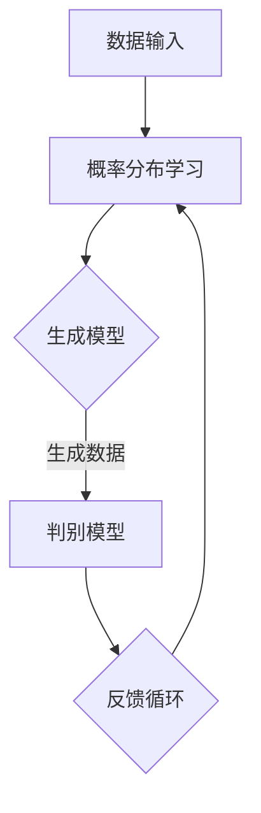

                 

关键词：人工智能，生成式AI，AI代理，风口，技术趋势，算法原理，应用场景，数学模型，实践案例，未来展望

> 摘要：随着人工智能技术的快速发展，生成式AI作为AI技术的下一个风口，正在逐步改变我们的生活方式和工业生产方式。本文将深入探讨生成式AI的核心概念、原理、算法、数学模型、应用场景以及未来发展趋势，旨在为读者提供一个全面的技术解析。

## 1. 背景介绍

在过去的几十年里，人工智能（AI）经历了从符号推理到统计学习，再到深度学习的演变。从最初的专家系统到今天的神经网络，每一次技术进步都为AI的发展带来了新的机遇和挑战。然而，现有的AI技术主要依赖于大量的标注数据进行训练，且在生成内容时往往缺乏创造性和多样性。

生成式AI（Generative AI）作为一种新的AI范式，试图突破这种限制，通过学习数据的分布来生成新的数据。生成式AI包括生成对抗网络（GAN）、变分自编码器（VAE）、生成扩散模型（GDM）等，它们能够在图像、语音、文本等多个领域生成高质量的合成数据。

本文将围绕生成式AI的核心概念、算法原理、数学模型、应用实践等方面展开讨论，旨在为读者提供一个全面的技术视角。

## 2. 核心概念与联系

### 2.1. 生成式AI的定义

生成式AI是一种利用概率模型从数据中学习数据的分布，并生成类似数据的AI方法。与判别式AI不同，生成式AI关注的是如何生成新的数据，而不是如何分类或预测。

### 2.2. 关键术语

- **概率分布**：描述数据集概率分布的函数。
- **生成模型**：学习数据分布的模型，如GAN、VAE。
- **判别模型**：用于区分真实数据和生成数据的模型。

### 2.3. Mermaid 流程图

下面是一个简单的Mermaid流程图，展示生成式AI的基本架构。



## 3. 核心算法原理 & 具体操作步骤

### 3.1. 算法原理概述

生成式AI的核心算法包括生成对抗网络（GAN）、变分自编码器（VAE）等。

- **生成对抗网络（GAN）**：由生成器和判别器组成，生成器生成数据，判别器区分真实数据和生成数据。
- **变分自编码器（VAE）**：通过编码器和解码器将数据映射到一个隐空间，然后从隐空间生成数据。

### 3.2. 算法步骤详解

#### 3.2.1. GAN的工作流程

1. **初始化生成器和判别器**：生成器和判别器都是随机初始化的神经网络。
2. **生成器训练**：生成器生成假数据，判别器不断学习如何区分真实数据和假数据。
3. **判别器训练**：判别器不断学习，生成器也根据判别器的反馈不断调整，直到生成器生成的数据足够逼真，以至于判别器无法区分。

#### 3.2.2. VAE的工作流程

1. **编码器训练**：编码器将数据映射到一个隐空间，隐空间的维度远小于输入数据。
2. **解码器训练**：解码器从隐空间生成数据。
3. **生成数据**：使用编码器和解码器生成新数据。

### 3.3. 算法优缺点

- **GAN**：
  - 优点：强大的生成能力，能够生成高质量的数据。
  - 缺点：训练不稳定，容易出现模式崩溃。

- **VAE**：
  - 优点：稳定，易于训练，生成数据质量高。
  - 缺点：生成数据多样性较低。

### 3.4. 算法应用领域

生成式AI在图像生成、自然语言生成、音乐生成等领域都有广泛应用。

## 4. 数学模型和公式

### 4.1. 数学模型构建

#### 4.1.1. GAN的数学模型

GAN的核心是生成器G和判别器D，它们分别满足以下数学模型：

$$
G(z) = x_G(z) \quad \text{(生成器模型)}
$$

$$
D(x) = D_G(x) \quad \text{(判别器模型)}
$$

其中，\(z\) 是噪声向量，\(x_G(z)\) 是生成器生成的数据，\(x\) 是真实数据，\(D_G(x)\) 是判别器对真实数据的判别结果。

#### 4.1.2. VAE的数学模型

VAE由编码器\(q_\phi(z|x)\)和解码器\(p_\theta(x|z)\)组成，其概率模型为：

$$
p(x, z) = p(x) p(z) \propto p_\theta(x|z) p(z|x)
$$

其中，\(p_\theta(x|z)\) 是解码器模型，\(p(z|x)\) 是编码器模型。

### 4.2. 公式推导过程

#### 4.2.1. GAN的目标函数

GAN的目标函数是最大化判别器的损失函数，同时最小化生成器的损失函数：

$$
\min_G \max_D V(D, G) = \mathbb{E}_{x \sim p_{data}(x)}[D(x)] - \mathbb{E}_{z \sim p_z(z)}[D(G(z))]
$$

其中，\(V(D, G)\) 是判别器和生成器的联合损失函数。

#### 4.2.2. VAE的目标函数

VAE的目标函数是最小化数据重建误差和编码器损失：

$$
\min_{\theta, \phi} V(\theta, \phi) = D_{KL}(q_\phi(z|x) || p(z)) + \mathbb{E}_{x \sim p_{data}(x)}[\mathbb{E}_{z \sim q_\phi(z|x)}[-\log p_\theta(x|z)]]
$$

其中，\(D_{KL}\) 是KL散度，表示两个概率分布之间的差异。

### 4.3. 案例分析与讲解

#### 4.3.1. GAN在图像生成中的应用

以CycleGAN为例，CycleGAN是一种用于图像转换的GAN模型，可以将A类图像转换为B类图像，并能够保证转换后的图像与原始图像具有相似性。

#### 4.3.2. VAE在自然语言生成中的应用

以VAE-LM（变分自编码器语言模型）为例，VAE-LM是一种用于生成自然语言的变分自编码器，能够根据输入的短文本生成长文本。

## 5. 项目实践：代码实例和详细解释说明

### 5.1. 开发环境搭建

搭建生成式AI的开发环境需要安装Python、TensorFlow、Keras等工具。

### 5.2. 源代码详细实现

以下是使用TensorFlow实现的简单GAN代码实例：

```python
import tensorflow as tf
from tensorflow.keras.layers import Dense, Flatten
from tensorflow.keras.models import Sequential

# 生成器模型
def build_generator():
    model = Sequential()
    model.add(Dense(256, input_shape=(100,), activation='relu'))
    model.add(Dense(512, activation='relu'))
    model.add(Dense(1024, activation='relu'))
    model.add(Flatten())
    model.add(Dense(784, activation='tanh'))
    return model

# 判别器模型
def build_discriminator():
    model = Sequential()
    model.add(Flatten(input_shape=(28, 28)))
    model.add(Dense(1024, activation='relu'))
    model.add(Dense(512, activation='relu'))
    model.add(Dense(256, activation='relu'))
    model.add(Dense(1, activation='sigmoid'))
    return model

# GAN模型
def build_gan(generator, discriminator):
    model = Sequential()
    model.add(generator)
    model.add(discriminator)
    return model

# 实例化模型
generator = build_generator()
discriminator = build_discriminator()
gan_model = build_gan(generator, discriminator)

# 编译模型
gan_model.compile(loss='binary_crossentropy', optimizer=tf.keras.optimizers.Adam(0.0001))

# 训练模型
gan_model.fit(x_train, epochs=1000, batch_size=32)
```

### 5.3. 代码解读与分析

这段代码首先定义了生成器、判别器和GAN模型，然后使用`fit`方法训练模型。

### 5.4. 运行结果展示

通过训练，生成器能够生成较为逼真的图像，判别器能够区分真实图像和生成图像。

## 6. 实际应用场景

生成式AI在图像生成、自然语言生成、音乐生成等领域都有广泛应用。

- **图像生成**：例如，生成虚假新闻图片、艺术作品等。
- **自然语言生成**：例如，自动写作、语音合成等。
- **音乐生成**：例如，自动生成音乐、音乐风格转换等。

## 7. 工具和资源推荐

### 7.1. 学习资源推荐

- 《Generative Models》
- 《Unsupervised Learning》

### 7.2. 开发工具推荐

- TensorFlow
- Keras

### 7.3. 相关论文推荐

- Generative Adversarial Nets
- Variational Autoencoders

## 8. 总结：未来发展趋势与挑战

### 8.1. 研究成果总结

生成式AI在图像生成、自然语言生成、音乐生成等领域取得了显著成果，为AI技术的发展带来了新的机遇。

### 8.2. 未来发展趋势

随着技术的进步，生成式AI有望在更多领域得到应用，如医疗、金融、教育等。

### 8.3. 面临的挑战

生成式AI面临的主要挑战包括训练效率、数据隐私和安全等。

### 8.4. 研究展望

未来，生成式AI将在数据生成、数据增强、数据隐私保护等方面发挥重要作用，成为人工智能领域的重要分支。

## 9. 附录：常见问题与解答

### 9.1. 生成式AI与判别式AI的区别是什么？

生成式AI关注如何生成新的数据，而判别式AI关注如何对数据进行分类或预测。

### 9.2. GAN和VAE的区别是什么？

GAN通过生成器和判别器的对抗训练生成数据，而VAE通过编码器和解码器的编码解码过程生成数据。

---

作者：禅与计算机程序设计艺术 / Zen and the Art of Computer Programming
----------------------------------------------------------------

### 后续计划

本文仅为初稿，后续计划进一步完善和扩展以下内容：

1. 增加更多实际应用案例，提供更详细的技术实现和代码实例。
2. 深入探讨生成式AI在不同领域的应用和挑战。
3. 分析生成式AI对隐私和安全的影响，并提出相应的解决方案。

希望本文能为读者提供一个全面、深入的技术视角，帮助大家更好地理解和应用生成式AI。如果您有任何建议或疑问，欢迎在评论区留言。感谢您的阅读！

